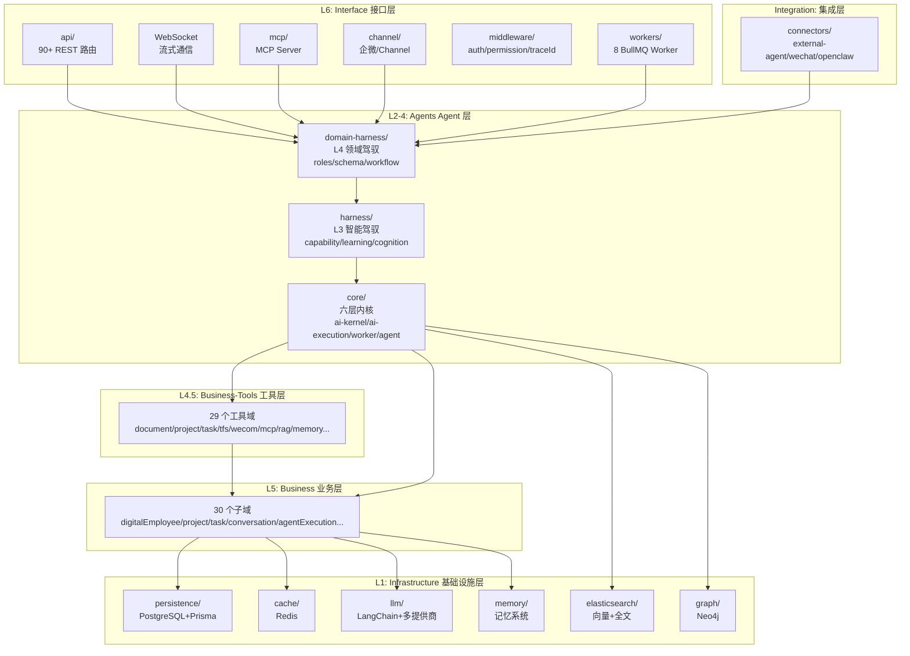
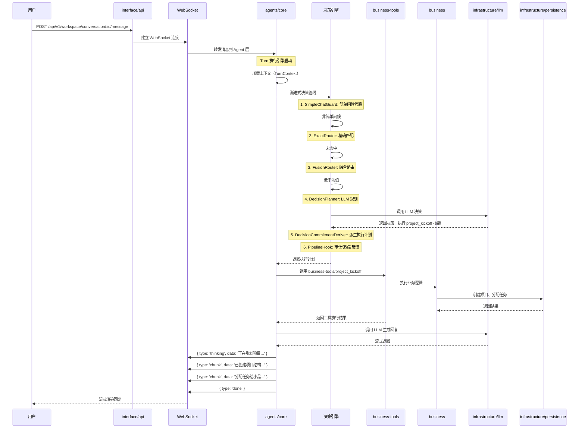

# 第 1 章 全景概览

> "理解一个大型系统，首先要站在足够高的地方俯瞰全局。"

WinMatrix（翠花）是一个企业级 AI 数字员工协作平台。它不仅仅是一个聊天机器人或 AI 助手 —— 而是一个完整的、让 AI 作为团队成员与人类协同工作的运行时系统。本章将从产品定位出发，逐步深入其技术选型、代码组织和架构分层，最终通过一次完整对话的数据流追踪，帮助读者建立起对整个系统的全局认知。

## 1.1 WinMatrix 是什么

WinMatrix 本质上是一个**AI 数字员工协作运行时**。在这里，AI 不再是被动等待指令的工具，而是拥有角色、技能、记忆和工具的"数字员工"，能够主动观察、思考和行动，与人类同事一起完成从项目启动到交付的全流程。

其核心能力包括：

- **数字员工管理**：七大内置角色（大福/阿宁/小品/阿码/小质/大维/Architector），每个角色拥有独立的技能集、工具绑定和记忆空间
- **渐进式决策引擎**：六阶段决策管线（SimpleChatGuard → ExactRouter → FusionRouter → DecisionPlanner → DecisionCommitmentDeriver → PipelineHook），实现从精确匹配到 LLM 规划的渐进路由
- **多 Agent 协作**：支持 interactive（轮流协作）、coordinator（多步编排）、react（单 Agent 推理）、skill（直接技能执行）、workstation（沙箱编码）五种执行模式
- **五层记忆系统**：从 Working Memory（50 项）到 Long-term Memory（10000 项），支持向量检索与全文检索的混合查询
- **技能治理体系**：30+ 内置技能，从文件定义到运行时加载，支持技能市场、角色绑定、项目白名单
- **工具执行系统**：29 个业务工具域（document / project / task / TFS / WeChat / MCP / RAG / memory / workstation...），每个工具都有独立的权限检查和上下文管理
- **知识库与 RAG**：支持 PDF / Word / Excel / Markdown 文档摄入，Elasticsearch kNN 向量检索 + 全文检索
- **多渠道集成**：企业微信 OAuth + 消息通道、MCP 协议（双向：Server + Consumer）、外部 Agent 协作
- **可观测性**：全链路 Span 追踪、Agent 执行日志、API 审计、性能指标

从 `src/business/domain/digitalEmployee/` 的领域模型可以看到，数字员工不仅仅是一个配置项，而是一个完整的实体：

```typescript
// src/business/domain/digitalEmployee/
// DigitalEmployee 实体包含：
// - 角色定义（role）
// - 技能绑定（skills）
// - 工具权限（tools）
// - 记忆空间（memory）
// - 提示词模板（promptTemplate）
// - 能力配置（capabilities）
```

这种设计使得每个数字员工都像一个真正的团队成员 —— 有自己的专长（技能）、能使用的工具（工具绑定）、积累的经验（记忆）和行为准则（提示词模板）。

## 1.2 技术栈选型

### Fastify 作为 Web 框架

WinMatrix 选择了 Fastify 5 而非更常见的 Express 或 NestJS。从 `src/interface/core/app.ts` 的插件注册链可以看出这一选择的理由：

```typescript
// src/interface/core/app.ts
export async function createApp(
  routeDependencies: ApiRouteDependencies,
): Promise<import('fastify').FastifyInstance> {
  const server = Fastify({
    logger: true,
    bodyLimit: 50 * 1024 * 1024,  // 50MB
    pluginTimeout: 60_000,
  });

  // 1) CORS
  await server.register(cors, {
    origin: true,
    methods: ['GET', 'POST', 'PUT', 'PATCH', 'DELETE', 'OPTIONS'],
    allowedHeaders: ['Content-Type', 'Authorization', 'X-Auth-Token', 'Accept'],
    credentials: true,
  });

  // 2) TraceId 链路追踪
  registerTraceIdMiddleware(server);

  // 3) API 审计日志
  registerApiAuditLogMiddleware(server);

  // 4) 表单 & multipart
  await server.register(formbody);
  await server.register(multipart, { limits: { fileSize: MULTIPART_MAX_FILE_BYTES } });

  // 5) Cookie + secure-session
  await server.register(cookie);
  const sessionKey = createHash('sha256').update(config.sessionSecret, 'utf8').digest();
  await server.register(secureSession, {
    key: sessionKey,
    cookie: {
      secure: config.nodeEnv === 'production',
      httpOnly: true,
      sameSite: config.nodeEnv === 'production' ? 'none' : 'lax',
      maxAge: 86400000,
    },
  });

  // 6) WebSocket
  await server.register(websocket);

  // 7) 限流（X-Forwarded-For 真实 IP 分桶）
  await server.register(rateLimit, {
    max: Number(process.env.RATE_LIMIT_MAX ?? 1000),
    timeWindow: process.env.RATE_LIMIT_WINDOW ?? '1 minute',
    keyGenerator: (request) => {
      const xff = request.headers['x-forwarded-for'];
      const xffStr = Array.isArray(xff) ? xff[0] : xff;
      const realIp = xffStr ? xffStr.split(',')[0]?.trim() : '';
      return realIp || request.ip;
    },
  });
  // ...
}
```

Fastify 的优势在于：

- **插件体系的封装性**：每个插件（cors / websocket / rate-limit / secure-session）都有独立的作用域，避免全局污染
- **原生 TypeScript 支持**：无需额外配置，类型推断完整
- **高性能**：相比 Express，Fastify 的吞吐量高出约 2-3 倍，对于需要处理大量并发 WebSocket 连接的 AI 平台至关重要
- **WebSocket 原生集成**：`@fastify/websocket` 与 Fastify 的请求生命周期无缝集成
- **Schema 验证**：内置 JSON Schema 验证，与 Zod 配合使用

### 多数据库混合存储

WinMatrix 没有选择单一数据库，而是根据数据特性选择了四种存储引擎：

| 存储引擎 | 用途 | 数据特性 |
|---------|------|---------|
| **PostgreSQL + Prisma 7** | 核心业务数据 | 121 个模型，强一致性事务 |
| **Redis + BullMQ** | 缓存 + 任务队列 | 高速读写，分布式锁 |
| **Elasticsearch 8** | 向量检索 + 全文搜索 | kNN 向量搜索，日志分析 |
| **Neo4j** | 知识图谱 | 关系型数据，图遍历 |

这种混合存储策略的权衡在于：

- **PostgreSQL** 作为主存储，Prisma ORM 提供类型安全的数据库访问，40+ 迁移文件记录了数据库的演进历史
- **Redis** 不仅用于缓存，更通过 BullMQ 实现了 8 种异步 Worker（kickoff / memory-sync / role-inbox / scheduled-task / cross-agent-trigger / tfs-query-export / async-continuation / trace-extract）
- **Elasticsearch** 同时承担两个角色：向量检索（RAG 知识库）和全文搜索（记忆系统、日志）
- **Neo4j** 用于知识图谱，支持复杂的关系遍历

### LangChain + 多 LLM 提供商

AI 能力层使用 LangChain 作为编排框架，同时支持多个 LLM 提供商：

```json
// package.json
"@anthropic-ai/sdk": "^0.39",
"openai": "^4.76",
"@google/genai": "^1.46",
"@langchain/core": "..."
```

这种多提供商策略使得系统可以根据任务特性（成本、速度、质量）动态选择最合适的模型。

### 进程角色拆分

WinMatrix 支持两种部署模式：

**开发模式（单体）**：单进程运行所有功能
```bash
npm run dev  # node src/index.ts
```

**生产模式（拆分）**：三个独立进程
```bash
# API 进程
WIN_PROCESS_ROLE=api node dist/api.js

# 定时任务进程
WIN_PROCESS_ROLE=scheduled node dist/scheduled-worker.js

# RAG 进程
WIN_PROCESS_ROLE=rag node dist/rag-worker.js
```

这种设计的优势在于：

- **资源隔离**：CPU 密集型的 RAG 处理不会影响 API 响应
- **独立扩缩容**：可以根据负载独立扩展 API 进程数量
- **故障隔离**：Worker 崩溃不会导致 API 不可用

从 `src/api.ts` 的入口代码可以看到进程角色的守卫机制：

```typescript
// src/api.ts
#!/usr/bin/env node
/**
 * WinMatrix API 生产入口 — WIN_PROCESS_ROLE=api
 *
 * Role guard runs before dynamic import so Prisma/worker modules are not loaded on mismatch.
 */

import './infrastructure/sandbox/config/undiciConfig.js';
import { assertProcessRole } from '@/startup/processRole.js';

try {
  assertProcessRole('api');
} catch (err) {
  const message = err instanceof Error ? err.message : String(err);
  process.stderr.write(`[ProcessRole] API entry startup aborted: ${message}\n`);
  process.exit(1);
}

await import('@/startup/apiEntry.js');
```

`assertProcessRole('api')` 在动态导入之前执行，确保如果进程角色不匹配，Prisma 和 Worker 模块不会被加载 —— 这是一种编译时优化的思想。

## 1.3 代码库全景

WinMatrix 是一个 monorepo 项目，包含多个子项目：

```
winmatrix/
├── winmatrix-server/          # 后端服务（本书分析对象）
├── winmatrix-ui/              # 前端（Vue 3 + Vite）
├── clients/                   # 共享包（npm workspaces）
│   ├── protocol/              #   @winmatrix/protocol — 共享类型/Schema
│   ├── agent-sdk/             #   @winmatrix/agent-sdk — 多适配器 SDK
│   └── daemon/                #   @winmatrix/daemon — CLI 守护进程
├── sandbox-api/               # Go 沙箱服务（K8s Pod 管理）
├── coding-workstation/        # Python + React 编码工作站 HUD
├── docker/                    # Docker Compose + Dockerfile
├── k8s/                       # Kubernetes 部署清单
├── scripts/                   # 部署、CI、迁移脚本
└── docs/                      # 架构文档
```

`winmatrix-server` 的 `src/` 目录包含 60+ 个顶层模块。以下是各模块的职责划分：

```
src/
├── index.ts                 # dev all-in-one 入口 (248 行)
├── api.ts                   # 生产 API 入口 (19 行)
├── rag-worker.ts            # RAG 独立进程入口
├── scheduled-worker.ts      # Scheduled 独立进程入口
├── embedding-server.ts      # Embedding 服务入口（端口 8401）
│
├── agents/                  # Agent 层（L2-4）
│   ├── core/                #   六层内核 (ai-kernel/ ai-execution/ worker/ agent/ runtime/)
│   ├── domain-harness/      #   L4 领域驾驭 (roles/ schema/ workflow/ policy/)
│   └── harness/             #   L3 智能驾驭 (capability/ learning/ cognition/ deliberation/)
│
├── interface/               # 接口层（L6）
│   ├── api/                 #   90+ 路由文件
│   ├── channel/             #   Channel 层 (web-api / scheduled / wecom-aibot)
│   ├── core/                #   app.ts — Fastify 工厂
│   ├── mcp/                 #   MCP Server
│   ├── middleware/          #   auth / error / permission / traceId / audit
│   └── workers/             #   8 个 BullMQ Worker
│
├── business/                # 业务逻辑层（L5，30 子域）
│   ├── application/         #   dto / services / toolCall / utils
│   └── domain/              #   agentExecution / conversation / digitalEmployee / project / task / ...
│
├── business-tools/          # 工具层（L4.5，29 个工具域）
│   ├── document/ email/ image/ interaction/ kdocs/ knowledgeBase/
│   ├── mcp/ member/ memory/ meta/ notification/ orchestration/
│   ├── project/ rag/ scheduled/ session/ shared/ skill/ sql/
│   ├── task/ tfs/ web/ wecom-contact/ wecom-document/ wecom-schedule/
│   └── workflow/ workstation/
│
├── infrastructure/          # 基础设施层（L1，42 目录）
│   ├── persistence/ llm/ memory/ mcp/ elasticsearch/ vectorstore/
│   ├── config/ observability/ scheduled/ cache/ auth/ sandbox/ rag/
│   └── ... (更多基础设施模块)
│
├── integration/             # 集成层（横切连接器）
│   └── connectors/          #   external-agent/ wechat/ openclaw/
│
├── startup/                 # 启动引导（横切）
│   ├── common.ts            #   initInfrastructure / gracefulExit / logStep
│   ├── api.ts               #   apiServer / startListening
│   └── shutdown/            #   关闭序列
│
├── config/                  # 配置
├── types/                   # 跨层共享类型（14 文件）
└── shared/                  # 跨层共享值
```

这个目录结构的核心特征是**严格的分层**。每一层都有明确的职责边界和依赖规则，这在下一节会详细展开。

## 1.4 六层架构

WinMatrix 的架构可以分为六个清晰的层次。每一层向上提供抽象，向下依赖具体实现。



**L6 —— Interface 接口层**：负责 HTTP/WebSocket 请求处理、路由分发、中间件管线。`interface/api/` 包含 90+ 路由文件，按领域组织（auth / projects / employees / agents / skills / tasks / documents / knowledge-bases / dashboard / scheduled / external / coding / system / admin）。`interface/workers/` 包含 8 个 BullMQ Worker，处理异步任务。

**L2-4 —— Agents Agent 层**：这是系统的大脑。分为三个子层：
- `harness/`（L3 智能驾驭）：能力管理、学习机制、认知处理、决策审议
- `domain-harness/`（L4 领域驾驭）：角色定义、Schema 验证、工作流、策略评估
- `core/`（六层内核）：AI 内核、执行引擎、Worker 管理、Agent 生命周期、运行时、内核管理

**Integration —— 集成层**：横切连接器，负责与外部系统集成（企业微信、外部 Agent、OpenClaw）。

**L4.5 —— Business-Tools 工具层**：29 个薄包装工具，每个工具封装了对 Business 层的调用，并添加权限检查、上下文注入、结果处理。

**L5 —— Business 业务层**：30 个业务子域，包含核心业务逻辑（数字员工、项目、任务、对话、Agent 执行记录）。

**L1 —— Infrastructure 基础设施层**：42 个基础设施模块，提供数据库、缓存、LLM、记忆、搜索、认证等基础能力。

### 依赖规则

六层架构的关键在于**严格的单向依赖**。从 `CLAUDE.md` 的依赖规则可以看到：

| ✅ 允许 | ❌ 禁止 |
|---------|---------|
| `interface → agents` | `agents → interface` |
| `agents → business-tools` | `agents → business`（直接） |
| `business-tools → business` | `business-tools → agents` |
| `business → infrastructure` | `infrastructure → business` |
| `interface → 任意下层` | `L3 harness ↔ L4 domain-harness`（横向隔离） |

这种依赖规则通过强制检查脚本保证：

```bash
npm run check:layers              # 分层依赖检查
npm run check:agent-layers:strict # Kernel import 边界强制验证
npm run check:tool-kernel-consumption  # Tool Kernel 消费检查
```

违反依赖规则的导入会在 CI 阶段被拦截，确保架构的可维护性。

### 分层的设计原则

1. **单向依赖**：上层可以依赖下层，反之则通过接口注入或回调实现反向通信
2. **依赖倒置**：Agents 层定义 Port 接口（如 `IDigitalEmployeeRepository`），Business 层实现，Startup 阶段注入
3. **信息隐藏**：上下文对象在传递过程中逐层投影，每层只能看到自己需要的字段
4. **故障隔离**：每一层都有独立的错误处理策略，避免错误扩散

## 1.5 核心数据流

理解 WinMatrix 最有效的方式是跟踪一次完整对话的旅程。当用户在项目空间发送一条消息"启动新项目"时，系统内部发生了什么？



让我们深入每个关键阶段。

### 阶段 1：消息提交与上下文组装

当用户发送消息时，首先通过 REST API 提交，然后建立 WebSocket 连接用于流式通信：

```typescript
// src/interface/api/workspace.ts（概念性）
// POST /api/v1/workspace/conversation/:conversationId/message
// 请求体：{ content: "启动新项目" }

// 1. 验证 JWT 认证
// 2. 检查项目权限（projectPermission 中间件）
// 3. 创建对话消息记录
// 4. 触发 Agent 处理
```

Agent 层收到消息后，首先组装执行上下文：

```typescript
// src/agents/core/ai-execution/turnRunner.ts（概念性）
// TurnRunner 负责一次完整的 Turn 执行

// 1. 加载对话历史（conversation_histories）
// 2. 加载数字员工配置（agent_config + prompt_template）
// 3. 加载项目上下文（项目信息、凭证、知识库）
// 4. 加载记忆（working memory + session memory）
// 5. 组装 TurnContext

const turnContext: TurnContext = {
  conversationId,
  digitalEmployeeId,
  projectId,
  userMessage,
  conversationHistory,
  employeeConfig,
  projectContext,
  workingMemory,
  sessionMemory,
  // ... 更多上下文字段
};
```

上下文对象在传递过程中会经历 5 层投影，每层删除下层不需要的字段，强制信息隐藏：

```
ChatPipelineInput（入口层，最丰富）
  ↓
UnifiedDecisionContext（决策层，增加信号）
  ↓
DecisionContext（增加 candidateSkills, promptData）
  ↓
AgentExecutionTicket（冻结接缝：decision + context + runtime）
  ↓
ToolExecutionContext（工具级：employee + project + permissions）
```

### 阶段 2：渐进式决策

决策引擎是 WinMatrix 的核心创新。它不是简单地调用 LLM 决定"做什么"，而是通过六阶段管线渐进式地做出决策。从 `src/agents/core/agent/decision/DecisionEngine.ts` 可以看到完整的管线结构：

```typescript
// src/agents/core/agent/decision/DecisionEngine.ts
// 六阶段决策管线

// Stage 1: SimpleChatGuard — 简单问候短路
// 如果消息是"你好"、"谢谢"等简单问候，直接返回预设回复，不调用 LLM
const simpleGuard = await simpleChatGuard.evaluate(turnContext);
if (simpleGuard.shouldShortCircuit) return simpleGuard.response;

// Stage 2: ExactRouter — 精确路由匹配
// 如果消息完全匹配预定义的路由规则（@mention、/slash、精确技能/工具匹配），直接执行
const exactMatch = await exactRouter.route(turnContext);
if (exactMatch) return exactMatch;

// Stage 3: FusionRouterStage — 多信号融合路由
// 综合正则匹配、意图关键词、语义相似度进行加权路由
const fusionMatch = await fusionRouter.route(turnContext);
if (fusionMatch && fusionMatch.score >= route.semanticThreshold) {
  return fusionMatch;
}
// 如果分数低于阈值，继续交给 LLM 决策

// Stage 4: DecisionPlanner — LLM 辅助规划（~1258 行）
// 调用 LLM 进行复杂决策，使用 Zod Schema + tool calling，含重试机制
const plan = await decisionPlanner.plan(turnContext);

// Stage 5: DecisionCommitmentDeriver — 确定性派生 ExecutionPlan
// 将 LLM 的输出派生为确定性的执行计划
const executionPlan = commitmentDeriver.derive(plan);

// Stage 6: PipelineHook 链 — 横切关注点处理
// 6 个 Hook：Audit / Feedback / Progress / CapabilitySnapshot / DecisionEvent / StageTrace
await pipelineHooks.finalize(executionPlan);
return executionPlan;
```

### 融合路由算法

FusionRouter 的核心是一个多信号加权融合算法。从 `src/agents/core/agent/decision/fusion-router.ts` 可以看到：

```typescript
// src/agents/core/agent/decision/fusion-router.ts
// 信号融合算法：
//   正则匹配：+0.9 权重
//   正向意图关键词：+0.2
//   负向意图关键词：-0.8
//   语义相似度：maxSim * 0.6
//
// 路由决策：
//   score >= route.semanticThreshold → 确定性路由
//   score < route.semanticThreshold → 交给下游 LLM 决策管道
//
// 影子模式（shadow）：
//   status='shadow' 命中时只记录指标不路由

function calculateRouteScore(
  regexMatch: boolean,
  intentKeywords: string[],
  semanticSimilarity: number,
): number {
  let score = 0;
  if (regexMatch) score += 0.9;
  for (const kw of intentKeywords) {
    score += kw.startsWith('+') ? 0.2 : -0.8;
  }
  score += semanticSimilarity * 0.6;
  return score;
}
```

路由规则可以从 YAML 配置加载，也可以从数据库动态加载。从 `src/infrastructure/config/specs/deterministic-routes.yaml` 可以看到规则定义：

```yaml
# src/infrastructure/config/specs/deterministic-routes.yaml
routes:
  - id: daily_plan
    roleId: process_manager
    mode: skill
    skillName: daily_plan
    patterns: ["^每日早会", "^早会"]
    semanticThreshold: 0.88

  - id: code_review
    roleId: tech_manager
    mode: skill
    skillName: code_review
    patterns: ["^代码评审", "^CR", "^代码审查"]
    semanticThreshold: 0.85

  - id: external_agent_coding
    roleId: external-agent
    mode: direct
    patterns: ["^写代码", "^帮我写", "^修复bug", "^重构"]
    semanticThreshold: 0.82
```

生产运行时以 **数据库为唯一真源**（`reloadFromDB()`），每 30 秒 TTL 刷新。DB 失败时进入降级模式（零规则），不回退 YAML。

### 语义缓存

为了减少 LLM 调用成本，决策引擎还包含一个语义缓存（`SemanticPlannerCache`），使用 embedding 最近邻检索，余弦相似度 ≥ 0.95 时直接复用历史决策：

```typescript
// src/agents/core/agent/decision/SemanticPlannerCache.ts
// 语义缓存：embedding 最近邻检索
// cos >= 0.95 → 复用历史决策
// Redis + 内存双级缓存
```

这种渐进式设计的优势在于：

- **性能优化**：简单请求在前几个阶段就能命中，无需调用 LLM，节省 token 成本
- **语义缓存**：相似请求可以复用历史决策，进一步降低 LLM 调用
- **决策质量**：复杂请求通过 LLM 规划，保证决策质量
- **可解释性**：6 个 PipelineHook 记录每个阶段的决策日志，便于调试和优化

### 阶段 3：工具执行

决策完成后，系统调用对应的业务工具。每个工具执行都要经过权限检查和上下文注入：

```typescript
// src/business-tools/project/projectKickoffTool.ts（概念性）
export class ProjectKickoffTool {
  async execute(
    input: ProjectKickoffInput,
    context: ToolExecutionContext,
  ): Promise<ToolResult> {
    // 1. 权限检查
    const permission = await this.checkPermissions(input, context);
    if (permission.behavior === 'deny') {
      return { success: false, error: permission.message };
    }
    
    // 2. 参数验证
    const validatedInput = this.inputSchema.parse(input);
    
    // 3. 调用业务逻辑
    const result = await this.projectService.kickoff(
      validatedInput,
      context.project,
      context.digitalEmployee,
    );
    
    // 4. 返回结果
    return {
      success: true,
      data: result,
      newMessages: [
        { role: 'assistant', content: '已创建项目结构...' }
      ],
    };
  }
}
```

工具执行的结果会追加到对话历史中，并可能触发后续的工具调用（例如，创建项目后自动分配任务）。

### 阶段 4：流式输出

整个执行过程通过 WebSocket 实时流式返回给用户：

```typescript
// WebSocket 消息协议
type StreamingMessage =
  | { type: 'thinking'; data: string }      // Agent 思考过程
  | { type: 'chunk'; data: string }          // 回复内容片段
  | { type: 'tool_execution'; data: any }    // 工具执行进度
  | { type: 'done' }                          // 完成信号
  | { type: 'error'; data: string };         // 错误消息
```

这种流式输出的优势在于：

- **实时反馈**：用户可以在 Agent 还在思考时就看到进度
- **长任务友好**：复杂任务可能需要几十秒，流式输出避免用户等待焦虑
- **可中断**：用户可以随时中断执行

### 阶段 5：记忆同步

对话完成后，系统会异步提取有价值的信息存入长期记忆：

```typescript
// src/interface/workers/memorySyncWorker.ts（概念性）
// BullMQ Worker 异步处理

export async function processMemorySync(job: Job<MemorySyncData>) {
  const { conversationId, transcript } = job.data;
  
  // 1. 调用 LLM 提取关键信息
  const insights = await llm.extractInsights(transcript);
  
  // 2. 向量化
  const embeddings = await embeddingService.embed(insights);
  
  // 3. 存入长期记忆
  await memoryService.storeLongTerm({
    conversationId,
    insights,
    embeddings,
  });
  
  // 4. 更新向量索引（Elasticsearch）
  await elasticsearchService.index(embeddings);
}
```

这个 Worker 由 `memorySyncWorker` 触发，确保每次对话的有价值信息都能被积累，供未来的对话使用。

## 本章小结

本章建立了对 WinMatrix 的全局认知：

1. **产品本质**：不是简单的 AI 聊天工具，而是一个完整的 AI 数字员工协作运行时，让 AI 作为团队成员参与项目全流程
2. **技术选型逻辑**：Fastify 的高性能和插件体系支撑了复杂的中间件管线；多数据库混合存储策略根据数据特性选择最合适的引擎；进程角色拆分实现了资源隔离和独立扩缩容
3. **六层架构**：从 Interface 到 Infrastructure，每一层有明确的职责边界和严格的单向依赖规则
4. **数据流特征**：六阶段渐进式决策管线 + 语义缓存 + 流式输出 + 异步记忆同步，实现了性能、质量和用户体验的平衡

在接下来的章节中，我们将深入每一层的实现细节，从启动流程开始。
