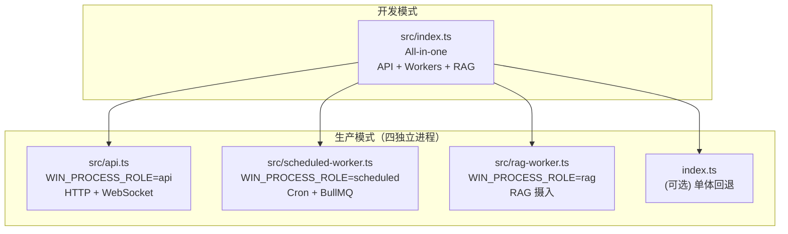
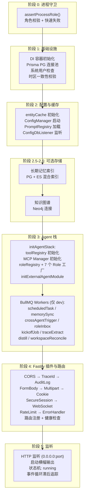
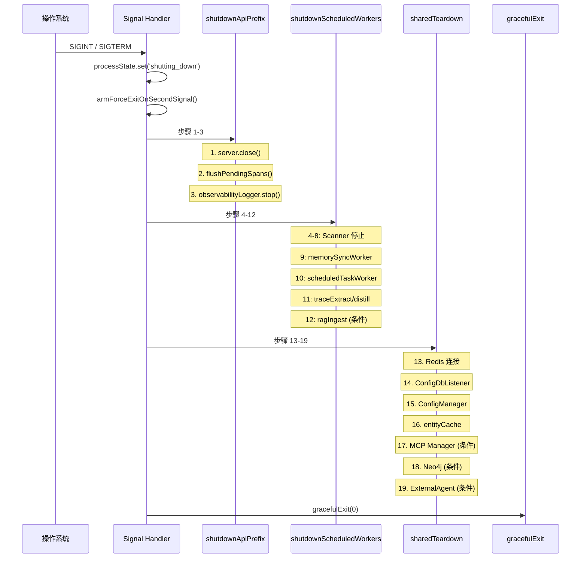

# 第 2 章 启动流程与进程模型

> "看一个系统如何启动，就知道它如何组织世界。"

启动流程是理解任何大型系统的第一把钥匙。WinMatrix 的启动过程包含了进程角色拆分、状态机编排、依赖注入初始化和优雅关闭 —— 这一切都精确地体现了六层架构的设计原则。本章将从最外层的入口文件出发，逐层深入启动管线，最终理解系统是如何从一个空白的主机状态变为可以服务请求的运行状态的。

## 2.1 四入口体系：开发单体 vs 生产拆分

WinMatrix 有四个入口文件，对应四种部署模式。这种设计允许开发时单进程调试全功能，生产时按资源特性拆分进程。

```typescript
// src/index.ts — dev all-in-one 入口
/**
 * WinMatrix Server - dev all-in-one 入口（非生产）
 */
```

```typescript
// src/api.ts — 生产 API 入口
/**
 * WinMatrix API 生产入口 — WIN_PROCESS_ROLE=api
 *
 * Role guard runs before dynamic import so Prisma/worker modules
 * are not loaded on mismatch.
 */
```

```typescript
// src/scheduled-worker.ts — 定时任务入口
/**
 * WinMatrix scheduled-worker 生产入口 — WIN_PROCESS_ROLE=scheduled
 */
```

```typescript
// src/rag-worker.ts — RAG 入口
/**
 * WinMatrix rag-worker 生产入口 — WIN_PROCESS_ROLE=rag
 */
```

这四个入口背后是一个精妙的设计决策：**所有入口共享同一份源码，通过环境变量控制行为**。这不是简单的 `if/else` 分支，而是一种编译时角色守卫机制。

## 2.2 进程角色守卫：动态导入前的快速失败

三个生产入口（api / scheduled / rag）都遵循相同的模式：

```typescript
// src/api.ts（完整 19 行）
#!/usr/bin/env node

import './infrastructure/sandbox/config/undiciConfig.js';
import { assertProcessRole } from '@/startup/processRole.js';

try {
  assertProcessRole('api');
} catch (err) {
  const message = err instanceof Error ? err.message : String(err);
  process.stderr.write(`[ProcessRole] API entry startup aborted: ${message}\n`);
  process.exit(1);
}

await import('@/startup/apiEntry.js');
```

这里的核心是 `assertProcessRole`，位于 `src/startup/processRole.ts`：

```typescript
// src/startup/processRole.ts
export type ProcessRole = 'api' | 'scheduled' | 'rag';

/**
 * Fail-fast when WIN_PROCESS_ROLE does not match the dedicated entry file.
 */
export function assertProcessRole(expected: ProcessRole): void {
  const actual = process.env.WIN_PROCESS_ROLE?.trim();
  if (actual !== expected) {
    const hint =
      actual === undefined || actual === ''
        ? 'WIN_PROCESS_ROLE is unset'
        : `WIN_PROCESS_ROLE=${actual}`;
    throw new Error(
      `[ProcessRole] Entry requires WIN_PROCESS_ROLE=${expected}, but ${hint}. ` +
        'Fix manifest command/env mismatch before starting.',
    );
  }
}
```

这个守卫的关键在于**它在动态导入之前执行**。如果进程角色不匹配，它会立即失败 —— 这意味着 Prisma、BullMQ Worker、LLM 客户端等重量级模块都不会被加载。这是一种编译时优化的思想：将错误检测尽可能提前到模块加载之前。

生产启动脚本清晰地展示了这种对应关系：

```json
// package.json
{
  "scripts": {
    "start:prod:api": "WIN_PROCESS_ROLE=api node dist/api.js",
    "start:prod:scheduled": "WIN_PROCESS_ROLE=scheduled node dist/scheduled-worker.js",
    "start:prod:rag": "WIN_PROCESS_ROLE=rag node dist/rag-worker.js",
    "start:prod:monolith": "node dist/index.js"
  }
}
```

### 四进程的职责划分



这种拆分的好处在于：

- **资源隔离**：CPU 密集型的 RAG 向量化不会阻塞 API 的 HTTP 响应
- **独立扩缩容**：可以根据流量独立增加 API 进程数，而不影响 Worker 进程
- **故障隔离**：Scheduled Worker 中的定时任务崩溃不会导致 API 不可用
- **部署灵活性**：小规模部署可以使用单体模式，大规模部署可以拆分成多个进程

## 2.3 From API Entry to Running：生产模式的启动管线

生产 API 入口 `apiEntry.ts` 虽然只有 21 行，但它精确地编排了启动流程：

```typescript
// src/startup/apiEntry.ts（完整 21 行）
import { logger } from '@/infrastructure/logging/logger.js';
import {
  installLangChainConsoleWarnFilter,
  registerFatalProcessHandlers,
  registerShutdownSignalHandlers,
} from '@/startup/common.js';
import { apiServer, shutdownApi, startApi } from '@/startup/api.js';

if (process.stdout.setDefaultEncoding) process.stdout.setDefaultEncoding('utf8');
if (process.stderr.setDefaultEncoding) process.stderr.setDefaultEncoding('utf8');

installLangChainConsoleWarnFilter();

registerFatalProcessHandlers();
registerShutdownSignalHandlers(() => shutdownApi(), { logToFastify: apiServer });

const isStartupDebug = (): boolean => process.env.LOG_LEVEL === 'debug';
if (isStartupDebug()) logger.debug('[Startup] 调用 startApi()...');

void startApi();
```

启动管线的三个阶段：

1. **环境准备**：UTF-8 编码设置 + LangChain 控制台警告过滤
2. **信号处理注册**：fatal 处理器（uncaughtException / unhandledRejection）+ shutdown 信号处理器（SIGINT / SIGTERM）
3. **启动执行**：调用 `startApi()` —— 实际的五阶段启动管线

而 `startApi()` 在 `src/startup/api.ts` 中定义（第 507-542 行）：

```typescript
// src/startup/api.ts
export async function startApi(): Promise<void> {
  const startupStartTime = Date.now();
  logger.info('[Startup] ========== 开始启动服务器 ==========');
  bootstrapLangChainEnv();
  assertEmbeddingClientConfiguredIfNeeded();

  try {
    await initInfrastructureForApi();    // 阶段 1：基础设施（API 角色）
    await initConfigAndCacheForApi();     // 阶段 2：配置与缓存（API 角色）
    await initMemoryIndex();              // 阶段 2.5：长期记忆索引
    await initGraphStore();               // 阶段 2.6：知识图谱
    await initAgentsForApi();             // 阶段 3：Agent 栈（不含 BullMQ consumer）
    await initRagAndPlugins();            // 阶段 4：Fastify 插件与路由
    await startListening(startupStartTime); // 阶段 5：监听端口
  } catch (err) {
    // ... 错误处理
    await gracefulExit(1);
  }
}
```

## 2.4 开发模式的完整启动管线

开发模式（`index.ts`）的 `start()` 函数执行全功能启动，包含所有 BullMQ Worker。这是最完整的启动流程：

```typescript
// src/index.ts（第 181-215 行）
async function start(): Promise<void> {
  const startupStartTime = Date.now();
  logger.info('[Startup] ========== 开始启动服务器 (dev all-in-one) ==========');
  bootstrapLangChainEnv();
  assertEmbeddingClientConfiguredIfNeeded();

  try {
    await initInfrastructure();    // 阶段 1
    await initConfigAndCache();    // 阶段 2
    await initMemoryIndex();       // 阶段 2.5
    await initGraphStore();        // 阶段 2.6
    await initAgents();            // 阶段 3
    await initRagAndPlugins();     // 阶段 4
    await startListening(startupStartTime); // 阶段 5
  } catch (err) {
    // ... 错误处理 + graceful exit
  }
}
```



### 阶段 1：基础设施初始化

`initInfrastructure()` 是启动的第一道实质性关卡。它的核心职责是初始化持久化层和 DI 容器：

```typescript
// src/startup/common.ts（第 237-280 行）
export async function initInfrastructure(): Promise<void> {
  logStep(1, '初始化 DI 容器...');
  // 依赖注入容器的初始化

  logStep(2, '连接 PostgreSQL (Prisma)...');
  await prisma.$connect();
  // 连接池预热和健康检查

  logStep(3, '系统用户检查...');
  // 确保系统管理员用户存在

  warnIfTimezoneInconsistent();
  // PG 和 Node.js 时区一致性校验
}
```

对于生产拆分模式，提供了三个角色特化版本：

```typescript
// src/startup/common.ts
export async function initInfrastructureForApi(): Promise<void> {
  // API 角色：完整的 PG 连接 + DI 容器
}

export async function initInfrastructureForScheduled(): Promise<void> {
  // Scheduled 角色：PG + BullMQ 连接
}

export async function initInfrastructureForRag(): Promise<void> {
  // RAG 角色：PG + Embedding 客户端
  // 跳过 LLM Provider Registry / PromptRegistry / ConfigDbListener
}
```

这种角色特化的关键在于**避免加载不需要的模块**。RAG Worker 不需要 ConfigDbListener（它不监听配置变更），也不需要 LLM Provider Registry（它只做向量化）。通过显式区分角色初始化路径，每个进程只加载其职责所需的依赖。

### 阶段 3：Agent 栈初始化

`initAgentStack()` 是启动流程中最复杂的部分（第 45-132 行）。它按照 9 个子步骤初始化 Agent 核心组件：

```typescript
// src/startup/agents.ts（第 41-132 行）
export async function initAgentStack(options: InitAgentStackOptions = {}): Promise<void> {
  ensureLlmRuntimeInvocationBridgeRegistered();

  // 5.45: 预加载 ActionFactory 模块
  await warmActionFactoryModules();

  // 5.5: 预加载工具注册表
  await toolRegistry.initialize();

  // 5.6: 检查并补齐 tool_config
  await ensureBuiltInToolsInToolConfig(toolRegistry);

  // 5.7: 初始化外部 MCP 服务并注册工具
  if (includeMcp) {
    const mcpManager = getMcpManager();
    await mcpManager.initialize();
    mcpManager.registerToToolRegistry(toolRegistry);
    // ...
  }

  // 5.85: 注册命令
  await autoRegisterCommands();

  // 6: 初始化 Role 注册表
  await roleRegistry.initialize();

  // 7: 注册 Role 工厂函数
  roleRegistry.registerFactory('orchestrator', () => new OrchestratorRole());
  roleRegistry.registerFactory('process_manager', () => new ProcessManagerRole());
  roleRegistry.registerFactory('product_design_manager', () => new ProductDesignRole());
  roleRegistry.registerFactory('tech_manager', () => new TechManagerRole());
  roleRegistry.registerFactory('sre_manager', () => new SreManagerRole());
  roleRegistry.registerFactory('quality_manager', () => new QualityManagerRole());
  roleRegistry.registerFactory('architect', () => new ArchitectRole());
  Architector.initialize();
}
```

这里有三个关键设计点：

**1. MCP 工具自动同步（第 78-108 行）**：`initAgentStack` 不仅加载 MCP 工具，还会将 MCP 服务的 `assigned_agents` 同步到 `agent_tool` 表。这是一个启动时的一致性保证 —— 确保数据库中存储的 Agent-Tool 绑定与 MCP 服务的配置保持一致：

```typescript
// src/startup/agents.ts（第 81-103 行）
const services = await prisma.mcp_services.findMany({
  where: { is_enabled: true },
  select: { id: true, name: true, assigned_agents: true },
});
for (const svc of services) {
  const assignedAgents = Array.isArray(svc.assigned_agents)
    ? (svc.assigned_agents as string[]) : [];
  if (assignedAgents.length === 0) continue;
  const mcpTools = mcpManager.getServiceTools(svc.id);
  for (const tool of mcpTools) {
    const existingCount = await prisma.agent_tool.count({
      where: { tool_name: tool.name }
    });
    if (existingCount > 0) continue;
    await prisma.agent_tool.createMany({
      data: assignedAgents.map((agentId) => ({
        agent_id: agentId,
        tool_name: tool.name,
        permissions: [],
        required: false,
      })),
    });
  }
}
```

注意这里的幂等性设计：`existingCount > 0` 的检查确保即使多次重启也不会产生重复绑定。

**2. Role 注册表使用工厂模式**：每个角色通过 `registerFactory(roleId, factory)` 注册，而不是直接实例化。这意味着角色可以延迟创建、按需创建，每个角色拥有独立的生命周期。

**3. API 角色不启动 BullMQ Consumer**：`initAgentStack` 只做注册表初始化，BullMQ Worker（scheduledTask / memorySync / crossAgentTrigger 等）的启动由 `index.ts` 中的 `initAgents()` 负责。这意味着 API 进程虽然有 Agent 栈的能力，但不会消费队列消息。

### 阶段 3 扩展：BullMQ Worker 启动（仅 dev）

在开发模式（all-in-one）下，`initAgents()` 在 `initAgentStack()` 之后还会启动 11 种 Worker：

```typescript
// src/index.ts（第 83-174 行，关键 Worker 启动）
startScheduledTaskWorker();        // 定时任务执行
startMemorySyncWorker();           // 记忆同步

// 技能轨迹采集
startTraceExtractWorker();
startDistillWorker();

// 跨 Agent 协作
startCrossAgentTriggerWorker();
startRoleInboxWorker();

// 项目启动
startKickoffJobWorker();
startKickoffRecoveryScanner();     // + 孤儿任务恢复

// 编码工作站
startWorkstationTaskReconcileScanner(); // + 孤儿收敛

// 条件启动
if (config.ragIngest?.workerEnabled) {
  startRagIngestWorker();          // RAG 文档摄入
}
startTfsQueryExportWorker();       // TFS/Azure DevOps 数据同步
```

每个 Worker 的启动都包含**恢复扫描**（recovery scan）—— 检查之前可能遗留的"孤儿"任务（如崩溃前正在执行的 kickoff 任务），将其标记为失败或重试。这是一种"崩溃安全"的设计模式。

### 阶段 4：Fastify 插件管线

`initRagAndPlugins()` 负责注册 Fastify 的插件栈和路由。它构建了系统最外层的请求处理管线：

```typescript
// src/startup/api.ts（第 90-423 行，关键插件注册顺序）
export async function initRagAndPlugins(): Promise<void> {
  // 0) Prometheus 指标
  await apiServer.register(metricsPlugin, { endpoint: '/metrics' });
  registerPoolMetrics(apiServer.metrics.client);
  registerNodeMetrics();

  // 1) CORS
  await apiServer.register(cors, {
    origin: true,
    methods: ['GET', 'POST', 'PUT', 'PATCH', 'DELETE', 'OPTIONS'],
    allowedHeaders: ['Content-Type', 'Authorization', 'X-Auth-Token', 'Accept'],
    credentials: true,
  });

  // 2) TraceId 链路追踪
  registerTraceIdMiddleware(apiServer);

  // 3) API 审计日志
  registerApiAuditLogMiddleware(apiServer);

  // 4) 表单解析
  await apiServer.register(formbody);

  // 5) Multipart 文件上传（50MB 限制）
  await apiServer.register(multipart, {
    limits: { fileSize: 50 * 1024 * 1024 }
  });

  // 6) Cookie 解析
  await apiServer.register(cookie);

  // 7) 安全会话（SHA-256 密钥派生）
  const sessionKey = createHash('sha256').update(config.sessionSecret, 'utf8').digest();
  await apiServer.register(secureSession, {
    key: sessionKey,
    cookie: {
      secure: config.nodeEnv === 'production',
      httpOnly: true,
      sameSite: config.nodeEnv === 'production' ? 'none' : 'lax',
      maxAge: 86400000,
    },
  });

  // 8) Content-Type 防御
  apiServer.addHook('onRequest', async (request, _reply) => {
    const contentType = request.headers['content-type'];
    if (contentType === 'undefined' || contentType === 'null') {
      delete request.headers['content-type'];
    }
  });

  // 9) WebSocket
  await apiServer.register(websocket);

  // 10) 限流（X-Forwarded-For 真实 IP 分桶）
  await apiServer.register(rateLimit, {
    max: Number(process.env.RATE_LIMIT_MAX ?? 1000),
    timeWindow: process.env.RATE_LIMIT_WINDOW ?? '1 minute',
    keyGenerator: (request) => {
      const xff = request.headers['x-forwarded-for'];
      const xffStr = Array.isArray(xff) ? xff[0] : xff;
      return xffStr ? xffStr.split(',')[0]?.trim() : request.ip;
    },
    allowList: (request, _key) => {
      const path = request.url.split('?')[0];
      return (
        path.startsWith('/assets/') ||
        path.startsWith('/uploads/employees/') ||
        path === '/health' ||
        /\.(js|css|ico|svg|woff2?|png|jpg|jpeg|gif|webp)(\?|$)/i.test(path)
      );
    },
  });

  // 11) 错误处理
  apiServer.setErrorHandler(errorHandler);

  // ... 静态文件、SPA fallback、健康检查、企微 AI Bot
}
```

这个插件注册顺序是经过精心设计的。每个后续插件都可能依赖前一个插件的处理结果。例如：

- **TraceId 必须在最前面**：确保所有请求都有 trace ID
- **Content-Type 防御在 WebSocket 之前**：防止无效的 content-type 值导致 WebSocket 握手失败
- **RateLimit 在最后**：确保静态资源和健康检查不受限流影响
- **ErrorHandler 在 RateLimit 之后**：确保限流错误和其他业务错误使用统一的错误格式

### 阶段 5：监听与运行

当所有插件和路由注册完成后，`startListening()` 启动 HTTP 服务器并输出启动信息：

```typescript
// src/startup/api.ts（第 426-506 行）
export async function startListening(startupStartTime: number): Promise<void> {
  logger.info(`[Startup] 启动 HTTP 服务器 (端口: ${config.port}, 基础路径: ${basePath})...`);
  const listenStart = Date.now();
  const address = await apiServer.listen({ port: config.port, host: '0.0.0.0' });
  serverListenSucceeded = true;
  logger.info(`[Startup] ✓ HTTP 服务器启动成功 (耗时: ${Date.now() - listenStart}ms)`);

  const totalStartupTime = Date.now() - startupStartTime;
  logger.info(`[Startup] ========== 服务器启动完成 (总耗时: ${totalStartupTime}ms) ==========`);

  // 状态机：starting → running
  startupComplete = true;
  processState.set('running');
  updateProcessStateMetric('running');

  // 启动事件循环滞后追踪
  startEventLoopLagTracking();

  // 调度延迟后台任务（60s 后执行）
  scheduleApiBackgroundTasks();
}
```

## 2.5 关闭管线：从 running 到 stopped

关闭与启动同样重要，尤其是对于一个管理着 BullMQ Worker、WebSocket 连接、MCP 服务、Neo4j 连接的复杂系统。WinMatrix 的关闭流程是一个精确的三阶段序列：



### 三阶段关闭序列

从源码可以看到完整的关闭编排：

```typescript
// src/index.ts（第 217-239 行）
async function shutdown(): Promise<void> {
  if (isExiting()) return;         // 防重入
  processState.set('shutting_down');
  updateProcessStateMetric('shutting_down');
  armForceExitOnSecondSignal();    // 二次信号 → 强退

  try {
    await shutdownApiPrefix(server);  // 步骤 1-3
    await shutdownScheduledWorkers({ includeRagIngest: ... });  // 步骤 4-12
    await sharedTeardown({            // 步骤 13-19
      configDbListener,
      onConfigDbListenerStopped: clearConfigDbListener,
      includeMcp: !config.startup.skipMcp,
      includeNeo4j: true,
      includeExternalAgent: true,
    });
    await gracefulExit(0, { skipObservabilityStop: true });
  } catch (err) {
    await gracefulExit(1, { skipObservabilityStop: true });
  }
}
```

每一步的关闭都有超时保护：

```typescript
// src/startup/common.ts
export async function safeStep(
  name: string,
  fn: () => Promise<void>,
  timeoutMs: number,
): Promise<void> {
  try {
    await withTimeout(fn(), timeoutMs);
  } catch (err) {
    logger.warn(`[Exit] "${name}" 失败/超时（${timeoutMs}ms），继续执行`, { err });
  }
}
```

`safeStep` 的设计体现了关闭流程的核心哲学：**优雅降级而非完美关闭**。如果某个 Worker 无法在超时时间内关闭，系统不会无限等待，而是记录警告后继续关闭其余组件。这避免了因为一个组件卡住而导致整个关闭流程僵死。

Worker 停止的超时时间也是差异化的：

| Worker | 超时 | 原因 |
|--------|------|------|
| Recovery Scanner | 2s | 纯扫描，快速停止 |
| Role Inbox Worker | 3s | 消息处理，需要完成当前消息 |
| Scheduled Task Worker | **30s** | 定时任务可能正在执行，需要更长时间完成 |
| Memory Sync | 3s | 异步写入，快速完成 |
| Redis 连接 | 5s | 需要等待所有连接释放 |

### 双信号机制

关闭流程还有一个精妙的双信号机制：

```typescript
// src/startup/common.ts
export function armForceExitOnSecondSignal(): void {
  if (forceExitArmed) return;
  forceExitArmed = true;
  // ... 
}
```

当收到第一个 SIGINT/SIGTERM 时，系统进入优雅关闭流程。如果此时用户再次发送信号（或关闭流程卡住过久），第二个信号会触发强制退出 —— 这是一种"二次击键即退出"的用户体验设计。

## 2.6 启动性能：从代码到设计决策

WinMatrix 的启动流程中有多处明确的性能优化设计：

### 1. 动态导入延迟加载

注意到 Worker 和 Scanner 的导入方式：

```typescript
// 动态导入 —— 只在需要时才加载模块
const { startTraceExtractWorker } = await import(
  '@/agents/harness/learning/distillation/consumers/traceExtractConsumer.js'
);
const { runWithScheduledSyncLeader } = await import(
  '@/infrastructure/scheduled/scheduledSyncLeader.js'
);
```

这意味着在 `initAgents()` 执行之前，这些模块的代码没有被加载到内存中。对于 API 角色（它不调用 `initAgents()`），这些模块永远不会被加载。

### 2. 角色特化的基础设施初始化

```typescript
// RAG 角色跳过 LLM Provider Registry / PromptRegistry / ConfigDbListener
export async function initInfrastructureForRag(): Promise<void> {
  // 仅 PG + Embedding 客户端
}
```

这种特化确保了每个进程只加载其职责所需的依赖，减少了内存占用和启动时间。

### 3. 延迟后台任务

```typescript
// src/startup/common.ts
export function scheduleApiBackgroundTasks(): void {
  backgroundStartupTimer = setTimeout(() => {
    // 60 秒后才执行的后台任务
    // 例如：定期清理、缓存预热
  }, 60_000);
}
```

将非关键的后台任务延迟到启动完成之后，避免阻塞关键路径。

### 4. 状态机驱动的进程管理

```typescript
// 状态机：starting → running → shutting_down → exited
processState.set('running');
updateProcessStateMetric('running');
```

进程状态通过 `processState` 全局管理，支持 Prometheus 指标暴露和健康检查端点。这允许 Kubernetes 的 readiness probe 准确判断进程是否已就绪。

## 本章小结

本章深入分析了 WinMatrix 的启动流程与进程模型：

1. **四入口体系**：开发单体（index.ts）+ 三个生产入口（api / scheduled / rag），共享源码但通过环境变量控制行为
2. **进程角色守卫**：`assertProcessRole` 在动态导入之前执行，避免了错误角色的模块加载
3. **五阶段启动管线**：基础设施 → 配置 → 存储 → Agent 栈 → Fastify 插件 → 监听，每阶段有明确职责
4. **角色特化**：`common.ts` 为每个 init 函数提供角色特化版本，RAG 角色跳过 LLM Provider Registry
5. **MCP 工具同步**：启动时自动将 MCP 服务的 assigned_agents 同步到 agent_tool 表，保证一致性
6. **Role 工厂模式**：7 个角色通过 registry.registerFactory 延迟创建，支持按需实例化
7. **15+ 种 Worker 的差异化启动**：Dev 模式下启动全部 Worker，每个 Worker 包含恢复扫描
8. **12 层插件管线的有序注册**：从 CORS 到 RateLimit，顺序经过精心设计
9. **三阶段关闭序列**：API Prefix → Scheduled Workers → Shared Teardown，每步有超时保护
10. **双信号机制**：首次信号优雅关闭，二次信号强制退出

在下一章中，我们将深入类型系统与代码组织，理解六层架构如何通过类型定义和依赖规则强制执行。
