# 第 3 章 类型系统与代码组织

> "好的代码组织不是让代码变多，而是让代码之间的对话变清晰。"

一个拥有 121 个数据库模型、90+ API 路由、60+ 顶层模块的大型系统，如果没有严格的类型系统和代码组织规则，很快就会退化为"大泥球"。WinMatrix 通过 TypeScript 严格模式、ESM 模块系统、分层依赖守卫、依赖倒置和 Zod Schema 验证，构建了一套完整的代码治理体系。本章将深入这些机制的实现细节。

## 3.1 TypeScript 严格模式

从 `tsconfig.json` 可以看到，WinMatrix 启用了最严格的 TypeScript 配置：

```json
// winmatrix-server/tsconfig.json
{
  "compilerOptions": {
    "target": "ES2022",
    "module": "ESNext",
    "lib": ["ES2022"],
    "moduleResolution": "node",
    "baseUrl": ".",
    "paths": {
      "@/*": ["src/*"]
    },
    "outDir": "./dist",
    "rootDir": "./src",
    "strict": true,
    "esModuleInterop": true,
    "skipLibCheck": true,
    "forceConsistentCasingInFileNames": true,
    "resolveJsonModule": true,
    "declaration": true,
    "declarationMap": true,
    "sourceMap": true,
    "types": ["node"],
    "incremental": true,
    "tsBuildInfoFile": "./.tsbuildinfo",
    "isolatedModules": true,
    "noUnusedLocals": true,
    "noUnusedParameters": true,
    "experimentalDecorators": true,
    "emitDecoratorMetadata": true
  }
}
```

几个值得注意的配置：

**`strict: true`** 是底线——它同时启用了 `noImplicitAny`、`strictNullChecks`、`strictFunctionTypes` 等一系列严格检查。在一个 AI 驱动的平台中，类型安全尤为重要：工具调用的参数、LLM 的输出、对话消息的结构，这些都需要编译期就能捕获的类型错误。

**`noUnusedLocals` + `noUnusedParameters`** 强制要求代码中不能存在未使用的变量和参数。这对于一个快速迭代的系统来说是必要的——未使用的代码往往是技术债务的早期信号。

**`isolatedModules: true`** 确保每个文件可以被独立编译。这对于使用 esbuild（非增量、非全量类型检查）的构建策略至关重要。

**`incremental: true`** 配合 `tsBuildInfoFile` 实现了增量类型检查，大幅缩短了 `tsc --noEmit` 的执行时间。

### ESM 模块系统

WinMatrix 选择了原生 ESM（ECMAScript Modules）而非 CommonJS。从 `package.json` 可以看到：

```json
// winmatrix-server/package.json
{
  "type": "module"
}
```

ESM 的选择带来了几个好处：

1. **静态分析**：import/export 是静态的，允许构建工具（esbuild）进行 tree-shaking
2. **顶层 await**：`api.ts` 中的 `await import(...)` 就是利用了这个特性
3. **与 Bun 生态一致**：Node.js 25 已经完全支持 ESM
4. **路径别名**：配合 `tsc-alias` 实现了 `@/` 到相对路径的转换

### 路径别名：`@/` 方案

在大型项目中，深层相对导入（`../../../../infrastructure/auth/JwtService`）是代码可读性的杀手。WinMatrix 使用 `@/` 别名统一解决这个问题：

```typescript
// 不使用别名（难以阅读和维护）
import { JwtService } from '../../../../infrastructure/auth/JwtService.js';
import { config } from '../../../../config/index.js';

// 使用 @/ 别名（清晰、一致）
import { JwtService } from '@/infrastructure/auth/JwtService.js';
import { config } from '@/config/index.js';
```

`tsconfig.json` 中的路径映射定义了这个别名：

```json
{
  "compilerOptions": {
    "paths": {
      "@/*": ["src/*"]
    }
  }
}
```

但这只是 TypeScript 编译器的配置。运行时（Node.js/esbuild）并不认识 `@/`。解决方案是 `tsc-alias` 工具：

```json
// tsconfig.build.json
{
  "extends": "./tsconfig.json",
  "tsc-alias": {
    "resolveFullPaths": true,
    "resolveFullExtension": ".js"
  }
}
```

构建流程中，esbuild 先编译 TypeScript，然后 `tsc-alias` 将所有 `@/` 替换为相对路径：

```bash
# package.json build 脚本
"build": "npx prisma generate && \
          node scripts/check-no-js-in-src.cjs && \
          node scripts/build-esbuild.cjs && \
          node scripts/tsc-alias-build.cjs && \
          node scripts/fix-remaining-alias-in-dist.cjs && \
          node scripts/verify-no-alias-in-dist.cjs"
```

这个六步构建管线值得细看：

1. **prisma generate** — 生成 Prisma Client 类型
2. **check-no-js-in-src** — 确保 `src/` 中没有混入 `.js` 文件
3. **build-esbuild** — esbuild 快速编译 TypeScript → JavaScript
4. **tsc-alias-build** — 将 `@/` 别名替换为相对路径
5. **fix-remaining-alias** — 修补残余别名
6. **verify-no-alias-in-dist** — 最终校验 `dist/` 中无残留别名

这种"构建后验证"的策略确保了产物的一致性。

## 3.2 六层架构的依赖规则

在第 1 章中我们看到了六层架构的概览。本章将深入其依赖规则的实现。

`CLAUDE.md` 中定义了明确的依赖方向：

```
正确的依赖流向: Interface → Agents → Integration/Business-Tools → Business → Infrastructure
```

| ✅ 允许 | ❌ 禁止 |
|---------|---------|
| `agents → business-tools` | `agents → business`（直接） |
| `agents → infrastructure` | `business → agents` |
| `business-tools → business` | `business-tools → agents` |
| `business → infrastructure` | `infrastructure → agents` |
| `interface → 任意下层` | `L3 harness ↔ L4 domain-harness`（横向隔离） |

### 分层检查脚本

这些规则不是文档中的建议，而是通过脚本**强制执行**的。`scripts/check-layer-imports.cjs`（183 行）扫描所有 TypeScript 文件的 import 语句：

```javascript
// scripts/check-layer-imports.cjs
const LAYER_RULES = {
  infrastructure: { forbidden: ['agents'] },
  agents: { forbidden: ['business'] },
};
```

脚本使用正则表达式匹配三种导入方式：

```javascript
const IMPORT_REGEX = /import\s+(?:[\w*\s,{}]+)\s+from\s+['"]([^'"]+)['"]/g;
const TYPE_ONLY_IMPORT_REGEX = /import\s+type\s+(?:[\w*\s,{}]+)\s+from\s+['"]([^'"]+)['"]/g;
const DYNAMIC_IMPORT_REGEX = /import\s*\(\s*['"]([^'"]+)['"]\s*\)/g;
```

注意 `type-only import` 的豁免——`import type` 不会在运行时产生依赖，因此被允许跨层使用。这是一个精妙的设计：类型信息可以跨层共享，但运行时值不能。

### Agent 内部六层检查

更细粒度的检查在 `scripts/check-agent-layer-imports.cjs`（610 行）中实现。它将 Agent 层内部进一步划分为六个子层：

```javascript
function classifyLayer(relPath) {
  if (relPath.startsWith('agents/core/ai-kernel/')) return 'ai-kernel';
  if (relPath.startsWith('agents/core/ai-execution/')) return 'ai-execution';
  if (relPath.startsWith('agents/core/worker/')) return 'worker';
  if (relPath.startsWith('agents/core/agent/')) return 'agent';
  if (relPath.startsWith('agents/core/kernel-management/')) return 'kernel-management';
  if (relPath.startsWith('agents/harness/')) return 'l3-harness';
  if (relPath.startsWith('agents/domain-harness/')) return 'l4-domain-harness';
  if (relPath.startsWith('interface/channel/')) return 'l6-channel';
  return null;
}
```

并定义了 7 条规则（R1-R7）：

| 规则 | 名称 | 内容 |
|------|------|------|
| R1 | L1 纯净性 | `infrastructure/` 目录黑名单检查 |
| R2 | L2 纯净性 | `agents/core/` 角色类零命中 |
| R3 | L3 隔离性 | `agents/harness/` 不得 import 具体角色类 |
| R4 | L3/L4 横向隔离 | harness ↔ domain-harness 互不导入 |
| R5 | L6 边界 | Channel 与 Integration 互不导入 |
| R6 | Integration 边界 | 同上（反向） |
| R7 | business-tools 分类 | 禁止直接访问 DB |

```bash
# 严格模式：零白名单验收
npm run check:agent-layers:strict
# 等价于：
# node scripts/check-agent-layer-imports.cjs --strict && \
# npm run check:tool-kernel-consumption
```

`--strict` 模式要求 `ALLOWLIST = []`（零白名单），意味着所有违规都必须被修复，不能通过白名单豁免。

### L3/L4 横向隔离

横向隔离是这套规则中最有创意的设计。`harness/`（L3 智能驾驭）和 `domain-harness/`（L4 领域驾驭）是 Agent 层的两个并行子层，它们之间存在严格的隔离：

```javascript
// scripts/check-agent-layer-imports.cjs
const L3_L4_ISOLATION_PREFIXES = [
  { from: 'agents/harness/', forbidden: '@/agents/domain-harness/' },
  { from: 'agents/domain-harness/', forbidden: '@/agents/harness/' },
];
```

这种设计的原因在于：

- **L3 harness** 关注通用的认知能力（学习、推理、记忆提取）
- **L4 domain-harness** 关注特定领域的角色行为（项目管理、代码审查）
- 两者可以并行演化，互不影响

## 3.3 类型下沉：跨层共享的解耦策略

当多个层需要共享同一种类型时，直接 import 对方的类型会导致循环依赖。WinMatrix 的解决方案是**类型下沉**——将共享类型提取到 `src/types/` 目录。

### 实际案例：对话消息类型

```typescript
// src/types/conversation.ts
/**
 * 对话相关类型定义
 *
 * 这些类型是跨层共享的，被 agents、business、infrastructure 等多个层使用
 * 移动到 @/types/ 以避免分层架构违规
 */

export type MessageRole = 'user' | 'assistant' | 'system';

export interface ConversationMessage {
  id: string;
  conversationId: string;
  parentConversationId?: string;
  userId?: string;
  projectId?: string;
  role: MessageRole;
  roleId?: string;
  digitalEmployeeName?: string;
  digitalEmployeeId?: string;
  content: string;
  attachments?: ConversationAttachment[];
  metadata?: string;
  llmPurpose?: string;
  llmPhase?: string;
  createdAt: Date;
}
```

文件头部的注释清楚地说明了原因："移动到 @/types/ 以避免分层架构违规"。

### 接口隔离子集

更精妙的是**接口隔离子集**模式。当 agents 层需要使用 business 层的某个接口时，它不直接 import 完整的接口，而是在 `src/types/` 中定义一个最小化的子集：

```typescript
// src/types/wechat.ts
/**
 * 企业微信相关类型（供 agents 层使用，避免 agents 直接依赖 @/business）
 * 仅包含 WeChatMessageService 等所需的最小类型与接口。
 */

/** 领域结果（与 business DomainResult 结构兼容，供 agents 层类型引用） */
export interface DomainResult<T> {
  success: boolean;
  data?: T;
  error?: { message?: string };
}

/** 项目信息子集（供 agents 层使用） */
export interface ProjectInfo {
  name: string;
  code: string;
}

/** 成员信息子集（供 agents 层使用） */
export interface MemberInfo {
  id: string;
  name: string;
  nickname?: string;
  mentionName?: string;
  wechatUserId?: string;
  wechatOpenUserId?: string;
}

/**
 * 项目服务接口子集（供 agents 层类型引用）
 * 实现仍由 DI 注入 IProjectService，此处仅作类型约束。
 */
export interface IProjectServiceForAgents {
  getInfo(projectId: string): Promise<DomainResult<ProjectInfo>>;
}
```

这种设计的好处是：

1. **agents 层不知道 business 层的存在**——它只知道一个最小接口
2. **business 层可以任意重构**——只要子集接口不变，agents 层不受影响
3. **编译时隔离**——agents 层的类型检查不依赖 business 层的编译

### 值对象：消除散装字段

`src/types/context.ts` 定义了三个轻量值对象，替代了调用链中 8+ 个重叠类型里反复出现的散装字段组合：

```typescript
// src/types/context.ts
/**
 * 共享上下文值对象
 *
 * 定义 ProjectRef / UserRef / TargetRef 三个轻量值对象，
 * 替代调用链中 8+ 个重叠类型里反复出现的散装字段组合。
 * 全链路（WebSocket / REST / WeChat / Worker）统一复用。
 */

/** 项目标识三元组（综合区时传空字符串） */
export interface ProjectRef {
  id: string;
  code: string;
  name: string;
}

/** 用户标识 */
export interface UserRef {
  id: string;
  name: string;
}

/** 目标角色/数字员工（@提及或前端指定） */
export interface TargetRef {
  roleId?: string;
  digitalEmployeeId?: string;
  displayName?: string;
}
```

这种"值对象"模式消除了"每层各定义一套重叠接口"的问题——全链路统一复用。

## 3.4 依赖倒置：Port-Adapter 模式

WinMatrix 通过 **Port-Adapter** 模式（Hexagonal Architecture）实现了业务逻辑与基础设施的彻底解耦。

### Port 接口定义在 Domain 层

```typescript
// src/business/domain/digitalEmployee/IDigitalEmployeeRepository.ts
/**
 * 数字员工仓储接口
 *
 * 定义在 Domain 层（依赖倒置原则），Infrastructure 层提供具体实现。
 * 仅声明数据存取契约，不含业务逻辑。
 *
 * 实现: DigitalEmployeeRepositoryImpl (infrastructure/persistence/repositories/)
 */

export interface IDigitalEmployeeRepository {
  list(status?: string): Promise<DigitalEmployeeRecord[]>;
  listPaginated(params: DigitalEmployeeListParams): Promise<DigitalEmployeePaginatedResult>;
  getById(id: string): Promise<DigitalEmployeeRecord | null>;
  getByIds(ids: string[]): Promise<DigitalEmployeeRecord[]>;
  getByRoleId(roleId: string): Promise<DigitalEmployeeRecord | null>;
  getByIdInProject(digitalEmployeeId: string, projectId: string): Promise<DigitalEmployeeRecord | null>;
  listProjectAgentMembers(projectId: string, roleId?: string): Promise<ProjectAgentMemberRecord[]>;
  getByEmployeeNo(employeeNo: string): Promise<DigitalEmployeeRecord | null>;
  findByEmployeeNoPrefix(prefix: string): Promise<DigitalEmployeeRecord[]>;
  create(data: DigitalEmployeeCreateData): Promise<DigitalEmployeeRecord>;
  update(id: string, data: DigitalEmployeeUpdateData): Promise<boolean>;
  getServiceableProjectsBatch(employeeIds: string[]): Promise<Map<string, EmployeeProjectSummary[]>>;
  getEmployeeProjects(digitalEmployeeId: string): Promise<EmployeeProjectSummary[]>;
  replaceServiceableProjects(id: string, projectIds: string[]): Promise<EmployeeProjectSummary[]>;
}
```

注意文件头部的注释——它明确指出了实现位置：`infrastructure/persistence/repositories/`。

### Adapter 实现在 Infrastructure 层

```typescript
// src/infrastructure/persistence/repositories/DigitalEmployeeRepositoryImpl.ts
import { prisma } from '../prisma/client.js';
import {
  type IDigitalEmployeeRepository,
  type DigitalEmployeeRecord,
  type DigitalEmployeeListParams,
  // ... 从 Domain 层导入接口
} from '@/business/domain/digitalEmployee/IDigitalEmployeeRepository.js';
import { nowIso } from '@/infrastructure/utils/index.js';
import { entityCache } from '@/infrastructure/cache/EntityCache.js';

export class DigitalEmployeeRepositoryImpl implements IDigitalEmployeeRepository {
  async list(status?: string): Promise<DigitalEmployeeRecord[]> {
    await ensureSeeded();
    const all = await entityCache.getOrLoad<DigitalEmployeeRecord[]>(
      'entity:de:all',
      async () => {
        const rows = await prisma.digitalEmployee.findMany({
          orderBy: { roleId: 'asc' }
        });
        return rows.map((row) => this.mapToRecord(row));
      },
    );
    if (!status) return all;
    return all.filter((r) => r.status === status);
  }
  // ...
}
```

注意依赖方向：**Infrastructure 导入 Domain**（`import from '@/business/domain/...'`），而不是反过来。Domain 层完全不依赖 Infrastructure 层——它只定义接口契约。

### DI 容器：启动时注入

依赖倒置的关键在于"谁来组装"。WinMatrix 使用自研的轻量 DI 容器（130 行代码）在启动阶段完成注入：

```typescript
// src/infrastructure/di/Container.ts
/**
 * 依赖注入容器
 *
 * 提供统一的服务注册和解析机制，支持单例和瞬态生命周期
 */

export enum ServiceLifetime {
  Singleton = 'singleton',
  Transient = 'transient',
}

export class DIContainer {
  private services: Map<string, ServiceRegistration>;
  private singletons: Map<string, unknown>;

  constructor() {
    this.services = new Map();
    this.singletons = new Map();
  }

  registerSingleton<T>(token: string, factory: ServiceFactory<T>): void {
    this.services.set(token, {
      factory,
      lifetime: ServiceLifetime.Singleton,
    });
  }

  resolve<T>(token: string): T {
    const registration = this.services.get(token);
    if (!registration) {
      throw new Error(`Service not found: ${token}. Did you forget to register it?`);
    }
    if (registration.lifetime === ServiceLifetime.Singleton) {
      if (this.singletons.has(token)) {
        return this.singletons.get(token) as T;
      }
      const instance = registration.factory();
      this.singletons.set(token, instance);
      return instance as T;
    }
    return registration.factory() as T;
  }
}

// 进程级单例（跨模块热更新保持稳定引用）
const GLOBAL_CONTAINER_KEY = '__winmatrix_di_container__' as const;

function getOrCreateGlobalContainer(): DIContainer {
  const host = globalThis as typeof globalThis & {
    [GLOBAL_CONTAINER_KEY]?: DIContainer;
  };
  if (!host[GLOBAL_CONTAINER_KEY]) {
    host[GLOBAL_CONTAINER_KEY] = new DIContainer();
  }
  return host[GLOBAL_CONTAINER_KEY];
}

export const container = getOrCreateGlobalContainer();
```

这个容器的几个设计亮点：

1. **轻量自研**：不依赖 inversify 等重型框架，130 行代码实现完整功能
2. **进程级单例**：通过 `globalThis` 挂载，解决 dev 模式 `tsx watch` 热更新时模块重载导致容器分裂的问题
3. **SWC 兼容**：字段初始化放在 constructor 而非类字段语法，规避 SWC 跨平台编译差异

### AI Kernel 的 Port 契约集

Agent 层内部也有 Port-Adapter 模式。`src/agents/core/ai-kernel/contracts/ports.ts` 定义了多个 Port 接口：

```typescript
// src/agents/core/ai-kernel/contracts/ports.ts
export interface ToolConfigPort {
  getAgentTools(agentId: string): string[];
  getToolConfig(toolName: string): ToolConfigEntry | undefined;
}

export interface ProjectToolPolicyPort {
  loadProjectToolPolicies(projectId: string): Promise<ProjectToolPolicyRecord[]>;
}

export interface MemoryConfigPort {
  getAgentMemoryConfig(agentId: string | undefined): AgentMemoryRecallConfig | null;
}

export interface LlmProjectConfigPort {
  getProjectLlmConfig(): LlmProjectConfig | null | undefined;
}

export interface AgentIdentityPort {
  getAgentContext(): AgentContext | null;
}

export interface GlobalPromptSectionProvider {
  resolveSection(sectionType: string, roleId?: string): GlobalPromptSectionEntry | null;
}
```

AI Kernel 通过这些 Port 获取配置、工具、记忆等信息，而不关心这些信息的来源是数据库、缓存还是文件系统。

### 跨层适配器

`src/shared/types/agent.ts` 定义了一个跨层适配器接口：

```typescript
// src/shared/types/agent.ts
export interface IAgentConfigAdapter {
  getAllAgentConfigs(): AgentConfig[];
  getAgentConfigById(id: string): AgentConfig | undefined;
  getAgentConfigByRoleId(roleId: string): AgentConfig | undefined;
  getAgentDisplayName(roleId: string): string;
  getAgentInfo(roleId: string): AgentInfo | undefined;
  getAllAgentInfos(): AgentInfo[];
}
```

> **关键点**: Business 层通过此适配器接口访问 Agent 配置，避免直接依赖 Agents 层——这是依赖倒置的实战案例。

## 3.5 错误类层次

WinMatrix 定义了一个完整的错误类层次（`src/types/errors.ts`，约 360 行），20+ 个错误子类覆盖所有业务场景：

```typescript
// src/types/errors.ts
export class WinMatrixError extends Error {
  public readonly code: string;
  public readonly statusCode: number;
  public readonly isOperational: boolean;
  public readonly timestamp: string;
  public readonly context?: Record<string, unknown>;

  constructor(
    message: string,
    code: string,
    statusCode: number = 500,
    isOperational: boolean = true,
    context?: Record<string, unknown>
  ) {
    super(message);
    this.name = this.constructor.name;
    this.code = code;
    this.statusCode = statusCode;
    this.isOperational = isOperational;
    this.timestamp = nowIso();
    this.context = context;
    Error.captureStackTrace(this, this.constructor);
  }

  toJSON(): Record<string, unknown> {
    return {
      name: this.name,
      message: this.message,
      code: this.code,
      statusCode: this.statusCode,
      isOperational: this.isOperational,
      timestamp: this.timestamp,
      ...(this.context && { context: this.context }),
      ...(process.env.NODE_ENV === 'development' && { stack: this.stack }),
    };
  }
}
```

每个错误子类都继承了这个基类，并设定了默认的 HTTP 状态码：

```
Error
└── WinMatrixError (code, statusCode, isOperational, timestamp, context)
    ├── ConfigError
    │   ├── ConfigNotFoundError (404)
    │   └── ConfigValidationError (400)
    ├── AgentError
    │   ├── AgentNotFoundError (404)
    │   └── AgentExecutionError
    ├── LLMError
    │   ├── LLMTimeoutError (504)
    │   └── LLMQuotaExceededError (429)
    ├── DocumentError
    │   ├── DocumentNotFoundError (404)
    │   └── DocumentParseError (400)
    ├── ToolError
    │   ├── ToolNotFoundError (404)
    │   └── ToolExecutionError (500)
    ├── ValidationError → ParamValidationError
    ├── NetworkError → ConnectionTimeoutError (504)
    ├── PermissionError (403)
    ├── AuthenticationError (401)
    ├── ConflictError (409)
    ├── NotFoundError (404)
    ├── ServiceUnavailableError (503)
    └── TaskQueueError → TaskExecutionError
```



```mermaid
graph TB
    Error["Error"] --> WME["WinMatrixError<br/>code + statusCode + isOperational"]

    WME --> CE["ConfigError"]
    WME --> AE["AgentError"]
    WME --> LE["LLMError"]
    WME --> DE["DocumentError"]
    WME --> TE["ToolError"]
    WME --> VE["ValidationError"]
    WME --> NE["NetworkError"]
    WME --> PE["PermissionError (403)"]
    WME --> AuE["AuthenticationError (401)"]
    WME --> CoE["ConflictError (409)"]
    WME --> NFE["NotFoundError (404)"]
    WME --> SUE["ServiceUnavailableError (503)"]
    WME --> TQE["TaskQueueError"]

    CE --> CNFE["ConfigNotFoundError (404)"]
    CE --> CVE["ConfigValidationError (400)"]
    AE --> ANFE["AgentNotFoundError (404)"]
    AE --> AEE["AgentExecutionError"]
    LE --> LTE["LLMTimeoutError (504)"]
    LE --> LQE["LLMQuotaExceededError (429)"]
    DE --> DNFE["DocumentNotFoundError (404)"]
    DE --> DPE["DocumentParseError (400)"]
    TE --> TNFE["ToolNotFoundError (404)"]
    TE --> TEE["ToolExecutionError (500)"]
    VE --> PVE["ParamValidationError"]
    NE --> CTE["ConnectionTimeoutError (504)"]
    TQE --> TXE["TaskExecutionError"]
```

`isOperational` 字段区分了"可预期错误"和"程序错误"：

- **`isOperational: true`**（默认）：业务逻辑错误，如 LLM 超时、参数无效、权限不足
- **`isOperational: false`**：程序错误，如类型转换失败、空指针

这个区分在重试策略中至关重要：

```typescript
// src/types/errors.ts
export const DEFAULT_RETRY_CONFIG: RetryConfig = {
  maxRetries: 3,
  initialDelay: 1000,
  maxDelay: 10000,
  backoffMultiplier: 2,
  retryableErrors: [
    'NETWORK_ERROR', 'CONNECTION_TIMEOUT',
    'LLM_TIMEOUT_ERROR', 'TASK_EXECUTION_ERROR',
  ],
};

export function isRetryableError(error: Error | WinMatrixError): boolean {
  if (!(error instanceof WinMatrixError)) return false;
  if (!error.isOperational) return false;  // 程序错误不重试
  return DEFAULT_RETRY_CONFIG.retryableErrors.includes(error.code);
}
```

## 3.6 Zod Schema：编译期 + 运行期双轨验证

WinMatrix 同时使用 TypeScript interface（编译期）和 Zod Schema（运行期）进行类型验证，实现"双轨验证"。

### 双轨模式

```typescript
// src/types/config.ts
import { z } from 'zod';

// ── 手写 TypeScript Interface (编译期类型安全) ──
export interface AgentConfig {
  id: string;
  name_cn: string;
  name_en: string;
  nickname: string;
  emoji?: string;
  description: string;
  role: string;
  focus: string;
  projectId?: string | null;
  tools: AgentToolConfig[];
  capabilities: AgentCapability[];
  skills: AgentSkillConfig[];
  // ...
}

// ── Zod Schema (运行期验证, LLM 结构化输出解析) ──
export const AgentConfigSchema = z.object({
  agents: z.array(
    z.object({
      id: z.string(),
      name_cn: z.string(),
      // 兼容 LLM 常返回的额外字段
      scenarios: z.array(z.object({
        trigger: z.string().nullish(),
        keywords: z.array(z.string()).nullish(),
        skill_file: z.string().nullish(),
        description: z.string().nullish(),
      })).nullish(),
      // 兼容 LLM 返回字符串数组或对象数组
      skills: z.union([
        z.array(z.string()),
        z.array(z.object({
          name: z.string(),
          file: z.string().nullish(),
          keywords: z.array(z.string()).nullish(),
        })),
      ]).optional().default([]),
    })
  ),
});
```

这种双轨设计的优势在于：

1. **TypeScript Interface** 提供编译期类型安全——IDE 补全、类型检查
2. **Zod Schema** 提供运行期验证——解析 LLM 输出、验证外部输入
3. **`z.infer`** 可以从 Schema 自动推导类型，避免手写两套

### 递归 Zod Schema

Flow 编排系统中使用了递归 Schema——`z.lazy()` 实现自引用：

```typescript
// src/types/domain-harness/schema/flowContractSchema.ts
// 递归选择器规则（z.lazy 实现自引用）
export const FlowTargetSelectorRuleSchema: z.ZodType<FlowTargetSelectorRule> =
  FlowTargetSelectorRuleBaseSchema.extend({
    rules: z.lazy(() => z.array(FlowTargetSelectorRuleSchema)).default([]),
  });
```

这种递归结构允许 Flow 定义嵌套的条件规则树。

### Prompt 注册表的完整 Zod 体系

`src/infrastructure/prompt/registryTypes.ts` 展示了 Zod 在复杂系统中的完整应用：

```typescript
// src/infrastructure/prompt/registryTypes.ts
import { z } from 'zod';

export const PromptProfileSchema = z.enum(['fastlane', 'standard', 'deep']);
export type PromptProfile = z.infer<typeof PromptProfileSchema>;

export const PromptLayerSchema = z.enum(['coordinator', 'delegator', 'worker', 'service', 'infra']);
export type PromptLayer = z.infer<typeof PromptLayerSchema>;

export const PromptScenarioSchema = z.enum([
  'planning', 'review', 'followup', 'singleStep', 'decomposition', 'chatOnly', 'think',
]);
export type PromptScenario = z.infer<typeof PromptScenarioSchema>;

export const PromptFragmentMetaSchema = z.object({
  promptId: z.string().min(1),
  version: z.string().min(1),
  layer: PromptLayerSchema,
  agentConfigId: z.string().min(1).optional(),
  roleId: PromptRoleIdSchema.optional(),
  scenario: PromptScenarioSchema.optional(),
  workspaceType: PromptWorkspaceTypeSchema.optional(),
  channel: PromptChannelSchema.optional(),
  profile: PromptProfileSchema.optional(),
  source: PromptSourceSchema,
  owner: z.string().min(1),
  tokenBudget: z.number().int().positive(),
  allowOverride: z.boolean().default(false),
  contentHash: z.string().optional(),
});
export type PromptFragmentMeta = z.infer<typeof PromptFragmentMetaSchema>;

// Port 接口 — 纯类型，无 Zod
export interface PromptRegistryPort {
  register(fragment: PromptFragment): void;
  replaceBySource(source: string, fragments: PromptFragment[]): void;
  get(promptId: string, version?: string): PromptFragment | null;
  list(filter?: PromptRegistryFilter): PromptFragmentMeta[];
  resolve(input: PromptResolveInput): PromptResolveOutput;
  invalidateByConfigType(configType: string): number;
  clear(): void;
}
```

注意 `PromptRegistryPort` 是纯类型接口——它不使用 Zod，因为它描述的是行为（方法签名），而不是数据。Zod 只用于验证数据结构，Port 接口用于约束行为契约。

## 3.7 LLM 核心类型：ContentBlock 模型

WinMatrix 没有直接使用 LangChain 的 `BaseMessage` 类型，而是定义了自己的 ContentBlock 模型。这个设计借鉴了 Anthropic 的消息结构，支持交错式内容块：

```typescript
// src/infrastructure/llm/core/types.ts
/**
 * LLM 核心类型定义（新架构）
 *
 * 替代 LangChain 的 BaseMessage 等类型，借鉴 OpenClaw pi-ai 的 Content Block 模型。
 * 核心设计：AssistantMessage.content 是内容块数组，天然支持交错式思考
 * （thinking -> tool_call -> thinking -> text）。
 */

/** 文本内容块 */
export interface TextBlock {
  type: 'text';
  text: string;
  textSignature?: string;
}

/** 思考/推理内容块 */
export interface ThinkingBlock {
  type: 'thinking';
  thinking: string;
  thinkingSignature?: string;
}

/** 工具调用内容块 */
export interface ToolCallBlock {
  type: 'tool_call';
  id: string;
  name: string;
  arguments: Record<string, unknown>;
}

/** 助手消息的所有内容块类型 */
export type ContentBlock = TextBlock | ThinkingBlock | ToolCallBlock;

/** 助手消息（支持交错式内容块） */
export interface AssistantMessage {
  role: 'assistant';
  content: ContentBlock[];
  usage?: Usage;
  stopReason?: StopReason;
  errorMessage?: string;
  timestamp?: number;
}

export type StopReason = 'stop' | 'length' | 'tool_use' | 'error' | 'aborted';
```

这种"内容块数组"的设计比 LangChain 的"字符串 content"更灵活：

- **交错式思考**：Agent 可以在思考（thinking）、调用工具（tool_call）、回复用户（text）之间自由切换
- **类型安全**：每个 ContentBlock 都有判别联合类型（discriminated union），编译器可以精确匹配
- **签名追踪**：`textSignature` / `thinkingSignature` 用于追踪内容的来源（哪个 LLM 调用产生）

### 可选依赖的类型桩

WinMatrix 支持多种可选数据库（ChromaDB、Neo4j、SQLite）。为了在未安装时避免 TypeScript 编译错误，使用 `declare module` 提供最小类型桩：

```typescript
// src/types/optional-deps.d.ts
/**
 * 可选依赖的类型声明
 * 未安装时仅做占位，避免 TS2307
 */
declare module 'chromadb' {
  export class ChromaClient {
    constructor(options?: { path?: string });
    heartbeat(): Promise<number>;
    getOrCreateCollection(params: { name: string; metadata?: Record<string, string> }): Promise<ChromaCollection>;
  }
  // ...
}

declare module 'neo4j-driver' {
  interface AuthToken { scheme: string; principal: string; credentials: string }
  interface Driver {
    session(opts?: { database?: string }): Session;
    close(): Promise<void>;
  }
  // ...
}

declare module 'better-sqlite3' {
  export interface Database {
    prepare(sql: string): unknown;
    run(sql: string, ...params: unknown[]): unknown;
    // ...
  }
}
```

这种"类型桩"模式使得代码可以在没有安装可选依赖的情况下通过类型检查，同时为已安装的情况提供完整的类型推断。

## 3.8 死代码检测

大型项目很容易积累未使用的代码。WinMatrix 使用 **Knip** 进行死代码检测：

```json
// winmatrix-server/knip.json
{
  "$schema": "https://unpkg.com/knip@latest/schema.json",
  "entry": [
    "src/index.ts",
    "scripts/gemini-text-to-image.ts",
    "tests/e2e/testApp.ts"
  ],
  "project": ["src/**/*.ts"],
  "ignore": ["dist/**", "tests/**", "**/*.test.ts", "**/*.spec.ts"],
  "ignoreDependencies": [
    "@swc/cli", "@swc/core",
    "@vitest/coverage-v8", "@vitest/ui", "vitest", "tsx"
  ]
}
```

```bash
npm run check:unused          # 全量检测
npm run check:unused:production  # 仅生产代码
```

Knip 会扫描所有未使用的导出、未引用的文件、未使用的依赖，确保代码库保持整洁。

## 本章小结

本章深入分析了 WinMatrix 的类型系统与代码组织：

1. **TypeScript 严格模式**：`strict: true` + `noUnusedLocals` + `noUnusedParameters` + `isolatedModules` 四重保障
2. **ESM + 路径别名**：`@/` 别名配合 `tsc-alias` 六步构建管线，兼顾可读性和构建兼容性
3. **六层依赖守卫**：通过 183 行 + 610 行的检查脚本强制执行，`--strict` 模式要求零白名单
4. **L3/L4 横向隔离**：harness 与 domain-harness 互不导入，支持并行演化
5. **类型下沉**：跨层共享类型提取到 `src/types/`，避免循环依赖
6. **接口隔离子集**：agents 层只依赖最小类型子集，business 层可独立重构
7. **Port-Adapter 模式**：Domain 层定义接口，Infrastructure 层实现，DI 容器在启动时注入
8. **错误类层次**：20+ 子类，`isOperational` 区分可预期错误与程序错误，驱动重试策略
9. **Zod 双轨验证**：TypeScript interface（编译期）+ Zod Schema（运行期）
10. **ContentBlock 模型**：替代 LangChain BaseMessage，支持交错式思考
11. **死代码检测**：Knip 扫描未使用的导出和文件

在下一章中，我们将深入基础设施层，理解 PostgreSQL + Prisma 的持久化策略。
