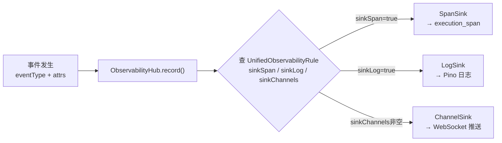
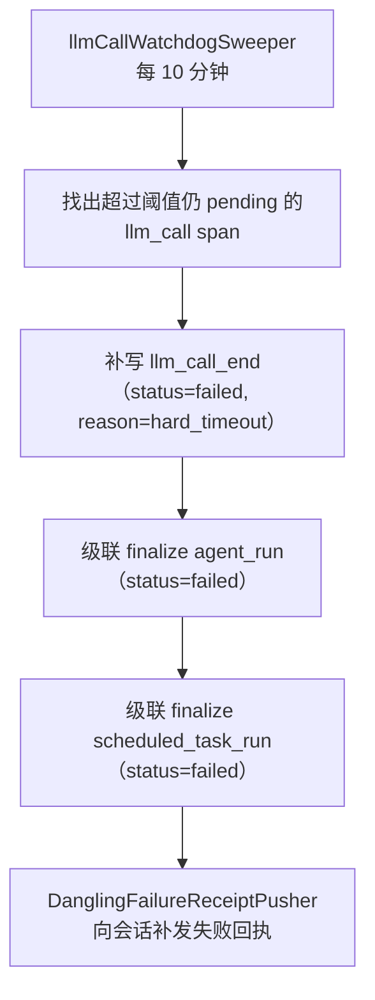

# 第 25 章 可观测性

> "看不见的系统是不可控的。"

可观测性不是一个"加日志"的后期工程，而是架构设计时就必须考虑的一等公民。WinMatrix 经历了一次重要的架构演进——`retire-agent-execution-log`：旧的事件流水表 `agent_execution_log` 被整体退役，ExecutionSpan 成为执行记录的唯一真源（SSOT）。这不是一次简单的"换张表"，而是把可观测性从"日志思维"升级到"链路思维"。

本章从 ExecutionSpan 这个 SSOT 讲起，依次展开 Span 事件双写、三 Sink 路由、LLM 调用遥测契约、完整 request 暂存防剥离，以及一个容易被忽视但极其关键的补偿机制——悬挂 LLM 调用的级联回收。

## 25.1 ExecutionSpan：retire-agent-execution-log 后的 SSOT

在 `retire-agent-execution-log` 之前，WinMatrix 用 `agent_execution_log` 表记录所有执行事件。这张表是扁平的事件流水——每条记录一个事件，靠 `parentEventId` 串成链。但这种方式有一个根本问题：**它把"链路"和"事件"混在了一张表里**。查一个执行的完整链路，要么递归查 parent，要么靠 traceId 笛卡尔积，性能和可读性都不理想。

重构后，`agent_execution_log` 已无 Prisma model 定义。取代它的是两个表：**ExecutionSpan（跨度）+ ExecutionSpanEvent（事件）**。这种"span + event"的双层模型，正是 OpenTelemetry 的思路——span 是一个有起止的操作单元，event 是 span 内部发生的原子事件。

### ExecutionSpan 模型

```prisma
// schema.prisma（第 2990-3038 行）
model ExecutionSpan {
  spanId              String    @id @map("span_id")
  traceId             String    @map("trace_id")
  parentSpanId        String?   @map("parent_span_id")   // 父 Span，支持嵌套
  spanKind            String    @map("span_kind")          // llm_call / agent_invocation / tool_call / decision...
  status              String    @default("pending")        // pending | succeeded | failed
  outcome             String?
  tokenInput          Int?      @map("token_input")
  tokenOutput         Int?
  tokenThinking       Int?
  model               String?
  provider            String?
  failureReasonCode   String?   @map("failure_reason_code")
  agentRunId          String?   @map("agent_run_id")
  attributes          Json?
  events              Json?     @default("[]")
  @@index([traceId], map: "idx_span_trace")
  @@index([spanKind, status], map: "idx_span_kind_status")
  @@index([attributes], map: "idx_span_attrs", type: Gin)
  @@map("execution_span")
}
```

几个关键字段的设计意图：

- **`spanId` 是主键，`traceId` 是索引**：一次完整执行是一个 trace，包含多个 span。trace 把所有 span 串起来。
- **`parentSpanId` 支持 span 嵌套**：一个 agent_invocation span 里可能嵌套多个 tool_call span，形成调用树。
- **`spanKind` 分类**：`llm_call` / `agent_invocation` / `tool_call` / `decision` / `pipeline` / `retrieval` / `preflight`。不同 kind 的 span 有不同的统计特征（LLM call 有 token 消耗，tool call 没有）。
- **token 三字段（input/output/thinking）+ model + provider**：LLM 调用的成本数据完整记录。这是做 LLM 成本分析的基础。
- **`failureReasonCode`**：失败原因码，不是自由文本。这让"按失败原因聚合统计"成为可能。

### GIN 索引支持 JSON 属性查询

```prisma
@@index([attributes], map: "idx_span_attrs", type: Gin)
```

`attributes` 是 Json 字段，存储 span 的扩展属性。给它建 GIN（Generalized Inverted Index）索引，意味着可以直接用 `attributes @> '{"key":"value"}'` 这种 JSONB 查询条件高效过滤。这是 PostgreSQL 的强项——**关系型数据库也能很好地处理半结构化数据，前提是你用对索引。**

## 25.1.1 从 agent_execution_log 到 ExecutionSpan 的演进

理解 `retire-agent-execution-log` 这次重构，有助于理解为什么 ExecutionSpan 的设计是现在这个样子。

### 旧模型的问题

`agent_execution_log` 是一张扁平的事件流水表。每条记录是一个事件，通过 `parentEventId` 和 `sessionId` 串成链。这种模型的问题：

1. **查询一个"操作"的完整信息需要多条记录**：一个 LLM 调用涉及 `llm_call_start`、`llm_call_end` 两条记录，分散在不同行。查 token 消耗要跨行聚合。
2. **链路重建靠递归查询**：要重建一个 agent_run 的完整调用树，需要递归查 parentEventId，性能随链路深度恶化。
3. **状态分散**：一个"操作"的状态（pending/succeeded/failed）没有集中存储——它隐含在事件的组合里，需要应用层推断。
4. **token 统计困难**：token 消耗（input/output/thinking）分散在 end 事件里，按 spanKind 聚合统计很麻烦。

### 新模型的优势

ExecutionSpan 把"操作"提升为一等实体：

- 一个 span = 一个完整操作（有 spanId、status、tokenInput/Output、model）。
- 事件（ExecutionSpanEvent）是 span 内部的细节，不承载操作级状态。
- traceId + parentSpanId 天然支持调用树，不需要递归查询——一次 `WHERE traceId = ?` 就能拿到整条链路。
- spanKind + status 的复合索引让"按类型统计"高效。

这次重构的教训是：**当你的可观测性数据增长到一定规模，"事件流水"模型会碰到天花板，"span + event"的分层模型是更可持续的选择。** 这不是理论推导，而是生产实践逼出来的演进。

### 为什么保留旧任务的清理

`system-execution-log-cleanup` 任务的注释里写着"agent_execution_log 已退役"，但任务本身还在。原因是：**退役不等于删除**。历史数据还留在表里（用于历史审计），需要定期清理过期数据。只是不再往这张表写新数据了。保留清理任务，是为了消化存量数据。

## 25.2 ExecutionSpanEvent：事件子表与 JSON 双写

ExecutionSpan 的 `events` 字段是一个 Json 数组，存了 span 内的事件。但 WinMatrix 不是只存 JSON——它同时把每个事件写进 `ExecutionSpanEvent` 子表：

```prisma
// schema.prisma（第 3041-3060 行）
model ExecutionSpanEvent {
  id        BigInt   @id @default(autoincrement())
  spanId    String   @map("span_id")
  eventType String   @map("event_type")
  phase     String?
  ts        DateTime @db.Timestamptz(6)
  attrs     Json     @default("{}")
  seq       Int                                   // span 内单调序号
  @@unique([spanId, seq], map: "uq_span_event_span_seq")
  @@index([spanId, ts], map: "idx_span_event_span_ts")
  @@index([traceId, eventType], map: "idx_span_event_trace_type")
  @@map("execution_span_event")
}
```

为什么要双写？

| 存储 | 角色 | 优势 | 劣势 |
|------|------|------|------|
| `execution_span.events` JSON | UI 兼容副本 | 一次查询拿到 span + 全部事件，前端友好 | 有界（截断），不适合精确查询 |
| `execution_span_event` 子表 | 完整事件源 | 支持 SQL 精确查询、聚合、按 eventType 索引 | 查事件需 join span |

**JSON 是"读优化"，子表是"写真相"。** 前端展示一个 span 时，直接读 JSON 字段就够了，不用 join；但做分析（"统计上周所有 `llm_call_error` 事件"）必须查子表，因为 JSON 里的副本可能被截断。

### 幂等 append：@@unique([spanId, seq])

子表的写入是幂等的：

```ts
// src/infrastructure/persistence/repositories/ExecutionSpanEventRepository.ts（第 1-70 行）
/**
 * 子表为完整事件源，JSON 为有界 UI 兼容副本。
 * 子表 INSERT 失败为 warn-only。
 */
async appendEvent(input: AppendSpanEventInput): Promise<boolean> {
  try {
    await prisma.executionSpanEvent.create({ data: { ... } });
    return true;
  } catch (error) {
    if (error instanceof Prisma.PrismaClientKnownRequestError
        && error.code === 'P2002') {
      return false;   // 幂等：[spanId, seq] 冲突静默忽略
    }
    throw error;
  }
}
```

`@@unique([spanId, seq])` 意味着同一个 span 里，序号 seq 是唯一的。如果同一个事件被写两次（比如回填/重放），第二次会触发 P2002（唯一约束冲突），被静默忽略。**这让事件写入变成幂等操作——这是崩溃恢复、重放安全的基础。**

子表 INSERT 失败是 **warn-only**：不阻塞主流程。因为子表是"完整源"，JSON 已经写了，即使子表写失败，数据也不会丢（下次回填还能补）。这是"读优化 vs 写真相"的另一种平衡——真相层失败不能拖垮优化层。

## 25.3 三 Sink 路由：UnifiedObservabilityRule

可观测性数据不是只落数据库。一个事件可能需要同时：写进 span（持久化）、写进日志（Pino 日志流）、推送到 channel（WebSocket 实时推送给前端看板）。这三类目的地被称为三个 Sink。

**哪个事件该落到哪些 Sink？** 这个决策不是硬编码在代码里，而是配置在 `UnifiedObservabilityRule` 表里：

```prisma
// schema.prisma（第 3063-3094 行）
model UnifiedObservabilityRule {
  eventType        String   @map("event_type")
  runtimeActionKey String   @default("") @map("runtime_action_key")
  sinkSpan         Boolean  @default(true) @map("sink_span")
  sinkLog          Boolean  @default(false) @map("sink_log")
  sinkChannels     String[] @default([]) @map("sink_channels")
  opensSpan        Boolean  @default(true) @map("opens_span")
  opensInvocation  Boolean  @default(false) @map("opens_invocation")
  redactionPolicy  Json     @default("{}") @map("redaction_policy")
  @@id([eventType, runtimeActionKey])
  @@map("unified_observability_rule")
}
```

每条规则声明：对于某个 `eventType`（+ 可选的 `runtimeActionKey`），是否落 span / log / channels，是否开启新 span / 新 invocation，用什么脱敏策略。



### ObservabilityHub：统一入口

```ts
// src/infrastructure/observability/hub/ObservabilityHub.ts（第 340-412 行）
export class ObservabilityHub {
  readonly channelSink: ChannelSink;
  readonly spanSink: SpanSink;
  readonly logSink: LogSink;
  private readonly ruleStore: UnifiedObservabilityRuleStore;
  private readonly activeSpanRegistry = new HubActiveSpanRegistry();
  constructor(options) {
    this.channelSink = new ChannelSink({ ... });
    this.logSink = options.logSink ?? new LogSink();
    this.spanSink = new SpanSink({ ..., channelSink: this.channelSink });
  }
}
```

所有事件记录都走 `ObservabilityHub.record()`。Hub 在 record 时：

1. 查 `ruleStore` 找到该 eventType 的规则。
2. 按规则的 `sinkSpan`/`sinkLog`/`sinkChannels` 分流到对应 Sink。
3. 应用 `redactionPolicy` 做脱敏（见 25.6）。

**把路由规则配置化而不是硬编码**，带来两个好处：

- **动态调整**：想把某个 eventType 从"只落库"改成"同时推看板"，改一条 DB 记录就行，不用改代码重新部署。
- **统一治理**：所有事件的去向在一处可见，而不是散落在几十个 `if (shouldLog) ...` 里。

## 25.3.1 redactionPolicy：每条规则的脱敏策略

回到 `UnifiedObservabilityRule` 模型，注意这个字段：

```prisma
redactionPolicy  Json  @default("{}")  @map("redaction_policy")
```

每条规则可以有自己的脱敏策略（`redactionPolicy`）。这意味着不同 eventType 可以用不同的脱敏强度：

- **`llm_call_start`**：可能需要保留更多 request 内容（用于复现），脱敏较轻。
- **`api_request`**：可能含用户密码、token，脱敏最重。
- **`tool_call`**：工具调用参数可能含敏感业务数据，中等脱敏。

这种"按事件类型定制脱敏"比"全局一刀切"更精细。一刀切要么过度脱敏（丢掉有用的调试信息），要么脱敏不足（泄露敏感数据）。按规则定制让每个事件类型找到"刚好够用"的脱敏平衡点。

### opensSpan 与 opensInvocation

```prisma
opensSpan        Boolean  @default(true)  @map("opens_span")
opensInvocation  Boolean  @default(false) @map("opens_invocation")
```

这两个字段控制事件是否"开启新的 span / 新的 invocation"：

- **`opensSpan=true`**：这个事件会创建一个新的 ExecutionSpan（一个新的操作单元）。
- **`opensInvocation=true`**：这个事件会创建一个新的 invocation 上下文（如一次 LLM 调用的完整生命周期）。

大多数事件 `opensSpan=true`（每个事件开启自己的 span）。但有些事件是"附加到已有 span"的（如 `llm_call_end` 附加到 `llm_call_start` 创建的 span），它们的 `opensSpan=false`。

这种区分让 Hub 知道："这个事件是新建一个操作，还是补充一个已有操作"——这对于 span 的生命周期管理至关重要。

## 25.4 LLM Span 遥测契约

LLM 调用是 WinMatrix 里最昂贵、最需要观测的操作。它的遥测不是随意记录的，而是有一份**正式契约**：

`openspec/contracts/llm-call-span-telemetry-contract.md`（稳定契约）。契约规定了 LLM 调用三个时点必须记录什么：

| 时机 | eventType | 必填 attrs |
|------|-----------|------------|
| 调用前 | `llm_call_start` | `llmInvocationId`、`actionName`、`request`（含 `messages[]`、可选 `tools`） |
| 调用后 | `llm_call_end` | `response`（模型文本或结构化 JSON）、`inputTokens`/`outputTokens` |
| 失败 | `llm_call_error` / `llm_call_failed` | `errorMessage`，**保留已发出的 request** |

几个值得强调的契约条款：

- **`llm_call_start` 必含 `request.messages`**：不是"可选"，是"必须"。没有 messages 的 LLM 调用记录是废的——你无法复现这次调用。
- **`llm_call_end` 必含 `response`**：同理，没有 response 的记录无法判断模型到底返回了什么。
- **失败时保留 `request`**：`llm_call_error` 必须带上当时发出的 request。这是排错的关键——失败时最想知道的就是"当时到底发了什么给模型"。

这份契约对应第 29 章引用的 AGENTS.md 强制条文：**凡新/改 LLM 调用须经 `emitLLMCallStart`/`emitLLMCallEnd`，events 含 request/response。**

## 25.5 emitLLMCallStart：完整 request 暂存

`emitLLMCallStart` 是 LLM 遥测的入口函数。它做了一件容易被忽视但极关键的事——**在源点暂存完整 request**：

```ts
// src/infrastructure/observability/llmObservability.ts（第 89-128 行）
export async function emitLLMCallStart(
  sessionContext, runId, client, messages, actionName?, requestTools?, runtimeInvocation?,
): Promise<void> {
  // 提案2 D1：在 hub compactLlmEventDataForLogSink 剥离 request 之前，
  // 于源点暂存完整 request
  if (obsFields.llmInvocationId) {
    import('./elasticsearchLlmLogger.js')
      .then(({ storeFullRequestForRun }) =>
        storeFullRequestForRun(invocationId, request))
      .catch(() => {});
  }
  await recordViaHubOrLegacy({
    ..., eventType: 'llm_call_start', request, ...,
  });
}
```

为什么要暂存？因为 **ObservabilityHub 在把事件分发到 LogSink 时，会调用 `compactLlmEventDataForLogSink` 把 request 字段剥离掉**——完整 request 太大，写进 Pino 日志流会让日志膨胀。但剥离后，LogSink 里的记录就丢了 request。

解决方案是**在 Hub 剥离之前，先于源点把完整 request 暂存到 ES**（`storeFullRequestForRun`）。这样：

- LogSink 里的记录是精简的（无 request），日志不膨胀。
- ES 里的完整 request 可通过 `llmInvocationId` 检索到，排错不丢信息。

这是一个典型的**"在流水线上游保存完整数据，下游按需裁剪"**模式。注意暂存是 fire-and-forget（`.catch(() => {})`）——暂存失败不影响主流程，因为 span 子表里还会记录 request。

## 25.5.1 为什么契约用 openspec 目录

LLM Span 遥测契约放在 `openspec/contracts/llm-call-span-telemetry-contract.md`，而不是散落在代码注释或 wiki 里。这个位置选择有深意。

`openspec/` 是"开放规范"目录——它存放的是**跨团队、跨系统的接口契约**。把 LLM 遥测契约放在这里，意味着：

1. **契约是第一公民**：它和代码同级重要，不是附属文档。
2. **版本化**：契约变更需要走评审流程，不能随手改。
3. **可引用**：代码里可以引用契约条款（"根据 contract.md 第 X 条，这个字段是必填的"），而不是"根据某个人的记忆"。

这种做法把"遥测应该记什么"从"实现细节"提升到了"接口契约"的高度。**当遥测格式成为契约，变更它就需要考虑所有消费方（看板、告警、分析工具）的兼容性，而不是只改代码就完事。**

### 契约与实现的守卫

契约规定了 `llm_call_start` 必含 `request.messages`。但代码怎么保证？靠 `emitLLMCallStart` 的参数签名——它把 `messages` 作为必填参数：

```ts
export async function emitLLMCallStart(
  sessionContext, runId, client, messages, actionName?, requestTools?, runtimeInvocation?,
): Promise<void> {
```

`messages` 没有问号（必填），`actionName`/`requestTools`/`runtimeInvocation` 有问号（可选）。这意味着 TypeScript 编译器会在编译期阻止"不传 messages 的调用"。**契约的强制力最终要落到类型系统上——文档说"必须"，类型就让它"必须"。**

## 25.6 TraceContext 与 SpanKind

### 全链路 traceId

```ts
// src/infrastructure/observability/traceContext.ts（第 1-54 行）
const storage = new AsyncLocalStorage<TraceContext>();

export function generateTraceId(): string {
  return randomUUID().replace(/-/g, '');   // 32 位小写 hex，无连字符
}

export function runWithTraceId<T>(
  traceId: string | undefined, fn: () => T, parentTraceId?: string,
): T {
  const id = traceId || generateTraceId();
  return storage.run({ traceId: id, parentTraceId }, fn);
}

export function getTraceId(): string | undefined {
  return storage.getStore()?.traceId;
}
```

AsyncLocalStorage 让 traceId **跨异步边界隐式传播**——无需在函数参数里显式传递。在一个 HTTP → Service → Repository → LLM 的多层调用里，任何代码都能通过 `getTraceId()` 拿到当前 traceId，把日志、span、事件都关联到同一条链路。

去掉连字符的 32 位 hex 格式兼容性更好（某些日志系统对连字符处理有问题）。

### SpanKind 分类

不同的事件类型映射到不同的 spanKind：

```ts
// src/infrastructure/persistence/repositories/AgentExecutionRepositoryImpl.ts（第 35-45 行）
export function executionEventTypeToSpanKind(eventType: string): string | undefined {
  if (eventType.startsWith('llm_call')) return 'llm_call';
  if (eventType.startsWith('agent_call') || eventType.startsWith('agent_invoke'))
    return 'agent_invocation';
  if (eventType.startsWith('tool_call') || eventType.startsWith('extractor'))
    return 'tool_call';
  if (eventType.startsWith('decision_call')) return 'decision';
  if (eventType.startsWith('workflow_call')) return 'pipeline';
  if (eventType.startsWith('retrieval_call')) return 'retrieval';
  if (eventType.startsWith('mode_preflight')) return 'preflight';
  if (eventType === 'agent_run_start' || eventType === 'agent_run_end') return 'pipeline';
  return undefined;
}
```

spanKind 是 span 的"类型标签"。它的价值在于**按类型聚合统计**——"过去一小时所有 `llm_call` span 的平均 token 消耗"、"所有 `tool_call` span 的 p95 耗时"。没有 spanKind，这些统计就只能靠 eventType 字符串前缀匹配，既慢又脆弱。

## 25.6.1 AsyncLocalStorage 的陷阱与权衡

AsyncLocalStorage（ALS）让 traceId 跨异步边界隐式传播，非常方便。但它也有代价：

**性能**：ALS 在 Node.js 里基于 `AsyncResource` 实现，每次跨异步边界（`Promise.then`、`setTimeout`、`setImmediate`）都需要传播上下文。在高并发场景下，这有性能开销。WinMatrix 接受这个开销，因为全链路追踪的价值远大于性能损失。

**隐式依赖**：ALS 让 traceId 成为"环境变量式"的存在——任何代码都能 `getTraceId()`，但代码里看不出 traceId 从哪来。这降低了代码的可追溯性。解决方式是：traceId 的**设置**集中在少数入口（HTTP 中间件、Worker 入口），其余地方只读。

**测试复杂度**：ALS 上下文在测试里可能缺失——如果测试直接调一个内部函数（没经过 HTTP 入口），`getTraceId()` 返回 undefined。测试需要显式用 `runWithTraceId('test-trace', () => { ... })` 包裹。

尽管有这些代价，ALS 仍是全链路追踪的最佳选择。替代方案是"显式传参"——每个函数都加一个 `traceId` 参数——但这在大型项目里不可行（几千个函数都要改签名）。ALS 的"隐式传播"是唯一能覆盖所有代码路径的方案。

### parentTraceId 的跨 Agent 语义

```ts
interface TraceContext {
  traceId: string;
  parentTraceId?: string;     // 父链路 ID
}
```

`parentTraceId` 专门用于**跨 Agent 调用**。当 Agent A 调用 Agent B 时：

- Agent B 的 traceId 是新生成的（独立链路）。
- Agent B 的 parentTraceId 设为 Agent A 的 traceId。

这让"跨 Agent 的调用关系"可追溯——通过 parentTraceId 能从 Agent B 的链路回到 Agent A 的链路。如果不区分 traceId 和 parentTraceId，跨 Agent 调用会混在同一个 trace 里，无法区分"这是 Agent A 的操作"还是"Agent A 触发的 Agent B 的操作"。

## 25.7 API 审计日志

API 请求的审计走独立的 `apiAuditLog` 中间件。它的核心难点是**中断请求的捕获**——客户端断开连接时，正常响应流程会被打断，审计日志容易丢失。

```ts
// src/interface/middleware/apiAuditLog.ts（第 226-365 行）
function finalizeNormal(span: PendingSpan, statusCode: number, request, reply): void {
  if (span.completed) return;    // 防重复 finalize
  span.completed = true;
  const finalTraceId = span.traceId || `audit-${span.registryKey}`;
  const duration = Date.now() - span.startTime;
  // JWT 解码、敏感字段脱敏（redactSensitiveBodyFields）、body 截断（truncateBody）
  const event: ApiRequestEvent = {
    timestamp: nowIso(),
    sessionId: finalTraceId,
    eventType: 'api_request',
    traceId: finalTraceId,
    completion: 'normal',
    userId, userName, duration,
    method: span.method,
    path: decodeURIComponent(span.path),
    statusCode,
    requestBody, responseBody,
    clientIp: span.clientIp,
    userAgent: span.userAgent,
    routePattern,
    authMethod: detectAuthMethod(request),
    slowRequest: duration > SLOW_REQUEST_THRESHOLD_MS,   // 慢请求标记
    // ...
  };
  void recordObservabilityEvent(event).catch((err) => {
    logger.warn({ error: getErrorMsg(err), traceId: finalTraceId },
      '[apiAuditLog] ES 写入失败');
  });
  registry.delete(span.registryKey);   // 清理注册表
  request.raw.removeAllListeners('close');   // 防止 socket 复用内存泄漏
  request.raw.removeAllListeners('error');
}
```

几个值得注意的设计：

- **`PendingSpan` 注册表**：每个请求开始时注册一个 PendingSpan，结束时 finalize 并删除。这是捕获中断请求的基础——即使响应没正常完成，sweep 机制也能扫到未 finalize 的 PendingSpan 并补记。
- **`slowRequest` 标记**：超过阈值的请求打标记，便于后续筛选慢请求。
- **`removeAllListeners`**：防止 socket 复用时的内存泄漏——HTTP keep-alive 下 socket 会被复用，如果不清理监听器，监听器会越积越多。
- **错误分类**：`classifyHttpError` 把 HTTP 状态码映射成语义化类别（ServerError / RateLimited / Unauthorized / Forbidden / NotFound / ClientError），便于聚合统计。

### 认证方式检测

```ts
function detectAuthMethod(request: FastifyRequest): string {
  const authHeader = request.headers['authorization'];
  if (authHeader && authHeader.startsWith('Bearer ')) return 'bearer_token';
  if (request.session?.userId) return 'cookie_session';
  return 'none';
}
```

审计记录"这个请求用什么方式认证的"。结合第 6 章讲的"三路 token 提取（Authorization Bearer / X-Auth-Token / query.token）"，这个字段让安全审计能区分"Bearer token 访问"和"session 访问"的不同流量。

## 25.8 数据脱敏：Sink 级别策略

可观测性数据里可能含敏感信息（用户输入、LLM 返回、API body）。WinMatrix 的脱敏不是一刀切，而是**按 Sink 级别差异化**：

```ts
// ExecutionSpanEventRepository.ts
function toJsonAttrs(value: Record<string, unknown> | undefined): Prisma.InputJsonValue {
  if (value === undefined) return {};
  const redacted = redactForSink(value, 'database', { policy: 'strict' });
  return JSON.parse(JSON.stringify(redacted)) as Prisma.InputJsonValue;
}
```

不同 Sink 用不同的脱敏策略：

- **database（strict）**：最严格，敏感字段（token、密钥、手机号等）必须脱敏后才入库。
- **elasticsearch**：中等，便于检索但移除高危字段。
- **log**：较松，但仍移除明显敏感字段。

脱敏规则定义在 `sensitiveFieldRules.ts`，脱敏引擎在 `redactionEngine.ts`，数据安全内核在 `DataSafetyKernel.ts`。**这套分层脱敏的核心理念是：数据越持久，脱敏越严格。** 日志是短暂的（几天后滚动掉），可以保留更多信息；数据库是持久的，必须最严格。

## 25.8.1 数据安全内核：DataSafetyKernel

脱敏不是几个正则替换那么简单。WinMatrix 的脱敏有一个"数据安全内核"——`DataSafetyKernel.ts`。它是一个集中的脱敏决策点，所有 sink 在写入前都经过它的检查。

DataSafetyKernel 的设计哲学是**纵深防御**：

1. **字段名规则**：按字段名识别敏感字段（如 `password`、`token`、`secret`、`phone`）。`sensitiveFieldRules.ts` 定义了这些规则。
2. **值模式匹配**：即使字段名不明显，按值的模式识别（如匹配手机号格式、身份证格式）。
3. **结构感知**：递归遍历 JSON 结构，对嵌套对象和数组都做脱敏。
4. **Sink 级别策略**：不同 sink 用不同严格度（database=strict，elasticsearch=中等，log=较松）。

这种多层识别的原因是：**敏感数据不会老老实实地待在叫 `password` 的字段里。** 它可能藏在 `metadata.oldValue` 里、藏在 `request.body.config.secret` 里。单纯按字段名匹配会漏掉大量敏感数据。字段名 + 值模式 + 结构递归的组合，才能做到"尽量不漏"。

### 脱敏与可观测性的张力

脱敏和可观测性存在根本张力——脱敏越多越安全，但可观测性越差（排障时看不到真实数据）。WinMatrix 的解法是 **Sink 级别差异化**：

- 日志（短暂）：保留更多信息（较松脱敏），因为日志几天后就滚动掉。
- ES（中等）：用于检索，移除高危字段但保留可搜索内容。
- 数据库（持久）：最严格脱敏，因为数据库是持久的、可能被导出的。

**数据越持久，脱敏越严格。** 这个原则把"安全"和"可观测"的张力按数据生命周期做了切分——短期数据可以多留信息（可观测），长期数据必须严格脱敏（安全）。

## 25.9 悬挂 LLM 调用的级联补偿

这是本章最值得讲的工程机制。

一个 LLM 调用开始了（`llm_call_start` 已记录），但由于进程崩溃、网络中断、provider 超时等原因，始终没有收到 `llm_call_end`。这个 span 永远停在 `pending` 状态——它是一个**悬挂调用（dangling call）**。

悬挂调用不只是"日志不完整"这么简单。它级联影响：

- **agent_run 卡住**：agent_run 在等这个 LLM 调用的结果，span 没 finalize，run 也没法 finalize。
- **scheduled_task_run 卡住**：scheduled run 在等 agent_run，一并卡住。
- **统计失真**：这个调用的 token 消耗没记录（因为没到 llm_call_end），成本统计偏低。

### llmCallWatchdogSweeper：每 10 分钟巡检

`system-llm-call-watchdog-sweeper` 任务（见第 24 章，`intervalMs: 600_000`，每 10 分钟）专门处理悬挂调用：

```ts
// src/infrastructure/scheduled/llmCallWatchdogSweeper.ts（第 1-53 行）
export const LLM_CALL_WATCHDOG_SWEEPER_TASK_NAME = 'system-llm-call-watchdog-sweeper';

function resolveSweepThresholdMs(): number {
  const hardMs = getConfig().llmCallHardTimeoutMs;
  return hardMs > 0 ? hardMs * 2 : 360_000;   // 2x hard timeout 或 6 分钟
}
```

sweep 阈值是 `hardMs * 2`（hard timeout 的两倍）或默认 6 分钟。为什么是两倍？因为 hard timeout 是"认为调用肯定失败了"的阈值，sweep 要留出余量——如果 hard timeout 是 3 分钟，那 6 分钟还没收到 end，基本可以确认这个调用是悬挂的。

sweep 做三件事：



1. **补写 llm_call_end**：给悬挂的 span 补一个 `llm_call_end` 事件，status 标 `failed`，failureReasonCode 标 `hard_timeout`。
2. **级联 finalize**：把卡住的 agent_run、scheduled_task_run 都收敛到 `failed` 终态。这是 `reconcileStaleRunsOnBootstrap`（第 23/24 章）的运行时版本——启动时做一次大扫除，运行时每 10 分钟做一次小扫除。
3. **补发失败回执**：`DanglingFailureReceiptPusher` 向受影响的会话补发一条失败回执消息，让用户知道"这次调用失败了"，而不是让对话无限期挂着。

**这个机制体现了生产级 AI 系统的一个核心原则：LLM 调用是不可靠的，系统必须有 watchdog 把那些"悬而未决"的调用逼到终态。** 没有 watchdog，悬挂调用会像幽灵一样占用状态、扭曲统计、卡住用户。

## 25.9.1 补偿的幂等性

watchdog 的补偿操作必须是幂等的——因为 watchdog 每 10 分钟跑一次，如果某次补偿部分成功（比如补写了 llm_call_end 但级联 finalize agent_run 时网络断了），下次 sweep 会再次扫到这个 span（如果它还满足条件）。重复补写不能产生重复数据。

幂等性靠几个机制保障：

- **span status 前置检查**：补写 llm_call_end 前，检查 span 是否已经是 `failed`（已被前次 sweep 处理过）。已处理则跳过。
- **ExecutionSpanEvent 的 `@@unique([spanId, seq])`**（第 25.2 节）：即使重复写事件，P2002 冲突被静默忽略。
- **agent_run / scheduled_task_run 的状态机**：`reconcileStaleRunning` 只处理 `status='running'` 的记录。已经 reconcile 到 `failed` 的记录不会被重复处理。

**幂等是补偿机制的生命线。** 非幂等的补偿比不补偿更危险——它可能把一个错误的状态改两遍，或者产生重复事件污染数据。

### 为什么不用 BullMQ 做 watchdog

你可能会想：watchdog 不就是"定时检查 + 补偿"吗？为什么不用 BullMQ repeatable job，而是独立 `setInterval`？

原因是 watchdog 的**自举问题**：BullMQ 的 job 可能在 Worker 崩溃时变成悬挂状态。如果 watchdog 本身是 BullMQ job，它也可能悬挂——那谁来补偿 watchdog 的 watchdog？这就成了无限递归。

用独立的 `setInterval`（不走 BullMQ）避免了这个问题——watchdog 不依赖 BullMQ，BullMQ 挂了 watchdog 还能跑。**某些"系统级监控"必须独立于被监控的系统，否则就形成循环依赖。**

## 25.10 性能监控与进程状态

除了业务可观测性，WinMatrix 还监控运行时本身：

```ts
// src/infrastructure/observability/performanceMonitor.ts
// - 事件循环滞后（startEventLoopLagTracking）
// - 进程状态（updateProcessStateMetric）
// - Redis 连接状态（startMetricsLogging）
// - 内存使用
```

进程状态是一个状态机：

```
starting → running → shutting_down → fatal_exiting
```

通过 Prometheus 暴露。`fatal_exiting` 是一个特殊状态——当应用遇到不可恢复的致命错误时，主动切到这个状态并自退出（让 k8s 重启 Pod）。这对应第 26 章讲的"k8s readiness 摘流不重启，fatal 靠应用自退出"——readiness 失败只是摘流（不重启），但 fatal 状态会触发应用主动退出，让 Pod 重启。

事件循环滞后监控是 Node.js 性能诊断的关键——如果事件循环频繁卡顿（lag 高），说明有同步阻塞操作，需要排查。

## 本章小结

本章深入分析了 WinMatrix 的可观测性系统：

1. **ExecutionSpan 是 retire-agent-execution-log 后的 SSOT**：`agent_execution_log` 已无 model 定义，ExecutionSpan（span）+ ExecutionSpanEvent（event）双层模型取而代之，span 是操作单元，event 是原子事件。
2. **GIN 索引支持 JSON 属性查询**：`attributes` 字段建 GIN 索引，JSONB 查询高效。
3. **Span 事件双写**：`execution_span.events` JSON（UI 兼容副本，有界）+ `execution_span_event` 子表（完整事件源，`@@unique([spanId, seq])` 幂等 append，INSERT 失败 warn-only）。
4. **三 Sink 路由**：UnifiedObservabilityRule 配置化决定每个 eventType 落 span/log/channel 组合，ObservabilityHub 在 record() 时查规则分流，动态可调、统一治理。
5. **LLM Span 遥测契约**：`openspec/contracts/llm-call-span-telemetry-contract.md` 强制 `llm_call_start` 必含 request.messages、`llm_call_end` 必含 response、失败保留 request。
6. **完整 request 暂存防剥离**：`emitLLMCallStart` 在 Hub `compactLlmEventDataForLogSink` 剥离前，于源点 `storeFullRequestForRun` 暂存完整 request 到 ES，日志不膨胀且不丢信息。
7. **API 审计**：PendingSpan 注册表 + 事件优先级捕获中断请求，错误分类 + 认证方式检测 + 慢请求标记，`removeAllListeners` 防 socket 复用泄漏。
8. **脱敏 Sink 级别策略**：database（strict）/ elasticsearch（中等）/ log（较松），数据越持久脱敏越严格。
9. **悬挂 LLM 调用级联补偿**：llmCallWatchdogSweeper 每 10 分钟巡检（threshold = hardMs*2 或 6 分钟），补写 llm_call_end + 级联 finalize agent_run/scheduled_task_run + DanglingFailureReceiptPusher 补发失败回执。
10. **性能监控**：事件循环滞后 + 进程状态机（starting→running→shutting_down→fatal_exiting）+ Redis 连接状态。

在下一章中，我们将深入构建与部署——看四进程对齐如何从 dev 的 4 终端贯穿到 prod 的 docker-compose 4 服务再到 k8s 的主应用+worker 分离。
