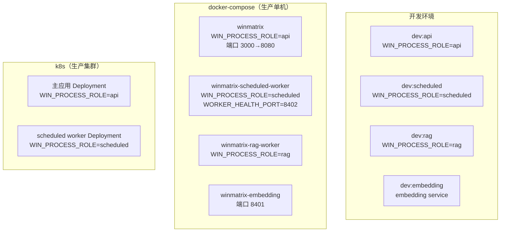
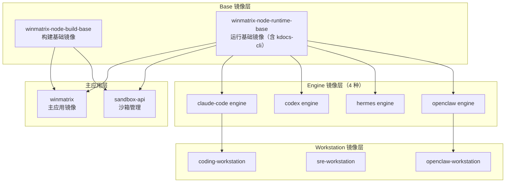

# 第 26 章 构建与部署

> "从源码到生产，每一步都应该是可重复的。"

一个能跑在开发机上的系统，和一个能在生产环境稳定服务的系统，之间隔着一条巨大的鸿沟。这条鸿沟由构建管线、镜像矩阵、进程拆分、编排清单、健康检查、跨平台启动脚本等无数工程细节填平。WinMatrix 的构建部署体系最值得称道的设计是**四进程对齐**——同一份代码，在开发时是 4 个终端，在生产时是 docker-compose 的 4 个服务，在 k8s 里是主应用 + worker 的分离部署，而每个入口都用同一行 `WIN_PROCESS_ROLE` 守卫保证角色正确。

本章从构建链讲起，依次展开 Docker 多阶段构建、docker-compose 七服务编排、k8s 部署清单的致命细节、Makefile 44 target 的全镜像矩阵，以及那份 1240 行的跨平台 `start.sh`。

## 26.1 构建链：esbuild 为主，tsc 校类型

WinMatrix 的构建产物**明确分离**——esbuild 负责产出可运行的 JS，tsc 负责类型检查但不产出。这两件事不做在一起，是一个值得展开的决策。

```json
// winmatrix-server/package.json（第 8-14 行）
{
  "scripts": {
    "build": "npx prisma generate && \
              node scripts/check-no-js-in-src.cjs && \
              node scripts/build-esbuild.cjs && \
              node scripts/tsc-alias-build.cjs && \
              node scripts/fix-remaining-alias-in-dist.cjs && \
              node scripts/verify-no-alias-in-dist.cjs",
    "build:tsc": "npx prisma generate && tsc --project tsconfig.typecheck.json --noEmit",
    "build:prod": "node scripts/check-no-js-in-src.cjs && node scripts/build-esbuild.cjs && node scripts/tsc-alias-build.cjs && node scripts/fix-remaining-alias-in-dist.cjs && node scripts/verify-no-alias-in-dist.cjs"
  }
}
```

### build 的六步管线

| 步骤 | 脚本 | 职责 |
|------|------|------|
| 1 | `prisma generate` | 生成 Prisma Client（157 个模型的类型） |
| 2 | `check-no-js-in-src` | 确保 `src/` 下无 `.js` 文件混入（TS-only 约束） |
| 3 | `build-esbuild` | esbuild 编译 TypeScript → JavaScript |
| 4 | `tsc-alias-build` | 将 `@/` 路径别名替换为相对路径 |
| 5 | `fix-remaining-alias` | 修补 esbuild 遗漏的残余别名 |
| 6 | `verify-no-alias-in-dist` | 校验 `dist/` 无残留 `@/` 别名 |

为什么用 esbuild 而不是 tsc 产出？**速度**。WinMatrix 是一个 157 模型 + 数千 TS 文件的大型项目，tsc 全量编译要几十秒甚至更久，而 esbuild 的逐文件转译快一个数量级。但 esbuild 不做类型检查——所以类型检查走单独的 `build:tsc`（`--noEmit`，只检查不产出）。

这种"产出和检查分离"的好处是：**开发时可以快速 build（esbuild）看效果，CI 时再跑完整类型检查（tsc）兜底。** 两者不互相阻塞。

### esbuild 构建脚本的关键设计

```js
// scripts/build-esbuild.cjs（第 1-68 行）
const aliasExternalPlugin = {
  name: 'alias-external',
  setup(build) {
    build.onResolve({ filter: /^@\// }, () => ({ path: 'external', external: true }));
    build.onResolve({ filter: /^@$/ }, () => ({ path: 'external', external: true }));
  },
};

const EXCLUDE_DIRS = ['typeorm', 'persistence/prisma/generated'];

await esbuild.build({
  entryPoints,             // 收集所有 .ts（排除 .test.ts/.spec.ts）
  outdir: path.join(rootDir, 'dist'),
  outbase: srcDir,
  bundle: false,           // 逐文件转译，不打包
  format: 'esm',           // ESM 格式
  platform: 'node',
  target: 'es2022',
  sourcemap: false,
  plugins: [aliasExternalPlugin],
  outExtension: { '.js': '.js' },
});
```

三个关键决策：

- **`bundle: false`**：逐文件转译，保持目录结构。WinMatrix 不打包成单文件，因为它是 ESM 项目，运行时按文件路径动态 import（比如第 23 章的 `await import('@/startup/scheduledEntry.js')`）。打包会破坏这种动态加载。
- **`aliasExternalPlugin`**：把 `@/` 标记为 external，保留在产出里，由后续的 `tsc-alias` 替换。为什么不在 esbuild 里直接解析？因为 esbuild 的 alias 解析和项目的 tsconfig paths 可能有细微差异，用 tsc-alias（和 tsc 同源的路径解析）更可靠。
- **`EXCLUDE_DIRS`**：排除 `typeorm`（已迁移到 Prisma，但目录还在）和 `prisma/generated`（自动生成的代码，不该被编译）。**排除自动生成目录是构建管线的常识——生成物不该被构建系统重复处理。**

### 产物校验

构建后还有一个校验步骤：检查每个 entry 都有对应的 `.js` 产物。这是为了规避一个真实的 Docker 环境问题——在某些 Linux/Docker 组合下，esbuild 可能因为路径大小写敏感、符号链接等问题漏掉个别文件，导致运行时 `ERR_MODULE_NOT_FOUND`。**构建后立即校验产物完整性，比让运行时报错好得多。**

### tsc-alias 的 cwd 问题

```js
// scripts/tsc-alias-build.cjs（完整 13 行）
const path = require('path');
const { execSync } = require('child_process');
const rootDir = path.resolve(__dirname, '..');
execSync('npx tsc-alias -p tsconfig.build.json', {
  stdio: 'inherit',
  cwd: rootDir,    // 显式指定项目根目录
});
```

这个 13 行的脚本解决了一个真实的 Docker 环境问题：`tsc-alias` 在 cwd 不是项目根时会报 "Invalid file path"。通过显式指定 `cwd: rootDir` 解决。**这类"看似多余的显式参数"往往是踩过坑后的教训结晶。**

## 26.1.1 为什么不用 tsc 直接产出

很多 TypeScript 项目用 `tsc` 同时做编译和类型检查——一条命令搞定。WinMatrix 刻意分开（esbuild 产出 + tsc 校类型），这个决策值得展开。

**tsc 产出的致命问题是速度**。WinMatrix 有数千个 TS 文件，tsc 全量编译要几十秒到一两分钟。在以下场景里，这个延迟是无法接受的：

- **开发时热重载**：每次改代码都要等几十秒才看到效果，开发体验极差。
- **Docker 构建**：构建时间长意味着 CI 慢、迭代慢。
- **频繁部署**：每次部署都要等 tsc 编译完。

esbuild 的速度是 tsc 的 10-100 倍。用 esbuild 产出，开发热重载几乎瞬时，Docker 构建也快得多。

但 esbuild **不做类型检查**——它会 happily 编译类型错误的代码。所以类型检查必须由 tsc 单独承担（`build:tsc --noEmit`）。这带来一个重要的 CI 策略：

- **开发时**：只跑 esbuild（快），不跑 tsc。开发者自己负责类型正确（IDE 会实时检查）。
- **CI 时**：esbuild + tsc 都跑。CI 是类型正确性的最后防线。

这种分离的代价是：开发者本地可能漏掉类型错误（如果 IDE 没配好），但 CI 会兜住。**用 CI 兜底类型安全，换取开发时的速度。** 这是一个值得的权衡。

### check-no-js-in-src 的意义

构建第一步是 `check-no-js-in-src`——确保 `src/` 目录下没有 `.js` 文件。为什么这很重要？

WinMatrix 是 TypeScript-only 项目。所有源码是 `.ts`，编译产物是 `.js`（在 `dist/`）。如果 `src/` 里混入了 `.js` 文件（比如有人手动加了一个 JS 脚本），会导致：

1. **esbuild 可能漏编译**：esbuild 的 entryPoints 收集逻辑可能只匹配 `.ts`，`.js` 被忽略，但运行时 Node.js 又能 import 到 src 里的 `.js`（因为 alias 指向 src）。
2. **类型检查绕过**：`.js` 文件不被 tsc 严格检查，类型错误溜过去。
3. **混乱**："这个文件到底是源码还是产物？"

`check-no-js-in-src` 在构建最开始就拦住这种情况。**这是一个"项目约定"的可执行化——不是靠 Code Review 发现 .js 文件，而是靠脚本。**

## 26.2 四进程对齐：dev ↔ prod ↔ k8s

这是本章的核心设计思想。WinMatrix 有四种进程角色，三种环境，但它们是严格对齐的：



每个入口都内联 `WIN_PROCESS_ROLE` 守卫（第 23 章讲的 `assertProcessRole`）。生产启动脚本显式传递角色：

```json
// package.json（第 26-31 行）
"start:prod": "WIN_PROCESS_ROLE=api node dist/api.js",
"start:prod:monolith": "node dist/index.js",
"start:prod:api": "WIN_PROCESS_ROLE=api node dist/api.js",
"start:prod:scheduled": "WIN_PROCESS_ROLE=scheduled node dist/scheduled-worker.js",
"start:prod:rag": "WIN_PROCESS_ROLE=rag node dist/rag-worker.js",
```

注意 `start:prod:monolith`——它不设 `WIN_PROCESS_ROLE`，是"单体模式"，所有功能跑在一个进程里。这是给资源受限环境（比如演示、小规模部署）的退路。

### dev 的对应

```json
"dev": "node scripts/dev-singleton.cjs src/index.ts",
"dev:api": "node scripts/dev-singleton.cjs --role api src/api.ts",
"dev:scheduled": "node scripts/dev-singleton.cjs --role scheduled src/scheduled-worker.ts",
"dev:rag": "node scripts/dev-singleton.cjs --role rag src/rag-worker.ts"
```

`dev-singleton.cjs` 确保 dev 模式下 DI 容器、Prisma Client 等单例在热重载时不分裂。dev 模式默认 all-in-one（`dev` 命令），但也可以按角色分开启动（4 个终端）。

**四进程对齐的价值**：无论你在 dev、docker-compose 还是 k8s，进程的行为是一致的——同一个守卫、同一套角色、同一份代码。这让"在 dev 复现 prod 问题"成为可能。

## 26.2.1 进程角色的代码级一致性

四进程对齐不只是"部署时用不同入口"——它在代码层面也保持一致。每个入口都做同样的事：

```ts
// scheduled-worker.ts（第 23 章）
import './infrastructure/sandbox/config/undiciConfig.js';
import { assertProcessRole } from '@/startup/processRole.js';
assertProcessRole('scheduled');     // 同样的守卫
await import('@/startup/scheduledEntry.js');  // 动态 import 入口
```

```ts
// api.js（概念示意，实际结构相同）
import './infrastructure/sandbox/config/undiciConfig.js';
import { assertProcessRole } from '@/startup/processRole.js';
assertProcessRole('api');
await import('@/startup/apiEntry.js');
```

这种一致性意味着：**三个入口共享同一套启动基础设施**（undiciConfig、processRole、common.ts 的 DI 注册），只在"角色守卫"和"动态 import 的入口模块"上分叉。如果启动序列要改（比如加一个新的初始化步骤），改一处，三个入口都受益。

### dev-singleton 的特殊作用

```json
"dev": "node scripts/dev-singleton.cjs src/index.ts"
```

`dev-singleton.cjs` 不是简单的 `tsx src/index.ts`。它要解决一个 Node.js dev 模式的痛点：**热重载时的单例分裂**。

Node.js 热重载（ts-node-dev、nodemon 等）通常通过"杀进程 + 重启"实现。但重启后，所有模块级单例（Prisma Client、Redis 连接、DI 容器）都会重建。如果热重载只重载了部分模块（比如 tsx 的 HMR），可能出现"新代码用了新单例，旧代码还引用旧单例"的分裂状态——Prisma Client 有两个实例，Redis 连接泄漏。

`dev-singleton.cjs` 确保即使热重载，全局单例也只有一个。它通过 `globalForPrisma` 这类全局变量做 single-flight——热重载时检查全局是否已有实例，有就复用。

**这是 dev 体验和 prod 一致性的保障**——dev 模式的单侧行为和 prod 一致，避免"dev 能跑 prod 挂"或反过来的问题。

## 26.3 Docker 多阶段构建

```dockerfile
# docker/Dockerfile（三阶段构建，第 1-80 行节选）
# ============================================
# 阶段1: webui-builder（前端构建 winmatrix-ui）
# ============================================
FROM ${BUILD_BASE_IMAGE} AS webui-builder
WORKDIR /app/webui
COPY winmatrix-ui/package*.json ./

# 内网 Nexus registry，可切换镜像
ARG NPM_REGISTRY_URL=http://172.16.9.57:8081/repository/npm-group
ARG NPM_USE_MIRROR=0
RUN if [ "$NPM_USE_MIRROR" = "1" ]; then \
      npm config set registry https://registry.npmmirror.com; \
    else npm config set registry "$NPM_REGISTRY_URL"; fi

# BuildKit 缓存挂载
RUN --mount=type=cache,id=winmatrix-ui-npm-cache,target=/root/.npm \
    npm ci --no-audit --no-fund --fetch-retries=5

COPY winmatrix-ui/ ./
ARG VITE_WEBUI_BASE_PATH=/winmatrix-ui
ARG VITE_API_BASE_URL=/winmatrix
RUN npm run build

# ============================================
# 阶段2: 后端构建（winmatrix-node-build-base）
# ============================================
FROM ${BUILD_BASE_IMAGE} AS backend-deps
WORKDIR /app/backend
# @winmatrix/protocol：预编译 dist（不在镜像内下载）
COPY clients/protocol/package.json /app/clients/protocol/
COPY clients/protocol/dist/ /app/clients/protocol/dist/
RUN test -f /app/clients/protocol/dist/index.js || \
  (echo "Error: clients/protocol/dist/index.js missing" && exit 1)
COPY winmatrix-server/package.json ./
COPY winmatrix-server/package-lock.json ./

# ============================================
# 阶段3: 生产运行（winmatrix-node-runtime-base，含 kdocs-cli）
# ============================================
FROM ${RUNTIME_BASE_IMAGE}
```

三个阶段的设计亮点：

1. **双基础镜像分离**：构建阶段用 `winmatrix-node-build-base`（含完整编译工具链），运行阶段用 `winmatrix-node-runtime-base`（精简，但含 `kdocs-cli` 等运行时依赖）。**构建镜像臃肿无所谓，运行镜像必须精简。**

2. **NPM registry 双轨**：
   - `NPM_REGISTRY_URL`（默认内网 Nexus）：公司内网环境用，速度快。
   - `NPM_USE_MIRROR=1`：切换到 `npmmirror.com`（淘宝镜像），用于外网/开源环境。
   
   这种双轨设计让同一份 Dockerfile 能在公司内网和开源社区都能构建。

3. **BuildKit 缓存挂载**：`--mount=type=cache,id=winmatrix-ui-npm-cache,target=/root/.npm` 把 npm 缓存持久化到 BuildKit 缓存层，跨构建复用。第二次构建时 npm install 几乎是秒级。

4. **protocol 预编译**：`@winmatrix/protocol` 不在镜像内下载，而是用宿主机预编译的 dist。`RUN test -f ... || exit 1` 在构建时校验 dist 存在——避免带着缺失的依赖构建出一个坏镜像。

5. **依赖与源码解耦**：`backend-deps` 阶段只 COPY `package.json` + `package-lock.json`，不 COPY 源码。这意味着源码变更不会触发 npm install 重跑——只有依赖变更才会。这是 Docker 多阶段构建的标准优化，但在大型项目里效果显著。

## 26.3.1 镜像矩阵的完整图景

WinMatrix 的镜像不是一个，而是一个完整的矩阵。理解这个矩阵要看 `Makefile` 的 44 个 target 是如何分层的：



这个矩阵对应第 14-15 章讲的工作站三层镜像模型：`base_image → engine_image → component`。

- **Base 层**：提供 Node.js 运行时 + 公司内网工具（kdocs-cli 等）。build-base 含编译工具链，runtime-base 精简。
- **Engine 层**：4 种 AI coding engine（claude-code / codex / hermes / openclaw），每种是一个独立的 engine 镜像。
- **Workstation 层**：基于 engine 镜像构建的工作站，加上特定角色的配置和工具。

**这个矩阵的意义是"组合爆炸的管理"。** 4 种 engine × N 种工作站角色 = 大量镜像组合。Makefile 把每种组合都做成一个 target，让"构建某个特定组合"变成一条命令（`make build-push-coding-workstation`）。

### 冒烟测试与离线包

Makefile 里有两类特殊 target 值得讲：

**冒烟测试**（`smoke-test-*`）：构建出镜像后，启动容器验证基本功能。这不是单元测试——单元测试测的是代码逻辑，冒烟测试测的是"镜像能不能正常启动"。一个常见的 Docker 构建陷阱是：代码编译通过了，但镜像里缺了某个运行时依赖（比如某个 native module 没装），导致容器启动即崩。冒烟测试在构建后立即捕获这类问题。

**离线包**（`prepare-*-offline`）：为离线/内网环境预打包所有依赖。某些部署环境无法从公网拉取 npm 包，需要把依赖预先打进包里。离线包 target 把这些依赖收集、打包，让工作站能在完全离线的环境运行。

## 26.4 docker-compose：七服务编排

```yaml
# docker/docker-compose.yml（7 服务）
services:
  winmatrix:                    # 主应用（WIN_PROCESS_ROLE=api，端口 3000→8080）
  winmatrix-embedding:          # embedding 服务（端口 8401）
  winmatrix-scheduled-worker:   # scheduled worker（WIN_PROCESS_ROLE=scheduled，WORKER_HEALTH_PORT=8402）
  winmatrix-rag-worker:         # rag worker（WIN_PROCESS_ROLE=rag）
  pgbouncer:                    # 连接池（transaction-pooling）
  # + shared-net、volumes
```

几个关键设计：

### PgBouncer transaction-pooling

```yaml
pgbouncer:
  # transaction-pooling 模式
  # 5000 人规模避免 too many clients
```

PgBouncer 用 transaction-pooling 模式，是为了支持 5000 人规模。直连 PG 的话，每个客户端连接都占用一个 PG 后端进程，5000 人 × 多连接 = PG 被连接打爆（`too many clients`）。PgBouncer 在客户端和 PG 之间做事务级复用——多个客户端的事务复用一组 PG 连接。

但 transaction-pooling 有一个重要约束（第 29 章会讲）：**LISTEN/NOTIFY 不能走 PgBouncer transaction-pool**。因为 LISTEN 是会话级的，transaction-pool 会在每个事务结束后切换后端连接，导致 LISTEN 失效。ConfigDbListener 监听 `pg_notify('config_change')` 必须直连 PG。

### depends_on service_healthy

```yaml
winmatrix-scheduled-worker:
  depends_on:
    winmatrix-embedding:
      condition: service_healthy
winmatrix-rag-worker:
  depends_on:
    winmatrix-embedding:
      condition: service_healthy
```

scheduled-worker 和 rag-worker 都 `depends_on` embedding service，且条件是 `service_healthy`——不只是"启动了"，而是"健康检查通过了"。这保证 worker 启动时 embedding 服务已经就绪，不会因为 embedding 不可用而崩溃。

## 26.4.1 docker-compose 与 k8s 的职责分工

WinMatrix 同时维护 docker-compose 和 k8s 部署清单。这不是重复——它们服务于不同规模：

| 维度 | docker-compose | k8s |
|------|---------------|-----|
| **规模** | 单机 | 集群 |
| **适用** | 小规模部署、演示、开发 | 生产规模 |
| **自愈** | 有限（restart: always） | 完整（Pod 重启、健康检查、滚动更新） |
| **扩缩容** | 手动 | 自动（HPA） |
| **服务发现** | depends_on + 服务名 | Service + DNS |

docker-compose 是"一键起全套"的便捷工具——开发者在本地 `docker compose up` 就能起完整的 WinMatrix（含 PG、Redis、ES、所有 Worker）。k8s 是生产部署的正式形态。

**两者并存的价值是渐进式部署**——小客户用 docker-compose 就够了（成本低、运维简单），大客户上 k8s（高可用、可扩缩容）。同一份代码，两种部署形态，覆盖不同市场。

### WORKER_HEALTH_PORT 的独立健康端口

```yaml
winmatrix-scheduled-worker:
  environment:
    - WORKER_HEALTH_PORT=8402
```

scheduled-worker 有一个独立的健康检查端口（8402），而不是复用主应用的端口（3000/8080）。这是因为 Worker 进程不暴露业务 API——它只消费队列。但 k8s/docker-compose 仍需要健康检查端点来判断 Worker 是否活着。

`WORKER_HEALTH_PORT` 让 Worker 在一个独立端口上暴露健康检查（`/health`、`/readyz`），和业务 API 物理隔离。这样即使业务 API 端口被占满（请求风暴），健康检查端口依然可达——编排系统能正确判断 Pod 状态。

## 26.5 Kubernetes 部署：致命细节

k8s 部署清单里有几个容易被忽视但极其关键的细节。

### liveness vs readiness 的区别

```yaml
# k8s/deployment.yaml
spec:
  replicas: 1
  template:
    spec:
      containers:
        - name: winmatrix-server
          livenessProbe:
            httpGet: { path: /health }
            initialDelaySeconds: 90
          readinessProbe:
            httpGet: { path: /readyz }
            initialDelaySeconds: 60
```

两个探针的行为完全不同：

| 探针 | 路径 | initialDelay | 失败行为 |
|------|------|-------------|---------|
| **liveness** | `/health` | 90s | 重启 Pod |
| **readiness** | `/readyz` | 60s | **摘流（不重启）** |

**readiness 失败只摘流不重启**——Pod 还活着，只是不接流量了。这让 Pod 有时间自我恢复（比如等 BullMQ 连接重建）。如果 readiness 失败就重启，会导致频繁重启的恶性循环。

那什么情况下该重启？**liveness 失败**。但 WinMatrix 的设计里，真正的致命错误（fatal）**靠应用自退出**触发重启，而不是靠 liveness 探针。应用遇到不可恢复错误时，主动切到 `fatal_exiting` 进程状态（第 25 章）并 `process.exit(1)`，Pod 自然退出被重启。这比 liveness 探针更精准——探针只能猜"是不是该重启"，应用自己知道"我确实该退出了"。

### 显式覆盖 NODE_ENV

```yaml
env:
  - name: NODE_ENV
    value: production
  - name: DATABASE_URL
    valueFrom: { secretKeyRef: { ... } }
  - name: REDIS_URL
    valueFrom: { secretKeyRef: { ... } }
```

这一行 `NODE_ENV=production` 看似多余（deployment.yaml 显式写），但它的存在是为了**避免 Secret 污染**。如果 Secret 里不小心带了 `NODE_ENV=test`，应用会用 test 配置跑生产——这是灾难。显式在 deployment.yaml 里覆盖，确保无论 Secret 里有什么，NODE_ENV 永远是 production。

同样的逻辑也适用于 DATABASE_URL 和 REDIS_URL——显式从 Secret 取，避免依赖 ConfigMap 的继承行为。

### resources

```yaml
resources:
  requests: { memory: 512Mi, cpu: 250m }
  limits:   { memory: 2Gi,   cpu: 2000m }
```

requests（调度依据）和 limits（硬上限）分离。requests 512Mi/250m 让 Pod 能调度到小节点，limits 2Gi/2000m 给运行时足够的 burst 空间。

## 26.5.1 健康检查端点的语义分层

WinMatrix 的健康检查不是一个简单的 `/health` 返回 200。它有语义分层：

| 端点 | 语义 | 失败后果 |
|------|------|---------|
| **`/health`（liveness）** | "进程还活着吗？" | 失败 → 重启 Pod |
| **`/readyz`（readiness）** | "能接流量了吗？" | 失败 → 摘流（不重启） |

但实际的 `/health` 和 `/readyz` 返回什么？它们检查的不是"进程在跑"（进程不在跑的话根本不会响应），而是**更深层的就绪状态**：

- **BullMQ 连接是否就绪**（`markBullmqReadyForHealth`，第 23 章）。
- **Prisma 连接是否正常**。
- **关键 DI 单例是否注册完成**。

`/readyz` 比 `/health` 更严格——`/health` 可能只检查"进程没崩"，而 `/readyz` 检查"所有依赖都就绪了，可以处理请求了"。

这种分层让启动期有一个"热身阶段"：进程启动后，`/health` 先通过（进程活着），但 `/readyz` 还没通过（依赖没就绪）。k8s 不会往这个 Pod 打流量（readiness 没过），但也不会重启它（liveness 过了）。等依赖就绪，`/readyz` 通过，流量开始进入。**这是一个平滑的启动过渡，避免了"启动即被流量打"的风险。**

### initialDelay 的实际意义

```yaml
livenessProbe:
  initialDelaySeconds: 90    # 启动后 90s 才开始探测
readinessProbe:
  initialDelaySeconds: 60    # 启动后 60s 才开始探测
```

`initialDelay` 是给应用"不被打扰地启动"的时间。WinMatrix 的启动要做很多事——连 PG、连 Redis、初始化 DI、注册 Port、跑 reconcile——这些可能要 30-60 秒。如果探针从第 1 秒就开始探测，应用还没启动完就会被判定"不健康"然后重启，陷入"不停重启"的循环。

90 秒（liveness）和 60 秒（readiness）的设置基于实际启动时间的测量。readiness 的 delay 更短（60s），是因为 readiness 失败只摘流不重启，风险低，可以早开始探测。liveness 的 delay 更长（90s），是因为 liveness 失败会重启，必须确保应用真的"死了"才判定，宁晚勿早。

## 26.6 Makefile：44 target 的全镜像矩阵

`Makefile`（29781 字节，44 个 target）覆盖了整个项目的镜像构建矩阵。这不是过度工程——WinMatrix 的镜像种类很多：

| 镜像类别 | target | 数量 |
|---------|--------|------|
| **主应用** | `build-push-winmatrix` | 1 |
| **sandbox-api** | `build-push-sandbox-api` | 1 |
| **base 镜像** | `build-push-base-build` / `build-push-base-runtime` / `build-push-runtime-base` | 3 |
| **工作站镜像** | `build-push-coding-workstation` / `build-push-sre-workstation` / `build-push-openclaw-workstation` | 3 |
| **Engine 镜像** | `build-engine-claude-code` / `build-engine-codex` / `build-engine-hermes` / `build-engine-openclaw` + `build-all-engines` + `build-push-all-engines` | 4+ |
| **冒烟测试** | `smoke-test` / `smoke-test-base-build` / `smoke-test-sandbox` / `test-runtime-base` / `test-engine-*` | 多个 |
| **离线包** | `prepare-coding-workstation-offline` / `prepare-openclaw-workstation-offline` | 2 |
| **其他** | `login` / `push-dev-latest` / `build-protocol` / `help` | 多个 |

总计 44 个 target。这对应第 14-15 章讲的工作站三层镜像（base_image → engine_image → component）——4 种 engine（claude_code / codex / hermes / openclaw）× 多种工作站类型，组合出一个完整的镜像矩阵。

### 冒烟测试 target

`smoke-test-*` 系列 target 不是单元测试，而是**镜像级别的冒烟验证**——构建出镜像后，启动容器，验证基本功能（能不能启动、健康检查通不通过）。这是镜像发布前的最后一道防线。

### 离线包准备

`prepare-*-offline` target 为工作站准备离线包——某些部署环境（内网、隔离网络）无法从公网拉取依赖，需要预打包所有依赖。这对应工作站镜像的"离线模式"。

## 26.7 start.sh：1240 行的跨平台启动器

`scripts/deploy/start.sh`（43698 字节，1240 行）是整个项目最复杂的运维脚本之一。它要在一个脚本里同时支持 Linux 和 Windows，要管理 4 种进程角色，要做端口清理、健康检查、隔离配置。

### main() 命令路由

```bash
main() {
  case "$1" in
    start)         cmd_start ;;
    start:watch)   cmd_start_watch ;;
    start:prod)    cmd_start_prod ;;
    stop)          cmd_stop ;;
    restart)       cmd_restart ;;
    status)        cmd_status ;;
    logs)          cmd_logs ;;
    *)             echo "Unknown command: $1"; exit 1 ;;
  esac
}
```

### configure_runtime_isolation：hostname 隔离

```bash
configure_runtime_isolation() {
  # 以主机名作为 WIN_RUNTIME_ISOLATION_ID
  # 隔离所有 BullMQ 队列（队列名加后缀）
  # 生产环境强制 prod
}
```

这个函数是第 23 章讲的"生产 vs 隔离运行时分级启动"的源头。开发环境用主机名后缀隔离 BullMQ 队列——这样多个开发者在同一个 Redis 上各自跑，队列互不干扰。生产环境强制 `prod`，所有节点共享队列。

### 跨平台进程清理

```bash
cleanup_winmatrix_orphans() {
  # Linux: pgrep + kill 进程树
  # Windows: taskkill //T //F（// 是 Git Bash 转义）
  # Windows: PowerShell 兜底
}
```

这个函数要同时处理 Linux（`pgrep`/`kill`）和 Windows（`taskkill //T //F`、PowerShell）。注意 Windows 分支里的 `//T //F`——这是 Git Bash 下 `taskkill` 的转义写法（单斜杠会被 Git Bash 当路径处理）。

### wait_for_http：健康检查重试

```bash
wait_for_http() {
  # 后端：最多重试 90 次
  # UI：最多重试 120 次
}
```

启动后等待 HTTP 服务就绪。后端重试 90 次，UI 重试 120 次（UI 构建更慢）。这个差异体现了"按组件特性差异化超时"——不是所有服务都该用同一个重试次数。

### prod 模式警告

```bash
cmd_start_prod() {
  echo "WARNING: prod 模式仅启动 API；scheduled/rag/embedding 请使用 docker compose"
  # 只启动 API 进程
}
```

`start:prod` 只启动 API——因为生产环境的 scheduled/rag/embedding 应该由 docker-compose 或 k8s 独立部署，不该塞在一个脚本里。这个警告明确告诉运维："你想在这里启动全部进程？请用 docker compose。"

## 26.8 dev all-in-one 与可观测性 JSONL

dev 模式默认开启可观测性 JSONL 落盘：

```
START_OBSERVABILITY_LOG=true → JSONL 落盘
```

这让开发者在本地就能看到完整的可观测数据（第 25 章的 ExecutionSpan / events），无需配 ES。JSONL 文件可以直接用 `jq` 查询，调试友好。

## 26.9 CI/CD

CI 管线（`.tekton-ci.yaml` / `.github/workflows/`）的执行顺序：

1. 代码检出
2. 依赖安装
3. **类型检查**（`build:tsc`，`--noEmit`）
4. **分层检查**（`check:layers` + `check:agent-layers:strict`，见第 28 章）
5. **单元测试**（`test:unit`）
6. 构建（`build:prod`）
7. Docker 镜像构建并推送到 Harbor
8. K8s 部署

注意步骤 3-5 是**门禁**——任何一步失败，流水线停止，镜像不会构建。这保证了"只有通过类型检查 + 分层检查 + 测试的代码才能进镜像"。分层检查在 CI 里执行，是第 28 章讲的"import 门禁"的强制落点。

## 本章小结

本章深入分析了 WinMatrix 的构建与部署：

1. **构建链**：esbuild 产出（`bundle:false` 逐文件 + `@/` external + 产物校验）+ tsc 校类型（`--noEmit`），产出与检查分离；六步管线 prisma generate → check-no-js → esbuild → tsc-alias → fix-alias → verify。
2. **四进程对齐**：dev 4 终端 ↔ prod docker-compose 4 服务 ↔ k8s 主应用+scheduled worker 分离，每个入口内联 `WIN_PROCESS_ROLE` 守卫，`start:prod:api/scheduled/rag` 三条。
3. **Docker 三阶段**：webui-builder（前端）+ 后端构建 + 生产运行；双基础镜像（build-base/runtime-base），NPM_USE_MIRROR 切 npmmirror，NPM_REGISTRY_URL 默认内网 Nexus，BuildKit 缓存挂载，protocol 预编译校验。
4. **docker-compose 七服务**：winmatrix + embedding + scheduled-worker + rag-worker + pgbouncer（transaction-pooling，5000 人规模避免 too many clients）+ shared-net + volumes；scheduled/rag `depends_on embedding service_healthy`。
5. **k8s 致命细节**：liveness `/health`（initialDelay 90s，失败重启）vs readiness `/readyz`（initialDelay 60s，失败只摘流）；fatal 靠应用自退出触发重启；显式覆盖 `NODE_ENV=production` 避免 Secret 污染；resources requests/limits 分离。
6. **Makefile 44 target**：覆盖主应用 + sandbox-api + 3 workstation + 4 engine（claude-code/codex/hermes/openclaw）+ 2 base 全镜像矩阵 + 冒烟测试 + 离线包。
7. **start.sh 1240 行**：main 命令路由 + configure_runtime_isolation（hostname 隔离 BullMQ 队列，生产强制 prod）+ 跨平台进程清理（pgrep/Windows taskkill/PowerShell）+ wait_for_http（后端 90 次/UI 120 次）+ prod 警告仅启动 API。

在下一章中，我们将深入测试策略——看 vitest 的 4 个 project 如何把单元测试、集成测试、迁移测试、E2E 测试分层组织，以及真实事故回放 fixture 如何把生产 bug 变成回归测试。
