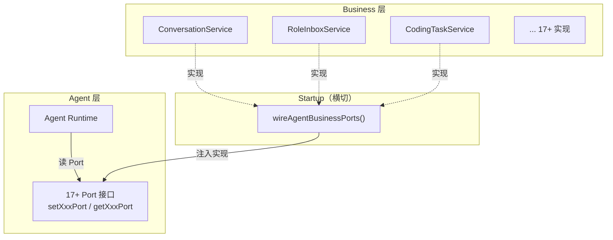
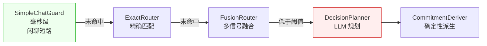

# 第 28 章 设计模式提炼

> "模式不是教条，而是经验的结晶。"

经过前 27 章的源码剖析，我们已经看到了 WinMatrix 如何解决各种工程问题——从数据库连接池的自动恢复，到 LLM 调用的悬挂补偿，到定时任务的幂等注册。这些解决方案背后，贯穿着一组可复用的设计模式。本章不是"GoF 23 模式"的罗列，而是从 WinMatrix 的真实代码里提炼出来的、经过生产验证的架构模式。

我们从最根本的分层架构讲起——这是整个项目的骨架，然后依次展开依赖规则的门禁执行、Port 注入解耦、DI 容器启动断言、DomainResult 模式，以及若干贯穿全书的工程模式。

## 28.1 六层分层架构：严格依赖规则

AGENTS.md（架构 SSOT）里有一段明确的开场白：

> Layering is strict: `Interface -> Agents -> Business-Tools -> Business -> Infrastructure`.
> Agents must not import Business directly; use Business-Tools.
> Infrastructure/Business must not import Agents.

这不是建议，而是**强制规则**。WinMatrix 的仓库大层是严格五层：

```
src/
├── interface/        # API / Channel / Middleware（最外层）
├── agents/           # Agent Runtime（内部还有 6 子层）
├── business-tools/   # 业务工具（agents 唯一可调的业务门面）
├── business/         # 领域服务
├── infrastructure/   # 基础设施（最内层）
├── integration/      # 横切连接器
├── startup/          # 启动引导（横切，DI 注册 + Port 注入）
└── shared/ types/ utils/ config/ cli/   # 横切共享
```

### Agent Runtime 的六子层

agents 层内部还细分了六个子层（`src/agents/core/`）：

| 子层 | 路径 | 职责 |
|------|------|------|
| AI Kernel | `agents/core/ai-kernel/` | 六域内核原语 + Port 契约 |
| AI Execution | `agents/core/ai-execution/` | cutover 编排、Port 适配器 |
| Worker | `agents/core/worker/` | Role / Action / 数字员工运行时 |
| Agent | `agents/core/agent/` | 决策引擎 + Turn 编排 + 执行模式 |
| Kernel Management | `agents/core/kernel-management/` | 配置治理 + DB 热更新 |
| Runtime | `agents/core/runtime/` | 会话转录 + 执行挂起 |

子层之间也有依赖规则——这是分层架构的递归应用。大层有规则，大层内部还继续分。

### 依赖规则详表

AGENTS.md 把允许和禁止的依赖列得很清楚：

| 允许 ✅ | 禁止 ❌ |
|---------|---------|
| agents → business-tools | agents → business |
| agents → infrastructure | business → agents |
| business-tools → business | business-tools → agents |
| business → infrastructure | infrastructure → agents |
| interface → 任意下层 | L3 harness → L4 domain-harness（横向隔离） |
| ai-execution → kernel + agents | ai-kernel → agents/core/worker |
| ai-kernel → infrastructure | ai-kernel → business/ |

这张表里有几个容易被忽视的禁止规则：

- **agents → business 禁止**：Agent 不能直接调领域服务，必须经过 business-tools（业务工具门面）。这是为了让领域服务的变更不直接影响 Agent。
- **infrastructure → agents 禁止**：基础设施层绝对不能反向依赖 Agent 层。这是依赖倒置的核心——基础设施实现 Agent 定义的 Port，而不是反过来。
- **L3 harness ↔ L4 domain-harness 横向隔离**：agents 层内部的 harness 和 domain-harness 不能互相 import。横向隔离防止"同层不同子层"耦合。
- **channel ↔ connectors 横向隔离**：interface/channel 和 integration/connectors 不能互相 import。

## 28.2 import 门禁：从文档到可执行检查

分层规则如果只写在文档里，迟早会被违反。WinMatrix 用两道脚本门禁强制执行：

### check:layers（存量 allowlist）

```bash
npm run check:layers    # node scripts/check-layer-imports.cjs
```

这道检查**带存量 allowlist**——已知的、历史遗留的违规被列在白名单里，检查时跳过。这是一个务实的妥协：不能因为历史债就阻塞所有 PR，但也不能让新的违规溜进来。

### check:agent-layers:strict（增量零容忍）

```bash
npm run check:agent-layers:strict
# = check-agent-layer-imports.cjs --strict && npm run check:tool-kernel-consumption
```

这道检查是**增量零容忍**——`--strict` 模式下，任何新的违规都会失败。它检查的是 Agent 内部子层的依赖规则，以及横向隔离：

```js
// scripts/check-agent-layer-imports.cjs（第 15-80 行）
const L3_L4_ISOLATION_PREFIXES = [
  { from: 'agents/harness/', forbidden: '@/agents/domain-harness/' },
  { from: 'agents/domain-harness/', forbidden: '@/agents/harness/' },
];
const CHANNEL_INTEGRATION_ISOLATION = [
  { from: 'interface/channel/', forbidden: '@/integration/connectors/' },
  { from: 'integration/connectors/', forbidden: '@/interface/channel/' },
];
const INFRA_FORBIDDEN_PRODUCT_DIRS = [
  'infrastructure/dashboard', 'infrastructure/identity', 'infrastructure/session',
  'infrastructure/codingTask', 'infrastructure/kickoff', 'infrastructure/sandbox/workstation',
];
```

注意 `INFRA_FORBIDDEN_PRODUCT_DIRS`——基础设施层禁止依赖这些产品目录。这是"基础设施不能反向依赖业务"的具体落点：dashboard、identity、session、codingTask 等都是业务概念，infrastructure 实现它们的基础设施（DB、缓存），但不能直接调它们的业务逻辑。

**两道门禁的组合是"渐进式收紧"策略**：存量违规用 allowlist 容忍，增量违规零容忍。这比"一次性全部改对"现实得多——大型项目不可能一夜之间消除所有历史违规，但可以保证不再产生新的。

### 门禁在 CI 里执行

这两道门禁在 CI 流水线里执行（第 26 章）。任何 PR 如果引入了新的违规，CI 会失败，PR 无法合并。**架构规则的可执行性，是分层架构长期有效的保障。**

## 28.2.1 横向隔离：为什么 L3 和 L4 不能互相 import

依赖规则详表里有一条容易被忽视的禁止规则：**L3 harness ↔ L4 domain-harness 横向隔离**。为什么同一层（agents）内部的两个子层不能互相 import？

`agents/harness/` 和 `agents/domain-harness/` 是 agents 层内部的两个子层：

- **harness（L3）**：通用的 Agent 运行时框架——Turn 编排、工具循环、决策引擎接入。
- **domain-harness（L4）**：领域特定的 Agent 实现——具体角色（大福、阿码等）的提示词、技能绑定、领域逻辑。

如果 L4 import L3，那是正常的——领域实现依赖通用框架。但如果 L3 import L4，就糟糕了——通用框架开始依赖具体领域实现，框架失去了通用性。

更微妙的是 L4 import L4 的问题——不同领域的 domain-harness 互相 import（比如"大福"的代码 import "阿码"的代码），会导致领域之间耦合。大福的改动可能影响阿码，这在大型团队里是协作灾难。

```js
// scripts/check-agent-layer-imports.cjs
const L3_L4_ISOLATION_PREFIXES = [
  { from: 'agents/harness/', forbidden: '@/agents/domain-harness/' },
  { from: 'agents/domain-harness/', forbidden: '@/agents/harness/' },
];
```

注意这条规则是**双向禁止**——L3 不能 import L4，L4 也不能 import L3。这比"单向允许"更严格，但也更安全：它强制两个子层通过**定义良好的接口**通信，而不是直接 import 对方的实现。

**横向隔离的哲学是"同层不同职责的模块应该互不可见"。** 这和"分层架构"的纵向规则是互补的——纵向管上下层依赖，横向管同层模块隔离。

### channel ↔ connectors 隔离

类似的横向隔离还有 `interface/channel/` 和 `integration/connectors/`：

```js
const CHANNEL_INTEGRATION_ISOLATION = [
  { from: 'interface/channel/', forbidden: '@/integration/connectors/' },
  { from: 'integration/connectors/', forbidden: '@/interface/channel/' },
];
```

- **channel**：消息通道（企微、WebSocket 等）的接口层。
- **connectors**：外部系统连接器（TFS、Git、MCP 等）。

这两者都是"和外部系统交互"的模块，但职责不同——channel 管"消息怎么进来/出去"，connectors 管"怎么连外部系统"。它们之间不能直接 import，必须通过 business 层中介。**这防止了"通道直接连连接器"的捷径，强迫所有外部交互经过业务逻辑层的治理。**

## 28.3 Port 注入解耦：Agent 不直 import Business

分层规则说"agents 不能直接 import business"，但 Agent 运行时确实需要调业务功能（查项目、写对话、入队收件箱）。怎么解决这个矛盾？

答案是 **Port 注入**。Agent 层定义一组 Port（接口），business 层实现这些 Port，在 startup 阶段把实现"注入"到 Agent 层。

### wireAgentBusinessPorts

```ts
// src/startup/wireAgentBusinessPorts.ts（第 123-214 行）
export function wireAgentBusinessPorts(): void {
  setConversationServicePort(getConversationService());
  setConversationMessageAppendPort(getConversationMessageAppendService());
  setRoleInboxPort(roleInboxEnqueueService);
  setIdentityPort({ ... });
  setDigitalEmployeeBootstrapPort({ ... });
  setProjectContextPort({ ... });
  setSkillManifestPort({ ... });
  setSkillCredentialResolutionPort({ ... });
  setCodingTaskPort({ ... });
  setWorkstationPort({ ... });
  setAgentPromptTemplatePort({ ... });
  setExternalAgentActivityPort({ ... });
  setFlowOrchestrationPort({ ... });
  setKickoffExecutionPort({ ... });
  setPromptOverridePort({ ... });
  // ... 共 17+ 个 setter
}
```

`wireAgentBusinessPorts` 在 startup 阶段调用一次，把 17+ 个业务 Port 的实现注入到 Agent 层。每个 Port 是一个 setter 函数（`setXxxPort`），Agent 层用 getter（`getXxxPort`）取用。

这种模式的好处：

1. **Agent 层不 import business**：Agent 代码里只有 Port 接口定义，没有 business 的实现。import 检查能通过。
2. **business 层可独立演化**：business 层重构实现，只要 Port 接口不变，Agent 层无感知。
3. **测试时可注入 mock**：测试时可以注入 mock Port，不需要真实的 business 实现。

### Port 的本质

Port 注入是依赖倒置原则（DIP）的大规模应用。传统的依赖倒置是一个类注入一个接口，WinMatrix 把它做成了"整个层的依赖注入"——Agent 层依赖 17+ 个 Port，而不是 17+ 个具体 service。



**Port 注入让"分层依赖规则"和"运行时功能调用"不再矛盾。** 编译期 Agent 不依赖 Business（只依赖 Port 接口），运行期通过注入拿到 Business 的实现。

## 28.3.1 Port 接口的粒度设计

17+ 个 Port 看起来很多，但每个 Port 的粒度是精心设计的。Port 不是"一个 service 一个 Port"，而是"一个职责一个 Port"。

以 conversation 相关为例：

- `setConversationServicePort(getConversationService())` —— 会话查询。
- `setConversationMessageAppendPort(getConversationMessageAppendService())` —— 追加消息。

为什么"查询"和"追加"是两个 Port？因为它们的消费方不同——大部分 Agent 只需要查询会话，少数需要追加消息。如果合成一个 `ConversationPort`，所有 Agent 都会看到"追加消息"的方法，即使它们不需要。

**Port 粒度遵循接口隔离原则（ISP）**——不要让消费方依赖它不需要的方法。细粒度 Port 让每个 Agent 只看到自己需要的业务能力，减少意外耦合。

### Port 的 setter/getter 模式

```ts
// Agent 层定义
let conversationServicePort: ConversationServicePort;
export function setConversationServicePort(port: ConversationServicePort): void {
  conversationServicePort = port;
}
export function getConversationServicePort(): ConversationServicePort {
  return conversationServicePort;
}
```

这是最朴素的"模块级变量 + setter/getter"模式，没有用任何 DI 框架。为什么不用 InversifyJS、tsyringe 这类 DI 框架？

因为这里的需求很简单——**一次性注入，全局共享**。DI 框架的价值在于"按作用域管理依赖生命周期"（request scope、singleton scope 等），但 Agent Port 全是 singleton——注入一次，整个进程生命周期不变。用框架反而增加复杂度。

**"用最简单的工具解决问题"是工程成熟度的标志。** 不用框架的模块级 setter/getter，代码简单、无依赖、易理解，完全满足需求。

## 28.4 DI 容器与启动断言：fail-fast 注册

Port 注入只是 startup 序列的一部分。完整的启动序列在 `startup/common.ts`（27660 字节）里，分阶段执行：

```ts
// src/startup/common.ts（第 242-285 行，阶段 1：initInfrastructure）
// 1. registerServices()                — DI 容器注册
// 2. registerAgentOwnedSingletons()
// 3. registerWorkstationServices()
// 4. assertCoreDiRegistrations()       — 断言核心 DI 完成
// 5. side-effect import：              — 4 个 adapter，数量断言必须 4 个
//    'registerAdapters.js'
// 6. llmFactory.initProviderRegistry() — 仅 api/scheduled/all-in-one，rag 跳过
// 7. connectPrisma()
// 8. warnIfTimezoneInconsistent()      — Node TZ vs PG session 时区校验
// 9. ensureSystemUsers()
```

这里的核心模式是 **DI 容器 + 启动断言**：

### registerServices → assertCoreDiRegistrations

`registerServices()` 把所有服务注册到 DI 容器。注册完成后立即 `assertCoreDiRegistrations()`——断言所有核心服务都已注册。如果少了任何一个，启动直接失败。

这比"运行时才发现某个服务没注册"好得多。运行时发现意味着——系统已经跑起来，某个请求触发了缺失的服务，才报错。这种错误隐蔽、难排查。**启动时一次性断言，让"注册缺失"在启动期就暴露。**

### side-effect adapter 数量断言

```ts
// 阶段 1 步骤 5
await import('@/infrastructure/integration/sideEffect/registerAdapters.js');
// registerAdapters.js 通过 side-effect 注册 4 个 adapter
// 之后断言 adapterCount === 4，否则 fail-fast
```

`registerAdapters.js` 通过 side-effect（模块加载时的副作用）注册 adapter。注册完之后，启动代码断言 adapter 数量必须等于 4——如果不等于 4（少了或多了），启动失败。

为什么需要这个断言？因为 side-effect 注册是"隐式"的——不像显式调用 `register(X)`，它是靠 import 触发的。如果某个 adapter 的 import 被意外删除，数量就会变少，但不会有编译错误。数量断言是这种隐式注册的安全网。

**DI 容器 + 启动断言的组合，把"注册正确性"从运行时挪到了启动时。** 这是 fail-fast 原则在依赖注入上的应用。

## 28.4.1 启动序列的两阶段设计

`startup/common.ts` 的启动序列不是一锅炖，而是分两个阶段：

```ts
// 阶段 1：initInfrastructure（基础设施）
// 1. registerServices()
// 2. assertCoreDiRegistrations()
// 3. side-effect adapters
// 4. llmFactory.initProviderRegistry()   — 仅 api/scheduled/all-in-one
// 5. connectPrisma()
// 6. warnIfTimezoneInconsistent()
// 7. ensureSystemUsers()

// 阶段 2：initConfigAndCache（配置与缓存）
// 8. entityCache.initialize() + cacheInvalidationBus.initialize()
// 9. configManager.initialize()           — 带 60s 超时
// 10. bootstrapPromptRegistry()           — rag 跳过
// 11. ConfigDbListener                    — 监听 pg_notify('config_change')
```

为什么分两阶段？因为它们有**不同的失败容忍度**：

- **阶段 1（基础设施）**：失败 = 不能启动。Prisma 连不上、DI 注册不完整——这些是致命的，直接 fail-fast。
- **阶段 2（配置与缓存）**：部分失败可以容忍。ConfigDbListener 连不上 PG NOTIFY，应用还能用默认配置跑；entityCache 初始化失败，降级到 L1-only。

这种分阶段设计让启动有一个"从严格到宽松"的梯度——基础设施必须就绪，但配置/缓存可以尽力而为。

### rag 进程的跳过逻辑

注意阶段 1 步骤 4 和阶段 2 步骤 10-11 都有"rag 跳过"的逻辑。rag-worker 进程的职责是 RAG 摄入（文档分块、向量化、写 ES），它不需要：

- **LLM Provider Registry**：RAG 摄入用 embedding 模型，不走 LLM provider。
- **Prompt Registry**：RAG 不涉及提示词。
- **ConfigDbListener**：RAG 不需要配置热更新（它的配置相对静态）。

**跳过这些初始化让 rag-worker 启动更快、内存占用更少。** 这是进程角色隔离的另一个好处——每个进程只初始化自己需要的东西，不背多余的全局状态。

## 28.5 DomainResult：错误处理的统一契约

WinMatrix 的业务方法返回值几乎都是 `DomainResult<T>`，而不是直接返回 `T` 或抛异常。AGENTS.md 里有明确的约束：

> DomainResult: only access `result.error` after `!result.success` or use `getDomainError(result)`.

意思是：`DomainResult` 有 `success` 和 `error` 两个字段。**只有在 `success === false` 时才能访问 `error`**。如果你在 `success === true` 时访问 `error`，行为未定义（可能是旧值，可能是 undefined）。

这个约束的价值：

1. **显式的错误处理**：调用方必须先检查 `success`，不能忽略错误。
2. **不靠异常**：业务错误（不是 bug）用 DomainResult 表达，不用 throw。异常只留给真正的"意外情况"。
3. **类型安全**：配合 TypeScript，`getDomainError(result)` 只在 `!success` 时返回有意义的值。

```ts
// 正确用法
const result = await someService.doSomething(input);
if (!result.success) {
  // 这里可以安全访问 result.error 或 getDomainError(result)
  handleFailure(result.error);
  return;
}
// success 时访问 result.data
useData(result.data);
```

这种模式避免了"调用方忘记 try/catch"或"异常被吞掉"的常见问题。**DomainResult 把错误处理变成了类型契约，编译器帮你检查。**

## 28.5.1 DomainResult vs 异常：何时用哪个

DomainResult 模式不是要完全取代异常。WinMatrix 的实践是**分场景使用**：

| 场景 | 用 DomainResult | 用 throw |
|------|----------------|---------|
| **业务规则不满足**（如权限不足、状态不对） | ✅ | ❌ |
| **输入校验失败**（如必填字段缺失） | ✅ | ❌ |
| **外部服务返回业务错误**（如 TFS 查询无结果） | ✅ | ❌ |
| **真正的 bug**（如空指针、类型错误） | ❌ | ✅ |
| **基础设施故障**（如 DB 连接断开） | ❌ | ✅（由 Proxy 自动恢复） |
| **不可恢复的致命错误** | ❌ | ✅（fatal_exiting） |

区分的原则是：**"预期的失败"用 DomainResult，"意外的失败"用异常。**

业务规则不满足是"预期的"——系统设计时就预料到用户可能没权限、状态可能不对。这种"失败"是业务逻辑的一部分，不是 bug。

空指针异常是"意外的"——代码里某个地方应该有值但却是 null，这是 bug。用 DomainResult 表达 bug 会掩盖问题——调用方以为"这是正常的业务失败"，不会去排查。

**DomainResult 让正常流程（含业务失败）和异常流程（bug、故障）清晰分离。** 正常流程不走异常机制，调用方通过 `result.success` 判断；异常流程走 try/catch，由上层统一处理。

### getDomainError 的类型安全

```ts
// 只有 !result.success 时才返回有意义的值
function getDomainError(result: DomainResult<unknown>): DomainError | undefined
```

为什么不直接 `result.error`？因为 TypeScript 无法在类型层面区分"success=true 的 result"和"success=false 的 result"——它们都是 `DomainResult<T>` 类型。直接访问 `.error` 在 success=true 时也能编译通过，但值是 undefined（或旧值）。

`getDomainError` 通过运行时检查提供了一层保护——虽然类型层面仍是 `DomainError | undefined`，但函数名和文档明确提醒"只在 !success 时调用"。

**类型系统不能完全替代程序员自律，但好的 API 设计能减少出错概率。** `getDomainError` 就是这样的设计。

## 28.6 渐进式决策管线：成本与质量的平衡

第 10 章详细讲了决策引擎。这里从模式角度提炼：



这个模式的核心是**渐进式复杂性**：每一阶段都是一个过滤器，逐步缩小决策空间。前几个阶段用规则（低成本），最后才用 LLM（高成本）。

价值：

- **简单请求（占大多数）毫秒级响应**：闲聊在 SimpleChatGuard 就短路了。
- **成本与质量平衡**：只有真正需要 LLM 的复杂请求才调 LLM。
- **可观测**：每个阶段的命中/未命中都记录，能定位"为什么这个请求走了 LLM"。

这个模式不限于决策引擎——任何"有便宜路径和昂贵路径"的系统都可以用。**先用便宜的尝试，失败了再用贵的，是成本优化的通用策略。**

## 28.7 Lease-Claim 调度：至少一次执行

第 11 章和第 23 章都讲了 Lease-Claim 模式。这里从模式角度提炼：

```ts
type InstructionRow = {
  claim_token: string;        // 认领令牌
  claim_expires_at: Date;     // 租约过期
  claimed_by: string;         // 认领者
  attempt: number;            // 尝试次数
};
```

Worker 认领任务时获得一个带过期时间的租约。如果 Worker 崩溃，租约过期后其他 Worker 可以重新认领。

这个模式解决了分布式调度的核心问题——**至少一次执行**：

- 任务不会被两个 Worker 同时执行（claim_token 互斥）。
- Worker 崩溃后任务不会丢（租约过期重新认领）。
- 无需中心化协调器（靠 DB 的 claim 状态）。

**Lease-Claim 是"无中心分布式调度"的经典模式。** 它的代价是"可能重复执行"（租约过期但原 Worker 还活着），所以消费者必须幂等。

## 28.8 自动恢复代理：透明的故障恢复

第 4 章详细讲了 Prisma Client 的自动恢复。这里提炼模式：

```ts
function withPrismaRecovery(path, args): unknown {
  try {
    return invokePrismaPath(path, args);
  } catch (err) {
    if (!isRecoverablePrismaPoolError(err)) throw err;
    await rebuildPrismaResources(err);     // Single-flight 重建
    return invokePrismaPath(path, args);   // 自动重试
  }
}
export const prisma = createPrismaProxy();
```

模式要点：

1. **Proxy 拦截**：导出的 `prisma` 不是真实 client，是 Proxy。
2. **错误分类**：只对"可恢复错误"（连接池断开）做恢复，其他错误照常抛。
3. **Single-flight 重建**：多个并发请求同时遇到错误时，只有一个执行重建，其他复用。
4. **透明重试**：重建后自动重试原操作，调用方无感知。

**这个模式让业务代码无需处理基础设施故障——恢复机制完全透明。** 它适用于任何"可恢复的瞬时故障"场景：数据库连接、Redis 连接、HTTP 客户端。

## 28.9 双连接策略：按用途差异化配置

第 5 章和第 23 章都提到了 BullMQ 的双连接：

```ts
// Queue 连接（生产端）：加 commandTimeout（普通写操作）
export const bullmqQueueConnection = new Redis(config.redisUrl, {
  commandTimeout: 30000,
});

// Worker 连接（消费端）：不加 commandTimeout（阻塞命令 BRPOP）
export const bullmqWorkerConnection = new Redis(config.redisUrl, {
  // 明确不加 commandTimeout
});
```

同样的 Redis，两组配置，区别只在于"是否阻塞"。

这个模式的核心洞察是：**不要用一把尺子量所有连接**。不同用途的连接有不同的工作模式——生产端是短命令（SET/HSET），适合加超时；消费端是长阻塞（BRPOP），不适合加超时（会被误判超时触发重连风暴）。

## 28.10 Outbox 模式：执行与副作用解耦

第 23 章的 Result Delivery Outbox、第 24 章的投递状态机，都是 Outbox 模式的应用：

```
业务执行 ──→ 写业务表 + 写 outbox 字段（同事务）
                        │
                        │  独立扫描器（异步）
                        ▼
                  读 outbox，执行副作用
                        │
                        ▼
                  标记 outbox 完成
```

模式要点：

1. **业务执行和副作用记录在同一事务**：保证"要么都成功，要么都失败"。
2. **副作用异步执行**：扫描器定时读 outbox，执行真正的副作用。
3. **副作用可重试**：失败不影响业务事务。

**Outbox 模式解决了"事务边界和副作用边界不一致"的经典问题。** 业务事务要快（提交），副作用可能慢（发企微通知），把它们拆开，各走各的。

## 28.11 信号量复用：跨队列的全局并发治理

第 23 章的 crossAgentTriggerWorker 和 scheduled-agent 共享信号量：

```ts
// crossAgentTriggerWorker 与 scheduled-agent 共享 getScheduledAgentSemFromEnv
// 超并发时 moveToDelayed + DelayedError 重投
```

模式要点：

1. **跨队列共享信号量**：多个 Worker 消费不同队列，但竞争同一个昂贵资源（LLM 并发额度）。
2. **背压重投**：拿不到信号量不直接失败，用 DelayedError 把 job 放回队列延迟重试。

**这个模式适用于"多个异步入口共享同一个昂贵资源"的场景。** 每个队列自己限流是不够的——它们加起来可能超过资源上限。必须有全局视图。

## 28.12 双信号退出：优雅与强制的平衡

```ts
export function armForceExitOnSecondSignal(): void {
  // 首次 SIGINT：触发优雅关闭（处理完在途任务）
  // 二次 SIGINT：强制退出（process.exit(1)）
}
```

首次信号给系统"优雅关闭的机会"——处理完在途请求、关闭连接、flush 日志。二次信号是"我等不及了"的逃生通道——立即退出。

**这个模式兼顾了"优雅"和"可控"**——既给系统时间善后，又不让运维在紧急时卡在"等优雅关闭"上。

## 28.13 Schema 漂移三层防御

第 13 章详细讲了技能 Schema 漂移检测。这里提炼成模式：

1. **启动期探测**：查 `information_schema.columns` 看数据库实际状态（而非 Prisma 类型）。
2. **运行期识别**：识别 Prisma 错误码（P2021/P2022）。
3. **整体降级**：检测到漂移，API 返回 503，而不是随机失败。

**这个模式把"随机崩溃"变成了"启动告警 + 安全降级"。** 适用于任何"代码定义和数据库实际状态可能脱节"的场景。

## 本章小结

本章从 WinMatrix 的真实代码里提炼了 13 个核心设计模式：

1. **六层分层架构**：严格五层大层 + Agent 内部六子层，依赖规则详表明确允许与禁止。
2. **import 门禁**：check:layers（存量 allowlist）+ check:agent-layers:strict（增量零容忍）+ 横向隔离（L3↔L4、channel↔connectors）+ infra 禁止依赖产品目录，CI 强制执行。
3. **Port 注入解耦**：wireAgentBusinessPorts 注入 17+ 业务 Port，Agent 不直 import Business，编译期解耦、运行期注入、测试期可 mock。
4. **DI 容器 + 启动断言**：registerServices → assertCoreDiRegistrations → side-effect adapter 数量断言（必须 4 个），注册正确性从运行时挪到启动时。
5. **DomainResult 模式**：只在 `!result.success` 后访问 `result.error` 或用 `getDomainError`，错误处理变成类型契约。
6. **渐进式决策管线**：便宜规则优先，昂贵 LLM 兜底，成本与质量平衡。
7. **Lease-Claim 调度**：claim_token 互斥 + 租约过期重领，至少一次执行，消费者须幂等。
8. **自动恢复代理**：Proxy 拦截 + 错误分类 + Single-flight 重建 + 透明重试。
9. **双连接策略**：按用途差异化配置（Queue 加 timeout，Worker 不加）。
10. **Outbox 模式**：业务执行与副作用解耦，同事务记录 outbox，异步扫描器执行。
11. **信号量复用**：跨队列共享信号量 + DelayedError 背压重投，全局并发治理。
12. **双信号退出**：首次优雅关闭，二次强制退出。
13. **Schema 漂移三层防御**：启动期探测 + 运行期识别 + 整体降级。

这些模式不是孤立的——它们相互配合，共同构建了一个可维护、可扩展、高可用的 AI 数字员工平台。在最后一章里，我们将跳出具体模式，探讨贯穿 WinMatrix 的工程哲学。

下一章是全书的最后一章，我们将从这些模式里提炼出更深层的工程哲学，并对全书做总结性收束。
