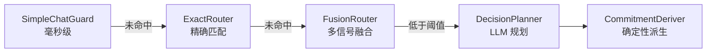

# 第 28 章 设计模式提炼

> "模式不是教条，而是经验的结晶。"

经过前 27 章的源码剖析，我们已经看到了 WinMatrix 如何解决各种工程问题。本章将提炼这些解决方案背后的设计模式，帮助读者建立可复用的架构思维。

## 28.1 分层架构与依赖倒置

**核心思想**：通过严格的分层和依赖倒置，让大型系统保持可维护性。

WinMatrix 的六层架构（Interface → Agents → Integration → Business-Tools → Business → Infrastructure）不是简单的目录划分，而是通过**依赖规则强制执行**的：

```typescript
// scripts/check-layer-imports.cjs
const LAYER_RULES = {
  infrastructure: { forbidden: ['agents'] },  // 基础设施不能依赖 Agent
  agents: { forbidden: ['business'] },         // Agent 不能直接依赖业务
};
```

### Port-Adapter 模式

依赖倒置通过 Port-Adapter 模式实现：

```typescript
// Domain 层定义 Port（接口）
export interface IDigitalEmployeeRepository {
  getById(id: string): Promise<DigitalEmployeeRecord | null>;
}

// Infrastructure 层实现 Adapter
export class DigitalEmployeeRepositoryImpl implements IDigitalEmployeeRepository {
  async getById(id: string) {
    return prisma.digitalEmployee.findUnique({ where: { id } });
  }
}
```

**价值**：Domain 层完全不知道数据库的存在，可以独立测试、自由重构。

### 类型下沉

当多层需要共享类型时，通过"类型下沉"避免循环依赖：

```typescript
// src/types/wechat.ts
// agents 层需要的 business 层类型子集
export interface IProjectServiceForAgents {
  getInfo(projectId: string): Promise<DomainResult<ProjectInfo>>;
}
```

**价值**：agents 层只依赖最小接口子集，business 层可独立演化。

## 28.2 进程角色拆分

**核心思想**：同一份代码，通过环境变量控制行为，支持从单体到分布式的渐进演化。

```typescript
// src/startup/processRole.ts
export function assertProcessRole(expected: ProcessRole): void {
  const actual = process.env.WIN_PROCESS_ROLE?.trim();
  if (actual !== expected) {
    throw new Error(`[ProcessRole] Entry requires WIN_PROCESS_ROLE=${expected}`);
  }
}
```

这个守卫在**动态导入之前**执行——如果角色不匹配，重量级模块不会被加载。

**价值**：

- 开发时单进程调试全功能
- 生产时按资源特性拆分（API / Scheduled / RAG）
- 无需维护多份代码

## 28.3 渐进式决策管线

**核心思想**：简单请求低成本解决，复杂请求才调用 LLM。



每一阶段都是一个"过滤器"，逐步缩小决策空间。前几个阶段使用规则（低成本），最后才使用 LLM（高成本）。

**价值**：

- 成本与质量的平衡
- 简单请求（占大多数）毫秒级响应
- 语义缓存进一步降低 LLM 调用

## 28.4 语义缓存

**核心思想**：相似请求复用历史决策，避免重复调用 LLM。

```typescript
// src/agents/core/agent/decision/SemanticPlannerCache.ts
const SEMANTIC_PLANNER_MIN_SIMILARITY = 0.95;     // 高阈值
const SEMANTIC_PLANNER_ENTRY_TTL_MS = 3_600_000;   // 1 小时
```

关键创新是**动态槽位指纹**——防止"修复 bug-123"和"修复 bug-456"这种文本相似但任务不同的请求被错误复用。

**价值**：在不牺牲质量的前提下大幅降低 LLM 成本。

## 28.5 Observe-Think-Act 循环

**核心思想**：LLM 驱动的步骤循环，支持动态调整计划。

```typescript
// React 循环
while (true) {
  thinkOutput = await thinkFn({ planSteps, stepRecords });  // Think
  if (thinkOutput.isTerminal) break;                        // 终止判定
  brief = buildReactBrief(thinkOutput);                     // 构造 brief
  workerResult = await workerRuntime.execute(brief);        // Act
  stepRecords.push({ status, outputSummary });              // Observe
  if (stepRecords.length >= maxSteps) break;                // 步数限制
}
```

"plan 是地图不是铁轨"——LLM 可以根据 worker 的实际结果跳步、插步、改步，而非机械执行预定义计划。

**价值**：灵活应对执行过程中的不确定性。

## 28.6 三区检索

**核心思想**：渐进式召回，不同信任级别的记忆使用不同阈值。

```typescript
const ZONE1_MIN_SCORE = 0.25;  // 当前会话（最宽松）
const ZONE2_MIN_SCORE = 0.5;   // 项目记忆（中等）
const ZONE3_MIN_SCORE = 0.8;   // 跨会话（最严格）
```

**价值**：

- 当前会话上下文最相关，阈值最松
- 跨会话记忆可能不相关，阈值最严
- 平衡召回率和精确率

## 28.7 Lease-Claim 分布式调度

**核心思想**：通过租约（Lease）实现分布式 Worker 的至少一次执行。

```typescript
type InstructionRow = {
  claim_token: string;        // 认领令牌
  claim_expires_at: Date;     // 租约过期
  claimed_by: string;         // 认领者
  attempt: number;            // 尝试次数
};
```

Worker 认领任务时获得一个带过期时间的租约。如果 Worker 崩溃，租约过期后其他 Worker 可以重新认领。

**价值**：

- 至少一次执行保证
- Worker 崩溃自动恢复
- 无需中心化协调器

## 28.8 双连接策略

**核心思想**：根据使用场景差异化配置连接。

```typescript
// Queue 连接：加 commandTimeout（普通写操作）
export const bullmqQueueConnection = new Redis(config.redisUrl, {
  commandTimeout: 30000,
});

// Worker 连接：不加 commandTimeout（阻塞命令）
export const bullmqWorkerConnection = new Redis(config.redisUrl, {
  // 明确不加 commandTimeout
});
```

**价值**：避免了 BullMQ Worker 阻塞命令的重连风暴。

## 28.9 自动恢复代理

**核心思想**：通过 Proxy 拦截，实现透明的故障恢复。

```typescript
// src/infrastructure/persistence/prisma/client.ts
function withPrismaRecovery(path, args): unknown {
  try {
    return invokePrismaPath(path, args);
  } catch (err) {
    if (!isRecoverablePrismaPoolError(err)) throw err;
    await rebuildPrismaResources(err);          // Single-flight 重建
    return invokePrismaPath(path, args);        // 自动重试
  }
}

export const prisma = createPrismaProxy();
```

**价值**：业务代码无需处理连接故障，恢复机制完全透明。

## 28.10 中断请求捕获

**核心思想**：通过注册表 + 事件优先级，可靠记录中断的请求。

```typescript
const registry = new Map<string, PendingSpan>();  // 注册表

// 事件优先级：onResponse > close/error > sweep
// 确保客户端断开的请求也被审计
```

**价值**：即使客户端断开连接，审计日志也不会丢失。

## 28.11 双信号机制

**核心思想**：首次信号优雅关闭，二次信号强制退出。

```typescript
export function armForceExitOnSecondSignal(): void {
  if (forceExitArmed) return;
  forceExitArmed = true;
}
```

**价值**：兼顾优雅关闭和紧急退出的需求。

## 28.12 工厂注册表

**核心思想**：通过工厂函数延迟创建，支持按需实例化。

```typescript
// Role 注册
roleRegistry.registerFactory('orchestrator', () => new OrchestratorRole());
roleRegistry.registerFactory('process_manager', () => new ProcessManagerRole());

// 工具注册（懒加载）
const TOOL_MODULES = [
  () => import('@/business-tools/project/index.js'),
  () => import('@/business-tools/task/index.js'),
];
```

**价值**：

- 启动性能优化（未使用的对象不创建）
- 内存占用降低
- 单个注册失败不影响其他

## 本章小结

本章提炼了 WinMatrix 的 12 个核心设计模式：

1. **分层架构 + 依赖倒置**：六层 + Port-Adapter + 类型下沉
2. **进程角色拆分**：同代码多形态，动态导入前守卫
3. **渐进式决策管线**：规则到 LLM 的渐进路由
4. **语义缓存**：embedding 最近邻 + 动态槽位指纹
5. **Observe-Think-Act**：LLM 驱动的灵活循环
6. **三区检索**：渐进式阈值，信任分级
7. **Lease-Claim 调度**：租约 + 至少一次执行
8. **双连接策略**：差异化配置避免重连风暴
9. **自动恢复代理**：Proxy 透明故障恢复
10. **中断请求捕获**：注册表 + 事件优先级
11. **双信号机制**：优雅 + 强制退出
12. **工厂注册表**：延迟创建 + 按需实例化

这些模式不是孤立的——它们相互配合，共同构建了一个可维护、可扩展、高可用的 AI 数字员工平台。
