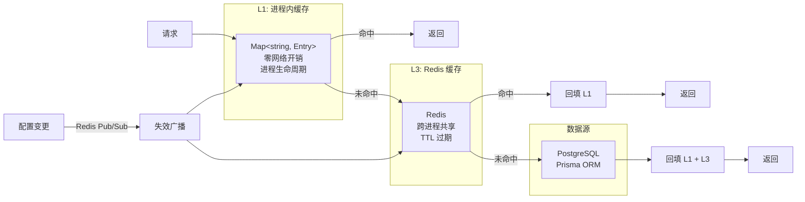

# 第 4 章 数据库与持久化

> "数据是系统的血液，数据库是系统的心脏。"

WinMatrix 的核心数据存储基于 PostgreSQL + Prisma 7，157 个模型覆盖了从数字员工到 Agent 执行记录、从知识库到工作流编排的完整业务域。但持久化层不仅仅是数据库表的映射——它包含了自动恢复的连接池、多级缓存架构、分布式锁、乐观锁并发控制和事务编排。本章将从 Schema 设计出发，逐步深入持久化层的工程细节。

## 4.1 Prisma Schema：157 个模型的组织哲学

WinMatrix 的数据库 Schema 定义在 `prisma/schema.prisma`（4065 行）中，包含 157 个模型。这些模型按业务域可以划分为以下几个层次：

### Generator 与 Datasource 配置

```prisma
// prisma/schema.prisma（第 1-9 行）
generator client {
  provider        = "prisma-client"
  output          = "../src/infrastructure/persistence/prisma/generated"
  previewFeatures = ["partialIndexes"]
}

datasource db {
  provider = "postgresql"
}
```

几个值得注意的配置：

- **`prisma-client`**（而非 `prisma-client-js`）：使用新版 Prisma Client Generator，输出到自定义目录
- **`partialIndexes`**：启用条件索引（`WHERE` 子句），用于高频统计查询的部分索引
- **唯一数据源 PostgreSQL**：所有业务数据统一存储在 PostgreSQL 中，Elasticsearch 和 Neo4j 仅用于搜索和图查询

### 核心模型分类

157 个模型按业务域组织如下：

```mermaid
graph TB
    subgraph "核心业务域（6 模型）"
        DE["DigitalEmployee<br/>数字员工"]
        P["projects<br/>项目"]
        T["tasks<br/>任务"]
        U["users<br/>用户"]
        M["members<br/>成员"]
        TM["teams<br/>团队"]
    end

    subgraph "Agent 执行域（10+ 模型）"
        AEL["AgentExecutionLog<br/>执行日志"]
        AR["agent_run<br/>运行记录"]
        ARS["agent_run_step<br/>步骤"]
        ARD["agent_run_decision<br/>决策"]
        ARW["agent_worker_execution<br/>Worker 执行"]
    end

    subgraph "Agent 配置域（6 模型）"
        AC["agent_config<br/>Agent 配置"]
        AT["agent_tool<br/>工具绑定"]
        ACAP["agent_capability<br/>能力"]
        APT["agent_prompt_template<br/>提示词模板"]
    end

    subgraph "对话系统（4 模型）"
        CH["conversation_histories<br/>对话历史"]
        CM["conversation_meta<br/>对话元数据"]
        ST["session_transcript<br/>会话记录"]
    end

    subgraph "工作流编排（8 模型）"
        FT["flow_template<br/>模板"]
        FTV["flow_template_version<br/>版本"]
        FR["flow_run<br/>运行"]
        FSR["flow_step_run<br/>步骤运行"]
    end

    subgraph "知识库/RAG（5 模型）"
        KB["knowledge_bases<br/>知识库"]
        K["knowledges<br/>知识条目"]
        KC["knowledge_chunks<br/>知识分块"]
        MC["memory_chunks<br/>记忆分块"]
    end

    subgraph "技能体系（8 模型）"
        SA["skill_artifact<br/>技能产物"]
        SCO["skill_contract_override<br/>契约覆盖"]
        ST2["SkillTrace<br/>执行轨迹"]
    end

    subgraph "路由/策略（4 模型）"
        RR["route_rule<br/>路由规则"]
        PTP["project_tool_policy<br/>工具策略"]
        TC["tool_config<br/>工具配置"]
    end

    subgraph "可观测性（4 模型）"
        ES["ExecutionSpan<br/>执行跨度"]
        ESE["ExecutionSpanEvent<br/>跨度事件"]
        UOR["UnifiedObservabilityRule<br/>观测规则"]
        PM["PerformanceMetrics<br/>性能指标"]
    end

    DE --> P
    P --> T
    P --> CH
    P --> KB
    AR --> ARS
    AR --> ARD
    AR --> ARW
    AEL --> AR
    FT --> FTV
    FTV --> FR
    FR --> FSR
```



### 关键模型：DigitalEmployee

```prisma
// prisma/schema.prisma（第 180 行起，节选关键字段）
/// 数字化员工（模型 A：与 Role 一一对应）
model DigitalEmployee {
  id                 String  @id
  employeeNo         String  @unique @map("employee_no")
  name               String
  department         String  @default("")
  position           String  @default("")
  email              String  @default("")
  platformAccount    String? @map("platform_account")
  roleId             String  @map("role_id")
  status             String  @default("active")
  createdAt          String  @map("created_at")
  updatedAt          String  @map("updated_at")
  avatarUrl          String? @map("avatar_url")
  tfsAccount         String? @map("tfs_account")
  tfsToken           String? @map("tfs_token")
  gitUserName        String? @map("git_user_name")
  gitPassword        String? @map("git_password")
  workstationConfig  Json?   @map("workstation_config")
  wecomAibotId       String? @map("wecom_aibot_id")
  wecomAibotSecret   String? @map("wecom_aibot_secret")
  promptOverride     Json?   @map("prompt_override")

  @@index([roleId], map: "idx_digital_employee_role_id")
  @@index([status], map: "idx_digital_employee_status")
  @@map("digital_employee")
}
```

注意几个设计决策：

- **`@@map("digital_employee")`**：Prisma 模型名使用 PascalCase（`DigitalEmployee`），数据库表名使用 snake_case（`digital_employee`）
- **`@map`**：字段名也从 camelCase 映射到 snake_case
- **Json 类型字段**：`workstationConfig` 和 `promptOverride` 使用 JSON 类型，存储半结构化配置
- **索引策略**：只在高频查询字段上建索引（`roleId`、`status`）

### 关键模型：AgentExecutionLog（已退役，留作条件索引教学）

> **退役说明**：`AgentExecutionLog` 已在 `retire-agent-execution-log` 变更中退役，其 SSOT 职责由 `ExecutionSpan` + `ExecutionSpanEvent` 取代（见第 25 章）。schema.prisma 中已无此 model 定义。这里保留它作为**条件部分索引（partial index）**的经典教学案例——这个设计模式在 `PerformanceMetrics` 等其他模型上仍在使用。

```prisma
// 历史 model AgentExecutionLog（已从 schema 移除，原第 11-75 行）
model AgentExecutionLog {
  id                     String  @id
  sessionId              String  @map("session_id")
  llmInvocationId        String? @map("llm_invocation_id")
  parentEventId          String? @map("parent_event_id")
  eventType              String  @map("event_type")
  timestamp              String
  roleId                 String? @map("role_id")
  digitalEmployeeName    String? @map("digital_employee_name")
  // ... 30+ 字段

  // 条件部分索引——仅对特定事件类型建索引，优化统计查询
  @@index([eventType, timestamp], map: "idx_agent_execution_stats_exec_event_time",
    where: raw("(event_type IN ('decision_call_end', 'agent_call_end', 'agent_invoke_end'))"))
  @@map("agent_execution_log")
}
```

这个模型的关键在于**条件部分索引**——`partialIndexes` 特性的应用。只有 `decision_call_end`、`agent_call_end`、`agent_invoke_end` 三种事件类型才会被索引，大幅减少了索引体积，同时覆盖了最常见的统计查询场景。虽然模型本身已退役，但这个"按事件类型过滤的部分索引"模式，在需要高频统计查询的场景下依然值得借鉴。

### 关键模型：agent_run

```prisma
// prisma/schema.prisma（第 1630-1682 行）
model agent_run {
  id                String    @id @default(uuid())
  conversationId    String    @map("conversation_id")
  userId            String?   @map("user_id")
  projectId         String?   @map("project_id")
  intentSummary     String    @map("intent_summary")
  decomposition     Json?
  orchestrationPlan Json?     @map("orchestration_plan")
  status            String    @default("running")
  durationSeconds   Int?      @map("duration_seconds")
  startedAt         DateTime  @default(now()) @map("started_at") @db.Timestamptz(6)
  finishedAt        DateTime? @map("finished_at") @db.Timestamptz(6)
  // ... 关联关系

  @@index([conversationId])
  @@index([userId, projectId])
  @@index([projectId, startedAt])
  @@index([status])
  @@map("agent_run")
}
```

`agent_run` 是 Agent 执行的核心记录表。注意它的索引设计：

- **`conversationId`**：按对话查询（最常见场景）
- **`userId + projectId`**：复合索引，按用户和项目联合查询
- **`projectId + startedAt`**：时间序列查询，支持"某项目最近的 Agent 运行"
- **`status`**：状态过滤，用于清理 `running` 状态的孤儿任务

## 4.2 Prisma Client：自动恢复的连接池

`src/infrastructure/persistence/prisma/client.ts`（474 行）是整个系统数据库访问的核心。它不是一个简单的 Prisma Client 实例化，而是一个**自动恢复的代理对象**。

### 连接池配置

```typescript
// src/infrastructure/persistence/prisma/client.ts（第 1-30 行）
/**
 * Prisma Client + pg.Pool 运行时资源
 *
 * 整个 winmatrix-server 进程对 PostgreSQL 的连接出口收敛到一组可重建资源：
 * - 1 个全局 pg.Pool（PRISMA_POOL_MAX 控制大小，默认 25）
 * - 1 个 PrismaPg adapter
 * - 1 个 PrismaClient
 *
 * pgbouncer transaction 模式下，客户端 TCP 连接和服务端 PG 连接生命周期不同步。
 * 因此本模块对外导出稳定的 prisma 代理对象，内部在可恢复连接池错误上重建资源组。
 */
const DEFAULT_POOL_MAX = 25;
const DEFAULT_IDLE_TIMEOUT_MS = 30_000;
const DEFAULT_CONNECTION_TIMEOUT_MS = 10_000;
const DEFAULT_KEEPALIVE_INITIAL_DELAY_MS = 10_000;
```

整个进程对 PostgreSQL 的连接**收敛到唯一的一个 pg.Pool**。这意味着所有 Repository 共享同一个连接池，避免了多池导致的资源浪费。

### 时区规避 Prisma Bug

```typescript
// src/infrastructure/persistence/prisma/client.ts（第 71-89 行）
function buildConnectionString(): string {
  const base = process.env.DATABASE_URL ?? '';
  // PG session TimeZone 必须设为 UTC —— 这是规避 Prisma #28629 的关键。
  // @prisma/adapter-pg（v7 Query Compiler）把 JS Date 序列化为「无时区标记的 UTC 墙钟串」
  // 再发给 PG。PG 收到无时区串后，按 *当前 session 时区* 解释成 timestamptz。
  const tzOption = 'options=-c%20TimeZone%3DUTC';
  return base.includes('?') ? `${base}&${tzOption}` : `${base}?${tzOption}`;
}
```

这是一个真实的工程踩坑记录。Prisma v7 的 `@prisma/adapter-pg` 在序列化 `Date` 时，会生成不带时区的 UTC 字符串。PostgreSQL 收到这个字符串后，会按**当前 session 时区**来解释它。如果 session 时区不是 UTC，就会导致时间偏移。通过在连接字符串中强制设置 `TimeZone=UTC`，从根本上避免了这个问题。

### Single-Flight 重建机制

当连接池遇到可恢复错误时，系统会自动重建资源组：

```typescript
// src/infrastructure/persistence/prisma/client.ts（第 181-209 行）
async function rebuildPrismaResources(reason: unknown): Promise<void> {
  // single-flight：整点回收时数十个并发请求会同时命中可恢复错误，
  // 若各自 createPrismaResources() 会形成瞬时连接风暴。
  // 第一个进入者执行真正重建，后续并发调用复用同一个 in-flight Promise，
  // 全部完成后各自继续重试。
  if (globalForPrisma.prismaRebuildInFlight) {
    return globalForPrisma.prismaRebuildInFlight;
  }
  globalForPrisma.prismaRebuildInFlight = (async () => {
    const previousResources = getRuntimeResources();
    const nextResources = createPrismaResources();
    runtimeResources = nextResources;
    publishPrismaResources(nextResources);
    await closePrismaResources(previousResources);
  })();
  // ...
}
```

**Single-flight** 模式是这里的关键设计。当 pgBouncer 进行整点连接回收时，可能同时有数十个请求遇到连接错误。如果每个请求都独立重建连接池，会产生瞬时连接风暴。通过 `prismaRebuildInFlight` Promise 确保只有一个重建过程在运行，其他请求等待同一个 Promise。

### Proxy 自动恢复

导出的 `prisma` 对象不是真实的 Prisma Client，而是一个 Proxy 代理：

```typescript
// src/infrastructure/persistence/prisma/client.ts（第 293-354 行）
function withPrismaRecovery(path: readonly PropertyKey[], args: readonly unknown[]): unknown {
  try {
    const result = invokePrismaPath(path, args);
    if (!isPromiseLike(result)) return result;
    return Promise.resolve(result).catch(async (err: unknown) => {
      if (!isRecoverablePrismaPoolError(err)) throw err;
      await rebuildPrismaResources(err);
      if (!shouldReplayAfterPrismaRebuild(path)) throw err;
      return invokePrismaPath(path, args);  // 重建后自动重试
    });
  } catch (err) {
    if (!isRecoverablePrismaPoolError(err)) throw err;
    return rebuildPrismaResources(err).then(() => {
      if (!shouldReplayAfterPrismaRebuild(path)) throw err;
      return invokePrismaPath(path, args);
    });
  }
}

// 导出全局 Proxy 代理
export const prisma = (globalForPrisma.prismaProxy ??
  createPrismaProxy()) as WinMatrixPrismaClient;
```

这个 Proxy 拦截了所有对 `prisma` 的调用，当遇到可恢复的连接池错误（如 `ECONNREFUSED`、`ETIMEDOUT`）时，自动触发重建和重试。对于调用方来说，`prisma.user.findMany()` 看起来就像一个普通的 Prisma Client 调用——自动恢复机制对业务代码完全透明。

## 4.3 仓储层：Domain Port 到 Infrastructure Adapter

WinMatrix 的仓储层是依赖倒置原则的经典实现。Domain 层定义接口（Port），Infrastructure 层提供实现（Adapter）。

### 45 个仓储实现

`src/infrastructure/persistence/repositories/` 目录包含 45 个仓储文件（含少量类型/辅助文件），覆盖所有业务域：

| 业务域 | 仓储实现 |
|--------|---------|
| 数字员工 | `DigitalEmployeeRepositoryImpl.ts` |
| 项目 | `ProjectRepositoryImpl.ts` |
| 任务 | `TaskRepositoryImpl.ts` |
| 对话 | `ConversationHistoryRepositoryImpl.ts`, `ConversationRuntimeStateRepository.ts` |
| Agent 执行 | `AgentExecutionRepositoryImpl.ts`, `AgentRunRepository.ts` |
| 工作流 | `FlowTemplateRepository.ts`, `FlowRunRepository.ts`, `FlowArtifactRepository.ts` |
| 知识库 | `KnowledgeBaseRepositoryImpl.ts` |
| 技能 | `SkillArtifactRepository.ts`, `SkillPersistenceRepository.ts` |
| 编码工作站 | `CodingTaskRecordRepository.ts`, `WorkstationRepository.ts` |
| 可观测性 | `ExecutionSpanRepository.ts`, `ExecutionSpanEventRepository.ts` |

### Prisma ORM + Raw SQL 混合使用

大多数查询使用 Prisma ORM，但 Prisma 不支持的场景使用 Raw SQL：

```typescript
// src/infrastructure/persistence/repositories/ProjectRepositoryImpl.ts（第 47-91 行）
export class ProjectRepositoryImpl implements IProjectRepository {
  async save(project: Project): Promise<void> {
    const integrationsOverridesJson =
      project.integrationsOverrides != null
        ? JSON.stringify(project.integrationsOverrides) : null;

    // ① 标准 Prisma ORM upsert
    await prisma.projects.upsert({
      where: { id: project.id },
      create: {
        id: project.id,
        name: project.name,
        code: project.code,
        templateId: project.templateId || 'software_dev',
        // ...
      },
      update: {
        name: project.name,
        updatedAt: dateToLocalTimeString(project.updatedAt),
      },
    });

    // ② Raw SQL 处理 Prisma schema 未定义的 JSON 字段
    // GOVERNANCE: Raw SQL for JSON field update
    await prisma.$executeRaw`
      UPDATE projects SET integrations_overrides = ${integrationsOverridesJson}
      WHERE id = ${project.id}
    `;
  }
}
```

这种混合策略的原因在于：Prisma 的类型系统在处理某些 JSON 字段时不够灵活，尤其是当 JSON 结构需要在运行时动态构建时。Raw SQL 提供了更精确的控制。

### 批量查询模式

`ConversationRuntimeStateRepository` 展示了批量查询的设计模式——所有方法以 `conversationIds[]` 批量入参：

```typescript
// src/infrastructure/persistence/repositories/ConversationRuntimeStateRepository.ts
export class ConversationRuntimeStateRepository
  implements ConversationRuntimeStateRepositoryPort {

  async listOwners(conversationIds: string[]): Promise<Array<{
    conversationId: string;
    userId: string;
  }>> {
    if (conversationIds.length === 0) return [];  // 空入参快速返回
    const rows = await prisma.conversation_histories.findMany({
      where: {
        conversationId: { in: conversationIds },
        userId: { not: null },
      },
      select: { conversationId: true, userId: true },
      distinct: 'conversationId',
    });
    return rows.flatMap((row) => row.userId
      ? [{ conversationId: row.conversationId, userId: row.userId }]
      : []);
  }

  async listLatestRuns(conversationIds: string[]): Promise<ConversationRuntimeRunRecord[]> {
    if (conversationIds.length === 0) return [];
    const runs = await prisma.agent_run.findMany({
      where: { conversationId: { in: conversationIds } },
      orderBy: { startedAt: 'desc' },
      select: {
        id: true, conversationId: true, status: true,
        startedAt: true, finishedAt: true,
      },
    });
    // 内存中去重，只保留每个 conversationId 的第一条（即最新的）
    const latestByConversation = new Map<string, ConversationRuntimeRunRecord>();
    for (const run of runs) {
      if (!latestByConversation.has(run.conversationId)) {
        latestByConversation.set(run.conversationId, run);
      }
    }
    return Array.from(latestByConversation.values());
  }
}
```

批量查询模式的优点：

- **减少数据库往返**：一次查询获取多个会话的数据，而非 N+1 查询
- **空入参快速返回**：`if (conversationIds.length === 0) return []` 避免无效的数据库查询
- **内存中去重**：对于"每组取最新一条"这种场景，在内存中去重比 SQL 的 `DISTINCT ON` 更灵活

## 4.4 缓存架构：L1 + Redis 双层缓存

WinMatrix 的缓存系统不是简单的 Redis 键值存储，而是一个精心设计的三层架构：



### EntityCache 实现

```typescript
// src/infrastructure/cache/EntityCache.ts（第 7-18 行）
// Scope 配置——按业务域分组，各设独立 TTL
const DEFAULT_SCOPES: Record<string, EntityCacheScopeConfig> = {
  de:  { prefix: 'entity:de',  ttlMs: 30 * 60 * 1000 },   // 数字员工：30 min
  sa:  { prefix: 'entity:sa',  ttlMs: 30 * 60 * 1000 },   // 系统Agent：30 min
  srb: { prefix: 'entity:srb', ttlMs: 30 * 60 * 1000 },   // SRB：30 min
  ac:  { prefix: 'entity:ac',  ttlMs: 15 * 60 * 1000 },   // 访问控制：15 min
  wst: { prefix: 'entity:wst', ttlMs: 30 * 60 * 1000 },   // 工作站：30 min
};
```

注意 `ac`（访问控制）的 TTL 只有 15 分钟，比其他域短一半。这是因为权限数据的变更频率更高，需要更短的缓存窗口。

### 核心 getOrLoad 方法

```typescript
// src/infrastructure/cache/EntityCache.ts（第 64-113 行）
async getOrLoad<T>(key: string, loader: () => Promise<T>, ttlMs?: number): Promise<T> {
  if (!CACHE_ENABLED) return loader();
  const now = Date.now();

  // ① L1 check（进程内 Map）
  const cached = this.l1.get(key);
  if (cached && cached.expiresAt > now) {
    this.stats.l1Hits++;
    return cached.data as T;
  }
  if (cached) this.l1.delete(key);  // 过期清理

  // ② L3 (Redis) check
  if (this.redisEnabled && this.redis?.status === 'ready') {
    try {
      const redisData = await this.redis.get(`${REDIS_KEY_PREFIX}${key}`);
      if (redisData) {
        const parsed = JSON.parse(redisData) as { data: T; expiresAt: number };
        if (parsed.expiresAt > now) {
          this.stats.redisHits++;
          this.l1.set(key, { data: parsed.data, expiresAt: parsed.expiresAt });  // 回填 L1
          return parsed.data;
        }
      }
    } catch {
      // Redis read failure → fall through to loader
    }
  }

  // ③ 穿透到数据源
  this.stats.misses++;
  const data = await loader();
  const expiresAt = now + (ttlMs ?? 30 * 60 * 1000);
  const entry = { data, expiresAt };

  // ④ 写入 L1
  this.l1.set(key, entry);

  // ⑤ 写入 L3 (Redis) — fire-and-forget
  if (this.redisEnabled && this.redis?.status === 'ready') {
    const redisTtlSec = Math.ceil(expiresAt / 1000);
    this.redis.setex(`${REDIS_KEY_PREFIX}${key}`, redisTtlSec, JSON.stringify(entry))
      .catch((err) => logger.warn(`[EntityCache] Redis setex failed: ${err.message}`));
  }

  return data;
}
```

关键设计点：

1. **优雅降级**：Redis 初始化失败时，自动降级为 L1-only 模式
2. **回填策略**：L3 命中时回填 L1，避免后续请求再次穿透
3. **fire-and-forget**：Redis 写入不阻塞请求，失败只记录警告
4. **统计追踪**：`l1Hits` / `redisHits` / `misses` 用于监控缓存命中率

### 跨节点缓存失效

多进程部署时，一个节点修改了数据，需要通知其他节点清除缓存：

```typescript
// src/infrastructure/cache/cacheInvalidationBus.ts
const CHANNEL = 'cache:invalidate';

export class CacheInvalidationBus {
  private subscriber: Redis | null = null;

  async initialize(): Promise<void> {
    const subscriber = bullmqWorkerConnection.duplicate();
    this.subscriber = subscriber;
    await subscriber.subscribe(CHANNEL);
  }

  async publishInvalidation(scope: string): Promise<void> {
    await bullmqQueueConnection.publish(CHANNEL, scope);
  }

  onInvalidation(handler: (scope: string) => void): void {
    this.subscriber.on('message', (_channel: string, message: string) => {
      if (_channel === CHANNEL) handler(message);
    });
  }
}
```

使用 Redis Pub/Sub 实现跨节点失效。`duplicate()` 从 BullMQ 连接复用连接——避免为缓存失效单独创建 Redis 连接。

## 4.5 分布式锁：双轨设计

WinMatrix 使用两种分布式锁，分别解决不同的问题：

### PostgreSQL Advisory Lock：多节点互斥

```typescript
// src/infrastructure/persistence/advisoryLock.ts
export async function withReconcileLock<T>(
  lockKey: bigint,
  fn: () => Promise<T>,
): Promise<ReconcileLockResult<T>> {
  const rows = await prisma.$queryRaw<[{ pg_try_advisory_lock: boolean }]>`
    SELECT pg_try_advisory_lock(${lockKey})
  `;
  const got = rows[0]?.pg_try_advisory_lock === true;
  if (!got) {
    return { skipped: true, reason: 'lock_not_acquired' };
  }
  try {
    return fn();
  } finally {
    await prisma.$queryRaw<[{ pg_advisory_unlock: boolean }]>`
      SELECT pg_advisory_unlock(${lockKey})
    `;
  }
}
```

Advisory Lock 用于多节点场景——例如 `scheduledSyncLeader` 确保只有一个节点执行定时任务注册。`pg_try_advisory_lock` 是非阻塞的，获取失败立即返回 `{ skipped: true }`，而不是等待。

### Redis SET NX：快速锁

```typescript
// src/infrastructure/persistence/distributedLock.ts
const LOCK_PREFIX = 'kickoff:lock:';

export async function acquireKickoffLock(
  jobId: string, owner: string, ttlSeconds = 30
): Promise<boolean> {
  const redis = await getRedisClient();
  const result = await redis.set(lockKey(jobId), owner, 'EX', ttlSeconds, 'NX');
  return result === 'OK';
}

// 续期：Lua 脚本保证 owner 一致性
export async function renewKickoffLock(
  jobId: string, owner: string, ttlSeconds = 30
): Promise<boolean> {
  const result = await redis.eval(`
    if redis.call("GET", KEYS[1]) == ARGV[1] then
      return redis.call("EXPIRE", KEYS[1], ARGV[2])
    else
      return 0
    end
  `, 1, key, owner, String(ttlSeconds));
  return Number(result) === 1;
}
```

Redis 锁用于快速互斥场景——例如 Kickoff 任务执行。Lua 脚本保证只有锁的持有者才能续期和释放，防止误删其他节点的锁。

### 双轨设计的权衡

| 特性 | PG Advisory Lock | Redis SET NX |
|------|-----------------|-------------|
| **速度** | 较慢（需 PG 往返） | 极快（内存操作） |
| **持久性** | 随连接释放 | TTL 自动过期 |
| **适用场景** | 长任务互斥（定时任务注册） | 短任务互斥（Kickoff 执行） |
| **可重入** | 不支持 | 不支持 |

## 4.6 事务编排

WinMatrix 在 25 处使用 `prisma.$transaction`，分为三种模式：

### 1. 交互式事务（函数式）

```typescript
// src/infrastructure/persistence/repositories/FlowTemplateRepository.ts（第 191-219 行）
// 版本发布：查最新 → 创建新版本 → 更新模板指针
async publishVersion(params: PublishFlowTemplateVersionParams) {
  const version = await db.$transaction(async (tx) => {
    const latest = await tx.flow_template_version.findFirst({
      where: { templateId: params.templateId },
      orderBy: { version: 'desc' },
    });
    const created = await tx.flow_template_version.create({
      data: {
        id: randomUUID(),
        templateId: params.templateId,
        version: (latest?.version ?? 0) + 1,  // 基于事务内查询递增
        // ...
      },
    });
    await tx.flow_template.update({ ... });  // 同事务更新模板指针
    return created;
  });
}
```

版本号在事务内基于查询结果递增——这保证了并发发布时版本号不会冲突。

### 2. 悲观锁事务（FOR UPDATE）

```typescript
// src/infrastructure/persistence/repositories/AgentRunRepository.ts（第 1204-1237 行）
return db.$transaction(async (tx) => {
  // ① 行级锁 SELECT ... FOR UPDATE
  await tx.$queryRaw<Array<{ id: string }>>`
    SELECT "id" FROM "agent_run"
    WHERE "id" = ${input.runId}
    FOR UPDATE
  `;
  // ② 条件批量更新 worker 状态
  const workerCount = await tx.$executeRaw`
    UPDATE "agent_worker_execution"
    SET "status" = ${workerStatus},
        "finished_at" = COALESCE("finished_at", now())
    WHERE "run_id" = ${input.runId}
      AND "status" IN ('pending', 'running', 'waiting_async')
  `;
  // ③ 关联子查询更新 step 状态
  const stepCount = await tx.$executeRaw`
    UPDATE "agent_run_step" step
    SET "status" = ${stepStatus}
    WHERE step."run_id" = ${input.runId}
      AND step."step_id" IN (
        SELECT worker."step_id"
        FROM "agent_worker_execution" worker
        WHERE worker."run_id" = ${input.runId}
      )
  `;
});
```

`FOR UPDATE` 锁住了 `agent_run` 行，防止并发更新导致状态不一致。这在 Agent 执行完成时尤为重要——多个 Worker 可能同时尝试更新同一个 Run 的状态。

### 3. 乐观锁 CAS

```typescript
// src/infrastructure/persistence/ExecutionPendingContextStore.ts（第 27-125 行）
async upsert(
  conversationId: string,
  data: UpsertExecutionPendingInput,
  expectedVersion?: number,
): Promise<ExecutionPendingContext> {
  if (expectedVersion !== undefined) {
    // CAS 路径：仅当 version 匹配时更新，version +1
    const result = await prisma.execution_pending_context.updateMany({
      where: {
        conversation_id: conversationId,
        version: expectedVersion,
      },
      data: {
        status: data.status,
        // ...
        version: { increment: 1 },  // Prisma 原子递增
      },
    });
    if (result.count === 0) {
      throw new ExecutionPendingVersionConflictError(conversationId, expectedVersion);
    }
  }
  // ...
}

// CAS 状态转换
async markResumeInFlight(conversationId: string, expectedVersion: number): Promise<boolean> {
  const result = await prisma.execution_pending_context.updateMany({
    where: {
      conversation_id: conversationId,
      version: expectedVersion,
      status: { in: ['waiting_user_input', 'failed_retryable'] },  // 状态前置条件
    },
    data: {
      status: 'resume_in_flight',
      version: { increment: 1 },
    },
  });
  return result.count === 1;  // false = 版本冲突或状态已变
}
```

乐观锁 CAS（Compare-And-Swap）通过 `version` 字段实现：

1. 读取当前版本号
2. `updateMany` 只在 `version === expectedVersion` 时更新
3. 更新成功则 `version: { increment: 1 }`
4. `result.count === 0` 表示版本冲突

这种方式不需要显式锁，性能优于悲观锁，但需要处理冲突重试。

## 4.7 迁移管理：100+ 次 Schema 演进

WinMatrix 的数据库迁移从 2026 年 2 月开始，经历了 100+ 次增量迁移。几个关键里程碑：

| 迁移 | 内容 |
|------|------|
| `20260201_baseline_p1_tables` | 基线：projects/tasks/documents/members/teams |
| `20260207_memory_system` | 记忆系统（memory_files/chunks） |
| `20260208_digital_employee` | 数字员工表 |
| `20260213_coding_workstations` | 编码工作站 |
| `20260301_rename_agent_to_role_and_employee` | Agent → Role+Employee 重构 |
| `20260326_knowledge_base_tables` | 知识库完整表结构 |
| `20260425_skill_artifact` | 技能产物索引 |
| `20260429_route_rule` | 确定性路由规则 |
| `20260502_computer_and_activity` | 外部 Agent 计算机 |

迁移脚本还包括数据迁移工具：

```
scripts/migrate-conversation-attachments.ts     # 会话附件迁移
scripts/migrate-pmdoc-to-rag.ts                 # PM 文档 → RAG
scripts/migrate-skill-artifact-index-to-db.ts   # 技能索引 → DB
scripts/reindex-memory-v1-to-v2.ts              # 记忆索引 V1→V2
scripts/seed-bundled-skills.ts                  # 内置技能种子
scripts/seed-domain-packs.ts                    # 领域包种子
```

## 本章小结

本章深入分析了 WinMatrix 的数据库与持久化层：

1. **Prisma Schema**：4065 行，157 个模型，按 10 个业务域组织，条件部分索引优化统计查询
2. **自动恢复连接池**：474 行的 Prisma Client 封装，Proxy 代理 + Single-Flight 重建 + 时区 Bug 规避
3. **45 个仓储实现**：Domain Port → Infrastructure Adapter，Prisma ORM + Raw SQL 混合
4. **L1 + Redis 双层缓存**：进程内 Map → Redis → DB 三级穿透，优雅降级，跨节点 Pub/Sub 失效
5. **分布式锁双轨**：PG Advisory Lock（长任务互斥）+ Redis SET NX（快速互斥）
6. **事务编排**：25 处 `$transaction`，涵盖交互式事务、悲观锁 `FOR UPDATE`、乐观锁 CAS
7. **迁移管理**：100+ 次增量迁移，从 2026-02 基线到持续迭代

在下一章中，我们将深入 Redis 与 BullMQ 的任务队列系统。
