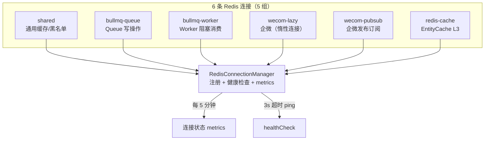

# 第 5 章 缓存与消息队列

> "异步是高吞吐系统的生命线，而 Redis 是这条生命线的心脏。"

WinMatrix 的异步处理完全建立在 Redis + BullMQ 之上。8 种 Worker 处理从记忆同步到跨 Agent 触发的各类异步任务。但这个系统不仅仅是"起一个 Worker 消费队列"这么简单——它包含了双连接策略、分布式锁、心跳接管和集中连接管理。本章将深入这些工程细节。

## 5.1 BullMQ 双连接策略

BullMQ 的使用有一个著名的陷阱：Worker 连接不能设置 `commandTimeout`。WinMatrix 在 `bullmqConnections.ts`（73 行）中精确处理了这个问题：

```typescript
// src/infrastructure/persistence/database/bullmqConnections.ts（第 1-33 行）
/**
 * BullMQ 共享 Redis 连接
 *
 * 所有 BullMQ Queue 和 Worker 共享这两条连接。
 * - queueConnection: 供 Queue.add() 等写操作，可加 commandTimeout
 * - workerConnection: 供 Worker 消费，**不加 commandTimeout**
 *   （BullMQ Worker 使用 BRPOLLPUSH / XREADGROUP BLOCK 等 blocking 命令，
 *    加 commandTimeout 会导致每 N 秒被 ioredis 强制 reject，触发 reconnect 风暴）
 */
import Redis from 'ioredis';
import { config } from '@/infrastructure/config/index.js';

// Queue 连接：加 commandTimeout
export const bullmqQueueConnection = new Redis(config.redisUrl, {
  maxRetriesPerRequest: null,   // BullMQ 要求
  connectTimeout: 10000,
  enableOfflineQueue: true,     // 断连时排队而非抛错
  commandTimeout: Number(process.env.REDIS_BULLMQ_COMMAND_TIMEOUT) || 30000,
  retryStrategy(times) {
    return Math.min(times * 200, 5000);
  },
});

// Worker 连接：明确不加 commandTimeout
export const bullmqWorkerConnection = new Redis(config.redisUrl, {
  maxRetriesPerRequest: null,   // BullMQ 要求
  connectTimeout: 10000,
  enableOfflineQueue: true,
  // 明确不加 commandTimeout —— blocking 命令不可 timeout
  retryStrategy(times) {
    return Math.min(times * 200, 5000);
  },
});
```

### 为什么 Worker 不能加 commandTimeout

BullMQ Worker 底层使用 Redis 的阻塞命令（`BRPOPLPUSH`、`XREADGROUP BLOCK`）来等待新任务。这些命令会阻塞直到有数据或超时。如果设置了 `commandTimeout`，ioredis 会在命令阻塞期间强制 reject，导致：

1. Worker 报错并触发重连
2. 重连后又开始阻塞等待
3. 形成"每 N 秒 reject + 重连"的**重连风暴**

Queue 连接则不同——`Queue.add()` 是普通写操作，可以安全设置超时。

### 连接就绪保证

```typescript
// src/infrastructure/persistence/database/bullmqConnections.ts（第 44-73 行）
export async function ensureBullmqConnectionsReady(): Promise<void> {
  const waitReady = (conn: Redis, label: string): Promise<void> => {
    if (conn.status === 'ready') return Promise.resolve();
    return new Promise((resolve) => {
      const onReady = () => { conn.removeListener('error', onError); resolve(); };
      const onError = (err: Error) => {
        conn.removeListener('ready', onReady);
        logger.error({ err, label }, `[BullmqConnections] ${label} 连接失败`);
        resolve(); // 不阻塞启动，BullMQ 会自动重连
      };
      conn.once('ready', onReady);
      conn.once('error', onError);
      if (conn.status !== 'connecting') {
        conn.connect().catch(() => {});
      }
    });
  };

  const tasks = [
    waitReady(bullmqQueueConnection, 'BullmqQueue'),
    waitReady(bullmqWorkerConnection, 'BullmqWorker'),
  ];
  const timeout = new Promise<void>((resolve) => setTimeout(resolve, 10000));
  await Promise.race([Promise.all(tasks), timeout]);
}
```

使用 `Promise.race` 配合 10 秒超时——即使 Redis 连接失败，启动也不会无限阻塞。BullMQ 内置的自动重连机制会在 Redis 恢复后自行连接。

## 5.2 Redis 连接集中管理

`RedisConnectionManager` 管理着 6 条 Redis 连接（5 组）：

```typescript
// src/infrastructure/persistence/database/RedisConnectionManager.ts（第 1-7 行）
/**
 * Redis 连接管理器
 *
 * 集中管理所有 Redis 连接的生命周期、健康检查和 metrics 输出。
 * 设计 6 条基础连接（5 组）：
 *   shared / bullmq-queue / bullmq-worker / wecom-lazy / wecom-pubsub / redis-cache
 */
```



### 健康检查

```typescript
// src/infrastructure/persistence/database/RedisConnectionManager.ts（第 50-67 行）
export async function healthCheck(): Promise<Array<{ group: string; status: string; error?: string }>> {
  const results = await Promise.all(
    connections.map(async ({ group, connection }) => {
      try {
        const pingTimeout = new Promise<never>((_, reject) =>
          setTimeout(() => reject(new Error('ping timeout')), 3000),
        );
        await Promise.race([connection.ping(), pingTimeout]);
        return { group, status: connection.status };
      } catch (err) {
        const msg = err instanceof Error ? err.message : String(err);
        return {
          group,
          status: connection.status === 'ready' ? 'degraded' : connection.status,
          error: msg,
        };
      }
    }),
  );
  return results;
}
```

每条连接的 ping 都有 3 秒超时保护——避免一条卡住的连接拖垮整个健康检查。

## 5.3 8 种 Worker 的设计

`src/interface/workers/` 目录包含 8 个 Worker：

| Worker | 队列 | 并发 | 职责 |
|--------|------|------|------|
| `scheduledTaskWorker` | scheduled-agent | 可配 | 定时任务执行（CDW 默认） |
| `memorySyncWorker` | memory-sync | 3 | 会话转录 → 长期记忆同步 |
| `kickoffJobWorker` | kickoff | 可配 | 项目启动任务（含分布式锁） |
| `crossAgentTriggerWorker` | cross-agent-trigger | 可配 | 跨 Agent 异步触发 |
| `roleInboxWorker` | role-inbox | 可配 | 角色收件箱消息处理 |
| `tfsQueryExportWorker` | tfs-query-export | 可配 | TFS/Azure DevOps 数据导出 |
| `asyncContinuationPrepareRetry` | - | - | 异步续跑重试准备 |
| `traceExtractWorker` / `distillWorker` | - | - | 技能轨迹采集 |

### memorySyncWorker 示例

```typescript
// src/interface/workers/memorySyncWorker.ts（完整 45 行）
import { Worker } from 'bullmq';
import { bullmqWorkerConnection } from '@/infrastructure/persistence/database/bullmqConnections.js';
import { transcriptSyncManager } from '@/infrastructure/memory/syncSessionTranscriptsToMemory.js';

let worker: Worker<MemorySyncJobData> | null = null;

export function startMemorySyncWorker(): void {
  if (worker) return;  // 单例保护
  worker = new Worker<MemorySyncJobData>(
    'memory-sync',
    async (job) => {
      if (!job) return;
      const data = job.data;
      if (data.type === 'full') {
        const result = await transcriptSyncManager.syncAll();  // 全量同步
        logger.info(`[MemorySyncWorker] full sync: synced=${result.synced}`);
        return;
      }
      await transcriptSyncManager.syncDirtyKeys();  // 增量同步（脏键）
    },
    {
      connection: bullmqWorkerConnection,
      concurrency: 3,
    },
  );
  worker.on('failed', (job, err) => {
    logger.warn(`[MemorySyncWorker] job failed: ${job?.id}, error: ${err.message}`);
  });
}
```

这个 Worker 展示了几个通用模式：

1. **单例保护**：模块级 `worker` 变量 + `if (worker) return`，避免重复启动
2. **双模式**：`full`（全量同步）和 `dirty`（增量同步）两种任务类型
3. **共享连接**：使用 `bullmqWorkerConnection`（无 commandTimeout）
4. **错误处理**：`worker.on('failed')` 记录失败任务

### scheduledTaskWorker 的 CDW 调度

定时任务 Worker 的注释揭示了重要的调度策略：

```typescript
// src/interface/workers/scheduledTaskWorker.ts（第 2-17 行）
/**
 * 定时任务队列消费者（BullMQ Worker）
 *
 * 消费 scheduled-agent 队列中的任务，执行
 * createRun → TurnRunner + dispatch（CDW 默认）→ updateRun。
 * Agent 定时任务**默认**走 CDW（DecisionEngine → Coordinator，triggerMode: 'scheduled'）。
 * 仅当 WIN_SCHEDULED_INTERACTIVE_INBOX_ENABLED=true（dev/实验，生产不得开启）
 * 且具备 digitalEmployeeId + conversationId 时，才写入 Interactive Role Inbox。
 */
```

定时任务**默认走 CDW**（Coordinator-Driven Workflow），而非交互式 Inbox。这是一个重要的架构决策——定时任务不需要用户交互，适合自动化编排。

### kickoffJobWorker 的高可用设计

Kickoff Worker 包含最复杂的分布式协调逻辑：

```typescript
// src/interface/workers/kickoffJobWorker.ts（第 39-48 行）
const KICKOFF_HEARTBEAT_INTERVAL_MS = 10_000;   // 心跳间隔
const ORPHAN_CHECK_INTERVAL_MS = 15_000;         // 孤儿检查间隔
const HEARTBEAT_TIMEOUT_MS = 30_000;             // 心跳超时

function currentNodeId(): string {
  return `kickoff-worker-${process.pid}`;
}
```

Kickoff 任务（项目启动）通常耗时较长，需要**高可用**保障。其机制是：

1. **分布式锁**：`acquireKickoffLock` 确保同一任务只有一个 Worker 执行
2. **心跳续期**：每 10 秒续期锁（`renewKickoffLock`）
3. **孤儿接管**：每 15 秒检查是否有"心跳超时"的任务，如果原 Worker 崩溃，新 Worker 接管

```typescript
// src/interface/workers/kickoffJobWorker.ts（第 62-79 行）
export async function processExecute(jobId: string, nodeId: string): Promise<void> {
  const state = await kickoffJobStore.get(jobId);
  if (!state) {
    throw new Error(`Kickoff job not found: ${jobId}`);
  }

  // 若 job 已被 api-direct（或另一 worker）执行完成，跳过重复执行
  // 防止孤儿接管的 worker 覆盖已成功写入的 kickoffResult
  if (state.status === 'completed' && state.kickoffResult) {
    logger.info({ jobId, nodeId }, '[KickoffWorker] skip: job already completed');
    return;
  }
  // ...
}
```

这种"乐观检查 + 幂等跳过"的设计确保了即使孤儿接管发生，也不会产生重复执行或数据覆盖。

## 5.4 跨 Agent 触发

`crossAgentTriggerWorker` 处理 Agent 之间的异步任务委派：

```typescript
// src/interface/workers/crossAgentTriggerWorker.ts（第 10-19 行）
/**
 * 跨 Agent 触发 Worker（BullMQ）
 *
 * 消费 cross-agent-trigger 队列中的任务：
 * 1. 准备 Role（TurnRunner.run）
 * 2. 保存用户消息
 * 3. 执行 Role.run()
 * 4. 保存助手消息
 * 5. 推送结果给原始用户
 */
```

这 5 步流程实现了"大福分配任务给小品"这样的跨 Agent 协作场景。使用 BullMQ 的 `DelayedError` 支持延迟重试。

## 本章小结

本章深入分析了 WinMatrix 的缓存与消息队列系统：

1. **双连接策略**：Queue 连接加 commandTimeout，Worker 连接不加（避免阻塞命令的重连风暴）
2. **6 条 Redis 连接**：shared / bullmq-queue / bullmq-worker / wecom-lazy / wecom-pubsub / redis-cache
3. **集中管理**：RedisConnectionManager 统一注册、健康检查（3s ping 超时）、metrics 输出
4. **8 种 Worker**：定时任务、记忆同步、Kickoff、跨 Agent 触发、角色收件箱、TFS 导出等
5. **单例保护 + 双模式**：每个 Worker 模块级单例，支持 full/dirty 两种任务模式
6. **CDW 默认调度**：定时任务默认走 Coordinator-Driven Workflow
7. **Kickoff 高可用**：分布式锁 + 心跳续期 + 孤儿接管 + 幂等跳过

在下一章中，我们将深入认证与授权系统。
