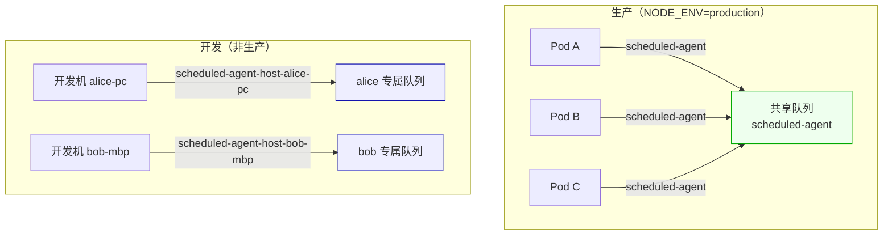
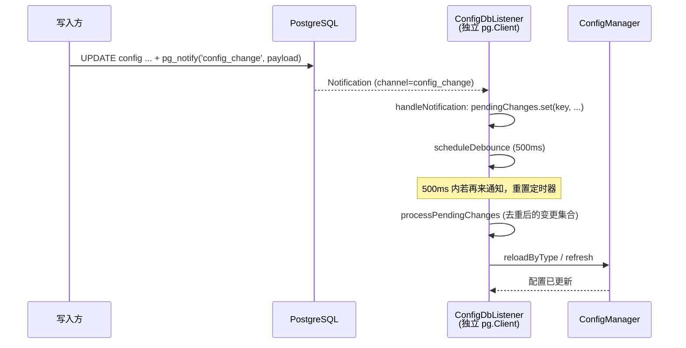

# 第 5 章 缓存与消息队列

> "连接不是资源，连接是承诺；队列不是缓冲，队列是契约。"

第 4 章我们看到，整个 winmatrix-server 进程对 PostgreSQL 的连接出口收敛到唯一的 `pg.Pool`。但数据库不是唯一的"出口"——一个真实运行的多进程服务还要面对两类基础设施：Redis（缓存、锁、令牌黑名单）和消息队列（异步任务编排）。这两者都是长连接、都涉及重连与超时、都可能在生产环境踩出最隐蔽的坑。

本章围绕四条主线展开：**Redis 的 6 条分类连接**、**BullMQ 三档队列与运行时隔离**、**基于 PG LISTEN/NOTIFY 的配置热更新**、**多级缓存（MultiLevelCache 与 EntityCache）**。每一节都对应真实源码，每一处设计决策都讲清楚"为什么这么做、代价是什么"。

## 5.1 Redis 连接矩阵：为什么是 6 条而不是 1 条

很多项目对 Redis 只建一个共享连接，所有用途混在一起。WinMatrix 走了相反的路——**按用途分类，6 条独立连接，统一由一个管理器收口**。这不是过度设计，而是踩过坑后的选择。

### 6 条连接的用途与差异

`src/infrastructure/persistence/database/RedisConnectionManager.ts`（127 行）的开头注释直接点明了设计意图：

```typescript
// src/infrastructure/persistence/database/RedisConnectionManager.ts（第 1-17 行）
/**
 * Redis 连接管理器
 *
 * 集中管理所有 Redis 连接的生命周期、健康检查和 metrics 输出。
 * 设计 6 条基础连接（5 组）：
 *   shared / bullmq-queue / bullmq-worker / wecom-lazy / wecom-pubsub / redis-cache
 */
interface ManagedConnection {
  group: string;
  connection: Redis;
  startedAt: number;
  /** 是否为惰性连接（由 lazyRedis 状态机管理） */
  lazy?: boolean;
}

const connections: ManagedConnection[] = [];
```

这 6 条连接不是随意的切分，每一条都对应一种**不同的生命周期和故障语义**：

| 连接 | 用途 | 创建位置 | 关键差异 |
|------|------|----------|----------|
| `shared` | JWT 黑名单、分布式锁 | `database/redis.ts:23-35` | 通用、重连策略标准 |
| `bullmq-queue` | BullMQ Queue 写操作 | `bullmqConnections.ts:15-23` | `commandTimeout=30s` |
| `bullmq-worker` | BullMQ Worker 阻塞消费 | `bullmqConnections.ts:25-33` | **禁止 commandTimeout** |
| `wecom-lazy` | 企微回调（惰性） | `lazyRedis.ts:42-64` | 状态机管理、失败不自动重连 |
| `wecom-pubsub` | 企微发布订阅 | — | 订阅模式，独立心跳 |
| `redis-cache` | 配置缓存 L3 | `redisCache.ts:49-61` | `retryStrategy` 永不放弃 |

为什么不能合并？因为这几类连接对**超时、重连、阻塞**的要求互相矛盾。最典型的就是 BullMQ 的 queue 与 worker——它们共用同一个 Redis 实例，却必须用完全不同的超时策略。

### bullmq-queue vs bullmq-worker：commandTimeout 的分水岭

`src/infrastructure/persistence/database/bullmqConnections.ts`（73 行）是 BullMQ 连接策略的 SSOT，文件头注释把坑说得很直白：

```typescript
// src/infrastructure/persistence/database/bullmqConnections.ts（第 1-33 行）
/**
 * BullMQ 共享 Redis 连接
 *
 * 所有 BullMQ Queue 和 Worker 共享这两条连接。
 * - queueConnection: 供 Queue.add() 等写操作，可加 commandTimeout
 * - workerConnection: 供 Worker 消费，**不加 commandTimeout**
 *   （BullMQ Worker 使用 BRPOPLPUSH / XREADGROUP BLOCK 等 blocking 命令，
 *    加 commandTimeout 会导致每 N 秒被 ioredis 强制 reject，触发 reconnect 风暴）
 */
export const bullmqQueueConnection = new Redis(config.redisUrl, {
  maxRetriesPerRequest: null,   // BullMQ 要求
  connectTimeout: 10000,
  enableOfflineQueue: true,     // 断连时排队而非抛错，避免 BullMQ Worker 报错风暴
  commandTimeout: Number(process.env.REDIS_BULLMQ_COMMAND_TIMEOUT) || 30000,
  retryStrategy(times) {
    return Math.min(times * 200, 5000);
  },
});

export const bullmqWorkerConnection = new Redis(config.redisUrl, {
  maxRetriesPerRequest: null,   // BullMQ 要求
  connectTimeout: 10000,
  enableOfflineQueue: true,     // 断连时排队而非抛错，避免 BullMQ Worker 报错风暴
  // 明确不加 commandTimeout —— blocking 命令不可 timeout
  retryStrategy(times) {
    return Math.min(times * 200, 5000);
  },
});
```

这是一个非常容易踩的坑。BullMQ 的 Worker 底层依赖 Redis 的**阻塞命令**（`BRPOPLPUSH`、`XREADGROUP ... BLOCK`）来等待新任务——这些命令会一直挂起，直到有数据或服务端超时。如果你给这条连接设了 `commandTimeout: 30000`，ioredis 会在命令阻塞期间每 30 秒强制 reject 一次，于是：

1. Worker 报错并触发重连；
2. 重连后又开始阻塞等待；
3. 形成"每 30 秒 reject + 重连"的**重连风暴**，日志被刷爆，CPU 空转。

Queue 连接则相反——`Queue.add()` 是一次性的普通写操作，理应有超时保护，所以它显式设了 30 秒 `commandTimeout`。

**代价**：Worker 连接没有 `commandTimeout`，意味着如果 Redis 真的卡死（而不是断开），Worker 会一直挂着不报错。这是用"阻塞语义的正确性"换来的可观测性损失，需要靠外部的健康检查（下一节）来补。

### 健康检查：3 秒 ping 兜底

正因为 Worker 连接不会自己报错，`RedisConnectionManager` 提供了统一的健康检查：

```typescript
// src/infrastructure/persistence/database/RedisConnectionManager.ts（第 50-67 行）
/** 健康检查：ping 所有连接，3 秒超时 */
export async function healthCheck(): Promise<Array<{ group: string; status: string; error?: string }>> {
  const results = await Promise.all(
    connections.map(async ({ group, connection }) => {
      try {
        const pingTimeout = new Promise<never>((_, reject) =>
          setTimeout(() => reject(new Error('ping timeout')), 3000),
        );
        await Promise.race([connection.ping(), pingTimeout]);
        return { group, status: connection.status };
      } catch (err) {
        const msg = err instanceof Error ? err.message : String(err);
        return {
          group,
          status: connection.status === 'ready' ? 'degraded' : connection.status,
          error: msg,
        };
      }
    }),
  );
  return results;
}
```

每条连接的 ping 都有 3 秒超时保护——一条卡住的连接不会拖垮整个健康检查。注意失败时返回的状态是 `degraded` 而非 `error`：连接可能还在 `ready`，只是 ping 慢，这种"半死不活"的状态被单独标记出来，让运维能区分"断了"和"慢了"。

### lazyRedis：企微连接的状态机

企微回调连接（`wecom-lazy`）是 6 条里最特殊的一条。它不靠 ioredis 的 `retryStrategy` 自动重连，而是自己实现了一个状态机：

```typescript
// src/infrastructure/persistence/database/lazyRedis.ts（第 42-64 行，节选）
function getOrCreateRedis(): Redis | null {
  if (!redisClient) {
    redisClient = new Redis(config.redisUrl, {
      maxRetriesPerRequest: null,
      retryStrategy: () => null, // 失败不重连，走状态机管理
      lazyConnect: true,
      commandTimeout: 5000,
    });

    registerRedisConnection('wecom-lazy', redisClient, { lazy: true });

    redisClient.on('error', (err: Error) => {
      logger.warn({ err }, '[LazyRedis] 连接错误');
      setStatus('degraded');
    });

    redisClient.on('end', () => {
      logger.warn('[LazyRedis] 连接断开');
      setStatus('degraded');
    });
  }
  return redisClient;
}
```

`retryStrategy: () => null` 把 ioredis 的自动重连关掉，转而由外部状态机驱动：`uninit → ready / degraded`，重连间隔带 `60s ± 15s` 的抖动。为什么要抖动？因为企微回调高峰期多实例同时断连，若都按固定间隔重连会形成"惊群"。带抖动的退避是分布式系统里对付惊群的标准手段。


`getWeComLazyRedis()` 在 `degraded` 时返回 `null`，消费者拿到 null 就回退到内存——这是"可用性优先"的体现：企微 token 缓存查不到，就当没缓存，不阻断业务。

### redis-cache：永不放弃的重连

配置缓存连接（`redis-cache`）走另一个极端——它的 `retryStrategy` **永不返回 null**：

```typescript
// src/infrastructure/cache/redisCache.ts（第 49-61 行，节选）
this.client = new Redis(config.redisUrl, {
  maxRetriesPerRequest: 3,
  retryStrategy: (times) => {
    // 永不放弃重连，避免 return null 导致 ioredis 永久关闭连接
    return Math.min(times * 200, 5000);
  },
  enableReadyCheck: true,
  connectTimeout: 10000,
  commandTimeout: 5000,
});
```

注意这条注释："避免 `return null` 导致 ioredis 永久关闭连接"。这是 ioredis 的一个隐蔽行为：`retryStrategy` 一旦返回 `null`，连接会被永久标记为关闭，后续再调用也不会重连。配置缓存是系统的热路径，宁可一直重试也不能永久断开。

这三条连接（lazy、cache、worker）的三种重连策略，恰好覆盖了"业务可用性"光谱上的三个权衡点：lazy 选择降级、cache 选择坚持、worker 选择不超时。**没有一种策略是万能的，每一种都是对具体故障场景的回应。**

## 5.2 BullMQ 队列：按负载分三档 + 运行时隔离

BullMQ 是 WinMatrix 异步任务的执行引擎。但它不是"起一个队列、所有任务往里塞"的粗暴设计，而是按**任务重量**分三档队列，再按**运行环境**做队列名隔离。

### 三档队列的分流

`src/infrastructure/queue/queue.ts`（84 行）创建了三条 BullMQ Queue，共用同一组 `defaultJobOptions`：

```typescript
// src/infrastructure/queue/queue.ts（第 17-43 行）
const defaultJobOptions = {
  attempts: 2,
  backoff: { type: 'exponential' as const, delay: 5000 },
  removeOnComplete: {
    count: Number(process.env.BULLMQ_SCHEDULED_COMPLETE_COUNT) || 200,
    age: Number(process.env.BULLMQ_SCHEDULED_COMPLETE_AGE) || 7 * 24 * 3600,
  },
  removeOnFail: {
    count: Number(process.env.BULLMQ_SCHEDULED_FAIL_COUNT) || 100,
    age: Number(process.env.BULLMQ_SCHEDULED_FAIL_AGE) || 7 * 24 * 3600,
  },
};

const scheduledAgentQueue = new Queue<ScheduledJobData>(resolveBullmqQueueName('scheduled-agent'), {
  connection: bullmqQueueConnection,
  defaultJobOptions,
});
const scheduledSystemQueue = new Queue<ScheduledJobData>(resolveBullmqQueueName('scheduled-system'), {
  connection: bullmqQueueConnection,
  defaultJobOptions,
});
const scheduledLightQueue = new Queue<ScheduledJobData>(resolveBullmqQueueName('scheduled-light'), {
  connection: bullmqQueueConnection,
  defaultJobOptions,
});
```

`defaultJobOptions` 里有几个值得展开的设计决策：

- **`attempts: 2`**：最多重试 1 次（初次 + 1 次重试）。为什么不设成 5 次？因为 Agent 任务幂等性并不完全保证，无脑重试可能造成重复副作用（比如一条消息发两遍）。`attempts: 2` 是"容忍瞬时抖动，但不掩盖持续故障"的折中。
- **指数退避 5 秒起**：`backoff: { type: 'exponential', delay: 5000 }`，第二次尝试在 5 秒后、第三次在 10 秒后。给瞬时故障（如 Redis 抖动）留出恢复窗口。
- **`removeOnComplete` / `removeOnFail` 双重保留**：既按 count（200/100 条）又按 age（7 天）保留。count 防止低频队列无限堆积，age 防止高频队列把历史挤光——两个维度取并集，谁先触发改谁清理。

任务到队列的路由由 `getQueueForTask` 决定：

```typescript
// src/infrastructure/queue/queue.ts（第 49-53 行）
export function getQueueForTask(taskName: string): Queue<ScheduledJobData> {
  if (SYSTEM_TASKS.has(taskName)) return scheduledSystemQueue;
  if (LIGHT_TASKS.has(taskName)) return scheduledLightQueue;
  return scheduledAgentQueue;
}
```

路由表本身是纯数据，拆到了独立的零副作用模块——这是为了单测：

### queueRegistry：纯数据零副作用

`src/infrastructure/queue/queueRegistry.ts`（70 行）把"任务名 → 队列"的映射表从 `queue.ts` 里拆了出来。文件头注释说明了原因：

```typescript
// src/infrastructure/queue/queueRegistry.ts（第 28-34 行）
/**
 * 任务名 → 队列名 路由表（纯数据，零副作用）
 *
 * 从 queue.ts 拆出，避免单测 import 时触发 BullMQ Queue / Redis 连接实例化。
 * queue.ts 通过 getQueueForTask 基于这两个集合做 Queue 实例查找。
 */
```

`queue.ts` 里 `new Queue(...)` 会在 import 时立即建立 Redis 连接。如果路由表也放在那里，单测里只想查一下"某个任务名属于哪个队列"就会被迫连 Redis。把纯数据拆出去，单测就能 import 路由表而不触发任何 I/O。**这是一个小但重要的工程纪律：副作用和数据要分文件。**

注册表里收录了 10 个队列的元数据（`QUEUE_REGISTRY`），以及两组任务名集合：

```typescript
// src/infrastructure/queue/queueRegistry.ts（第 22-43 行，节选）
export const QUEUE_REGISTRY: QueueRegistryItem[] = [
  { name: 'scheduled-agent', displayName: 'Agent 任务队列', group: 'scheduled',
    capabilities: { pause: true, retryFailed: true, clean: true, drain: true } },
  { name: 'scheduled-system', displayName: '系统维护队列', group: 'scheduled',
    capabilities: { pause: true, retryFailed: true, clean: true, drain: false } },
  { name: 'scheduled-light', displayName: '轻量任务队列', group: 'scheduled',
    capabilities: { pause: true, retryFailed: true, clean: true, drain: false } },
  { name: 'cross-agent-trigger', displayName: '跨 Agent 触发', group: 'async', /* ... */ },
  { name: 'kickoff-job', displayName: '项目启动', group: 'async', /* ... */ },
  { name: 'rag-ingest', displayName: '知识库摄入', group: 'async', /* ... */ },
  { name: 'memory-sync', displayName: '记忆同步', group: 'async', /* ... */ },
  { name: 'personal-task', displayName: '个人分身任务', group: 'async', /* ... */ },
  { name: 'skill-trace-extract', displayName: '技能 Trace 提取', group: 'other', /* ... */ },
  { name: 'skill-knowledge-distill', displayName: '知识蒸馏', group: 'other', /* ... */ },
]
```

注意 `capabilities.drain` 字段——只有 `scheduled-agent` 允许 `drain: true`（清空队列），系统维护队列和轻量队列都不允许清空。这是对危险操作的运行时管控：运维误点"清空"按钮时，系统维护队列（里面有 DB/ES 清理任务）不会被一键清掉。

三档定时队列的任务名集合是白名单驱动的：

```typescript
// src/infrastructure/queue/queueRegistry.ts（第 51-70 行）
export const SYSTEM_QUEUE_TASK_NAMES: ReadonlySet<string> = new Set([
  'system-memory-tidy',
  'system-log-cleanup',
  'system-execution-log-cleanup',
  'system-route-rule-discovery',
  'system-transcript-compact',
  'system-observability-cleanup',
  'system-workstation-ephemeral-cleanup',
  'system-side-effect-terminal-cleanup',
]);

export const LIGHT_QUEUE_TASK_NAMES: ReadonlySet<string> = new Set([
  'system-reminder-delivery',
  'system-coding-task-timeout-sweep',
  'system-detached-worker-sweep',
  'system-pending-events-cleanup',
  'system-acceptance-event-reap',
  'system-llm-call-watchdog-sweeper',
  'system-scheduled-run-reconcile',
]);
```

- **`scheduled-system`（8 个任务）**：DB/ES 维护类——日志清理、转录压缩、可观测性清理。重 I/O、长时间运行。
- **`scheduled-light`（7 个任务）**：轻量扫描类——提醒投递、超时扫描、孤儿清理。短平快、高频。
- **`scheduled-agent`（兜底）**：真正的 Agent 执行任务。

**为什么按重量分档？** 因为这三类任务的并发模型完全不同。系统维护任务一个就能把 DB 拖慢，必须低并发串行；轻量扫描任务每分钟跑一轮，需要高并发快速消化；Agent 任务重且幂等性弱，要控制重试。混在一个队列里，轻量任务会被维护任务饿死。分档 = 给每类任务独立的"车道"。

### 运行时队列隔离：hostname 后缀防开发机串读

这是整个队列系统里最容易被忽视、却能在开发环境救命的设计。`src/infrastructure/queue/runtimeQueueIsolation.ts`（103 行）给每条队列的名字加了运行环境后缀：

```typescript
// src/infrastructure/queue/runtimeQueueIsolation.ts（第 28-42 行）
export function resolveRuntimeIsolationId(
  env: RuntimeIsolationEnvironment = process.env,
  host: string = hostname(),
): string {
  const explicit = nonEmpty(env.WIN_RUNTIME_ISOLATION_ID);
  const explicitId = explicit ? sanitizeRuntimeIsolationId(explicit) : null;
  const productionRuntime = env.NODE_ENV === 'production' || nonEmpty(env.KUBERNETES_SERVICE_HOST);
  if (productionRuntime && explicitId && explicitId !== 'prod') {
    throw new Error(
      'Production runtime has a non-prod WIN_RUNTIME_ISOLATION_ID; refusing to split shared BullMQ queues.',
    );
  }
  if (productionRuntime) return 'prod';
  return explicitId ?? sanitizeRuntimeIsolationId(host);
}

export function resolveBullmqQueueName(
  baseName: string,
  env: RuntimeIsolationEnvironment = process.env,
  host: string = hostname(),
): string {
  const base = baseName.trim();
  if (!base) throw new Error('BullMQ queue name must not be empty');
  const isolationId = resolveRuntimeIsolationId(env, host);
  if (isolationId === 'prod') return base;
  const suffix = `-host-${isolationId}`;
  return base.endsWith(suffix) ? base : `${base}${suffix}`;
}
```

逻辑是：

- **生产环境**（`NODE_ENV=production` 或在 K8s 里）：isolationId 强制为 `prod`，队列名就是原名（如 `scheduled-agent`），所有生产 Pod 共享同一组队列。
- **非生产环境**：isolationId 默认取 hostname，队列名变成 `scheduled-agent-host-{hostname}`。三台开发机连同一个 Redis，各自有独立的队列，互不串读。
- **生产环境如果显式设了非 `prod` 的 isolationId，直接抛错**。这是防止误配置的硬护栏——生产环境绝不允许"分队列"。

为什么要这么做？想象一个真实场景：开发和同事共用一个测试 Redis。你的本地机器跑了一个定时任务 Worker，同事的机器也跑了一个。如果你们都用 `scheduled-agent` 这个队列名，你投递的任务可能被同事的 Worker 消费，触发他本地的 Agent 执行——你以为是自己的机器在跑，实际是同事的在跑，调试时根本对不上。加了 hostname 后缀后，你投递的任务只会进你机器名下的队列，只被你的 Worker 消费。

**这个设计的精妙之处在于它对生产零影响、对开发强保护。** 生产走原名，开发自动隔离，无需任何环境变量配置（hostname 是自动的）。只有在显式想覆盖时才需要设 `WIN_RUNTIME_ISOLATION_ID`。



### 进程内队列：非 BullMQ 的轻量通道

并非所有异步任务都值得走 BullMQ。会话输入合并这类超轻量、超高频的场景，走 BullMQ 反而是杀鸡用牛刀。`src/infrastructure/queue/InputQueue.ts`（238 行）实现了一个进程内的 `InputQueue`，专门用于会话输入合并——它不走 Redis，纯内存，生命周期与进程绑定。

另有 `memorySyncQueue.ts`（21 行）这个极简的 BullMQ 队列封装，`attempts: 3`，比定时队列多一次重试——因为记忆同步的幂等性比 Agent 任务强，多试一次更安全。

## 5.3 配置热更新：PG LISTEN/NOTIFY 而非 Redis Pub/Sub

很多系统用 Redis Pub/Sub 做配置变更广播。WinMatrix 选择了 PostgreSQL 原生的 `LISTEN/NOTIFY`。这不是随手选的——背后有一个关键的工程约束。

### 为什么不能用 PgBouncer

配置热更新的核心矛盾是：**配置写库后，所有进程要尽快感知并重载**。Redis Pub/Sub 看似是最自然的方案，但它引入了"谁来发"的问题——发广播的进程和收广播的进程之间，需要一个共享的变更源。WinMatrix 的配置真源就是 PostgreSQL，与其再引入一层 Redis 做中转，不如直接用 PG 原生的 NOTIFY。

但这带来一个硬约束：**LISTEN/NOTIFY 必须走真实的 PG 长会话，不能经过 PgBouncer 的 transaction pooling 模式。** 因为 LISTEN 注册的是"会话级"的订阅，而 transaction pooling 模式下每个事务可能走不同的后端连接，LISTEN 注册和 NOTIFY 投递会落到不同的连接上，通知就收不到。

接收端 `src/agents/core/kernel-management/config/listener/ConfigDbListener.ts`（414 行）的构造器把这条约束写进了代码：

```typescript
// src/agents/core/kernel-management/config/listener/ConfigDbListener.ts（第 88-112 行，节选）
const envEnabled = process.env.CONFIG_DB_LISTENER_ENABLED !== 'false';

// LISTEN/NOTIFY 必须走真实 PG 会话，不能经过 PgBouncer transaction pooling。
// 优先取 DATABASE_LISTEN_URL（直连 PG:5432），未设置则回退 DATABASE_URL，
// 此时若主库连接走的是 PgBouncer，需运维确认配置或手动指向 PG 直连地址。
const directConnectionString =
  options?.connectionString ??
  process.env.DATABASE_LISTEN_URL ??
  process.env.DATABASE_URL ??
  '';

this.options = {
  connectionString: directConnectionString,
  reconnectBaseDelay: options?.reconnectBaseDelay ?? 1000,
  maxReconnectDelay: options?.maxReconnectDelay ?? 30000,
  debounceMs: options?.debounceMs ?? 500,
  enabled: options?.enabled ?? envEnabled,
};

if (!process.env.DATABASE_LISTEN_URL && process.env.DATABASE_URL) {
  logger.warn(
    '[ConfigDbListener] 未配置 DATABASE_LISTEN_URL，将使用 DATABASE_URL；'
      + '若 DATABASE_URL 指向 PgBouncer transaction-pool，LISTEN/NOTIFY 将不可用，请改为直连 PG 的连接串。'
  );
}
```

注意那条 `logger.warn`——如果运维只配了 `DATABASE_URL`（很可能指向 PgBouncer），系统会明确告警而不是静默失败。这是"显式优于隐式"的运维友好设计：**与其让配置热更新默默不工作，不如启动时大声提醒。**

发送端则极简，`src/infrastructure/persistence/database/notifyConfigChange.ts`（13 行）只有一句核心逻辑：

```typescript
// src/infrastructure/persistence/database/notifyConfigChange.ts（第 10-12 行）
/** 向 config_change 频道发送 NOTIFY（参数化，避免 SQL 拼接） */
export async function notifyConfigChange(payload: ConfigChangeNotifyPayload): Promise<void> {
  await prisma.$executeRaw`SELECT pg_notify('config_change', ${JSON.stringify(payload)})`;
}
```

用 `prisma.$executeRaw` 的参数化模板字符串，避免了 SQL 拼接注入的风险。payload 是 JSON 序列化后塞进 `pg_notify` 的第二个参数。

### 独立 pg.Client：不走连接池

接收端创建的是一个**独立的 `pg.Client`**，而不是从 Prisma 的 `pg.Pool` 里借连接：

```typescript
// src/agents/core/kernel-management/config/listener/ConfigDbListener.ts（第 209-231 行）
private async connect(): Promise<void> {
  if (!this.options.connectionString) {
    throw new Error('DATABASE_URL 环境变量未设置');
  }

  // 创建独立的 pg.Client（不用连接池）
  this.client = new pg.Client({
    connectionString: this.options.connectionString,
    // 设置应用名称便于调试
    application_name: 'winmatrix-config-listener',
  });

  // 设置事件处理
  this.client.on('notification', (msg) => this.handleNotification(msg));
  this.client.on('error', (err) => this.handleError(err));
  this.client.on('end', () => this.handleDisconnect());

  // 连接数据库
  await this.client.connect();
  logger.info('[ConfigDbListener] 已连接到 PostgreSQL');

  // 开始监听
  await this.client.query('LISTEN config_change');
  logger.info('[ConfigDbListener] 已订阅 config_change 频道');

  // 重置重连计数
  this.reconnectAttempts = 0;
}
```

为什么不用连接池？因为 LISTEN 是**会话级**的——一个连接 `LISTEN config_change` 后，只有这个连接能收到通知。如果从池里借一个连接、LISTEN、再还回去，下次借出来的可能是另一个连接，订阅就丢了。这个连接必须**独占、长驻**。

`application_name: 'winmatrix-config-listener'` 这个小细节值得提——它在 PG 的 `pg_stat_activity` 视图里能直接看到，运维查"为什么有这么一个长连接"时一眼就能定位。

### 去重 + 500ms 防抖：合并变更风暴

配置变更往往不是孤立事件——批量导入技能时，可能一秒内触发上百条 NOTIFY。如果每条都触发一次配置重载，系统会被重载淹没。`ConfigDbListener` 用**Map 去重 + 500ms 防抖**应对：

```typescript
// src/agents/core/kernel-management/config/listener/ConfigDbListener.ts（第 241-271 行）
private handleNotification(msg: pg.Notification): void {
  if (msg.channel !== 'config_change' || !msg.payload) {
    return;
  }
  if (this.notificationSuppressed) {
    return;
  }

  try {
    const payload: ConfigChangePayload = JSON.parse(msg.payload);
    logger.debug(
      `[ConfigDbListener] 收到配置变更通知: type=${payload.type}, id=${payload.id}, action=${payload.action}`
    );

    // 添加到待处理队列（去重）
    const key = `${payload.type}:${payload.id}`;
    this.pendingChanges.set(key, {
      configType: payload.type,
      configId: payload.id,
      action: payload.action,
      timestamp: payload.timestamp,
    });

    // 触发防抖处理
    this.scheduleDebounce();
  } catch (error) {
    logger.warn(
      `[ConfigDbListener] 解析通知负载失败: ${getErrorMsg(error)}, payload=${msg.payload}`
    );
  }
}
```

去重靠 `key = ${type}:${id}`——同一个技能在一秒内被改 100 次，`pendingChanges` 这个 Map 里只会保留最后一条（后面覆盖前面）。防抖靠 `scheduleDebounce`：

```typescript
// src/agents/core/kernel-management/config/listener/ConfigDbListener.ts（第 336-345 行）
private scheduleDebounce(): void {
  if (this.debounceTimer) {
    clearTimeout(this.debounceTimer);
  }

  this.debounceTimer = setTimeout(async () => {
    this.debounceTimer = null;
    await this.processPendingChanges();
  }, this.options.debounceMs);   // 默认 500ms
}
```

每来一条通知就重置 500ms 定时器，直到 500ms 内没有新通知才真正处理。结果：一秒内的 100 条变更被合并成一次重载，且每个 `type:id` 只处理最后一份。**去重省了重复处理，防抖省了批量重载的次数。**

### 重连退避与写入抑制

连接断了怎么办？`scheduleReconnect` 用指数退避（base 1s、封顶 30s）重连，避免 PG 抖动时疯狂重连。断连期间配置变更不会丢失吗？不会——因为发送端写的是 PG 的 NOTIFY，PG 自己会缓存未投递的通知（在连接恢复后投递），前提是连接能重连上。

还有一个特殊场景：**批量写入期间要抑制通知**。`setNotificationSuppressed` 就是干这个的：

```typescript
// src/agents/core/kernel-management/config/listener/ConfigDbListener.ts（第 194-204 行）
/**
 * 禁止处理 LISTEN 通知。开启时会取消待处理的防抖任务并清空队列，避免关闭前已进入队列的变更在 bulk 写期间重载配置。
 * 与 `seedBundledSkillsToArtifactStore` 等大量写入联用时，在结束后由调用方手动 `reloadByType` + 级联 refresh。
 */
setNotificationSuppressed(suppressed: boolean): void {
  this.notificationSuppressed = suppressed;
  if (suppressed) {
    if (this.debounceTimer) {
      clearTimeout(this.debounceTimer);
      this.debounceTimer = null;
    }
    this.pendingChanges.clear();
  }
  logger.info(`[ConfigDbListener] 配置变更通知已${suppressed ? '暂停' : '恢复'}`);
}
```

种子脚本批量灌数据时，会先 `setNotificationSuppressed(true)`——否则每写一条都触发一次重载，种子没跑完配置已经被重载几百次。批量写完后调用方手动 `reloadByType` 做一次完整的级联刷新。**这是"批量操作要绕过增量机制"的通用模式：增量机制为高频小变更优化，批量操作要显式走全量路径。**

启动入口在 `src/startup/common.ts:331-358`，可通过 `STARTUP_SKIP_CONFIG_DB_LISTENER=true` 跳过（用于不需要配置热更新的进程）。



## 5.4 多级缓存：配置走三层，实体走两层

缓存是降低数据库压力的直接手段。但 WinMatrix 没有只做一个 Redis 缓存，而是根据数据特征分了两套：**配置类数据走 L1+L2+L3 三层（MultiLevelCache）**，**业务实体走 L1+Redis 两层（EntityCache）**。

### MultiLevelCache：L1 内存 → L2 文件 → L3 Redis

`src/infrastructure/cache/multiLevelCache.ts`（336 行）实现了一个真正的三级缓存：

```typescript
// src/infrastructure/cache/multiLevelCache.ts（第 16-39 行）
export class MultiLevelCache {
  private l1Cache: Map<string, CacheEntry<unknown>>;
  private l2Cache: FileCache;
  private l3Cache: RedisCache;
  private l1Ttl: number;
  private stats: {
    l1Hits: number;
    l2Hits: number;
    l3Hits: number;
    misses: number;
  };

  constructor() {
    this.l1Cache = new Map();
    this.l2Cache = new FileCache();
    this.l3Cache = new RedisCache();
    this.l1Ttl = parseInt(process.env.CONFIG_MEMORY_TTL || '3600000', 10); // 1小时
    // ...
  }
}
```

三层各有各的语义：

- **L1 = `Map<string, CacheEntry>`（进程内内存）**：最快，TTL 由 `CONFIG_MEMORY_TTL` 控制（默认 1 小时）。进程重启即失效。
- **L2 = `FileCache`（磁盘文件）**：进程重启不丢，用于跨重启的配置缓存。慢于内存但快于网络。
- **L3 = `RedisCache`（Redis）**：跨进程共享，TTL 由 `CONFIG_REDIS_TTL` 控制（默认 86400 秒 / 24 小时）。

查找策略是逐级穿透 + 回填，`get` 方法（第 66 行起）依次查 L1 → L2 → L3，低层命中后回填高层：

```mermaid
graph LR
    REQ["get(key)"] --> L1{"L1 内存<br/>命中?"}
    L1 -->|是| RET1["返回"]
    L1 -->|否| L2{"L2 文件<br/>命中?"}
    L2 -->|是| FILL1["回填 L1"] --> RET2["返回"]
    L2 -->|否| L3{"L3 Redis<br/>命中?"}
    L3 -->|是| FILL2["回填 L1+L2"] --> RET3["返回"]
    L3 -->|否| LOAD["loader() 加载"] --> FILL3["回填 L1+L2+L3"] --> RET4["返回 + 发布"]
    style L1 fill:#efe,stroke:#0a0
    style L2 fill="#eef",stroke:#00a
    style L3 fill:"#fee",stroke:#c00
```

为什么要三层？因为配置数据的访问模式有三个特征：**读多写少、跨进程共享、跨重启要稳。** L1 解决单进程内的极速读取，L3 解决跨进程共享，L2 解决"进程重启后 Redis 又恰好抖动"的兜底场景。L2 文件缓存在生产里命中率不高，但它在 Redis 故障时是最后的保险。

### RedisCache：SCAN 而非 KEYS、永不放弃重连

L3 的 `RedisCache`（`src/infrastructure/cache/redisCache.ts`，398 行）有两个值得讲的细节。第一是它的 key 前缀和 TTL：`winmatrix:config:` 前缀 + `CONFIG_REDIS_TTL` 默认 86400 秒。第二是它的 `clear()` 方法用 **SCAN 而非 KEYS**。

为什么不能用 `KEYS`？因为 Redis 是单线程的，`KEYS winmatrix:config:*` 在有几千个 key 时会阻塞整个 Redis 实例数百毫秒——这期间所有其他客户端的请求都被挂起。`SCAN` 是游标式遍历，每次只扫一小批，不阻塞。**这是一个 Redis 使用的常识，但很多人为了图省事还在用 KEYS，生产环境里这是定时炸弹。** `RedisCache` 的 `clear()` 坚持用 SCAN，是工程纪律的体现。

### EntityCache：L1 内存 + Redis，按 scope 分 TTL

业务实体（数字员工、项目成员、权限等）的访问模式和配置不同——它们更新更频繁、但单条读取也要够快。`src/infrastructure/cache/EntityCache.ts`（215 行）用了一个两层结构，且按业务域给了不同的 TTL：

```typescript
// src/infrastructure/cache/EntityCache.ts（第 12-21 行）
const DEFAULT_SCOPES: Record<string, EntityCacheScopeConfig> = {
  de:  { prefix: 'entity:de',  ttlMs: 30 * 60 * 1000 },   // 数字员工：30 min
  sa:  { prefix: 'entity:sa',  ttlMs: 30 * 60 * 1000 },   // 系统Agent：30 min
  srb: { prefix: 'entity:srb', ttlMs: 30 * 60 * 1000 },   // SRB：30 min
  ac:  { prefix: 'entity:ac',  ttlMs: 15 * 60 * 1000 },   // 访问控制：15 min
  wst: { prefix: 'entity:wst', ttlMs: 30 * 60 * 1000 },   // 工作站：30 min
};

const CACHE_ENABLED = process.env.CACHE_ENABLED !== 'false';
const REDIS_KEY_PREFIX = 'winmatrix:entity:';
```

注意 `ac`（访问控制）的 TTL 只有 15 分钟，是其他域的一半。**权限数据的变更频率更高、一致性要求更严，所以缓存窗口更短。** 这是一个典型的"按数据特征调 TTL"的例子——一刀切的 TTL 要么让权限数据过期太慢（权限收回后还能用 30 分钟），要么让其他数据过期太快（无谓地增加 DB 压力）。

`getOrLoad` 是 EntityCache 的核心方法（第 64-113 行），它实现了 L1 → Redis → loader 的穿透 + 回填：

```typescript
// src/infrastructure/cache/EntityCache.ts（第 64-113 行，节选）
async getOrLoad<T>(key: string, loader: () => Promise<T>, ttlMs?: number): Promise<T> {
  if (!CACHE_ENABLED) return loader();
  const now = Date.now();

  // ① L1 check（进程内 Map）
  const cached = this.l1.get(key);
  if (cached && cached.expiresAt > now) {
    this.stats.l1Hits++;
    return cached.data as T;
  }
  if (cached) this.l1.delete(key);  // 过期清理

  // ② L3 (Redis) check
  if (this.redisEnabled && this.redis?.status === 'ready') {
    try {
      const redisData = await this.redis.get(`${REDIS_KEY_PREFIX}${key}`);
      if (redisData) {
        const parsed = JSON.parse(redisData) as { data: T; expiresAt: number };
        if (parsed.expiresAt > now) {
          this.stats.redisHits++;
          this.l1.set(key, { data: parsed.data, expiresAt: parsed.expiresAt });  // 回填 L1
          return parsed.data;
        }
      }
    } catch {
      // Redis read failure → fall through to loader
    }
  }

  // ③ 穿透到数据源
  this.stats.misses++;
  const data = await loader();
  // ... 回填 L1 + Redis（fire-and-forget）
  return data;
}
```

几个关键设计决策：

1. **优雅降级**：`CACHE_ENABLED=false` 时直接走 loader；Redis 不可用时自动降级为 L1-only。缓存层对业务完全可选，坏了不致命。
2. **回填策略**：L3 命中时回填 L1，避免后续请求再次穿透。这是缓存的"惯性"——一次命中换多次内存读取。
3. **fire-and-forget 写 Redis**：Redis 写入用 `.catch(logger.warn)` 而非 await，不阻塞请求。Redis 写失败只记日志，不影响业务返回。
4. **统计追踪**：`l1Hits` / `redisHits` / `misses` 用于监控缓存命中率——命中率掉了就是 DB 压力涨了的早期信号。

### 跨节点失效：Pub/Sub 广播

多进程部署时，一个节点改了数据，其他节点的 L1 还是旧的。`cacheInvalidationBus`（`src/infrastructure/cache/cacheInvalidationBus.ts`）用 Redis Pub/Sub 解决：

```typescript
// src/infrastructure/cache/cacheInvalidationBus.ts（核心结构）
const CHANNEL = 'cache:invalidate';

export class CacheInvalidationBus {
  private subscriber: Redis | null = null;

  async initialize(): Promise<void> {
    const subscriber = bullmqWorkerConnection.duplicate();
    this.subscriber = subscriber;
    await subscriber.subscribe(CHANNEL);
  }

  async publishInvalidation(scope: string): Promise<void> {
    await bullmqQueueConnection.publish(CHANNEL, scope);
  }

  onInvalidation(handler: (scope: string) => void): void {
    this.subscriber.on('message', (_channel: string, message: string) => {
      if (_channel === CHANNEL) handler(message);
    });
  }
}
```

注意它 `duplicate()` 的是 BullMQ 的连接——不为缓存失效单独建一条 Redis 连接，而是复用已有的。这是"连接数量管控"的细节：能复用就不新建，6 条连接的预算不轻易超支。

这里有一个值得对比的点：**配置热更新走 PG LISTEN/NOTIFY，缓存失效走 Redis Pub/Sub。** 为什么不一致？因为两者的数据源不同——配置的真源是 PG，所以从 PG 直接 NOTIFY；缓存的失效是运行时事件（某节点改了数据要通知其他节点），与 PG 无关，用 Redis 这个已有的基础设施最自然。**选型不是追求统一，而是追求"对的问题用对的工具"。**

## 本章小结

本章深入分析了 WinMatrix 的缓存与消息队列系统：

1. **Redis 6 条分类连接**：`shared / bullmq-queue / bullmq-worker / wecom-lazy / wecom-pubsub / redis-cache`，统一由 `RedisConnectionManager` 收口健康检查与 metrics。分类的根因是不同用途对超时、重连、阻塞的要求互相矛盾——worker 禁 commandTimeout（防重连风暴）、lazy 走状态机（防惊群）、cache 永不放弃重连（防永久断开）。
2. **BullMQ 三档队列**：`scheduled-agent / scheduled-system / scheduled-light` 按任务重量分流，`defaultJobOptions` 统一 `attempts: 2` + 指数退避 + count/age 双重清理。路由表拆到零副作用模块 `queueRegistry.ts`，单测不触发 Redis 连接。
3. **运行时队列隔离**：非生产环境按 hostname 自动加 `-host-{id}` 后缀，生产强制 `prod` 且校验——开发机共用 Redis 时不会串读，生产零影响。
4. **配置热更新走 PG LISTEN/NOTIFY**（非 Redis Pub/Sub）：独立 `pg.Client` 长会话、必须直连 PG 不能经 PgBouncer transaction-pool；500ms 防抖 + Map 去重合并变更风暴；批量写入用 `setNotificationSuppressed` 抑制。
5. **多级缓存分级**：配置走 `MultiLevelCache` 的 L1（内存）+ L2（文件）+ L3（Redis）三层穿透回填；业务实体走 `EntityCache` 的 L1 + Redis 两层，按 scope 分 TTL（访问控制 15 分钟，其他 30 分钟）。`RedisCache.clear()` 坚持用 SCAN 不用 KEYS，避免阻塞 Redis。
6. **跨节点失效走 Redis Pub/Sub**：复用 BullMQ 连接 `duplicate()`，不新建连接。与配置热更新的 PG LISTEN/NOTIFY 形成对照——数据源决定选型，而非追求统一。

在下一章中，我们将进入与缓存队列紧密相关的另一条生命线——认证与授权系统，看 JWT 黑名单如何用 shared Redis 连接实现、MCP 多 token 体系如何用 Token Broker 统一路由。
