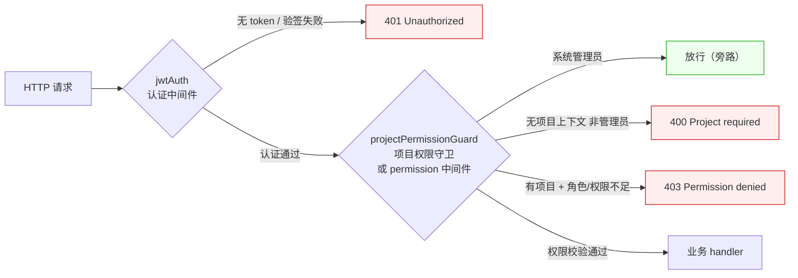
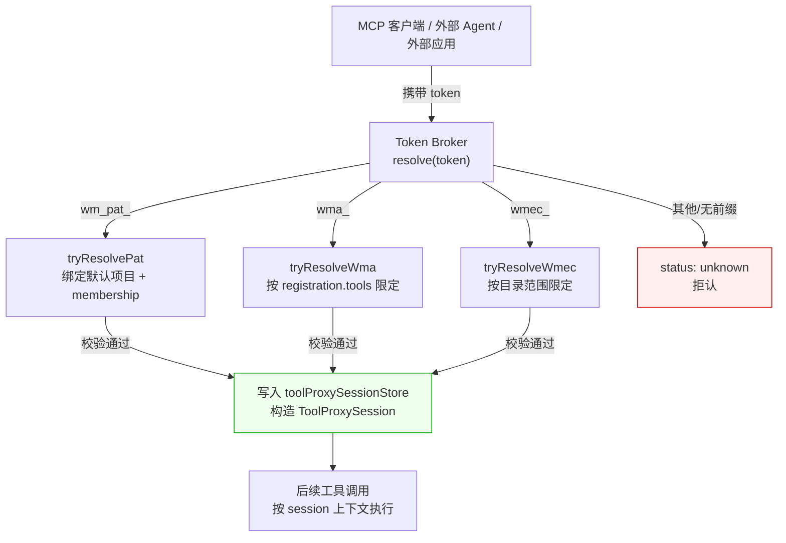

# 第 6 章 认证与授权

> "身份是信任的边界，权限是行动的边界。"

第 5 章我们看到 Redis 被拆成 6 条分类连接，其中 `shared` 连接的一个重要用途就是 JWT 黑名单。本章顺着这条线，把 WinMatrix 的认证与授权（AuthN/AuthZ）体系讲透。

WinMatrix 的安全边界是三层叠加：**JWT 签发与撤销**（你是谁）、**Fastify 鉴权中间件管线**（你怎么进来的）、**双轨权限模型**（你能做什么）。此外还有一条独立于 JWT 的 **MCP 多 token 体系**（PAT/WMA/WMEC），服务于机器对机器接入。本章逐一拆解，并讲清楚每个设计决策的代价与踩过的坑。

## 6.1 JWT：HS256 + 强制强密钥 + Redis 黑名单

`src/infrastructure/auth/JwtService.ts`（273 行）是认证的核心。它不只是一个 `jwt.sign` 的薄封装——它在构造期就立了两道硬规矩。

### 构造期：强制 secret ≥ 32 字符

```typescript
// src/infrastructure/auth/JwtService.ts（第 57-64 行）
constructor(secret: string, expiresIn: string = '24h', redis?: Redis) {
  if (!secret || secret.length < 32) {
    throw new Error('JWT_SECRET must be at least 32 characters long');
  }
  this.secret = secret;
  this.expiresIn = expiresIn;
  this.redis = redis;
}
```

这条校验是**启动期硬失败**——如果 `JWT_SECRET` 不足 32 字符，服务直接起不来。为什么是 32？HS256 用的是 HMAC-SHA256，安全强度上限是 256 bit（32 字节），用短 secret 等于把强度降级。把校验放构造期而非运行期，意味着**配置错误在部署时就暴露，而不是签发第一个 token 时才崩**——这是 "fail fast" 在安全领域的应用。

### 签发与验证：显式锁定 HS256

```typescript
// src/infrastructure/auth/JwtService.ts（第 69-84 行）
generateToken(userId: string, username: string, isAdmin: boolean): string {
  const payload: JwtPayload = {
    userId,
    username,
    isAdmin,
  };

  const token = (jwt.sign as (payload: object, secret: string, options?: { expiresIn?: string; algorithm?: string }) => string)(
    payload as object,
    this.secret,
    { expiresIn: this.expiresIn, algorithm: 'HS256' }
  );

  logger.info(`JWT token generated for user: ${username} (${userId})`);
  return token;
}
```

默认 `expiresIn='24h'`，payload 极简——只有 `userId / username / isAdmin`，**不放任何权限信息**。为什么？因为权限是会变的（用户被收回某个权限），如果写进 token，签发后到过期前的 24 小时内变更无法生效。token 只证明"你是谁"，权限实时查（见 6.4）。

验证端同样显式锁算法：

```typescript
// src/infrastructure/auth/JwtService.ts（第 90-107 行）
verifyToken(token: string): JwtPayload {
  try {
    const decoded = jwt.verify(token, this.secret, {
      algorithms: ['HS256'],
    }) as JwtPayload;

    return decoded;
  } catch (error) {
    if (error instanceof jwt.TokenExpiredError) {
      logger.warn('JWT token expired');
      throw new Error('Token expired');
    } else if (error instanceof jwt.JsonWebTokenError) {
      logger.warn('Invalid JWT token');
      throw new Error('Invalid token');
    }
    throw error;
  }
}
```

`algorithms: ['HS256']` 这一行是防**算法替换攻击**的关键。如果不限定算法，攻击者可以构造 header 里 `alg: 'none'` 的 token，`jsonwebtoken` 老版本会跳过签名校验放行。显式锁定 HS256 后，任何非 HS256 的 token 都会被拒。**这是 JWT 使用常识，但少写这一行就是致命漏洞。**

错误处理把 `TokenExpiredError` 和 `JsonWebTokenError` 分开抛——前者是"过期，可引导重登"，后者是"签名不对，可能是攻击"。区分两类错误让上层能给用户准确提示。

### Redis 黑名单：TTL 等于 token 剩余生命

JWT 本身是无状态的——一旦签发，在过期前一直有效。这意味着用户登出后，token 在剩余生命期内仍可用，这是 JWT 的天然缺陷。WinMatrix 用 Redis 黑名单补上这个缺口：

```typescript
// src/infrastructure/auth/JwtService.ts（第 112-125 行）
async verifyAndCheckBlacklist(token: string): Promise<JwtPayload> {
  // 先验证 Token
  const payload = this.verifyToken(token);

  // 检查是否在黑名单中
  if (this.redis) {
    const isRevoked = await this.isTokenRevoked(token);
    if (isRevoked) {
      throw new Error('Token has been revoked');
    }
  }

  return payload;
}
```

撤销逻辑的精妙之处在于 TTL 的设置：

```typescript
// src/infrastructure/auth/JwtService.ts（第 131-158 行）
async revokeToken(token: string): Promise<void> {
  if (!this.redis) {
    logger.warn('Redis not available, cannot revoke token');
    return;
  }

  try {
    // 解析 Token 获取过期时间 (不验证签名,因为可能已过期)
    const decoded = jwt.decode(token) as JwtPayload | null;
    if (!decoded || !decoded.exp) {
      logger.warn('Cannot decode token expiration');
      return;
    }

    const now = Math.floor(Date.now() / 1000);
    const ttl = decoded.exp - now;

    // 只有未过期的 Token 才需要加入黑名单
    if (ttl > 0) {
      const key = `jwt:blacklist:${token}`;
      await this.redis.setex(key, ttl, '1');
      logger.info(`Token revoked: ${decoded.username} (TTL: ${ttl}s)`);
    }
  } catch (error) {
    logger.error('Failed to revoke token:', error);
    throw new Error('Failed to revoke token');
  }
}
```

黑名单条目的 TTL 精确等于 token 的**剩余生命期**（`decoded.exp - now`）。这个设计解决了 JWT 黑名单无限增长的痛点：

- token 剩 1 小时过期 → 黑名单条目 TTL = 3600 秒，1 小时后自动清理。
- token 已过期 → `ttl <= 0`，根本不入黑名单（反正过期后就自然失效了）。

结果是黑名单里永远只存"还活着但被主动撤销"的 token，规模有上界（最多是 24 小时内登出的 token 数）。**用 Redis 的 TTL 把 JWT 无状态的安全缺口补成了"有状态的撤销"，且没有引入无限增长的存储负担。**

注意 `jwt.decode`（不验签）而非 `jwt.verify`——撤销时 token 可能已过期，`verify` 会抛 `TokenExpiredError`，而我们只是想读 `exp` 字段，不需要验签。

### 黑名单查询的可用性优先

```typescript
// src/infrastructure/auth/JwtService.ts（第 163-177 行）
async isTokenRevoked(token: string): Promise<boolean> {
  if (!this.redis) {
    return false;
  }

  try {
    const key = `jwt:blacklist:${token}`;
    const value = await this.redis.get(key);
    return value !== null;
  } catch (error) {
    logger.error('Failed to check token blacklist:', error);
    // 如果 Redis 出错,为了安全起见返回 false 允许通过
    return false;
  }
}
```

这里有一个**值得讨论的安全权衡**：Redis 出错时返回 `false`（放行）——这是 **fail-open**（可用性优先）。理由是 JWT 本身已经过了签名验证（密钥没泄露），黑名单只补"主动撤销"这个边缘场景，而 Redis 故障是更小概率事件。代价是 Redis 故障期间登出不立即生效。

**对比 6.4 的 RBAC `checkPermission`——那里是 fail-closed（出错拒权限）。** 两处相反的选择不是不一致，而是按代价定权：认证错了的代价是一次会话延期（轻），权限错了的代价是越权（重）。fail 方向应由"错了的代价"决定，不能一刀切。

### 登录与登出

`src/business/domain/auth/AuthService.ts` 把这些能力串起来：

```typescript
// src/business/domain/auth/AuthService.ts（第 88-127 行，login 节选）
async login(username: string, password: string): Promise<LoginResult> {
  const user = await this.userRepository.findByUsername(username);
  if (!user) {
    throw new Error('Invalid username or password');   // 用户不存在
  }
  if (user.status !== 'active') {
    throw new Error(`Account is ${user.status}`);      // 账号禁用
  }
  const isPasswordValid = await bcrypt.compare(password, user.passwordHash);
  if (!isPasswordValid) {
    throw new Error('Invalid username or password');   // 密码错（同一报错，防枚举）
  }
  await this.userRepository.updateLastLogin(user.id);
  const token = this.jwtService.generateToken(user.id, user.username, user.isAdmin);
  // ...
}
```

注意三个安全细节：

1. **用户不存在和密码错都报 "Invalid username or password"**——不告诉攻击者"用户名存在"，防用户名枚举。
2. **bcrypt.compare 校验密码**——密码用 bcrypt 哈希存储（不是明文/MD5/SHA），bcrypt 自带 salt 和可调成本因子，抗彩虹表和暴力破解。
3. **先查状态再验密码**——账号禁用时直接拒，不浪费 bcrypt 计算（bcrypt 是 CPU 密集型）。

登出就是调 `revokeToken`（`AuthService.ts:132-141`）——把当前 token 加入 Redis 黑名单。登录用密码换 token，登出用 token 换黑名单条目，对称的设计。

## 6.2 三路 token 提取与 Fastify 鉴权中间件

token 签出来了，怎么从 HTTP 请求里取回来？WinMatrix 的答案是**三路提取**——这背后是不同的客户端约束。

### 三路 token 的现实原因

```typescript
// src/interface/middleware/jwtAuth.ts（第 112-125 行）
/**
 * 从请求中解析 Token：
 * 1) Authorization: Bearer <token>
 * 2) X-Auth-Token（某些代理链路可能丢弃 Authorization）
 * 3) query.token（WebSocket 升级等场景）
 */
export function getTokenFromRequest(request: FastifyRequest): string | null {
  const authHeader = request.headers.authorization;
  const fromHeader = JwtService.extractTokenFromHeader(authHeader);
  if (fromHeader) return normalizeToken(fromHeader);
  const rawXToken = request.headers['x-auth-token'];
  if (typeof rawXToken === 'string') return normalizeToken(rawXToken);
  if (Array.isArray(rawXToken)) {
    const first = rawXToken.find((v) => typeof v === 'string' && v.trim());
    if (first) return normalizeToken(first);
  }
  const q = request.query as { token?: string } | undefined;
  if (q?.token && typeof q.token === 'string') return normalizeToken(q.token);
  return null;
}
```

三路对应三种现实场景：

- **`Authorization: Bearer <token>`**：标准 REST 请求，绝大多数客户端走这条。
- **`X-Auth-Token`**：某些企业内网反向代理会**剥离 `Authorization` 头**（安全策略或历史原因），客户端只能改用自定义 header。这是企业部署里常见的坑。
- **`query.token`（URL 参数）**：浏览器 WebSocket 握手时**无法设置自定义 header**（WebSocket API 限制），只能把 token 塞进 URL。

三路按优先级依次尝试，命中即返回。这种"多通道冗余"看似啰嗦，但每一条都对应真实生产场景——少一条就会有一类客户端接不进来。

### 鉴权中间件：preHandler 模式

`createJwtAuthMiddleware` 返回的是一个 Fastify `preHandler`：

```typescript
// src/interface/middleware/jwtAuth.ts（第 79-100 行）
export function createJwtAuthMiddleware(jwtService: JwtService) {
  return async function jwtAuth(request: FastifyRequest, reply: FastifyReply): Promise<void> {
    try {
      const token = getTokenFromRequest(request);

      if (!token) {
        return reply.status(401).send({
          success: false,
          error: 'Missing authorization token',
        });
      }

      const user = await attachUserFromToken(request, jwtService, token);

      logger.debug(`JWT auth successful for user: ${user.username}`);
    } catch (error) {
      const errorMessage = error instanceof Error ? error.message : 'Unknown error';
      logger.warn('JWT auth failed:', errorMessage);

      return reply.status(401).send({
        success: false,
        error: 'Invalid or expired token',
      });
    }
  };
}
```

无 token 返回 401，验签失败返回 401——统一的错误语义。注意 `attachUserFromToken` 不只是校验签名，还会查库做**身份归一化**。

### 身份归一化：JWT 与 DB 对齐

`attachUserFromToken` 内部会调 `normalizeAuthenticatedUser`，拿 JWT 里的 `userId` 去数据库查最新身份：

```typescript
// src/interface/middleware/jwtAuth.ts（第 22-31 行，attachUserFromToken 调用的归一化逻辑）
// 如果用户在 token 签发后被重命名或权限变更，这里会用数据库的最新值为准。
// 检测到 JWT 与数据库身份不一致时，记 warn 日志（可能是管理员改了用户名）。
```

为什么要归一化？因为 JWT 有 24 小时生命期，这期间用户的 `username` 可能被管理员改了、`isAdmin` 可能被收回。如果直接信 JWT，就会出现"用户名已经改了，但 API 还显示旧名"的脏数据。归一化用 DB 的最新值覆盖 JWT 里的身份，保证每个请求看到的是当前真实身份。

不一致时会记 `warn` 日志——安全审计信号：token 身份和 DB 对不上，可能是管理员在改用户（虽然签名校验已排除伪造）。归一化 + 告警，是"信任但核实"的体现。

## 6.3 Fastify 鉴权管线：三类 preHandler 串联

单个鉴权中间件不够——一个真实的 API 请求要经过"认证 → 项目上下文 → 具体权限"三层。WinMatrix 把这三层做成三类 Fastify `preHandler` 工厂，按需串联。

### 管线全景



装配发生在 `src/interface/core/app.ts:43-282`，每个路由按需挂载对应的 preHandler 组合。

### projectPermissionGuard：静态矩阵守卫

`src/interface/middleware/projectPermission.ts`（128 行）的 `createProjectPermissionGuard` 是**静态权限矩阵**的守卫：

```typescript
// src/interface/middleware/projectPermission.ts（第 45-91 行）
export function createProjectPermissionGuard(getMemberRole: GetMemberRoleFn) {
  /**
   * 生成一个 Fastify preHandler，校验当前用户对指定功能键是否达到所需权限等级。
   *
   * @param key            - 权限键（如 'config.tfs', 'member.add'）
   * @param requiredLevel  - 最低权限等级（PermissionLevel 枚举）
   */
  return function requireProjectPermission(key: PermissionKey, requiredLevel: PermissionLevel) {
    return async (request: FastifyRequest, reply: FastifyReply): Promise<void> => {
      // ── 1. 认证检查 ──
      const userId = request.user?.userId;
      if (!userId) {
        createUnauthorizedResponse(reply);
        return;
      }

      // ── 2. 系统管理员旁路 ──
      if (request.user?.isAdmin) {
        return;
      }

      // ── 3. 提取项目标识 ──
      const projectCode = extractProjectCode(request);
      if (!projectCode) {
        createProjectRequiredResponse(reply);
        return;
      }

      // ── 4. 查询用户角色并校验权限 ──
      const role = await getMemberRole(userId, projectCode);

      if (!hasProjectPermission(role, key, requiredLevel)) {
        logger.warn(
          `Project permission denied: user=${userId} project=${projectCode} ` +
          `role=${role} key=${key} required=${PermissionLevel[requiredLevel]}`,
        );
        void reply.status(403).send({
          success: false,
          code: `PERMISSION_DENIED.${key}`,
          message: PERMISSION_DENIED_MESSAGES[key] ?? '需项目负责人或系统管理员权限',
          error: '权限不足',
        });
        return;
      }
    };
  };
}
```

这个守卫的四步流程清晰：

1. **认证检查**：没登录直接 401。
2. **系统管理员旁路**：`isAdmin` 直接放行，不走后续权限校验。这是系统管理员的"超级权限"。
3. **提取项目标识**：从请求里抽 `projectCode`，没有就 400。项目权限必须在项目上下文里判断。
4. **查角色 + 校验**：调 `getMemberRole` 查用户在该项目的角色，再用 `hasProjectPermission(role, key, requiredLevel)` 判断是否达标。

注意 403 响应里带了 `code: PERMISSION_DENIED.${key}` 和具体的中文 message——前端能据此精确提示"你需要项目负责人权限"，而不是笼统的"权限不足"。**好的错误响应是可操作的错误响应。**

### permission 中间件：动态 RBAC 守卫

`src/interface/middleware/permission.ts`（177 行）提供 5 个 preHandler 工厂，服务于**动态 RBAC**权限：

```typescript
// src/interface/middleware/permission.ts（第 14-48 行，三态门控）
type ProjectScopedGateResult =
  | { status: 'replied' }
  | { status: 'allow'; userId: string; projectId: string }
  | { status: 'allow-sysadmin-no-project'; userId: string };

function runProjectScopedPermissionGate(
  request: FastifyRequest,
  reply: FastifyReply
): ProjectScopedGateResult {
  const userId = request.user?.userId;
  if (!userId) {
    createUnauthorizedResponse(reply);
    return { status: 'replied' };
  }

  const projectId = getOptionalProjectId(request);
  if (!projectId) {
    if (request.user?.isAdmin) {
      return { status: 'allow-sysadmin-no-project', userId };
    }
    createProjectRequiredResponse(reply);
    return { status: 'replied' };
  }

  return { status: 'allow', userId, projectId };
}
```

这个三态门控是动态 RBAC 守卫的入口：

1. **未认证** → 401（`replied`）。
2. **无项目上下文 + 非管理员** → 400（`replied`，需要项目 ID）。
3. **无项目上下文 + 管理员** → `allow-sysadmin-no-project`（放行，系统级操作）。
4. **有项目上下文** → `allow`，继续具体权限检查。

`createPermissionMiddleware` 工厂返回 5 个守卫（`permission.ts:48-177`）：

```typescript
// src/interface/middleware/permission.ts（第 48-177 行，结构）
export function createPermissionMiddleware(permissionService: PermissionService) {
  function requirePermission(permission: string) { /* 单权限 */ }
  function requireAnyPermission(permissions: string[]) { /* OR 语义 */ }
  function requireAllPermissions(permissions: string[]) { /* AND 语义 */ }
  function requireRole(role: string) { /* 角色检查 */ }
  function requireAdmin() { /* 系统管理员或项目管理员 */ }
  return { requirePermission, requireAnyPermission, requireAllPermissions, requireRole, requireAdmin };
}
```

注释里特意区分了 `requireAdmin` 和其他四个：前者在无 project 时**不会**对非管理员返回 400（它本身就是"管理员"检查），而前四个在无 project 时会要 project。**这种细微差别写在注释里，是为了防止后续维护者误用。**

## 6.4 双轨权限模型：静态矩阵 + 动态 RBAC

WinMatrix 的权限不是一套，而是**两套并存**。这是本章最容易混淆也最关键的一节。

### 为什么是两套

先看两套各自的特征：

| 维度 | 静态矩阵 | 动态 RBAC |
|------|----------|-----------|
| **真源** | 编译期常量（代码） | 数据库表 + Redis 缓存 |
| **定义位置** | `business/domain/project/projectPermission.ts` | `permission_definition` / `role_permission_binding` 表 |
| **粒度** | 6 级 PermissionLevel × 15 个 ProjectRole × 60+ PermissionKey | 任意 role × 任意 permission 绑定 |
| **变更** | 改代码 + 重新发版 | 改 DB 数据，实时生效 |
| **缓存** | 无（常量在内存） | Redis 缓存 300 秒 |
| **适用** | 前后端共享的、稳定的、模块级功能权限 | 后端运营可调的、细粒度的、业务流程权限 |

为什么需要两套？因为它们解决不同的问题：

- **静态矩阵**解决"前后端必须一致"的功能权限。比如"只有项目经理能改 TFS 配置"——前端要做按钮灰显、后端要做 API 校验，两边必须用同一份真源。放代码里编译期常量，前端 npm 包引用同一份常量，天然一致；放数据库里反而要同步机制，容易漂移。
- **动态 RBAC**解决"运营可调"的业务权限。比如"division_leader 能不能看某报表"——这种权限随业务演进频繁调整，不能每次都改代码发版。放数据库里，管理员后台一改就生效。

两套并存的代价是开发者要理解什么时候用哪套。WinMatrix 的约定：**模块级、跨前后端的功能权限走静态矩阵；运营级、后端独有的业务权限走动态 RBAC。**

### 静态矩阵：6 级 × 15 角色 × 60+ 权限键

`src/business/domain/project/projectPermission.ts`（412 行）是静态矩阵的 SSOT。它用枚举定义了三个维度：

```typescript
// src/business/domain/project/projectPermission.ts（第 8-17 行）
export enum PermissionLevel {
  NONE = 0,
  VIEW = 1,
  EXECUTE = 2,
  EDIT = 3,
  MANAGE = 4,
  FULL = 5,
}
```

6 级权限从 NONE（无）到 FULL（全权）。为什么不是简单的"有/无"？因为同一功能对不同角色开放程度不同——比如"工作站重启"，developer 只能 EXECUTE（重启自己的），project_lead 能 MANAGE（重启项目下所有人的），system_admin 是 FULL。分级让权限表达更精细。

```typescript
// src/business/domain/project/projectPermission.ts（第 21-37 行）
export enum ProjectRole {
  SYSTEM_ADMIN = 'system_admin',
  DIVISION_LEADER = 'division_leader',
  PROJECT_MANAGER = 'project_manager',
  PROJECT_LEAD = 'project_lead',
  DEV_LEAD = 'dev_lead',
  QA_LEAD = 'qa_lead',
  TEST_LEAD = 'test_lead',
  RD_LEAD = 'rd_lead',
  PRODUCT_LEAD = 'product_lead',
  PRODUCT_LEAD_GRP = 'product_lead_grp',
  DEVELOPER = 'developer',
  ENGINEER = 'engineer',
  PRODUCT_ENGINEER = 'product_engineer',
  TESTER = 'tester',
  OBSERVER = 'observer',
}
```

15 个项目角色——注意这和全书事实清单里的"八大角色"（数字员工角色）是**两个不同维度**。八大角色（orchestrator/process_manager/...）是 Agent 执行层角色，这 15 个 ProjectRole 是**人类员工在项目里的职能角色**。别混为一谈。

权限键按业务模块分组，覆盖 14 个模块（M1-M14）：

```typescript
// src/business/domain/project/projectPermission.ts（第 41-69 行，节选）
export type PermissionKey =
  // M1 项目创建与立项
  | 'project.create' | 'project.init' | 'project.view'
  // M2 项目配置
  | 'config.tfs' | 'config.llm' | 'config.chat_mapping' | 'config.wxp_kb' | 'config.pmis'
  | 'config.repos' | 'config.workstation_policy' | 'config.path' | 'config.email' | 'config.confluence_wiki'
  // M3 成员管理
  | 'member.view' | 'member.add' | 'member.remove' | 'member.bind_user' | 'member.set_wechat'
  // M4 任务管理
  | 'task.view' | 'task.create' | 'task.assign' | 'task.update_status' | 'task.update_progress' | 'task.sync_tfs' | 'task.delete'
  // ... M5-M14 文档/知识库/RAG/定时任务/对话/执行追踪/技能/工具策略/流程编排
  | 'flow.view' | 'flow.edit';
```

矩阵本身用 `buildRoleMatrix` + `mod(F/V/N, KEYS)` 辅助函数构造，每个角色一份完整矩阵。注释里的缩写 `F = FULL(5) / V = VIEW(1) / N = NONE(0)` 让矩阵定义可读性很高：

```typescript
// src/business/domain/project/projectPermission.ts（第 71-82 行）
// ── 权限矩阵 ──────────────────────────────────────
// F = FULL(5)  V = VIEW(1)  N = NONE(0)
// 每个模块内权限等级统一（full / view / none），简化判断。
const F = PermissionLevel.FULL;
const V = PermissionLevel.VIEW;
const N = PermissionLevel.NONE;
```

角色矩阵就是声明式地"给每个模块赋 F/V/N"：

```typescript
// src/business/domain/project/projectPermission.ts（第 152-174 行，矩阵示例）
// ── 系统管理员：全部 FULL ──
const SYSTEM_ADMIN_MATRIX = buildRoleMatrix({
  ...mod(F, ALL_KEYS),
});

const DIVISION_LEADER_MATRIX = buildRoleMatrix({
  ...mod(N, M1_CREATE_KEYS),       // 不能创建项目
  ...mod(V, M1_VIEW_KEYS),        // 只能看项目
  ...mod(N, M2_PATH_KEYS),        // 不能改项目路径
  ...mod(F, M2_INTEGRATION_KEYS), // 能改集成配置（TFS/LLM/...）
  ...mod(F, M3_KEYS),             // 成员管理全权
  // ... 其余模块
});
```

`mod(F, ALL_KEYS)` 表示"给所有 key 赋 FULL"——系统管理员的矩阵就是这么直白。其他角色则精细区分，比如 division_leader 不能创建项目、不能改项目路径，但能管集成配置和成员。**这种声明式矩阵比一堆 if-else 清晰得多，改权限时一目了然。**

文件头注释点明了一个关键约束——"权限数据为静态常量，不依赖数据库，**前后端各自维护一份**"（`projectPermission.ts:1-6`）。这是静态矩阵的代价：前端（npm 包）和后端各有一份常量，靠约定保持一致。改了后端忘了同步前端，就会出现"前端按钮灰了但后端允许"或反之的不一致。这个风险靠代码审查和共享常量包缓解。

### 动态 RBAC：DB 表 + Redis 缓存 300 秒

动态 RBAC 的数据存在两张表里（`prisma/schema.prisma:2733-2756`）：

```prisma
// prisma/schema.prisma（第 2733-2756 行）
model permission_definition {
  name        String   @id              // 权限名，如 "project:write"
  description String?                    // 中文描述
  category    String?                    // 分类
  // ... 时间戳
  @@map("permission_definition")
}

/// 人类员工角色权限绑定
model role_permission_binding {
  id           Int      @id @default(autoincrement())
  role         String                     // 角色名，如 division_leader
  permission   String                     // 权限值，如 project:write
  enabled      Boolean  @default(true)    // 是否启用（支持软禁用）
  // ... 时间戳
  @@unique([role, permission])
  @@map("role_permission_binding")
}
```

`permission_definition` 是权限字典（name 是主键），`role_permission_binding` 是角色-权限绑定表，`@@unique([role, permission])` 保证同一角色同一权限只有一条记录。`enabled` 字段允许"软禁用"某个绑定而不删除——运营调整时可逆。

消费方 `src/business/domain/rbac/PermissionService.ts`（213 行）的 `checkPermission` 是动态 RBAC 的核心：

```typescript
// src/business/domain/rbac/PermissionService.ts（第 23-49 行）
async checkPermission(
  userId: string,
  projectId: string,
  permission: string
): Promise<boolean> {
  try {
    // 支持旧权限格式
    const normalizedPermission = migrateLegacyPermission(permission);

    // 尝试从缓存获取
    const cachedPermissions = await this.getCachedPermissions(userId, projectId);
    if (cachedPermissions) {
      return cachedPermissions.has(normalizedPermission);
    }

    // 从数据库获取用户权限
    const permissions = await this.getUserPermissions(userId, projectId);

    // 缓存权限
    await this.cachePermissions(userId, projectId, permissions);

    return permissions.has(normalizedPermission);
  } catch (error) {
    logger.error('Permission check failed:', error);
    return false;  // Fail-closed：出错时拒绝
  }
}
```

三个关键设计：

1. **缓存优先**：先查 Redis 缓存（300 秒 TTL），命中就直接判。缓存的是该用户在该项目的**完整权限集合**——一次缓存查询能服务后续所有权限检查。
2. **格式兼容**：`migrateLegacyPermission` 处理旧权限名，权限系统演进时旧名平滑映射到新名。
3. **Fail-closed**：`catch` 块返回 `false`——出错时拒绝。**这与 6.1 的黑名单 fail-open 形成对照**：权限检查出错（DB/Redis 挂了）时宁可让用户用不了功能，也不能让他越权。权限错的代价（数据泄露）远高于认证错的代价（会话延期）。

权限是**项目级**的——同一个用户在不同项目里有不同权限：

```typescript
// src/business/domain/rbac/PermissionService.ts（第 86-96 行）
async getUserPermissions(userId: string, projectId: string): Promise<Set<string>> {
  const members = await this.memberRepository.findByProject(projectId);
  const member = members.find(m => m.userId === userId);

  if (!member) {
    return new Set();
  }

  // 返回成员的权限集合
  return new Set(member.permissions.map(p => migrateLegacyPermission(p)));
}
```

注意它先 `findByProject(projectId)` 拿到项目所有成员，再 `find` 找当前用户。看起来"拿全部成员再过滤"有点重，但 `memberRepository` 层通常有缓存（EntityCache 的 `ac` scope，15 分钟 TTL），实际不会每次都打 DB。

## 6.5 MCP 多 token 体系：PAT / WMA / WMEC

前面讲的 JWT 是**人类用户**的认证。但 WinMatrix 还要接入**机器调用方**——MCP 客户端、外部 Agent、外部接入方应用。这些场景机器没有用户名密码，用 JWT 不合适，于是有了独立的 MCP 多 token 体系。

### 三类 token 的定位

| token 前缀 | 全称 | 归属 | 用途 |
|-----------|------|------|------|
| `wm_pat_` | Personal Access Token | 人类用户 | 用户给 MCP 客户端授权，代表自己操作某项目 |
| `wma_` | WinMatrix Agent | 外部注册 Agent | 外部 Agent 接入，按注册时声明的 tools 限定 |
| `wmec_` | WinMatrix External Client | 外部接入方应用 | 外部系统作为应用身份接入，可访问授权目录 |

这三类 token 的共同点是：**都不存明文，只存 SHA-256 hash**。这是比 JWT 更严格的存储策略——JWT 的 payload 是可解码的（只是签名不可伪造），而 PAT/WMA/WMEC 在数据库里只有 hash，连明文都恢复不出来。

### token 不存明文：SHA-256 hash

`src/infrastructure/auth/PersonalAccessTokenStore.ts`（247 行）是 PAT 的签发与校验逻辑。生成时：

```typescript
// src/infrastructure/auth/PersonalAccessTokenStore.ts（第 51-57 行）
function hashToken(token: string): string {
  return createHash('sha256').update(token).digest('hex');
}

function generateRawToken(): string {
  return `${TOKEN_PREFIX}${randomBytes(16).toString('hex')}`;
}
```

生成 token 时，先 `randomBytes(16)` 产生 32 字符随机 hex，拼上前缀 `wm_pat_`。然后算 SHA-256 hash 存库，**明文只在生成时返回一次给用户，之后再也查不到**：

```typescript
// src/infrastructure/auth/PersonalAccessTokenStore.ts（第 96-121 行，generate 核心逻辑）
async generate(
  userId: string,
  label?: string | null,
  expiresInDays?: number | null,
  defaultProjectId?: string | null,
): Promise<GeneratedPersonalAccessToken> {
  const normalizedExpiryDays = validateExpiresInDays(expiresInDays);
  const normalizedProjectId = defaultProjectId?.trim() || null;

  if (!normalizedProjectId) {
    throw new PersonalAccessTokenError('创建 PAT 必须选择默认项目', 'invalid_project');
  }
  await assertProjectMembership(userId, normalizedProjectId);

  const token = generateRawToken();
  const tokenHash = hashToken(token);
  const expiresAt =
    normalizedExpiryDays === null
      ? null
      : new Date(Date.now() + normalizedExpiryDays * 24 * 3600 * 1000);

  const record = await prisma.personal_access_tokens.create({
    data: {
      userId,
      tokenHash,
      label: label?.trim() || null,
      defaultProjectId: normalizedProjectId,
      expiresAt,
    },
  });
  // ...
  return { id: record.id, token, expiresAt: record.expiresAt };
}
```

两个强约束值得注意：

1. **"创建 PAT 必须选择默认项目"**——PAT 强制绑定一个 `defaultProjectId`。这是 WinMatrix 的安全策略：一个 PAT 只能代表用户在**特定项目**里操作，不能是"全局 token"。即使 PAT 泄露，攻击面也局限在一个项目内。
2. **`assertProjectMembership` 校验**——创建前先确认该用户是这个项目的成员。非成员不能为该项目创建 PAT。

数据库 schema 也体现了这个绑定（`prisma/schema.prisma:2497-2513`）：

```prisma
// prisma/schema.prisma（第 2497-2513 行，节选）
/// 个人访问令牌（MCP Bridge 鉴权）
model personal_access_tokens {
  id               String    @id @default(cuid())
  userId           String    @map("user_id")
  tokenHash        String    @unique @map("token_hash")   // 唯一，SHA-256
  label            String?
  defaultProjectId String?   @map("default_project_id")    // 强制绑定默认项目
  expiresAt        DateTime? @map("expires_at") @db.Timestamptz(6)
  lastUsedAt       DateTime? @map("last_used_at") @db.Timestamptz(6)   // 审计
  revokedAt        DateTime? @map("revoked_at") @db.Timestamptz(6)     // 主动撤销
  // ...
  user             users     @relation(fields: [userId], references: [id], onDelete: Cascade)
  defaultProject   projects? @relation(fields: [defaultProjectId], references: [id], onDelete: SetNull)
  @@map("personal_access_tokens")
}
```

`tokenHash` 是 `@unique`——校验时按 hash 查库。`onDelete: Cascade`（user 删了 token 全删）和 `onDelete: SetNull`（project 删了 defaultProjectId 置空）是精细的级联策略。

校验时同样算 hash 查：

```typescript
// src/infrastructure/auth/PersonalAccessTokenStore.ts（第 133-145 行，verify 核心逻辑）
async verify(token: string): Promise<PersonalAccessTokenVerifyResult> {
  const tokenHash = hashToken(token);
  const record = await prisma.personal_access_tokens.findUnique({
    where: { tokenHash },
    select: {
      id: true,
      userId: true,
      defaultProjectId: true,
      expiresAt: true,
      revokedAt: true,
    },
  });

  if (!record) {
    return { reason: 'not_found' };
  }
  // ... 后续检查 expiresAt / revokedAt
}
```

校验逻辑把 hash 当主键查——`findUnique({ where: { tokenHash } })`。**整个系统里没有任何地方存过 token 明文，数据库泄露了攻击者也恢复不出可用 token。** 这是存储敏感凭证的最佳实践：永远不存明文，存不可逆 hash（对比把 API key 明文存库的系统——库一泄露所有 key 作废）。

还有一类 token 是外部 Agent Computer 托管模式令牌（`prisma/schema.prisma:2478-2494`）：

```prisma
// prisma/schema.prisma（第 2478-2494 行，节选）
model external_agent_computer_token {
  id                   String   @id @default(cuid())
  userId               String   @map("user_id")
  tokenHash            String   @unique @map("token_hash")    // 同样存 hash
  boundInstallationId  String?  @map("bound_installation_id")  // 绑定安装实例
  revokedAt            DateTime? @map("revoked_at") @db.Timestamptz(6)
  // ...
  @@map("external_agent_computer_token")
}
```

注意 `boundInstallationId`——这类 token 绑定到具体安装实例，比 PAT 多一层"设备绑定"，防止 token 被复制到别处使用。

### Token Broker：按前缀统一路由

三类 token 怎么路由到各自的校验逻辑？`src/interface/mcp/tokenBroker.ts`（369 行）的 `resolve` 函数是统一入口：

```typescript
// src/interface/mcp/tokenBroker.ts（第 21-25 行）
const PAT_PREFIX = 'wm_pat_';
const WMA_PREFIX = 'wma_';
const WMEC_PREFIX = 'wmec_';
```

```typescript
// src/interface/mcp/tokenBroker.ts（第 353-367 行）
export async function resolve(
  token: string,
  extra?: TokenBrokerRequestExtra,
): Promise<TokenBrokerResolveResult> {
  if (token.startsWith(PAT_PREFIX)) {
    return tryResolvePat(token, extra);
  }
  if (token.startsWith(WMA_PREFIX)) {
    return tryResolveWma(token);
  }
  if (token.startsWith(WMEC_PREFIX)) {
    return tryResolveWmec(token);
  }
  return { status: 'unknown' };
}

export const tokenBroker = { resolve };
```

**按前缀路由**是一个简洁的设计——token 自带"我是哪类"的标记，Broker 不需要额外元数据。三类各有独立的 `tryResolveXxx`：

- **`tryResolvePat`**：调 `PersonalAccessTokenStore.verify`，强制绑定默认项目 + membership 校验（PAT 必须是项目成员）。
- **`tryResolveWma`**：按外部 Agent 的 `registration.tools` 限定——WMA token 只能调注册时声明的工具集，不能越界。
- **`tryResolveWmec`**：识别外部接入方应用身份，按 `authorized_projects | all_active_projects` 目录范围限定能访问的项目集。

鉴权成功后，Broker 把结果写入 `toolProxySessionStore`（Redis），构造一个虚拟 `ToolProxySession`——后续工具调用不再重复鉴权，直接复用 session 里的"代表谁、操作哪个项目、能用哪些工具"上下文。**这是"鉴权一次、会话复用"的模式，避免每次工具调用都查库验 token。**

### 多 token 体系的安全分层



这套体系的核心思想是**最小权限 + 显式绑定**：

- PAT 绑定项目（不能全局）+ 绑定用户成员身份。
- WMA 绑定工具集（只能调注册的 tools）。
- WMEC 绑定目录范围（只能访问授权的项目集）。
- 所有 token 只存 hash，不存明文。

每一类 token 的权限都是有界的、可撤销的（`revokedAt`）、有审计的（`lastUsedAt`）。**机器调用方的权限管理比人类用户更严格——机器 token 一旦泄露，自动化攻击速度远高于人类操作。**

## 6.6 会话 Cookie 与多登录方式

多登录方式（密码、企微 OAuth、SSO）最终都落到 JWT 签发。除此之外，WinMatrix 还用 `@fastify/secure-session` 管理浏览器端会话（如企微 OAuth 回调后的状态保持）。会话 Cookie 走标准安全配置：

```typescript
// src/startup/api.ts（会话注册，核心配置结构）
const sessionKey = createHash('sha256').update(config.sessionSecret, 'utf8').digest();
await apiServer.register(secureSession, {
  key: sessionKey,   // SHA-256 派生密钥（而非直接用 sessionSecret）
  cookie: {
    secure: config.nodeEnv === 'production',        // 生产仅 HTTPS
    httpOnly: true,                                  // 防 XSS 读取
    sameSite: config.nodeEnv === 'production' ? 'none' : 'lax',  // 企微 iframe 需跨站
    maxAge: 86400000,                               // 24 小时
  },
});
```

- **SHA-256 派生密钥**：不直接用 `sessionSecret`，派生后即使原 secret 较短也有足够长度。
- **secure + httpOnly**：生产仅 HTTPS、JS 不可读，防窃听与 XSS。
- **sameSite=none（生产）**：企微等第三方 iframe 场景需跨站携带 cookie，必须配合 `secure` 才生效。

企微 OAuth 回调有一个典型的"踩坑补丁"——回调往往发生在 iframe 里，重定向 HTML 要同时处理 XSS 过滤和 iframe 逃逸：

```typescript
// src/interface/api/auth.ts（企微回调跳转 HTML，结构）
function renderWechatRedirectHtml(relativePath: string, targetBasePath = basePath): string {
  const safePath = (targetBasePath + relativePath).replace(/["<>]/g, '');  // XSS 过滤
  return `<!doctype html><html>...
    <script>
    (function () {
      var target = ${JSON.stringify(safePath)};
      try {
        if (window.top && window.top !== window.self) {
          window.top.location.href = target;  // 顶层窗口导航，避免 iframe 跨域
        } else {
          window.location.href = target;
        }
      } catch (e) { window.location.href = target; }
    })();
    </script>
    <noscript><meta http-equiv="refresh" content="0;url=${safePath}"></noscript>
  ...`;
}
```

`replace(/["<>]/g, '')` 清危险字符防注入；`window.top.location.href` 做顶层导航避免 iframe 跨域；`<noscript>` 的 `<meta refresh>` 给禁用 JS 的浏览器兜底。**企微 iframe 场景的坑很多，这三个细节都是真实踩出来的。**

SSO 单点登录走 `ThirdPartyJwtPayload`（第三方系统签发自己的 JWT），`verifyThirdPartyToken`（`JwtService.ts:216-272`）支持多密钥轮询——密钥轮换时新旧密钥并存，旧 token 仍能验证，平滑过渡。

## 本章小结

本章深入分析了 WinMatrix 的认证与授权系统：

1. **JWT 签发**：构造期强制 secret ≥ 32 字符（启动期硬失败）、显式锁定 HS256（防算法替换）、payload 只放身份不放权限（权限实时查）、`expiresIn=24h`。
2. **Redis 黑名单**：`revokeToken` 解码取 exp、TTL 精确等于 token 剩余生命期（黑名单自动清理不无限增长）；`isTokenRevoked` 在 Redis 出错时 fail-open（可用性优先，对比 RBAC 的 fail-closed——fail 方向由"错了的代价"决定）。
3. **三路 token 提取**：`Authorization: Bearer` / `X-Auth-Token` / `query.token`，对应标准 REST、代理剥离 header、WebSocket 握手三类场景。
4. **Fastify 鉴权管线**：三类 preHandler 串联——`jwtAuth`（认证）→ `createProjectPermissionGuard`（静态矩阵）/ `createPermissionMiddleware`（动态 RBAC，5 个守卫），系统管理员旁路，403 带精确 `PERMISSION_DENIED.{key}` 码。
5. **双轨权限模型**：静态矩阵（6 级 PermissionLevel × 15 个 ProjectRole × 60+ PermissionKey，编译期常量，前后端各一份）+ 动态 RBAC（`permission_definition` / `role_permission_binding` 表 + Redis 缓存 300 秒 + fail-closed）。静态管"前后端一致的功能权限"，动态管"运营可调的业务权限"。
6. **MCP 多 token 体系**：PAT（`wm_pat_`，绑定默认项目 + membership）/ WMA（`wma_`，按注册 tools 限定）/ WMEC（`wmec_`，按目录范围限定），Token Broker 按前缀统一路由，鉴权后写 `toolProxySessionStore` 构造虚拟会话；token 一律只存 SHA-256 hash，明文仅生成时返回一次。
7. **会话 Cookie 安全**：SHA-256 派生密钥 + secure + httpOnly + sameSite；企微回调做 XSS 过滤 + iframe 逃逸 + noscript 兜底。

在下一章中，我们将从基础设施层上探到 Agent 系统，看数字员工如何被实例化、八种执行模式如何决定一个 Agent 的运行轨迹。
