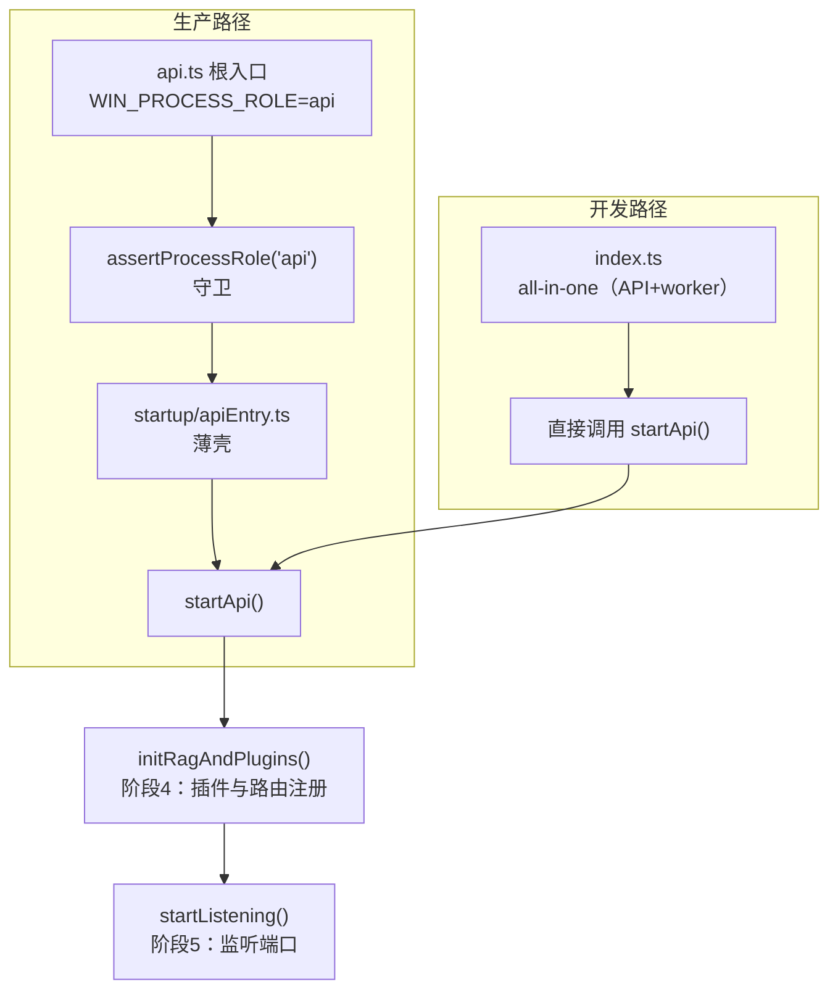
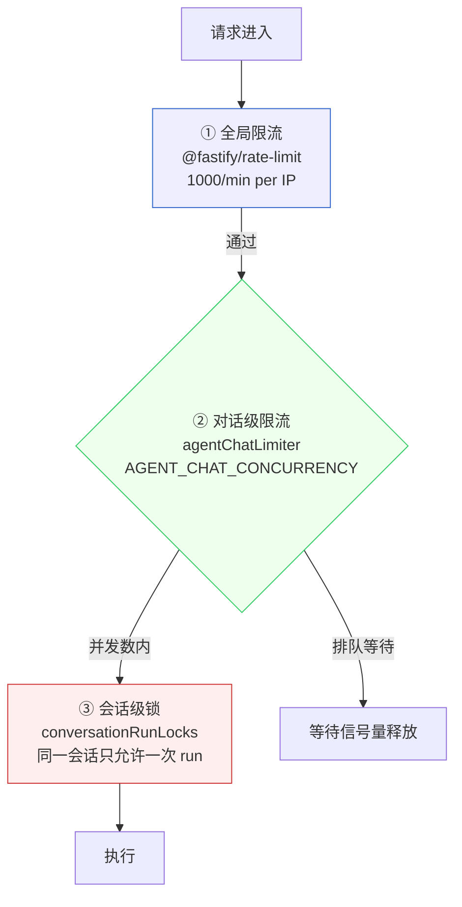
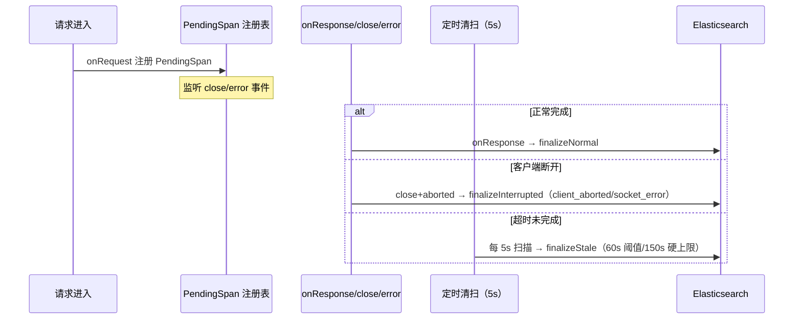

# 第 7 章 REST API 设计

> "API 是系统的契约，好的契约让集成变得自然。"

WinMatrix 的 REST API 由 90+ 路由文件组成，覆盖认证、项目、任务、Agent、技能、知识库、编码工作站、仪表盘等所有业务域。但本章要讲的不是"有哪些接口"——那看 Swagger 就够了。本章要讲的是这套 API 背后的工程决策：Fastify 实例怎么搭起来、插件按什么顺序注册、V1/V2 版本怎么演进并安全地退役旧路由、三层限流怎么分工、错误是怎么被统一收口又分类处理的。这些决策才是决定一个 API 层"好不好维护"的关键。

先从入口说起。

## 7.1 入口分层：从进程启动到 Fastify 实例

WinMatrix 的 API 进程有两条不同的启动路径，但它们最终都汇入同一个 Fastify 实例。理解这个分层是理解后面所有插件注册、路由挂载的前提。

### 两条入口路径



生产路径下，根入口 `src/api.ts` 先做进程角色守卫，再动态 import 真正的入口：

```typescript
// src/api.ts（第 1-24 行，完整）
#!/usr/bin/env node
/**
 * WinMatrix API 生产入口 — WIN_PROCESS_ROLE=api
 *
 * Role guard runs before dynamic import so Prisma/worker modules are not loaded on mismatch.
 */
import './infrastructure/sandbox/config/undiciConfig.js';
import { assertProcessRole } from '@/startup/processRole.js';

try {
  assertProcessRole('api');
} catch (err) {
  const message = err instanceof Error ? err.message : String(err);
  process.stderr.write(`[ProcessRole] API entry startup aborted: ${message}\n`);
  process.exit(1);
}

await import('@/startup/apiEntry.js');
```

这里有一个容易看走眼的细节：**角色守卫刻意放在动态 import 之前**。如果 `WIN_PROCESS_ROLE` 不是 `api`，`assertProcessRole` 直接抛错退出，Prisma、worker 等重模块根本不会被加载。这避免了"一个 scheduled worker 进程误启动成 API"时白白占用大量内存和连接。`apiEntry.ts` 只是个薄壳，调 `startApi()` 后注册关停信号：

```typescript
// src/startup/apiEntry.ts（第 1-30 行节选）
import { apiServer, shutdownApi, startApi } from '@/startup/api.js';
installLangChainConsoleWarnFilter();
registerFatalProcessHandlers();
registerShutdownSignalHandlers(() => shutdownApi(), { logToFastify: apiServer });
void startApi();
```

开发路径走 `index.ts` all-in-one（API + worker 同进程），它跳过守卫直接调 `startApi()`。**两条路径最终都汇入 `startup/api.ts` 的 `startApi()` → `initRagAndPlugins()` + `startListening()`**，这是整个 API 进程的唯一组装点。

### Fastify 实例与可配置 basePath

Fastify 实例的搭建在 `startup/api.ts`：

```typescript
// src/startup/api.ts（第 72-78 行）
/** 可配置的访问路径前缀（如 /WxpCopilot1/winmatrix），无则根路径 */
const basePath = process.env.BASE_PATH ? process.env.BASE_PATH.replace(/\/$/, '') : '';

export const apiServer = Fastify({
  logger: true,
  bodyLimit: 50 * 1024 * 1024,     // 50MB，覆盖大附件上传
  pluginTimeout: 60_000,            // 60 秒，给慢插件（DB/ES 初始化）留余量
});
```

两个参数值得展开：

- **`bodyLimit: 50MB`**：这不是拍脑袋的数字。WinMatrix 支持带附件的 Agent 对话、知识库文档上传，单个请求体可能很大。默认的 1MB 远远不够。但也不能设成无限——`@fastify/rate-limit` 之前若没有 body 大小上限，恶意客户端可以靠超大 body 耗尽内存。50MB 是一个在"够用"和"防滥用"之间取的平衡点。
- **`pluginTimeout: 60_000`**：Fastify 默认插件注册超时是 15 秒。但 WinMatrix 启动时要初始化 DB 连接池、ES 索引、RAG 索引、Agent 组件，这些 I/O 密集的插件很容易超过 15 秒。把它放宽到 60 秒，避免了"启动慢一点就被 Fastify 判超时杀掉"的误伤。

**`basePath`**（第 72 行）是一个容易忽视但部署时极其重要的配置。它把路由和静态文件整体挂到一个前缀下：

```typescript
// src/startup/api.ts（第 217-247 行节选）
if (basePath) {
  // 静态文件挂到 basePath 下
  await apiServer.register(fastifyStatic, { root: ..., prefix: basePath });
  // API 路由也整体挂到 basePath 下
  await apiServer.register(async (instance) => {
    await registerRoutes(instance, apiRouteDependencies);
  }, { prefix: basePath });
  logger.info(`静态文件与 API 已挂载到前缀: ${basePath}，根路径静态已启用（兼容 nginx 去前缀）`);
}
```

这解决了一个真实的部署痛点：某些 nginx 反代场景下，外部路径带前缀（如 `/WxpCopilot1/winmatrix`），但 nginx 会把前缀去掉再转发。应用层不感知前缀时，前端拿到的静态资源 URL 就对不上。`basePath` 让应用层主动把所有路由挂到前缀下，内外路径一致。**这是一个"部署一次就踩一次"的坑，提前设计进去比事后打补丁便宜得多。**

## 7.2 插件注册序列：顺序即契约

`initRagAndPlugins()`（第 102-466 行）是 API 进程的"阶段 4"，负责把所有 Fastify 插件按固定顺序注册到根实例上。**这个顺序不是任意的——它是一条隐式契约**：

```typescript
// src/startup/api.ts（第 106-167 行）
await apiServer.register(metricsPlugin, { endpoint: '/metrics' });      // ① Prometheus 指标
registerPoolMetrics(apiServer.metrics.client);

const t12 = Date.now();
await apiServer.register(cors, {                                         // ② CORS
  origin: true,
  methods: ['GET', 'POST', 'PUT', 'PATCH', 'DELETE', 'OPTIONS'],
  allowedHeaders: ['Content-Type', 'Authorization', 'X-Auth-Token', 'Accept'],
  credentials: true,
});

registerTraceIdMiddleware(apiServer);                                    // ③ TraceId（onRequest）
registerApiAuditLogMiddleware(apiServer);                                // ④ 审计日志

await apiServer.register(formbody);                                      // ⑤ form body 解析
await apiServer.register(multipart, { limits: { fileSize: MULTIPART_MAX_FILE_BYTES } });  // ⑥ multipart
await apiServer.register(cookie);                                        // ⑦ cookie
const sessionKey = createHash('sha256').update(config.sessionSecret, 'utf8').digest();
await apiServer.register(secureSession, {                                // ⑧ session
  key: sessionKey,
  cookie: { secure: config.nodeEnv === 'production', httpOnly: true,
            sameSite: config.nodeEnv === 'production' ? 'none' : 'lax',
            maxAge: 86400000, path: basePath || '/' },
});

apiServer.addHook('onRequest', async (request, _reply) => {              // ⑨ content-type 清洗
  const contentType = request.headers['content-type'];
  if (contentType === 'undefined' || contentType === 'null') {
    delete request.headers['content-type'];
  }
});

await apiServer.register(websocket);                                     // ⑩ WebSocket
await apiServer.register(rateLimit, { /* ... */ });                       // ⑪ 限流
apiServer.setErrorHandler(errorHandler);                                  // ⑫ 错误处理
```

注册顺序背后的几条原则：

1. **CORS 在最前**：CORS 必须在任何业务逻辑之前注册，否则预检（OPTIONS）请求会被后面的中间件拦截，导致浏览器报跨域错误。`credentials: true` + `origin: true` 表示允许带 cookie 的跨域请求。
2. **TraceId → 审计日志 → body 解析**：TraceId 必须在审计日志之前注册（审计日志要读 traceId），body 解析必须在这些 onRequest hook 之后（否则 hook 拿不到解析后的 body）。
3. **`content-type` 清洗**（第 156-161 行）：这是一个真实踩坑的产物——有些客户端会发 `content-type: undefined`（字面量字符串），Fastify 解析时会报错。这个 onRequest hook 在 body 解析前把这种脏 header 删掉。**面向公网的 API，永远不要相信客户端发来的 header。**
4. **限流在 WebSocket 之后、错误处理之前**：限流要能拦截所有路由（包括 WS），所以要在路由注册前完成；错误处理放最后，是所有请求的兜底。

`@fastify/secure-session` 的 cookie 配置也值得注意：生产环境 `secure: true, sameSite: 'none'`（支持跨站带 cookie），开发环境 `secure: false, sameSite: 'lax'`（方便本地调试）。`sessionSecret` 不是直接用，而是先 SHA256 哈希成 32 字节 key——`@fastify/secure-session` 要求 key 至少 32 字节。

## 7.3 路由组织：90+ 文件的领域划分

所有 API 路由位于 `src/interface/api/`，按业务域组织成 90+ 文件。`registerRoutes()`（第 134-399 行）是它们的集中注册表，按 `server.register(routes, { prefix })` 模式逐个挂载。

| 域 | 代表路由文件 | 前缀 |
|----|---------|------|
| 认证 | `auth.ts`, `rbac.ts` | 无前缀（路由内含完整路径） |
| 核心实体 | `projects.ts`, `documents.ts`, `tasks.ts`, `users.ts` | `/api/v1/` |
| Agent | `agents.ts`, `agents/agentRestChatV2.ts` | `/api/v1/agents`、`/api/v2/agents` |
| 技能 | `skills.ts`, `skills/execGuideRoutes.ts` | `/api/v1/` |
| 知识库 | `knowledgeBases.ts`, `ragRoutes.ts` | `/api/v1/` |
| 编码工作站 | `codingTasks.ts`, `workstationConfigRoutes.ts` | `/api/v1/` |
| 定时任务 | `scheduledTasks.ts`, `adminSystemScheduledTasksRoutes.ts` | `/api/v1/` |
| 外部集成 | `externalAgents.ts`, `externalInvocation/*` | `/api/v1/` |
| 仪表盘 | `dashboardRealtime.ts`, `dashboardV1Routes.ts` | `/api/v1/` |
| 系统 | `systemMonitorHealth.ts`, `logsHealthRoutes.ts` | `/api/v1/` |

### 子路由组合

大型路由域通过子路由组合，避免单文件膨胀。以项目域为例：

```typescript
// src/interface/api/projects.ts（第 47-51 行）
import { projectKickoffRoutes } from './projects/projectKickoff.js';
import { projectKdocsRoutes } from './projects/projectKdocs.js';
import { projectPmisRoutes } from './projects/projectPmis.js';
import { projectDraftRoutes } from './projects/projectDraft.js';
import { projectAutoflowRoutes } from './projects/projectAutoflow.js';
```

项目域拆成 5 个子路由（Kickoff 启动 / Kdocs 文档 / PMIS / Draft 草稿 / AutoFlow 自动流），每个子路由是一个独立的 Fastify 插件。父路由 `projects.ts` 把它们组合注册。Fastify 插件作用域的好处在这里体现：子路由里写的 `/:id` 实际匹配 `/api/v1/projects/:id`，路径是相对前缀的，不用每个文件都拼一长串前缀。

### API 版本策略：V1 前缀 + 410 守卫 + V2 并行

WinMatrix 的 API 版本策略不是简单的"V1 废弃、V2 上线"，而是三件事的组合：

```typescript
// src/interface/api/index.ts（第 134-169 行）
export async function registerRoutes(server: FastifyInstance, dependencies: ApiRouteDependencies) {
  registerRetiredLegacyRestRouteGuard(server);                            // ① 410 守卫

  // 认证、RBAC（无前缀）
  await registerAuthRoutes(server);
  await registerRbacRoutes(server);

  // V1 路由
  await server.register(projectsRoutes, { prefix: '/api/v1/projects' });
  // ... 其余 V1 路由
  await server.register(agentsRoutes, { prefix: '/api/v1/agents' });      // V1 agents（chat 已 410）

  // V2 稳定端点
  await server.register(agentRestChatV2Routes, { prefix: '/api/v2/agents' });  // V2 同步 chat
}
```

第一件事是 **410 守卫**。Agent 同步对话最早走的是 V1 的几条 REST 路由（`POST /api/v1/agents/chat` 等），后来整体迁移到了 WebSocket 流式（第 8 章）和 V2 同步端点。但旧路由不能直接删——前端、外部集成可能还在调。WinMatrix 的做法是用一个 `onRequest` hook 统一拦截：

```typescript
// src/interface/api/retiredLegacyRestRoutes.ts（第 3-33 行，完整）
const RETIRED_LEGACY_REST_ROUTES = new Set([
  'POST /api/v1/agents/chat',
  'POST /api/v1/agents/chat/file',
  'POST /api/v1/agents/chat/file/prepare',
  'POST /api/v1/agents/chat/stop',
  'POST /api/v1/agents/conversation-share',
  'GET /api/v1/agents/conversations',
  'POST /api/v1/attachments/register-project-asset',
  'POST /api/v1/attachments/register-remote',
  'POST /api/v1/auth/password-reset/confirm',
  'POST /api/v1/auth/password-reset/request',
  'PUT /api/v1/config/tools/actions/mcp-bridge-visible-by-category',
  'GET /api/v1/skills/bindings',
  'GET /api/v1/skills/cache',
  'GET /api/v1/tasks',
  'GET /api/v1/users',
]);

export function registerRetiredLegacyRestRouteGuard(server: FastifyInstance): void {
  server.addHook('onRequest', async (request, reply) => {
    const pathname = request.url.split('?', 1)[0];
    const routeKey = `${request.method.toUpperCase()} ${pathname}`;
    if (!RETIRED_LEGACY_REST_ROUTES.has(routeKey)) return;

    return reply.code(410).send({
      code: 'LEGACY_REST_API_RETIRED',
      message: '该旧版 REST API 已退役，请使用 winmatrix-ui 对应接口或 WebSocket 会话入口。',
      websocket: '/api/v1/agents/chat/stream',
    });
  });
}
```

这里用 `Set` 做 O(1) 匹配，`onRequest` 在路由解析之前就拦截，开销极小。返回 **410 Gone**（而不是 404）——410 明确告诉调用方"这个资源曾经存在、现在永久移除了"，不是"你路径写错了"。响应体里还带了 `websocket` 字段指引新的 WS 入口。这套守卫覆盖了 15 条退役路由（含旧的 chat、文件、附件注册、密码重置、部分查询接口）。

第二件事是 **V1 仍保留**，只是把迁移走的子路由用 410 守住，其余 V1 路由照常工作。

第三件事是 **V2 并行**：同步 chat 走 `POST /api/v2/agents/chat`，和 V1 的 410 守卫并存。V2 用独立的错误码体系（见 7.6）。

这套策略的核心思想是：**退役一个 API 比新增一个 API 难得多**。直接删路由会让调用方拿到模糊的 404；用 410 + 明确错误码 + 迁移指引，让调用方一次就知道"该换去哪"。

## 7.4 请求验证：Zod Schema

每个 API 端点用 Zod schema 验证输入。Zod 的价值不只是"校验"，而是校验 + 类型推导 + 转换三合一。

```typescript
// src/interface/api/auth.ts（第 59-77 行）
const createUserSchema = z.object({
  username: z.string().min(3, 'Username must be at least 3 characters'),
  password: z.string().min(8, 'Password must be at least 8 characters'),
  email: z.string().email('Invalid email').optional()
    .or(z.literal('')).transform((v) => (v === '' ? undefined : v)),
  displayName: z.string().optional(),
  wechatUserId: z.string().optional().or(z.literal('')).transform((v) => (v === '' ? undefined : v)),
  // 兼容前端传 boolean 或字符串，避免 smallint 收到字符串报错
  isAdmin: z.union([z.boolean(), z.enum(['true', 'false'])])
    .optional()
    .transform((v) => (v === true || v === 'true' ? true : false)),
});
```

几个值得注意的设计：

- **空字符串归一化**：`email` / `wechatUserId` 用 `.or(z.literal('')).transform(...)` 把空字符串转成 `undefined`。前端表单经常把"未填写"发成空字符串，直接传给 Prisma 会写入空串而不是 NULL，后续查询 `IS NULL` 就查不到。这个 transform 在边界层把脏数据洗干净。
- **`isAdmin` 的 union + transform**：注释写得很直白——"兼容前端传 boolean 或字符串，避免 smallint 收到字符串报错"。PostgreSQL 的 smallint 列收到字符串 `"true"` 会直接报类型错误。Zod 在入口把它统一成 boolean，挡住了这个数据库层的报错。

`z.infer<typeof createUserSchema>` 自动推导出 TypeScript 类型，校验和类型共用一个真源，避免了"schema 改了、类型忘了改"的漂移。**这种"校验即类型"的模式，是 Zod 相比 Joi / Yup 的核心优势。**

## 7.5 三层限流：全局 / 对话级 / 会话级

WinMatrix 的限流不是一个 `@fastify/rate-limit` 搞定，而是三层叠加，每一层挡不同的问题。



### 第一层：全局限流

```typescript
// src/startup/api.ts（第 158-178 行）
await apiServer.register(rateLimit, {
  max: Number(process.env.RATE_LIMIT_MAX ?? 1000),
  timeWindow: process.env.RATE_LIMIT_WINDOW ?? '1 minute',
  keyGenerator: (request) => {
    const xff = request.headers['x-forwarded-for'];
    const xffStr = Array.isArray(xff) ? xff[0] : xff;
    const realIp = xffStr ? xffStr.split(',')[0]?.trim() : '';
    return realIp || request.ip;
  },
  allowList: (request, _key) => {
    const path = request.url.split('?')[0];
    return (
      path.startsWith('/assets/') ||
      path.startsWith('/uploads/employees/') ||
      path === '/health' ||
      path === '/health/detailed' ||
      path === '/readyz' ||
      path.startsWith('/winmatrix-ui/') ||
      /\.(js|css|ico|svg|woff2?|png|jpg|jpeg|gif|webp)(\?|$)/i.test(path)
    );
  },
});
```

两个关键设计：

1. **`X-Forwarded-For` 取首段做 key**：WinMatrix 部署在 nginx 之后，`request.ip` 拿到的是 nginx 的 IP，所有请求会被当成同一个客户端。`keyGenerator` 从 `X-Forwarded-For` 取第一个 IP（最原始的客户端 IP）做分桶。注意是"首段"——XFF 链路可能是 `client, proxy1, proxy2`，取首段才是真实客户端。
2. **`allowList` 豁免静态资源和健康检查**：`/health`、`/readyz`（K8s 探针）、`/assets/`（前端静态资源）、`/uploads/employees/`（员工头像）、各种图片字体后缀，都不计入限流。否则一次页面加载就会消耗几十次配额，正常用户很快就触发限流。注意这里有 `health/detailed`——这是容易被漏掉的，K8s 的 readiness/liveness 探针有时会调详细健康检查。

### 第二层：对话级并发限制

全局限流挡不住"单个 IP 用满并发把 Agent 跑死"。Agent 对话是 CPU/内存密集型操作（LLM 调用、embedding、工具执行），必须额外限制同时进行的对话数：

```typescript
// src/interface/api/agentChatLimiter.ts（第 1-30 行）
/**
 * Agent 对话并发限制
 * 限制同时执行的 /chat 与 WebSocket 流式对话数，减轻主线程争抢
 * 通过环境变量 AGENT_CHAT_CONCURRENCY 配置，≤0 表示不限制
 */
const maxConcurrency = parseInt(process.env.AGENT_CHAT_CONCURRENCY || '0', 10);

class Limiter {
  private running = 0;
  private waitQueue: Array<() => void> = [];
  constructor(private readonly max: number) { if (this.max < 1) throw new Error('max must be >= 1'); }

  async acquire(): Promise<void> {
    if (this.running < this.max) { this.running++; return; }
    return new Promise<void>((resolve) => {
      this.waitQueue.push(() => { this.running++; resolve(); });
    });
  }
  release(): void {
    this.running--;
    if (this.waitQueue.length > 0 && this.running < this.max) {
      const next = this.waitQueue.shift();
      if (next) next();
    }
  }
}
const limiterInstance = maxConcurrency > 0 ? new Limiter(maxConcurrency) : null;
```

这是一个进程内的信号量：`acquire()` 占用一个名额，名额满了就进 `waitQueue` 排队；`release()` 释放后唤醒队首。**V2 同步 chat 和 WebSocket 流式对话共用这一个 limiter**（第 8 章会看到 WS 消息处理也走 `agentChatLimiter.acquire()`），因为它们消耗的是同一种资源——Agent 执行能力。`≤0 表示不限制`让开发环境可以关掉这个约束。

### 第三层：会话级 run 锁

```typescript
// src/interface/api/agents/ws/agentWebSocketState.ts（第 9 行）
/** 同一会话同时只允许一次 run，避免计划模式委托后因重复请求导致 orchestrator 再跑一遍单步 */
export const conversationRunLocks = new Map<string, boolean>();
```

这是最细粒度的一层：**同一会话同时只允许一次 run**。设想计划模式下，用户连点两次发送，如果没有这把锁，orchestrator 会把同一个单步跑两遍，状态就乱了。这把锁是 `Map<conversationId, boolean>`，run 开始时置 `true`，结束置 `false`。

三层限流各自挡不同的问题：全局挡 DDoS、对话级挡资源耗尽、会话级挡业务逻辑错乱。**它们不能互相替代——没有会话锁，全局限流再严也防不住"同一用户在一个会话里连点"。**

## 7.6 统一错误信封：WinMatrixError 与分类处理

API 层的最后一个关键是错误处理。一个不统一错误格式的 API，会让前端写一堆 `if (err.response.data.xxx)` 的特殊处理，维护噩梦。WinMatrix 用一个基类 + 一个全局 handler 把所有错误收口。

### WinMatrixError 基类

```typescript
// src/types/errors.ts（第 11-52 行）
export class WinMatrixError extends Error {
  public readonly code: string;
  public readonly statusCode: number;
  public readonly isOperational: boolean;
  public readonly timestamp: string;
  public readonly context?: Record<string, unknown>;

  constructor(
    message: string,
    code: string,
    statusCode: number = 500,
    isOperational: boolean = true,
    context?: Record<string, unknown>
  ) {
    super(message);
    this.name = this.constructor.name;
    this.code = code;
    this.statusCode = statusCode;
    this.isOperational = isOperational;
    this.timestamp = nowIso();
    this.context = context;
    Error.captureStackTrace(this, this.constructor);
  }

  toJSON(): Record<string, unknown> {
    return {
      name: this.name,
      message: this.message,
      code: this.code,
      statusCode: this.statusCode,
      isOperational: this.isOperational,
      timestamp: this.timestamp,
      ...(this.context && { context: this.context }),
      ...(process.env.NODE_ENV === 'development' && { stack: this.stack }),
    };
  }
}
```

每个字段都有用：

- **`code`**：稳定的错误码字符串（如 `LEGACY_REST_API_RETIRED`、`infrastructure`），前端靠它分支，不靠 HTTP 状态码（状态码太粗）。
- **`statusCode`**：HTTP 状态码，默认 500。
- **`isOperational`**：区分"预期内的业务错误"（true，如参数校验失败）和"程序 bug"（false，如 NPE）。运维可以靠这个字段决定是否告警——operational 错误是业务正常的一部分，non-operational 才需要立刻排查。
- **`context`**：结构化上下文，比如出错时的 conversationId、userId，比把它们拼进 message 好检索。
- **`toJSON()`**：开发环境带 stack，生产环境不带——避免把堆栈泄露给客户端。

派生类按业务域细分：`ConfigError`(500) / `ConfigNotFoundError`(404) / `ConfigValidationError`(400) / `AgentError`(500) / `AgentNotFoundError`(404) / `AgentExecutionError` / `LLMError` / `ValidationError` / `PermissionError` / `AuthenticationError` / `ConflictError` / `NotFoundError` / `ServiceUnavailableError`。每个派生类只要在 `super()` 里传对 code 和 statusCode，剩下的收口由全局 handler 完成。

### 全局 errorHandler 的分类处理

`setErrorHandler(errorHandler)` 注册的全局 handler（`errorHandler.ts` 第 111-207 行）做了五分支分类，每个分支走不同的响应策略：

```typescript
// src/interface/middleware/errorHandler.ts（第 111-207 行节选）
export async function errorHandler(
  error: FastifyError, request: FastifyRequest, reply: FastifyReply
): Promise<void> {
  if (reply.sent) return;  // 响应已发送则不处理（避免 ERR_REPLY_ALREADY_SENT）

  const normalizedMessage = getErrorMsg(error);
  const normalizedStatusCode = isInfrastructureConnectionError(error)
    ? 503
    : (error.statusCode || 500);

  // Stash 错误详情到 request，供审计中间件 onResponse 读取
  (request as any).__auditError = {
    name: error.name,
    message: normalizedMessage,
    code: (error as WinMatrixError).code || 'INTERNAL_ERROR',
    statusCode: normalizedStatusCode,
    stack: error.stack,
    classification: error instanceof WinMatrixError ? error.constructor.name : 'UnknownError',
    cause: serializeErrorCause(error.cause),     // 错误链（最多 3 层 cause）
    context: error instanceof WinMatrixError ? error.context : undefined,
  };

  // 按状态码级别记日志：5xx error、4xx warn
  if (normalizedStatusCode >= 500) {
    logger.error(errorLog, '[ErrorHandler] 服务器错误');
  } else if (normalizedStatusCode >= 400) {
    logger.warn(errorLog, '[ErrorHandler] 客户端错误');
  }

  // ── 分支 1：WinMatrix 自定义错误 → 直接序列化 ──
  if (error instanceof WinMatrixError) {
    reply.status(error.statusCode).send(createErrorResponse(error));
    return;
  }

  // ── 分支 2：基础设施连接错误（ECONNREFUSED/ETIMEDOUT/ECONNRESET）→ 503 ──
  if (isInfrastructureConnectionError(error)) {
    const serviceUnavailable = new ServiceUnavailableError(
      `基础设施连接失败，请稍后重试：${normalizedMessage}`, 'infrastructure');
    reply.status(serviceUnavailable.statusCode).send(createErrorResponse(serviceUnavailable));
    return;
  }

  // ── 分支 3：Fastify 验证错误 → 400 ParamValidationError ──
  if (error.validation) {
    const validationError = new ParamValidationError('request', JSON.stringify(error.validation));
    reply.status(400).send(createErrorResponse(validationError));
    return;
  }

  // ── 分支 4：透传 4xx（如 @fastify/rate-limit 的 429、415、413）──
  // 否则会被错误地包成 500，前端难以区分客户端限流与服务器异常。
  const upstreamStatusCode = typeof error.statusCode === 'number' ? error.statusCode : undefined;
  if (upstreamStatusCode && upstreamStatusCode >= 400 && upstreamStatusCode < 500) {
    const passthrough = new WinMatrixError(
      error.message || '请求被拒绝',
      (error as { code?: string }).code || 'CLIENT_ERROR',
      upstreamStatusCode, false);
    reply.status(upstreamStatusCode).send(createErrorResponse(passthrough));
    return;
  }

  // ── 分支 5：未知错误 → 500 INTERNAL_ERROR（生产环境隐藏 message）──
  const internalError = new WinMatrixError(
    process.env.NODE_ENV === 'development' ? normalizedMessage : '服务器内部错误',
    'INTERNAL_ERROR', 500, false);
  reply.status(500).send(createErrorResponse(internalError));
}
```

分支 4（4xx 透传）是最容易写错的。如果不特殊处理，`@fastify/rate-limit` 抛出的 429（Too Many Requests）会因为没有 `validation` 字段、不是 WinMatrixError、不是基础设施错误，一路掉到分支 5 被包成 500。前端拿到 500 会以为是服务器挂了，实际只是被限流了。透传分支保证了"客户端错误原样返回"，让前端能正确区分"你被限流了"和"服务器出 bug 了"。

分支 5 的"生产环境隐藏 message"也值得强调：未知错误可能携带敏感信息（SQL 语句、文件路径、内部异常堆栈），直接返回给客户端是安全风险。生产环境统一返回"服务器内部错误"，详细信息留在日志里。

### 统一响应格式

所有错误最终走 `createErrorResponse`（第 228-247 行），格式统一：

```typescript
// src/interface/middleware/errorHandler.ts（第 90-101 行）
interface ErrorResponse {
  success: false;
  error: {
    name: string;
    message: string;
    code: string;
    statusCode: number;
    timestamp: string;
    context?: Record<string, unknown>;
    stack?: string;
  };
}
```

前端只要检查 `success === false`，就能拿到结构化的 `error.code` 做分支，不需要为每种错误写特殊处理。

### V2 的独立错误码

V2 同步 chat 端点（`agentRestChatV2.ts`）另有一套独立的错误码，不走全局 errorHandler：

```typescript
// src/interface/api/agents/agentRestChatV2.ts（第 78-88 行）
export const V2ErrorCodes = {
  UNAUTHORIZED: 'UNAUTHORIZED',
  INVALID_REQUEST: 'INVALID_REQUEST',
  INVALID_ATTACHMENT_REFS: 'INVALID_ATTACHMENT_REFS',
  NO_DISPATCHABLE_EMPLOYEES: 'NO_DISPATCHABLE_EMPLOYEES',
  PROJECT_NOT_FOUND: 'PROJECT_NOT_FOUND',
  FORBIDDEN: 'FORBIDDEN',
  WORKSTATION_BUSY: 'WORKSTATION_BUSY',
  SRE_EMPLOYEE_NOT_FOUND: 'SRE_EMPLOYEE_NOT_FOUND',
  AGENT_CHAT_FAILED: 'AGENT_CHAT_FAILED',
} as const;

// 第 137-156 行
export function v2Success(reply: FastifyReply, data: Record<string, unknown>, traceId?: string): FastifyReply {
  const body: Record<string, unknown> = { success: true, data };
  if (traceId) body.traceId = traceId;
  return reply.code(200).send(body);
}

export function v2Error(
  reply: FastifyReply, statusCode: number, code: string, message: string, traceId?: string
): FastifyReply {
  const body: Record<string, unknown> = { success: false, error: { code, message } };
  if (traceId) body.traceId = traceId;
  return reply.code(statusCode).send(body);
}
```

V2 的错误响应比全局 `ErrorResponse` 更精简（只有 `code` + `message`，不带 `name/timestamp/context`），并强制带 `traceId` 便于排障。**这是有意的：V2 是"对外稳定契约"，字段越少越不容易破坏向后兼容；全局 errorHandler 是"对内统一"，信息越全越利于排障。** 两套格式各有适用场景，不是重复。

## 7.7 可观测性：TraceId 与审计日志的协作

API 层的可观测性由两个中间件协作：`traceId` 贯穿全链路，`apiAuditLog` 捕获写操作的完整轨迹。

### TraceId：ALS 全链路追踪

```typescript
// src/interface/middleware/traceId.ts（第 1-48 行）
const TRACE_ID_HEADER = 'x-trace-id';

declare module 'fastify' {
  interface FastifyRequest {
    traceId: string;
  }
}

export function registerTraceIdMiddleware(server: FastifyInstance): void {
  server.decorateRequest('traceId', '');

  server.addHook('onRequest', async (request: FastifyRequest, _reply: FastifyReply) => {
    // 优先从 header 取（继承上游），其次从 query 取，无则生成
    const incomingTraceId =
      (request.headers[TRACE_ID_HEADER] as string | undefined) ||
      (request.query as Record<string, string | undefined>).traceId;
    const traceId = incomingTraceId || generateTraceId();
    request.traceId = traceId;
    setTraceId(traceId);  // 注入 ALS 上下文
  });

  server.addHook('onSend', async (request: FastifyRequest, reply: FastifyReply) => {
    if (request.traceId) {
      reply.header(TRACE_ID_HEADER, request.traceId);  // 响应头回传
    }
  });
}
```

关键设计有三点：

1. **优先继承上游 traceId**：从 `x-trace-id` header 读，无则生成。这让跨服务调用的链路能串起来——服务 A 调服务 B 时把 traceId 传过去，B 继续用它，整条链路在日志里能搜出来。
2. **ALS 注入**：`setTraceId(traceId)` 把 traceId 注入 `AsyncLocalStorage`。后续任何异步调用（DB 查询、LLM 请求、日志输出）都能通过 `getTraceId()` 拿到，**无需参数传递**。这是 Node.js 异步链路追踪的标准做法，比手动透传 traceId 参数优雅得多。
3. **`declare module` 扩展类型**：为 `FastifyRequest` 加 `traceId` 属性，业务代码里 `request.traceId` 有类型提示。

### 审计日志：中断请求的可靠捕获

`apiAuditLog.ts`（约 599 行）是 API 层最复杂的中间件。它的核心挑战是：**客户端可能在请求完成前断开（如关浏览器），这种"中断请求"的审计日志容易丢。**

```typescript
// src/interface/middleware/apiAuditLog.ts（第 26-51 行）
const MAX_REGISTRY_SIZE = 10_000;        // 注册表最大容量
const SWEEP_INTERVAL_MS = 5_000;          // 清扫间隔
const TIMEOUT_THRESHOLD_MS = 60_000;      // 超时阈值
const TTL_HARD_LIMIT_MS = 150_000;        // TTL 硬上限
const MAX_SWEEP_PER_ROUND = 1_000;        // 每轮最大清扫数
const DEFAULT_INTERRUPTED_STATUS_CODE = 502;
const SLOW_REQUEST_THRESHOLD_MS = 10_000; // 慢请求阈值
const MAX_BODY_LENGTH = 10240;            // 10KB body 截断
```

解决方案是 **PendingSpan 注册表 + 多事件优先级 + 定时清扫**：



三种收口路径：

- **`onResponse`**：正常完成，记完整日志。
- **`close`/`error`**：客户端断开，记中断日志（`client_aborted` / `socket_error`）。这是关键——如果不监听这两个事件，断开的请求永远不会触发 `onResponse`，日志就丢了。
- **sweep 定时器**：每 5 秒扫一次注册表，把超过 60s 还没完成的 span 标记为 stale（`finalizeStale`），150s 硬上限强制清理。这是兜底——防止某些边缘情况下事件没触发，span 永久滞留。

WebSocket 长连接被显式跳过，否则 PendingSpan 会长期滞留：

```typescript
// src/interface/middleware/apiAuditLog.ts（SKIP_PATHS，节选）
const SKIP_PATHS = [
  '/health',                          // K8s 探针
  '/readyz',                          // K8s 探针
  '/api/v1/logs',                     // 日志自查询
  '/api/v1/traces',                   // 链路自查询
  '/api/v1/agents/chat/stream',       // Agent WebSocket（长连接）
  '/api/v1/external-agents/connect',  // 外部 Agent WebSocket（长连接）
];
```

健康检查和自查询也被跳过——它们是高频低价值的请求，记下来只会把审计日志的信噪比拉低。**审计日志只记写操作和有业务价值的请求，这是"什么该记"的设计决策，不是"全记"了事。**

错误处理和审计日志之间还有联动：errorHandler 把错误详情 stash 到 `request.__auditError`（见 7.6），审计中间件的 `onResponse` 会读这个字段，把错误信息一起记进审计日志。这样审计日志里既有请求轨迹也有错误详情，排障时一条记录看全貌。

## 本章小结

本章深入分析了 WinMatrix 的 REST API 设计：

1. **入口分层**：生产 `api.ts`（角色守卫）→ `startup/apiEntry.ts` → `startApi()`；开发 `index.ts` all-in-one。两条路径汇入同一 Fastify 实例。`bodyLimit 50MB` + `pluginTimeout 60s` + 可配置 `basePath` 解决真实部署问题。
2. **插件注册序列**是一条隐式契约：CORS → TraceId → 审计 → body 解析 → session → WebSocket → 限流 → 错误处理，顺序错乱会出微妙问题。
3. **API 版本策略**是"V1 前缀 + 410 守卫 + V2 并行"：15 条退役路由由 `onRequest` 守卫统一返回 410 + `LEGACY_REST_API_RETIRED` + WS 入口指引，V2 同步 chat 并行运行。
4. **Zod 校验**：校验 + 类型推导 + 转换三合一，在入口把空字符串归一化、boolean/smallint 兼容等脏数据洗干净。
5. **三层限流**：全局 `@fastify/rate-limit`（1000/min，XFF 首段分桶，静态资源白名单）+ 对话级 `agentChatLimiter`（`AGENT_CHAT_CONCURRENCY`，V2 与 WS 共用）+ 会话级 `conversationRunLocks`（同一会话只允许一次 run），各挡不同问题。
6. **统一错误信封**：`WinMatrixError` 基类（code/statusCode/isOperational/timestamp/context），全局 errorHandler 五分支分类（自定义错误 / 基础设施→503 / Fastify 验证→400 / 4xx 透传 / 未知→500 隐藏 message），生产隐藏内部细节；V2 另用精简独立错误码。
7. **可观测性**：TraceId（ALS 全链路，无需参数透传）+ 审计日志（PendingSpan 注册表 + close/error/sweep 三态收口，捕获中断请求，跳过长连接和高频探针）。

REST API 解决了"同步请求-响应"的契约问题。但 Agent 回复是流式的——一个回答可能要几十秒、分上百个 token 推送，还要支持中途停止、断线重连、多端同步。这些是 HTTP 请求-响应模型做不到的。在下一章中，我们将深入 WebSocket 与流式通信，看 WinMatrix 如何用单一 WS 入口 + 统一事件协议 + 会话状态机支撑这些实时场景。
