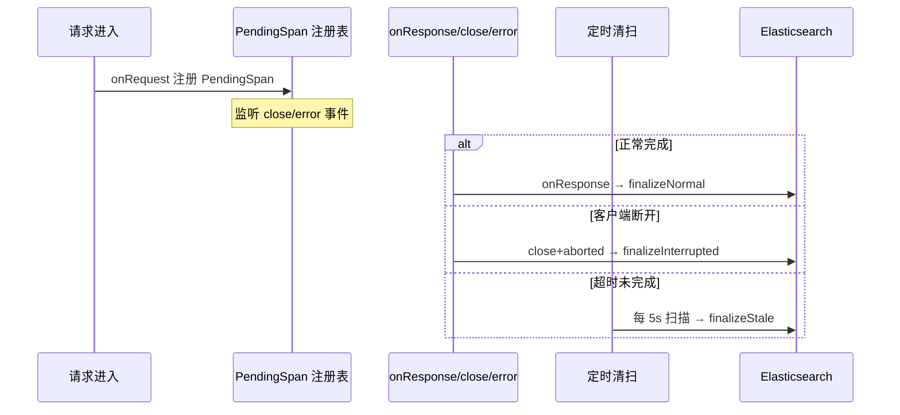

# 第 7 章 REST API 设计

> "API 是系统的契约，好的契约让集成变得自然。"

WinMatrix 的 REST API 由 90+ 路由文件组成，覆盖认证、项目、任务、Agent、技能、知识库等所有业务域。本章将分析这些路由的组织方式、统一注册机制、请求验证、审计日志和错误处理。

## 7.1 路由组织：90+ 路由文件的领域划分

所有 API 路由位于 `src/interface/api/` 目录，按业务域组织：

| 域 | 路由文件 | 前缀 |
|----|---------|------|
| 认证 | `auth.ts`, `rbac.ts` | 无前缀（含完整路径） |
| 核心实体 | `projects.ts`, `documents.ts`, `tasks.ts`, `users.ts` | `/api/v1/` |
| Agent | `agents.ts`, `agentRestChatV2Routes.ts` | `/api/v1/`, `/api/v2/agents` |
| 技能 | `skills.ts`, `execGuideRoutes.ts` | `/api/v1/` |
| 知识库 | `knowledgeBases.ts`, `ragRoutes.ts` | `/api/v1/` |
| 编码工作站 | `codingTasks.ts`, `workstationConfigRoutes.ts` | `/api/v1/` |
| 定时任务 | `scheduledTasks.ts`, `adminSystemScheduledTasksRoutes.ts` | `/api/v1/` |
| 外部集成 | `externalAgents.ts`, `externalInvocation/*` | `/api/v1/` |
| 仪表盘 | `dashboardRealtime.ts`, `dashboardV1Routes.ts`, `dashboardOfficeCockpit*` | `/api/v1/` |
| 系统 | `systemMonitorHealth.ts`, `systemUiConfigRoutes.ts`, `logsHealthRoutes.ts` | `/api/v1/` |
| 管理 | `adminEventConfigRoutes.ts`, `adminKernelManagementRoutes.ts` | `/api/v1/` |

## 7.2 registerRoutes：统一注册机制

所有路由通过 `registerRoutes()` 统一注册：

```typescript
// src/interface/api/index.ts（第 108-120 行）
export async function registerRoutes(server: FastifyInstance, dependencies: ApiRouteDependencies) {
  registerRetiredLegacyRestRouteGuard(server);

  // 认证 API 路由（无前缀，因为路由中已包含完整路径）
  await registerAuthRoutes(server);

  // RBAC API 路由（角色和权限管理）
  await registerRbacRoutes(server);

  // REST API 路由（使用 Fastify 插件作用域 + prefix）
  await server.register(projectsRoutes, { prefix: '/api/v1/projects' });
  await server.register(documentsRoutes, { prefix: '/api/v1/documents' });
  await server.register(tasksRoutes, { prefix: '/api/v1/tasks' });
  await server.register(codingTasksRoutes, { prefix: '/api/v1/projects' });
  // ...
}
```

### Fastify 插件作用域

每个路由文件是一个 Fastify 插件，通过 `prefix` 挂载：

```typescript
// src/interface/api/projects.ts（第 2-8 行）
/**
 * 项目管理 API 路由（主入口）
 *
 * 组合注册项目 CRUD / WBS & 路径配置 / 文档操作 / Kickoff 子路由。
 *
 * 分层说明：本文件仅依赖 Business 层接口（IProjectService /
 * IProjectDocumentFacade 等）和 Interface 层中间件，不直接导入 Infrastructure 层模块。
 */
```

Fastify 的插件作用域提供了**封装性**——每个路由文件内部定义的路由路径是相对于 prefix 的。例如 `projects.ts` 中定义的 `/:id` 实际匹配 `/api/v1/projects/:id`。

### 子路由组合

大型路由域通过子路由组合：

```typescript
// src/interface/api/projects.ts（第 47-51 行）
import { projectKickoffRoutes } from './projects/projectKickoff.js';
import { projectKdocsRoutes } from './projects/projectKdocs.js';
import { projectPmisRoutes } from './projects/projectPmis.js';
import { projectDraftRoutes } from './projects/projectDraft.js';
import { projectAutoflowRoutes } from './projects/projectAutoflow.js';
```

项目域包含 5 个子路由：Kickoff（启动）、Kdocs（文档）、PMIS、Draft（草稿）、AutoFlow（自动流）。

### V1 与 V2 边界

```typescript
// src/interface/api/index.ts（第 143 行）
await server.register(agentRestChatV2Routes, { prefix: '/api/v2/agents' });
```

系统同时维护 V1（`/api/v1/`）和稳定的 V2（`/api/v2/agents`）两个版本边界，支持 API 演进。

## 7.3 请求验证：Zod Schema

每个 API 端点使用 Zod Schema 验证请求输入：

```typescript
// src/interface/api/auth.ts（第 59-77 行）
const loginSchema = z.object({
  username: z.string().min(1, 'Username is required'),
  password: z.string().min(1, 'Password is required'),
});

const createUserSchema = z.object({
  username: z.string().min(3, 'Username must be at least 3 characters'),
  password: z.string().min(8, 'Password must be at least 8 characters'),
  email: z.string().email('Invalid email').optional()
    .or(z.literal('')).transform((v) => (v === '' ? undefined : v)),
  displayName: z.string().optional(),
  wechatUserId: z.string().optional().or(z.literal('')).transform((v) => (v === '' ? undefined : v)),
  // 兼容前端传 boolean 或字符串，避免 smallint 收到字符串报错
  isAdmin: z.union([z.boolean(), z.enum(['true', 'false'])])
    .optional()
    .transform((v) => (v === true || v === 'true' ? true : false)),
});
```

Zod 验证的优势：

1. **类型安全**：`z.infer<typeof schema>` 自动推导 TypeScript 类型
2. **转换能力**：`.transform()` 处理空字符串 → undefined、字符串 → boolean
3. **错误信息**：内置中文错误消息
4. **数据库兼容**：`isAdmin` 的 union + transform 避免数据库 smallint 收到字符串

## 7.4 TraceId 中间件：全链路追踪

```typescript
// src/interface/middleware/traceId.ts（完整 48 行）
const TRACE_ID_HEADER = 'x-trace-id';

declare module 'fastify' {
  interface FastifyRequest {
    traceId: string;
  }
}

export function registerTraceIdMiddleware(server: FastifyInstance): void {
  server.decorateRequest('traceId', '');

  server.addHook('onRequest', async (request: FastifyRequest, _reply: FastifyReply) => {
    // 优先从 header 取，其次从 query 取
    const incomingTraceId =
      (request.headers[TRACE_ID_HEADER] as string | undefined) ||
      (request.query as Record<string, string | undefined>).traceId;

    const traceId = incomingTraceId || generateTraceId();  // 无则生成
    request.traceId = traceId;

    // 注入 ALS 上下文（后续 getTraceId() 全链路可用）
    setTraceId(traceId);
  });

  server.addHook('onSend', async (request: FastifyRequest, reply: FastifyReply) => {
    if (request.traceId) {
      reply.header(TRACE_ID_HEADER, request.traceId);  // 响应头回传
    }
  });
}
```

关键设计：

1. **ALS（AsyncLocalStorage）注入**：`setTraceId()` 将 traceId 注入异步上下文，后续任何异步调用都能通过 `getTraceId()` 获取，无需参数传递
2. **上下游传递**：从请求 header 读取上游 traceId，无则生成；响应 header 回传
3. **类型扩展**：通过 `declare module 'fastify'` 为 FastifyRequest 添加 `traceId` 属性

## 7.5 API 审计日志：中断请求捕获

`apiAuditLog.ts`（约 599 行）是最复杂的中间件，实现了**中断请求的可靠捕获**：

```typescript
// src/interface/middleware/apiAuditLog.ts（第 26-51 行）
const MAX_REGISTRY_SIZE = 10_000;        // 注册表最大容量
const SWEEP_INTERVAL_MS = 5_000;          // 清扫间隔
const TIMEOUT_THRESHOLD_MS = 60_000;      // 超时阈值
const TTL_HARD_LIMIT_MS = 150_000;        // TTL 硬上限
const MAX_SWEEP_PER_ROUND = 1_000;        // 每轮最大清扫数
const DEFAULT_INTERRUPTED_STATUS_CODE = 502;
const SLOW_REQUEST_THRESHOLD_MS = 10_000; // 慢请求阈值
const MAX_BODY_LENGTH = 10240;            // 10KB body 截断
```

### PendingSpan 注册表

```typescript
interface PendingSpan {
  registryKey: string;
  startTime: number;
  method: string;
  path: string;
  clientIp?: string;
  traceId?: string;
  completed: boolean;
  // ...
}

const registry = new Map<string, PendingSpan>();
```

### 中断捕获机制

审计日志的核心挑战是：客户端可能在请求完成前断开连接（如关闭浏览器）。这种"中断请求"如果不特殊处理，审计日志会丢失。

WinMatrix 的解决方案是 **PendingSpan 注册表 + 事件优先级**：



- **onResponse**：正常完成，记录完整日志
- **close/error**：客户端断开，记录中断日志（`client_aborted` / `socket_error`）
- **sweep**：定时清扫超时 span（60s 阈值 / 150s 硬上限）

### 跳过路径

```typescript
const SKIP_PATHS = [
  '/health',                          // K8s 探针
  '/readyz',                          // K8s 探针
  '/api/v1/logs',                     // 日志自查询
  '/api/v1/traces',                   // 链路自查询
  '/api/v1/agents/chat/stream',       // Agent WebSocket
  '/api/v1/external-agents/connect',  // 外部 Agent WebSocket
];
```

WebSocket 长连接被显式跳过——否则 PendingSpan 会长期滞留。

## 7.6 错误处理：统一响应格式

```typescript
// src/interface/middleware/errorHandler.ts（第 90-101 行）
interface ErrorResponse {
  success: false;
  error: {
    name: string;
    message: string;
    code: string;
    statusCode: number;
    timestamp: string;
    context?: Record<string, unknown>;
    stack?: string;
  };
}

export async function errorHandler(
  error: FastifyError, request: FastifyRequest, reply: FastifyReply
): Promise<void> {
  if (reply.sent) return;  // 响应已发送则不处理

  const normalizedStatusCode = isInfrastructureConnectionError(error)
    ? 503   // 基础设施连接错误 → 503
    : (error.statusCode || 500);
  // ...
}
```

### 错误分类处理

```typescript
// src/interface/middleware/errorHandler.ts（第 106-202 行，概念性）
// 1. WinMatrixError → 使用其 statusCode 和结构化响应
// 2. 基础设施连接错误（ECONNREFUSED/ETIMEDOUT/ECONNRESET）→ ServiceUnavailableError(503)
// 3. Fastify 验证错误 → ParamValidationError(400)
// 4. 非 5xx 上游错误（如 429）→ 透传原始状态码
// 5. 未知错误 → 500 INTERNAL_ERROR（生产环境隐藏 message）
```

### 审计联动

```typescript
// 错误发生时，将详情暂存到 request.__auditError
// 供审计日志中间件记录
request.__auditError = {
  name: error.name,
  message: error.message,
  code: error.code,
  stack: error.stack,
};
```

这种联动确保错误不仅返回给客户端，也被审计日志完整记录。

## 7.7 限流策略

```typescript
// src/startup/api.ts（第 95-117 行）
await apiServer.register(rateLimit, {
  max: Number(process.env.RATE_LIMIT_MAX ?? 1000),     // 每分钟 1000 次
  timeWindow: process.env.RATE_LIMIT_WINDOW ?? '1 minute',
  keyGenerator: (request) => {
    // X-Forwarded-For 真实 IP 分桶
    const xff = request.headers['x-forwarded-for'];
    const xffStr = Array.isArray(xff) ? xff[0] : xff;
    return xffStr ? xffStr.split(',')[0]?.trim() : request.ip;
  },
  allowList: (request, _key) => {
    const path = request.url.split('?')[0];
    // 静态资源、健康检查、UI 资源不限流
    return (
      path.startsWith('/assets/') ||
      path.startsWith('/uploads/employees/') ||
      path === '/health' ||
      /\.(js|css|ico|svg|woff2?|png|jpg|jpeg|gif|webp)(\?|$)/i.test(path)
    );
  },
});
```

限流策略的几个要点：

1. **X-Forwarded-For 分桶**：使用真实客户端 IP（经过反向代理后），而非代理 IP
2. **allowList 豁免**：静态资源、健康检查、UI 资源不受限流
3. **可配置**：通过环境变量调整阈值

## 本章小结

本章深入分析了 WinMatrix 的 REST API 设计：

1. **90+ 路由文件**：按业务域组织，Fastify 插件作用域 + prefix
2. **registerRoutes 统一注册**：V1 + V2 版本边界，子路由组合
3. **Zod 请求验证**：类型安全 + 转换能力 + 数据库兼容
4. **TraceId 全链路追踪**：ALS 注入，无需参数传递
5. **中断请求捕获**：PendingSpan 注册表 + 事件优先级 + 定时清扫
6. **统一错误响应**：WinMatrixError 分类处理，基础设施错误 → 503
7. **限流策略**：X-Forwarded-For 真实 IP 分桶 + 静态资源豁免

在下一章中，我们将深入 WebSocket 与流式通信。
