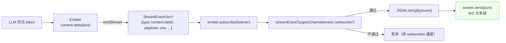
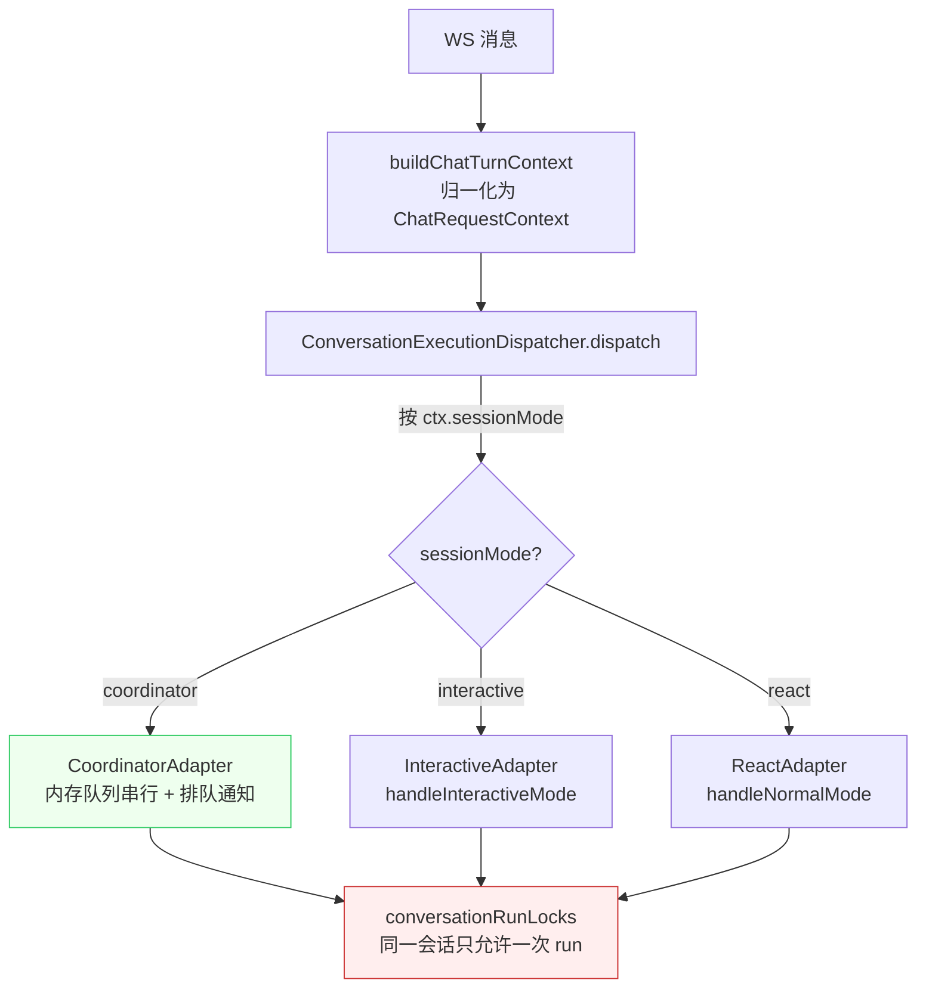
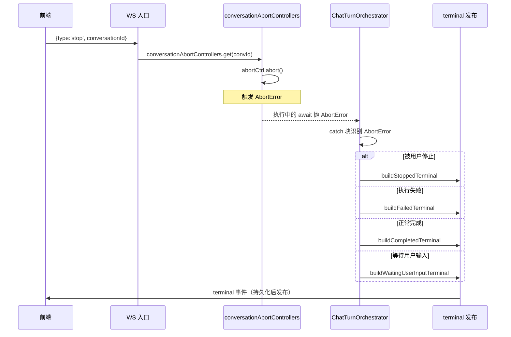

# 第 8 章 WebSocket 与流式通信

> "实时性是 AI 对话体验的灵魂。"

Agent 的回复不是一次性吐出来的——它是逐 token 流式输出的，中间穿插着思考过程、工具调用、计划更新。一个复杂回答可能要几十秒、分上百个事件推送，还要支持中途停止、断线重连、多端同步。这些场景 HTTP 请求-响应模型根本做不了。WinMatrix 用一套基于 WebSocket 的流式通信系统来支撑它们。

本章不讲"WebSocket 是什么"，而是讲 WinMatrix 在工程上怎么把流式通信做稳：单一 WS 入口 + JWT 鉴权、原生 ping/pong 半断开检测、Emitter→socket 的流式转发链、统一事件协议、按 sessionMode 分发的会话状态机、stop/中断/terminal 三态收口，以及多端路由。

## 8.1 单一 WS 主入口与鉴权

WinMatrix 有两个 WebSocket 端点，职责清晰分开：

| 端点 | 用途 | 鉴权 | 心跳 |
|------|------|------|------|
| `/api/v1/agents/chat/stream` | Agent 聊天流（核心） | JWT preHandler | 原生 ws ping/pong |
| `/api/v1/external-agents/connect` | 外部 Agent 接入 | JSON-RPC 注册 | 30s 注册超时 |

本章重点讲第一个——它是用户和 Agent 实时对话的唯一流式入口。路由注册在 `agentWebSocketRoutes`，挂到 `/api/v1/agents` 前缀下：

```typescript
// src/interface/api/agents/agentWebSocket.ts（第 375-389 行）
export async function agentWebSocketRoutes(server: FastifyInstance) {
  const jwtService = await container.resolve<JwtService>('JwtService');
  const jwtAuth = createJwtAuthMiddleware(jwtService);

  server.get('/chat/stream', { websocket: true, preHandler: [jwtAuth] }, (connection, req) => {
    const conn = connection as unknown as Record<string, unknown>;
    conn[AUTHENTICATED_USER_ID_KEY] = (req as { user?: { userId?: string } }).user?.userId;

    const socket = getWsSocket(connection);
    const socketId = `ws_${Date.now()}_${Math.random().toString(36).slice(2, 10)}`;
    const registeredConversations = new Set<string>();
    const conversationChannelSetups = new Map<string, ChannelSetup>();
    incWebSocketConnection('agent');
```

**JWT 在 `preHandler` 阶段验证**——这是 WS 鉴权的关键设计。`preHandler` 在 WS 升级握手前运行，握手失败时直接返回 401，客户端的 `new WebSocket()` 直接抛错。如果改成升级后再 `socket.close`，那条路径对客户端是不可观测的（连接建立成功又断开，前端只能靠 close code 猜原因），而且已经消耗了升级开销。JWT 走 Header / X-Auth-Token / query.token 三路解析（和 REST 共用同一套 JWT 中间件，见第 6 章认证）。

认证通过后，userId 被 stash 到 connection 对象（`conn[AUTHENTICATED_USER_ID_KEY]`），后续每条消息都能取到，不需要每条消息都重新验 JWT。`socketId` 是 `ws_{时间戳}_{随机串}`，用于在 push registry 里标识这个连接。

## 8.2 原生 ping/pong 半断开检测

TCP 连接有一个经典问题：**半开（half-open）**。客户端突然断电/拔网线，TCP 不会立刻通知服务端，服务端以为连接还在，继续往一个死连接上发数据，直到缓冲区满才报错。对 WS 来说，这会导致服务端累积大量僵尸连接。

WinMatrix 用服务端原生 ws ping/pong 来检测半断开，不依赖应用层心跳：

```typescript
// src/interface/api/agents/agentWebSocket.ts（第 391-438 行）
// ── 服务端原生 ping/pong 半断开检测 ──
// 浏览器自动响应原生 ping 帧，无需应用层 heartbeat
const PING_INTERVAL_MS = 30_000;  // 30 秒发送一次 ping
const PONG_DEADLINE_MS = 10_000;  // 10 秒内未收到 pong 则 terminate
let pongReceived = true;
let pingTimer: NodeJS.Timeout | null = null;
let pongTimer: NodeJS.Timeout | null = null;

// 尝试访问底层 ws 的 ping/terminate 方法
const rawSocket = (connection as { socket?: { ping?: () => void; terminate?: () => void; on?: ... } }).socket ?? socket;
const canPing = typeof rawSocket?.ping === 'function';
const canTerminate = typeof rawSocket?.terminate === 'function';

if (canPing) {
  (rawSocket as { on?: ... }).on?.('pong', () => {
    pongReceived = true;
    if (pongTimer) { clearTimeout(pongTimer); pongTimer = null; }
  });

  pingTimer = setInterval(() => {
    if (!pongReceived) {
      // 上一轮 ping 未收到 pong，半断开
      logger.warn('[API] WebSocket ping timeout，终止连接', { socketId });
      if (canTerminate) {
        (rawSocket as { terminate: () => void }).terminate();
      }
      return;
    }
    pongReceived = false;
    try {
      (rawSocket as { ping: () => void }).ping();
    } catch {
      // ping 失败，连接可能已断开
      pongReceived = true;
    }
    // 设置 pong 等待定时器
    pongTimer = setTimeout(() => {
      if (!pongReceived) {
        logger.warn('[API] WebSocket pong deadline 超时，终止连接', { socketId });
        if (canTerminate) {
          (rawSocket as { terminate: () => void }).terminate();
        }
      }
    }, PONG_DEADLINE_MS);
  }, PING_INTERVAL_MS);
}
```

这套机制的工作原理：

1. 每 30 秒服务端发一个原生 ping 帧。**浏览器收到 ping 帧后会自动回 pong，不需要任何应用代码**——这是 WebSocket 协议的内置行为。
2. 发 ping 时把 `pongReceived` 置 false，同时启一个 10 秒的 `pongTimer`。
3. 收到 pong 时把 `pongReceived` 置 true，清掉 `pongTimer`。
4. 下一轮 ping 时如果 `pongReceived` 还是 false（上一轮没收到 pong），直接 `terminate()`；或者 `pongTimer` 10 秒到了还没收到 pong，也 `terminate()`。

这里有两层超时保护：`pingTimer` 的 30 秒周期检查"上一轮有没有回"，`pongTimer` 的 10 秒检查"这一轮有没有及时回"。两层叠加，最快 10 秒、最慢 40 秒能检测出半断开。`terminate()` 是底层 TCP 强制关闭，不走正常关闭握手——对半开连接来说，正常握手根本发不出去。

代码里还有防御性的 `canPing` / `canTerminate` 能力检测：底层 ws 实现不一定都暴露 `ping`/`terminate`（比如 mock socket），有就启用检测，没有就跳过，不会因为缺少方法而崩溃。**面向多种运行环境（真实浏览器、测试 mock、反代）的防御性编程，是 WS 层稳健的基础。**

`socket.on('close')` 里清理所有资源：

```typescript
// src/interface/api/agents/agentWebSocket.ts（第 487-507 行）
socket.on('close', () => {
  decWebSocketConnection('agent');
  if (pingTimer) { clearInterval(pingTimer); pingTimer = null; }
  if (pongTimer) { clearTimeout(pongTimer); pongTimer = null; }
  for (const setup of conversationChannelSetups.values()) {
    setup.close();
  }
  conversationChannelSetups.clear();
  for (const convId of registeredConversations) {
    conversationPresenceService.unregister(convId, socketId);
  }
  registeredConversations.clear();
});
```

清掉两个 timer、关闭所有会话的 channel setup、从 presence service 注销——**连接关闭时的清理和建立时一样重要**，漏一个就是资源泄漏。

## 8.3 消息处理与并发控制

WS 连接建立后，客户端发的每条消息进 `socket.on('message')`。这里的处理顺序体现了控制帧和业务消息的优先级分离：

```typescript
// src/interface/api/agents/agentWebSocket.ts（第 447-485 行）
socket.on('message', async (message: Buffer | string) => {
  logger.info('[API] WebSocket 收到原始消息', {
    messageLength: typeof message === 'string' ? message.length : message.length,
    timestamp: Date.now(),
  });

  // 控制帧优先处理：connection:sync 绕过 agentChatLimiter
  const authenticatedUserIdForSync = conn[AUTHENTICATED_USER_ID_KEY] as string | undefined;
  const syncHandled = await tryHandleConnectionSync(
    message, socket, authenticatedUserIdForSync, ensureConversationPushRegistry,
  );
  if (syncHandled) return;

  // 业务消息经过信号量限流
  await agentChatLimiter.acquire();
  try {
    const authenticatedUserId = conn[AUTHENTICATED_USER_ID_KEY] as string | undefined;
    await handleWebSocketMessage(
      message, socket, authenticatedUserId,
      (conversationId: string) => {
        if (!registeredConversations.has(conversationId)) {
          registeredConversations.add(conversationId);
          conversationPresenceService.register(conversationId, socketId, 'web');
        }
      },
      ensureConversationPushRegistry,
      socketId,
    );
  } finally {
    agentChatLimiter.release();
  }
});
```

两条路径的关键区别：

- **`connection:sync` 控制帧绕过 limiter**：重连同步（8.6 节）必须即时响应。如果它排在 100 个业务消息后面等 limiter，用户重连后看到的是几分钟前的旧状态。
- **业务消息经过 `agentChatLimiter`**：这是第 7 章讲过的对话级信号量（`AGENT_CHAT_CONCURRENCY`）。WS 消息和 V2 REST chat 共用这一个 limiter，因为它们消耗的是同一种资源——Agent 执行能力。

业务消息进 `handleWebSocketMessage`（第 168-369 行），它做的第一件事是检查 stop 控制帧（8.7 节），然后是身份匹配校验：

```typescript
// src/interface/api/agents/agentWebSocket.ts（buildChatTurnContext 第 72-79 行）
// 强制认证身份匹配
if (data.userId !== authenticatedUserId) {
  throw new ConversationAccessDeniedError('userId mismatch');
}
```

消息体里的 `userId` 必须和 JWT 认证的身份一致。**这防的是"伪造他人身份发起对话"**——没有这一步，拿到自己 JWT 的用户可以发一条 `userId: 别人` 的消息，冒充别人触发 Agent 对话。

消息体本身由 `wsChatMessage.ts` 定义和校验：

```typescript
// src/interface/api/agents/wsChatMessage.ts（第 13-39 行）
export interface WsChatMessage {
  input: string;
  userId: string;
  projectId?: string;
  conversationId?: string;
  roleId?: string;
  digitalEmployeeId?: string;
  mode?: 'openclaw' | 'coordinator' | 'interactive' | 'react';
  attachments?: unknown[];
  attachmentRefs?: unknown[];
  accessMode?: 'member' | 'visitor';
}
```

`mode` 字段允许客户端指定执行模式（coordinator / interactive / react 等）。注意 `openclaw` 也在列表里——这是工作站沙箱模式（见第 15 章），通过 WS 也能触发。

## 8.4 流式转发链：从 LLM token 到客户端

这是 WebSocket 章节的核心：一个 LLM 生成的 token，是怎么一步步到客户端浏览器的？



这条链的关键环节在 `WebSocketChannel`：

```typescript
// src/infrastructure/channel/WebSocketChannel.ts（第 196-216 行）
private subscribeToEmitter(emitter: Emitter): void {
  this.unsubscribe = emitter.subscribe((event: StreamEvent) => {
    if (!this.isAlive()) return;
    if (!streamEventTargetsChannel(event, 'websocket')) return;  // 通道过滤

    try {
      const json = JSON.stringify(event);
      this.socket.send(json);                                    // 直接转发为 WS 文本帧
      this._lastOutputTime = Date.now();
    } catch (error) {
      const errMsg = getErrorMsg(error);
      logger.warn(`[WebSocketChannel] 事件转发失败: ${errMsg}`);
    }
  });

  this.projectionUnsubscribe = emitter.subscribeChatProjection((event) => {
    if (!this.isAlive()) return;
    try {
      this.socket.send(JSON.stringify(event));
      this._lastOutputTime = Date.now();
    } catch (error) {
      const errMsg = getErrorMsg(error);
      logger.warn(`[WebSocketChannel] 投影事件转发失败: ${errMsg}`);
    }
  });
}
```

几个要点：

1. **协议是 WebSocket 文本帧，不是 SSE**。每个 `StreamEvent` 被 `JSON.stringify` 成一个 JSON 字符串，作为一帧 WS 文本消息发送。客户端 `socket.onmessage` 收到后 `JSON.parse` 还原。SSE（Server-Sent Events）是单向的、只能服务端推、不支持 WS 这种双向控制帧（如 stop、connection:sync），所以这里选 WS。
2. **`streamEventTargetsChannel` 通道过滤**：一个事件可能通过 `targetChannels` 字段声明它要去哪些通道（websocket / wecom / dashboard）。如果这个事件没声明要去 websocket 通道，`WebSocketChannel` 直接跳过，不转发。这让一个 emitter 可以同时服务多个通道，互不干扰。
3. **`subscribeChatProjection`**：除了原始 stream event，还订阅了一个"投影"流——这是给客户端的简化版（比如把 thinking/tool trace 去掉、只留最终内容），用于前端只关心对话正文、不关心执行细节的场景。
4. **`isAlive()` 检查**：转发前检查 channel 是否还活着，避免往已关闭的 socket 写。

LLM 侧怎么调 emitter？`Emitter` 提供了领域便捷方法：

```typescript
// src/infrastructure/observability/spans/Emitter.ts（第 227-237 行附近，content 命名空间）
content = {
  start: (_span?) => { this.hub.stream.content.start(_span); },
  delta: (text, _span?) => { this.hub.stream.content.delta(text, _span); },  // 每个 token delta
  end: (content, _span?) => { this.hub.stream.content.end(content, _span); },
};
```

LLM 每生成一个 token，调 `emitter.content.delta(text)`，这个调用最终触发一次 `emitStream('content:delta', ...)`，被所有订阅者（包括 `WebSocketChannel`）收到。**整条链路是"发布-订阅"模式，LLM 侧不知道也不关心有几个通道在听**——这让它可以同时推给 web、wecom、dashboard 而不写任何分支。

`WebSocketChannel` 还支持重连和新轮次：

```typescript
// src/infrastructure/channel/WebSocketChannel.ts（第 234-255 行）
updateSocket(socket: WsSocket): void {   // 重连：换 socket，复用 emitter
  this.socket = socket;
  this.disposed = false;
}

updateEmitter(emitter: Emitter): void {  // 新轮次：换 emitter，重新订阅
  if (this.unsubscribe) { this.unsubscribe(); this.unsubscribe = undefined; }
  if (this.projectionUnsubscribe) { this.projectionUnsubscribe(); this.projectionUnsubscribe = undefined; }
  this.emitter = emitter;
  this.subscribeToEmitter(emitter);
}
```

重连时（同一个会话，socket 断了重连）只换 socket 不换 emitter，之前的轮次状态还在；新轮次（用户发下一条消息）换 emitter 重新订阅，避免上一轮的 token 串到这一轮。**这两个方法把"连接生命周期"和"回合生命周期"解耦了。**

## 8.5 统一流式事件协议：单一真相源

`src/infrastructure/streaming/types.ts`（401 行）是全系统流式事件的**唯一真源**。所有通道、所有 emitter、所有 channel 都用这里定义的类型，不允许各处自定义。

### StreamEvent 信封

```typescript
// src/infrastructure/streaming/types.ts（第 112-135 行）
export interface StreamEvent<T extends EmittableStreamEventType = EmittableStreamEventType> {
  type: T;                    // namespace:action 命名
  runId: string;              // 运行 ID
  seq: number;                // 序号（从 1 递增，per-conversation）
  conversationId?: string;    // 会话 ID（可选，用于防止会话串流）
  parentTaskId?: string;      // 父任务 ID
  targetChannels?: readonly StreamEventTargetChannel[];  // 目标通道
  ts: number;                 // 时间戳 (ms)
  spanId?: string;            // 产生该事件的 execution_span ID
  traceId?: string;           // trace 根标识
  parentSpanId?: string;      // 父 span ID（供前端 SpanTreeStore 直接建树）
  payload: StreamEventPayload<T>;
}

export type StreamEventTargetChannel = 'websocket' | 'wecom' | 'dashboard';
```

每个字段都有明确的工程用途：

- **`seq`（per-conversation 递增）**：防串流。客户端收到事件后检查 seq 是否连续，如果跳号或不递增，说明事件串了（比如上一轮的 token 混进来了）。这是流式 UI 正确性的基础。
- **`conversationId`**：和 `seq` 配合，确保事件归属于正确的会话。重连或会话迁移时，这个字段让客户端能正确归位。
- **`spanId` / `parentSpanId`**：前端拿到这两个字段可以直接建 Span 树，渲染 Agent 的执行层级（决策→子 Agent→工具）。
- **`targetChannels`**：为空表示广播给所有订阅者；指定了则只去指定通道。

### namespace:action 命名规范

事件类型用 `namespace:action` 命名，分 8 大类 + 一组遗留类型：

```typescript
// src/infrastructure/streaming/types.ts（第 16-58 行）
type ThinkingEventType = 'thinking:start' | 'thinking:delta' | 'thinking:end';
type ContentEventType = 'content:start' | 'content:delta' | 'content:replace' | 'content:end';
type ToolEventType =
  | 'tool:start' | 'tool:result:start' | 'tool:result:delta' | 'tool:result:end' | 'tool:end';
type StatusEventType = 'status';
type LifecycleEventType = 'agent:start' | 'agent:end' | 'run:start' | 'run:end' | 'run:error';
type DecisionEventType = 'decision:start' | 'decision:end';
type PlanEventType = 'plan:init' | 'plan:step' | 'plan:end';
type HubSpanStreamEventType = 'span_started' | 'span_event' | 'span_ended';
```

这种命名的好处：

1. **自描述**：`thinking:delta` 一看就知道是"思考过程的增量"，`tool:result:start` 是"工具结果流式开始"。
2. **分组清晰**：namespace 区分事件来源（思考 / 内容 / 工具 / 生命周期 / 决策 / 计划），前端可以按 namespace 渲染不同 UI 区域。
3. **扩展性**：新增 `reasoning:*` 或 `artifact:*` 不破坏现有命名。
4. **`content:replace`**：除了 start/delta/end，还有 replace——用于"整段替换"（如编辑、纠错），不是增量追加。

### LegacyStreamEventType：向后兼容

还有一组 `LegacyStreamEventType`（第 64-90 行），是旧的 ActionChain / react_loop 协议遗留：

```typescript
export type LegacyStreamEventType =
  | 'chain:step_start' | 'chain:step_complete'
  | 'conversation:state' | 'conversation:message_projection'
  | 'conversation:message_delta' | 'conversation:message_finalized'
  | 'conversation:turn_state'
  | 'session:state_changed'
  | 'sub_agent:start' | 'sub_agent:progress' | 'sub_agent:end' | 'sub_agent:error'
  | 'async:start' | 'async:progress' | 'async:complete'
  | 'cross_agent:start' | 'cross_agent:result'
  | 'react_loop_started' | 'react_step_started' | 'react_step_decision'
  | 'react_step_executed' | 'react_step_completed'
  | 'react_compose_started' | 'react_compose_completed' | 'react_loop_ended';
```

这些类型注释明确写了"仅 emitStream 直发，不由 Span 映射"——它们是历史协议，新的执行走 Span 映射的 8 大类，但为了兼容老前端/外部集成，emitter 仍可直发这些遗留事件。`EmittableStreamEventType = StreamEventType | LegacyStreamEventType`，emitStream 两种都接受。**保留遗留类型而不是强制迁移，是"对外协议演进"的现实选择——你不知道谁还在用旧协议。**

### 通道过滤谓词

```typescript
// src/infrastructure/streaming/types.ts（第 137-142 行）
export function streamEventTargetsChannel(
  event: Pick<StreamEvent, 'targetChannels'>,
  channel: StreamEventTargetChannel,
): boolean {
  return !event.targetChannels || event.targetChannels.includes(channel);
}
```

短短一行，但是多端路由的核心：`targetChannels` 为空（广播）或包含当前通道，才转发。这就是 8.4 节里 `WebSocketChannel` 用来过滤事件的那个谓词。

### 工具结果流式化配置

```typescript
// src/infrastructure/streaming/types.ts（第 396-401 行）
export const DEFAULT_TOOL_RESULT_STREAM_CONFIG: Required<ToolResultStreamConfig> = {
  chunkSize: 5,
  chunkDelay: 0,
  minLength: 50,
  wrapInCodeBlock: false,
};
```

工具结果（如代码搜索返回 1000 行）默认按 5 字符一块流式输出，避免一次性推送把 UI 卡住。`minLength: 50` 表示结果短于 50 字符就一次性发出，没必要切。这种"长结果流式、短结果直发"的策略，平衡了实时性和开销。

## 8.6 会话状态机：按 sessionMode 分发

WS 消息进 `handleWebSocketMessage` 后，归一化成 `ChatRequestContext`，再交给 `ConversationExecutionDispatcher` 按 `sessionMode` 分发到不同 adapter。这是会话层的状态机。



分发的核心逻辑很简洁：

```typescript
// src/interface/api/agents/ws/conversationExecutionDispatcher.ts（第 23-47 行）
export class ConversationExecutionDispatcher {
  private readonly adapters: Map<ConversationSessionMode, ConversationExecutionAdapter>;

  constructor(adapters: readonly ConversationExecutionAdapter[]) {
    this.adapters = new Map(adapters.map((adapter) => [adapter.sessionMode, adapter]));
  }

  async dispatch(ctx: ChatRequestContext, socket: WsSocket): Promise<ConversationExecutionResult> {
    const sessionMode = ctx.sessionMode;
    const adapter = this.adapters.get(sessionMode);
    if (!adapter) {
      throw new Error(`CONVERSATION_EXECUTION_ADAPTER_NOT_FOUND:${sessionMode}`);
    }
    await adapter.execute(ctx, socket);
    return {
      requestedSessionMode: ctx.sessionModeDegradation?.requestedMode ?? sessionMode,
      effectiveSessionMode: sessionMode,
      adapterSessionMode: adapter.sessionMode,
      ...(ctx.sessionModeDegradation ? { degraded: true } : {}),
    };
  }
}
```

策略模式：每个 adapter 实现 `execute(ctx, socket)`，dispatcher 按 `sessionMode` 查 Map 选 adapter。注意返回值里有 `requestedSessionMode` / `effectiveSessionMode` / `degraded`——这支持"降级"场景（比如请求 coordinator 模式但条件不满足，降级成 interactive），让降级对调用方可观测。

### CoordinatorAdapter：内存队列串行执行

三种模式里，`CoordinatorAdapter` 最复杂。它用 `SessionExecutionContext` 的内存队列实现"会话内串行执行 + 排队通知 + 缓冲消息回放"：

```typescript
// src/interface/api/agents/ws/conversationExecutionDispatcher.ts（第 57-120 行节选）
export class CoordinatorAdapter implements ConversationExecutionAdapter {
  readonly sessionMode = 'coordinator';
  private readonly registry = getSessionExecutionContextRegistry();

  async execute(ctx: ChatRequestContext, socket: WsSocket): Promise<void> {
    const sessionCtx = this.registry.getOrCreate({ conversationId: ctx.conversationId });

    // 1. 入队检查
    const processResult = sessionCtx.processInput(ctx.input, {
      userId: ctx.userId, userName: ctx.userName,
      projectId: ctx.project.id, projectName: ctx.project.name, projectCode: ctx.project.code,
      roleId: ctx.target.roleId, digitalEmployeeId: ctx.target.digitalEmployeeId,
    });

    // 2. 如果已入队，发送通知并返回
    if (processResult.queued) {
      await this.notifyQueued(ctx, socket, processResult);
      return;
    }

    // 3. 如果不应处理（队列已满或上下文已销毁）
    if (!processResult.shouldProcess) {
      if (processResult.rejectedReason) {
        logger.warn('[CoordinatorAdapter] 消息被拒绝', { conversationId: ctx.conversationId, reason: processResult.rejectedReason });
      }
      return;
    }

    // 4. 执行单轮聊天
    try {
      await handleNormalMode(ctx, socket);
    } finally {
      // 5. 标记为空闲
      sessionCtx.markIdle();
    }

    // 6. 处理缓冲消息（逐条执行）
    await this.processBufferedMessages(ctx, socket, sessionCtx);
  }
}
```

Coordinator 模式的设计意图是：**会话内任务是串行的，后到的消息要排队**。`processInput` 返回三种结果：

- **`queued: true`**：当前有任务在跑，这条消息入队，给用户发个"你排第 N 位"的通知（`notifyQueued`）。
- **`shouldProcess: true`**：当前空闲，立即执行。
- **`shouldProcess: false` + `rejectedReason`**：队列满了或上下文已销毁，拒绝。

执行完一轮后（第 6 步），如果队列里还缓冲了消息，`processBufferedMessages` 逐条取出来执行（循环直到队列清空）。这就是"串行执行"的完整闭环：**第一条立即跑，后续的排队，跑完一条自动跑下一条。**

排队通知用的是独立 emitter：

```typescript
// src/interface/api/agents/ws/conversationExecutionDispatcher.ts（notifyQueued）
private async notifyQueued(ctx, socket, processResult): Promise<void> {
  const emitter = createStreamingEmitter(`early_${Date.now()}`);
  const unsubscribe = emitter.subscribe((event) => {
    if (socket.readyState === 1) { socket.send(JSON.stringify(event)); }
  });
  try {
    emitter.emitPhase('queued');
    emitter.emitStream('async:start', {
      taskId: `queue_${ctx.conversationId}`,
      position: processResult.queuePosition,
      rejected: false,
    });
  } finally {
    unsubscribe();
  }
}
```

注意这个 emitter 用完即弃（`finally` 里 unsubscribe）——排队通知是一次性的，不需要持久订阅。发完 `async:start`（带队列位置）就清理。

### 三种 adapter 的工厂

```typescript
// src/interface/api/agents/ws/conversationExecutionDispatcher.ts（第 245-253 行）
export function createDefaultConversationExecutionDispatcher(): ConversationExecutionDispatcher {
  return new ConversationExecutionDispatcher([
    new CoordinatorAdapter(),
    createInteractiveEnvironmentAdapter(),   // handleInteractiveMode
    createReactAdapter(),                     // handleNormalMode
  ]);
}
```

`interactive` 和 `react` 模式都委托给 `modeHandlers` 里的函数（`handleInteractiveMode` / `handleNormalMode`），只有 coordinator 自带队列逻辑。**这让"会话调度策略"和"单轮执行逻辑"解耦**——三种模式的单轮执行可以复用同一套 handler，只是调度方式不同。

### 会话级 run 锁

```typescript
// src/interface/api/agents/ws/agentWebSocketState.ts（第 9 行）
/** 同一会话同时只允许一次 run，避免计划模式委托后因重复请求导致 orchestrator 再跑一遍单步 */
export const conversationRunLocks = new Map<string, boolean>();
```

这是第 7 章三层限流的最细一层。dispatcher 在执行前会检查这把锁——同一会话如果已经有 run 在进行，新的请求要么排队（coordinator）、要么拒绝。**没有这把锁，计划模式下用户连点两次，orchestrator 会把同一个单步跑两遍，状态就乱了。**

## 8.7 stop / 中断 / terminal：三态收口

Agent 执行可能很长（几十秒到几分钟），用户随时可能想停止。WinMatrix 用 stop 控制帧 + AbortController + terminal 事件三态收口，确保"中途停止"是干净的。



stop 控制帧的处理在 `handleWebSocketMessage` 最前面（第 180-254 行），不经 AI 管道：

```typescript
// src/interface/api/agents/agentWebSocket.ts（第 180-254 行节选）
// 0. 优先检查 stop 消息（不经 AI 管道，直接中断活跃会话）
const rawParsed = parseWebSocketMessage<Record<string, unknown>>(message);
if (rawParsed.success && rawParsed.data?.type === 'stop') {
  const convId = String(rawParsed.data.conversationId ?? '');
  if (!convId) {
    const errEmitter = createStreamingEmitter(`stop_err_${Date.now()}`, '');
    const errUnsub = errEmitter.subscribe((event) => { if (socket.readyState === 1) socket.send(JSON.stringify(event)); });
    try { errEmitter.emitRunError('invalid_stop', 'conversationId is required'); }
    finally { errUnsub(); errEmitter.clearListeners(); }
    return;
  }

  // 会话访问校验
  try {
    await assertConversationAccessForExternalEntry({ conversationId: convId, userId: authenticatedUserId, operation: 'stop' });
  } catch (error) {
    if (error instanceof ConversationAccessDeniedError) {
      const deniedEmitter = createStreamingEmitter(`stop_denied_${Date.now()}`, convId);
      const deniedUnsub = deniedEmitter.subscribe((event) => { if (socket.readyState === 1) socket.send(JSON.stringify(event)); });
      try { deniedEmitter.emitRunError(error.code, error.message); }
      finally { deniedUnsub(); deniedEmitter.clearListeners(); }
      return;
    }
    throw error;
  }

  const abortCtrl = conversationAbortControllers.get(convId);
  if (abortCtrl) {
    abortCtrl.abort();                                  // 触发 AbortError
    const stopEmitter = createStreamingEmitter(`stop_${Date.now()}`, convId);
    const stopUnsub = stopEmitter.subscribe((event) => { if (socket.readyState === 1) socket.send(JSON.stringify(event)); });
    try { stopEmitter.emitRunError('stopped_by_user', '用户已手动停止本次会话'); }
    finally { stopUnsub(); stopEmitter.clearListeners(); }
  } else {
    // 没有活跃的会话可停止
    const nopEmitter = createStreamingEmitter(`stop_nop_${Date.now()}`, convId);
    const nopUnsub = nopEmitter.subscribe((event) => { if (socket.readyState === 1) socket.send(JSON.stringify(event)); });
    try {
      nopEmitter.emitPhase('no_active_run');
      nopEmitter.emitRunError('noop', '当前无进行中的任务');
    } finally { nopUnsub(); nopEmitter.clearListeners(); }
  }
  return;
}
```

这套逻辑的几个设计决策：

1. **stop 帧不经 AI 管道**：它在 `handleWebSocketMessage` 开头就拦截，不进 limiter、不进 dispatcher。停止操作必须即时生效，不能排在 100 条消息后面。
2. **`conversationAbortControllers.get(convId)`**：每个活跃 run 在开始时把自己的 AbortController 注册进这个 Map。stop 时取出并 `abort()`，执行链路上的所有 `await`（LLM 请求、工具调用）会抛 `AbortError`。
3. **三种 stop 结果都有明确反馈**：有活跃会话→`stopped_by_user`；无活跃会话→`noop` + `no_active_run`；会话访问被拒→`ConversationAccessDeniedError` 的 code；缺 conversationId→`invalid_stop`。前端每种情况都能给用户正确提示。
4. **每个反馈用独立 emitter + 用完即清**：`createStreamingEmitter` 创建临时 emitter，subscribe 后发完事件，`finally` 里 unsubscribe + clearListeners，不残留订阅。

被 abort 的 run 在 orchestrator 的 catch 块里被识别，最终发布对应的 terminal 事件。terminal 是根回合的**唯一收口点**——无论正常完成、失败、被停、等用户输入，都收敛到 `buildCompletedTerminal` / `buildFailedTerminal` / `buildStoppedTerminal` / `buildWaitingUserInputTerminal` 四种之一，且**持久化成功后才发布**。这保证了客户端收到的 terminal 一定对应一条已落库的记录，不会出现"前端显示结束但数据库没存"的不一致。

## 8.8 重连同步：connection:sync 控制帧

用户刷新页面、网络抖动、手机切后台再回来，都会导致 WS 断开重连。重连后客户端面临一个问题：**我断开期间错过了哪些事件？现在每个会话是什么状态？** WinMatrix 用 `connection:sync` 控制帧解决这个问题。

`connection:sync` 在 `socket.on('message')` 里绕过 limiter 优先处理（见 8.3 节），由 `connectionSyncHandler.ts` 专门处理：

```typescript
// src/interface/api/agents/ws/connectionSyncHandler.ts（第 30-125 行节选）
export async function tryHandleConnectionSync(
  message: Buffer | string,
  socket: WsSocket,
  authenticatedUserId: string | undefined,
  registerPushForConversation?: (conversationId: string) => void,
): Promise<boolean> {
  if (!authenticatedUserId) return false;
  const rawParsed = parseWebSocketMessage<Record<string, unknown>>(message);
  if (!rawParsed.success || !rawParsed.data) return false;
  const parsed = parseConnectionSyncV1(rawParsed.data);
  if (!parsed) return false;

  // 是 connection:sync 控制帧，处理它
  try {
    const conversations = parsed.conversations as Array<{ conversationId: string; expectedRunId?: string }>;
    const statePort = container.resolve<ConversationRuntimeStatePort>('ConversationRuntimeStatePort');

    // 步骤 1：批量鉴权——只返回用户有权限访问的会话
    const authorizedConversations = await statePort.authorizeMany({
      userId: authenticatedUserId, conversations,
    });

    // 步骤 2：只为鉴权通过的会话注册 push registry
    // 注册在状态查询之前，避免查询与完成之间的 terminal 竞态
    // 鉴权失败的会话绝不能注册，防止抢占他人推送通道
    if (registerPushForConversation) {
      for (const entry of authorizedConversations) {
        try { registerPushForConversation(entry.conversationId); }
        catch (err) { logger.warn('[WS Sync] push registry 注册失败', { ... }); }
      }
    }

    // 步骤 3：批量读取已授权会话的 canonical 状态（不重复鉴权）
    const snapshots = await statePort.readAuthorizedMany(authorizedConversations);
    const resultStatus = authorizedConversations.length !== conversations.length
      || snapshots.some((snapshot) => snapshot.error) ? 'inconsistent' : 'ok';

    const result: ConnectionSyncResultV1 = {
      type: 'connection:sync_result',
      schemaVersion: SYNC_SCHEMA_VERSION,
      connectionGeneration: parsed.connectionGeneration,
      snapshots,
      resultStatus,
    };
    if (socket.readyState === 1) { socket.send(JSON.stringify(result)); }
  } catch (error) {
    // sync 失败时返回 degraded
    const degradedResult: ConnectionSyncResultV1 = {
      type: 'connection:sync_result', schemaVersion: SYNC_SCHEMA_VERSION,
      connectionGeneration: parsed.connectionGeneration, snapshots: [], resultStatus: 'degraded',
    };
    if (socket.readyState === 1) { socket.send(JSON.stringify(degradedResult)); }
  }
}
```

这是重连同步的核心，三步走的顺序极其讲究：

1. **批量鉴权（`authorizeMany`）**：客户端可能传一堆 conversationId（它打开过的所有会话），服务端一次性批量鉴权，只返回用户有权限访问的。**鉴权失败的会话直接被过滤**，不会进入下一步。
2. **为鉴权通过的会话注册 push registry**：注释明确说"注册在状态查询之前，避免查询与完成之间的 terminal 竞态"。如果先查状态再注册 push，查询和注册之间如果有 run 完成发布 terminal，这个 terminal 就丢了（还没注册 push）。先注册 push 再查状态，竞态窗口被消除。**鉴权失败的会话绝不能注册，防止抢占他人推送通道**——这是安全红线。
3. **批量读 canonical 状态（`readAuthorizedMany`）**：只读已授权会话，不重复鉴权。返回每个会话的快照（最新 run 状态、terminal 等）。

`resultStatus` 三态：`ok`（全部一致）、`inconsistent`（部分鉴权失败或读取出错）、`degraded`（sync 处理本身异常）。前端按状态决定是否要全量重拉。`connectionGeneration` 是连接代际标识，前端用它区分不同次重连的响应。sync 帧带 `schemaVersion`，支持协议演进——schema 版本不匹配时不会强行解析。

## 8.9 心跳与空闲检测的分层

除了 8.2 节的原生 ping/pong，WS 层还有一套应用层心跳/空闲检测常量：

```typescript
// src/interface/api/agents/agentWebSocketConstants.ts（完整 12 行）
/** 无输出检测间隔（ms） */
export const IDLE_CHECK_MS = 5_000;

/** 心跳发送间隔（ms） */
export const HEARTBEAT_INTERVAL_MS = 25_000;

/** 超过该时间无输出则发送心跳（ms） */
export const HEARTBEAT_THRESHOLD_MS = 25_000;
```

这就构成了存活的分层检测：

| 层 | 间隔 | 检测什么 | 机制 |
|----|------|---------|------|
| 空闲检测 | 5s | 是否有输出 | 每 5s 检查 `_lastOutputTime` |
| 应用层心跳 | 25s | 业务是否在线 | 超过 25s 无输出则发心跳事件 |
| 原生 ping | 30s | 连接是否在线 | ws ping/pong 帧 |

三层各管一件事：原生 ping 保证 TCP 连接活着；应用层心跳保证业务在推进（即使没生成内容，也告诉客户端"我还在跑"）；空闲检测是触发心跳的条件判断。**应用层心跳和原生 ping 不能互相替代**——一个半开连接 TCP 层可能还活着（ping 能过），但应用层已经卡死（不发心跳）；反过来应用层在跑但网络断了，ping 检测会发现。两者结合才能全面覆盖。

## 8.10 异步推送与多端路由

`WebSocketChannel` 同时实现了 `streaming` 和 `push` 两种能力：

```typescript
// src/infrastructure/channel/WebSocketChannel.ts（第 28-54 行）
export class WebSocketChannel implements PushableChannel {
  capabilities = { streaming: true, push: true };
  // ...
}
```

- **streaming**：实时流式输出（token by token），由 emitter.subscribe 驱动。
- **push**：异步推送，用于会话迁移和多端同步。`webConversationPushRegistry` 按 `conversationId + ownerId(socketId)` 注册回调——一个会话的事件可以推送到多个 socket（多端），也可以迁移到新 socket（重连）。

多端路由靠 `targetChannels` 字段实现。一个 Agent 回复可以同时推给：

```typescript
targetChannels: ['websocket', 'wecom', 'dashboard']
```

- **websocket**：Web 客户端实时对话
- **wecom**：企业微信（企微长连接 / Webhook，见集成章）
- **dashboard**：仪表盘实时更新

每个通道的 channel（`WebSocketChannel` / WeCom 通道 / Dashboard 通道）用 `streamEventTargetsChannel(event, '它自己的通道')` 过滤，只收属于自己的事件。**一个 emitter 广播，多端各自过滤，互不干扰**——这是 publish-subscribe 模式的典型应用，让"生成事件"和"路由事件"彻底解耦。

## 本章小结

本章深入分析了 WinMatrix 的 WebSocket 与流式通信系统：

1. **单一 WS 主入口 `/api/v1/agents/chat/stream`**：JWT 在 preHandler 阶段验证（握手前 401，而非升级后 close），token 三路解析，userId stash 到 connection。
2. **原生 ping/pong 半断开检测**：30s ping + 10s pong deadline，双层超时（pingTimer 周期检查 + pongTimer 即时检查），`terminate()` 强制关闭，带 `canPing`/`canTerminate` 能力检测防御多种运行环境。
3. **流式转发链**：LLM token → `emitter.content.delta` → `emitStream` → `emitter.subscribe` → `streamEventTargetsChannel` 过滤 → `JSON.stringify` → `socket.send`（WS 文本帧，非 SSE）。`updateSocket`/`updateEmitter` 解耦连接生命周期与回合生命周期。
4. **统一事件协议**（`streaming/types.ts` 单一真源）：`StreamEvent<T>` 信封带 `runId/seq/conversationId/spanId/parentSpanId/targetChannels`，`namespace:action` 命名分 8 大类 + LegacyStreamEventType 向后兼容；`seq` per-conversation 递增防串流；`targetChannels` 驱动多端路由。
5. **会话状态机**：`ConversationExecutionDispatcher` 按 `sessionMode`（coordinator/interactive/react）选 adapter；CoordinatorAdapter 用 SessionExecutionContext 内存队列实现"串行执行 + 排队通知 + 缓冲消息回放"；`conversationRunLocks` 保证同一会话只允许一次 run。
6. **stop/中断/terminal 三态收口**：stop 控制帧不经 AI 管道，查 `conversationAbortControllers` → `abort()` 触发 AbortError → orchestrator catch 识别 → 发布 `buildStoppedTerminal`/`buildFailedTerminal`/`buildCompletedTerminal`/`buildWaitingUserInputTerminal`，terminal 持久化成功后才发布，是根回合唯一收口点。
7. **重连同步**：`connection:sync` 控制帧绕过 limiter，三步走（批量鉴权 → 注册 push → 读 canonical 状态），注册在查询前消除 terminal 竞态，鉴权失败绝不注册 push，带 schemaVersion 支持演进。
8. **心跳分层**：空闲检测（5s）+ 应用层心跳（25s）+ 原生 ping（30s），三层各管连接/业务/触发条件，不能互相替代。
9. **多端路由**：`targetChannels`（websocket/wecom/dashboard）+ 每通道 `streamEventTargetsChannel` 过滤，一个 emitter 广播多端过滤，push registry 支持会话迁移和多端同步。

到目前为止，我们讲的都是"一条消息怎么进来、回复怎么出去"——这是单次交互。但 Agent 的能力不止于此：它能根据意图决策走哪条路、调用哪个技能、编排多个角色协作。在下一章中，我们将进入 Agent 系统的核心——决策引擎，看 WinMatrix 是如何把"用户一句话"路由到正确的执行路径的。
