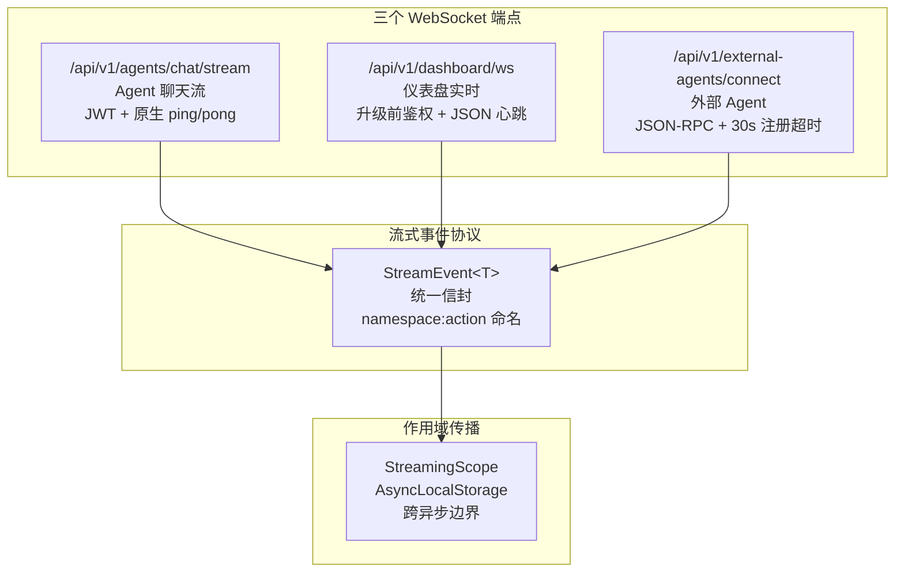

# 第 8 章 WebSocket 与流式通信

> "实时性是 AI 对话体验的灵魂。"

WinMatrix 的 WebSocket 系统支撑了 Agent 回复的流式输出、仪表盘实时更新和外部 Agent 协作。这不是简单的消息推送——它包含了三种不同的 WebSocket 端点、统一的流式事件协议、基于 AsyncLocalStorage 的作用域传播，以及精细的连接管理。本章将深入这些实现。

## 8.1 三个 WebSocket 端点

WinMatrix 有三个 WebSocket 端点，各有不同的鉴权和用途：



| 端点 | 鉴权 | 心跳 | 协议 |
|------|------|------|------|
| `/chat/stream` | JWT preHandler | 原生 ping/pong（30s） | 流式事件 |
| `/dashboard/ws` | 升级前鉴权 | JSON ping（30s） | Dashboard 事件 |
| `/external-agents/connect` | JSON-RPC 注册 | - | JSON-RPC 帧 |

## 8.2 Agent 聊天流：/chat/stream

这是最核心的 WebSocket 端点，负责 Agent 回复的流式输出。

### 路由注册与鉴权

```typescript
// src/interface/api/agents/agentWebSocket.ts（第 379-387 行）
server.get('/chat/stream', { websocket: true, preHandler: [jwtAuth] }, (connection, req) => {
  const conn = connection as unknown as Record<string, unknown>;
  conn[AUTHENTICATED_USER_ID_KEY] = (req as { user?: { userId?: string } }).user?.userId;

  const socket = getWsSocket(connection);
  const socketId = `ws_${Date.now()}_${Math.random().toString(36).slice(2, 10)}`;
  const registeredConversations = new Set<string>();
  const conversationChannelSetups = new Map<string, ChannelSetup>();
  incWebSocketConnection('agent');
```

JWT 在 `preHandler` 阶段验证——握手失败时直接返回 401，而非升级后再 `socket.close`（那条路径不可观测）。

### 原生 ping/pong 半断开检测

```typescript
// src/interface/api/agents/agentWebSocket.ts（第 389-438 行）
// ── 服务端原生 ping/pong 半断开检测 ──
// 浏览器自动响应原生 ping 帧，无需应用层 heartbeat
const PING_INTERVAL_MS = 30_000;   // 30 秒发送一次 ping
const PONG_DEADLINE_MS = 10_000;   // 10 秒内未收到 pong 则 terminate
let pongReceived = true;

pingTimer = setInterval(() => {
  if (!pongReceived) {
    // 上一轮 ping 未收到 pong，半断开
    logger.warn('[API] WebSocket ping timeout，终止连接', { socketId });
    if (canTerminate) {
      (rawSocket as { terminate: () => void }).terminate();
    }
    return;
  }
  pongReceived = false;
  rawSocket.ping();
}, PING_INTERVAL_MS);

socket.on('pong', () => {
  pongReceived = true;
});
```

半断开检测解决了一个真实问题：TCP 连接可能"半开"——一方已经断开，但另一方不知道（如客户端突然断电）。通过原生 ping/pong：

1. 服务端每 30 秒发送 ping 帧
2. 浏览器**自动**响应 pong（无需应用代码）
3. 如果 10 秒内没收到 pong，判定半断开，`terminate()` 连接

### 消息处理与并发控制

```typescript
// src/interface/api/agents/agentWebSocket.ts（第 447-485 行）
socket.on('message', async (message: Buffer | string) => {
  // connection:sync 控制帧直接处理，不经并发限制
  const syncHandled = await tryHandleConnectionSync(message, socket, /* ... */);
  if (syncHandled) return;

  // 业务消息经过信号量限流
  await agentChatLimiter.acquire();  // 信号量
  try {
    await handleWebSocketMessage(message, socket, authenticatedUserId);
  } finally {
    agentChatLimiter.release();
  }
});
```

`agentChatLimiter` 是一个信号量，限制同一连接的并发消息处理。控制帧（`connection:sync`）绕过限流，保证连接同步的即时性。

### 身份匹配校验

```typescript
// src/interface/api/agents/agentWebSocket.ts（buildChatTurnContext 第 72-79 行）
// 强制认证身份匹配
if (data.userId !== authenticatedUserId) {
  throw new ConversationAccessDeniedError('userId mismatch');
}
```

消息中的 `userId` 必须与 JWT 认证的身份一致，防止伪造他人身份发起对话。

### 消息类型

```typescript
// src/interface/api/agents/wsChatMessage.ts（第 13-39 行）
export interface WsChatMessage {
  input: string;
  userId: string;
  projectId?: string;
  conversationId?: string;
  roleId?: string;
  digitalEmployeeId?: string;
  mode?: 'openclaw' | 'coordinator' | 'interactive' | 'react';
  attachments?: unknown[];
  attachmentRefs?: unknown[];
  accessMode?: 'member' | 'visitor';
}
```

`mode` 字段允许客户端指定执行模式（Coordinator / Interactive / React 等）。

## 8.3 仪表盘 WebSocket

仪表盘 WebSocket 用于实时推送项目指标更新：

### 升级前鉴权

```typescript
// src/interface/api/dashboardWebSocket.ts（第 28-58 行）
export async function registerDashboardWebSocket(server: FastifyInstance): Promise<void> {
  const jwtService = await container.resolve<JwtService>('JwtService');
  const jwtAuth = createJwtAuthMiddleware(jwtService);

  /**
   * 鉴权 + 权限 preHandler：在 WS 升级前完成，握手失败时直接返回 401/403/400，
   * 避免升级后再通过 socket.close 拒绝（那条路径不可观测）。
   */
  async function authorizeDashboardWs(request, reply): Promise<void> {
    await jwtAuth(request, reply);
    if (reply.sent) return;  // jwtAuth 已 reply 401
    // ... 权限检查
  }

  server.get('/', { websocket: true, preHandler: authorizeDashboardWs }, (connection, req) => {
    const { scope, projectId } = parseScopeQuery(/* ... */);
    const socket = getWsSocket(connection);

    const sub = { socket, scope, projectId };
    dashboardChannel.add(sub);  // 加入订阅频道
```

### 应用层 JSON 心跳

```typescript
// src/interface/api/dashboardWebSocket.ts（第 71-77 行）
const heartbeat = setInterval(() => {
  if (socket.readyState === 1) {
    socket.send(JSON.stringify({ type: 'ping', emittedAt: Date.now() }));
  }
}, 30_000);
```

与 Agent WebSocket 不同，Dashboard 使用**应用层 JSON 心跳**而非原生 ping/pong。这是因为 Dashboard 客户端可能不是浏览器（如监控大屏），需要应用层协议。

## 8.4 外部 Agent WebSocket

外部 Agent 连接使用 JSON-RPC 风格的帧协议：

```typescript
// src/interface/api/externalAgentWebSocket.ts（第 1-6 行）
/**
 * 外部 Agent WebSocket 连接端点
 *
 * 处理 /connect WebSocket 连接，支持外部 Agent 注册、消息转发、断开清理。
 * 协议基于 JSON-RPC 风格帧（Request / Response / Event），定义见 @winmatrix/protocol。
 */
```

### 注册超时

```typescript
const REGISTRATION_TIMEOUT_MS = 30_000;  // 首帧必须在 30s 内到达

server.get('/api/v1/external-agents/connect', { websocket: true }, async (connection, req) => {
  const socket = getWsSocket(connection);
  if (!isExternalAgentModuleReady()) {
    const message = getExternalAgentModuleInitError() ?? 'External agent module is not initialized';
    ws.close(1013, 'external_agent_module_unavailable');  // WS close code 1013
    return;
  }
```

- **30 秒注册超时**：连接建立后，首帧（注册请求）必须在 30 秒内到达，否则断开
- **WS close code 1013**：模块未就绪时返回 1013（Try Again Later），提示客户端稍后重试

### JSON-RPC 帧

```typescript
// 从 @winmatrix/protocol 导入协议定义
import { BaseRequestSchema, RegisterParamsSchema, ComputerRegisterParamsSchema,
         METHODS, EVENTS, createOkResponse, createErrorResponse } from '@winmatrix/protocol';
```

外部 Agent 协议定义在共享包 `@winmatrix/protocol` 中，包含：

- `BaseRequestSchema`：基础请求结构
- `RegisterParamsSchema` / `ComputerRegisterParamsSchema`：注册参数
- `METHODS` / `EVENTS`：方法名和事件名常量
- `createOkResponse` / `createErrorResponse`：响应构造器

## 8.5 统一流式事件协议

`src/infrastructure/streaming/types.ts` 是全系统流式事件的**唯一真源**：

```typescript
// src/infrastructure/streaming/types.ts（第 112-135 行）
export interface StreamEvent<T extends EmittableStreamEventType = EmittableStreamEventType> {
  type: T;                    // namespace:action 命名
  runId: string;              // 运行 ID
  seq: number;                // 序列号
  conversationId?: string;
  parentTaskId?: string;
  targetChannels?: readonly StreamEventTargetChannel[];  // 目标通道
  ts: number;                 // 时间戳
  spanId?: string;            // Span ID
  traceId?: string;           // Trace ID
  parentSpanId?: string;
  payload: StreamEventPayload<T>;
}

export type StreamEventTargetChannel = 'websocket' | 'wecom' | 'dashboard';
```

### namespace:action 命名规范

事件类型使用 `namespace:action` 命名：

```typescript
// 思考事件
type ThinkingEventType = 'thinking:start' | 'thinking:delta' | 'thinking:end';

// 内容事件
type ContentEventType = 'content:start' | 'content:delta' | 'content:replace' | 'content:end';

// 工具事件
type ToolEventType =
  | 'tool:start'
  | 'tool:result:start' | 'tool:result:delta' | 'tool:result:end'
  | 'tool:end';

// 生命周期事件
type LifecycleEventType = 'agent:start' | 'agent:end' | 'run:start' | 'run:end' | 'run:error';

// 决策事件
type DecisionEventType = 'decision:start' | 'decision:end';

// 计划事件
type PlanEventType = 'plan:init' | 'plan:step' | 'plan:end';

// Span 事件
type HubSpanStreamEventType = 'span_started' | 'span_event' | 'span_ended';
```

这种命名规范的优点：

1. **自描述**：`thinking:delta` 一看就知道是思考过程的增量
2. **分组清晰**：namespace 区分事件来源
3. **扩展性**：新增事件类型不破坏现有命名

### 目标通道路由

`targetChannels` 字段允许一个事件路由到多个通道：

```typescript
targetChannels: ['websocket', 'wecom']
// 同时推送给 Web 客户端和企微
```

## 8.6 StreamingScope：AsyncLocalStorage 传播

流式事件的传播依赖 `StreamingScope`，基于 Node.js 的 `AsyncLocalStorage`：

```typescript
// src/infrastructure/streaming/StreamingScope.ts（第 30-43 行）
export interface StreamingScope {
  emitter: StreamEmitter;       // 事件发射器
  runId: string;
  agentRunId?: string;
  conversationId?: string;
  projectId?: string;
  userId?: string;
  observabilityHub?: unknown;
  decisionProgress?: unknown;
  spans?: unknown;
  turnSpans?: TurnSpanRefs;
  turnProjection?: unknown;
}

export interface TurnSpanRefs {
  root: unknown;
  decisionAgent?: unknown;
  pipeline?: unknown;
  coordinator?: unknown;
}
```

`StreamingScope` 的价值在于**跨异步边界传播上下文**。Agent 执行过程中涉及大量异步调用（LLM 请求、工具执行、数据库查询），每个异步调用都可以通过 `getStreamEmitter()` 获取当前作用域的发射器，无需显式传参。

### 使用模式

```typescript
// 概念性
withStreamingScope({ runId, conversationId, emitter }, async () => {
  // 在这个作用域内的所有异步代码
  // 都能通过 getStreamEmitter() 获取 emitter
  await llmCall();      // 内部发射 thinking:delta
  await toolExecute();  // 内部发射 tool:start/result
});
```

## 8.7 心跳与空闲检测

```typescript
// src/interface/api/agents/agentWebSocketConstants.ts（完整 13 行）
/** 无输出检测间隔（ms） */
export const IDLE_CHECK_MS = 5_000;

/** 心跳发送间隔（ms） */
export const HEARTBEAT_INTERVAL_MS = 25_000;

/** 超过该时间无输出则发送心跳（ms） */
export const HEARTBEAT_THRESHOLD_MS = 25_000;
```

三层心跳机制：

1. **空闲检测**（5s）：每 5 秒检查一次是否有输出
2. **心跳阈值**（25s）：超过 25 秒无输出，发送应用层心跳
3. **原生 ping**（30s）：底层连接活性检测

这种分层设计确保了不同层级的"存活检测"——应用层心跳保证业务在线，原生 ping 保证连接在线。

## 8.8 连接同步协议

Agent WebSocket 有一个 `connection:sync` 协议，用于多设备/多窗口同步：

```typescript
// connection:sync 控制帧直接处理，不经并发限制
const syncHandled = await tryHandleConnectionSync(message, socket, /* ... */);
```

当用户在多个设备打开同一对话时，sync 协议确保各设备看到一致的状态（如一个设备发送消息，其他设备同步显示）。

## 本章小结

本章深入分析了 WinMatrix 的 WebSocket 与流式通信系统：

1. **三个 WebSocket 端点**：聊天流（JWT + 原生 ping）、仪表盘（升级前鉴权 + JSON 心跳）、外部 Agent（JSON-RPC + 30s 注册）
2. **半断开检测**：原生 ping/pong，30s 间隔，10s 超时 terminate
3. **并发控制**：`agentChatLimiter` 信号量，控制帧绕过
4. **身份匹配**：消息 userId 必须与 JWT 一致
5. **统一流式协议**：`StreamEvent<T>` 信封，`namespace:action` 命名，`targetChannels` 多通道路由
6. **StreamingScope**：基于 AsyncLocalStorage，跨异步边界传播 emitter
7. **三层心跳**：空闲检测（5s）+ 应用层心跳（25s）+ 原生 ping（30s）
8. **连接同步协议**：多设备状态一致

在下一章中，我们将进入 Agent 系统，深入数字员工模型。
