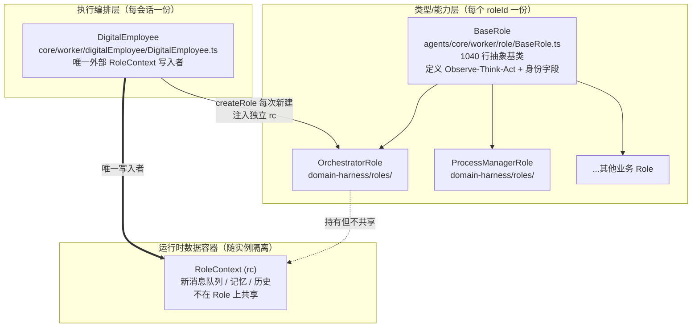
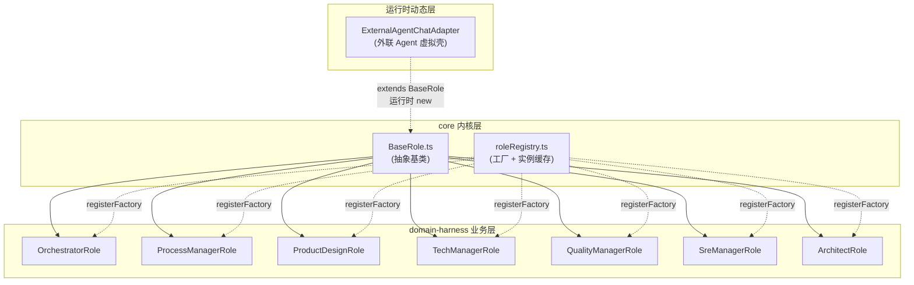
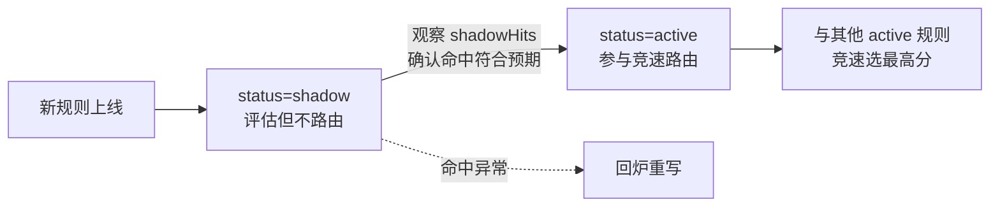

# 第 9 章 数字员工模型

> "让 AI 成为团队的一员，首先要给它一个身份、一个角色，和一份它能负责的事。"

数字员工（Digital Employee）是 WinMatrix 最核心的抽象。它不是一行配置，也不是一个 chatbot——它是一个有角色身份、有技能工具、有长期记忆、有外部凭证的"虚拟团队成员"。一个真实的数字员工可以持有自己的 Git 账号、登自己的企业微信 AI Bot、跑自己专属的编码工作站、把今天学到的东西沉淀成自己的长期记忆。

但数字员工也是全书最容易讲混的一个概念，因为它牵涉到三层容易被糊在一起的东西：**DigitalEmployee（执行编排层）/ BaseRole（能力定义层）/ RoleContext（运行时数据容器）**。本章会先把这三层彻底拆开，再依次看八大角色的实现、配置驱动与热重载、会话级独立实例的并发安全，最后讲智能路由 `route_rule` 和 FusionRouter 的双模式（active / shadow）。

## 9.1 三层分离：先把概念立住

很多 Agent 框架把"角色定义"和"运行时状态"揉在一个类里——角色 prompt 在这里、对话历史在这里、工具调用结果也在这里。这种写法在单会话原型里没问题，但一旦要做多会话、多员工并发，就会立刻撞墙：两个会话同时改一个单例 Role 的 `rc`（RoleContext），互相覆盖。

WinMatrix 的做法是**三层严格分离**：



这三层的职责边界：

| 层 | 代表类 | 职责 | 数量 |
|----|--------|------|------|
| **能力定义层** | `BaseRole` + 七大业务 Role | 定义角色"能做什么"——身份字段、Action 注册、Observe-Think-Act 循环 | 类型级，每个 roleId 一份 |
| **执行编排层** | `DigitalEmployee` | 编排一次执行：装配 prompt、管理 LLM binding、写 RoleContext、对接凭证 | 实例级，每个员工×会话一份 |
| **运行时数据容器** | `RoleContext`（`rc`） | 承载"这次对话"的状态——待处理消息、历史、记忆 | 实例级，随 Role 实例隔离 |

一个关键约束贯穿全书：**DigitalEmployee 是唯一有权写 RoleContext 的外部入口**。`BaseRole` 内部可以读写自己的 `rc`，但外部代码不能直接去戳 Role 的 `rc`——所有副作用都收敛到 DigitalEmployee 这一层。这是防止并发覆盖的第一道闸。

## 9.2 DigitalEmployee 持久化模型

数字员工的持久化定义在 `DigitalEmployee` Prisma 模型里：

```prisma
// prisma/schema.prisma（第 180 行起，节选关键字段）
/// 数字化员工（模型 A：与 Role 一一对应）
model DigitalEmployee {
  id                 String  @id
  employeeNo         String  @unique @map("employee_no")
  name               String
  department         String  @default("")
  position           String  @default("")
  email              String  @default("")
  platformAccount    String? @map("platform_account")
  roleId             String  @map("role_id")
  status             String  @default("active")
  createdAt          String  @map("created_at")
  updatedAt          String  @map("updated_at")
  avatarUrl          String? @map("avatar_url")
  tfsAccount         String? @map("tfs_account")
  tfsToken           String? @map("tfs_token")
  gitUserName        String? @map("git_user_name")
  gitPassword        String? @map("git_password")
  workstationConfig  Json?   @map("workstation_config")
  wecomAibotId       String? @map("wecom_aibot_id")
  wecomAibotSecret   String? @map("wecom_aibot_secret")
  promptOverride     Json?   @map("prompt_override")
  roleSupplementNote String? @map("role_supplement_note")

  @@index([roleId], map: "idx_digital_employee_role_id")
  @@index([status], map: "idx_digital_employee_status")
  @@map("digital_employee")
}
```

字段按用途分四组：

| 分组 | 字段 | 用途 |
|------|------|------|
| **身份** | `id`, `employeeNo`, `name`, `roleId`, `status` | 基本身份标识 |
| **凭证** | `tfsAccount/Token`, `gitUserName/Password`, `email`, `wecomAibotId/Secret` | 外部系统访问凭证（每个员工自己的账号） |
| **配置** | `workstationConfig`, `promptOverride`, `roleSupplementNote` | 运行时行为覆盖（不改代码即可定制） |
| **展示** | `avatarUrl`, `department`, `position` | UI 展示 |

两个 Json / 可空字段值得展开：

- **`promptOverride`**：结构化的提示词覆盖，经 Zod Schema 校验，允许在不改代码的前提下为某个员工定制人格、原则、记忆召回策略。它是"同角色多实例差异化"的主入口。
- **`roleSupplementNote`**：一段自由文本，会拼到决策/执行提示词里。可以理解为"给这个员工贴的便签"——比如"该项目的大福偏保守，倾向于先验证再推进"。

这种"配置驱动 + 运行时覆盖"的设计，让同一个 `orchestrator` Role 可以实例化出多个行为各异的"大福"，而不需要 fork 代码。

## 9.3 八大角色：六大业务 + 系统内核 + 动态外联

全书统一事实清单里有一条容易踩坑的早期口径——"七大角色"。真实情况是**八大角色**，第八类（`external-agent`）不是预定义类，而是运行时动态生成的。先把全貌列清楚：

| Role ID | 实现类 | 文件位置 | 中文昵称 | 职责 |
|---|---|---|---|---|
| `orchestrator` | `OrchestratorRole` | `agents/domain-harness/roles/OrchestratorRole.ts:28` | 大福 | 项目规划、WBS、任务分解 |
| `process_manager` | `ProcessManagerRole` | `agents/domain-harness/roles/ProcessManagerRole.ts:25` | 阿宁 | 进度跟踪、日会、周报、风险预警 |
| `product_design_manager` | `ProductDesignRole` | `agents/domain-harness/roles/ProductDesignRole.ts:27` | 小品 | 产品需求、PRD 编写 |
| `tech_manager` | `TechManagerRole` | `agents/domain-harness/roles/TechManagerRole.ts:28` | 阿码 | 技术架构、方案设计、代码评审 |
| `quality_manager` | `QualityManagerRole` | `agents/domain-harness/roles/QualityManagerRole.ts:28` | 小质 | 质量管理、测试计划 |
| `sre_manager` | `SreManagerRole` | `agents/domain-harness/roles/SreManagerRole.ts:26` | 大维 | 运维、部署、监控 |
| `architect` | `ArchitectRole` | `agents/domain-harness/roles/ArchitectRole.ts:26` | Architector | 系统内核层（决策引擎入口） |
| `external-agent` | `ExternalAgentChatAdapter` | 运行时动态创建 | — | 外联 Agent 的虚拟员工壳 |

这里有一个**目录双层结构**的事实必须记住（早期版本常把它讲错）：

- **Role 基类与注册表**在 `agents/core/worker/role/`（`BaseRole.ts`、`roleRegistry.ts`）——这是"内核"。
- **七个业务 Role 实现类**在 `agents/domain-harness/roles/`——这是"业务外壳"。
- **第八类 `external-agent`** 既不在 `domain-harness/roles/` 下，也没有静态注册——它在 `createDigitalEmployee()` 工厂里运行时按需生成。



### 六大可调度业务角色

六大业务角色构成一个完整的项目团队，分工覆盖软件研发全流程。每个角色的实现都是同一个模板（见 9.4 节），区别只在身份字段、专属 Action 和角色配置。

`DIGITAL_EMPLOYEE_TEAM` 常量在 `src/infrastructure/config/digitalEmployeeTeam.ts` 里定义了团队的元信息（id / name / nickname / isSystem）。注意区分三个字段：`id` 和 `name` 都是小写角色标识（如 `orchestrator`），`nickname` 才是中文昵称（如 `大福`）。`architect` 标记 `isSystem: true`，是系统内核角色，不参与普通用户任务调度。

### 任务类型守卫

并非所有任务都能分配给数字员工。`digitalEmployeeTeam.ts` 定义了任务类型守卫：

```typescript
// src/infrastructure/config/digitalEmployeeTeam.ts（第 42-57 行）
export type TaskTypeForAssign = 'rd' | 'design' | 'unclassified';

// 根据任务 ID 推断类型：T2/02 → design，T3/03 → rd
export function inferTaskTypeFromTaskId(taskId: string): TaskTypeForAssign {
  // ...
}

// 阻止 rd/design 任务分配给数字员工
export function isTaskTypeDisallowedForDigitalEmployee(taskType: TaskTypeForAssign): boolean {
  return taskType === 'rd' || taskType === 'design';
}
```

这个守卫的逻辑是：研发（`rd`）和设计（`design`）类任务需要人类的创造力和判断力，不允许直接分配给数字员工自动完成。数字员工可以做规划、做评审、做监控、做部署，但"写代码"和"做设计"这两个动作本身（在人类未授权前）由人类承担。这是企业落地时的合规护栏。

## 9.4 BaseRole：MetaGPT 式 Observe-Think-Act

七大业务 Role 都继承自 `BaseRole`——一个 1040 行的抽象基类，位于 `agents/core/worker/role/BaseRole.ts`。`BaseRole` 实现了 MetaGPT 式的 **Observe-Think-Act** 循环，其设计公式可以写成：

> **Role = LLM + Observation + Thinking + Action + Memory**

这个公式的含义是：一个 Role 不只是一段 prompt（LLM），它还封装了如何观察输入（Observation）、如何思考下一步（Thinking）、如何执行动作（Action）、以及如何记忆（Memory）。

### 身份字段与构造

```typescript
// src/agents/core/worker/role/BaseRole.ts（第 66-72 行）
export abstract class BaseRole {
  // 四个抽象身份字段——子类必须赋值
  abstract readonly name: string;        // 角色 ID，如 'orchestrator'
  abstract readonly profile: string;     // 角色定位，如 '项目总指挥'
  abstract readonly goal: string;        // 目标
  abstract readonly constraints: string; // 约束
```

构造函数接收一个 `RoleConfig`，核心是反应模式（`reactMode`）和 watch 列表：

```typescript
// BaseRole.ts（第 103-118 行，签名）
constructor(config?: RoleConfig)
```

`reactMode` 取自 `RoleReactMode` 枚举（如 `REACT`），决定 Role 如何响应——是收到消息就反应（REACT），还是按计划顺序执行（PLAN/THINK 等）。六大业务角色统一用 `REACT` 模式。

### Observe-Think-Act 三方法

这三个 protected 方法是 MetaGPT 循环的核心：

```typescript
// BaseRole.ts（第 293 行）
protected async observe(): Promise<Message[]>
```

`observe()` 从 `rc.getNews()` 取新消息并去重——这是 Observation 阶段，决定"有哪些我还没处理过的新输入"。

```typescript
// BaseRole.ts（第 340 行）
protected async think(): Promise<boolean>
```

`think()` 消费 `todoQueue`，通过 `getExecutionModeDecision` 决定执行模式，再驱动 `executeStep`。返回值表示"是否还有事要做"。这是 Thinking 阶段，LLM 或规则在这里决定下一步动作。

```typescript
// BaseRole.ts（第 406 行）
protected async act(): Promise<Message>
// 以及 queued action 入口（第 415 行）
async runQueuedAction(options): Promise<...>
```

`act()` 执行 queued action——可能是 LLMAction（调模型）、工具调用、或子流程编排。这是 Action 阶段。

### 与 TurnRunner 的对接：executeWithRuntimeKernel

```typescript
// BaseRole.ts（第 643 行）
async executeWithRuntimeKernel(input: {
  // ...
}): Promise<...>
```

这是 BaseRole 对接 Turn 执行引擎（第 11 章）的入口。第 673 行有一段关键校验：

```typescript
throw new Error(`${this.name}: executeWithRuntimeKernel 需要 ticket.decision.executionPlan
  （应由 TurnRunner 装配并 setExecutionTicket）`);
```

注意"应由 TurnRunner 装配"——这句话划清了职责：**决策计划（executionPlan）由 TurnRunner 装配，BaseRole 只负责按计划执行**。BaseRole 不自己决定要做什么，它消费上层装好的 ticket。这是单轨编排（见第 11 章）在 Role 层的体现。

### 配置热重载

```typescript
// BaseRole.ts（第 251-280 行）
protected onInitialized(): void {
  // ...
  this.configChangeUnsubscribe = configManager.onConfigChange((event) => {
    // 命中 affectedRoleIds 时 reloadFromConfig
    this.reloadFromConfig().catch((error) => { /* ... */ });
  });
}
```

`onInitialized()` 在子类构造末尾被调用，注册一个 `configManager.onConfigChange` 监听器。配置变更走 PG `pg_notify('config_change')`（见第 6 章），独立 `pg.Client` + 500ms 防抖 + Map 去重——注意这条路**不能走 PgBouncer transaction-pool**，因为 `LISTEN/NOTIFY` 是会话级的。

当配置变更命中本 Role 的 `affectedRoleIds` 时，触发 `reloadFromConfig()`（第 917 行）重新加载身份字段和 Action 配置。这就是"配置驱动 + 热重载"——改一行 `agent_config` 表里的数据，运行中的 Role 会在秒级（防抖窗口）内感知并应用，无需重启进程。

### initialize 与 initializeActions

```typescript
// BaseRole.ts（第 860 行）
async initialize(userPermissions?: string[]): Promise<void>
// 第 875 行
protected async initializeActions(userPermissions?: string[]): Promise<void>
```

`initialize` 是 Role 进入可用状态的前置步骤，会调用 `initializeActions` 注册该角色支持的 Action（如 `chat_only` LLMAction）。子类重写 `initializeActions` 来加自己的专属 Action，并通过 `await super.initializeActions(userPermissions)` 保留基类行为。

## 9.5 业务 Role 实现：以阿码为例

六大业务 Role 的实现高度同构。以"阿码"（`tech_manager`）为例，看一个 Role 类的完整构造：

```typescript
// src/agents/domain-harness/roles/TechManagerRole.ts（第 28-49 行，节选）
export class TechManagerRole extends BaseRole {
  readonly name: string;
  readonly profile: string;
  readonly goal: string;
  readonly constraints: string;
  readonly nickname: string;

  constructor() {
    // reactMode 通过 super 传入，而非字段赋值
    super({ reactMode: RoleReactMode.REACT, watch: [] });

    // 从配置管理器动态加载，带 fallback 默认值
    const agentConfig = this.loadConfigFromManager('tech_manager');
    this.name = 'tech_manager';
    this.profile = agentConfig?.role || '研发技术管理者';
    this.goal = agentConfig?.description || '制定工程化标准，守护代码质量...';
    this.constraints = agentConfig?.focus || '简单优先、成熟稳定...';
    this.nickname = agentConfig?.nickname || '阿码';

    this.onInitialized();
  }
```

这个模板的五个要点：

1. **身份字段在构造期赋值**，且全部走 `loadConfigFromManager(roleId)` 从 `agent_config` 表加载，**每项都有 fallback 默认值**。这意味着即使 DB 里没有配置，角色也能用默认人格跑起来；一旦配了 DB，构造期就会读到。
2. **`reactMode` 通过 `super` 传**，不是字段赋值——因为它属于构造配置（`RoleConfig`），不是运行时身份。
3. **`watch: []`**：六大业务 Role 都不 watch 其他 Role（不订阅别人的消息），它们是被调度执行的，不是事件驱动的观察者。
4. **末尾必须调 `this.onInitialized()`**：这一步注册配置热重载监听。漏了它，角色就失去热重载能力。
5. **`loadConfigFromManager`** 是 BaseRole 提供的辅助方法，封装了"从 configManager 读 agent_config + Zod 校验"的逻辑。

### 专属 Action 注册

```typescript
// TechManagerRole 风格（结构示意，与大福/阿宁同构）
protected async initializeActions(userPermissions?: string[]) {
  await super.initializeActions(userPermissions);

  // chat_only 动作，带角色提示词回退
  this.addAction(new LLMAction({
    type: 'chat_only',
    buildPrompt: (text) => resolveRoleSystemPrompt(this)
      ?? `你是${this.name}... 请用一两句话友好回复，不要调用任何工具`,
  }));

  // 角色专属思考动作（如阿宁的 ProcessManagerThinkAction）
  // this.addAction(new SomeRoleSpecificThinkAction());
}
```

每个 Role 至少注册一个 `chat_only` 的 LLMAction——这是角色能"开口说话"的基础。部分角色还会注册专属 ThinkAction，承载角色特有的分析逻辑（如阿宁的进度分析、风险识别）。

### agent_config 模型

Role 身份的"真源"是 `agent_config` 表：

```prisma
// prisma/schema.prisma（第 1159-1181 行）
model agent_config {
  id            String  @id
  name_cn       String?
  name_en       String?
  nickname      String?
  emoji         String?
  description   String?  // → Role.goal
  role          String?  // → Role.profile
  focus         String?  // → Role.constraints
  projectId     String?  // null=平台 Role；非 null=项目空间 Role
  workstation   String?
  workstation_config_version String?
  version       Int      @default(1)
  @@map("agent_config")
}
```

注意 `projectId` 字段——它区分了"平台 Role"（`projectId=null`，全平台共享的人格定义）和"项目空间 Role"（`projectId` 非空，特定项目内的角色变体）。这是"一 Role 对多 DigitalEmployee"的扩展：同一个 `orchestrator` 在不同项目里可以有不同的人格（A 项目的大福偏激进，B 项目的大福偏保守）。

对应的 TypeScript 接口在 `types/config.ts`：

```typescript
// src/types/config.ts（第 164-187 行）
export interface AgentConfig {
  nickname: string;
  emoji: string;
  personality: string[];
  principles: AgentPrinciple[];
  workstation: AgentWorkstationConfig;
  memory: AgentMemoryRecallConfig;  // 记忆召回配置，见第 12 章
  // ...
}
```

`memory` 字段尤其重要——它让每个角色可以有不同的记忆召回策略（recallLimit、召回阈值），这会直接喂给第 12 章的三区检索。

## 9.6 RoleRegistry：工厂注册与会话级独立实例

`RoleRegistry`（`agents/core/worker/role/roleRegistry.ts`）是 Role 的注册表单例，提供插件式注册 + 工厂 + 实例缓存。

### 工厂注册

七大 Role 在启动阶段通过工厂注册到 `roleRegistry`：

```typescript
// src/startup/agents.ts（第 126-133 行）
roleRegistry.registerFactory('architect', () => new ArchitectRole());
roleRegistry.registerFactory('orchestrator', () => new OrchestratorRole());
roleRegistry.registerFactory('process_manager', () => new ProcessManagerRole());
roleRegistry.registerFactory('product_design_manager', () => new ProductDesignRole());
roleRegistry.registerFactory('tech_manager', () => new TechManagerRole());
roleRegistry.registerFactory('sre_manager', () => new SreManagerRole());
roleRegistry.registerFactory('quality_manager', () => new QualityManagerRole());
Architector.initialize();
```

注意三件事：

1. **工厂模式 = 延迟创建**：这里注册的是工厂函数 `() => new XxxRole()`，不是实例。Role 实例只在第一次被请求时才真正创建，避免启动时实例化所有角色。
2. **`architect` 也在其中**：ArchitectRole 是一个普通 Role 类，但它对应的单例 `Architector`（决策引擎入口，见第 10 章）在末尾单独 `initialize()`——这是"类型（Role）"和"运行时单例（Architector）"的分离。
3. **第八类 `external-agent` 不在这里**：它没有静态工厂，运行时按需生成。

### createRole vs getRole：并发安全的关键

RoleRegistry 提供两个创建方法，区别是**是否缓存**：

```typescript
// src/agents/core/worker/role/roleRegistry.ts（第 178 行）
async createRole(roleId): Promise<Role | null>
// 每次创建新实例，不缓存

// 第 197 行
async getRole(roleId): Promise<Role | null>
// 带缓存懒加载，复用同一实例
```

这两个方法的存在不是冗余，而是为了应对两种完全不同的场景：

| 方法 | 缓存策略 | 适用场景 | 并发风险 |
|------|---------|---------|---------|
| `createRole` | **每次新建，不缓存** | 数字员工会话级实例 | 无（实例隔离） |
| `getRole` | 缓存懒加载 | 单例场景（如内核任务） | 高（共享 rc） |

数字员工的工厂 `createDigitalEmployee()` 明确用 `createRole`，**每次都创建新实例**：

```typescript
// src/agents/core/worker/digitalEmployee/DigitalEmployee.ts（第 410-436 行）
const role = await roleRegistry.createRole(record.role_id);
if (!role) {
  throw new Error(`[createDigitalEmployee] 未找到对应 Role: ${record.role_id}（数字员工: ${digitalEmployeeId}）`);
}
// prompt override 注入
const promptOverrideService = container.resolve<{ getPromptContext(id): Promise<{...}> }>('PromptOverrideService');
const promptContext = await promptOverrideService.getPromptContext(digitalEmployeeId);
if (promptContext) {
  record.role_supplement_note = promptContext.roleSupplementNote ?? null;
  record.prompt_override = promptContext.promptOverride ?? null;
}
return new DigitalEmployee(record, role);
```

这里的设计决策值得展开：**为什么数字员工必须每次新建 Role 实例，而不是复用单例？**

答案在 `BaseRole` 持有的 `rc`（RoleContext）。RoleContext 承载"这次对话"的状态——待处理消息队列、历史、记忆。如果两个会话共享同一个 Role 单例，它们会共享同一个 `rc`：会话 A 的消息可能被会话 B 的 `observe()` 读到，会话 B 的工具结果会污染会话 A 的历史。这就是单例并发覆盖。

通过 `createRole` 每会话新建实例，每个数字员工会话拿到一个独立的 `rc`，互不干扰。这是一个看似"浪费"（每个会话都 new 一个 Role）但**必须**的设计——在 Agent 系统里，运行时状态的隔离是不可妥协的。

### 工厂文件头的设计注释

DigitalEmployee.ts 文件头有一段点睛注释：

```typescript
// DigitalEmployee.ts（第 13 行附近）
// 每个会话通过 createDigitalEmployee() 得到一个全新的实例，避免 BaseRole
// 的 RoleContext 在并发会话间互相覆盖。
```

这是把"为什么这么设计"写进了源码——一个好的设计决策，值得在它被看到的地方说明理由。

## 9.7 第八类角色：external-agent 动态生成

第八类角色 `external-agent` 是全书最容易被讲漏的一类，因为它没有静态类、没有工厂注册、不在 `domain-harness/roles/` 下。它是**运行时按需动态生成**的。

### createDigitalEmployee 的分叉

`createDigitalEmployee()` 工厂内部有一个早期分叉——检测这是不是一个外联 Agent：

```typescript
// src/agents/core/worker/digitalEmployee/DigitalEmployee.ts（第 370-401 行）
export async function createDigitalEmployee(digitalEmployeeId: string): Promise<DigitalEmployee> {
  // ── 外联 Agent 分支：构造虚拟 DigitalEmployeeRecord + ExternalAgentChatAdapter ──
  if (isExternalAgent(digitalEmployeeId)) {
    const externalAgent = await loadExternalAgent(digitalEmployeeId);
    if (!externalAgent.connected) {
      throw new Error(`[createDigitalEmployee] 外部 Agent 未连接: ${digitalEmployeeId}`);
    }
    // 构造一个合成的 DigitalEmployeeRecord
    const syntheticRecord: DigitalEmployeeRecord = {
      // ...
      role_id: 'external-agent',   // 第八类角色 ID
      // ...
    };
    // 动态 import 并 new ExternalAgentChatAdapter
    const { ExternalAgentChatAdapter } = await import(
      '@/agents/core/worker/digitalEmployee/ExternalAgentChatAdapter.js'
    );
    const role = new ExternalAgentChatAdapter(rawAgentId, agentName, agentType);
    return new DigitalEmployee(syntheticRecord, role);
  }

  // ── 常规数字员工分支 ──
  // ...
}
```

外联 Agent 的本质（见第 28 章）：它是一个虚拟数字员工，`id` 加 `ext_` 前缀，`roleId='external-agent'`。它不跑 WinMatrix 内部的 Role 类，而是通过 `ExternalAgentChatAdapter` 把消息转发给外部接入的 Agent（如第三方 LLM、外部 MCP server、另一个 WinMatrix 实例）。

### 为什么动态生成而不是静态注册

- **数量不可预知**：外联 Agent 是用户/管理员运行时接入的，可能有几十上百个，不可能为每个静态注册一个工厂。
- **身份随接入变化**：每个外联 Agent 的 `agentType`、`agentName` 都不同，必须在创建时按参数构造。
- **懒加载**：`await import(...)` 让 `ExternalAgentChatAdapter` 模块只在第一次真正用到时才加载，减少冷启动开销。

这是一个"开放世界假设"的设计——内联的七大角色是封闭集合（编译期已知），外联 Agent 是开放集合（运行时可扩展）。两类用两套机制处理，而不是强行统一。

## 9.8 EmployeeService：应用服务层的副作用编排

`EmployeeService`（`src/business/domain/digitalEmployee/EmployeeService.ts`）是数字员工的应用服务，编排 CRUD、状态聚合和副作用。它不是简单的数据库 CRUD wrapper——创建/更新一个员工会触发一系列跨域副作用。

### 创建员工的副作用链

创建一个数字员工至少包含这些步骤（按文件头注释与设计要点还原）：

```text
// src/business/domain/digitalEmployee/EmployeeService.ts（文件头第 1-10 行注释）
/**
 * 数字员工应用服务
 *
 * 职责：
 * - 创建（含系统用户同步 + 企微事件发布）
 * - 更新（缓存失效 + 企微配置变更检测）
 * - 数据聚合（工作站状态、可服务项目）
 */

// createEmployee 的副作用链（按职责注释还原）：
// 1. 检查 employeeNo 全局可用性
// 2. 创建数字员工记录（DB insert）
// 3. 同步系统用户（ensureUserForDigitalEmployee）—— 给员工创建登录账号
// 4. 发布企微 AI Bot 配置变更事件（publishWeComAiBotConfigChanged）
//    —— 如果配了 wecomAibotId，通知企微长连接层重新注册
// 5. 失效缓存（entity:de scope）—— 见第 4 章双层缓存
```

这些副作用不是可选的：

- **系统用户同步**：数字员工要有自己的系统账号，才能在权限矩阵里被授权、在审计日志里被追溯。一个没有系统账号的"员工"是无法被治理的。
- **企微事件发布**：企微 AI Bot 是双轨接入的（长连接 + Webhook，见第 27 章），配置变更必须通知长连接层重新注册，否则新员工的 Bot 收不到消息。
- **缓存失效**：`entity:de` scope 的缓存（30 分钟 TTL，见第 4 章）必须主动失效，否则其他进程会读到旧的员工列表。

### 更新员工的配置变更检测

更新操作的复杂性在于"检测什么变了"——按职责注释，updateEmployee 的流程是：读取现有记录做 diff → 检测 `wecomAibotId` / `wecomAibotSecret` 是否变化 → 企微配置变化时发布变更事件（重新注册长连接）→ 更新数据库 → 失效缓存。

企微凭证变更是最需要小心的一种——`wecomAibotSecret` 改了，旧的 secret 就失效了，长连接必须用新 secret 重新握手。如果只更新 DB 不发事件，会出现"DB 里是新 secret、长连接还用旧 secret"的不一致，表现为 Bot 突然收不到消息且没有任何错误日志。

### 数据聚合

`EmployeeService` 还负责聚合运行时状态，供列表页展示：

```typescript
// src/business/domain/digitalEmployee/EmployeeService.ts
export interface EmployeeListItem {
  // ... DigitalEmployeeRecord 字段
  workstationStatus: CodingWorkstationListStatus;
    // 'running' | 'created' | 'scaled_down' | 'error' | null
  serviceableProjects: EmployeeProjectSummary[];
  runtimeState?: EmployeeActivityState;  // 运行时活动状态（是否在执行任务）
}
```

`workstationStatus` 聚合了编码工作站（见第 15 章）的实时状态，`runtimeState` 反映员工当前是否在执行任务。这些字段不在 `digital_employee` 表里，而是运行时从其他子系统聚合来的——这就是"应用服务"的职责：把分散在多个子系统的事实，聚合成一个对调用方友好的视图。

## 9.9 智能路由 route_rule 与 FusionRouter

数字员工的"由谁处理"不是写死的——它由智能路由决定。路由规则的真源是 `route_rule` 表，执行者是 `FusionRouter`（决策引擎 Stage 2，见第 10 章）。

### route_rule 模型

```prisma
// prisma/schema.prisma（第 2689-2730 行，节选）
model route_rule {
  name              String   @id           // 唯一规则名
  patterns          String[]               // 正则匹配（高权重）
  patternFlags      String[]               // 正则 flags
  positiveIntents   String[]               // 正向意图关键词
  negativeIntents   String[]               // 负向意图关键词
  semanticAnchors   String[]               // 语义锚点（用于 embedding）
  semanticThreshold Float    @default(0.85) // 命中阈值
  roleId            String                 // 命中后路由给哪个角色
  mode              String                 // 'direct' | 'skill'
  skillName         String?                // mode=skill 时的技能名
  declaredAction    String?
  producesDataKind  String?
  requiresDataKind  String?
  toolHint          String?
  status            String   @default("active")  // 'active' | 'shadow'
  source            String   @default("manual")
  priority          Int      @default(0)
  hitCount          Int      @default(0)
  lastHitAt         DateTime?
  @@map("route_rule")
}
```

几个字段值得注意：

- **多信号字段**：一条规则可以同时声明 `patterns`（正则）、`positiveIntents` / `negativeIntents`（意图关键词）、`semanticAnchors`（语义锚点）。FusionRouter 会综合这些信号算一个融合分数，而不是单点匹配。
- **`status: 'active' | 'shadow'`**：这是路由规则的"安全发布"开关，下一小节展开。
- **`hitCount` / `lastHitAt`**：规则命中次数和最后命中时间，用于运营观察规则是否生效。

### FusionRouter 的融合评分

```typescript
// src/agents/core/agent/decision/fusion-router.ts（第 116 行）
export class FusionRouter {
  // 第 165 行
  route(input: string): RouteResult | null {
    let bestRoute: RouteEntry | null = null;
    let bestScore = 0;
    let bestMethod: RouteResult['method'] = 'fusion';

    for (const route of this.routes) {
      const score = this.computeScore(route, input);
      if (score >= route.semanticThreshold) {
        // shadow 规则只记录不路由
        if (route.status === 'shadow') {
          this.bumpMetrics(route.id);
          this.shadowHits.push({ /* ... */ });
          continue;
        }
        if (score > bestScore) {
          bestScore = score;
          bestRoute = route;
          // 命中方法判定（第 194-200 行）
          const regexHit = route.patterns.some(p => p.test(input));
          if (regexHit) bestMethod = 'regex';
          else if (route.positiveIntents.some(w => input.includes(w))) bestMethod = 'fusion';
          else bestMethod = 'semantic';
        }
      }
    }
    if (bestRoute) {
      this.bumpMetrics(bestRoute.id);
      return { route: bestRoute, confidence: bestScore, method: bestMethod, source: bestRoute.source };
    }
    return null;
  }
}
```

融合评分的核心是 `computeScore`——它综合三类信号：

| 信号 | 权重 | 说明 |
|------|------|------|
| 正则匹配 (`patterns`) | +0.9 | 最强信号，字面命中 |
| 正向意图 (`positiveIntents`) | +0.2/词 | 弱正向 |
| 负向意图 (`negativeIntents`) | -0.8/词 | 强负向（如"取消"、"不要"） |
| 语义相似度 (`semanticAnchors`) | ×0.6 | embedding 余弦相似度 |

最终分数 `>= route.semanticThreshold`（默认 0.85）才视为命中。多条规则都命中时，**最高分获胜**。

`bestMethod` 的判定顺序（regex → fusion → semantic）记录了"这条规则是被哪种信号命中的"，用于运营诊断——如果一条规则只靠 semantic 命中，说明它的 patterns 和 intents 写得不够好，可能误召。

### active 竞速 vs shadow A/B 验证

`status` 字段是 FusionRouter 最精巧的设计：

- **`active`**：规则参与竞速。所有 active 规则一起算分，最高分获胜，实际路由生效。
- **`shadow`**：规则只记录不路由。它会被评估分数、记录到 `shadowHits`，但不影响实际路由结果。

shadow 模式是路由规则的"灰度发布"。一条新规则上线前，先标成 shadow——它会被评估（让你看到"如果启用会命中多少次、命中哪些消息"），但不影响生产路由。观察一段时间确认无误后，再把 `status` 改成 `active`。这是把"路由规则变更"这种高风险操作，从"改完就生效"变成"先观察再生效"的安全网。



## 本章小结

本章深入分析了 WinMatrix 的数字员工模型，核心是建立三层分离的心智模型：

1. **三层分离**：DigitalEmployee（执行编排层，唯一 RoleContext 写入者）/ BaseRole（能力定义层，1040 行抽象基类）/ RoleContext（运行时数据容器，随实例隔离）。这是防止并发覆盖的根本设计。
2. **八大角色**：六大业务 Role（大福/阿宁/小品/阿码/小质/大维，在 `domain-harness/roles/`）+ 系统内核 Architector + 第八类 `external-agent`（运行时由 `createDigitalEmployee` 动态生成，非静态注册）。早期口径"七大角色"需修正。
3. **MetaGPT 式 Role**：`Role = LLM + Observation + Thinking + Action + Memory`，Observe-Think-Act 三方法（BaseRole.ts L293/340/406）是循环骨架。
4. **配置驱动 + 热重载**：身份从 `agent_config` 表加载，`onConfigChange` 监听 `pg_notify('config_change')` 命中 affectedRoleIds 时 `reloadFromConfig`（不能走 PgBouncer transaction-pool）。
5. **会话级独立实例**：`createRole` 每次新建不缓存，规避单例并发覆盖——这是 Agent 系统运行时状态隔离的硬约束。
6. **一 Role 多 Employee**：`agent_config.projectId` 区分平台 Role 与项目空间 Role，同一 roleId 可在不同项目有不同人格变体。
7. **external-agent 动态生成**：外联 Agent 是虚拟员工（`ext_` 前缀 + `roleId='external-agent'`），由 `ExternalAgentChatAdapter` 转发到外部 Agent，不在静态工厂里。
8. **FusionRouter 双模式**：active 竞速选最佳（regex/fusion/semantic 三种命中方法）；shadow 只记录指标，用于路由规则灰度发布（A/B 验证）。
9. **任务类型守卫**：`rd`/`design` 类任务不可直接分配给数字员工，是企业合规护栏。
10. **EmployeeService 副作用编排**：创建/更新触发系统用户同步、企微事件发布、缓存失效——一个"员工"的变更牵动多个子系统。

在下一章中，我们将深入渐进式决策引擎——系统如何用一条 5 阶段管线，从精确匹配到 LLM 规划，决定"由谁、用什么方式、执行什么"。
