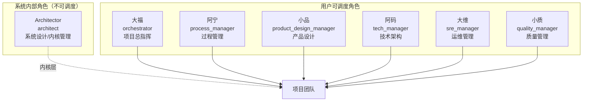
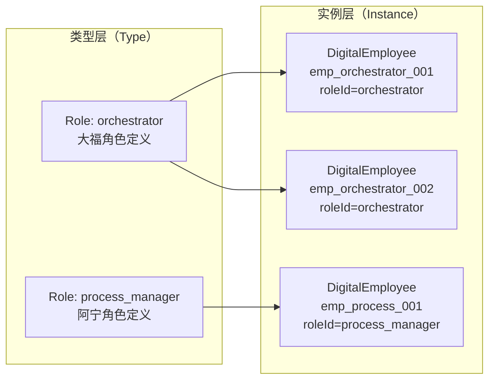

# 第 9 章 数字员工模型

> "让 AI 成为团队的一员，首先要给它一个身份。"

数字员工（Digital Employee）是 WinMatrix 的核心抽象。它不是一个简单的配置项，而是一个拥有角色、技能、工具绑定、记忆和身份凭证的"虚拟团队成员"。本章将从数据模型、角色定义和应用服务三个层面，深入剖析数字员工的实现。

## 9.1 DigitalEmployee 实体

数字员工的持久化定义在 `DigitalEmployee` Prisma 模型中：

```prisma
// prisma/schema.prisma（第 179-218 行）
/// 数字化员工（模型 A：与 Role 一一对应）
model DigitalEmployee {
  id                 String  @id
  employeeNo         String  @unique @map("employee_no")
  name               String
  department         String  @default("")
  position           String  @default("")
  email              String  @default("")
  platformAccount    String? @map("platform_account")
  roleId             String  @map("role_id")
  status             String  @default("active")
  createdAt          String  @map("created_at")
  updatedAt          String  @map("updated_at")
  avatarUrl          String? @map("avatar_url")
  tfsAccount         String? @map("tfs_account")
  tfsToken           String? @map("tfs_token")
  gitUserName        String? @map("git_user_name")
  gitPassword        String? @map("git_password")
  workstationConfig  Json?   @map("workstation_config")
  wecomAibotId       String? @map("wecom_aibot_id")
  wecomAibotSecret   String? @map("wecom_aibot_secret")
  promptOverride     Json?   @map("prompt_override")
  roleSupplementNote String? @map("role_supplement_note")

  @@index([roleId], map: "idx_digital_employee_role_id")
  @@index([status], map: "idx_digital_employee_status")
  @@map("digital_employee")
}
```

字段可以分为四组：

| 分组 | 字段 | 用途 |
|------|------|------|
| **身份** | `id`, `employeeNo`, `name`, `roleId`, `status` | 基本身份标识 |
| **凭证** | `tfsAccount/Token`, `gitUserName/Password`, `email`, `wecomAibotId/Secret` | 外部系统访问凭证 |
| **配置** | `workstationConfig`, `promptOverride`, `roleSupplementNote` | 运行时行为覆盖 |
| **展示** | `avatarUrl`, `department`, `position` | UI 展示 |

### Record 类型

Domain 层定义了对应的 Record 类型（与数据库行一一对应）：

```typescript
// src/business/domain/digitalEmployee/IDigitalEmployeeRepository.ts
export interface DigitalEmployeeRecord {
  id: string;                    // 如 "emp_orchestrator_xxx"
  employee_no: string;           // 全局唯一
  name: string;                  // 如 "大福"
  department: string;
  position: string;
  email: string;
  email_password: string;        // 敏感字段
  platform_account: string;
  role_id: string;               // 如 "orchestrator"
  avatar_url: string;            // Base64 data URI
  tfs_account: string;
  tfs_token: string;
  git_user_name: string;
  git_password: string;
  workstation_config: unknown;   // 覆盖配置
  role_supplement_note: string;  // 参与决策/执行提示词
  prompt_override: unknown;      // JSONB，Zod 校验
  wecom_aibot_id: string;
  wecom_aibot_secret: string;
  status: string;                // 如 'active'
  created_at: string;
  updated_at: string;
}
```

注意 `role_supplement_note` 和 `prompt_override` 的设计——它们允许在不修改代码的情况下，为特定数字员工定制行为。`prompt_override` 经过 Zod Schema 校验，保证结构正确。

## 9.2 七大内置角色

WinMatrix 预定义了 7 个数字员工角色，构成一个完整的"项目团队"：

```typescript
// src/infrastructure/config/digitalEmployeeTeam.ts（第 16-24 行）
export const DIGITAL_EMPLOYEE_TEAM: readonly DigitalEmployeeTeamMember[] = [
  { id: 'architect',                name: 'Architector', nickname: 'Architector', isSystem: true },
  { id: 'orchestrator',             name: '大福',         nickname: '大福' },
  { id: 'process_manager',          name: '阿宁',         nickname: '阿宁' },
  { id: 'product_design_manager',   name: '小品',         nickname: '小品' },
  { id: 'tech_manager',             name: '阿码',         nickname: '阿码' },
  { id: 'sre_manager',              name: '大维',         nickname: '大维' },
  { id: 'quality_manager',          name: '小质',         nickname: '小质' },
];
```



### 角色职责划分

每个角色都有明确的职责边界：

| 角色 | ID | 职责 |
|------|-----|------|
| **大福** | `orchestrator` | 项目规划、WBS 编制、任务分解和分配 |
| **阿宁** | `process_manager` | 进度跟踪、日会管理、周报生成、风险预警 |
| **小品** | `product_design_manager` | 产品需求、PRD 编写 |
| **阿码** | `tech_manager` | 技术架构、方案设计、代码评审 |
| **大维** | `sre_manager` | 运维管理、部署、监控 |
| **小质** | `quality_manager` | 质量管理、测试计划 |
| **Architector** | `architect` | 系统设计（内核层，不参与用户任务调度） |

注意 `architect` 角色标记了 `isSystem: true`——它是系统内部角色，不参与用户的任务调度，而是承担内核管理和系统设计职责。

### 任务类型守卫

并非所有任务都能分配给数字员工。`digitalEmployeeTeam.ts` 定义了任务类型守卫：

```typescript
// src/infrastructure/config/digitalEmployeeTeam.ts（第 42-57 行）
export type TaskTypeForAssign = 'rd' | 'design' | 'unclassified';

// 根据任务 ID 推断类型：T2/02 → design，T3/03 → rd
export function inferTaskTypeFromTaskId(taskId: string): TaskTypeForAssign {
  // ...
}

// 阻止 rd/design 任务分配给数字员工
export function isTaskTypeDisallowedForDigitalEmployee(taskType: TaskTypeForAssign): boolean {
  return taskType === 'rd' || taskType === 'design';
}
```

这个守卫确保研发和设计类任务不会被错误地分配给数字员工——这些任务需要人类的创造力和判断力。

## 9.3 Role 类的实现

每个角色对应一个 `Role` 类，继承自 `BaseRole`。以"大福"为例：

```typescript
// src/agents/domain-harness/roles/OrchestratorRole.ts（第 1-49 行）
/**
 * 大福角色 (OrchestratorRole) — 项目总指挥，
 * 负责项目规划、WBS编制、任务分解和分配
 */

const ORCHESTRATOR_ROLE_ID = 'orchestrator';

/**
 * 大福角色
 * - 项目规划：制定项目整体计划和里程碑
 * - WBS编制：将项目分解为可执行的任务
 * - 任务分配：根据团队成员能力分配任务
 * - 进度监控：跟踪任务执行情况
 */
class OrchestratorRole extends BaseRole {
  constructor() {
    super(ORCHESTRATOR_ROLE_ID, loadOrchestratorConfig());
    this.profile = '项目总指挥';
    this.goal = '制定项目计划，分解任务，分配资源，确保项目顺利推进';
    this.constraints = '全局视野、系统思维、优先级明确、风险意识、协作优先';
    this.nickname = '大福';
    this.reactMode = RoleReactMode.REACT;
  }

  initializeActions() {
    // 格式化原则和个性
    const principles = this.formatPrinciples();
    const personality = this.formatPersonality();

    // 注册 chat_only LLMAction
    this.addAction(new LLMAction({
      type: 'chat_only',
      buildPrompt: (text: string) => `用户说：${text}`,
    }));
  }
}
```

每个 Role 类的核心组成：

1. **角色 ID**：`orchestrator`、`process_manager` 等，用于注册和查找
2. **配置加载**：`loadOrchestratorConfig()` 从配置管理器加载角色专属配置
3. **人格定义**：`profile`（角色定位）、`goal`（目标）、`constraints`（约束）、`nickname`（昵称）
4. **反应模式**：`RoleReactMode.REACT`，决定 Agent 如何响应
5. **动作注册**：`initializeActions()` 注册该角色支持的动作

### 阿宁的实现

```typescript
// src/agents/domain-harness/roles/ProcessManagerRole.ts（第 25-48 行）
/**
 * 阿宁角色
 * - 进度跟踪：基于 WBS 监控任务进度
 * - 日会管理：组织每日站会
 * - 周报生成：汇总周度进展
 * - 风险预警：识别并预警项目风险
 */
class ProcessManagerRole extends BaseRole {
  constructor() {
    super(PROCESS_MANAGER_ROLE_ID, loadConfigFromManager('process_manager'));
    this.profile = '项目过程管理者';
    this.goal = '监控项目健康，促进团队协作，确保项目按计划推进';
    this.constraints = '主动监控、及时预警、客观公正、建设性、沟通优先';
    this.nickname = '阿宁';
  }

  initializeActions() {
    // chat_only 动作，带角色提示词回退
    this.addAction(new LLMAction({
      type: 'chat_only',
      buildPrompt: (text) => resolveRoleSystemPrompt(this) 
        ?? `你是${this.name}... 请用一两句话友好回复，不要调用任何工具`,
    }));
    // 阿宁专属的思考动作
    this.addAction(new ProcessManagerThinkAction());
  }
}
```

阿宁除了通用的 `chat_only` 动作外，还注册了 `ProcessManagerThinkAction`——这是角色专属的思考逻辑，用于进度分析和风险识别。

### Role 工厂注册

在启动阶段，7 个角色通过工厂模式注册到 `roleRegistry`（见第 2 章）：

```typescript
// src/startup/agents.ts（第 121-131 行）
roleRegistry.registerFactory('architect', () => new ArchitectRole());
roleRegistry.registerFactory('orchestrator', () => new OrchestratorRole());
roleRegistry.registerFactory('process_manager', () => new ProcessManagerRole());
roleRegistry.registerFactory('product_design_manager', () => new ProductDesignRole());
roleRegistry.registerFactory('tech_manager', () => new TechManagerRole());
roleRegistry.registerFactory('sre_manager', () => new SreManagerRole());
roleRegistry.registerFactory('quality_manager', () => new QualityManagerRole());
Architector.initialize();
```

工厂模式的好处是**延迟创建**——角色实例只在第一次被请求时才创建，避免启动时实例化所有角色。

## 9.4 EmployeeService：应用服务层

`EmployeeService` 是数字员工的应用服务，编排 CRUD、状态聚合和副作用处理：

```typescript
// src/business/domain/digitalEmployee/EmployeeService.ts（第 1-10 行）
/**
 * 数字员工应用服务
 *
 * 职责：
 * - 创建（含系统用户同步 + 企微事件发布）
 * - 更新（缓存失效 + 企微配置变更检测）
 * - 数据聚合（工作站状态、可服务项目）
 */
```

### 创建员工的副作用编排

创建一个数字员工不仅仅是数据库插入——它触发一系列副作用：

```typescript
// src/business/domain/digitalEmployee/EmployeeService.ts（概念性）
async createEmployee(params: CreateEmployeeParams): Promise<DomainResult<DigitalEmployeeRecord>> {
  // 1. 检查 employeeNo 可用性
  // 2. 创建数字员工记录
  // 3. 同步系统用户（ensureUserForDigitalEmployee）
  // 4. 发布企微 AI Bot 配置变更事件（publishWeComAiBotConfigChanged）
  // 5. 失效缓存
}
```

这些副作用包括：

- **系统用户同步**：为数字员工创建对应的系统用户账号
- **企微事件发布**：如果配置了企微 AI Bot，发布配置变更事件
- **缓存失效**：清除 `entity:de` scope 的缓存

### 更新员工的配置变更检测

更新操作需要检测企微配置是否变化：

```typescript
// 概念性
async updateEmployee(id: string, params: UpdateEmployeeParams) {
  // 1. 读取现有记录
  // 2. 检测 wecomAibotId/Secret 是否变化
  // 3. 如果变化，发布企微配置变更事件
  // 4. 更新数据库
  // 5. 失效缓存
}
```

### 数据聚合

`EmployeeService` 还负责聚合运行时状态：

```typescript
// src/business/domain/digitalEmployee/EmployeeService.ts
export interface EmployeeListItem {
  // ... DigitalEmployeeRecord 字段
  workstationStatus: CodingWorkstationListStatus;  // 'running' | 'created' | 'scaled_down' | 'error' | null
  serviceableProjects: EmployeeProjectSummary[];
  runtimeState?: EmployeeActivityState;  // 运行时活动状态
}
```

`workstationStatus` 聚合了编码工作站的实时状态，`runtimeState` 反映了员工的当前活动（是否在执行任务）。

## 9.5 数字员工与 Role 的关系

WinMatrix 中"数字员工"和"角色"是两个相关但不同的概念：



- **Role** 是类型定义——描述一类角色的能力、技能、工具、人格
- **DigitalEmployee** 是实例——一个具体的"员工"，关联到某个 Role

同一个 Role 可以有多个 DigitalEmployee 实例（例如多个"大福"实例服务不同项目）。这种"类型-实例"分离的设计使得：

1. **角色定义集中管理**：修改 Role 配置影响所有关联的员工
2. **实例独立配置**：每个员工可以有独立的凭证、提示词覆盖、工作站配置
3. **灵活扩展**：可以创建外部 Agent 类型的员工（`external-agent` roleId）

## 本章小结

本章深入分析了 WinMatrix 的数字员工模型：

1. **DigitalEmployee 实体**：身份、凭证、配置、展示四组字段，支持 `prompt_override` 和 `workstationConfig` 运行时覆盖
2. **七大内置角色**：大福/阿宁/小品/阿码/大维/小质 + 系统内部 Architector，覆盖项目全流程
3. **Role 类实现**：继承 BaseRole，定义人格（profile/goal/constraints）和动作，使用 REACT 模式
4. **工厂注册**：7 个角色通过 `registerFactory` 延迟创建
5. **EmployeeService**：应用服务编排创建/更新的副作用（系统用户同步、企微事件、缓存失效）
6. **任务类型守卫**：rd/design 任务不可分配给数字员工
7. **类型-实例分离**：Role 是类型，DigitalEmployee 是实例，支持同角色多实例

在下一章中，我们将深入渐进式决策引擎，理解系统如何决定"由谁、用什么方式、执行什么"。
