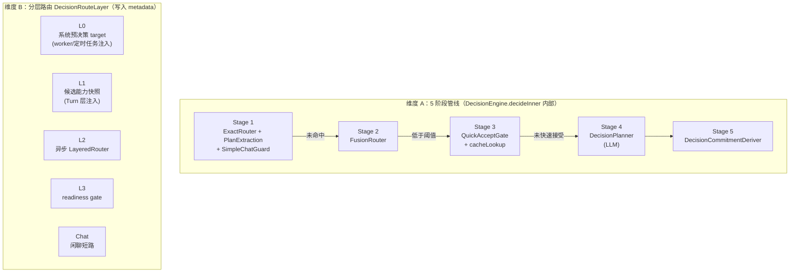
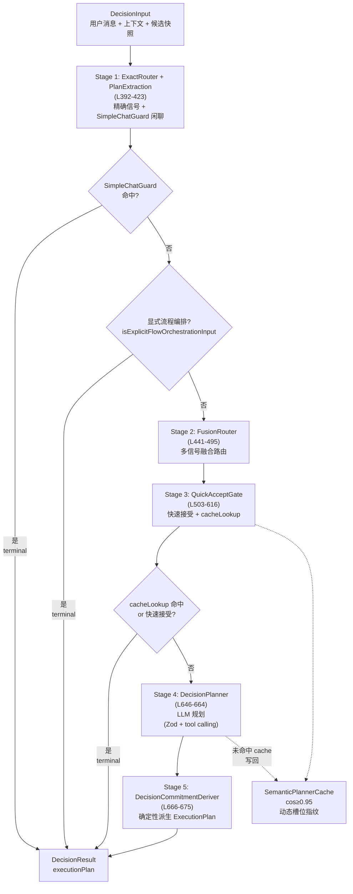
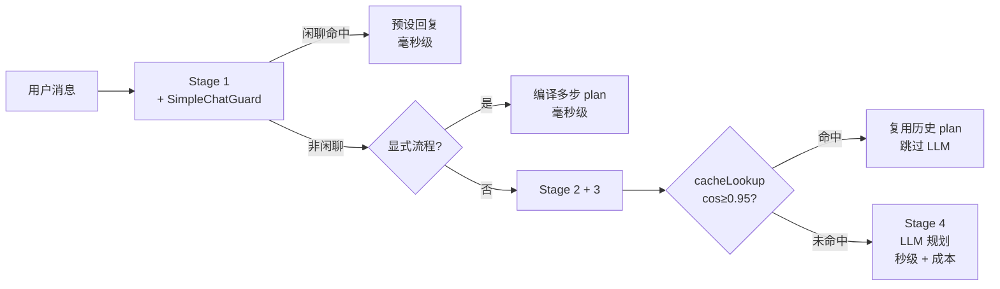

# 第 10 章 渐进式决策引擎

> "不是每个问题都需要调用 LLM，但每个问题都需要正确的答案——而且要在该快的场合够快、该深的场合够深。"

决策引擎是 WinMatrix 最核心的创新之一。当用户发一条消息进来，系统要回答三个问题：**由哪个数字员工处理？用什么方式执行？调用什么技能或工具？** 这个决策如果完全交给 LLM，既贵又慢；如果全用规则，又不够灵活。WinMatrix 的答案是**渐进式决策管线**——一条 5 阶段管线，从最便宜的精确匹配逐级走到最贵的 LLM 规划，每阶段都能"terminal 提前返回"。

但这一章有一个比管线本身更重要的认知前提，必须先讲清楚：**"5 阶段管线"和"L0/L1/L2/L3/Chat 分层路由"是两个完全不同的维度**，早期版本经常把它们混为一谈。本章会先把这两个维度立清楚，再逐阶段拆管线、看三层短路、讲语义缓存，最后看语义分诊门（SemanticTriageGate）。

## 10.1 两个维度：5 阶段管线 vs 分层路由

这是本章最容易踩坑的地方，先看一张对比图：



两个维度的本质区别：

| 维度 | 含义 | 何时发生 | 代码位置 |
|------|------|---------|---------|
| **5 阶段管线** | 一条请求在决策引擎内部经过的处理流水线 | 每次 `decide()` 调用 | `DecisionEngine.decideInner` |
| **分层路由 L0-L3** | 决策结果被分类成哪一层路由（写入 metadata 留痕） | 贯穿 Turn→决策→执行 | `DecisionRouteLayer` 类型 |

**L0/L1/L2/L3/Chat 不是"决策的第几阶段"，而是"这次决策走了哪条路径"的标签。** 例如 L0 表示"系统预先决定了 target（如定时任务指定要跑某个技能）"，L1 表示"用候选能力快照路由"，Chat 表示"判定为闲聊短路"。它们是结果分类，不是处理步骤。

本章主体讲维度 A（5 阶段管线），维度 B 会在相关处点出。

## 10.2 决策引擎的真源：DecisionEngine 与 Architector

CLAUDE.md 指向的 SSOT 全部成立，但有一个分工要讲清楚：

- **`DecisionEngine`**（`agents/core/agent/decision/DecisionEngine.ts`，1455 行）是**底层管线**，封装了 5 阶段流水线。它本身不是全局入口。
- **`Architector`**（`agents/core/agent/decision/architector/Architector.ts`）是**对外单例入口**，编排"上下文准备 → 调用 DecisionEngine → 输出决策"的完整流程。

外部代码要决策，调的是 `Architector.getInstance().decide(...)` 或 `decideRoute(...)`，不是直接 new DecisionEngine。Architector 是单例：

```typescript
// src/agents/core/agent/decision/architector/Architector.ts（第 103-161 行）
export class Architector {
  private static _instance: Architector | null = null;

  // 第 128 行：获取单例（须先 initialize）
  static getInstance(): Architector {
    if (!Architector._instance) {
      throw new Error('[Architector] 尚未初始化，请先调用 Architector.initialize()');
    }
    return Architector._instance;
  }

  // 第 139 行：初始化（幂等，重复调用返回已存在实例）
  static initialize(): Architector {
    if (Architector._instance) {
      return Architector._instance;
    }
    Architector._instance = new Architector(role);
    // ...
    return Architector._instance;
  }

  // 第 175 行：决策主入口（七步流程）
  async decide(context: UnifiedDecisionContext): Promise<DecisionOutput> { /* ... */ }

  // 第 240 行：便利方法，返回 executionPlan + output
  async decideRoute(context: UnifiedDecisionContext): Promise<{
    executionPlan: ExecutionPlan;
    output: DecisionOutput;
  }> { /* ... */ }
}
```

为什么是单例？因为决策引擎要持有的资源（路由表、语义缓存、PipelineHook）是进程级共享的，每次决策都重建会浪费且不一致。`initialize()` 在启动阶段（`startup/agents.ts` 末尾）被调用一次，之后整个进程共用一个实例。

> 注：第 9 章讲过 `Architector.initialize()` 在 `roleRegistry.registerFactory('architect', ...)` 之后调用。注意 `architect`（Role 类型，可实例化）和 `Architector`（决策引擎单例）是两个东西——前者是"能被当员工用的 ArchitectRole 实例"，后者是"决策编排器单例"。它们同名同源但职责不同。

### DecisionEngine 的字段装配

```typescript
// src/agents/core/agent/decision/DecisionEngine.ts（第 113-127 行）
export class DecisionEngine {
  private exactRouter = new ExactRouter();
  private simpleChatGuard = new SimpleChatGuard();
  private fusionRouterStage = new FusionRouterStage(
    new FusionRouter(routeRegistry.getRoutes())
  );
  private quickAcceptGate = new QuickAcceptGate();
  private decisionPlanner = new DecisionPlanner();
  private commitmentDeriver = new DecisionCommitmentDeriver();
  private hooks: PipelineHook[];
  private semanticPlannerCache?: SemanticPlannerCache;

  constructor(hooks: PipelineHook[], semanticPlannerCache?: SemanticPlannerCache) {
    this.hooks = hooks;
    this.semanticPlannerCache = semanticPlannerCache;
  }
}
```

六个阶段组件 + hooks + 可选语义缓存，全部在构造期装配。注意 `FusionRouter` 接收的是 `routeRegistry.getRoutes()` 的快照——路由规则的变更通过 TTL 刷新（见 10.5）来感知，而不是实时。

### PipelineHook：全链路观测

5 阶段管线的每一阶段进出都会触发 hooks：

```typescript
// src/agents/core/agent/decision/createDecisionPipeline.ts（第 29-58 行）
export function createDecisionPipeline(): DecisionPipeline {
  const auditHook = new AuditHook();             // 审计日志
  const stageTraceHook = new StageTraceHook();    // 阶段追踪（onStageStart/onStageEnd）
  const feedbackHook = new FeedbackHook();       // 决策反馈收集
  const progressHook = new ProgressHook();       // 进度推送（WebSocket）
  const capabilitySnapshotHook = new CapabilitySnapshotHook();  // 能力快照
  const decisionEventHook = new DecisionEventHook();            // 决策事件发布

  const hooks: PipelineHook[] = [
    auditHook, stageTraceHook, feedbackHook,
    progressHook, capabilitySnapshotHook, decisionEventHook,
  ];
  const engine = new DecisionEngine(hooks);
  return { engine, hooks, auditHook, stageTraceHook, /* ... */ };
}
```

| Hook | 职责 |
|------|------|
| `AuditHook` | 审计日志（合规留痕） |
| `StageTraceHook` | 每阶段进出的 stageTrace + elapsedMs（性能诊断） |
| `FeedbackHook` | 决策反馈收集（用户标注对错，反哺规则） |
| `ProgressHook` | 进度推送（WebSocket 实时反馈给前端） |
| `CapabilitySnapshotHook` | 候选能力快照（决策时看到了哪些技能/工具） |
| `DecisionEventHook` | 决策事件发布（解耦下游订阅者） |

每次 `invokePipelineHooks(this.hooks, 'DecisionEngine', 'onStageStart', 'QuickAcceptGate', draft)` 这样的调用，会让所有 hook 在对应时机收到回调。这是典型的"主题-观察者"模式——决策引擎不知道也不关心有几个 hook、它们做什么，只负责在阶段边界通知。

## 10.3 5 阶段管线总览

`DecisionEngine.decide()` 是公开入口（第 368 行），它转调 `decideInner()`（第 372 行），后者是 5 阶段管线的主体。先看总览：



总览图里有三个关键设计要记住：

1. **每阶段可 terminal 提前返回**：5 个阶段不是必须走完，任何一个判定"已经有答案"就可以直接 `finalize` 返回，不再走下游。这是"渐进式"的核心——越早出结果越便宜。
2. **三层短路**（在正式 Stage 之间/之内）：SimpleChatGuard 闲聊、显式流程编排、QuickAcceptGate cacheLookup。它们让大量"不需要 LLM"的请求在毫秒级解决。
3. **候选 → 计划 → 承诺分离**：Stage 1-2 产候选，Stage 3-4 产计划（plan patch），Stage 5 把概率性的计划派生为确定性的 ExecutionPlan。

### decideInner 的管线骨架

```typescript
// src/agents/core/agent/decision/DecisionEngine.ts（第 372-440 行，骨架）
private async decideInner(input: DecisionInput): Promise<DecisionResult> {
  let draft = this.emptyDraft(input, resolvedTurn);
  const extractedCandidates: ExtractedPlanCandidate[] = [];

  // ── Stage 1: ExactRouter + plan extraction ──
  await invokePipelineHooks(this.hooks, 'DecisionEngine', 'onStageStart',
    'ExactRouter+PlanExtraction', draft);   // L392
  const exactMatch = await this.exactRouter.routeAsync(input, resolvedTurn);
  const continuationCandidate = ExactRouter.extractContinuationCandidate(input, exactMatch);
  if (continuationCandidate) extractedCandidates.push(continuationCandidate);
  const { candidate: chatCandidate, abstainReason: simpleChatAbstain } =
    await this.simpleChatGuard.extract(input, exactMatch, resolvedTurn);

  // ── 显式流程编排短路（Stage 1 之后、Stage 2 之前）──
  const explicitFlowOutcome = this.tryExplicitFlowOrchestrationPlan(
    input, resolvedTurn, exactMatch, emptyCandidates, draft);   // L435
  if (explicitFlowOutcome?.terminal) {
    explicitFlowOutcome.plan.boundRoute = 'explicit_flow_orchestration';
    return this.finalize(explicitFlowOutcome);   // terminal 提前返回
  }

  // ── Stage 2: FusionRouter ──  L441
  // ── Stage 3: QuickAcceptGate（含 cacheLookup）──  L503
  // ── Stage 4: DecisionPlanner ──  L646
  // ── Stage 5: DecisionCommitmentDeriver ──  L666
}
```

注意 Stage 1 是"组合拳"——它同时跑 `ExactRouter`（精确信号）和 `SimpleChatGuard`（闲聊检测），还做 `extractContinuationCandidate`（提取续跑候选）。这三者并行无依赖，放一个阶段里。

## 10.4 三层短路

在进入逐阶段细节前，先把三层短路讲透——它们是决策引擎成本控制的灵魂。

### 短路 1：SimpleChatGuard（闲聊短路）

SimpleChatGuard（Stage 1 内）拦截"你好"、"谢谢"、"好的"、"了解了"这类简单问候/确认。命中后直接返回预设回复，不进后续管线。

价值在于**成本优化**——大量闲聊消息不需要走完整决策（更不需要调 LLM）。它用关键词/模式匹配，响应在毫秒级。一条 "谢谢" 的请求如果走到 DecisionPlanner，意味着至少一次 LLM 调用、几百毫秒延迟、几分钱成本——这在日均万级消息量下是显著浪费。

### 短路 2：显式流程编排检测（ExplicitFlowOrchestration）

```typescript
// src/agents/core/agent/decision/DecisionEngine.ts（第 68-69 行）
function isExplicitFlowOrchestrationInput(input: string): boolean {
  return /(?:流程编排|编排执行|按流程|执行流程|多步骤|先.+再.+(?:最后|然后|并))/u.test(input);
}
```

这个正则的细节值得品味：「先...再...」后面**必须跟「最后/然后/并」**才算显式编排。单说"先分析再做"不算（可能是普通复句），"先分析再做，最后总结"才算（明确的多步流程）。

为什么要这个短路？因为显式多步流程（如"先做需求分析，再做架构设计，最后写测试"）的语义非常明确——用户已经把步骤写出来了。此时再走 FusionRouter 评分、再让 LLM 推理"应该分几步"，是纯浪费。直接把这句话编译成一个多步 ExecutionPlan，比任何 LLM 规划都快也准。这就是 `tryExplicitFlowOrchestrationPlan` 的作用：识别出显式流程后，直接编译成 plan，`boundRoute = 'explicit_flow_orchestration'`，terminal 返回。

### 短路 3：QuickAcceptGate cacheLookup（语义 cache 预检）

第三层短路在 Stage 3 内部。QuickAcceptGate 在做"快速接受"判定时，会顺带做一次语义 cache 预检（`cacheLookup`）——如果用户的输入和历史某次输入语义高度相似（embedding 余弦 ≥ 0.95），且那次决策的输入指纹匹配，直接复用历史 LLM Planner 的输出，跳过 Stage 4 的 LLM 调用。

```typescript
// src/agents/core/agent/decision/DecisionEngine.ts（第 522 行附近）
cacheLookup: (params) =>
  this.lookupSemanticPlannerCache(params.userInput, input, exactMatch, skillReferenceCatalog),
```

这是最有价值的短路——它不仅省了规则匹配，还省了一次 LLM 调用（最贵的操作）。下一节详细讲。



三层短路的共同模式：**把"明显不需要 LLM 的请求"在调 LLM 之前拦下来**。这是渐进式管线的成本护城河。

## 10.5 Stage 1：ExactRouter + PlanExtraction

Stage 1 处理"确定性信号"——那些不需要概率推理、有明确答案的输入。

### ExactRouter 处理三类精确信号

```typescript
// src/agents/core/agent/decision/stages/ExactRouter.ts（第 75-80 行）
/**
 * 精确匹配路由器 —— 渐进式决策引擎第 2 阶段
 *
 * 消费精确信号（@mention 指令、terminal/constraints/residualText），
 * 产出 ExactMatch。
 */
```

三类信号：

1. **@mention 指令**：`@大福 帮我规划项目` → 精确路由到大福，不需要任何语义推理。
2. **/slash 命令**：`/daily-plan` → 精确执行对应技能，命令名就是技能名。
3. **精确技能/工具匹配**：引号短语、精确关键词（如 `"代码评审"`）。

### 语义 Gap 检查：避免歧义路由

ExactRouter 不仅做字面匹配，还支持语义匹配，并通过 Gap 检查避免歧义：

```typescript
// src/agents/core/agent/decision/stages/ExactRouter.ts（第 63-73 行）
// semanticGapOk —— 判别最高分与次高分是否拉开足够差距
// 当 best 被 boost（如 @mention 命中）而 second 未被 boost 时，
// 只要 second 与 best 的分差在 GAP 以内即可接受（允许 boosted 项略胜）
function semanticGapOk(best: SemanticSkillHit, second: SemanticSkillHit | undefined): boolean {
  if (!second) return true;
  if (
    best.boosted
    && !second.boosted
    && second.score - best.score <= EXACT_ROUTER_SEMANTIC_TOP2_MIN_GAP
  ) {
    return true;
  }
  return best.score - second.score >= EXACT_ROUTER_SEMANTIC_TOP2_MIN_GAP;
}
```

Gap 检查的逻辑：如果最高分和次高分差距太小，说明存在歧义（两个候选都可能对），不应贸然路由。但有一个例外——如果最高分项是被 @mention 等 boost 信号加持的（用户明确指了它），允许它略胜未被 boost 的次高分。这是"用户意图 > 算法歧义"的体现：用户说 @大福，那即使语义分接近，也信用户。

## 10.6 Stage 2：FusionRouter 多信号融合

Stage 2 是最具创新性的"多信号融合路由"。它综合正则、意图关键词、语义相似度做加权评分。FusionRouter 的细节已在第 9 章 9.9 节展开（融合评分公式、active/shadow 双模式、命中方法判定），这里补充它在管线里的位置和 RouteRegistry。

### RouteRegistry：DB 真源 + 30s TTL

路由规则的注册表以**数据库为唯一真源**：

```typescript
// src/agents/core/agent/decision/route-registry.ts（第 74-82 行）
export class RouteRegistry {
  private routes: RouteEntry[];
  private readonly TTL_REFRESH_MS = 30_000;   // 30 秒 TTL 刷新
  private onReloadCallback: RouteRegistryReloadCallback | null = null;
  private dbLoadFailed = false;               // DB 加载失败标记
  // ...
}
```

关键设计：

- **30 秒 TTL 刷新**（`TTL_REFRESH_MS`）：定期从数据库重新加载规则，支持运行时动态更新。改一条 `route_rule` 表记录，最迟 30 秒内全集群生效。
- **DB 失败降级**：`dbLoadFailed` 标记。DB 加载失败时**进入零规则模式，不回退 YAML**——这是一个有争议但合理的选择。回退 YAML 意味着用过时的本地缓存顶替，可能路由到已经废弃的技能；零规则模式则让所有请求落到下游 LLM 决策，至少不会路由错。**宁可不路由，也不用过时规则。**
- **reload 回调**：规则重载后通过 `onReloadCallback` 通知 FusionRouter 重建内部状态。

### PCRE → JS 正则标志转换

```typescript
// src/agents/core/agent/decision/route-registry.ts（第 20 行）
function sanitizePattern(raw: string, existingFlags: string): { pattern: string; flags: string }
```

`route_rule.patterns` 字段允许运营写 PCRE 风格的正则（如 `(?i)(演示提醒|今晚.*演示)`），但 JS 的 `RegExp` 不支持 `(?i)` 这种内联标志。`sanitizePattern` 负责剥离 PCRE 内联标志并转为 JS flags：

```
示例: (?i)(演示提醒|今晚.*演示)
  → pattern="(演示提醒|今晚.*演示)", flags="i"
注: `-`(关闭) 和 `x`(扩展) 无 JS 等价物，跳过
```

这是"运营友好 vs 语法兼容"的折中——运营写 PCRE 更顺手（很多正则工具默认 PCRE），但执行必须落到 JS RegExp。`sanitizePattern` 把这个鸿沟填平。

## 10.7 Stage 3：QuickAcceptGate

Stage 3 是"快速接受"门——它综合前两阶段的候选，判断能不能不开 LLM 就直接接受某个候选。

### evaluate 的三维输入

```typescript
// src/agents/core/agent/decision/DecisionEngine.ts（第 510 行附近）
const coverageEval = await this.quickAcceptGate.evaluate(
  {
    candidates: extractedCandidates,    // Stage 1 提取的候选
    userInput: input.userInput,
    draft,
    decisionInput: input,
    residualText: exactMatch.residualText,
  },
  {
    hasConversationHistory: Boolean(input.recentConversation?.length),
    complexCase: extractedCandidates.filter((c) => c.shape === 'pipeline_atom').length >= 2,
  },
  {
    validatePatch: (patch, catalog, decisionInput) =>
      this.decisionPlanner.validatePatch(patch, catalog, decisionInput),
    skillReferenceCatalog,
    cacheLookup: (params) =>
      this.lookupSemanticPlannerCache(params.userInput, input, exactMatch, skillReferenceCatalog),
  },
);
```

三个入参对象各司其职：

1. **候选 + 输入**：评估对象（哪些候选、用户说了什么）。
2. **上下文标志**：`hasConversationHistory`（有历史对话可能改变解读）、`complexCase`（≥2 个 pipeline_atom 候选，复杂场景）。
3. **能力注入**：`validatePatch`（用 DecisionPlanner 的校验逻辑确保接受的 plan 结构合法）、`cacheLookup`（语义 cache 预检）。

### 快速接受的判定

`coverageEval.result.decision` 给出"是否快速接受"的判定，附带 `acceptedBy`（被谁接受）、`reasonCode`（原因码）、`coverageScore`（覆盖度分数）。如果 `acceptedPlanPatch` 非空，意味着有了可执行的 plan patch，直接走 `finalizeAcceptedPlan`：

```typescript
// src/agents/core/agent/decision/DecisionEngine.ts（第 568 行附近）
if (coverageEval.result.acceptedPlanPatch && coverageEval.result.acceptedBy) {
  draft = this.applyPatch(
    draft,
    applySkillReferenceCatalogForReadyPath(draft, input, skillReferenceCatalog),
  );
  const acceptOutcome = finalizeAcceptedPlan(
    { draft, gateResult: coverageEval.result, /* ... */ },
    {
      validatePatch: (patch, catalog, decisionInput) =>
        this.decisionPlanner.validatePatch(patch, catalog, decisionInput),
      derivePlan: (nextDraft) => this.commitmentDeriver.derivePlan(nextDraft, {
        executableEmployeeIds: input.employeeProfiles.map((e) => e.id),
        /* ... */
      }),
    },
  );
  // terminal 返回
}
```

注意一个细节：快速接受路径里仍然调用了 `commitmentDeriver.derivePlan`——即使 plan patch 已定，仍要经过 Stage 5 的"确定性派生"，把概率性的 patch 转成无歧义的 ExecutionPlan。**commitment deriver 是所有路径的必经关卡**，不止 LLM 路径。

## 10.8 语义缓存：SemanticPlannerCache

语义缓存是 QuickAcceptGate cacheLookup 的底层支撑，也是整个决策引擎最精巧的组件之一。

### 核心常量

```typescript
// src/agents/core/agent/decision/SemanticPlannerCache.ts（第 57-59 行）
export const SEMANTIC_PLANNER_MIN_SIMILARITY = 0.95;     // 相似度阈值
export const SEMANTIC_PLANNER_ENTRY_TTL_MS = 3_600_000;   // 1 小时 TTL
export const SEMANTIC_PLANNER_MAX_ENTRIES = 500;          // 最多 500 条
```

```typescript
// src/agents/core/agent/decision/SemanticPlannerCache.ts（第 8-12 行，文件头注释）
/**
 * Planner 语义缓存：以用户输入的 embedding 做最近邻检索，
 * 相似度 ≥ 阈值则复用历史 Planner LLM 输出。
 * Redis 持久化 + 内存回退，按 scopeKey 隔离，含 TTL 和全局 FIFO 条目上限。
 */
```

设计要点：

- **cos ≥ 0.95**：很高的阈值。语义缓存复用的是 LLM 的决策输出，错一次代价大，所以宁可错过相似也不误用。
- **Redis 持久化 + 内存回退**：跨进程共享缓存（不同 API 实例都能复用），Redis 不可用时降级到进程内。
- **scopeKey 隔离**：不同项目/员工 scope 独立，避免跨项目误用。
- **FIFO 500 条 + 1 小时 TTL**：双重淘汰，既防内存膨胀也防陈旧。

### 动态槽位指纹：防跨任务误复用

语义缓存最容易踩的坑：两条消息文本高度相似，但指的是不同任务。典型场景——"修复 bug-123" vs "修复 bug-456"。embedding 算出来 cosine 可能 0.97（都讲"修复 bug"），但它们是完全不同的任务，复用 plan 就是灾难。

`fix-workstation-dynamic-task-isolation` 这个 commit 标记的设计就是为了解决这个问题：

```typescript
// src/agents/core/agent/decision/SemanticPlannerCache.ts（第 14-38 行）
export interface SemanticPlannerInputFingerprintSnapshot {
  slotHash: string;
  hasDynamicSlots: boolean;
  dynamicSlotSummary: Record<string, number>;
}

export interface SemanticPlannerCanonicalRouteResult {
  version: 'canonical-route-result-v1';
  patch: LlmRoutePatch;
  references: {
    selectedCandidateId: string;
    stepCandidateIds: string[];
    employeeIds: string[];
    skillNames: string[];
    skillTargetIds: string[];
    catalogFingerprint: string;
  };
  derivedPlanKind: string;
  createdAt: number;
  inputFingerprint?: SemanticPlannerInputFingerprintSnapshot;
  // fix-workstation-dynamic-task-isolation:
  // 当动态槽位（如需求编号/ticket 号）不同时，防止跨任务复用
}
```

机制是：缓存命中时，除了比对 embedding cosine，还要比对 `inputFingerprint`——如果两条消息的动态槽位（ticket 号、需求编号等）不同，即使文本相似也不复用。`dynamicSlotSummary` 记录了每个动态槽位的统计，用于快速判别。

这是一个用工程精度弥补概率模型的典型例子——embedding 是模糊匹配，但有些场景（任务隔离）必须精确。在模糊匹配之上叠加一层精确的指纹校验，两者结合才能安全复用。

## 10.9 Stage 4：DecisionPlanner（LLM 规划）

前三阶段都没命中时，Stage 4 调用 LLM 做复杂决策。这是整个管线中最复杂的组件——`DecisionPlanner.ts` 有 1094 行。

```typescript
// src/agents/core/agent/decision/stages/DecisionPlanner.ts（第 1-35 行，文件头）
/**
 * 决策规划器 —— DecisionEngine Stage 4 的核心 LLM 规划组件（~1090 行）
 *
 * 职责：
 * - Prompt 构建（system/user prompt，含 exactRouter 上下文、候选目录、技能快照）
 * - 结构化输出：Zod Schema + tool calling → LlmRoutePatch
 * - 多层验证：validateBlockedAudits / validateMentionReassignment / validateStepBindings
 * - 验证失败重试循环
 * - 回退填充：fillToolDirectFallbackForSteps（direct 步骤缺失 employeeId 时）
 * - 外部 Agent employee 清洗 + blockedAudit 注入
 */
```

### 结构化输出：Zod Schema + tool calling

DecisionPlanner 不让 LLM 自由生成文本，而是用 **tool calling + Zod Schema** 强制结构化：

1. **构建 prompt**：system prompt 含候选技能目录、角色信息；user prompt 含 exactRouter 上下文。
2. **调 LLM**：用 `runDecisionWithTools`，传入 `DECISION_PLANNER_TOOL_NAMES`，强制 LLM 用工具调用形式产出结构化结果。
3. **Zod 校验**：`LlmRoutePatchSchema.parse(result)` 验证结构合法。
4. **多层业务校验**：`validateBlockedAudits`（黑名单审计）、`validateMentionReassignment`（@mention 重指派合法性）、`validateStepBindings`（步骤绑定合法性）。

### 验证失败重试

LLM 输出可能不合法。DecisionPlanner 不直接放弃，而是构建重试提示词让 LLM 修正：

```typescript
// 验证失败时构建重试提示词
const retryPrompt = buildPlannerValidationRetryPrompt(
  failureKind,  // PlannerValidationFailureKind
  patch,
);
// 重新调用 LLM...
```

`failureKind` 让重试 prompt 能精准指出"哪里错了"（如"你把 @大福 重指派给了阿宁，但用户明确指定了大福"），而不是泛泛地说"再试一次"。这种带反馈的重试比盲目重试有效得多。

### 回退填充：fillToolDirectFallbackForSteps

`direct` 模式的步骤如果 LLM 没指定 `employeeId`，系统自动填充回退员工。这是"LLM 概率输出 + 规则兜底"的组合——LLM 决定大方向，规则填必需字段，确保最终 plan 一定可执行。

## 10.10 Stage 5：DecisionCommitmentDeriver

第五阶段把 LLM 的概率性输出（`LlmRoutePatch`）派生为确定性的 `ExecutionPlan`。

```typescript
// src/agents/core/agent/decision/stages/DecisionCommitmentDeriver.ts（571 行）
// 确定性派生 ExecutionPlan
```

这个阶段的价值在于**确定性**——LLM 可能输出"可能是大福或阿宁"这种概率选择（或多个候选 employee），CommitmentDeriver 根据规则和上下文做最终裁决，生成无歧义的执行计划。它也是所有路径的必经关卡：即使 QuickAcceptGate 接受了 plan，仍要走 `derivePlan` 才能产出最终 ExecutionPlan（见 10.7 节代码）。

"候选 → 计划 → 承诺"的三段式分离，让每一步的输入输出都清晰可审计：Stage 1-2 出候选（多选），Stage 3-4 出 plan patch（LLM 的建议），Stage 5 出 ExecutionPlan（确定性事实）。

## 10.11 分层路由 L0-L3（维度 B）

回到本章开头的维度 B。`DecisionRouteLayer` 是决策结果的分类标签：

```typescript
// src/agents/core/agent/decision/types.ts（第 77-99 行）
export type DecisionRouteLayer = 'L0' | 'L1' | 'L2' | 'L3' | 'Chat';

function isDecisionRouteLayer(v: unknown): v is DecisionRouteLayer {
  return v === 'L0' || v === 'L1' || v === 'L2' || v === 'L3' || v === 'Chat';
}

export function getDecisionRouteLayer(d: { metadata?: unknown }): DecisionRouteLayer | undefined {
  // 从 d.metadata.routeMetadata.routeLayer 读取并类型守卫
  // ...
}
```

每一层的含义：

| 层 | 含义 | 谁写入 |
|----|------|--------|
| **L0** | 系统预决策 target（worker/定时任务预先指定要跑什么） | worker、调度器 |
| **L1** | 候选能力快照（Turn 层注入的可用员工/技能） | TurnRunner |
| **L2** | 异步 LayeredRouter | LayeredRouter |
| **L3** | readiness gate（就绪检查） | SkillReadinessGate 等 |
| **Chat** | 闲聊短路 | SimpleChatGuard |

相关的字段：

```typescript
// src/agents/core/agent/decision/types.ts（第 200 行）
predecidedTargetId?: string;
// 系统预决策的 skill target；语义同 predecidedTargetId 但表示 skill 而非 direct。
// 与 predecidedTargetId 互斥；同时存在时优先 predecidedSkillTargetId。
```

`predecidedTargetId` / `predecidedSkillTargetId` 是 L0 的载体——当定时任务说"明天 9 点跑 daily-plan 技能"，它会把 `predecidedSkillTargetId = 'daily_plan'` 注入决策输入，决策引擎看到这个字段就知道 target 已定，跳过路由评分直接执行。这是 L0 的运行机制。

### 候选能力快照（L1）

```typescript
// src/agents/core/agent/decision/types.ts（第 188 行）
candidateCapabilitySnapshot?: TurnCandidateCapabilitySnapshot;
```

L1 的载体。TurnRunner 在调决策引擎前，先构建"候选能力快照"——当前可用员工、技能、工具的精简列表（见第 11 章 11.1 的 `buildTurnCandidateCapabilitySnapshot`）。这个快照注入决策输入，决策引擎**禁止重复 collect**（注释里明确）。这是把昂贵的 I/O（查可用技能/员工）收敛到 Turn 层做一次，决策引擎复用结果。

## 10.12 SimpleChatGuard vs SemanticTriageGate：两层闲聊拦截

讲完 SemanticTriageGate 前必须先澄清一个容易混淆的点——WinMatrix 有**两个**闲聊拦截组件，分处不同层、用不同机制、服务不同目的：

| 维度 | SimpleChatGuard | SemanticTriageGate |
|------|----------------|-------------------|
| **所在层** | 决策引擎 Stage 1 内 | Turn 层准入门（Point A） |
| **机制** | 规则匹配（关键词/模式） | LLM 语义分类 |
| **延迟** | 毫秒级 | 秒级（需调 LLM） |
| **成本** | 几乎为零 | 一次小 LLM 调用 |
| **召回** | 高召回低精度（宁可多拦） | 高精度（带置信度门槛） |
| **失败模式** | 可能把复杂请求误判为闲聊 | 低置信度时 fallback 不拦 |

为什么要两层？因为它们处于不同的成本/精度权衡点：

- **SimpleChatGuard 在决策引擎内部**：它是 Stage 1 的一部分，跑在 ExactRouter 旁边。它的定位是"快速过滤明显闲聊"——用规则匹配关键词（"你好""谢谢""好的"），零成本。代价是可能漏（规则写不全）或误（把含"好"的复杂请求当闲聊）。但因为后面还有完整管线兜底，漏了不会出大事。
- **SemanticTriageGate 在 Turn 准入门**：它在决策引擎**之前**跑，定位是"语义级精筛"。当 SimpleChatGuard 没拦住、请求进入 Turn 层时，SemanticTriageGate 用 LLM 做一次精细分类，判定 casual_chat/termination_intent/bound/unbound。它的 `LOW_CONFIDENCE_THRESHOLD=0.65` 保证低置信度时**不拦**（fallback 到正常决策），宁可放过不可错杀。

这两层的协作模式是"粗筛 + 精筛"——SimpleChatGuard 用低成本规则拦掉大部分明显闲聊，SemanticTriageGate 用 LLM 精筛掉规则漏掉的语义闲聊，剩下真正需要决策的请求才进决策引擎。这是一个典型的级联过滤（cascade filter），每层做自己成本效益最优的事。

### bound/unbound 判定的深层意义

SemanticTriageGate 不只判闲聊，还判 `bound`（绑定到当前任务）vs `unbound`（新独立请求）。这个判定影响整个执行路径：

- `bound` + `continue_retry`：用户说"刚才那个再改改"——复用当前 agent_run 上下文，不新建 run，决策结果绑定到正在进行的任务。
- `bound` + `append_modify`：用户追加要求——在当前任务基础上扩展。
- `bound` + `cancel`：用户取消——触发终止流程。
- `unbound`：完全新的请求——走完整决策，新建 agent_run。

这个判定的价值在于**避免误重启**。没有它，"刚才那个再改改"会被当成全新请求，新建一个 agent_run，丢失之前任务的所有上下文（已调用的工具、已产出的中间结果）。用户会觉得"AI 失忆了"。有了 bound/unbound 判定，系统知道这是续接，会带着之前的上下文继续。

## 10.13 SemanticTriageGate：语义分诊

`SemanticTriageGate`（`agents/core/agent/decision/SemanticTriageGate.ts`）是 Turn 层准入门（见第 11 章 TurnAdmission）使用的语义分诊组件。它和 SimpleChatGuard 不同——SimpleChatGuard 是规则匹配，SemanticTriageGate 用 LLM 做更精细的语义分类。

### 四类分诊结果

```typescript
// src/agents/core/agent/decision/SemanticTriageGate.ts（第 77-81 行）
export type SemanticTriageClassification =
  | 'casual_chat'        // 闲聊、感谢、确认、简单反馈
  | 'termination_intent' // 终止意图（用户想结束当前任务）
  | 'bound'              // 绑定到当前进行中的任务
  | 'unbound';           // 新的独立请求
```

四类的处理策略不同：

- `casual_chat`：直接短路（Point A 路由前就拦下）。
- `termination_intent`：识别用户想终止，走终止流程。
- `bound`：用户消息绑定到当前任务（如"刚才那个再改改"），复用当前上下文。
- `unbound`：新的独立请求，走完整决策。

### 边界意图（bound intent）

```typescript
// src/agents/core/agent/decision/SemanticTriageGate.ts（第 93-98 行）
export type SemanticBoundIntent =
  | 'continue_retry'   // 继续/重试
  | 'append_modify'    // 追加/修改
  | 'cancel'           // 取消
  | 'unknown';
```

当分类为 `bound` 时，进一步细分用户的边界意图——是继续、追加、修改，还是取消。这让"绑定到当前任务"的请求能被精准处理，而不是被当成全新请求重新决策。

### 关键常量

```typescript
// src/agents/core/agent/decision/SemanticTriageGate.ts
const TERMINATION_TIMEOUT_MS = 10_000;       // 第 102 行，10 秒超时
const LOW_CONFIDENCE_THRESHOLD = 0.65;       // 第 108 行，低置信度阈值
```

`LOW_CONFIDENCE_THRESHOLD = 0.65`：LLM 分类置信度低于 0.65 时，不强行归类为 casual_chat（避免误把正常请求当闲聊短路），而是 fallback 到正常决策流程。**这是"宁可放过，不可错杀"的设计**——把正常请求误判为闲聊，比把闲聊漏到决策引擎严重得多。

## 10.14 DecisionPlanner 的 prompt 构建与候选目录

DecisionPlanner（Stage 4）的 prompt 不是简单拼接用户消息——它要为 LLM 提供足够的上下文来做复杂决策。`buildPlannerSkillReferenceCatalog` 构建的"技能参考目录"是关键输入：

```typescript
// src/agents/core/agent/decision/DecisionEngine.ts（第 499 行附近）
const skillReferenceCatalog = buildPlannerSkillReferenceCatalog(input);
```

这个 catalog 是 L1 候选能力快照的"决策友好版"——把原始的技能/员工列表格式化成 LLM 易于理解的目录（技能名、描述、provides/consumes 契约摘要、适用场景）。它在 Stage 3（QuickAcceptGate）和 Stage 4（DecisionPlanner）都会用到：

- Stage 3 用它做快速接受的覆盖度评估（`applySkillReferenceCatalogForReadyPath`）。
- Stage 4 把它拼进 system prompt，让 LLM 知道"有哪些技能可选"。

### prompt 三段式

DecisionPlanner 的 prompt 是三段式结构：

1. **System prompt**：角色定位（"你是决策规划器"）+ 候选技能目录（skillReferenceCatalog）+ 输出格式约束（Zod Schema / tool 定义）。
2. **User prompt**：用户原始输入 + exactRouter 上下文（@mention 是否命中、residualText、terminal）+ 对话历史摘要。
3. **Retry prompt**（验证失败时）：失败原因（`failureKind`）+ 错误位置 + 修正指引。

三段式的设计让 LLM 既能看到"全局可能性"（system prompt 的候选目录），又能看到"本次具体输入"（user prompt），还能在出错时收到"精准反馈"（retry prompt）。这比"一个大 prompt 塞所有信息"更有效——LLM 在结构化、分层次的 prompt 上表现更好。

### validatePatch：为什么快速接受路径也要校验

注意 Stage 3 的快速接受路径里，`finalizeAcceptedPlan` 接收了 `validatePatch` 回调：

```typescript
// src/agents/core/agent/decision/DecisionEngine.ts（第 568 行附近）
const acceptOutcome = finalizeAcceptedPlan(
  { draft, gateResult: coverageEval.result, /* ... */ },
  {
    validatePatch: (patch, catalog, decisionInput) =>
      this.decisionPlanner.validatePatch(patch, catalog, decisionInput),
    // ...
  },
);
```

即使 QuickAcceptGate 决定接受一个 plan patch（可能是从语义缓存复用的），**仍要经过 `validatePatch` 校验**。这是"信任但验证"的原则——缓存的 patch 可能因为技能契约变更、员工下线等原因而失效，必须重新校验后才能用。不校验直接用缓存结果，可能在技能 schema 漂移（见第 13 章 13.6）时跑出错误执行。

## 本章小结

本章深入分析了 WinMatrix 的渐进式决策引擎，核心要点：

1. **两个维度分清**：5 阶段管线（DecisionEngine 内部流水线）vs L0/L1/L2/L3/Chat 分层路由（结果分类标签）。早期口径把它们混为一谈是错的——L0-L3 不是"决策阶段"，是"决策走了哪条路径"。
2. **入口与底层分离**：`DecisionEngine` 是底层管线（1455 行），对外入口是 `Architector` 单例（`decide`/`decideRoute`）。外部代码调 `Architector.getInstance()`，不直接 new DecisionEngine。
3. **5 阶段管线**：Stage 1 ExactRouter+PlanExtraction（L392，含 SimpleChatGuard）→ Stage 2 FusionRouter（L441）→ Stage 3 QuickAcceptGate（L503，含 cacheLookup）→ Stage 4 DecisionPlanner（L646，LLM）→ Stage 5 DecisionCommitmentDeriver（L666）。每阶段可 terminal 提前返回。
4. **三层短路**：SimpleChatGuard 闲聊、显式流程编排（"先...再...最后"）、QuickAcceptGate cacheLookup（cos≥0.95）。共同目标是"把不需要 LLM 的请求在调 LLM 前拦下"。
5. **ExactRouter Gap 检查**：避免歧义路由，但允许 boost 信号（@mention）略胜。
6. **FusionRouter 多信号融合**：正则 0.9 + 正向意图 0.2 + 负向意图 -0.8 + 语义 0.6；active 竞速 vs shadow 灰度（见第 9 章 9.9）。
7. **RouteRegistry**：DB 真源 + 30s TTL 刷新；DB 失败进零规则模式（不回退 YAML）；`sanitizePattern` 把 PCRE 内联标志转 JS flags。
8. **SemanticPlannerCache**：cos≥0.95，Redis + 内存回退，FIFO 500 + 1h TTL；`fix-workstation-dynamic-task-isolation` 动态槽位指纹防跨任务误复用（"修复 bug-123" vs "修复 bug-456"）。
9. **DecisionPlanner**：1094 行 LLM 规划器，Zod Schema + tool calling + 三层业务校验 + 带反馈的重试 + 回退填充。
10. **DecisionCommitmentDeriver**：所有路径必经关卡，把概率性 plan patch 派生为确定性 ExecutionPlan。
11. **SemanticTriageGate**：四类分诊（casual_chat/termination_intent/bound/unbound）+ bound 四意图（continue_retry/append_modify/cancel/unknown）；LOW_CONFIDENCE_THRESHOLD=0.65 宁可放过不可错杀。

渐进式设计的核心价值是**成本与质量的平衡**——简单请求在前几阶段低成本解决，复杂请求才调 LLM，语义缓存进一步降低重复请求成本，同时分诊门和多层校验保证质量不打折。

在下一章中，我们将深入 Turn 执行引擎——决策结果是如何被加载上下文、准入门控、组装执行的。
