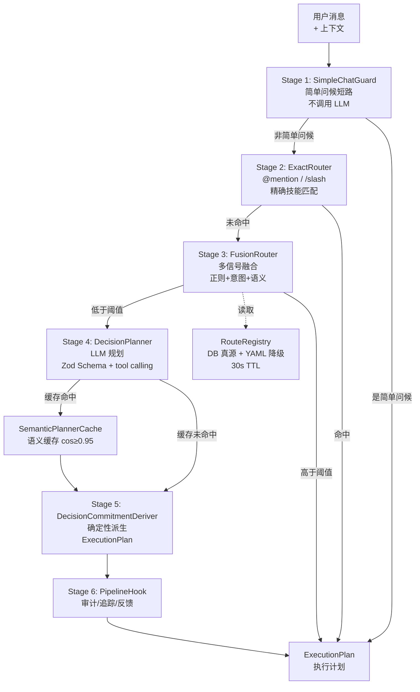

# 第 10 章 渐进式决策引擎

> "不是每个问题都需要调用 LLM，但每个问题都需要正确的答案。"

决策引擎是 WinMatrix 最核心的创新之一。当用户发送一条消息时，系统需要决定：由哪个数字员工处理？用什么方式执行？调用什么技能或工具？这个决策如果完全交给 LLM，既昂贵又缓慢；如果完全用规则，又缺乏灵活性。WinMatrix 的解决方案是**渐进式决策管线**——六阶段从精确匹配到 LLM 规划的渐进路由。本章将深入这个管线的每个阶段。

## 10.1 六阶段决策管线概览

`DecisionEngine` 类组装了整个决策管线：

```typescript
// src/agents/core/agent/decision/DecisionEngine.ts（第 111-124 行）
class DecisionEngine {
  private exactRouter = new ExactRouter();                    // Stage 2
  private simpleChatGuard = new SimpleChatGuard();            // Stage 1
  private fusionRouterStage = new FusionRouterStage(
    new FusionRouter(routeRegistry.getRoutes())
  );                                                          // Stage 3
  private quickAcceptGate = new QuickAcceptGate();            // (快速接受)
  private decisionPlanner = new DecisionPlanner();            // Stage 4
  private commitmentDeriver = new DecisionCommitmentDeriver(); // Stage 5
  private hooks: PipelineHook[];
  private semanticPlannerCache?: SemanticPlannerCache;        // 语义缓存

  constructor(hooks: PipelineHook[], semanticPlannerCache?: SemanticPlannerCache) {
    this.hooks = hooks;
    this.semanticPlannerCache = semanticPlannerCache;
  }
}
```



### 管线工厂

`createDecisionPipeline()` 是创建决策管线的工厂函数，由 `Architector.initialize()` 调用：

```typescript
// src/agents/core/agent/decision/createDecisionPipeline.ts（第 29-58 行）
export function createDecisionPipeline(): DecisionPipeline {
  // 创建 6 个 PipelineHook
  const auditHook = new AuditHook();
  const stageTraceHook = new StageTraceHook();
  const feedbackHook = new FeedbackHook();
  const progressHook = new ProgressHook();
  const capabilitySnapshotHook = new CapabilitySnapshotHook();
  const decisionEventHook = new DecisionEventHook();

  const hooks: PipelineHook[] = [
    auditHook,
    stageTraceHook,
    feedbackHook,
    progressHook,
    capabilitySnapshotHook,
    decisionEventHook,
  ];

  // 注入到 DecisionEngine
  const engine = new DecisionEngine(hooks);
  return { engine, hooks, auditHook, stageTraceHook, /* ... */ };
}
```

6 个 PipelineHook 分别处理不同的横切关注点：

| Hook | 职责 |
|------|------|
| `AuditHook` | 审计日志记录 |
| `StageTraceHook` | 阶段追踪（每个 Stage 的进出） |
| `FeedbackHook` | 决策反馈收集 |
| `ProgressHook` | 进度推送（WebSocket） |
| `CapabilitySnapshotHook` | 能力快照（候选技能/工具） |
| `DecisionEventHook` | 决策事件发布 |

## 10.2 Stage 1：SimpleChatGuard

第一个阶段是简单聊天守卫——拦截"你好"、"谢谢"这类简单问候，直接返回预设回复，不进入后续管线：

```typescript
// src/agents/core/agent/decision/stages/SimpleChatGuard.ts（概念性）
// 如果消息是简单问候（你好/谢谢/再见等），直接短路返回
// 避免为这类消息调用 LLM，节省 token 成本
```

这个阶段的价值在于**成本优化**——大量简单问候消息不需要走完整的决策管线。它使用关键词匹配而非 LLM，响应延迟在毫秒级。

## 10.3 Stage 2：ExactRouter

第二阶段是精确路由——处理确定性信号：

```typescript
// src/agents/core/agent/decision/stages/ExactRouter.ts（第 75-80 行）
/**
 * 精确匹配路由器 —— 渐进式决策引擎第 2 阶段
 *
 * 消费精确信号（@mention 指令、terminal/constraints/residualText），
 * 产出 ExactMatch。
 */
```

ExactRouter 处理三类精确信号：

1. **@mention 指令**：`@大福 帮我规划项目` → 直接路由到大福
2. **/slash 命令**：`/daily-plan` → 直接执行对应技能
3. **精确技能/工具匹配**：引号短语、精确关键词

### 语义匹配与 Gap 检查

ExactRouter 不仅做字面匹配，还支持语义匹配，并通过 Gap 检查避免歧义：

```typescript
// src/agents/core/agent/decision/stages/ExactRouter.ts（第 63-73 行）
// semanticGapOk —— 判别最高分与次高分是否拉开足够差距
// 当 best 被 boost（如 @mention 命中）而 second 未被 boost 时，
// 只要 second 与 best 的分差在 GAP 以内即可接受（允许 boosted 项略胜）
function semanticGapOk(best: SemanticSkillHit, second: SemanticSkillHit | undefined): boolean {
  if (!second) return true;
  if (
    best.boosted
    && !second.boosted
    && second.score - best.score <= EXACT_ROUTER_SEMANTIC_TOP2_MIN_GAP
  ) {
    return true;
  }
  return best.score - second.score >= EXACT_ROUTER_SEMANTIC_TOP2_MIN_GAP;
}
```

Gap 检查的逻辑是：如果最高分和次高分的差距太小，说明存在歧义，不应该贸然路由；但若最高分项是被 @mention 等 boost 信号加持的，则允许它略胜未被 boost 的次高分。

## 10.4 Stage 3：FusionRouter

第三阶段是最具创新性的**多信号融合路由**。它综合正则匹配、意图关键词和语义相似度进行加权评分。

### 融合算法

```typescript
// src/agents/core/agent/decision/fusion-router.ts（第 1-20 行）
// 信号融合算法：
//   正则匹配：+0.9 权重
//   正向意图关键词：+0.2
//   负向意图关键词：-0.8
//   语义相似度：maxSim * 0.6
//
// 路由决策：
//   score >= route.semanticThreshold → 确定性路由
//   score < route.semanticThreshold → 交给下游 LLM 决策管道
//
// 影子模式（shadow）：
//   status='shadow' 命中时只记录指标不路由
```

### RouteEntry 结构

每条路由规则定义了完整的匹配信号：

```typescript
// src/agents/core/agent/decision/fusion-router.ts（第 26-65 行）
interface RouteEntry {
  id: string;
  roleId: string;
  mode: 'direct' | 'skill';       // 直接执行 or 技能模式
  skillName?: string;
  patterns: RegExp[];              // 正则匹配（权重 0.9）
  positiveIntents: string[];       // 正向意图（+0.2）
  negativeIntents: string[];       // 负向意图（-0.8）
  semanticAnchors: string[];       // 语义锚点
  precomputedEmbeddings?: number[];
  semanticThreshold: number;       // 默认 0.85
  status: 'active' | 'shadow';     // 影子模式
  declaredAction?: string;
  producesDataKind?: string;       // 产出数据类型
  requiresDataKind?: string;       // 依赖数据类型
  toolHint?: string;
}
```

### 评分函数

```typescript
function calculateRouteScore(
  regexMatch: boolean,
  positiveIntentHits: number,
  negativeIntentHits: number,
  maxSemanticSimilarity: number,
): number {
  let score = 0;
  if (regexMatch) score += 0.9;
  score += positiveIntentHits * 0.2;
  score -= negativeIntentHits * 0.8;
  score += maxSemanticSimilarity * 0.6;
  return score;
}
```

### 影子模式

`status: 'shadow'` 是一个安全发布机制。新路由规则可以先以 shadow 模式上线——它会被评估但不实际路由，只记录"如果启用会命中"的指标。运营人员观察一段时间确认无误后，再将规则切换为 `active`。

### 路由规则 YAML

路由规则可以从 YAML 配置加载（测试/种子场景）：

```yaml
# src/infrastructure/config/specs/deterministic-routes.yaml
routes:
  - id: daily_plan
    roleId: process_manager
    mode: skill
    skillName: daily_plan
    patterns: ["^每日早会", "^早会"]
    semanticThreshold: 0.88

  - id: code_review
    roleId: tech_manager
    mode: skill
    skillName: code_review
    patterns: ["^代码评审", "^CR", "^代码审查"]
    semanticThreshold: 0.85
```

### RouteRegistry

路由规则的注册表以**数据库为唯一真源**：

```typescript
// src/agents/core/agent/decision/route-registry.ts（第 74-80 行）
class RouteRegistry {
  private routes: RouteEntry[];
  private ttlTimer: ReturnType<typeof setInterval> | null = null;
  private readonly TTL_REFRESH_MS = 30_000;  // 30 秒 TTL 刷新
  private onReloadCallback?: RouteRegistryReloadCallback;
  private dbLoadFailed = false;
}
```

关键设计：

- **30 秒 TTL 刷新**：定期从数据库重新加载规则，支持运行时动态更新
- **DB 失败降级**：DB 加载失败时进入零规则模式（不回退 YAML），避免使用过时规则
- **PCRE 到 JS 标志转换**：`sanitizePattern` 将 `(?i)` 等 PCRE 内联标志转为 JS RegExp flags

```typescript
// src/agents/core/agent/decision/route-registry.ts（第 15-37 行）
// sanitizePattern —— 剥离 PCRE 风格内联标志并转为 JS flags
// 示例: (?i)(演示提醒|今晚.*演示)
//   → pattern="(演示提醒|今晚.*演示)", flags="i"
// 注: `-`(关闭) 和 `x`(扩展) 无 JS 等价物，跳过
```

## 10.5 Stage 4：DecisionPlanner

第四阶段是 LLM 辅助规划——前三个阶段都未命中时，调用 LLM 做复杂决策。这是整个管线中最复杂的组件（约 1090 行）。

```typescript
// src/agents/core/agent/decision/stages/DecisionPlanner.ts（第 1-35 行）
/**
 * 决策规划器 —— DecisionEngine Stage 4 的核心 LLM 规划组件（~1090 行）
 *
 * 职责：
 * - Prompt 构建（system/user prompt，含 exactRouter 上下文、候选目录、技能快照）
 * - 结构化输出：Zod Schema + tool calling → LlmRoutePatch
 * - 多层验证：validateBlockedAudits / validateMentionReassignment / validateStepBindings
 * - 验证失败重试循环
 * - 回退填充：fillToolDirectFallbackForSteps（direct 步骤缺失 employeeId 时）
 * - 外部 Agent employee 清洗 + blockedAudit 注入
 */
```

### 结构化输出

DecisionPlanner 使用 LLM 的 tool calling 能力生成结构化输出，并通过 Zod Schema 验证：

```typescript
// 概念性流程
async plan(context: DecisionContext): Promise<LlmRoutePatch> {
  // 1. 构建系统提示词（含候选技能目录、角色信息）
  const systemPrompt = composePlannerSystemPrompt(context);
  
  // 2. 构建用户提示词（含 exactRouter 上下文）
  const userPrompt = buildPlannerUserPrompt(context);
  
  // 3. 调用 LLM，使用 tool calling 获取结构化输出
  const result = await runDecisionWithTools({
    systemPrompt,
    userPrompt,
    tools: DECISION_PLANNER_TOOL_NAMES,
  });
  
  // 4. Zod Schema 验证
  const patch = LlmRoutePatchSchema.parse(result);
  
  // 5. 多层验证
  this.validateBlockedAudits(patch);
  this.validateMentionReassignment(patch);
  this.validateStepBindings(patch);
  
  return patch;
}
```

### 验证失败重试

如果 LLM 输出未通过验证，DecisionPlanner 会构建重试提示词并重新调用：

```typescript
// 验证失败时构建重试提示词
const retryPrompt = buildPlannerValidationRetryPrompt(
  failureKind,  // PlannerValidationFailureKind
  patch,
);
// 重新调用 LLM...
```

### 回退填充

对于 `direct` 模式的步骤，如果 LLM 没有指定 `employeeId`，系统会自动填充回退员工：

```typescript
// fillToolDirectFallbackForSteps —— 为 direct 步骤填充缺失的 employeeId
```

## 10.6 语义缓存：SemanticPlannerCache

为了减少 LLM 调用，DecisionPlanner 的输出会被语义缓存：

```typescript
// src/agents/core/agent/decision/SemanticPlannerCache.ts（第 8-12 行）
/**
 * Planner 语义缓存：以用户输入的 embedding 做最近邻检索，
 * 相似度 ≥ 阈值则复用历史 Planner LLM 输出。
 * Redis 持久化 + 内存回退，按 scopeKey 隔离，含 TTL 和全局 FIFO 条目上限。
 */
```

### 调优常量

```typescript
// src/agents/core/agent/decision/SemanticPlannerCache.ts（第 57-59 行）
const SEMANTIC_PLANNER_MIN_SIMILARITY = 0.95;     // 相似度阈值
const SEMANTIC_PLANNER_ENTRY_TTL_MS = 3_600_000;   // 1 小时 TTL
const SEMANTIC_PLANNER_MAX_ENTRIES = 500;          // 最多 500 条
```

### 动态槽位指纹

一个精妙的设计是**动态槽位指纹**，防止跨任务复用：

```typescript
// src/agents/core/agent/decision/SemanticPlannerCache.ts（第 14-18 行）
interface SemanticPlannerInputFingerprintSnapshot {
  slotHash: string;
  hasDynamicSlots: boolean;
  dynamicSlotSummary: Record<string, number>;
}

interface SemanticPlannerCanonicalRouteResult {
  version: 'canonical-route-result-v1';
  patch: LlmRoutePatch;
  references: {
    selectedCandidateId: string;
    stepCandidateIds: string[];
    employeeIds: string[];
    skillNames: string[];
    skillTargetIds: string[];
    catalogFingerprint: string;
  };
  derivedPlanKind: string;
  createdAt: number;
  inputFingerprint?: SemanticPlannerInputFingerprintSnapshot;
  // fix-workstation-dynamic-task-isolation:
  // 当动态槽位（如需求编号/ticket 号）不同时，防止跨任务复用
}
```

这个设计解决了一个微妙的问题：两条消息文本相似（"修复 bug-123" vs "修复 bug-456"），但涉及的任务不同。通过动态槽位指纹，系统会检测到 `bug-123` 和 `bug-456` 是不同的动态值，不会错误复用。

## 10.7 Stage 5：DecisionCommitmentDeriver

第五阶段将 LLM 的输出（`LlmRoutePatch`）派生为确定性的 `ExecutionPlan`：

```typescript
// src/agents/core/agent/decision/stages/DecisionCommitmentDeriver.ts
// 确定性派生 ExecutionPlan
// 将 LLM 的概率性输出转换为可执行的确定性计划
```

这个阶段的价值在于**确定性**——LLM 的输出可能包含概率性选择（如"可能是大福或阿宁"），CommitmentDeriver 根据规则和上下文做出最终确定，生成无歧义的执行计划。

## 10.8 显式流程编排检测

DecisionEngine 还有一个特殊的预处理——检测用户是否显式要求流程编排：

```typescript
// src/agents/core/agent/decision/DecisionEngine.ts（第 68-69 行）
function isExplicitFlowOrchestrationInput(input: string): boolean {
  return /(?:流程编排|编排执行|按流程|执行流程|多步骤|先.+再.+(?:最后|然后|并))/u.test(input);
}
```

注意「先...再...」后面必须跟「最后/然后/并」才算显式编排——单说"先分析再做"不算，"先分析再做，最后总结"才算。这避免了误判普通对话为流程编排。

当用户说"先做需求分析，再做架构设计，最后写测试"时，系统识别这是显式流程编排，会走 Flow 编排路径而非普通的单步决策。

## 本章小结

本章深入分析了 WinMatrix 的渐进式决策引擎：

1. **六阶段管线**：SimpleChatGuard → ExactRouter → FusionRouter → DecisionPlanner → DecisionCommitmentDeriver → PipelineHook
2. **SimpleChatGuard**：简单问候短路，毫秒级响应，节省 LLM 成本
3. **ExactRouter**：@mention / /slash / 精确匹配，带语义 Gap 检查避免歧义
4. **FusionRouter**：多信号加权融合（正则 0.9 + 意图 ±0.2/0.8 + 语义 0.6），影子模式安全发布
5. **RouteRegistry**：DB 真源 + 30s TTL 刷新 + PCRE→JS 标志转换
6. **DecisionPlanner**：1090 行的 LLM 规划器，Zod Schema + tool calling + 多层验证 + 重试
7. **SemanticPlannerCache**：embedding 最近邻复用（cos≥0.95），动态槽位指纹防跨任务复用
8. **DecisionCommitmentDeriver**：LLM 概率输出 → 确定性执行计划
9. **显式流程检测**：识别"先...再..."等编排意图

这种渐进式设计的核心价值在于**成本与质量的平衡**——简单请求在前几个阶段低成本解决，复杂请求才调用 LLM，同时语义缓存进一步降低重复请求的成本。

在下一章中，我们将深入 Turn 执行引擎，理解决策结果是如何被执行的。
