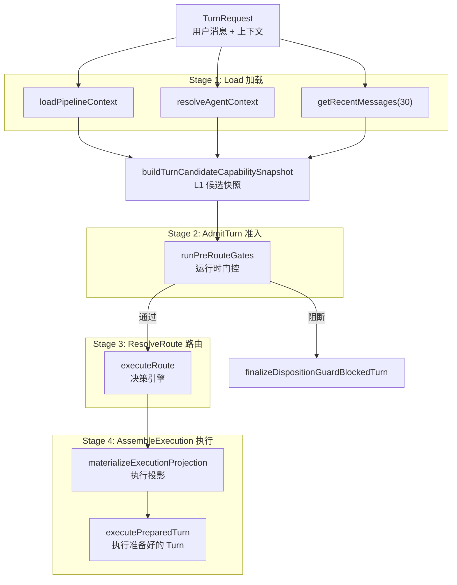
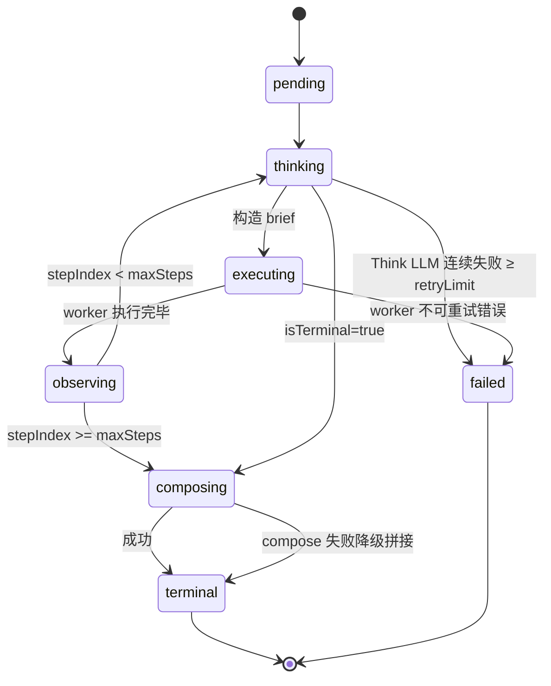

# 第 11 章 Turn 执行引擎

> "决策只是开始，执行才是结果。"

决策引擎决定"做什么"，Turn 执行引擎负责"怎么做"。TurnRunner 是 WinMatrix 中连接决策与执行的枢纽——它加载上下文、准入检查、路由决策、组装执行。本章将深入 TurnRunner 的四阶段管线和三种执行模式。

## 11.1 TurnRunner：四阶段单轨编排

TurnRunner 是整个 Agent 执行的单一真实来源（SSOT）：

```typescript
// src/agents/core/agent/turn/TurnRunner.ts（第 1-3 行）
/**
 * Turn single-track orchestration SSOT:
 * load -> admitTurn -> resolveRoute -> assembleExecution.
 */
```

### run() 主入口

```typescript
// src/agents/core/agent/turn/TurnRunner.ts（第 63-100 行）
export const TurnRunner = {
  async run(options: TurnRequest): Promise<ChatPipelineResult> {
    const conversationId = providedConversationId ?? conversationIdFactory.createChatConversationId();
    const executionSessionId = generateSessionId();

    // 三路并行：loadPipelineContext + resolveAgentContext + getRecentMessages
    // 三者仅依赖 conversationId，无交叉数据依赖。
    // 原为两段串行 await，合并消除一段 RTT。
    const [turnPipelineContext, context, historyResult] = await Promise.all([
      TurnContextLoader.loadPipelineContext(conversationId),
      resolveAgentContext(conversationId),
      getHistoryAdapter().getRecentMessages(conversationId, 30),
    ]);
```

这个 `Promise.all` 三路并行是一个重要的性能优化——原本是两段串行 await，合并后消除了一次网络往返（RTT）。

### L1 候选能力快照

```typescript
// src/agents/core/agent/turn/TurnRunner.ts（第 120-125 行）
const capabilitySnapshot = await buildTurnCandidateCapabilitySnapshot({
  allowedDigitalEmployees,
  projectId: project.id,
  accessMode: options.accessMode,
});
logger.info({
  accessMode: options.accessMode,
  candidateCount: capabilitySnapshot.candidateSkills.length,
  skillNames: capabilitySnapshot.candidateSkills.slice(0, 8).map((s) => s.name),
}, '[TurnRunner] L1 候选快照');
```

在路由决策前，TurnRunner 先构建"候选能力快照"——列出当前可用的数字员工和技能。这个快照会传递给决策引擎，作为路由的候选集。



### 准入门控与处置守卫

```typescript
// src/agents/core/agent/turn/TurnRunner.ts（第 127-189 行，概念性）
// 运行路由前置门控
const gateOutcome = await runPreRouteGates(/* ... */);
if (gateOutcome.kind === 'return') {
  return gateOutcome.result;  // 短路返回
}

// 处置守卫：某些 disposition 会阻断决策
if (TURN_DISPOSITION_BLOCKS_DECISION) {
  return finalizeDispositionGuardBlockedTurn(/* ... */);
}
```

准入门控（Admission）在决策前运行，处理一些可以短路的情况（如纯聊天、无效输入）。处置守卫（Disposition）处理运行时约束（如权限不足、配额超限）。

## 11.2 三种执行模式

WinMatrix 有三种一流的执行模式（注意：`skill` 和 `workstation` 是这些模式内的动作目标，不是独立模式）：

```typescript
// src/agents/core/agent/modes/react/README.md（第 3 行）
// L2a 层 LLM 驱动的 worker step loop 编排器，
// 与 cdw/（CoordinatorRuntime）、interactive/（Inbox）并列。
```

| 模式 | 目录 | 用途 |
|------|------|------|
| **CDW** | `cdw/` | Coordinator-Driven Workflow（默认，多步编排） |
| **Interactive** | `interactive/` | Inbox/Environment 模式（人机交互） |
| **React** | `react/` | LLM 驱动的 worker step loop（ReAct 循环） |

### 动作目标（Action Target）

在 react/cdw 模式内，每一步的动作可以是：

```typescript
// src/agents/core/agent/modes/react/contracts/types.ts（第 119 行）
ReactBriefActionTarget.mode: 'direct' | 'skill' | 'workstation'
```

- **direct**：直接执行（LLM 回复）
- **skill**：调用技能
- **workstation**：编码工作站任务

## 11.3 React 循环：Observe-Think-Act

React 模式是 LLM 驱动的核心循环，文档非常完整：

```
// src/agents/core/agent/modes/react/README.md（第 7-12 行）
- LLM 驱动 step loop：每步 Think（LLM 结构化决策构造 brief）→
  Act（调 WorkerRuntime.execute）→ Observe（累积 stepRecords），LLM 决定是否终止。
- plan 是地图不是铁轨：D1 产出的 plan.steps 是 prior，
  LLM 可按建议推进也可根据 worker 实际结果跳步/插步/改步。
- 终止条件：LLM 输出 isTerminal=true 或 stepIndex >= maxSteps（默认 12）。
```

### 状态机



### ReactLoopStatus 类型

```typescript
// src/agents/core/agent/modes/react/contracts/types.ts（第 28-36 行）
export type ReactLoopStatus =
  | 'pending'
  | 'thinking'    // Think 阶段
  | 'executing'   // Act 阶段
  | 'observing'   // Observe 阶段
  | 'composing'   // 组合最终输出
  | 'terminal'    // 正常终止
  | 'failed';     // 失败终止
```

### 主循环

```typescript
// src/agents/core/agent/modes/react/ReactRuntime.ts（第 112-260 行，简化）
while (true) {
  // === thinking 阶段 ===
  let thinkOutput: ReactThinkOutput;
  try {
    thinkOutput = await thinkFn({
      planGoal: input.plan.goal,
      planSteps: input.plan.steps,
      stepRecords: loopCtx.stepRecords,      // 历史步骤
      candidateSkills: input.candidateSkills,
    });
    thinkFailureStreak = 0;
  } catch (err) {
    thinkFailureStreak += 1;
    if (thinkFailureStreak >= REACT_THINK_RETRY_LIMIT) {
      return { status: 'failed', endReason: 'think_llm_failed' };
    }
    continue;  // 重试 Think
  }

  // === 终止判定 ===
  if (thinkOutput.isTerminal) {
    await setStatus('composing');
    const composeResult = await composeFn({ endReason: 'is_terminal' });
    await setStatus('terminal');
    return { status: 'terminal', endReason: 'is_terminal' };
  }

  // === 构造 brief ===
  const brief = buildReactBrief({ thinkOutput, /* ... */ });

  // === executing 阶段 ===
  await setStatus('executing');
  const workerResult = await runWorkerWithLeaseCore({
    brief,
    workerContext: input.workerContext,
    executeWorker: () => workerRuntime.execute(brief, /* ... */),
  });

  // === observing 阶段 ===
  loopCtx.stepRecords.push({
    stepIndex,
    briefId: brief.briefId,
    status: deriveReactStepStatus(workerResult),
    outputSummary: workerResult.outputSummary ?? '',
  });

  // 检查 maxSteps
  if (loopCtx.stepRecords.length >= maxSteps) {
    return terminateByMaxSteps(loopCtx, input);
  }
}
```

### ReactThinkOutput：LLM 结构化决策

```typescript
// src/agents/core/agent/modes/react/contracts/types.ts（第 46-60 行）
export interface ReactThinkOutput {
  nextBriefGoal: string;          // 下一步要做什么（自然语言）
  nextActionTarget: {
    mode: 'direct' | 'skill' | 'workstation';
    skillTargetId?: string;
    toolHints?: string[];
    workstationPlan?: WorkstationPlanRef;
  };
  reasoning: string;              // 为什么做这步（审计 trace）
  isTerminal: boolean;            // 是否认为任务应结束
}
```

LLM 每一步输出结构化决策——下一步目标、动作类型、是否终止。`reasoning` 字段用于审计追踪。

### 终止原因

```typescript
// src/agents/core/agent/modes/react/contracts/types.ts（第 88-98 行）
export type ReactLoopResultStatus = 'terminal' | 'failed';

export type ReactEndReason =
  | 'is_terminal'           // LLM 判定完成
  | 'max_steps_exhausted'   // 步数耗尽（默认 12）
  | 'think_llm_failed'      // Think LLM 连续失败
  | 'worker_unretryable';   // Worker 不可重试错误

export type ReactFinalStatus = 'terminal' | 'failed' | 'max_steps_reached';
```

### 状态持久化门控

并非所有状态都持久化——只有稳定状态才写数据库：

```typescript
// src/agents/core/agent/modes/react/ReactLoopState.ts（第 1-22 行）
/**
 * React loop 状态持久化 gate。
 *
 * 仅以下状态转移写入 agent_run.metadata.reactState：
 * - observing（每步 worker 执行完毕）
 * - composing / terminal / failed（loop 收口）
 *
 * thinking / executing / pending 中间态不写 DB。
 */
const PERSIST_REACT_STATUSES = new Set<ReactLoopStatus>([
  'observing', 'composing', 'terminal', 'failed',
]);

export function shouldPersistReactState(status: ReactLoopStatus): boolean {
  return PERSIST_REACT_STATUSES.has(status);
}
```

这种设计减少了数据库写入——中间态（thinking/executing）不持久化，只在稳定点（observing/terminal）写入。

### 环境变量配置

```
// src/agents/core/agent/modes/react/README.md（第 82-92 行）
WIN_REACT_MODE_ENABLED=false                    # 默认关闭
WIN_REACT_MAX_STEPS=12                          # 最大步数
WIN_REACT_WORKER_SYNC_WAIT_MS=60000             # Worker 同步等待
WIN_REACT_WORKER_HARD_TIMEOUT_MS=300000         # Worker 硬超时（5 分钟）
WIN_REACT_THINK_LLM_TIMEOUT_MS=10000            # Think LLM 超时
WIN_REACT_COMPOSE_LLM_TIMEOUT_MS=15000          # Compose LLM 超时
WIN_REACT_STEP_HISTORY_OUTPUT_CHARS=500         # 步骤历史输出字符数
WIN_REACT_THINK_PROMPT_CHAR_BUDGET=30000        # Think 提示词字符预算
WIN_REACT_WS_STREAMING_TIMEOUT_MS=900000        # WebSocket 流式超时（15 分钟）
```

## 11.4 CDW：Coordinator-Driven Workflow

CDW 是默认执行模式，包含完整的编排子目录：

```
src/agents/core/agent/modes/cdw/
├── coordinator/       # 协调器核心
├── subagent/          # 子 Agent 调度
├── pipeline/          # 管线编排
├── planning/          # 规划
├── progress/          # 进度跟踪
├── close/             # 收尾
├── continuation/      # 续跑
├── contracts/         # 契约
├── dispatch/          # 分发
└── repair/            # 修复
```

CDW 模式的核心是**协调器（Coordinator）**——它像一个项目经理，将复杂任务分解为多个步骤，分配给不同的 Worker 执行，并跟踪进度。

## 11.5 Interactive：人机交互模式

Interactive 模式（18 个文件）处理需要人类介入的场景：

```
src/agents/core/agent/modes/interactive/
├── interactiveRole*           # 角色交互
├── interactiveEnvironment*    # 交互环境
├── interactiveParticipant*    # 参与者管理
└── roleInboxReplayGuard.ts    # 收件箱重放守卫
```

## 11.6 Human-in-the-Loop

Human-in-the-Loop 不是一个独立模块，而是一个 Port 接口：

```typescript
// src/agents/core/agent/shared/ports/agentBusinessPortTypes.ts（第 354-399 行）
export interface IHumanInteractionPort {
  readCurrentSummary(agentRunId: string): Promise<{
    interactionId: string;
    kind: string;
    status: string;
    question: string;
    options?: string[];
    reasonCode: string;
    expectedResponder?: {
      userId?: string;
      projectRole?: 'requester' | 'project_admin' | 'interaction_handler';
    };
    canAnswer: boolean;
    canCancel: boolean;
  } | null>;

  open(input: {
    kind?: 'clarification' | 'approval' | 'risk_confirmation'
        | 'credential_request' | 'acceptance';
    question: string;
    options?: string[];
    requestedBy:
      | 'ask_user' | 'coordinator' | 'runtime_policy'
      | 'acceptance_gate' | 'failure_handler' | 'semantic_judge'
      | 'workflow_checkpoint';
    // ...
  }): Promise<unknown>;
}
```

### 5 种交互类型

| 类型 | 用途 |
|------|------|
| `clarification` | 澄清（需求不明确时） |
| `approval` | 审批（需要用户确认） |
| `risk_confirmation` | 风险确认（高风险操作） |
| `credential_request` | 凭证请求（需要密码/Token） |
| `acceptance` | 验收（交付物确认） |

### 7 种请求来源

`requestedBy` 标识谁发起了交互——从用户直接提问（`ask_user`）到协调器（`coordinator`）、运行时策略（`runtime_policy`）、验收门控（`acceptance_gate`）等。

## 本章小结

本章深入分析了 WinMatrix 的 Turn 执行引擎：

1. **TurnRunner 四阶段**：load → admitTurn → resolveRoute → assembleExecution（SSOT）
2. **三路并行加载**：Promise.all 消除一次 RTT
3. **L1 候选快照**：路由前构建可用员工/技能候选集
4. **三种执行模式**：CDW（默认编排）、Interactive（人机交互）、React（LLM 驱动循环）
5. **ReAct 循环**：Think → Act → Observe，7 态状态机，maxSteps=12
6. **plan 是地图不是铁轨**：LLM 可根据实际结果跳步/插步/改步
7. **状态持久化门控**：仅 observing/terminal/failed 写 DB，减少写入
8. **Human-in-the-Loop**：Port 接口，5 种交互类型 × 7 种请求来源
9. **9 个环境变量**：精细控制 React 模式的超时和预算

在下一章中，我们将深入记忆系统。
