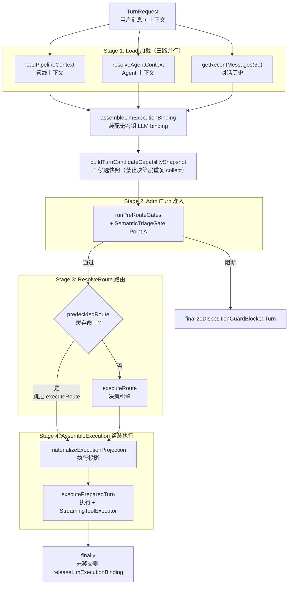
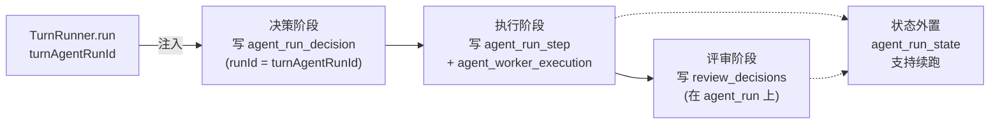
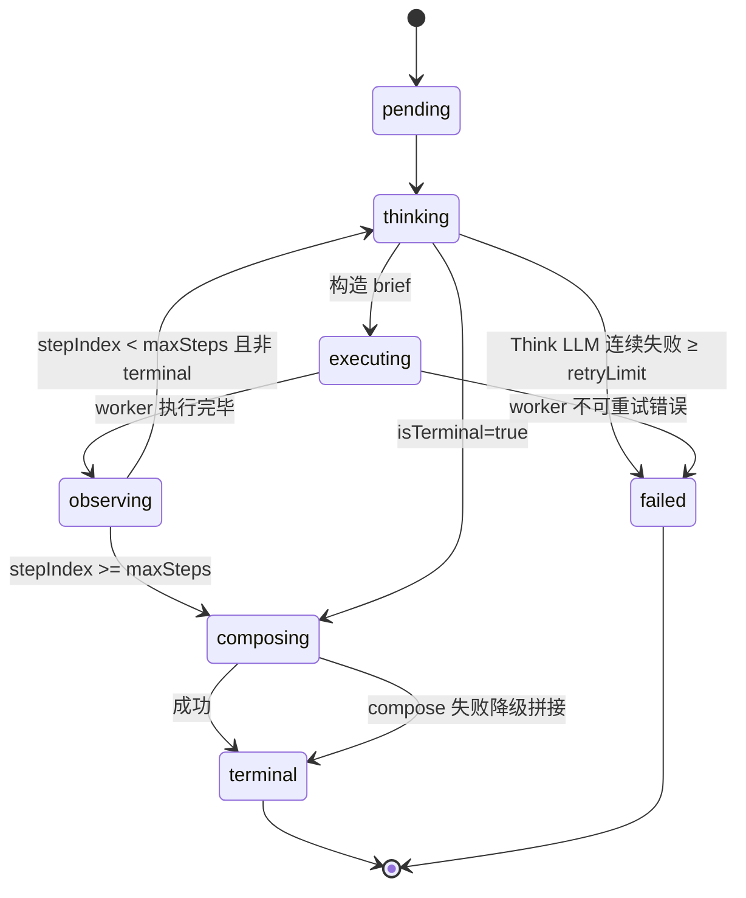
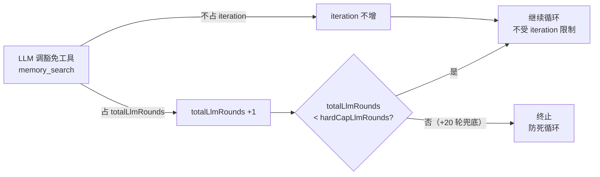

# 第 11 章 Turn 执行引擎

> "决策只是开始，执行才是结果——而执行的第一要务是：每一步都有据可查、每一路 IO 都并行到位、每一次失败都能优雅收口。"

决策引擎（第 10 章）决定"做什么"，Turn 执行引擎负责"怎么做"。`TurnRunner` 是 WinMatrix 连接决策与执行的枢纽——它加载上下文、跑准入门控、解析路由、组装执行，最后在 `finally` 里释放 LLM binding。本章会拆解 TurnRunner 的单轨编排、三路并行 IO、预决策路由缓存，然后重点讲一个早期版本讲错位置的关键组件——**LLM Tool 调用循环实际不在 Turn 目录，而在 `ai-execution/tool-loop/StreamingToolExecutor.ts`**。

这里还有一个全系统性的数据贯穿机制要讲清楚：`turnAgentRunId` 如何把一次 Turn 和它的决策审计（`agent_run_decision`）、步骤（`agent_run_step`）、状态（`agent_run_state`）、worker 执行（`agent_worker_execution`）串成一个可追溯的聚合根。

## 11.1 TurnRunner：单轨编排 SSOT

TurnRunner 是整个 Agent 执行的单一真实来源（SSOT）。它的文件头注释把职责说得非常清楚：

```typescript
// src/agents/core/agent/turn/TurnRunner.ts（第 1-3 行）
/**
 * Turn single-track orchestration SSOT:
 * load -> admitTurn -> resolveRoute -> assembleExecution.
 */
```

四阶段单轨编排：**load（加载）→ admitTurn（准入）→ resolveRoute（路由）→ assembleExecution（组装执行）**。"单轨"的含义是——所有 Turn 的执行都收敛到这一条轨道，没有并行的第二条编排路径。这简化了心智模型，也让可观测性更聚焦。

还有一个容易被忽略的事实：**TurnRunner 是对象字面量，不是 class**。

```typescript
// src/agents/core/agent/turn/TurnRunner.ts（第 67 行）
export const TurnRunner = {
  async run(options: TurnRequest): Promise<ChatPipelineResult> {
    // ...
  },
};
```

为什么用对象字面量而不是 class？因为 TurnRunner 是**无状态**的编排器——它不持有任何跨 Turn 的状态，每次 `run()` 都是独立的。用对象字面量明确表达了"这是一组函数集合，不是可实例化的对象"。与之对比，第 10 章的 `Architector` 是有状态单例（持有路由表、缓存），所以它是 class。

### run() 主入口：三路并行 IO

```typescript
// src/agents/core/agent/turn/TurnRunner.ts（第 68-108 行）
async run(options: TurnRequest): Promise<ChatPipelineResult> {
  const { input, conversationId: providedConversationId, userId, project: originalProject,
          target, logPrefix, metadata } = options;
  const pipelineInteractiveSession = resolveInteractiveSessionForPipeline(options);
  const conversationId = providedConversationId ?? conversationIdFactory.createChatConversationId();
  const executionSessionId = options.executionSessionId ?? generateSessionId();
  if (!projectContext && !options.metadata.scheduledTaskName) {
    throw new Error('TURN_RUNNER_REQUIRES_PROJECT_CONTEXT');
  }

  // 三路并行：loadPipelineContext + resolveAgentContext + getRecentMessages
  // 三者仅依赖 conversationId，无交叉数据依赖。
  // 原为两段串行 await（loadPipelineContext → resolveAgentContext + getRecentMessages），
  // 合并消除一段 RTT。
  const [turnPipelineContext, context, historyResult] = await Promise.all([
    TurnContextLoader.loadPipelineContext(conversationId),
    resolveAgentContext(conversationId),
    useCausalHistory
      ? Promise.resolve({ messages: [] /* ... */ })
      : getHistoryAdapter().getRecentMessages(conversationId, 30),
  ]);
```

这三路并行是一个重要的性能优化。注释明确写了它的来龙去脉——**原本是两段串行 await**（先 loadPipelineContext，再并行 resolveAgentContext + getRecentMessages），后来发现三者其实都只依赖 `conversationId`，没有交叉数据依赖，于是合并成一个 `Promise.all`，消除了一段网络往返（RTT）。

三路各自的职责：

| 路 | 函数 | 加载什么 |
|----|------|---------|
| 1 | `TurnContextLoader.loadPipelineContext` | 管线上下文（项目、会话元信息） |
| 2 | `resolveAgentContext` | Agent 上下文（当前员工、运行态） |
| 3 | `getHistoryAdapter().getRecentMessages(conversationId, 30)` | 最近 30 条对话历史 |

注意第三路的 `useCausalHistory` 分支——某些场景（如因果历史模式）会跳过实际历史查询，用空数组占位。这是一个条件性的优化路径。

### 为什么"30 条"是个有意思的数字

`getRecentMessages(conversationId, 30)` 取最近 30 条对话历史。这个数字是上下文窗口管理和成本控制的平衡——太少会让 LLM 失去上下文（"你刚才说的 XX 是什么"它答不上来），太多会撑爆 token 预算且引入噪声。30 条大致是"一段连贯对话"的典型长度。这个数字和第 12 章记忆系统的 `getRecentMemory(10)`、长期记忆 `top-k=5` 一起，构成了 WinMatrix 的上下文可判定性边界（12.7 节会展开）。

### LLM Binding 装配与移交

```typescript
// src/agents/core/agent/turn/TurnRunner.ts（第 130-140 行）
const assembledLlm = await assembleLlmExecutionBinding({
  // ... 装配无密钥 LLM binding
});
let bindingHandedOff = false;   // 标记 binding 是否已移交给执行层
```

`assembleLlmExecutionBinding` 装配一个**无密钥的 LLM binding**——密钥不在这里直接持有，而是通过 binding 间接引用（密钥管理见第 6 章）。`bindingHandedOff` 是个关键标志位，决定 `finally` 块是否要释放 binding。

### L1 候选能力快照

```typescript
// src/agents/core/agent/turn/TurnRunner.ts（第 146-151 行）
const capabilitySnapshot = await buildTurnCandidateCapabilitySnapshot({
  allowedDigitalEmployees,
  projectId: project.id,
  accessMode: options.accessMode,
});
```

这里构建的"候选能力快照"就是第 10 章讲的 L1 分层路由载体——它列出当前可用的数字员工和技能，注入决策输入。注释明确要求决策引擎**禁止重复 collect**——这个快照在 Turn 层做一次，决策引擎复用，避免"决策阶段查一遍、规划阶段又查一遍"的重复 I/O。

### 四阶段总览图



## 11.2 准入门（AdmitTurn）与处置守卫

```typescript
// src/agents/core/agent/turn/TurnRunner.ts（第 153-179 行）
const gateOutcome = await runPreRouteGates(/* ... */);
if (gateOutcome.kind === 'return') {
  return gateOutcome.result;  // 短路返回
}
```

准入门（Admission）在路由决策**之前**运行。它的职责是处理那些"根本不应该进入决策"的情况：

- **SemanticTriageGate Point A**（见第 10 章 10.12）：路由前的语义分诊。判定为 `casual_chat` 的直接短路。
- **处置守卫（Disposition）**：运行时约束检查，如权限不足、配额超限、会话被冻结。命中阻断条件时调 `finalizeDispositionGuardBlockedTurn`，短路返回——这是 TurnRunner.ts 第 153-179 行 `gateOutcome.kind === 'return'` 分支的实际触发路径。

准入门的价值在于**前置过滤**——如果一个请求注定不该被处理（用户没权限、配额用完、纯闲聊），在它消耗决策引擎资源之前就拦下。这是单轨编排的第一道闸。

## 11.3 路由决策：预决策缓存

Stage 3 的路由解析有一个重要的性能优化——**预决策路由缓存**：

```typescript
// src/agents/core/agent/turn/TurnRunner.ts（第 217-246 行）
let routeResult: RouteResult;
if (options.predecidedRoute) {
  logger.info(
    `predecided route cache after admitTurn: roleId=${options.predecidedRoute.unifiedDecision.roleId}`,
  );
  routeResult = options.predecidedRoute;   // 直接复用，跳过 executeRoute
} else {
  routeResult = await executeRoute(/* ... */);   // 调决策引擎
}
```

`options.predecidedRoute` 是什么？它对应第 10 章讲的 L0 分层路由——**系统预先决定了路由结果**。典型场景：

- **续跑（continuation）**：上一次 Turn 决策的结果还没执行完，这次消息属于同一执行上下文，路由结果应保持一致。
- **定时任务**：调度器预先指定要跑某个技能（如每日早会），决策结果已知。
- **@mention 快速路径**：用户明确 @ 了某个员工，路由结果是确定的，不必再走完整决策管线。

预决策缓存命中时，直接复用 `options.predecidedRoute`，**跳过整个 `executeRoute`（即跳过决策引擎）**。但注意：准入门（Stage 2）仍然要跑——预决策只跳过路由，不跳过准入检查。一个被阻断的请求（如权限不足）即使有预决策也会被拦下。

### executeRoute：调用决策引擎

未命中缓存时，调 `executeRoute`，它内部会调 `Architector.getInstance().decide(...)` 或 `decideRoute(...)`（见第 10 章 10.2）。决策引擎返回 `RouteResult`，包含 `executionPlan` 和 `unifiedDecision`。

## 11.4 组装执行：投影与执行

Stage 4 把路由结果物化为可执行投影，然后执行。

```typescript
// src/agents/core/agent/turn/TurnRunner.ts（第 248 行）
const executionProjection = await materializeExecutionProjection({
  // 把 executionPlan 投影成具体可执行单元
});
```

`materializeExecutionProjection` 把抽象的 `executionPlan`（决策引擎的产物）投影成具体的可执行单元——装配 Role、绑定技能、准备凭证、对接工作站。这是"计划 → 可执行"的关键转换。

```typescript
// src/agents/core/agent/turn/TurnRunner.ts（第 281-301 行）
const result = await executePreparedTurn({
  // 执行准备好的 Turn
});
bindingHandedOff = true;   // 标记 binding 已移交给执行层
```

`executePreparedTurn`（在 `TurnExecutionAssembly.ts`）是真正的执行入口。执行成功后 `bindingHandedOff = true`——LLM binding 已经移交给执行层（由执行层负责释放），TurnRunner 不再需要管它。

### finally 块：binding 释放的兜底

```typescript
// src/agents/core/agent/turn/TurnRunner.ts（第 302-308 行）
} finally {
  // ...
  if (!bindingHandedOff) {
    releaseLlmExecutionBinding(llmBinding.bindingId);
  }
}
```

`finally` 块是 LLM binding 释放的兜底。正常路径下 `bindingHandedOff = true`，finally 不释放（执行层会释放）；异常路径下（执行抛错、提前 return），`bindingHandedOff` 仍是 `false`，finally 释放 binding，防止泄漏。

这是一个典型的"所有权转移 + 兜底回收"模式——binding 的所有权从 TurnRunner 转移到执行层，但转移过程可能因异常失败，所以 finally 做兜底。LLM binding 是昂贵资源（关联密钥、连接、配额），泄漏会导致配额耗尽。

## 11.5 LLM Tool 调用循环：StreamingToolExecutor

这里要讲一个早期版本讲错位置的关键组件。**LLM Tool 调用循环不在 Turn 目录，而在 `agents/core/ai-execution/tool-loop/StreamingToolExecutor.ts`**（4240 行）。Turn 目录负责编排（决定调谁、什么时候调），StreamingToolExecutor 负责执行（实际的 LLM 调用 + 工具调用循环）。

这个分离体现了关注点分层：Turn 是"业务编排层"，ai-execution 是"内核执行层"。把工具循环放在内核层，让它可以被 Turn 之外的入口（如独立技能执行、工作站任务）复用。

### 双终止条件

StreamingToolExecutor 的主循环有一个比单条件更复杂的设计——**双终止条件**：

```typescript
// src/agents/core/ai-execution/tool-loop/StreamingToolExecutor.ts（第 1026 行）
while (iteration < maxIterations && totalLlmRounds < hardCapLlmRounds) {
  // ...
}
```

两个条件必须**同时**满足才继续循环：

- `iteration < maxIterations`：工具调用迭代次数未超上限。
- `totalLlmRounds < hardCapLlmRounds`：LLM 总轮次未超硬上限。

为什么要两个条件？因为有一类特殊工具——**豁免工具（meta tool）**——它们的调用不计入 `iteration` 配额，但仍会消耗 LLM 轮次。如果不加 `totalLlmRounds` 限制，一个反复调豁免工具的 LLM 可能死循环（每次豁免不计数，迭代数不增）。`hardCapLlmRounds` 是兜底的绝对上限。

### 硬上限 = maxIterations + 20

```typescript
// src/agents/core/ai-execution/tool-loop/StreamingToolExecutor.ts（第 267-269 行）
/**
 * LLM 总轮次硬上限 = maxIterations + AGENT_META_TOOL_EXTRA_LLM_ROUNDS（默认 +20），
 * 防止仅调用豁免工具时死循环。
 */
export function resolveMetaToolLlmRoundHardCap(maxIterations: number): number {
  const raw = process.env.AGENT_META_TOOL_EXTRA_LLM_ROUNDS;
  // ...
}
```

硬上限默认是 `maxIterations + 20`（`AGENT_META_TOOL_EXTRA_LLM_ROUNDS` 默认 20），可通过环境变量调整。第 995 行调 `resolveMetaToolLlmRoundHardCap(maxIterations)` 算出本次循环的硬上限：

```typescript
// 第 995 行
const hardCapLlmRounds = resolveMetaToolLlmRoundHardCap(maxIterations);
```

每轮迭代会打日志记录两个计数器：

```typescript
// 第 1051 行附近
logger.info(
  `[StreamingToolExecutor] 迭代 ${iteration}/${maxIterations}（LLM 轮次 ${totalLlmRounds}/${hardCapLlmRounds}）`,
);
```

### 豁免工具不占配额

```typescript
// src/agents/core/ai-execution/tool-loop/StreamingToolExecutor.ts（第 233 行）
export const DEFAULT_ITERATION_BUDGET_EXEMPT_TOOL_NAMES = [
  // 这些工具的调用不计入 iteration 配额
  // 典型：内存查询、上下文检索等"系统级"工具
];
```

豁免工具列表（`DEFAULT_ITERATION_BUDGET_EXEMPT_TOOL_NAMES`）定义了哪些工具不计入迭代配额。典型的是记忆检索、上下文查询这类"系统级辅助"工具——它们是 LLM 决策的辅助信息来源，不应该挤占"真正做事"的迭代配额。第 242 行提供 `isExemptTool` 判定函数。

但注意：豁免工具仍然消耗 `totalLlmRounds`（每调一次 LLM 都+1），只是不消耗 `iteration`。这就是为什么需要 `hardCapLlmRounds` 兜底。

### roundBudgetMs：超预算提前终止

除了双终止条件，还有一个基于时间的终止：

```typescript
// src/agents/core/ai-execution/tool-loop/StreamingToolExecutor.ts（第 1027-1046 行）
if (roundBudgetMs !== undefined && Date.now() - loopStartAt > roundBudgetMs) {
  logger.warn(`[StreamingToolExecutor] 超出单轮预算 ${roundBudgetMs}ms，提前结束`);
  this.loopAbortController?.abort('round_budget_exceeded');
  return finalizeSuccess({
    output: output || `已达到执行预算（${roundBudgetMs}ms），先返回当前结果；如需继续请明确下一步。`,
    intermediateSteps,
    iterations: iteration,
    terminationReason: 'round_budget_exceeded',
  });
}
```

`roundBudgetMs` 是单轮执行的时间预算。超预算时**优雅终止**（不是错误终止）：

- 调 `loopAbortController.abort('round_budget_exceeded')` 中止进行中的 LLM 调用。
- 返回当前已产出的结果（`finalizeSuccess`），终止原因标为 `round_budget_exceeded`。
- 如果还没有任何输出，返回一条引导性文本："已达到执行预算，先返回当前结果；如需继续请明确下一步。"

这个设计很重要——超预算不是失败，而是"先给用户阶段性成果"。第 1747 行有一段专门的错误处理：

```typescript
// 第 1747-1748 行
// round_budget_exceeded 是优雅终止（预算耗尽），不应作为错误传播
if (error instanceof LlmWatchdogError && (error as LlmWatchdogError).reason === 'round_budget_exceeded') {
```

如果 `round_budget_exceeded` 在 LLM 调用中触发（被 watchdog 抛出），它会被识别为优雅终止而非错误，不重试。

### 流式 + 容错

```typescript
// src/agents/core/ai-execution/tool-loop/StreamingToolExecutor.ts（第 1085 行）
let assistantMessage: AssistantMessage = await this.callLLMStreaming(clientWithTools, messagesForLlm);
```

每轮 LLM 调用走流式（`callLLMStreaming`），让前端能实时看到生成内容。但流式调用有一个已知的坑——**流式返回的 `tool_calls` 有时 `arguments` 是空字符串**（流式分片未拼完整）。StreamingToolExecutor 在第 1087-1108 行专门处理这个情况：检测到流式返回的 tool_calls 参数为空时，**用非流式调用补全**，拿到完整的 `tool_calls.arguments` 再继续。这个降级路径只在空 args 时触发，正常流式调用的低延迟优势不受影响。

这是流式 + 容错的经典组合——流式快但可能拿到不完整的 tool_calls，非流式慢但保证完整。检测到空 args 时自动降级非流式补全（StreamingToolExecutor.ts 第 1087-1108 行）。这是"双轨 LLM 调用"（stream + invokeNonStreaming）在工具循环里的具体应用（见事实清单"LLM 工具调用双轨"）。

### maxIterations 动态调整

```typescript
// src/agents/core/ai-execution/tool-loop/StreamingToolExecutor.ts（第 678 行）
export function resolveEffectiveMaxIterations(params: {
  // 按决策模式动态调整 maxIterations
}): number {
  // ...
}
```

`maxIterations` 不是固定值——它根据决策模式（direct/skill/workstation 等）动态调整。一个简单的 direct 回复可能只需要 1-3 次迭代，一个复杂的工作站任务可能需要 15+ 次。按模式分配预算，避免简单任务浪费配额、复杂任务卡在中途。

## 11.6 agent_run 聚合根：Turn 的持久化投射

Turn 的执行过程会持久化到一组表里，构成 `agent_run` 聚合根。这是全系统可观测性、可审计、可续跑的基础。

### agent_run 家族四张表

```prisma
// prisma/schema.prisma
model agent_run {             // 第 1864 行：一次完整多步执行根聚合
  id                String    @id @default(uuid())
  conversationId    String    @map("conversation_id")
  userId            String?   @map("user_id")
  projectId         String?   @map("project_id")
  intentSummary     String    @map("intent_summary")
  decomposition     Json?                              // 任务分解
  orchestrationPlan Json?     @map("orchestration_plan")  // 编排计划
  reviewDecisions   Json?     @map("review_decisions")
  finalOutput       Json?     @map("final_output")
  status            String    @default("running")
    // running | completed | partial | failed
  durationSeconds   Int?      @map("duration_seconds")
  executionPlanKind String?   @map("execution_plan_kind")
  startedAt         DateTime  @default(now()) @map("started_at") @db.Timestamptz(6)
  finishedAt        DateTime? @map("finished_at") @db.Timestamptz(6)
  // ...
}

model agent_run_decision {    // 第 1971 行：决策审计
  runId             String    @map("run_id")
  stage             String                              // 决策阶段
  decisionKind      String    @map("decision_kind")
  inputDigest       Json?     @map("input_digest")
  outputSnapshot    Json?     @map("output_snapshot")
  normalizedMode    String?   @map("normalized_mode")
  @@index([runId, stage])                                         // 复合索引
}

model agent_run_state {       // 第 1986 行：编排状态外置
  runId         String        @map("run_id")
  stateType     String        @map("state_type")
  status        String
  compactState  Json?         @map("compact_state")
  checkpointRef String?       @map("checkpoint_ref")
  @@unique([runId, stateType])                                    // 唯一键
}

model agent_run_step {        // 第 2022 行：步骤级
  runId               String  @map("run_id")
  mode                String
  stepId              String  @map("step_id")
  briefId             String? @map("brief_id")
  parentStepId        String? @map("parent_step_id")
  orderIndex          Int     @map("order_index")
  roleId              String? @map("role_id")
  digitalEmployeeId   String? @map("digital_employee_id")
  status              String
  completionDecision  Json?   @map("completion_decision")
  spanId              String? @map("span_id")
  @@unique([runId, stepId])                                       // 唯一键
}

model agent_worker_execution {  // 第 2053 行：worker 执行
  runId            String      @map("run_id")
  stepId           String      @map("step_id")
  attemptNo        Int         @map("attempt_no")
  codingTaskId     String?     @map("coding_task_id")
  contractSnapshot Json?       @map("contract_snapshot")
  outputData       Json?       @map("output_data")
  @@unique([runId, stepId, attemptNo])                            // 支持重试
}
```

四张表的分工：

| 表 | 粒度 | 用途 |
|----|------|------|
| `agent_run` | 一次执行 | 根聚合：意图、分解、计划、最终输出、状态 |
| `agent_run_decision` | 每次决策 | 决策审计：每阶段输入摘要、输出快照 |
| `agent_run_step` | 每个步骤 | 步骤级：角色、员工、完成决策 |
| `agent_run_state` | 编排状态 | 状态外置：compactState + checkpointRef，支持续跑 |
| `agent_worker_execution` | 每次 worker 执行 | worker 执行：含 attemptNo 支持重试 |

几个索引/唯一键设计值得注意：

- `agent_run_decision` 的 `@@index([runId, stage])`：按 run + 阶段查，一次执行里每个阶段一条决策记录。
- `agent_run_state` 的 `@@unique([runId, stateType])`：同一 run 的同一 stateType 只有一条，状态被覆盖更新（不是追加）。
- `agent_run_step` 的 `@@unique([runId, stepId])`：stepId 在 run 内唯一。
- `agent_worker_execution` 的 `@@unique([runId, stepId, attemptNo])`：**attemptNo 支持重试**——同一 step 可以有多次尝试记录，这是 worker 重试机制的基础。

### turnAgentRunId：贯穿决策→执行→评审

```typescript
// src/agents/core/agent/turn/TurnRunner.ts（第 44-47 行）
turnAgentRunId?: string;
// ...
const agentRunId = params.turnAgentRunId?.trim();
```

`turnAgentRunId` 是把一次 Turn 和它的 `agent_run` 记录绑定的字段。它贯穿整个生命周期：



这个 ID 让全链路可追溯——给定一个 `turnAgentRunId`，可以查出这次 Turn 经过的每一个决策阶段、每一个执行步骤、每一次 worker 尝试、最终评审结论，以及中途的编排状态。这是企业级 Agent 系统可审计性的基础。

### AgentExecutionTicket：内存桥梁

Turn 和 agent_run 表之间有一个内存层的桥梁——`AgentExecutionTicket`：

```typescript
// src/agents/core/agent/turn/TurnExecutionAssembly.ts（第 423 行）
const ticket: AgentExecutionTicket = {
  agentRunId: params.options.turnAgentRunId,   // 关联 agent_run
  // ...
};
```

`AgentExecutionTicket` 是一个内存中的数据结构，封装了"这次执行的关键信息"——决策计划、agentRunId、binding 引用等。它在 Turn 装配阶段创建，传递给执行层（StreamingToolExecutor / Role.executeWithRuntimeKernel），最终在执行完成后被持久化到 agent_run 表族。

```typescript
// src/agents/core/agent/turn/TurnExecutionAssembly.ts（第 250-251 行）
if (!params.options.turnAgentRunId) {
  throw new Error('assembleTurnResult requires options.turnAgentRunId before ticket freeze');
}
```

注意这个校验——`assembleTurnResult`（组装 Turn 结果）**强制要求 turnAgentRunId 存在**才能 freeze ticket。这是把"内存执行"和"持久化记录"绑死的硬约束：没有 agentRunId 的执行结果无法被组装，确保每次执行都有审计记录。

## 11.7 五种执行模式

数字员工的执行模式是一个容易讲混的点。早期版本提过"三种执行模式"或"五种执行模式"，这里以事实清单为准——**五种执行模式**：

| 模式 | 含义 |
|------|------|
| `interactive` | 轮流协作（人机交互，Human-in-the-Loop） |
| `coordinator` | 多步编排（CDW，默认） |
| `react` | 单 Agent 推理（ReAct 循环） |
| `skill` | 直接技能执行 |
| `workstation` | 沙箱编码（远程 sandbox-api） |

`skill` 和 `workstation` 是这些模式内的**动作目标**，同时也是独立的一等模式——这是命名上的重载。在 react/coordinator 模式内，每一步的 action target 可以是 `direct` / `skill` / `workstation`（见 `ReactBriefActionTarget.mode`）；但 `skill` 和 `workstation` 本身也可以作为顶层执行模式（直接跑一个技能 / 直接跑一个工作站任务）。

### React 循环：Observe-Think-Act

React 模式是 LLM 驱动的核心循环。它的 README 文档非常完整：

```
// src/agents/core/agent/modes/react/README.md（第 7-12 行）
- LLM 驱动 step loop：每步 Think（LLM 结构化决策构造 brief）→
  Act（调 WorkerRuntime.execute）→ Observe（累积 stepRecords），LLM 决定是否终止。
- plan 是地图不是铁轨：D1 产出的 plan.steps 是 prior，
  LLM 可按建议推进也可根据 worker 实际结果跳步/插步/改步。
- 终止条件：LLM 输出 isTerminal=true 或 stepIndex >= maxSteps（默认 12）。
```

"plan 是地图不是铁轨"是 React 模式的灵魂——决策引擎产出的 plan 是"建议路线"，不是"必须遵守的铁轨"。LLM 在每一步可以根据 worker 的实际结果调整：跳过某步、插入新步、修改步骤顺序。这让执行有足够的灵活性应对真实世界的意外。

### React 状态机（7 态）



七个状态：`pending` → `thinking` → `executing` → `observing` → 循环，或 → `composing` → `terminal` / `failed`。

### 状态持久化门控：只写稳定点

```typescript
// src/agents/core/agent/modes/react/ReactLoopState.ts（第 1-22 行）
/**
 * React loop 状态持久化 gate。
 *
 * 仅以下状态转移写入 agent_run.metadata.reactState：
 * - observing（每步 worker 执行完毕）
 * - composing / terminal / failed（loop 收口）
 *
 * thinking / executing / pending 中间态不写 DB。
 */
const PERSIST_REACT_STATUSES = new Set<ReactLoopStatus>([
  'observing', 'composing', 'terminal', 'failed',
]);

export function shouldPersistReactState(status: ReactLoopStatus): boolean {
  return PERSIST_REACT_STATUSES.has(status);
}
```

这个门控很关键——**不是所有状态转移都写数据库**。`thinking` / `executing` / `pending` 这些瞬态不持久化，只在稳定点（observing / composing / terminal / failed）写。原因：

1. **减少 DB 写入**：thinking/executing 是高频瞬态，每次都写会产生大量写入。
2. **续跑的语义**：续跑只需要恢复到最近的稳定点（observing 表示一步刚完成），不需要恢复到"think 到一半"的瞬态。
3. **一致性**：稳定点是可以安全中断和恢复的点，瞬态不可以。

## 11.8 豁免工具的设计意图

回看 11.5 节的豁免工具（`DEFAULT_ITERATION_BUDGET_EXEMPT_TOOL_NAMES`），它背后的设计意图值得单独展开。

### 为什么有些工具要豁免

工具调用循环的 `maxIterations` 是有限预算——它限制 LLM 能做多少轮"调工具 → 看结果 → 决定下一步"。这个限制是必要的防失控机制。但有一类工具，如果计入这个配额，会严重损害体验：

- **记忆检索工具**（memory_search）：LLM 决策前可能需要多次查记忆，每次查询都是"获取辅助信息"，不是"做事"。
- **上下文检索工具**：查询当前任务状态、可用技能列表等。
- **元信息工具**：查询工具自身的 schema、确认参数格式等。

这些工具的共同特征是"系统级辅助"——它们帮助 LLM 理解上下文，本身不产生业务效果。如果把它们和"真正做事"的工具（写文件、调 API、执行技能）一起计入有限配额，LLM 会在做正事之前就把配额耗光在查上下文上。

### 豁免 + 硬上限的平衡

豁免工具不占 `iteration` 配额，但仍然占 `totalLlmRounds`——这就是为什么需要 `hardCapLlmRounds = maxIterations + 20` 兜底。设计逻辑是：



- **`+20` 的余量**：给豁免工具留 20 轮操作空间。LLM 通常在做正事前查 2-5 次记忆/上下文，20 轮足够。如果 LLM 真的陷入"反复调豁免工具"的死循环（罕见但可能），硬上限会兜底。
- **可配置**：`AGENT_META_TOOL_EXTRA_LLM_ROUNDS` 环境变量让运维可以调整这个余量。某些场景（如需要大量记忆检索的复杂任务）可以调高。

这个设计是"灵活 + 安全"的平衡——给辅助工具足够空间（不挤占正事配额），同时用绝对硬上限防止失控。

## 11.9 续跑（continuation）：跨 Turn 的执行恢复

`agent_run_state` 表的 `checkpointRef` 字段（见 11.6 节）暗示了一个重要能力——**续跑**。一次复杂的多步执行可能跨越多个 Turn（如用户中途去吃饭、第二天回来继续），系统需要能恢复中断的执行。

### 续跑的触发

续跑场景由 `SemanticTriageGate` 的 `bound` 分类触发（见第 10 章 10.12）——当用户消息被判定为绑定到当前任务（如"刚才那个继续""再改改"），系统识别这是续跑，不是新请求。此时 `options.predecidedRoute`（11.3 节）会携带续跑上下文：

```typescript
// src/agents/core/agent/turn/TurnAdmission.ts（第 1098 行）
ticket: requireMaterializedAgentExecutionTicket(preparedContinuation.ticket),
```

`preparedContinuation.ticket` 是从 `agent_run_state` 恢复的执行票据——它封装了中断前的编排状态、已完成步骤、待执行步骤。`requireMaterializedAgentExecutionTicket` 强制要求票据已经物化（从 DB 恢复到内存），否则报错。

### 续跑恢复的语义

续跑不是"从头重跑"——它是"从最近的稳定点继续"。React 状态持久化门控（11.7 节）保证了这一点：

- 中断前最后持久化的状态是 `observing`（某一步刚完成）。
- 续跑时从这个 observing 点恢复，不重跑已完成的步骤。
- LLM 看到的是"已经做了这些步（stepRecords），现在继续"。

`compactState` 字段存的是压缩后的编排状态——不是完整的执行历史（那样太大），而是 LLM 继续决策所需的最小信息（已完成步骤摘要、当前 brief、待处理事项）。这让续跑的上下文加载是轻量的。

### 续跑 vs 新建的判断

什么时候该续跑、什么时候该新建 agent_run？这是 SemanticTriageGate 的核心判断：

- **时间窗**：如果上次执行在合理时间窗内（如 24 小时），用户回来更可能是续接。
- **语义绑定**：用户消息是否引用了之前的上下文（"刚才""那个""再"等指代词）。
- **任务状态**：上次执行是否在可恢复状态（`agent_run.status` 不是 `failed`）。

判断错误（该续跑却新建 / 该新建却续跑）都会损害体验——前者让 AI"失忆"，后者让 AI 困在旧上下文里。这是 SemanticTriageGate 用 LLM（而非规则）做这个判断的原因：语义判定需要理解力，规则不够。

## 11.10 Human-in-the-Loop：Port 接口

Human-in-the-Loop 不是一个独立模块，而是一个 Port 接口——这让"人机交互"的能力可注入、可替换、可测试。

```typescript
// src/agents/core/agent/shared/ports/agentBusinessPortTypes.ts（第 354-399 行）
export interface IHumanInteractionPort {
  readCurrentSummary(agentRunId: string): Promise<{
    interactionId: string;
    kind: string;
    status: string;
    question: string;
    options?: string[];
    reasonCode: string;
    expectedResponder?: {
      userId?: string;
      projectRole?: 'requester' | 'project_admin' | 'interaction_handler';
    };
    canAnswer: boolean;
    canCancel: boolean;
  } | null>;

  open(input: {
    kind?: 'clarification' | 'approval' | 'risk_confirmation'
        | 'credential_request' | 'acceptance';
    question: string;
    options?: string[];
    requestedBy:
      | 'ask_user' | 'coordinator' | 'runtime_policy'
      | 'acceptance_gate' | 'failure_handler' | 'semantic_judge'
      | 'workflow_checkpoint';
    // ...
  }): Promise<unknown>;
}
```

### 5 种交互类型

| 类型 | 用途 |
|------|------|
| `clarification` | 澄清（需求不明确时） |
| `approval` | 审批（需要用户确认才能继续） |
| `risk_confirmation` | 风险确认（高风险操作前） |
| `credential_request` | 凭证请求（需要密码/Token） |
| `acceptance` | 验收（交付物确认） |

### 7 种请求来源

`requestedBy` 标识交互的发起方——从用户直接提问（`ask_user`）到协调器（`coordinator`）、运行时策略（`runtime_policy`）、验收门控（`acceptance_gate`）、失败处理（`failure_handler`）、语义判定（`semantic_judge`）、流程检查点（`workflow_checkpoint`）。

这个细分的价值在于**可审计**——事后能查出"这次交互是谁发起的、为什么发起"。`failure_handler` 发起的 `risk_confirmation` 和 `workflow_checkpoint` 发起的 `approval`，语义和处理流程都不同，必须可区分。

## 本章小结

本章深入分析了 WinMatrix 的 Turn 执行引擎，核心要点：

1. **TurnRunner 是对象字面量（非 class）**，单轨编排 SSOT：load → admitTurn → resolveRoute → assembleExecution。无状态编排器用对象字面量，有状态单例（Architector）用 class，是有意的设计区分。
2. **三路并行 IO**：`Promise.all(loadPipelineContext + resolveAgentContext + getRecentMessages(30))`，三者仅依赖 conversationId 无交叉依赖，合并消除一段 RTT。
3. **L1 候选能力快照**：Turn 层构建一次，注入决策输入，决策引擎**禁止重复 collect**。
4. **预决策路由缓存**：`options.predecidedRoute` 命中时跳过整个 `executeRoute`（L0 分层路由），但准入门仍要跑。
5. **LLM binding 所有权转移**：`bindingHandedOff` 标志 + `finally` 兜底释放，防止昂贵资源泄漏。
6. **LLM Tool 调用循环在 StreamingToolExecutor.ts**（不在 Turn 目录！），4240 行，是 ai-execution 内核层组件。
7. **双终止条件**：`iteration < maxIterations` AND `totalLlmRounds < hardCapLlmRounds`（= maxIterations + 20）。豁免工具不占 iteration 配额但仍计 LLM 轮次，所以需要硬上限兜底防死循环。
8. **roundBudgetMs 优雅终止**：超预算返回 `terminationReason: 'round_budget_exceeded'`，不是错误而是"阶段性成果"，不重试。
9. **流式 + 容错**：`callLLMStreaming` 每轮流式，空 args 降级非流式补全（双轨 LLM 调用）。
10. **agent_run 聚合根四表**：`agent_run`（L1864，根）+ `agent_run_decision`（L1971，决策审计）+ `agent_run_step`（L2022，步骤）+ `agent_run_state`（L1986，状态外置）+ `agent_worker_execution`（L2053，含 attemptNo 重试）。
11. **turnAgentRunId 贯穿**：决策→执行→评审全链路绑定，`AgentExecutionTicket` 是内存桥梁，`assembleTurnResult` 强制要求 turnAgentRunId 才能 freeze ticket。
12. **五种执行模式**：interactive / coordinator / react / skill / workstation（skill 和 workstation 既是模式也是动作目标，命名重载）。
13. **React 状态持久化门控**：仅 observing/composing/terminal/failed 写 DB，瞬态不写——减少写入且续跑只需恢复到稳定点。
14. **Human-in-the-Loop Port**：5 种交互类型 × 7 种请求来源，可注入可审计。

在下一章中，我们将深入记忆系统——数字员工如何积累经验、复用知识、跨会话学习。
