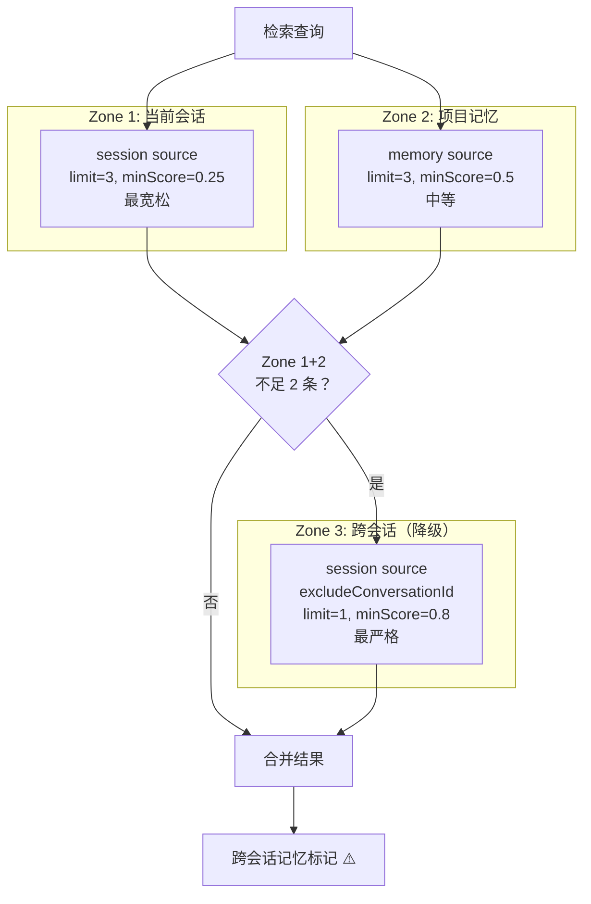
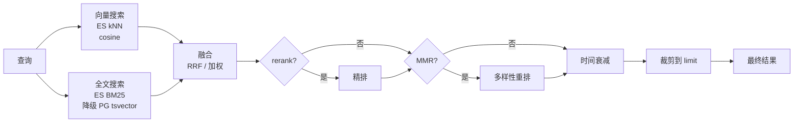

# 第 12 章 记忆系统

> "没有记忆的智能，只是反复的计算。"

记忆系统让数字员工能够积累经验、复用知识。WinMatrix 的记忆系统不是简单的向量数据库——它是一个包含热记忆（Redis）、会话转录、长期记忆和夜间整理的多层架构，配合三区检索和混合搜索算法。本章将深入这些实现。

## 12.1 记忆系统的真实架构

需要澄清一个重要事实：WinMatrix 的记忆系统**并非**按字面意义上的"WorkingMemory / SessionMemory / LongTermMemory"命名的类来组织。实际的分层通过以下机制表达：

```typescript
// src/infrastructure/memory/types.ts（第 9 行）
export type MemorySource = 'memory' | 'session' | 'pmdoc';
```

三种记忆来源 + Redis 热层 + 整理后的长期记忆，构成了实际的记忆架构：

| 概念层 | 实际代码 | 存储 |
|--------|---------|------|
| 工作/热记忆 | `conversationMemory.ts` | Redis（进程内回退） |
| 会话转录 | `syncSessionTranscriptsToMemory.ts` → `session` source | PG + ES |
| 项目长期记忆 | `MemoryService` → `memory` source | PG + ES |
| PMDoc 知识 | `pmdoc` source | 项目文档 |
| 整理后记忆 | `MemoryConsolidationService.ts` | 文件 |

```typescript
// src/infrastructure/memory/index.ts（第 1-8 行）
/**
 * 记忆系统 - 统一入口
 *
 * 提供员工长期记忆能力：
 * - Elasticsearch 向量存储 + PG tsvector 全文检索 + 混合检索
 * - 文件监听增量同步
 * - 记忆搜索 / 获取工具
 */
```

## 12.2 三区检索：渐进式召回

记忆检索的核心是**三区检索**（Three-Zone Retrieval）——这是一种渐进式召回策略：

```typescript
// src/agents/core/ai-kernel/context/adapters/MemoryContextBootstrap.ts（第 28-34 行）
// 三区检索常量
const ZONE1_LIMIT = 3;          // 当前会话 session
const ZONE1_MIN_SCORE = 0.25;
const ZONE2_LIMIT = 3;          // 项目 memory
const ZONE2_MIN_SCORE = 0.5;
const ZONE3_LIMIT = 1;          // 跨会话 session（降级）
const ZONE3_MIN_SCORE = 0.8;
```



### 三区执行逻辑

```typescript
// src/agents/core/ai-kernel/context/adapters/MemoryContextBootstrap.ts（第 167-226 行）
// Zone 1: 当前会话 session
if (conversationId && input.projectId) {
  const zone1Results = await memoryService.search({
    query: input.searchQuery,
    projectId: input.projectId,
    conversationId,                    // 限定当前会话
    sources: ['session'],
    limit: ZONE1_LIMIT,                // 3 条
    minScore: ZONE1_MIN_SCORE,         // 0.25
    hybrid: true,
  });
  results.push(...zone1Results.map(r => ({ ...r, isCrossConversation: false })));
}

// Zone 2: 项目 memory
if (input.projectId) {
  const zone2Results = await memoryService.search({
    query: input.searchQuery,
    projectId: input.projectId,
    agentId: input.agentId,
    sources: ['memory'],
    limit: ZONE2_LIMIT,                // 3 条
    minScore: ZONE2_MIN_SCORE,         // 0.5
    hybrid: true,
  });
  results.push(...zone2Results);
}

// Zone 3: 跨会话 session（仅当 Zone 1+2 不足 2 条时触发）
if (results.length < 2 && conversationId && input.projectId) {
  const zone3Results = await memoryService.search({
    query: input.searchQuery,
    projectId: input.projectId,
    excludeConversationId: conversationId,  // 排除当前会话
    sources: ['session'],
    limit: ZONE3_LIMIT,                // 1 条
    minScore: ZONE3_MIN_SCORE,         // 0.8（最严格）
    hybrid: true,
  });
  results.push(...zone3Results.map(r => ({ ...r, isCrossConversation: true })));
}
```

### 渐进式阈值的设计意图

三个区的阈值递增（0.25 → 0.5 → 0.8），反映了不同的信任级别：

- **Zone 1（当前会话，0.25）**：最宽松，因为当前会话的上下文最相关
- **Zone 2（项目记忆，0.5）**：中等，项目级记忆经过整理，质量较高
- **Zone 3（跨会话，0.8）**：最严格，因为跨会话记忆可能不相关，需要高置信度

### 跨会话警告

```typescript
// 跨会话记忆标记，提示 LLM 审慎参考
'[跨会话记忆] ⚠️ 来自其他会话，请审慎参考'
```

跨会话记忆会被特殊标记，提醒 LLM 这些信息来自其他会话，需要谨慎对待。

### OpenClaw 式自动注入

```typescript
// src/agents/core/ai-kernel/context/adapters/MemoryContextBootstrap.ts（第 1-6 行）
/**
 * 长期记忆上下文 Bootstrap（OpenClaw 式自动触发）
 *
 * 在每轮构造 Agent 系统提示词前，根据当前/最近用户输入做一次长期记忆检索，
 * 将 top-k 结果注入到系统提示的「相关记忆」段落，模型无需显式调用 memory_search 即可看到相关记忆。
 */
```

这种"自动注入"设计意味着 LLM 不需要主动调用记忆搜索工具——系统在构造提示词前自动检索并注入相关记忆。

## 12.3 混合检索引擎

`HybridSearch.ts` 实现了向量 + 全文的混合检索：

```typescript
// src/infrastructure/memory/HybridSearch.ts（第 1-8 行）
/**
 * 混合检索引擎
 *
 * - 向量搜索（Elasticsearch kNN 余弦相似度）
 * - 全文搜索（ES BM25 match 优先；降级回 PG tsvector）
 * - 融合策略：RRF（默认）或加权线性
 * - 可选 rerank 精排 + MMR 多样性重排
 */
```

### 默认配置

```typescript
// src/infrastructure/memory/HybridSearch.ts（第 26-38 行）
const DEFAULT_CONFIG: HybridSearchConfig = {
  vectorWeight: 0.7,    // 向量权重 70%
  textWeight: 0.3,      // 全文权重 30%
};

const DEFAULT_RRF_K = 60;              // RRF 默认 k 值
const DEFAULT_MIN_SCORE = 0.3;         // 默认最低分数
const OVER_RETRIEVAL = 2;              // 超检索系数（多取 2 倍）
```

### 检索管线

```typescript
// src/infrastructure/memory/HybridSearch.ts（第 90-100 行）
/**
 * 执行混合检索
 *
 * 并行执行向量搜索和全文搜索，然后按策略融合。
 * 可选链路：融合 → rerank → MMR → 时间衰减 → 裁剪
 */
export async function hybridSearch(opts: MemorySearchOptions): Promise<MemorySearchResult[]> {
  const limit = opts.limit ?? 10;
  const minScore = opts.minScore ?? DEFAULT_MIN_SCORE;
  const useHybrid = opts.hybrid !== false;
  const overLimit = limit * OVER_RETRIEVAL;   // 初筛多取 2 倍
```



### 时间衰减

记忆的新鲜度影响相关性——越新的记忆权重越高：

```typescript
// src/infrastructure/memory/HybridSearch.ts（第 40-68 行）
export function calculateTimeDecayFactor(ageDays: number): number {
  if (!Number.isFinite(ageDays) || ageDays <= 0) return 1;
  return 0.5 + 0.5 * Math.exp(-0.05 * ageDays);   // 指数衰减
}

export function applyTimeDecay(results: MemorySearchResult[], now: Date = new Date()): MemorySearchResult[] {
  return results
    .map((result) => {
      const timestamp = getResultTime(result);
      if (!timestamp) return result;
      const ageDays = Math.max(0, (now.getTime() - timestamp.getTime()) / 86_400_000);
      const factor = calculateTimeDecayFactor(ageDays);
      return { ...result, score: result.score * factor };   // 分数 × 衰减因子
    })
    .sort((a, b) => b.score - a.score);
}
```

衰减公式 `0.5 + 0.5 * exp(-0.05 * ageDays)`：

- **当天（ageDays=0）**：factor = 1.0（满分）
- **14 天前**：factor ≈ 0.77
- **30 天前**：factor ≈ 0.62
- **90 天前**：factor ≈ 0.5（最低，不会归零）

这个公式确保旧记忆权重降低但不会完全消失。

### 完整搜索选项

```typescript
// src/infrastructure/memory/types.ts（第 70-106 行）
export interface MemorySearchOptions {
  query: string;
  limit?: number;
  minScore?: number;
  sources?: MemorySource[];           // memory | session | pmdoc
  projectId?: string;
  agentId?: string;
  conversationId?: string;             // Zone 1 过滤
  excludeConversationId?: string;     // Zone 3 过滤（跨会话）
  hybrid?: boolean;
  fusionStrategy?: 'rrf' | 'weighted';
  rrfK?: number;
  vectorWeight?: number;
  textWeight?: number;
  rerank?: boolean;
  rerankConfig?: Partial<RerankerConfig>;
  mmr?: boolean;
  mmrLambda?: number;
}
```

## 12.4 会话转录 → 长期记忆同步

`syncSessionTranscriptsToMemory.ts` 实现了增量同步：

```typescript
// src/infrastructure/memory/syncSessionTranscriptsToMemory.ts（第 1-19 行）
/**
 * 会话转录 → 长期记忆 增量同步管理器
 *
 * 借鉴 OpenClaw 的 sync-session-files + MemoryIndexManager 增量机制
 *
 * ┌────────────────────────────────────────────────────────────────┐
 * │  ConversationService.addUserMessage / addAssistantMessage      │
 * │    ↓ appendTranscriptEntry → PG session_transcript 表          │
 * │    ↓ markDirty(conversationId) → dirty set                    │
 * │    ↓ scheduleSync() 防抖 10s                                  │
 * │    ↓ syncDirtyKeys() → 仅同步变更的会话                       │
 * │        ↓ formatTranscriptAsMarkdown → indexContent              │
 * │            ↓ hash 比较（PG memory_files）跳过未变更            │
 * │            ↓ chunkText + 双写 PG memory_chunks / ES            │
 * │ ├──────────────────────────────────────────────────────────────┤
 * │  startPeriodicSync(30min) → 全量同步兜底                       │
 * │ └──────────────────────────────────────────────────────────────┘
 */
```

### 同步常量

```typescript
// src/infrastructure/memory/syncSessionTranscriptsToMemory.ts（第 33-43 行）
const SESSION_PATH_PREFIX = 'session/';
const MAX_SESSIONS_PER_FULL_SYNC = 200;     // 全量同步最大会话数
const MAX_MESSAGES_PER_SESSION = 500;        // 每会话最大消息数
const SYNC_DEBOUNCE_MS = 10_000;             // 增量同步防抖（10s）
const PERIODIC_SYNC_INTERVAL_MS = 30 * 60 * 1000;  // 定时全量同步（30min）
const REDIS_DIRTY_SET_KEY = 'memory-sync:dirty-keys';
```

### 增量同步的关键：Hash 比较

```typescript
// ↓ hash 比较（PG memory_files）跳过未变更
```

每次同步前，系统计算会话内容的 hash，与 `memory_files` 表中的 hash 比较。如果一致，跳过重新索引——这避免了重复的向量化计算。

## 12.5 memorySyncWorker

同步由 BullMQ Worker 异步执行：

```typescript
// src/interface/workers/memorySyncWorker.ts（完整 45 行）
export function startMemorySyncWorker(): void {
  if (worker) return;
  worker = new Worker<MemorySyncJobData>(
    'memory-sync',
    async (job) => {
      if (!job) return;
      const data = job.data;
      if (data.type === 'full') {
        const result = await transcriptSyncManager.syncAll();      // 全量
        logger.info(`[MemorySyncWorker] full sync: synced=${result.synced}`);
        return;
      }
      await transcriptSyncManager.syncDirtyKeys();                  // 增量（脏键）
    },
    { connection: bullmqWorkerConnection, concurrency: 3 },
  );
}
```

两种任务模式：

- **full**：全量同步（最多 200 个会话）
- **dirty**：增量同步（仅 Redis dirty set 中的会话）

## 12.6 夜间记忆整理

`MemoryConsolidationService` 在夜间定时整理记忆：

```typescript
// src/infrastructure/memory/MemoryConsolidationService.ts（第 1-12 行）
/**
 * 记忆整理服务
 *
 * 夜间定时任务调用，基于 SessionMemoryExtractor 产出的每日记忆文件（YYYYMMDD.md）
 * 做二次加工，按成员 / 项目维度整理为长期记忆文件：
 *
 * - 成员记忆：00_共享/memory/成员记忆_{member.name}.md
 * - 项目记忆：00_共享/memory/项目记忆.md
 *
 * 每个文件最多 500 行；超过时用 LLM 摘要最旧条目以控制长度。
 * 文件 frontmatter 中记录 lastConsolidatedAt，实现增量整理。
 */
```

整理逻辑：

1. **按维度分类**：成员记忆 + 项目记忆
2. **长度控制**：每个文件最多 500 行
3. **LLM 摘要**：超长时用 LLM 摘要最旧条目
4. **增量整理**：`lastConsolidatedAt` frontmatter 记录上次整理时间

## 12.7 对话热记忆（Redis）

`conversationMemory.ts` 提供 Redis 支持的热记忆，带进程内回退：

```typescript
// src/infrastructure/memory/conversationMemory.ts（第 1-4 行）
/**
 * Agent 对话内存管理
 * 使用 Redis 存储对话历史与会话元数据；
 * Redis 不可用时回退到进程内内存（便于本地开发不依赖 Redis）。
 */

// 内存回退：会话历史 conversation:id -> string[]
const memoryHistory = new Map<string, string[]>();
// 内存回退：会话元数据 meta:id -> SessionMeta
const memoryMeta = new Map<string, SessionMeta>();
// 内存回退：spawnedBy childId -> parentId
const memorySpawnedBy = new Map<string, string>();
// 内存回退：children parentId -> Set<childId>
const memoryChildren = new Map<string, Set<string>>();
```

`withRedis` 包装器实现优雅降级——Redis 不可用时自动回退到进程内 Map，方便本地开发。

## 12.8 向量存储

向量存储使用 Elasticsearch：

```
src/infrastructure/elasticsearch/
├── client.ts           # ES 客户端
├── index.ts            # barrel
└── indexTemplates.ts   # 索引模板（mapping/settings）

src/infrastructure/vectorstore/
└── ElasticsearchVectorStore.ts   # 向量存储包装器
```

PG 的 `memory_chunks` 表使用 `tsvector` 全文索引：

```prisma
// prisma/schema.prisma
model memory_chunks {
  id           String                   @id
  path         String
  source       String                   @default("memory")
  text         String
  tsv          Unsupported("tsvector")?
  @@index([tsv], map: "idx_memory_chunks_tsv", type: Gin)  // GIN 全文索引
  @@map("memory_chunks")
}
```

PG 的 GIN 索引支持高效的全文检索，作为 ES 降级时的后备。

## 本章小结

本章深入分析了 WinMatrix 的记忆系统：

1. **真实架构**：3 种 MemorySource（memory/session/pmdoc）+ Redis 热层 + 整理后记忆
2. **三区检索**：当前会话（0.25）→ 项目记忆（0.5）→ 跨会话（0.8），渐进式阈值
3. **跨会话警告**：跨会话记忆标记 ⚠️，提示 LLM 审慎参考
4. **自动注入**：OpenClaw 式，构造提示词前自动检索，无需显式调用
5. **混合检索**：向量 70% + 全文 30%，RRF/加权融合 + rerank + MMR + 时间衰减
6. **时间衰减**：`0.5 + 0.5 * exp(-0.05 * ageDays)`，新记忆权重高但不归零
7. **增量同步**：Hash 比较跳过未变更，dirty set 防抖 10s，30min 全量兜底
8. **夜间整理**：按成员/项目分类，500 行限制，LLM 摘要超长内容
9. **优雅降级**：Redis 不可用时回退进程内 Map，ES 不可用时降级 PG tsvector

在下一章中，我们将进入技能与工具系统。
