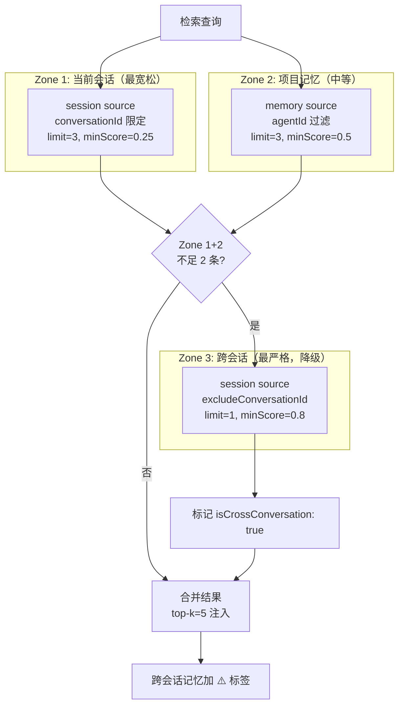
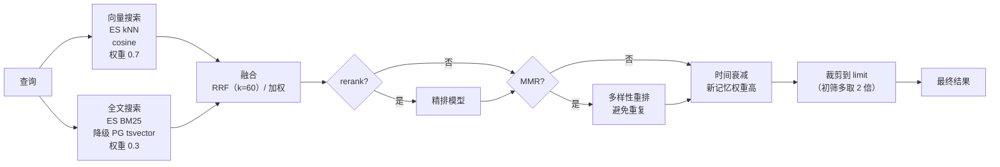
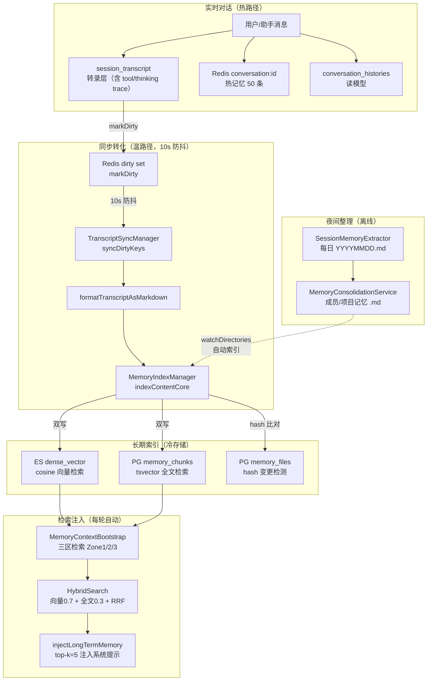

# 第 12 章 记忆系统

> "没有记忆的智能，只是反复的计算；有了记忆，每一次对话才是真正的积累。"

记忆系统让数字员工能够积累经验、复用知识、跨会话学习。但 WinMatrix 的记忆系统不是一个简单的向量数据库——它是一个三层架构（会话层 / 转录层 / 长期索引层）、三区检索（Zone1/2/3 渐进式召回）、混合检索（PG tsvector BM25 + ES dense_vector cosine）、自动注入（构造提示词前自动检索）、自动转化（会话转录 → 长期记忆）的综合体系。

本章会先澄清一个容易讲错的认知——**WinMatrix 的记忆系统并非按字面意义上的 "WorkingMemory / SessionMemory / LongTermMemory" 命名的类来组织**。实际的分层通过存储机制表达，而不是类名。先把真实架构立清楚，再深入三区检索、混合检索、同步转化、夜间整理。

## 12.1 三层记忆的真实架构

需要先把一个早期版本容易讲混的事实纠正过来。WinMatrix 的记忆系统**不是**按 `WorkingMemory` / `SessionMemory` / `LongTermMemory` 这些命名的类来组织的。实际的分层通过三种 `MemorySource` + 存储机制表达：

```typescript
// src/infrastructure/memory/types.ts（第 9 行）
export type MemorySource = 'memory' | 'session' | 'pmdoc';
```

三种 MemorySource 对应三种"记忆来源"，加上不同的存储后端，构成实际的分层：

| 层 | 实际代码 | 存储 | 内容 |
|----|---------|------|------|
| **会话层（热记忆）** | `ConversationService` + `conversationMemory.ts` | Redis `conversation:{id}`（最多 50 条）+ PG `conversation_histories` | 当前对话的近期消息 |
| **转录层** | PG `session_transcript` 表 | PG | 完整对话转录，含 tool_call / thinking trace |
| **长期索引层** | `MemoryIndexManager` → `memory` / `session` source | PG `memory_chunks` + `memory_files` + ES `dense_vector` | 沉淀的长期记忆，可检索 |
| **PMDoc 知识** | `pmdoc` source | 项目文档文件 | 项目级文档知识 |
| **整理后记忆** | `MemoryConsolidationService` | 文件（成员记忆 / 项目记忆 .md） | 夜间整理后的结构化记忆 |

```typescript
// src/infrastructure/memory/index.ts（第 1-8 行）
/**
 * 记忆系统 - 统一入口
 *
 * 提供员工长期记忆能力：
 * - Elasticsearch 向量存储 + PG tsvector 全文检索 + 混合检索
 * - 文件监听增量同步
 * - 记忆搜索 / 获取工具
 */
```

注意三种 MemorySource 和三层存储的对应关系：

- `session` source：来自转录层（会话转录沉淀的记忆），按会话粒度组织。
- `memory` source：来自项目长期记忆（整理后的结构化记忆、文档知识）。
- `pmdoc` source：来自 PMDoc 项目文档。

三区检索（12.2）就是在这三种 source 上做分区召回。

### 会话层：Redis 热记忆（50 条上限）

`conversationMemory.ts` 提供基于 Redis 的会话热记忆：

```typescript
// src/infrastructure/memory/conversationMemory.ts（第 1-4 行）
/**
 * Agent 对话内存管理
 * 使用 Redis 存储对话历史与会话元数据；
 * Redis 不可用时回退到进程内内存（便于本地开发不依赖 Redis）。
 */
```

Redis 存储用 `conversation:{sessionId}` 作为 key（第 71/98 行），并且有一个硬上限——**最多 50 条**：

```typescript
// src/infrastructure/memory/conversationMemory.ts（第 105 行）
pipeline.ltrim(key, -50, -1);   // Redis 路径：保留最后 50 条

// 第 111 行
memoryHistory.set(sessionId, payloads.slice(-50));   // 进程内回退：同样保留最后 50 条
```

`ltrim(key, -50, -1)` 是 Redis 的列表裁剪——保留最后 50 个元素，更早的自动丢弃。这是"滑动窗口"式的热记忆：只保留最近的对话，足够支撑当前上下文，老对话自动淘汰（它们已经被转录层和长期索引层沉淀下来了）。

进程内回退（`memoryHistory` / `memoryMeta` / `memorySpawnedBy` / `memoryChildren` 四个 Map）让本地开发不依赖 Redis 也能跑——`withRedis` 包装器实现优雅降级。

### 转录层：session_transcript

PG 的 `session_transcript` 表是 LLM 上下文的真源（见事实清单"会话三层分工"）。它和 `conversation_histories`（读模型）的分工：

- `conversation_histories`：**读模型**，供 UI 展示、列表查询。结构精简。
- `session_transcript`：**LLM 上下文真源**，含完整的 tool_call / thinking trace。这是数字员工"记忆"的权威来源。
- `conversation_meta`：**权威元数据**（会话标题、归属、状态等）。

转录层不仅存对话文本，还存 LLM 的思考过程（thinking trace）和工具调用记录（tool_call）——这些是技能进化（第 13 章 SkillTrace 提取）和可审计性的数据基础。

### 长期索引层：memory_chunks + memory_files

```prisma
// prisma/schema.prisma（第 536-558 行）
model memory_chunks {
  id           String                   @id
  path         String
  source       String                   @default("memory")   // memory | session | pmdoc
  start_line   Int?                     @map("start_line")
  end_line     Int?                     @map("end_line")
  hash         String?
  text         String
  chroma_id    String?                  @map("chroma_id")    // legacy
  project_id   String?                  @map("project_id")
  agent_id     String?                  @map("agent_id")     // 员工维隔离
  tsv          Unsupported("tsvector")?
  @@index([tsv], map: "idx_memory_chunks_tsv", type: Gin)   // GIN 全文索引
  @@map("memory_chunks")
}

// prisma/schema.prisma（第 560-574 行）
model memory_files {
  path         String   @id                             // 路径即主键
  source       String   @default("memory")
  hash         String?
  mtime        BigInt?
  size         Int?
  project_id   String?  @map("project_id")
  agent_id     String?  @map("agent_id")
  @@map("memory_files")
}
```

两个表的分工：

- `memory_files`：**文件级元数据**，path 是主键，记录 hash / mtime / size。用于变更检测（12.5 节）。
- `memory_chunks`：**分块级内容**，一个 file 被切成多个 chunk，每个 chunk 带 text + tsv（全文索引）+ project_id / agent_id（隔离）。

几个关键设计：

- **`agent_id` 员工维隔离**：记忆按员工隔离。大福的记忆只被大福召回，不污染阿码。综合区（`projectId='_general'`）不传 projectId 时检索全库。
- **GIN 索引 on tsv**：PostgreSQL 的 GIN（Generalized Inverted Index）支持高效的全文检索，是 ES 降级时的后备。
- **`chroma_id` legacy 字段**：早期用 Chroma 向量库，迁移到 ES 后保留字段做兼容。

## 12.2 三区检索：渐进式召回

记忆检索的核心是**三区检索**（Three-Zone Retrieval）——这是一种渐进式召回策略，按信任级别和相关性阈值分三层。

### 三区常量

```typescript
// src/agents/core/ai-kernel/context/adapters/MemoryContextBootstrap.ts（第 29-34 行）
const ZONE1_LIMIT = 3;          // 当前会话 session
const ZONE1_MIN_SCORE = 0.25;
const ZONE2_LIMIT = 3;          // 项目 memory
const ZONE2_MIN_SCORE = 0.5;
const ZONE3_LIMIT = 1;          // 跨会话 session（降级）
const ZONE3_MIN_SCORE = 0.8;
```

```typescript
// src/agents/core/ai-kernel/context/adapters/MemoryContextBootstrap.ts（第 22 行）
const DEFAULT_MEMORY_LIMIT = 5;   // 注入到提示词的 top-k
```

三个区的参数递增（limit 3/3/1，minScore 0.25/0.5/0.8），反映了不同的信任级别。

### 三区执行逻辑

```typescript
// src/agents/core/ai-kernel/context/adapters/MemoryContextBootstrap.ts（第 167-224 行）
// Zone 1: 当前会话 session
if (conversationId && input.projectId) {
  const zone1Results = await memoryService.search({
    query: input.searchQuery,
    projectId: input.projectId,
    conversationId,                    // 限定当前会话
    sources: ['session'],
    limit: ZONE1_LIMIT,                // 3 条
    minScore: ZONE1_MIN_SCORE,         // 0.25
    hybrid: true,
  });
  results.push(...zone1Results.map(r => ({ ...r, isCrossConversation: false })));
}

// Zone 2: 项目 memory
if (input.projectId) {
  const zone2Results = await memoryService.search({
    query: input.searchQuery,
    projectId: input.projectId,
    agentId: input.agentId,            // 员工维过滤
    sources: ['memory'],
    limit: ZONE2_LIMIT,                // 3 条
    minScore: ZONE2_MIN_SCORE,         // 0.5
    hybrid: true,
  });
  results.push(...zone2Results.map(r => ({ ...r, isCrossConversation: false })));
}

// Zone 3: 跨会话 session（仅当 Zone 1+2 不足 2 条时触发）
if (results.length < 2 && conversationId && input.projectId) {
  const zone3Results = await memoryService.search({
    query: input.searchQuery,
    projectId: input.projectId,
    excludeConversationId: conversationId,   // 排除当前会话
    sources: ['session'],
    limit: ZONE3_LIMIT,                      // 1 条
    minScore: ZONE3_MIN_SCORE,               // 0.8（最严格）
    hybrid: true,
  });
  results.push(...zone3Results.map(r => ({ ...r, isCrossConversation: true })));
}
```



### 渐进式阈值的设计意图

三个区的阈值递增（0.25 → 0.5 → 0.8），背后是不同的信任级别：

- **Zone 1（当前会话，0.25）**：最宽松。当前会话的上下文高度相关——刚才聊过的东西，即使语义模糊也值得召回。低阈值保证"宁可多召回"。
- **Zone 2（项目记忆，0.5）**：中等。项目级记忆经过整理（夜间整理、人工沉淀），质量较高但可能时间久远，需要中等置信度。
- **Zone 3（跨会话，0.8）**：最严格。跨会话记忆来自完全不同的对话上下文，可能不相关，需要高置信度才召回。

### Zone 3 的条件触发：避免跨会话污染

Zone 3 有一个重要的触发条件——**仅当 Zone 1+2 不足 2 条时才触发**（`results.length < 2`）。这是一个防跨会话污染的设计：

- 如果当前会话和项目记忆已经提供了足够的上下文（≥2 条），就不去翻跨会话的记忆——那些记忆相关性低，强行注入可能误导 LLM。
- 只有当前上下文严重不足（<2 条）时，才"降级"到跨会话检索，且用最严格的 0.8 阈值，只召回高度相关的。

### 跨会话警告标记

```typescript
// src/agents/core/ai-kernel/context/adapters/MemoryContextBootstrap.ts（第 88-93 行）
function formatMemoryResults(results: Array<MemorySearchResult & { isCrossConversation?: boolean }>): string {
  // ...
  const crossSessionTag = r.isCrossConversation
    ? '[跨会话记忆] ⚠️ 来自其他会话，请审慎参考 '
    : '';
  // ...
}
```

跨会话记忆会被加上 `[跨会话记忆] ⚠️ 来自其他会话，请审慎参考` 的标签注入到提示词。这是对 LLM 的"提示"——这条记忆来自别的会话，相关性可能不高，参考时要谨慎。这种"让 LLM 自己判断该不该信"的设计，比硬性过滤（直接不注入跨会话记忆）更灵活——偶尔跨会话记忆会非常有价值（如"上次用户提过他偏好简洁回复"），一刀切过滤会丢失这些信号。

## 12.3 自动注入：OpenClaw 式无需显式调用

```typescript
// src/agents/core/ai-kernel/context/adapters/MemoryContextBootstrap.ts（第 1-6 行）
/**
 * 长期记忆上下文 Bootstrap（OpenClaw 式自动触发）
 *
 * 在每轮构造 Agent 系统提示词前，根据当前/最近用户输入做一次长期记忆检索，
 * 将 top-k 结果注入到系统提示的「相关记忆」段落，模型无需显式调用 memory_search 即可看到相关记忆。
 */
```

这段注释点出了 WinMatrix 记忆系统的一个关键设计决策——**自动注入，而非显式调用**。

### 两种记忆访问范式的对比

业界有两种让 LLM 访问记忆的范式：

| 范式 | 机制 | 优点 | 缺点 |
|------|------|------|------|
| **显式调用** | LLM 通过 `memory_search` 工具主动查 | 按需检索，省 token | 依赖 LLM 判断"该不该查"，可能漏查 |
| **自动注入** | 系统在构造提示词前自动检索注入 | 不依赖 LLM 判断，保证相关记忆可见 | 每轮都检索，可能注入不相关内容 |

WinMatrix 选了**自动注入为主**（OpenClaw 式），同时保留了 `memory_search` 工具（`business-tools/memory/MemorySearchTool.ts`）作为 LLM 的补充手段。这是一个"两者结合"的稳健选择——自动注入保证记忆可见性，显式工具应对需要精细查询的场景。

### 注入主入口

```typescript
// src/agents/core/ai-kernel/context/adapters/MemoryContextBootstrap.ts（第 370 行）
export async function injectLongTermMemory(input: {
  // ...
}): Promise<{ /* ... */ }> {
  // 调 searchLongTermMemoryResults（三区检索）
  // 调 formatMemoryResults 格式化为带类型标签的 Markdown
  // 注入到系统提示词的「相关记忆」段落
}
```

`injectLongTermMemory` 是注入主入口。它在**每轮构造系统提示词前**被调用，流程：

1. **三区检索**（`searchLongTermMemoryResults`，第 127 行）：按 Zone1/2/3 召回相关记忆。
2. **格式化**（`formatMemoryResults`，第 88 行）：把检索结果格式化为带类型标签的 Markdown 文本，包含 `[decision/finding/preference/constraint/info]` 类型标签、相关度分数、来源。
3. **注入**：把格式化后的文本拼到系统提示词的「相关记忆」段落。

### 记忆引用检测

```typescript
// src/agents/core/ai-kernel/context/adapters/MemoryContextBootstrap.ts（第 101 行）
function checkMemoryReference(injectedMemories, llmOutput): boolean
```

`checkMemoryReference` 检测 LLM 输出是否引用了注入的记忆。这是一个反馈机制——如果系统注入了记忆但 LLM 完全没引用，可能意味着注入的记忆不相关（下次召回策略要调）；如果 LLM 引用了，说明记忆有用（强化这条记忆的权重）。这个信号会反哺记忆系统的优化。

### 上下文可判定性

每轮注入有明确的数量上限，保证上下文可判定（不会无限膨胀）：

| 维度 | 上限 | 来源 |
|------|------|------|
| 长期记忆注入 | top-k=5 | `DEFAULT_MEMORY_LIMIT = 5` |
| 对话历史 | 最近 10 条 | `getRecentMemory(10)` |
| 工作上下文 | 10 项 | `getWorkingContext(10)` |
| 观测 | 全量快照 | `llm_context_snapshot` 事件 |

注意第 11 章的 `getRecentMessages(conversationId, 30)` 是 Turn 层取的对话历史（30 条），这里 `getRecentMemory(10)` 是记忆层取的（10 条）——两者是不同的窗口，服务不同目的。Turn 层的 30 条是"当前对话上下文"，记忆层的 10 条是"相关工作上下文"。

## 12.4 混合检索引擎

`HybridSearch.ts` 实现向量 + 全文的混合检索：

```typescript
// src/infrastructure/memory/HybridSearch.ts（第 1-8 行）
/**
 * 混合检索引擎
 *
 * - 向量搜索（Elasticsearch kNN 余弦相似度）
 * - 全文搜索（ES BM25 match 优先；降级回 PG tsvector）
 * - 融合策略：RRF（默认）或加权线性
 * - 可选 rerank 精排 + MMR 多样性重排
 */
```

### 默认配置

```typescript
// src/infrastructure/memory/HybridSearch.ts（第 26-38 行）
const DEFAULT_CONFIG: HybridSearchConfig = {
  vectorWeight: 0.7,    // 向量权重 70%
  textWeight: 0.3,      // 全文权重 30%
};

const DEFAULT_RRF_K = 60;              // RRF 默认 k 值
const DEFAULT_MIN_SCORE = 0.3;         // 默认最低分数
const OVER_RETRIEVAL = 2;              // 超检索系数（多取 2 倍）
```

向量权重 0.7、全文权重 0.3——这是一个偏向语义检索的配比。语义检索（向量）能理解"意思相近"，全文检索（BM25）精确匹配关键词。7:3 的配比让语义占主导，但保留关键词精确匹配的能力。

### 检索管线

```typescript
// src/infrastructure/memory/HybridSearch.ts（第 90-100 行）
export async function hybridSearch(opts: MemorySearchOptions): Promise<MemorySearchResult[]> {
  const limit = opts.limit ?? 10;
  const minScore = opts.minScore ?? DEFAULT_MIN_SCORE;
  const useHybrid = opts.hybrid !== false;
  const overLimit = limit * OVER_RETRIEVAL;   // 初筛多取 2 倍
```

`OVER_RETRIEVAL = 2` 是一个精妙的设计——**初筛多取 2 倍**。如果要 top-5，初筛先取 10 条，然后经过 rerank / MMR / 时间衰减精排，最后裁剪到 5 条。多取的目的是给精排留余地——精排可能调整顺序，初筛太少会丢失潜在的好结果。



### 时间衰减：新旧记忆的权重平衡

记忆的新鲜度影响相关性——越新的记忆权重越高：

```typescript
// src/infrastructure/memory/HybridSearch.ts（第 40-42 行）
export function calculateTimeDecayFactor(ageDays: number): number {
  if (!Number.isFinite(ageDays) || ageDays <= 0) return 1;
  return 0.5 + 0.5 * Math.exp(-0.05 * ageDays);   // 指数衰减
}
```

衰减公式 `0.5 + 0.5 * exp(-0.05 * ageDays)`：

| ageDays | factor | 说明 |
|---------|--------|------|
| 0（当天） | 1.0 | 满分 |
| 14（两周前） | ≈0.77 | 轻微衰减 |
| 30（一个月前） | ≈0.62 | 明显衰减 |
| 90（三个月前） | ≈0.5 | 触底（不再下降） |

这个公式有两个关键性质：

1. **新记忆权重高**：当天记忆满分（factor=1.0），衰减到 30 天约 0.62。
2. **旧记忆不归零**：衰减有下限 0.5，即使半年前的记忆仍保留一半权重。这很重要——有些旧记忆（如项目架构决策、用户长期偏好）不应该因为时间久就完全消失。

如果用单纯的 `exp(-0.05 * ageDays)`，90 天的 factor 会降到 0.01，等于"忘记"了；加 0.5 的下限保证旧记忆始终可被召回，只是排序靠后。

### 完整搜索选项

```typescript
// src/infrastructure/memory/types.ts（第 70-106 行）
export interface MemorySearchOptions {
  query: string;
  limit?: number;
  minScore?: number;
  sources?: MemorySource[];           // memory | session | pmdoc
  projectId?: string;
  agentId?: string;                   // 员工维过滤
  conversationId?: string;            // Zone 1 过滤（限定当前会话）
  excludeConversationId?: string;     // Zone 3 过滤（跨会话，排除当前）
  hybrid?: boolean;
  fusionStrategy?: 'rrf' | 'weighted';
  rrfK?: number;
  vectorWeight?: number;
  textWeight?: number;
  rerank?: boolean;
  rerankConfig?: Partial<RerankerConfig>;
  mmr?: boolean;
  mmrLambda?: number;
}
```

注意 `conversationId` 和 `excludeConversationId` 这对字段——它们直接服务于三区检索。Zone 1 传 `conversationId`（限定当前会话），Zone 3 传 `excludeConversationId`（排除当前会话，查跨会话）。一个字段之差，语义完全相反。

## 12.5 会话转录 → 长期记忆的自动转化

数字员工在对话中积累的经验，需要自动沉淀为长期记忆。`TranscriptSyncManager` 负责这件事。

### 转化流程

```typescript
// src/infrastructure/memory/syncSessionTranscriptsToMemory.ts（第 1-19 行，文件头注释）
/**
 * 会话转录 → 长期记忆 增量同步管理器
 *
 * 借鉴 OpenClaw 的 sync-session-files + MemoryIndexManager 增量机制
 *
 * ┌────────────────────────────────────────────────────────────────┐
 * │  ConversationService.addUserMessage / addAssistantMessage      │
 * │    ↓ appendTranscriptEntry → PG session_transcript 表          │
 * │    ↓ markDirty(conversationId) → dirty set                    │
 * │    ↓ scheduleSync() 防抖 10s                                  │
 * │    ↓ syncDirtyKeys() → 仅同步变更的会话                       │
 * │        ↓ formatTranscriptAsMarkdown → indexContent              │
 * │            ↓ hash 比较（PG memory_files）跳过未变更            │
 * │            ↓ chunkText + 双写 PG memory_chunks / ES            │
 * │ ├──────────────────────────────────────────────────────────────┤
 * │  startPeriodicSync(30min) → 全量同步兜底                       │
 * │ └──────────────────────────────────────────────────────────────┘
 */
```

这个流程图把"会话消息如何变成可检索的长期记忆"讲得非常清楚：

1. **消息写入转录表**：`ConversationService.addUserMessage` / `addAssistantMessage` 每次写消息时 `appendTranscriptEntry` 到 `session_transcript` 表。
2. **标记脏**：`markDirty(conversationId)` 把这个会话加入 Redis 的 dirty set（`REDIS_DIRTY_SET_KEY`）。
3. **防抖调度**：`scheduleSync()` 用 10 秒防抖——10 秒内的多次消息只触发一次同步。
4. **增量同步**：`syncDirtyKeys()` 只同步 dirty set 里的会话（不是全量）。
5. **格式化为 Markdown**：`formatTranscriptAsMarkdown` 把会话转录格式化为 Markdown 文本。
6. **索引**：`indexContent` 把 Markdown 索引到长期记忆（hash 比较 → 分块 → 双写 ES + PG）。

### 同步常量

```typescript
// src/infrastructure/memory/syncSessionTranscriptsToMemory.ts（第 33-43 行）
const SESSION_PATH_PREFIX = 'session/';
const MAX_SESSIONS_PER_FULL_SYNC = 200;     // 全量同步最大会话数
const MAX_MESSAGES_PER_SESSION = 500;        // 每会话最大消息数
const SYNC_DEBOUNCE_MS = 10_000;             // 增量同步防抖（10s）
const PERIODIC_SYNC_INTERVAL_MS = 30 * 60 * 1000;  // 定时全量同步（30min）
const REDIS_DIRTY_SET_KEY = 'memory-sync:dirty-keys';
```

几个常量的含义：

- **10 秒防抖**：用户连续发多条消息时，不会每条都触发同步，10 秒内的消息攒一波同步一次。
- **500 条/会话上限**：超长会话只取最近 500 条做索引，防止超大会话拖慢同步。
- **200 会话/全量上限**：定时全量同步一次最多处理 200 个会话，避免一次性处理太多。

### 三种触发机制

会话→长期记忆的转化有三种触发，互为补充：

| 触发方式 | 时机 | 粒度 | 用途 |
|---------|------|------|------|
| **事件驱动增量** | `markDirty` + 10s 防抖 | 仅变更会话 | 实时性主路径 |
| **定时兜底全量** | `startPeriodicSync(30min)` | 全量（最多 200 会话） | 防漏同步 |
| **启动同步全量** | 进程启动 | 全量 | 冷启动恢复 |

三种触发的分工：事件驱动是主路径（实时），定时兜底防"事件丢失"（如 Redis 重启 dirty set 清空），启动同步保证新进程拉起后记忆是最新的。

### markDirty 与防抖

```typescript
// src/infrastructure/memory/syncSessionTranscriptsToMemory.ts（第 144-173 行）
async markDirty(sessionKey: string): Promise<void> {
  // ...
  await bullmqQueueConnection.sadd(REDIS_DIRTY_SET_KEY, sessionKey);
  // 防抖调度
  setTimeout(() => {
    void this.syncDirtyKeys().catch((err) => { /* ... */ });
  }, SYNC_DEBOUNCE_MS);
}
```

`markDirty` 把会话 key 加入 Redis set，然后调度一个 10 秒后的 `syncDirtyKeys`。防抖的关键在于——10 秒内多次 `markDirty` 同一会话，set 里只存一份（`sadd` 天然去重），且只有一个 setTimeout 在跑（实际实现里会 clear 上一个 timer）。

### syncDirtyKeys：原子取脏键

```typescript
// src/infrastructure/memory/syncSessionTranscriptsToMemory.ts（第 179-194 行）
async syncDirtyKeys(): Promise<{ synced: number; chunks: number; errors: string[] }> {
  const pipeline = bullmqQueueConnection.multi();
  pipeline.smembers(REDIS_DIRTY_SET_KEY);   // 读取脏键集合
  pipeline.del(REDIS_DIRTY_SET_KEY);        // 删除脏键集合
  // ... 原子操作：读 + 删
}
```

`syncDirtyKeys` 用 Redis 的 `multi()` 做原子的"读 + 删"——`smembers` 读取脏键集合，`del` 立即删除。这保证了：即使同步过程中又有新的 `markDirty`，新脏键也不会被这次同步误取（它们会进新的 set，等下一轮）。这是无锁并发安全的经典手法。

### formatTranscriptAsMarkdown：转录格式化

```typescript
// src/infrastructure/memory/syncSessionTranscriptsToMemory.ts（第 56 行）
function formatTranscriptAsMarkdown(/* transcript */): string
```

把会话转录格式化为 Markdown。这一步是"对话 → 文档"的转换——原始转录是结构化的消息序列，格式化后变成 LLM 友好的 Markdown 文本（含时间戳、角色、消息内容）。这个 Markdown 会被索引，未来检索时返回给 LLM。

## 12.6 MemoryIndexManager：双写与去重

`MemoryIndexManager` 是记忆索引的核心，负责把内容索引到 ES + PG 双写。

### 索引核心：hash 去重

```typescript
// src/infrastructure/memory/MemoryIndexManager.ts（第 370-454 行，核心逻辑）
private async indexContentCore(pathKey, content, source, projectId, agentId, fileMeta, logAs): Promise<number> {
  const contentHash = hashContent(content);                    // 计算内容 hash
  const existing = await getMemoryFile(pathKey);               // 读已有记录
  if (existing && existing.hash === contentHash) {
    logger.debug(`[MemoryIndexManager] ${logAs === 'file' ? '文件' : '内容'}未变更，跳过: ${pathKey}`);
    return 0;                                                  // hash 一致，跳过（0 开销）
  }
  if (existing) {
    // 删旧 chunks + ES 旧文档
  }
  const chunks = chunkText(content, pathKey, source, projectId, agentId);
  if (this.esAvailable) {
    try {
      await defaultMemoryVectorStore.addDocuments(chromaIds, documents, metadatas);   // ES 写入
    } catch (esErr) {
      logger.warn(`[MemoryIndexManager] 写入 ES 失败，仅写入 PG: ${getErrorMsg(esErr)}`);
      this.esAvailable = false;                                 // 标记 ES 不可用
    }
  }
  await upsertMemoryFile(memoryFile);                           // PG memory_files
  await upsertMemoryChunks(chunks);                             // PG memory_chunks
}
```

这是整个记忆系统最精巧的一段。三个关键设计：

1. **hash 去重，0 开销跳过**：每次索引前先算内容 hash，和 `memory_files` 表里的 hash 比。如果一致，直接 return 0——不重新分块、不重新向量化、不写任何存储。这是"未变更内容零开销"的设计，让频繁的同步（每 10 秒可能触发）不会产生重复的索引计算。

2. **双写 ES + PG**：内容被分块后，同时写入 ES（向量检索）和 PG（全文检索 + 元数据）。两个存储各有分工——ES 擅长向量近邻检索，PG 的 tsvector + GIN 擅长全文检索。双写让两种检索都能命中。

3. **失败降级**：ES 写入失败时，标记 `esAvailable = false`，后续只写 PG。系统不崩溃，只是失去向量检索能力，降级为纯全文检索。第 113-126 行的 `maybeRecheckElasticsearchAvailability` 还会周期性重试 ES，一旦恢复就重新启用。

### 索引入口

```typescript
// src/infrastructure/memory/MemoryIndexManager.ts（第 299 行）
async indexContent(virtualPath, content, source?, projectId?, agentId?): Promise<number>
```

`indexContent` 是公开的索引入口，接收虚拟路径 + 内容 + source/projectId/agentId。"虚拟路径"是逻辑路径（如 `session/conv_abc.md`），不对应真实文件系统——这让索引可以服务于任何来源（文件、会话、动态生成的内容）。

### search：委托混合检索

```typescript
// src/infrastructure/memory/MemoryIndexManager.ts（第 356 行）
async search(opts: MemorySearchOptions): Promise<MemorySearchResult[]> {
  if (!this.esAvailable) await this.maybeRecheckElasticsearchAvailability();
  return hybridSearch(opts);   // 委托给 HybridSearch
}
```

`search` 在委托给 `hybridSearch` 前，会先检查 ES 是否可用——如果之前标记为不可用，尝试重新 ping。这是自我恢复机制：ES 短暂故障后，系统不会一直停在"ES 不可用"状态，而是会周期性尝试恢复。

### 目录监听：watchDirectories

```typescript
// src/infrastructure/memory/MemoryIndexManager.ts（第 464 行）
watchDirectories(dirs, source?, projectId?, agentId?): void
```

除了会话转录同步，MemoryIndexManager 还支持 `chokidar` 目录监听——当 PMDoc 项目文档或整理后的记忆文件变化时，自动增量索引。这让"文件系统 → 记忆索引"的转化也是实时的。

## 12.7 memorySyncWorker：BullMQ 异步执行

同步由 BullMQ Worker 异步执行，避免阻塞主请求路径：

```typescript
// src/interface/workers/memorySyncWorker.ts（完整 45 行）
export function startMemorySyncWorker(): void {
  if (worker) return;
  worker = new Worker<MemorySyncJobData>(
    'memory-sync',
    async (job) => {
      if (!job) return;
      const data = job.data;
      if (data.type === 'full') {
        const result = await transcriptSyncManager.syncAll();      // 全量
        logger.info(`[MemorySyncWorker] full sync: synced=${result.synced}`);
        return;
      }
      await transcriptSyncManager.syncDirtyKeys();                  // 增量（脏键）
    },
    { connection: bullmqWorkerConnection, concurrency: 3 },
  );
}
```

两种任务模式：

- **`full`**：全量同步（调 `syncAll`，最多 200 个会话）。由定时任务（30 分钟）或启动时触发。
- **`dirty`**（默认）：增量同步（调 `syncDirtyKeys`，仅 Redis dirty set 中的会话）。由事件驱动（10 秒防抖）触发。

`concurrency: 3` 允许 3 个同步任务并行，但增量同步是轻量的（只处理变更会话），不会争抢资源。

## 12.8 夜间记忆整理

`MemoryConsolidationService` 在夜间定时整理记忆，把碎片化的会话记忆提炼为结构化的长期记忆：

```typescript
// src/infrastructure/memory/MemoryConsolidationService.ts（第 1-12 行）
/**
 * 记忆整理服务
 *
 * 夜间定时任务调用，基于 SessionMemoryExtractor 产出的每日记忆文件（YYYYMMDD.md）
 * 做二次加工，按成员 / 项目维度整理为长期记忆文件：
 *
 * - 成员记忆：00_共享/memory/成员记忆_{member.name}.md
 * - 项目记忆：00_共享/memory/项目记忆.md
 *
 * 每个文件最多 500 行；超过时用 LLM 摘要最旧条目以控制长度。
 * 文件 frontmatter 中记录 lastConsolidatedAt，实现增量整理。
 */
```

整理逻辑的四个要点：

1. **按维度分类**：成员记忆（每个成员一个文件）+ 项目记忆（每个项目一个文件）。这是两种不同的检索维度——"这个员工有什么经验" vs "这个项目有什么沉淀"。
2. **长度控制**：每个文件最多 500 行。超过时不是简单截断，而是用 LLM 摘要最旧条目——保留语义精华，丢弃冗长细节。
3. **LLM 摘要**：用小模型做摘要（夜间执行，对延迟不敏感），把多次会话的碎片整理成简洁的记忆条目。
4. **增量整理**：`lastConsolidatedAt` frontmatter 记录上次整理时间，下次只整理新增内容。这让夜间整理是增量的，不是每次都从头来。

整理后的记忆文件会被 `watchDirectories` 监听并自动索引到 memory_chunks（12.6 节），成为可检索的长期记忆。这是"原始转录 → 结构化记忆 → 可检索索引"的三段式沉淀链路。

## 12.8 整体架构回顾

把全章的组件串起来，记忆系统的完整数据流：



四条路径清晰可见：

- **热路径**：实时对话写 Redis（50 条热记忆）+ 转录表 + 读模型。
- **温路径**：10 秒防抖增量同步，转录 → Markdown → 索引双写。
- **冷存储**：ES 向量 + PG 全文，hash 去重，失败降级。
- **检索注入**：每轮三区检索 → 混合融合 → 自动注入系统提示。

## 本章小结

本章深入分析了 WinMatrix 的记忆系统，核心要点：

1. **三层记忆**（非"WorkingMemory/SessionMemory/LongTermMemory"命名类）：会话层（Redis `conversation:{id}` 最多 50 条 + PG `conversation_histories`）/ 转录层（PG `session_transcript` 含 tool/thinking trace）/ 长期索引层（PG `memory_chunks` + `memory_files` + ES `dense_vector`）。三种 `MemorySource`（memory/session/pmdoc）是 source 维度，不是类名。
2. **三区检索**：Zone1 当前会话 session（3 条，0.25 最宽松）→ Zone2 项目 memory（3 条，0.5 中等）→ Zone3 跨会话 session（1 条，0.8 最严格，仅前两区不足 2 条时触发）。阈值递增反映信任级别递减。
3. **跨会话警告**：`[跨会话记忆] ⚠️ 来自其他会话，请审慎参考` 标签提醒 LLM 审慎对待，而非硬性过滤。
4. **自动注入（OpenClaw 式）**：`injectLongTermMemory` 每轮构造系统提示前自动检索（top-k=5），模型无需显式调 `memory_search` 即可看到相关记忆；保留 `memory_search` 工具作为补充。
5. **混合检索**：向量 70% + 全文 30%（RRF/加权融合），`OVER_RETRIEVAL=2` 初筛多取 2 倍给精排留余地，可选 rerank + MMR + 时间衰减（`0.5 + 0.5*exp(-0.05*ageDays)`，新记忆权重高但不归零）。
6. **会话→长期记忆自动转化**：`markDirty` → 10s 防抖 → `syncDirtyKeys`（原子读删 dirty set）→ `formatTranscriptAsMarkdown` → `indexContent(sessions)`。三种触发：事件驱动增量（10s）/ 定时兜底全量（30min，最多 200 会话）/ 启动全量。
7. **双写 + hash 去重**：ES `dense_vector`（cosine）+ PG `tsvector`（BM25/GIN）双写；`hashContent` 比对 `memory_files.hash`，未变更内容 return 0 跳过（0 开销）；ES 失败降级仅 PG，周期性重试恢复。
8. **员工维隔离 + 项目维过滤**：`memory_chunks.agent_id` 按员工隔离，综合区（`projectId='_general'`）不传 projectId 检索全库。
9. **上下文可判定性**：记忆 top-k=5、对话历史 `getRecentMemory(10)`、工作上下文 `getWorkingContext(10)`，每轮注入有明确上限，观测 `llm_context_snapshot` 事件。
10. **夜间整理**：`MemoryConsolidationService` 按成员/项目分类（500 行限制，LLM 摘要超长），`lastConsolidatedAt` 增量整理，整理后文件经 `watchDirectories` 自动索引。
11. **优雅降级链**：Redis 不可用回退进程内 Map；ES 不可用降级纯 PG tsvector + 周期重试；三个存储层各自独立可降级，系统整体不崩。

至此，第 9-12 章构成了 WinMatrix Agent 系统的完整图景：数字员工模型（身份与能力）→ 渐进式决策引擎（决定做什么）→ Turn 执行引擎（决定怎么做）→ 记忆系统（积累与复用）。在下一章中，我们将进入技能与工具系统——数字员工"能做事"的具体能力单元。
