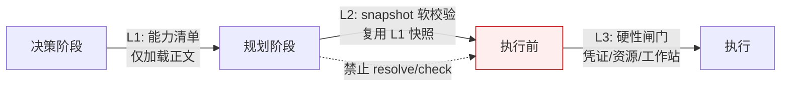

# 第 13 章 技能架构

> "技能让数字员工从'能聊天'变为'能做事'。"

技能（Skill）是数字员工执行具体任务的能力单元——编写 PRD、做代码评审、生成日报，每个都是一项技能。但 WinMatrix 的"技能"并不是一段普通的 prompt，也不是一个简单的函数。它是一个完整的、可治理、可分发、可演进的产物（Artifact）：有自己的清单（manifest）、有版本、有内容哈希、有跨步骤的输入输出契约。

本章从技能的数据模型出发，逐步深入技能的契约系统、就绪检查边界（L1/L2/L3）、治理体系、执行轨迹与蒸馏闭环，最后看一个容易被忽视但极其关键的工程问题——技能 Schema 漂移检测。

## 13.1 技能的本质：从文件到运行时产物

### 技能产物的数据模型

WinMatrix 的技能系统借鉴了 Claude Code 的 Skill 设计——技能本质上是"提示词模板 + Agent 封装 + 契约声明"。所有技能最终都物化为一行 `skill_artifact` 记录：

```prisma
// prisma/schema.prisma（第 1273-1305 行）
model skill_artifact {
  id                    String   @id @default(cuid())
  name                  String              // 技能名
  version               String              // 版本
  artifact_path         String   @map("artifact_path")  // 工件路径
  sha256                String              // 内容哈希
  origin                String              // 来源
  scope                 String              // 作用域（system/project）
  project_name          String?  @map("project_name")
  trust_level           String   @map("trust_level")    // 信任级别
  manifest              Json                // 清单（含步骤、参数、契约）
  persona_eligible      Boolean  @default(true) @map("persona_eligible")  // 分身技能可用性真源
  package_storage_key   String?  @map("package_storage_key")  // MinIO/S3 存储 key
  package_sha256        String?  @map("package_sha256")
  enabled               Boolean  @default(true)
  installed_by          String?  @map("installed_by")
  tags                  String[] @default([])

  @@unique([name, version, scope, project_name])
  @@index([scope, project_name])
  @@index([name])
  @@index([package_storage_key])
  @@index([persona_eligible])
  @@map("skill_artifact")
}
```

几个设计决策值得展开：

- **唯一约束 `[name, version, scope, project_name]`**：同一技能可以在不同作用域（系统级 / 项目级）并存不同版本。系统级技能（`scope=system`）全局可用，项目级技能（`scope=project`）只在特定项目生效。
- **`manifest` 用 Json 字段**：技能清单（步骤、参数、provides/consumes 契约）是半结构化的，用 Json 存储避免了把灵活的技能定义硬塞进固定列结构。代价是数据库层无法强约束 manifest 的 schema——这部分校验由代码层（Zod schema）承担。
- **`persona_eligible` 是分身技能可用性真源**：默认 `true` 表示该技能对"数字分身"（员工个人副本）默认继承；`false` 表示不进 personal L1。这个字段后面讲治理时会再提到。
- **`sha256` + `package_sha256`**：内容哈希用于变更检测，包哈希用于分发完整性校验。技能是可分发的产物，哈希校验是供应链安全的基础。

### Bundle 已退场，Artifact Store 接管

早期版本的 WinMatrix 把内置技能做成"bundled"的硬编码包，随代码编译进镜像。这条路很快走不通了——技能要演进、要热更新、要从市场安装、要在不同项目复用，bundled 模式满足不了这些需求。

最终技能系统重构为 **artifact-store** 模式：技能是一个独立的、带版本和哈希的产物，存储在对象存储（MinIO/S3）和 `skill_artifact` 表里，运行时按需加载。bundled 路径被标记为 deprecated：

```typescript
// scripts/seed-bundled-skills.ts（第 4 行头部注释）
// 显式将 repo bundled skills 写入 artifact-store 与 DB bindings。
// 不进 API 启动链；空库/发版运维使用。
```

注意这个注释的位置——它在种子脚本里，而不是 CLAUDE.md 里。bundled 的"deprecate"信号体现在代码行为上：seed 脚本不再直接灌 DB 索引，而是通过 `BundledSkillArtifactSeeder` 走 artifact-store 统一通道。这是一个值得记住的教训：**当你需要某种能力动态加载、版本管理、热更新时，从一开始就用"产物 + 存储 + 哈希校验"的思路，别走硬编码 bundled。** 后期迁移的成本远大于前期的设计成本。

### 跨层依赖的单向收敛

技能契约的类型定义分散在几处，但依赖方向是严格单向的：

- **真源（SSOT）**：`agents/domain-harness/schema/flowContractSchema.ts`——这里定义了 `FlowOutputContractBaseSchema`、`FlowInputBindingSchema` 等完整契约 schema。
- **中立类型层**：`types/domain-harness/schema/flowContractSchema.ts` 第 2 行只有一句 `export * from '@/agents/domain-harness/schema/flowContractSchema.js'`，纯粹 re-export。
- **Business 层最小契约**：`types/skillArtifact.ts` 显式标注"Business 层用最小契约，不直接 import Agents harness 完整 SkillArtifact"。

这种设计让 Business 层（领域服务）可以引用技能的类型而不必拖入整个 Agents harness 的依赖。**跨层依赖单向收敛**，是大型项目避免循环依赖、控制编译/类型检查成本的关键手段。

## 13.2 技能契约：provides / consumes

技能之间可以通过 `provides`/`consumes` 建立数据契约——一个技能的输出可以作为另一个技能的输入。这是技能能被"编排"起来的基础。

### 契约 Schema 的真源

契约定义在 `flowContractSchema.ts` 中：

```typescript
// agents/domain-harness/schema/flowContractSchema.ts（第 24-54 行）
export const FlowOutputContractBaseSchema = z.object({
  provides: z.array(z.object({
    key: z.string().min(1),               // 输出键名
    type: z.string().min(1).default('string'),
    required: z.boolean().default(false),
    description: z.string().default(''),
    artifact: z.boolean().default(false), // 是否为制品型输出
  })).default([]),
  artifacts: z.array(z.object({
    type: z.string().min(1),
    required: z.boolean().default(false),
    description: z.string().default(''),
  })).default([]),
});

export const FlowInputBindingSchema = z.object({
  key: z.string().min(1),                 // 依赖的输入键
  required: z.boolean().default(true),
  onMissing: z.enum(['block', 'manual', 'skip', 'use_default']).default('block'),
  // ... sourceStepId / sourcePath 等溯源字段
});
```

几个值得注意的设计：

- **`provides` 带 `artifact` 标志**：区分"普通上下文输出"和"制品型输出"（如生成的文档、图表）。制品型输出会走单独的存储和审计路径。
- **`onMissing` 四态**：当 `consumes` 的输入缺失时，行为不是单一的"报错"，而是分四档——`block`（阻塞）、`manual`（转人工）、`skip`（跳过该步）、`use_default`（用默认值）。这让编排在面对不完整输入时有了精细的处理策略，而不是一刀切。
- **`sourceStepId` / `sourcePath` 溯源**：每个 `consumes` 不只声明"我要这个 key"，还声明"它从哪个步骤的哪条路径来"。这让数据流是显式的、可追溯的，而不是靠运行时隐式匹配。

### 契约可被覆盖，但不能改正文

项目可以对技能的默认契约做覆盖，但覆盖是"叠加"而非"重写"：

```prisma
// prisma/schema.prisma（第 1328-1344 行）
model skill_contract_override {
  // ...
  provides_override  Json?
  consumes_override  Json?
  mode               String  @default("merge")  // merge 模式：与默认契约合并
  @@map("skill_contract_override")
}
```

`mode=merge` 意味着项目级覆盖会和技能默认契约合并，而不是完全替换。这保护了技能的原始定义——你可以微调某一项契约，但不会意外破坏技能的核心行为。`flowContractSchema.ts` 里的 `normalizeFlowOutputContractInput` 还做了向后兼容处理，把旧版 `usage==='artifact'` 自动归一化为 `artifact:true`，让历史技能定义能平滑迁移。

### 契约串联的真实意义

例如：

- `prd_writing` 技能 `provides: [{ key: 'prd_document', type: 'markdown', artifact: true }]`
- `tech_solution` 技能 `consumes: [{ key: 'prd_document', required: true, onMissing: 'block', sourceStepId: 'prd_writing' }]`

把这两个技能放进一个流程编排（见第 20 章），系统就知道：技术方案这一步要等 PRD 产出，PRD 的产出自动注入技术方案的输入，且来源可追溯到 `prd_writing` 步骤。**契约机制让多步骤工作流的串联从"写胶水代码"变成了"声明数据流"。**

流程编排层还有 `FlowSkillContractValidationService` 对契约做强校验——如果编排里某一步 consumes 了一个 key，但没有任何前置步骤 provides 它，会直接报 `missing_skill_provides` / `missing_skill_consumes` 错误。**编译期就能发现的错误，绝不留到运行期。**

## 13.3 技能就绪检查：L1 / L2 / L3 边界

技能在真正执行前，需要通过多层就绪检查。WinMatrix 把这个检查分成 L1、L2、L3 三层，每一层都比下一层便宜，越早过滤掉不可用的技能，整体成本越低。

需要先澄清一个容易混淆的点：**这里的 L1/L2/L3 是技能的就绪边界（readiness boundary），和第 10 章决策引擎里的分层路由 L0/L1/L2/L3 是两个完全不同的维度。** 别混为一谈。

### L1：决策阶段的能力清单

L1 是最便宜的一层，发生在决策阶段。它只回答一个问题：**这个员工/项目当前有哪些技能可用？**

```typescript
// agents/harness/capability/skillGovernance/ProjectSkillScopeService.ts（第 89-101 行）
// L1：从 skill_artifact 读取 enabled ∩ persona_eligible=true 的技能名
async getPersonaEligibleSkillNames(/* ... */): Promise<string[]> {
  // 注意：注释明令"禁止复用 skill_artifact.scope"
  // 范围判定以 persona_eligible + enabled 为准，而非 scope 字段
}
```

`SkillRegistry` 的注释说得很清楚：

> L1 决策摘要专用：仅加载 SKILL 正文，不做 binding / preflight / runtime intent。

L1 只加载技能的正文描述，供决策引擎（Architector）生成候选。它不做任何资源绑定、不做预检、不解析运行时意图——这些是更贵的操作，留给后面的层。**L1 的目标是让决策引擎在几十上百个技能里快速筛出候选，而不是逐个深度检查。**

### L2：规划阶段的快照软校验

L2 发生在规划阶段。当决策引擎已经选定要执行某技能时，L2 做一次轻量的"snapshot"校验：

```
// agents/harness/.../skillTargetPlanningAudit.ts（第 60 行注释）
// L2 snapshot-only：传入时跳过 listAvailable I/O
```

L2 的关键词是 **snapshot-only** 和 **软校验**。它复用 L1 已经加载的候选能力快照（`candidateCapabilitySnapshot`），跳过重复的 `listAvailable` I/O，只做结构化的契约快照检查。注意 L2 **禁止**调用 `SkillRegistry.resolve` 或 `SkillReadinessGate.check`——那些是 L3 的职责，L2 不能越界做重操作。

L1 和 L2 之间还有一个关键的工程优化：**L1 产生的候选能力快照会被注入到决策上下文，L2 必须复用它，禁止重复 collect。** 这避免了"决策阶段查一遍、规划阶段又查一遍"的重复 I/O。

### L3：运行时的硬性闸门

L3 是最贵也最严格的一层，发生在技能真正执行前。它是**硬拦**——不通过就直接拒绝，不 fallback、不按名称或关键词推断。

```typescript
// agents/harness/capability/skillGovernance/SkillReadinessGate.ts（第 92-343 行）
export class SkillReadinessGate {
  async check(input: SkillReadinessCheckInput): Promise<SkillReadinessResult> {
    // ...
  }
}
```

L3 检查什么？运行时资源是否真的就绪——技能需要的凭证是否解析得出、工作站是否可用、目标环境是否可达。其中最典型的是**凭证解析**：

```typescript
// SkillReadinessGate.ts（第 250-325 行）
// manifest 声明 requiresCredentials 时：
// canonical 字段（scopeProjectId / skillTargetId / artifactDigest）任一缺失
// 即 skill_preflight_credential_canonical_missing 失败
// 绝不用原始 projectId fallback
```

这段逻辑的严格性值得强调：当技能声明了需要凭证（`requiresCredentials`），L3 会检查三个 canonical 字段是否齐全。**任何一个缺失，直接失败，绝不退而求其次用原始 projectId 兜底。** 这种"宁可不跑，也不跑错"的态度，是技能治理在企业场景下的刚需——一个带着错误凭证跑起来的技能，可能比跑不起来的技能危险得多。

L3 还有一个预检编排器，按执行模式分发：

```typescript
// agents/harness/capability/skillGovernance/SkillPreflightOrchestrator.ts（第 120-160 行）
class SkillPreflightOrchestrator {
  run() {
    // 按 effectiveExecutionMode 分发到
    //   SkillExecutionPreflight（server 端执行）
    // 或 WorkstationSkillPreflight（workstation 沙箱执行）
  }
}
```

技能在服务器执行和在编码工作站（见第 15 章）执行，预检逻辑是不同的——工作站技能要额外检查工作站是否就绪、容器是否可达。预检编排器把这个差异封装了起来。

### L1/L2/L3 的核心思想



三层的核心思想是 **尽早失败**：

- L1 在决策阶段就过滤掉不可用的技能（便宜，O(1) 查表）。
- L2 在规划阶段做契约快照校验（中等，复用快照无额外 I/O）。
- L3 在执行前最后一关做硬性检查（贵，但只对即将执行的技能做）。

如果某个技能注定会因为缺凭证而失败，最好在 L1 就不让它进候选，最差也要在 L3 拦住——**绝不能让它跑到一半才崩**。每一层的成本都比下一层低，这是分层的全部意义。

## 13.4 技能治理：让 AI 在企业里"可控地做事"

技能治理是企业落地的核心需求。一个能调用部署工具、能改数据库、能发企业微信消息的技能，如果没有治理，就是悬在企业头上的风险。WinMatrix 的治理体系由几个机制组合而成。

### 白名单与角色默认绑定

```prisma
// prisma/schema.prisma
model project_skill_whitelist {
  // 项目级技能白名单：只有白名单中的技能可在该项目使用
}

model skill_role_default_bindings {
  // 角色 → 技能的默认绑定
  // 如 tech_manager 默认绑定 code_review
}
```

角色默认绑定让"阿码（架构师）默认会代码评审"这件事在数据层面成立，而不是靠 prompt 里写死。项目白名单则让特定项目可以收紧可用技能范围——比如一个对外项目可以禁用所有内部运维技能。

### persona_eligible：分身技能的默认继承

前面提到的 `persona_eligible` 字段，是分身（员工个人副本）技能治理的关键。这背后是 AGENTS.md 里一条强制性的设计原则：

> 项目空间新增或变更能力时，默认同时对分身生效。不适用分身的必须显式加入排除名单。禁止为分身新建平行实现；需要差异化时用参数或排除名单，不复制一套 service/组件。

这条原则的意思是：**当你给"阿码"这个角色加了一个新技能，阿码的数字分身默认也获得这个技能，除非你显式把 `persona_eligible` 设为 false。** 不允许为分身单独维护一套平行的技能栈。

为什么这么严格？因为"平行实现"是大型系统腐化的头号来源。一旦你为分身单独写了一套 schedule、一套连接、一套技能，两套实现就会逐渐漂移，最终变成两个不同的产品。强制同源继承 + 显式排除名单，是从架构上杜绝这种腐化。

### 契约覆盖

项目可以通过 `skill_contract_override` 微调技能契约（前面 13.2 已讲）。这让特定项目能定制技能的输入输出，而不必 fork 技能本身。

### 技能市场与安装

技能是带哈希的产物，自然支持通过市场（Marketplace）安装——从远程仓库拉取技能包，校验 `package_sha256`，写入 `skill_artifact` 表。安装链路上的哈希校验是供应链安全的底线：**一个被篡改的技能包，哈希对不上，安装就会失败。**

## 13.5 技能执行轨迹：让技能"越用越好"

技能执行过程被完整记录，用于学习和优化。这不是简单的日志，而是一个数据驱动的技能进化闭环。

### 三张表：轨迹、指南、逃逸

```prisma
// prisma/schema.prisma
model SkillTrace {
  roleId          String
  skillName       String
  skillSource     String
  sessionId       String
  success         Boolean          // 这次执行成功了吗
  iterations      Int              // 迭代轮数
  toolCalls       Json             // 调用了哪些工具
  totalDuration   Int              // 总耗时
  skillContentHash String          // 当时技能内容的哈希
  toolSetHash     String           // 当时工具集的哈希
  @@index([roleId, skillName, skillSource])
}

model SkillExecGuide {
  coreTools       String[]         // 核心工具
  optionalTools   String[]         // 可选工具
  executionGuide  String  @db.Text // 执行指南（自然语言）
  paramRules      Json             // 参数规则
  dataFlow        Json             // 数据流
  pitfalls        Json             // 常见坑
  // 置信度与时长统计
  confidence      Float
  hitCount        Int              // 命中次数
  totalExecutions Int
  avgDurationMs   Int
  p50DurationMs   Int
  p95DurationMs   Int
  // 消毒审计
  sanitizedAt     DateTime?
  removedTools    String[]
  wasFiltered     Boolean
  // 内容指纹
  skillContentHash String
  toolSetHash     String
  @@unique([roleId, skillName, skillSource])
}

model SkillEscapeEvent {
  reason          String           // 逃逸原因
  toolCountBefore Int              // 逃逸前工具数
  toolCountAfter  Int              // 逃逸后工具数
  llmContext      Json
}
```

这三张表构成了技能进化的数据基础：

- **`SkillTrace`** 是原始轨迹：每次技能执行的输入、调用的工具、迭代轮数、成功与否、耗时。注意它带了 `skillContentHash` 和 `toolSetHash`——这让统计能区分"同一技能不同版本"的表现，避免版本混淆。
- **`SkillExecGuide`** 是提炼后的"最佳实践"：从大量轨迹里蒸馏出的核心工具、参数规则、数据流、常见坑，还带了 p50/p95 耗时统计和置信度。这是技能"经验"的物化。
- **`SkillEscapeEvent`** 记录"逃逸"——技能执行偏离预期、要求扩展工具（`request_tool_expansion`）的情况。逃逸事件是识别"需要改进的技能"的信号。

### 轨迹提取：从 transcript 重建执行轨迹

轨迹不是凭空产生的。`SkillTraceExtractor` 从会话转录（`session_transcript`，见第 12 章）里重建技能执行的完整轨迹：

```typescript
// agents/harness/learning/distillation/SkillTraceExtractor.ts（第 7-127 行）
export class SkillTraceExtractor {
  async extract(payload: SkillTraceExtractPayload): Promise<SkillTraceData[]> {
    // 从 session_transcript 中按 entry_type='tool_call' + tool_result
    // 以 runId 精确边界 + 时间窗安全兜底
    // 重建 SkillTraceData[]，去重后写入 skillTrace 表
  }
}
```

它以 `runId` 作为精确边界来切分一次技能执行的范围，再用时间窗做安全兜底（防止 runId 缺失时无法切分）。重建出来的轨迹经过去重后写入 `skillTrace` 表。

### 蒸馏 Worker：轨迹 → 指南

轨迹积累后，由 `distillConsumer` 这个 BullMQ Worker 异步提炼成执行指南：

```typescript
// agents/harness/learning/distillation/consumers/distillConsumer.ts（第 22-70 行）
// BullMQ Worker，DISTILL_QUEUE，concurrency=1（串行避免 LLM 并发）

const traceRows = await prisma.skillTrace.findMany({
  where: { roleId: data.roleId, skillName: data.skillName, skillSource: data.skillSource, success: true },
  orderBy: { createdAt: 'desc' },
  take: 10,                          // 取最近 10 条成功轨迹
});

const resolved = await registry.resolve(data.roleId, data.skillName);
if (resolved?.content?.content) {
  skillContent = resolved.content.content;
  skillContentHash = computeSkillContentHash(skillContent);
}

const guide = await distiller.distill({
  skillContent, traces, visibleToolNames,
  roleId: data.roleId, skillName: data.skillName, skillSource: data.skillSource,
  skillContentHash, toolSetHash: traceRows[0]?.toolSetHash ?? undefined,
  traceDurationsMs,
});
```

蒸馏逻辑很清晰：

1. **只看成功轨迹**（`success: true`）——失败轨迹不参与最佳实践的提炼。
2. **取最近 10 条**——避免历史过时数据淹没近期改进。
3. **调 LLM 蒸馏**（`SkillKnowledgeDistiller`，用 mini 模型，`purpose='skill_distill'`）——把 10 条轨迹 + 技能正文喂给小模型，提炼出核心工具、参数规则、常见坑。
4. **消毒后写缓存**——产出的 `SkillExecGuide` 经 `SkillGuideSanitizer` 消毒（移除敏感工具、过滤不当内容，记录 `removedTools`/`wasFiltered`）后写入 `SkillExecGuideCache`。

这是一个典型的"数据飞轮"：技能执行 → 积累轨迹 → 蒸馏指南 → 指南反哺下次执行。技能用得越多，指南越准，执行越好。

## 13.6 Schema 漂移检测：一个容易被忽视的工程问题

技能定义会随版本演进。`skill_artifact.manifest` 的结构、字段都可能变化。这就带来一个隐蔽但致命的问题：**数据库里的旧技能工件，和代码里的新 schema，可能对不上。**

### 漂移的三层防御

WinMatrix 用三层来应对这个问题。

**第一层：启动期探测**。每次启动时检查 `skill_artifact` 表是否有所需的列：

```typescript
// business/domain/skillManagement/skillArtifactSchemaDrift.ts（第 56-96 行）
export async function warnSkillArtifactSchemaDriftOnStartup(): Promise<void> {
  try {
    const rows = await prisma.$queryRaw<Array<{ column_name: string }>>`
      SELECT column_name
      FROM information_schema.columns
      WHERE table_schema = 'public'
        AND table_name = 'skill_artifact'
        AND column_name IN (
          'project_name', 'trust_level', 'manifest', 'enabled',
          'installed_at', 'created_at', 'updated_at'
        )
    `;
    const present = new Set(rows.map((row) => row.column_name));
    const missing = SKILL_ARTIFACT_REQUIRED_COLUMNS.filter((column) => !present.has(column));
    if (missing.length === 0) return;
    logger.warn({ event: 'skill_artifact_schema_drift', missingColumns: missing },
      `[Startup] skill_artifact 缺列 (${missing.join(', ')}); skill 相关 API 将返回 503，请执行 npx prisma migrate deploy`);
  } catch { /* ... */ }
}
```

它直接查 PostgreSQL 的 `information_schema.columns`，而不是依赖 Prisma 的类型系统——因为 Prisma 的类型反映的是代码里 schema.prisma 的定义，而这里要检测的是**数据库实际状态**和代码定义是否一致。两者可能因为迁移未执行而脱节。

**第二层：运行期识别**。当技能 API 实际调用时撞上 schema 不一致，Prisma 会抛 `P2021`（表不存在列）/ `P2022`（值长度超限）错误。`isSkillArtifactSchemaDriftError()` 负责识别这些错误码。

**第三层：HTTP 503 降级**。一旦检测到漂移，技能相关 API 整体返回 503（`sendSkillArtifactSchemaDriftReply()`），而不是让每个请求各自崩溃。**系统在 schema 不一致时整体优雅降级，而不是随机失败。**

### 为什么这很重要

Schema 漂移看起来是个边角问题，但在生产环境里它是真实存在的风险：你发了一个新版本代码，但数据库迁移因为某种原因没跑成功（比如运维忘了、迁移卡住了），于是代码以为某列存在、数据库却没有。如果没有漂移检测，这个问题会表现为各种诡异的错误——某个技能能跑、某个不能、错误信息还看不出根因。

启动期一次性探测 + 明确的告警 + 整体降级，把一个"随机崩溃"的问题变成了"启动时就告诉你、并安全降级"的问题。**这是工程成熟度的体现。**

## 本章小结

本章深入分析了 WinMatrix 的技能架构：

1. **技能 = 提示词 + Agent 封装 + 契约**，物化为 `skill_artifact` 产物（带版本、哈希、manifest），bundled 模式已废弃，统一走 artifact-store。
2. **provides/consumes 契约**让技能间数据流是显式的、可追溯的；`onMissing` 四态给了精细的缺失处理；契约可被项目 merge 覆盖但不改正文。
3. **L1/L2/L3 就绪边界**是分层的尽早失败：L1 决策阶段出能力清单（便宜）、L2 规划阶段快照软校验（复用快照）、L3 执行前硬性闸门（贵但严格，凭证缺失直接拒）。
4. **技能治理**靠白名单 + 角色默认绑定 + persona_eligible 分身继承 + 契约覆盖 + 市场哈希校验组合而成；分身同源继承是防止架构腐化的硬约束。
5. **执行轨迹闭环**：SkillTrace（原始轨迹）→ SkillExecGuide（蒸馏指南）→ SkillEscapeEvent（逃逸信号），由 traceExtract + distill 两个 Worker 异步驱动，只看成功、只取近期、消毒后落库。
6. **Schema 漂移三层防御**：启动期 information_schema 探测 + 运行期 Prisma 错误码识别 + HTTP 503 整体降级，把随机崩溃变成启动告警。

技能系统是 WinMatrix 让 AI"能做事"且"可控地做事"的核心机制。在下一章中，我们将深入技能调用的底层——工具执行系统，看一个 LLM 的 function call 是如何变成一次受治理、可观测、带制品的工具执行的。
