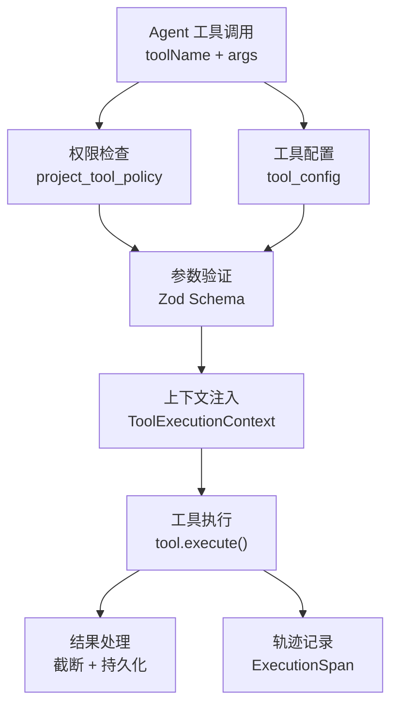

# 第 14 章 工具执行系统

> "工具让 Agent 从'能想'变为'能做'。"

数字员工通过工具与外部世界交互——读写文档、查询 TFS、发送企微消息、执行 SQL。WinMatrix 的工具系统包含 29 个业务工具域，通过自动注册、统一上下文和权限检查构建了一条完整的执行管线。本章将深入这些实现。

## 14.1 29 个业务工具域

`src/business-tools/` 目录包含 29 个工具域：

```
src/business-tools/
├── autoRegister.ts          # 自动注册入口
├── base/                     # 基础接口
├── command/                  # 命令执行
├── document/                 # 文档管理
├── email/                    # 邮件
├── image/                    # 图像处理
├── interaction/              # 交互
├── kdocs/                    # 知识库文档
├── knowledgeBase/            # 知识库
├── mcp/                      # MCP 外部集成
├── member/                   # 成员管理
├── memory/                   # 记忆
├── meta/                     # 元数据
├── notification/             # 通知
├── orchestration/            # 编排
├── project/                  # 项目管理
├── rag/                      # RAG 检索增强
├── scheduled/                # 定时任务
├── session/                  # 会话管理
├── shared/                   # 共享工具
├── skill/                    # 技能管理
├── sql/                      # SQL 查询
├── task/                     # 任务管理
├── tfs/                      # TFS/Azure DevOps
├── web/                      # Web 访问
├── wecom-contact/            # 企微联系人
├── wecom-document/           # 企微文档
├── wecom-schedule/           # 企微日程
├── workflow/                 # 工作流
└── workstation/              # 编码工作站
```

## 14.2 自动注册：懒加载

工具通过 `autoRegister.ts` 懒加载注册：

```typescript
// src/business-tools/autoRegister.ts（第 18-44 行）
const TOOL_MODULES: Array<() => Promise<ToolModule>> = [
  () => import('@/business-tools/project/index.js'),
  () => import('@/business-tools/task/index.js'),
  () => import('@/business-tools/document/index.js'),
  () => import('@/business-tools/email/index.js'),
  () => import('@/business-tools/image/index.js'),
  () => import('@/business-tools/interaction/index.js'),
  () => import('@/business-tools/kdocs/index.js'),
  () => import('@/business-tools/knowledgeBase/index.js'),
  () => import('@/business-tools/member/index.js'),
  () => import('@/business-tools/memory/index.js'),
  () => import('@/business-tools/notification/index.js'),
  () => import('@/business-tools/orchestration/index.js'),
  () => import('@/business-tools/rag/index.js'),
  () => import('@/business-tools/scheduled/index.js'),
  () => import('@/business-tools/session/index.js'),
  () => import('@/business-tools/skill/index.js'),
  () => import('@/business-tools/sql/index.js'),
  () => import('@/business-tools/tfs/index.js'),
  () => import('@/business-tools/web/index.js'),
  () => import('@/business-tools/wecom-contact/index.js'),
  () => import('@/business-tools/wecom-document/index.js'),
  () => import('@/business-tools/wecom-schedule/index.js'),
  () => import('@/business-tools/workflow/index.js'),
  () => import('@/business-tools/workstation/index.js'),
  () => import('@/business-tools/kdocs/index.js'),
];
```

懒加载的好处：

1. **启动性能**：工具模块只在首次需要时加载
2. **内存占用**：未使用的工具不占用内存
3. **隔离性**：单个工具加载失败不影响其他工具

### 每个工具域的注册函数

每个工具域导出 `registerTools` 函数：

```typescript
// src/business-tools/wecom-contact/index.ts（第 14-18 行）
export function registerTools(registry: IToolRegistry): void {
  registry.register(new WeComContactGetUserTool());
  registry.register(new WeComContactListDepartmentUsersSimpleTool());
  registry.register(new WeComContactListDepartmentUsersDetailTool());
}
```

企微文档工具注册了 13 个工具：

```typescript
// src/business-tools/wecom-document/index.ts（第 45-59 行）
export function registerTools(registry: IToolRegistry): void {
  registry.register(new WeComCreateWedocTool());
  registry.register(new WeComListConversationWedocDocsTool());
  registry.register(new WeComRenameWedocTool());
  registry.register(new WeComGetWedocBaseInfoTool());
  registry.register(new WeComGetWedocAuthTool());
  registry.register(new WeComGetWedocDocumentTool());
  registry.register(new WeComBatchUpdateWedocDocumentTool());
  registry.register(new WeComSmartSheetGetSheetTool());
  registry.register(new WeComSmartSheetGetFieldsTool());
  registry.register(new WeComSmartSheetGetRecordsTool());
  registry.register(new WeComSmartSheetAddRecordsTool());
  registry.register(new WeComSpreadsheetGetSheetPropertiesTool());
  registry.register(new WeComSpreadsheetGetSheetRangeDataTool());
}
```

## 14.3 ToolRegistry

工具注册表管理所有工具的元数据和执行：

```typescript
// src/agents/core/ai-kernel/tool/registry/ToolRegistry.ts（概念性）
export class ToolRegistry {
  private tools: Map<string, ITool> = new Map();

  async initialize(): Promise<void> {
    // 加载内置工具
    // 加载 MCP 外部工具
    // 同步 tool_config 表
  }

  register(tool: ITool): void {
    this.tools.set(tool.name, tool);
  }

  getTool(name: string): ITool | undefined {
    return this.tools.get(name);
  }

  getAllTools(): ITool[] {
    return Array.from(this.tools.values());
  }
}
```

在启动阶段（第 2 章），`toolRegistry.initialize()` 完成工具加载，`ensureBuiltInToolsInToolConfig` 同步到 `tool_config` 表。

## 14.4 工具执行管线

工具调用经过统一的执行管线：



### ToolExecutionContext

工具执行时注入完整的上下文：

```typescript
// 概念性
interface ToolExecutionContext {
  employee: DigitalEmployeeRecord;    // 执行工具的数字员工
  project: ProjectRef;                // 项目上下文
  user: UserRef;                      // 发起用户
  permissions: string[];              // 权限列表
  credentials: {
    tfs?: { account: string; token: string };
    git?: { username: string; password: string };
    email?: { address: string; password: string };
  };
  workstation?: WorkstationContext;   // 工作站上下文
  streaming?: StreamEmitter;          // 流式输出
  runtime: RuntimeContext;            // 运行时信息
}
```

工具通过这个上下文获取所需的一切——身份、权限、凭证、项目信息。凭证从数字员工记录中注入（见第 9 章），工具不需要自己查找。

## 14.5 工具与 Agent 的绑定

并非所有工具都对所有 Agent 可见。绑定关系存储在 `agent_tool` 表：

```prisma
// prisma/schema.prisma
model agent_tool {
  agent_id: string;        // Agent ID
  tool_name: string;       // 工具名
  permissions: string[];   // 该 Agent 使用此工具的权限
  required: boolean;       // 是否必需
}
```

启动时（第 2 章），MCP 服务的 `assigned_agents` 会自动同步到这张表，确保外部工具的绑定关系一致。

### 工具策略

项目级工具策略控制工具的使用：

```prisma
model project_tool_policy {
  // 项目级工具策略
  // 可以禁用某些工具，或限制使用频率
}
```

## 14.6 MCP 工具：外部协议到内部工具

MCP（Model Context Protocol）工具通过适配器融入内部工具体系：

```typescript
// src/infrastructure/mcp/McpToolAdapter.ts
// 将外部 MCP 工具适配为内部 ITool
```

McpManager 管理多个外部 MCP 服务：

```typescript
// src/infrastructure/mcp/McpManager.ts（第 50-95 行）
export class McpManager {
  private clients = new Map<string, McpClient>();
  private toolRegistry: IToolRegistry | null = null;
  private registeredToolNames = new Map<string, string[]>();
  private toolServiceIndex = new Map<string, { serviceId: string; serviceName: string }>();
  private whitelistCache: WhitelistCache = new Map();
  private assignedAgentsCache: AssignedAgentsCache = new Map();

  async initialize(): Promise<void> {
    if (this.initialized) return;
    const services = await prisma.mcp_services.findMany({
      where: { is_enabled: true },
    });
    await Promise.allSettled(services.map(svc => this.connectService(svc)));
    this.initialized = true;
  }

  registerToToolRegistry(toolRegistry: IToolRegistry): void {
    this.toolRegistry = toolRegistry;
    // 将所有外部工具注册到内部 ToolRegistry
  }
}
```

关键设计：

1. **多服务管理**：一个 McpManager 管理多个外部 MCP 服务
2. **热加载**：运行时添加/移除/重连服务
3. **白名单缓存**：每个服务有独立的工具白名单
4. **Agent 可见性**：`assignedAgentsCache` 控制每个工具对哪些 Agent 可见

## 14.7 TFS 查询后台 Worker

某些工具执行时间很长（如复杂 TFS 查询），不能阻塞 Agent 主流程。这类任务通过后台 Worker 异步执行：

```typescript
// src/interface/workers/tfsQueryExportWorker.ts（第 1-23 行）
/**
 * TFS 查询后台 Worker（复杂 WIQL / 长超时场景）
 */
import { Worker, type Job } from 'bullmq';
import { bullmqWorkerConnection } from '@/infrastructure/persistence/database/bullmqConnections.js';
import {
  TFS_QUERY_EXPORT_QUEUE_NAME,
  resolveTfsQueryExportJobTimeoutMs,
  type TfsQueryExportJobPayload,
  type TfsQueryExportJobResult,
} from '@/business-tools/tfs/tfsQueryExportTypes.js';
import { formatWorkItemsSummary, runTfsQueryFetchBackground } from '@/business-tools/tfs/tfsQueryExportCore.js';
import { sendTfsQueryExportSuccessWecomNotify } from '@/business-tools/tfs/tfsQueryExportWecomNotify.js';
```

完成后通过跨 Agent 触发机制将结果回传给原始对话：

```typescript
// src/interface/workers/tfsQueryExportWorker.ts（第 38-54 行）
const triggerMessage = result.success
  ? [
      '[TFS查询后台任务完成]',
      `查询：${payload.queryLabel}`,
      `共 ${result.total} 条工作项。`,
      '请向用户汇总需求号或工作项列表。',
    ].join('\n')
  : [
      '[TFS查询后台任务失败]',
      `查询：${payload.queryLabel}`,
      `原因：${result.error ?? '未知错误'}`,
    ].join('\n');

await crossAgentCallRegistry.register({
  targetConversationId: conversationId,
  context: { sourceConversationId: conversationId, sourceAgentId: roleId },
});
```

## 本章小结

本章深入分析了 WinMatrix 的工具执行系统：

1. **29 个业务工具域**：从文档到企微，从 TFS 到 SQL
2. **懒加载自动注册**：25 个模块按需加载，优化启动性能和内存
3. **ToolRegistry**：统一管理工具元数据和执行
4. **执行管线**：权限检查 → 参数验证 → 上下文注入 → 执行 → 结果处理 → 轨迹记录
5. **ToolExecutionContext**：注入身份、权限、凭证、项目、工作站、流式
6. **Agent-Tool 绑定**：`agent_tool` 表 + MCP assigned_agents 自动同步
7. **项目级策略**：`project_tool_policy` 控制工具使用
8. **MCP 适配**：外部 MCP 工具通过 McpToolAdapter 融入内部体系
9. **后台 Worker**：长耗时任务（TFS 查询）异步执行，跨 Agent 回传结果

在下一章中，我们将深入编码工作站。
