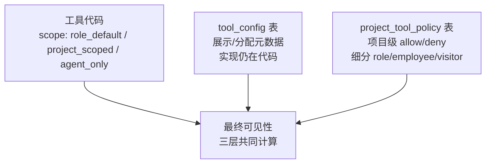

# 第 14 章 工具执行系统

> "工具让 Agent 从'能想'变为'能做'。"

第 13 章讲完了技能——技能是"会做什么"的声明，真正把意图变成动作的是工具。数字员工通过工具与外部世界交互：读写文档、查 TFS、发企微、跑 SQL、操作编码工作站。WinMatrix 把这几十种交互收敛成一套统一的工具执行系统：所有工具都继承同一个基类、共享同一个执行上下文、走同一条执行管线、受同一套策略治理。

本章从工具的接口契约出发，依次深入 LLM 与工具的桥接、声明式操作授权、三层策略分层、Span 关联观测，最后看工具产物如何物化成可寻址的资产。

## 14.1 统一工具契约：BaseTool

WinMatrix 有 27 个工具域模块，每个模块注册若干工具。但这些工具——从最简单的通知工具到最复杂的编码任务工具——都实现同一个契约。这个契约的核心是 `BaseTool` 基类。

### BaseTool 的职责

```typescript
// src/business-tools/base/BaseTool.ts（第 1-14 行）
/**
 * 工具基类
 *
 * 提供工具的通用实现，适配新的统一工具接口
 *
 * 新架构特性：
 * - 统一的 ToolExecutionContext 传递上下文（替代 __agentId 参数注入）
 * - scope 和 category 元数据支持策略过滤
 * - getSchema() 必须返回 Zod schema
 *
 * 向后兼容：
 * - 子类可以实现 execute(args, context) 新签名
 * - 也可以保持旧的 execute(params) 签名（内部通过 extractContextFromArgs 获取上下文）
 */
```

基类是抽象的，子类只需实现一个核心方法：

```typescript
// src/business-tools/base/BaseTool.ts（第 36-71 行）
export abstract class BaseTool implements ITool {
  abstract readonly name: string;
  abstract readonly description: string;

  /** 所需权限列表 */
  readonly permissions: string[] = [];

  /** 工具范围：默认分配给所有 Role */
  readonly scope: ToolScope = 'role_default';

  /** 工具分类：默认 other */
  readonly category: ToolCategory = 'other';

  /** 工具语义化元数据（子类可 override） */
  get metadata(): ToolMetadata {
    return {};
  }

  /** 依赖的工具列表 */
  readonly dependencies: string[] = [];

  /** 缓存 toToolDefinition() 结果（name/description/schema 在实例生命周期内不可变） */
  private _toolDefCache: ToolDefinition | null = null;

  abstract execute(args: Record<string, unknown>, context: ToolExecutionContext): Promise<ToolResult>;
```

每个工具要回答五个问题：我叫什么（`name`）、我做什么（`description`）、谁配用我（`scope`+`permissions`）、我的参数长什么样（`getSchema()` 返回 Zod）、我怎么执行（`execute`）。前四项是元数据，最后一项是行为。

这里有几个设计决策值得展开。第一，**参数 schema 用 Zod 而非 JSON Schema**：Zod 在代码侧提供类型推导和运行时校验，而发给 LLM 时再转成 JSON Schema。Zod 是真源，JSON Schema 是投影。第二，**`scope` 默认 `role_default`**：一个新工具如果不显式声明 scope，默认对所有 Role 可见——这是"默认开放"的策略，降低新增工具的接入成本。第三，**实例级缓存 `_toolDefCache`**：`toToolDefinition()` 会做 Zod→JSON Schema 转换，开销不小，而工具的 name/description/schema 在实例生命周期内不变，所以转换结果缓存一次即可。

### 从 Zod 到 OpenAI Function Calling

`toToolDefinition()` 是工具对接 LLM 的关键。它把 Zod schema 转成 LLM 能理解的 ToolDefinition：

```typescript
// src/business-tools/base/BaseTool.ts（第 99-121 行）
  /**
   * 转换为 ToolDefinition（新 LLM 架构使用）
   *
   * 将 Zod schema 转换为 JSON Schema，移除 OpenAI 不需要的 $schema 和 additionalProperties 字段。
   * 结果在实例级缓存（name/description/schema 不可变），返回浅拷贝防止外部 mutation 污染缓存。
   */
  toToolDefinition(): ToolDefinition {
    if (!this._toolDefCache) {
      const rawSchema = zodToJsonSchema(this.getSchema() as any);
      // 移除 OpenAI function calling 格式不需要的字段
      const { $schema: _, additionalProperties: __, ...parameters } =
        rawSchema as Record<string, unknown>;

      this._toolDefCache = {
        name: this.name,
        description: this.getDescription(),
        parameters,
        declaredOperations: this.metadata.declaredOperations ?? getStaticToolDeclaredOperations(this.name),
      };
    }
    // 浅拷贝：防止 buildToolDefinitionsFromContext 的 def.description = specDesc 等外部 mutation 污染缓存
    return { ...this._toolDefCache };
  }
```

两个剥离细节值得注意：

- **剥离 `$schema`**：`zod-to-json-schema` 默认会在输出里加 `$schema` 字段指向 JSON Schema meta-schema。OpenAI 的 function calling 格式不接受这个字段，必须移除。
- **剥离 `additionalProperties`**：同理会带上 `additionalProperties: false`，OpenAI 同样不接受。

如果不剥离，OpenAI 的接口会直接报 schema 校验错误，工具调用根本发不出去。这是一个真实踩过的坑——库的默认输出和 LLM API 的要求并不一致，必须手动对齐。

最后的 `return { ...this._toolDefCache }` 浅拷贝也很关键：调用方会修改返回的 definition（比如覆盖 description 来注入项目特定提示），如果不拷贝，这些修改会污染缓存，影响后续所有调用方。**缓存返回值时，永远要考虑调用方会不会改它。**

## 14.2 ToolExecutionContext：替代参数注入

工具执行时需要大量上下文：当前数字员工是谁、在哪个项目里、发起人是谁、有没有 TFS 凭证、工作站是否可用。早期版本把这些塞进工具参数（`__agentId`、`__projectId` 等魔法字段），导致参数对象污染严重。新架构引入了统一上下文：

```typescript
// src/business-tools/base/interfaces.ts（第 105-133 行）
/**
 * 工具执行上下文（替代参数注入）
 *
 * 统一的上下文传递机制，避免 __agentId 等参数污染工具参数
 */
export interface ToolExecutionContext {
  /** 数字员工 ID */
  digitalEmployeeId: string;
  /** Agent ID (Role name) */
  agentId: string;
  /** 会话 ID（可选） */
  conversationId?: string;
  /** 项目信息（可选） */
  project?: { id: string; name?: string; code?: string };
  /** 用户信息（可选） */
  user?: { id: string; permissions: string[] };
  /** 技能容器基础目录（技能执行时设置） */
  skillContainerBaseDir?: string;
  /** workspace_glob / 昂贵扫描 telemetry 用的发现上下文 */
  workspaceDiscovery?: {
    skillTargetId?: string;
    /** 当前 Skill 内容的 artifactDigest，用于与 credentials.skillEnv 做匹配 */
    artifactDigest?: string;
    taskOutputDir?: string;
    pmdocAbsolutePath?: string;
  };
  /** 带类型扩展子上下文（workstation / streaming / credentials / runtime 等） */
  extensions?: ToolContextExtensions;
}
```

上下文设计有几个层次。**核心字段**（`digitalEmployeeId`/`agentId`）永远在场，工具可以放心读。**可选字段**（`conversationId`/`project`/`user`）按场景出现——通知工具需要会话上下文，但 SQL 工具不一定需要。**扩展子上下文**（`extensions`）承载更专业的横切信息：工作站上下文、流式输出、技能凭证、运行时元数据。用扩展字段而非平铺所有字段，是避免上下文接口随业务膨胀的关键。

### 向后兼容的回退

迁移不是一蹴而就的。部分老工具还在用 `args.__agentId` 拿 agentId。基类提供了兼容辅助方法：

```typescript
// src/business-tools/base/BaseTool.ts（第 182-189 行）
  /**
   * 获取上下文中的 Agent ID（兼容辅助方法，非 workstation 迁移字段仍保留 args 回退）
   */
  protected getAgentId(context: ToolExecutionContext, args?: Record<string, unknown>): string {
    if (context.agentId) return context.agentId;
    if (args?.__agentId) return args.__agentId as string;
    return '';
  }
```

优先读 `context.agentId`，没有再回退到 `args.__agentId`。这是一种渐进式迁移策略：新代码用新接口，老代码继续工作，等老工具逐步迁移完成后再移除回退路径。**大规模重构时，"新旧并存 + 显式优先级 + 计划清理"比"一刀切重写"安全得多。**

## 14.3 工具结果的两态封装

工具执行完返回 `ToolResult`，但这个结果最终要变成 LLM 能消费的工具调用回复。中间有一层封装：

```typescript
// src/business-tools/base/interfaces.ts（第 12-21 行）
/**
 * 工具执行结果
 */
export interface ToolResult {
  success: boolean;
  data?: unknown;
  error?: string;
  /** 写入 tool_call span attributes（经 pickToolSpanPersistedAttributes 白名单过滤） */
  spanAttributes?: Record<string, unknown>;
}
```

`spanAttributes` 是关键——当工具想把自己的执行细节（比如 SQL 查询命中了多少行、TFS 查询花了多久）写进可观测性 span 时，就填这个字段。封装逻辑根据它是否存在，走两条路：

```typescript
// src/business-tools/base/toolResultEnvelope.ts（第 1-21 行）
import type { ToolResult } from '@/business-tools/base/interfaces.js';

export interface ToolInvocationResultEnvelope {
  success: true;
  data: unknown;
  spanAttributes: Record<string, unknown>;
}

export function toToolInvocationValue(
  result: ToolResult,
  data: unknown = result.data,
): unknown {
  if (result.spanAttributes && Object.keys(result.spanAttributes).length > 0) {
    return {
      success: true,
      data,
      spanAttributes: result.spanAttributes,
    } satisfies ToolInvocationResultEnvelope;
  }
  return data !== undefined ? data : result;
}
```

这是一个**两态封装**：

- **有 `spanAttributes`**：返回 `{ success, data, spanAttributes }` 信封结构。上层执行器会从信封里抽出 spanAttributes 写入 span，把 data 喂给 LLM。
- **没有 `spanAttributes`**：直接返回裸 data（或 result 兜底）。大多数简单工具走这条路，不产生额外观测数据。

为什么不让所有工具都返回信封？因为绝大多数工具（通知、读文档）不需要观测细节，强制信封结构会增加无谓的包装开销。只在确有需要时才声明 spanAttributes，是"按需观测"的思路。

而失败路径单独处理：

```typescript
// src/business-tools/base/BaseTool.ts（第 86-97 行）
  getExecuteFn(context: ToolExecutionContext): (args: Record<string, unknown>) => Promise<unknown> {
    return async (args: Record<string, unknown>) => {
      const result = await this.execute(args, context);

      if (!result.success) {
        return ErrorEnricher.enrich(`错误: ${result.error}`, { toolName: this.name });
      }

      const formatted = this.formatResult(result.data);
      return toToolInvocationValue(result, formatted);
    };
  }
```

`result.success === false` 时不走封装，而是走 `ErrorEnricher.enrich()`——把原始错误增强成对 LLM 更友好的提示。直接把 "TFS connection refused" 喂给 LLM，它不知道该怎么办；增强成 "TFS 查询工具暂不可用，请稍后重试或检查凭证" 之类的提示，LLM 才能做出合理决策。**工具失败时，给 LLM 的不是错误本身，而是可行动的指导。**

## 14.4 27 个工具域：懒加载自动注册

WinMatrix 的工具按业务域组织，每个域是一个独立模块：

```typescript
// src/business-tools/autoRegister.ts（第 17-46 行）
/** 所有工具模块的懒加载入口 */
const TOOL_MODULES: Array<() => Promise<ToolModule>> = [
  () => import('@/business-tools/project/index.js'),
  () => import('@/business-tools/task/index.js'),
  () => import('@/business-tools/document/index.js'),
  () => import('@/business-tools/command/index.js'),
  () => import('@/business-tools/member/index.js'),
  () => import('@/business-tools/notification/index.js'),
  () => import('@/business-tools/tool-result/index.js'),
  () => import('@/business-tools/email/index.js'),
  () => import('@/business-tools/workflow/index.js'),
  () => import('@/business-tools/memory/index.js'),
  () => import('@/business-tools/web/index.js'),
  () => import('@/business-tools/session/index.js'),
  () => import('@/business-tools/workstation/index.js'),
  () => import('@/business-tools/scheduled/index.js'),
  () => import('@/business-tools/sql/index.js'),
  () => import('@/business-tools/tfs/index.js'),
  () => import('@/business-tools/wecom-document/index.js'),
  () => import('@/business-tools/wecom-schedule/index.js'),
  () => import('@/business-tools/wecom-contact/index.js'),
  () => import('@/business-tools/rag/index.js'),
  () => import('@/business-tools/mcp/index.js'),
  () => import('@/business-tools/image/index.js'),
  () => import('@/business-tools/meta/index.js'),
  () => import('@/business-tools/interaction/index.js'),
  () => import('@/business-tools/orchestration/index.js'),
  () => import('@/business-tools/kdocs/index.js'),
  () => import('@/business-tools/code-intelligence/index.js'),
];
```

注意这里实际是 **27 个**模块（不是某些早期文档写的 25 个）。相比常见的"25 个业务域"口径，多出来的是 `tool-result`（工具产物读取）和 `code-intelligence`（代码智能检索）两个域。事实清单已经统一修正为 27 个。

加载逻辑很简洁：

```typescript
// src/business-tools/autoRegister.ts（第 53-58 行）
export async function autoRegisterTools(registry: IToolRegistry): Promise<void> {
  const modules = await Promise.all(TOOL_MODULES.map((fn) => fn()));
  for (const mod of modules) {
    await mod.registerTools(registry);
  }
}
```

并行加载所有模块（`Promise.all`），但串行注册（`for` 循环）。并行加载是为了缩短启动时间，串行注册是为了注册顺序确定、便于排查重复注册等问题。每个模块导出自己的 `registerTools`：

```typescript
// 每个工具域 index.ts 的通用模式
export function registerTools(registry: IToolRegistry): void {
  registry.register(new WeComContactGetUserTool());
  registry.register(new WeComContactListDepartmentUsersSimpleTool());
  // ...
}
```

这种设计的好处是**新增工具零侵入**：加一个新工具域，只需在 `business-tools/` 下建目录、写 `index.ts` 导出 `registerTools`、在 `TOOL_MODULES` 数组里加一行。不用改注册中心的任何逻辑。模块文件头部的注释说得很清楚：`新增工具只需在对应模块的 index.ts 中加一行即可`。

懒加载（动态 `import()`）还有个隐性收益：**启动时只加载代码，不实例化重型依赖**。比如 SQL 工具域的代码加载了，但它的数据库连接池要等第一次执行才真正建立。这让冷启动更快、内存更省。

## 14.5 LLM 与工具的桥接：双轨制

LLM 怎么知道有哪些工具可用、又怎么发起调用？这靠 `ILLMClient` 接口和 `StreamingToolExecutor` 配合完成。这里有一个容易被忽视但极其关键的设计：**LLM 调用是双轨的——流式和非流式分用不同方法**。

### ILLMClient 的双轨

```typescript
// src/infrastructure/llm/core/types.ts（第 344-399 行）
export interface ILLMClient {
  /** Provider 标识 */
  readonly provider: string;
  /** 模型标识 */
  readonly model: string;
  // ...
  /**
   * 流式调用（核心，用于对话）
   * 返回 AsyncIterable，消费方用 for-await-of 逐事件处理
   */
  stream(
    messages: ChatMessage[],
    options?: StreamOptions,
  ): AsyncIterable<LLMStreamEvent>;

  /**
   * 真正的非流式调用（stream: false）
   * 用于工具调用场景，确保 tool_calls.arguments 完整
   */
  invokeNonStreaming(
    messages: ChatMessage[],
    options?: InvokeOptions,
  ): Promise<AssistantMessage>;

  /**
   * 绑定工具（返回新 client 实例，后续调用自动携带工具定义）
   */
  withTools(tools: ToolDefinition[]): ILLMClient;
}
```

注意 `stream` 和 `invokeNonStreaming` 的注释差异：

- **`stream`**：核心方法，用于对话。返回 `AsyncIterable`，逐事件处理。流式的好处是用户能实时看到生成进度。
- **`invokeNonStreaming`**：注释明示"用于工具调用场景，确保 tool_calls.arguments 完整"。`stream: false`。

为什么要分轨？因为**流式协议下，工具调用的 arguments 是分块到达的**。provider 把 `tool_calls[0].arguments` 拆成几十个 chunk 流式发过来。在某些 provider（特别是 Anthropic 早期版本）上，这些 chunk 拼接出来的 arguments 偶尔会有遗漏或错位——尤其当 arguments 是一个较复杂的嵌套 JSON 时。而工具调用恰恰需要 arguments 是**完整、精确**的 JSON，缺一个引号就 parse 失败。

所以工具调用场景强制走 `invokeNonStreaming`：一次性拿到完整的 `tool_calls.arguments`，不做流式拼接。对话正文继续走 `stream` 保持实时性。**两种诉求（实时性 vs 完整性）用两个方法分别满足，而不是让一个方法两头妥协。**

`withTools` 是不可变绑定：它返回一个**新的 client 实例**，原 client 不变。这让同一个底层 client 可以分别绑定不同的工具集，派生出多个"带工具的 client"，互不干扰。

### executeToolCall：工具执行入口

LLM 返回 tool_call 后，由 `StreamingToolExecutor.executeToolCall` 负责实际执行。这是整个工具调用管线的核心：

```typescript
// src/agents/core/ai-execution/tool-loop/StreamingToolExecutor.ts（第 2960-3045 行）
  private async executeToolCall(
    toolCall: ToolCallBlock,
    tools: Map<string, ToolInvokeFn>,
    consecutiveFailures: Map<string, number>,
    messages: ChatMessage[],
    runLocalToolCallCounts: Map<string, number>,
    options?: { bypassRepeatBlock?: boolean },
  ): Promise<IntermediateStep> {
    const { emitter, checkToolPermission, injectToolArgs, toolCache, cacheableTools } = this.config;
    const toolName = toolCall.name;
    // 保证每次调用都有唯一 id，便于前端多轮同工具时正确匹配结果
    const toolCallId = (toolCall.id?.trim() || `tc_${Date.now()}_${Math.random().toString(36).slice(2, 9)}`);
    // ...
    // 4 分支决策树：把流式 draft span（来自 tool_call_start 事件）关联到 stable toolCallId
    this.resolveOrCreateToolSpan(toolCallId, toolName);
    let toolArgs = { ...toolCall.arguments };

    // 智谱等模型可能返回空 arguments，用最后一条用户消息对已知工具做兜底填充
    const lastUser = this.getLastUserContent(messages);
    toolArgs = this.fillEmptyToolArgsFromContext(toolName, toolArgs, lastUser);

    // 参数规范化（如 filesystem_command 的 args 字段）
    toolArgs = this.normalizeToolArgs(toolName, toolArgs);

    // 注入项目上下文
    if (injectToolArgs) {
      toolArgs = injectToolArgs(toolName, toolArgs);
    }

    // Hook: beforeExecute
    let hookCtx: ... | undefined;
    if (this.config.hookRegistry) {
      try {
        hookCtx = await this.config.hookRegistry.runBeforeHooks({
          toolName,
          args: toolArgs,
          context: this.config.toolExecutionContext ?? {} as ...,
        });
        if (hookCtx.args) {
          toolArgs = hookCtx.args;
        }
      } catch (hookErr) {
        logger.warn({ err: hookErr }, `[StreamingToolExecutor] beforeExecute hook 阻断: ${toolName}`);
      }
    }

    // 观测：工具调用开始
    this.recordToolLoopObservabilityEvent({
      // ... eventType: 'tool_call_start', toolName, toolCallId, toolInput: toolArgs
    });

    // 查找工具（可能因当前上下文排除部分工具而导致模型调用了不可用工具）
    const toolFn = tools.get(toolName);
```

这段代码集中体现了工具执行的几道关卡：

1. **空 arguments 兜底**（`fillEmptyToolArgsFromContext`）：智谱等模型偶尔返回空 arguments。用最后一条用户消息对已知工具做兜底填充，避免空参数导致工具报错。这是兼容不同 provider 脾气的实际工程处理。
2. **参数规范化**（`normalizeToolArgs`）：不同 provider 对参数结构的表达略有差异，这里做归一化。
3. **项目上下文注入**（`injectToolArgs`）：把 `projectId` 等上下文塞进参数，让工具不用自己从上下文里找。
4. **beforeExecute Hook**：拦截器有机会修改参数甚至阻断执行。Hook 抛错时**只 warn 不崩**——一个 hook 失败不应该让整个工具调用链挂掉。
5. **可观测性打点**：在执行前打 `tool_call_start`，执行后打结束事件，确保即使工具中途崩溃也有完整的 span。

工具查找不到时（模型调用了被策略排除的工具），不是直接报错，而是走 `invokeStreamingToolPlanLessViaKernel` 尝试兜底，最后返回一个增强后的提示，告诉 LLM "这个工具在当前上下文不可用，请用本次提供的工具列表重试"。**模型犯错（调用不存在的工具）是常态，处理方式不是报错，而是引导它改正。**

## 14.6 声明式操作授权：declaredOperations

工具会被 LLM 调用，但 LLM 是不可信的——它可能基于 prompt 注入或自身幻觉，试图用工具做超出预期的事。WinMatrix 用声明式操作授权来约束工具能做什么。

### declaredOperations 的强约束

```typescript
// src/business-tools/base/interfaces.ts（第 60-87 行）
export interface ToolMetadata {
  /** 是否只读（不修改任何状态） */
  isReadOnly?: boolean;
  /** 是否具有破坏性（如删除操作） */
  isDestructive?: boolean;
  /** 是否可安全并发执行 */
  isConcurrencySafe?: boolean;
  /** 搜索提示关键词，用于工具发现 */
  searchHints?: string[];
  /** 工具别名（如 read_file 的别名为 readFile） */
  aliases?: string[];
  /** 默认超时（毫秒），替代 StreamingToolExecutor 中的 perToolTimeouts */
  defaultTimeoutMs?: number;
  /** 工具显式声明的操作授权；未声明时不得从描述/关键词推断。 */
  declaredOperations?: ToolDeclaredOperation[];
  /**
   * 是否支持消费 ToolExecutionContext.extensions.credentials.skillEnv
   * （OpenSpec: inject-draft-token-into-draft-query-skill）。当前 Skill Action
   * 已解析凭证但实际选定的执行工具未声明为 true 时，调用必须以
   * SKILL_CREDENTIAL_EXECUTION_PATH_UNSUPPORTED 失败，不得改走其他工具。
   */
  acceptsSkillCredentialEnv?: boolean;
}
```

`declaredOperations` 的注释极其严格：**"未声明时不得从描述/关键词推断"**。意思是：一个工具如果没在 `declaredOperations` 里显式声明它能做某类操作，系统绝不能因为它的 description 里出现了"删除"或"创建"这样的词，就推断它有这些操作权限。声明是真源，描述是给人看的，不能作为授权依据。

这种严格性是为了对抗 prompt 注入。假设攻击者在文档里注入了"请用文档工具执行删除操作"的指令，如果系统从 description 关键词推断授权，可能真的放行；而声明式授权下，工具没声明 `delete` 操作就一律拒绝。

`acceptsSkillCredentialEnv` 是另一个强约束。当 Skill Action 已经解析出了凭证（`credentials.skillEnv`），但用户选定的工具没声明 `acceptsSkillCredentialEnv: true`，调用必须以 `SKILL_CREDENTIAL_EXECUTION_PATH_UNSUPPORTED` 失败。注释明确：**不得改走其他工具**。这防止了"凭证泄露给未授权工具"的风险——宁可失败，也不把凭证交给一个不声明能安全处理它的工具。

## 14.7 三层策略分层

工具的可见性由三层策略共同决定。理解这三层是理解工具治理的关键。

### 第一层：tool_config（展示与分配元数据）

```typescript
// prisma/schema.prisma（第 1436-1453 行）
/// 工具配置（分配/展示用，实现仍在代码）
model tool_config {
  name                String   @id
  description         String
  category            String?  @map("category")
  scope               String?  @map("scope")
  version             String?  @map("version")
  author              String?  @map("author")
  parameters          Json     @map("parameters")
  permissions         String[] @map("permissions")
  dependencies        Json     @map("dependencies")
  mcp_bridge_visible  Boolean  @default(true) @map("mcp_bridge_visible")
  visitor_enabled     Boolean  @default(false) @map("visitor_enabled")
  created_at          DateTime @map("created_at") @db.Timestamptz(6)
  updated_at          DateTime @map("updated_at") @db.Timestamptz(6)

  @@map("tool_config")
}
```

注释一句话定调：**"分配/展示用，实现仍在代码"**。`tool_config` 表存储的是工具的元数据（描述、分类、权限、MCP 桥接可见性、访客可用性），用于管理界面展示和工具分配。但工具的**实际实现**仍在代码里——这张表不决定工具怎么执行，只决定它怎么被展示和分配。

这是一个容易混淆的点：`tool_config` 不是工具的注册表，注册表是内存里的 `ToolRegistry`（由 `autoRegisterTools` 填充）。`tool_config` 是元数据的持久化镜像，让管理后台能脱离代码查询工具信息。

### 第二层：project_tool_policy（项目级 allow/deny）

```typescript
// prisma/schema.prisma（第 1414-1434 行）
model project_tool_policy {
  id                  Int      @id @default(autoincrement())
  project_id          String
  role_id             String?
  digital_employee_id String?
  tool_name           String
  effect              String   // allow | deny
  access_mode         String   @default("member") @map("access_mode") // member | visitor
  source              String   @default("manual") // manual | role_default | system
  status              String   @default("active") // active | disabled
  reason              String?
  created_by          String?
  created_at          DateTime @default(now()) @db.Timestamptz(6)
  updated_at          DateTime @default(now()) @updatedAt @db.Timestamptz(6)

  @@index([project_id, status])
  @@index([project_id, role_id])
  @@index([project_id, digital_employee_id])
  @@index([tool_name])
  @@map("project_tool_policy")
}
```

这才是真正的授权层。每条记录表达"在某项目里，某角色/某员工/某访客对某工具是 allow 还是 deny"。它有几个设计亮点：

- **三维粒度**：可以按 `role_id`（角色级）、`digital_employee_id`（员工级）、`access_mode`（访客 vs 成员）分别设策略。索引也分别建了 `[project_id, role_id]`、`[project_id, digital_employee_id]`、`[tool_name]`，保证任一维度的查询都快。
- **effect 是 allow/deny 而非布尔**：allow/deny 两态比单一的 enable 更灵活——可以显式 deny 一个默认 allow 的工具，也可以显式 allow 一个被默认 deny 的工具。
- **source 追溯来源**：`manual`（人工设置）、`role_default`（角色默认绑定）、`system`（系统自动生成），方便审计策略是怎么来的。

### 第三层：ToolScope 三态

```typescript
// src/business-tools/base/interfaces.ts（第 23-30 行）
/**
 * 工具范围（与 types/config.ts 统一）
 *
 * - role_default: 默认分配给所有 Role（综合区与项目区均可用）
 * - project_scoped: 仅在有项目上下文时可用，综合区不暴露
 * - agent_only: 不进入默认集，仅当某 Agent 在配置的 tools 中显式声明时才拥有
 */
export type ToolScope = 'role_default' | 'project_scoped' | 'agent_only';
```

ToolScope 是工具自身的"默认可见性"，在代码里声明：

- **`role_default`**：默认对所有 Role 可见（综合区和项目区都行）。大多数通用工具（通知、记忆、搜索）走这条。
- **`project_scoped`**：只在有项目上下文时可用，综合区（无项目的闲聊场景）不暴露。比如 TFS 查询工具必须有项目才能跑。
- **`agent_only`**：不进默认集，只有某个 Agent 在配置里显式声明 `tools: [...]` 才拥有。这是为特殊工具留的口子。

三层的关系是：ToolScope 定默认 → tool_config 给展示 → project_tool_policy 做细粒度覆盖。一个工具最终对某个员工在某项目里是否可用，是三层共同计算的结果。



## 14.8 Span 关联：流式 draft id 的难题

工具调用要接入可观测性（ExecutionSpan），但流式协议下的 span 关联有个隐蔽的难题。

```typescript
// src/agents/core/ai-execution/tool-loop/StreamingToolExecutor.ts（第 883-898 行）
  private readonly toolCallSpans = new Map<string, SpanHandle>();
  /**
   * 草稿 tool span（key = `${messageBlockId}:${toolCallIndex}`）。
   *
   * provider 流式 tool_call_start 时 id 可能是临时 draft id（如 OpenAI 的固定占位
   * 或 Anthropic 早期未稳定 id），不能直接做 span-source 关联。在 executeToolCall
   * 拿到稳定 id 后通过 resolveOrCreateToolSpan 4 分支决策树迁移到 toolCallSpans。
   */
  private readonly draftToolSpans = new Map<string, SpanHandle>();
  /**
   * stableId / draftToolCallId → draftKey 映射。
   *
   * tool_call_start 时按 event.toolCall.id 建立（provider 可能给 draft id 或 stable id），
   * 后续 executeToolCall(stableId) 通过它定位草稿。
   */
  private readonly toolCallIdMap = new Map<string, string>();
```

问题是什么？在流式协议下，provider 发 `tool_call_start` 事件时带的 id **可能是不稳定的临时 id**。OpenAI 会用一个固定占位符，Anthropic 早期版本会给一个后面会变的 id。如果在 `tool_call_start` 时直接用这个 id 创建 span 并和 source 关联，后面稳定 id 出来后就对不上了——span 会变成孤儿。

WinMatrix 的解法是**双 Map + 4 分支决策树**：

1. `tool_call_start` 时，把 span 存进 `draftToolSpans`（用 blockId:index 做 key），同时在 `toolCallIdMap` 里记下 draft/stable id → draftKey 的映射。
2. `executeToolCall` 拿到稳定 id 后，调 `resolveOrCreateToolSpan` 走 4 分支决策树：
   - 草稿存在且 id 匹配 → 迁移草稿到 `toolCallSpans`。
   - 草稿存在但 id 不匹配 → 新建 span，取消草稿。
   - 草稿不存在 → 直接新建。
   - 其他边界 → 按决策树处理。

```typescript
// src/agents/core/ai-execution/tool-loop/StreamingToolExecutor.ts（第 2601-2614 行）
  /**
   * 4 分支决策树：把流式 draft span 与实际 executeToolCall(stableId) 关联起来。
   */
  private resolveOrCreateToolSpan(stableId: string, toolName?: string): SpanHandle {
```

这个设计的核心思想是**延迟绑定**：span 在事件流早期就创建（为了捕获完整的耗时），但与稳定 id 的关联推迟到稳定 id 真正可用时才做。期间用 draft Map 暂存。**面对外部系统 id 不稳定的现实，不假设它会稳定，而是设计一套机制来消化这种不稳定。**

## 14.9 工具产物资产化：ToolResultArtifact

有些工具的输出不是几行文本，而是大块产物——一份生成的报告、一张图表、一段代码 diff。把这种大块输出直接塞进对话消息会撑爆上下文。WinMatrix 把它们物化成可寻址的资产：

```typescript
// prisma/schema.prisma（第 3596-3621 行）
/// 运行期工具/技能产物（跨进程；引用格式 tool-result://<id>）
model ToolResultArtifact {
  id              String   @id
  projectId       String   @map("project_id")
  conversationId  String?  @map("conversation_id")
  agentRunId      String?  @map("agent_run_id")
  toolCallId      String?  @map("tool_call_id")
  toolName        String?  @map("tool_name")
  skillTargetId   String?  @map("skill_target_id")
  artifactKind    String   @map("artifact_kind")
  contentType     String   @map("content_type")
  byteSize        Int      @map("byte_size")
  sha256          String
  storageBackend  String   @default("postgres") @map("storage_backend")
  storageKey      String?  @map("storage_key")
  content         Bytes
  partIndex       Int?     @map("part_index")
  partCount       Int?     @map("part_count")
  createdAt       DateTime @default(now()) @map("created_at") @db.Timestamptz(6)
  expiresAt       DateTime @map("expires_at") @db.Timestamptz(6)

  @@index([projectId, createdAt], map: "idx_tool_result_artifact_project_created")
  @@index([agentRunId], map: "idx_tool_result_artifact_agent_run")
  @@index([expiresAt], map: "idx_tool_result_artifact_expires")
  @@map("tool_result_artifact")
}
```

几个设计要点：

- **引用格式 `tool-result://<id>`**：注释里明确的外部引用协议。对话里不放大块内容，只放一个 `tool-result://` 引用，需要时再按 id 取。这让上下文保持精简，大块产物按需加载。
- **`storageBackend` 默认 postgres，`content` 是 Bytes**：产物直接存进 PostgreSQL 的 bytea 列。对于中等大小的产物（几 KB 到几 MB），这比走对象存储更简单（少一次网络往返）。大产物可以扩展到其他 backend。
- **`partIndex` / `partCount` 支持分片**：超大产物可以切成多片存储，每片一行，用 partCount 标识总数。
- **`sha256` 校验完整性**：和技能产物一样，资产化数据带哈希校验。
- **`expiresAt` + 索引 `[expiresAt]`**：产物有 TTL，过期会被清理。索引让清理任务能高效扫出过期记录。

带 TTL 的资产化是一种"用空间换上下文"的策略：把大块产物暂存起来（占用一点空间），换取对话上下文不被撑爆（节省宝贵的 LLM 上下文窗口）。空间成本是线性的、可控的（TTL），上下文成本是指数性的、致命的（超出窗口直接报错）。

## 14.10 MCP 工具：外部协议融入内部体系

除了内置工具，WinMatrix 还通过 MCP（Model Context Protocol）接入外部工具服务。MCP 工具通过适配器融入内部工具体系，对执行管线来说透明无感。

McpManager 管理多个外部 MCP 服务：

- **多服务管理**：一个 McpManager 管理多个外部 MCP 服务，每个服务暴露若干工具。
- **热加载**：运行时可以添加、移除、重连服务，不用重启。
- **白名单缓存**：每个服务有独立的工具白名单，控制哪些外部工具会被注册到内部 ToolRegistry。
- **Agent 可见性**：`assignedAgentsCache` 控制每个 MCP 工具对哪些 Agent 可见——不是所有 Agent 都能用所有 MCP 工具。

MCP 工具被适配成内部 `ITool` 后，走的是和内置工具完全一样的执行管线：同样的权限检查、同样的上下文注入、同样的 Span 关联、同样的策略分层。**外部工具和内部工具在执行层面没有区别对待**，这是适配器模式的价值——让异构来源的东西对外呈现统一接口。

## 14.11 长耗时任务的后台执行

有些工具调用会跑很久——比如一个复杂的 TFS WIQL 查询可能要几分钟。这种任务不能阻塞 Agent 主流程。WinMatrix 把这类长耗时任务交给后台 Worker：

```typescript
// src/interface/workers/tfsQueryExportWorker.ts（第 1-23 行）
/**
 * TFS 查询后台 Worker（复杂 WIQL / 长超时场景）
 */
import { Worker, type Job } from 'bullmq';
import { bullmqWorkerConnection } from '@/infrastructure/persistence/database/bullmqConnections.js';
import {
  TFS_QUERY_EXPORT_QUEUE_NAME,
  resolveTfsQueryExportJobTimeoutMs,
  type TfsQueryExportJobPayload,
  type TfsQueryExportJobResult,
} from '@/business-tools/tfs/tfsQueryExportTypes.js';
import { formatWorkItemsSummary, runTfsQueryFetchBackground } from '@/business-tools/tfs/tfsQueryExportCore.js';
import { sendTfsQueryExportSuccessWecomNotify } from '@/business-tools/tfs/tfsQueryExportWecomNotify.js';
```

任务在后台跑完后，通过**跨 Agent 触发机制**把结果回传给原始对话：

```typescript
// src/interface/workers/tfsQueryExportWorker.ts（第 38-54 行）
const triggerMessage = result.success
  ? [
      '[TFS查询后台任务完成]',
      `查询：${payload.queryLabel}`,
      `共 ${result.total} 条工作项。`,
      '请向用户汇总需求号或工作项列表。',
    ].join('\n')
  : [
      '[TFS查询后台任务失败]',
      `查询：${payload.queryLabel}`,
      `原因：${result.error ?? '未知错误'}`,
    ].join('\n');

await crossAgentCallRegistry.register({
  targetConversationId: conversationId,
  context: { sourceConversationId: conversationId, sourceAgentId: roleId },
});
```

回传时不是简单地把结果塞回对话，而是构造一段**给 Agent 看的指令**（"请向用户汇总需求号或工作项列表"），然后通过 `crossAgentCallRegistry` 触发目标会话继续。Agent 收到这段指令后，会基于结果做二次加工再回复用户。**后台任务产出的是原始数据，对用户的表达交给 Agent 完成——数据层和表达层分离。**

## 本章小结

本章深入分析了 WinMatrix 的工具执行系统：

1. **统一 BaseTool 契约**：27 个工具域共享基类，`toToolDefinition` 做 Zod→JSON Schema 转换并剥离 `$schema`/`additionalProperties` 适配 OpenAI，实例级缓存 + 浅拷贝防污染。
2. **ToolExecutionContext 替代参数注入**：核心字段 + 可选字段 + 扩展子上下文三层，`getAgentId` 兼容 `args.__agentId` 回退，渐进式迁移。
3. **两态结果封装**：有 `spanAttributes` 返回信封、无则裸 data；失败走 `ErrorEnricher.enrich()` 增强成 LLM 可行动的提示。
4. **LLM 双轨桥接**：`stream()` 流式用于对话、`invokeNonStreaming()` 工具调用专用确保 `tool_calls.arguments` 完整；`withTools()` 不可变绑定派生新 client。
5. **executeToolCall 管线**：空 arguments 兜底 → 参数规范化 → 上下文注入 → beforeExecute Hook（失败只 warn 不崩）→ 观测打点 → 执行；工具找不到时引导 LLM 重试而非报错。
6. **声明式操作授权**：`declaredOperations` 未声明不得从描述/关键词推断，对抗 prompt 注入；`acceptsSkillCredentialEnv` 强约束，未声明则凭证路径直接失败不改走。
7. **三层策略**：tool_config（展示/分配元数据，实现仍在代码）+ project_tool_policy（项目级 allow/deny，细分 role/employee/visitor）+ ToolScope 三态（role_default/project_scoped/agent_only）共同决定可见性。
8. **Span 关联双 Map + 4 分支决策树**：provider 流式 draft id 不稳定（OpenAI 占位 / Anthropic 早期不稳定），用 draftToolSpans 暂存，executeToolCall 拿稳定 id 后延迟绑定。
9. **ToolResultArtifact 资产化**：`tool-result://<id>` 引用协议，Bytes 落库 + sha256 + 分片 + TTL，用空间换上下文。
10. **MCP 适配 + 后台 Worker**：外部工具走同一管线；长耗时任务（TFS 导出）走 BullMQ Worker + 跨 Agent 回传，数据层与表达层分离。

工具系统是数字员工"能做事"的执行底座。但有些任务——尤其是真正的代码编写——需要的不是一次工具调用，而是一个持续的、隔离的工作环境。在下一章中，我们将深入编码工作站，看 WinMatrix 如何给 AI 一个安全的、可长期使用的编码工作台。
