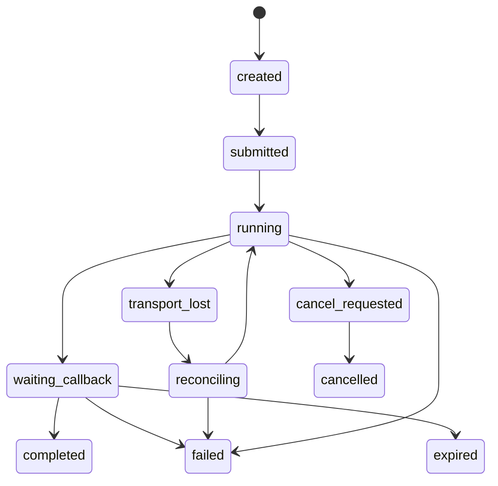
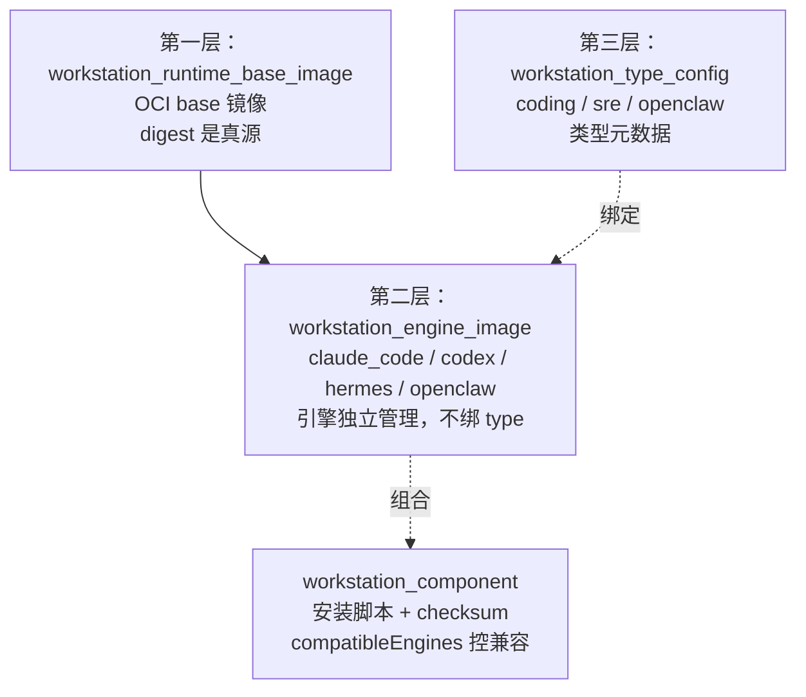
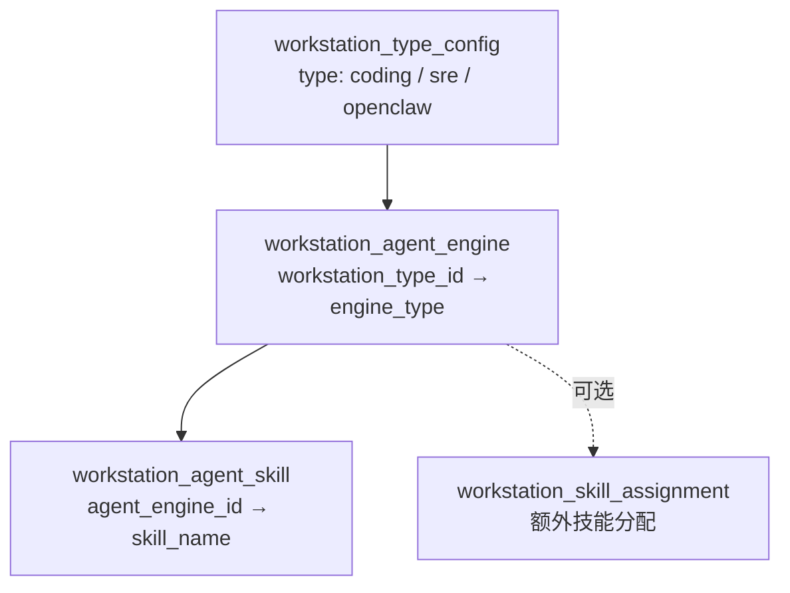
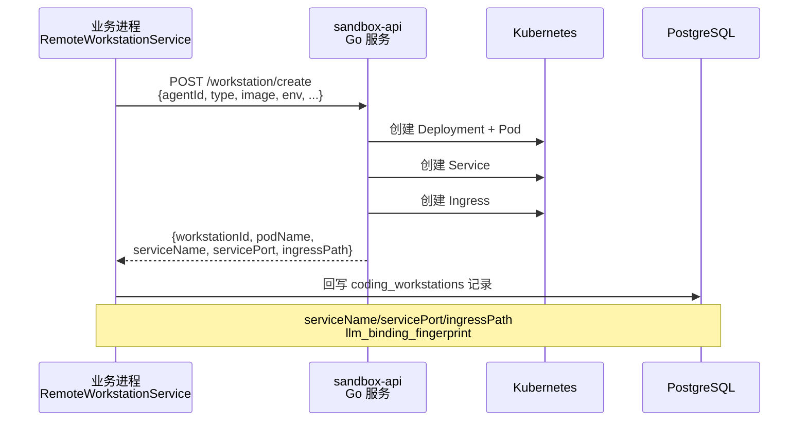
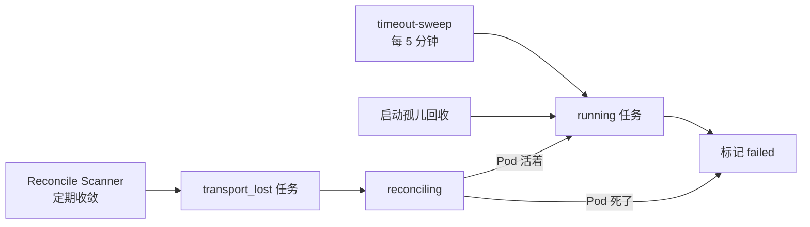

# 第 15 章 编码工作站

> "给 AI 一个安全的工作台，让它放手去写代码。"

普通的工具调用是无状态的——执行完就结束。但编码不一样：写代码需要持续在同一个工作目录里反复读写文件、跑测试、看报错、改代码，这是一个有状态的、长时间的交互过程。而且代码会接触到敏感凭证、生产配置，必须在隔离环境里跑。

WinMatrix 的编码工作站（Coding Workstation）就是为这类任务设计的。每个工作站是一个独立的 K8s Pod，有自己持久化的工作目录、隔离的网络、独立的 LLM binding。本章从任务的幂等与生命周期出发，逐步深入三层镜像模型、配置树、远程容器委托、workspace 双路径发现，最后看个人分身工作站这个独立的模型。

## 15.1 一切走远程 sandbox-api：非本地 docker

先澄清一个根本性的架构事实：**WinMatrix 的所有工作站都走远程 sandbox-api（K8s Pod），不走本地 docker**。

```typescript
// src/business/domain/workstation/runtime/BaseWorkstation.ts（第 1-9 行）
/**
 * 工作站抽象基类
 *
 * 统一 CodingWorkstation / SreWorkstation / OpenClawWorkstation 的通用逻辑：
 * ensureWorkstation、getStatus、stop/remove、execInWorkstation、cleanup 等。
 * 子类仅实现类型配置与 executeTask（若需要）。
 *
 * 所有工作站均通过远程 sandbox-api（K8s Pod）运行。
 */
```

这个决策的背景是：业务进程（Node.js）本身跑在 K8s 里，它没有 docker daemon，也不应该有——让业务进程能起容器意味着巨大的安全面。所以容器编排交给一个独立的 Go 服务 sandbox-api，它负责在 K8s 上创建/复用/销毁工作站 Pod。业务进程只是 sandbox-api 的客户端。

注意 `coding_workstations` 表里有个 `backend` 字段，默认值是 `"local"`：

```typescript
// prisma/schema.prisma（第 212-252 行）
model coding_workstations {
  id             String    @id
  container_name String    @unique
  agent_id       String
  /// employee | project — 运行时实例归属（与 agent_id 语义一致）
  owner_kind     String    @default("employee") @map("owner_kind")
  project_id     String?
  image          String
  config_hash    String?
  /// created | running | scaled_down | stopped | error
  status         String    @default("created")
  workspace_path String?
  // ...
  backend        String    @default("local")
  type           String    @default("coding")
  // ...
  /// Pod 创建期 LLM bindingFingerprint（无密钥）
  llm_binding_fingerprint String? @map("llm_binding_fingerprint")
  /// 工作站 UI 的 Ingress host（sandbox-api 创建时返回）
  ingressPath    String?   @map("ingress_path")
  /// 集群内 Service 名称
  serviceName    String?   @map("service_name")
  /// 集群内 Service 端口
  servicePort    Int?      @map("service_port")
```

`backend=local` 是历史遗留的默认值，不代表"本地 docker"——它表示这条记录是按本地（业务进程侧）视角登记的。真正的工作站运行形态由 K8s 字段决定：`serviceName`/`servicePort`（集群内访问入口）、`ingressPath`（UI 外部访问）、`llm_binding_fingerprint`（Pod 创建期 LLM 指纹，无密钥）。这些字段都是 sandbox-api 创建 Pod 后返回、再回写到 DB 的。

**字段命名会撒谎，注释和实际数据流才是真相。** 看到字段叫 `local` 不要想当然以为是真的本地执行。

## 15.2 CodingTask：幂等与回调安全

编码任务的核心数据模型是 CodingTask。它的字段极其丰富，因为一次编码任务要记住太多状态：在哪个工作站跑、用哪个 Claude session、产物在哪、回调到哪。

```typescript
// prisma/schema.prisma（第 310-386 行）
model CodingTask {
  id              String               @id @default(uuid())
  conversationId  String               @map("conversation_id")
  taskId          String?              @map("task_id")
  workstationId   String               @map("workstation_id")
  agentId         String               @map("agent_id")
  projectPath     String               @map("project_path")
  /// projects.id（canonical UUID）；与 session_binding_key 中间段一致
  canonicalProjectId String?          @map("canonical_project_id")
  taskDescription String               @map("task_description")
  status          String               @default("running")
  // ...
  /// 触发工具名（coding_task / sre_skill_task / execute_task），用于幂等索引
  triggerTool     String?              @map("trigger_tool")
  /// 幂等键（业务维度去重），running 状态下 (conversation_id, trigger_tool, idempotency_key) 唯一
  idempotencyKey  String?              @map("idempotency_key")
  /// 工作站 callback attempt 序号；同一 record 的迟到旧 attempt 不得覆盖新状态
  attemptNo       Int?                 @default(1) @map("attempt_no")
  callbackTokenHash String?            @map("callback_token_hash")
  callbackUrl     String?              @map("callback_url")
  sessionBindingKey String?            @map("session_binding_key")
  /// fix-workstation-dynamic-task-isolation: 任务指纹，用于隔离不同需求号/工单号的 Claude session
  taskFingerprint   String?            @map("task_fingerprint")
  claudeSessionId String?              @map("claude_session_id")
```

这里有三道安全机制层层叠加，每一道都是为了解决一个真实的并发/故障场景。

### 第一道：幂等去重

注释写得很明确：`running 状态下 (conversation_id, trigger_tool, idempotency_key) 唯一`。同一个会话里，用同一个触发工具、同一个幂等键，只能有一个 running 任务。重复请求（用户连点、网络重试）会复用已有的 running 任务，而不是创建新的。

```typescript
// src/business/domain/codingTask/CodingTaskRecordService.ts（第 70-80 行）
  async createOrReuseRunningRecord(
    fields: CreateCodingTaskRecordFields,
  ): Promise<{ id: string; reused: boolean }> {
    const result = await this.repository.createOrReuseRunningRecord(fields);
    // ...
  }
```

`createOrReuseRunningRecord` 就是这套机制在代码层的入口——要么创建新的、要么复用 running 的，返回 `reused` 标志让调用方知道这次是不是真的创建了：

```typescript
// src/business/domain/codingTask/CodingTaskRecordService.ts（第 65-97 行）
  /**
   * 创建或复用已有 running 记录（幂等）。
   * 若 triggerTool + idempotencyKey 有值且已存在同 conversationId 的 running 记录，
   * 返回 { id, reused: true }；否则新建并返回 { id, reused: false }。
   */
  async createOrReuseRunningRecord(
    fields: CreateCodingTaskRecordFields,
  ): Promise<{ id: string; reused: boolean }> {
    const result = await this.repository.createOrReuseRunningRecord(fields);
    if (result.reused) {
      logger.info(
        `[CodingTaskRecordService] 幂等复用: existingId=${result.id}, tool=${fields.triggerTool}, key=${fields.idempotencyKey}`,
      );
    } else {
      logger.info(
        `[CodingTaskRecordService] 创建记录 id=${result.id} conversationId=${fields.conversationId}`,
      );
    }
    // SRE / 工作站异步任务走 createOrReuseRunningRecord，须在 running 时推送 Dashboard WS
    if (!result.reused) {
      void import('@/business/domain/dashboard/dashboardWorkstationPublish.js').then(({ publishWorkstationTaskFromRecord }) =>
        publishWorkstationTaskFromRecord({
          recordId: result.id,
          agentId: fields.agentId,
          status: 'running',
          taskDescription: fields.taskDescription,
          projectInfo: fields.projectInfo,
          projectId: fields.canonicalProjectId,
        }),
      );
    }
    return result;
  }
```

注意 Dashboard WebSocket 推送只在 `!result.reused` 时发——复用已有任务不应该再触发"新任务开始"的 UI 提示，否则用户会看到一个已经在跑的任务莫名其妙地"又开始了"。**幂等不只是数据层不重复创建，连副作用（通知、UI 推送）都要幂等。**

### 容量感知的原子预留

`createOrReuseRunningRecord` 之上还有一层容量保护：

```typescript
// src/business/domain/codingTask/CodingTaskRecordService.ts（第 99-119 行）
  /**
   * 在同一数据库事务中完成 running 记录幂等复用、容量检查与新建占位。
   * 外联 Agent 派发入口应使用此方法，避免先 count 后 create 的并发窗口。
   */
  async createOrReuseRunningRecordWithinCapacity(
    fields: CreateCodingTaskRecordFields,
    maxConcurrent: number,
  ): Promise<RunningRecordCapacityReservation> {
    const result = await this.repository.createOrReuseRunningRecordWithinCapacity(fields, maxConcurrent);
    // ...
    if (!result.capacityAvailable) {
      logger.warn(
        `[CodingTaskRecordService] 容量占位失败: agentId=${fields.agentId}, running=${result.runningCount}, max=${result.maxConcurrent}`,
      );
    }
    return result;
  }
```

注释点出了一个经典并发陷阱："避免先 count 后 create 的并发窗口"。如果先查 `count(running)` 再决定是否 create，两次调用之间的并发会让 count 都通过、然后都 create，超出容量上限。这里把 count + create 放在**同一个数据库事务**里，保证容量检查和占位的原子性。外联 Agent 派发场景（外部系统批量派任务）用这个方法，而非裸的 createOrReuse。**并发控制要么用锁、要么用事务原子性，"先查后改"永远有 TOCTOU（Time-of-Check to Time-of-Use）窗口。**

### 第二道：attemptNo 防迟到回调

```typescript
  /// 工作站 callback attempt 序号；同一 record 的迟到旧 attempt 不得覆盖新状态
  attemptNo       Int?                 @default(1) @map("attempt_no")
```

工作站任务通过回调上报结果。但回调可能重试、可能乱序——attempt 2 已经回来了（任务成功了），attempt 1 的回调因为网络延迟现在才到（带着旧状态）。如果让迟到的旧 attempt 覆盖新状态，任务就会从"成功"莫名其妙变回"运行中"。`attemptNo` 机制确保：**回调的 attempt 号必须 >= 当前记录的 attempt 号才接受**，否则丢弃。

这种"防迟到消息覆盖"的需求在分布式系统里极其普遍。常见的解法是版本号/序号 monotonic 校验，这里用的是 attempt 序号。

### 第三道：callbackTokenHash 鉴权 + Claude session 复用

```typescript
  callbackTokenHash String?            @map("callback_token_hash")
```

回调不是谁都能发的。工作站创建时会签发一个 callback token，回调方必须带这个 token，服务端校验 `callbackTokenHash` 匹配才接受。防止伪造回调篡改任务状态。

而 Claude session 的复用则通过一条 partial unique index 实现：

```typescript
// prisma/schema.prisma（第 376-377 行）
  /// fix-workstation-dynamic-task-isolation: 按 session_binding_key + task_fingerprint 查询可复用 Claude session
  @@index([sessionBindingKey, taskFingerprint, status, updatedAt(sort: Desc)], map: "idx_coding_task_session_task_fingerprint_completed", where: raw("(claude_session_id IS NOT NULL AND status = 'completed')"))
```

这条 partial index 的条件是 `WHERE claude_session_id IS NOT NULL AND status = 'completed'`——只索引那些**已经有 Claude session 且成功完成**的历史任务。新任务来时，按 `sessionBindingKey + taskFingerprint` 查这条索引，能高效找到可复用的 Claude session。这避免了每次都开新 session 的开销，同时通过 `taskFingerprint`（任务指纹）保证只有"同一需求号/工单号"的任务才复用同一 session——不同需求的任务即使绑定到同一 sessionBindingKey 也不会串。

### 任务生命周期

```typescript
// src/business/domain/codingTask/codingTaskTypes.ts（第 1-12 行）
export type CodingTaskLifecycleStatus =
  | 'created'           // 已创建
  | 'submitted'         // 已提交
  | 'running'           // 运行中
  | 'waiting_callback'  // 等待回调
  | 'transport_lost'    // 传输丢失
  | 'reconciling'       // 收敛中
  | 'cancel_requested'  // 取消请求
  | 'completed'         // 已完成
  | 'failed'            // 失败
  | 'cancelled'         // 已取消
  | 'expired';          // 已过期
```



11 个状态里，`transport_lost` 和 `reconciling` 值得注意。`transport_lost` 表示与工作站的传输断了（网络故障、Pod 被驱逐），这时任务不能直接判失败——可能 Pod 还在跑，只是暂时联系不上。于是进入 `reconciling`（收敛中），由 Reconcile Scanner 主动去探测 Pod 真实状态，再决定是恢复到 `running` 还是判 `failed`。这种"传输断 ≠ 任务死"的认知，避免了大量误判。

## 15.3 三层镜像模型：引擎与运行时正交解耦

工作站要跑起来，需要一个容器镜像。但这个镜像里装什么，WinMatrix 拆成了三层。理解这三层是理解工作站可维护性的关键。



### 第一层：runtime base image（OCI 基础镜像）

```typescript
// prisma/schema.prisma（第 2151-2178 行）
model workstation_runtime_base_image {
  id          String  @id @default(cuid())
  name        String
  /// 版本（每次内容变化产生新版本，不可原地改写）
  version     String
  /// OCI 镜像仓库地址（如 registry.winning.com.cn/winex-wxp-copilot/winmatrix-runtime-base）
  repository  String
  /// 展示用 tag（如 1.0.4、latest）；生产关联以 digest 为真源
  tag         String
  /// OCI digest（如 sha256:abc123...）；构建成功后写入，是 Engine Image 关联的事实真源
  digest      String?
  /// 支持的平台列表（如 linux/amd64,linux/arm64）
  platforms   String?
  /// 状态：succeeded（就绪）| failed（异常）| pending（待处理）
  status      String  @default("succeeded")
  /// 是否启用；禁用后新建 Engine Image 不可再选，已关联历史保留
  isEnabled   Boolean @default(true) @map("is_enabled")
  // ...
  @@unique([repository, tag])
```

这是最底层的基础镜像——OS + 通用运行时（Node.js、git、常用工具）。它的关键设计是**digest 是真源，tag 只是展示**。注释明确：`展示用 tag（如 1.0.4、latest）；生产关联以 digest 为真源`。

为什么要这样？因为 tag 是可变的——`latest` 今天指向 v1.0.4，明天可能被覆盖成 v1.0.5。如果生产用 tag 关联，今天能跑的引擎明天可能行为变了，却查不出原因。digest 是镜像内容的密码学指纹，同一个 digest 永远指向同一个镜像层。**生产环境关联任何 OCI 资源，digest 是唯一可信的真源，tag 只是人类可读的别名。**

### 第二层：engine image（引擎镜像）

```typescript
// prisma/schema.prisma（第 2180-2216 行）
/// Engine Image Catalog — 三层镜像模型第二层
/// 独立管理 Engine 镜像构建产物，不绑定 workstation_type_config
model workstation_engine_image {
  id                 String   @id @default(cuid())
  engineType         String   @map("engine_type") // claude_code | codex | hermes | openclaw
  engineName         String   @map("engine_name")
  engineVersion      String?  @map("engine_version")
  // ...
  /// 关联的 Runtime Base Image ID
  runtimeBaseImageId String?  @map("runtime_base_image_id")
  /// OCI 镜像仓库地址
  imageRepository    String?  @map("image_repository")
  /// 展示用 tag
  imageTag           String?  @map("image_tag")
  /// OCI digest；构建成功后写入
  imageDigest        String?  @map("image_digest")
  /// 构建状态：pending | building | succeeded | failed
  imageBuildStatus   String   @map("image_build_status")
  // ...
  @@unique([engineType, engineName, engineVersion])
```

这一层装的是**编码引擎本身**——claude_code（Claude Code CLI）、codex、hermes、openclaw。每个引擎是独立的镜像，有自己的构建状态和 digest。

关键设计在注释里：**"独立管理 Engine 镜像构建产物，不绑定 workstation_type_config"**。引擎和类型是正交的：一个 `coding` 类型的工作站可以装 claude_code 引擎，也可以装 codex 引擎；反过来 claude_code 引擎既能装在 coding 工作站，也能装在 sre 工作站。引擎和类型不硬绑。

这种正交解耦带来巨大的灵活性。新增一个引擎（比如某天接入一个新的 AI coding 工具），不需要改类型配置——只要构建一个新的 engine image，它就能被任何类型的工作站选用。如果引擎和类型硬绑，加一个引擎要改所有相关类型的配置，维护成本随类型数×引擎数增长。

### 第三层：type config + component

类型配置是元数据，component 是可选的安装脚本：

```typescript
// prisma/schema.prisma（第 2285-2305 行）
/// Target Image 普通组件（安装脚本 + 版本 + checksum）
/// 保存完整安装脚本，只在 Target Image 构建期间执行
model workstation_component {
  id               String   @id @default(cuid())
  name             String
  description      String?
  /// 完整安装脚本内容
  installScript    String   @map("install_script")
  version          String
  /// 脚本内容 SHA-256
  checksum         String?
  sortOrder        Int      @default(0) @map("sort_order")
  /// 兼容的 engineType 列表（空数组表示全部兼容）
  compatibleEngines String[] @map("compatible_engines")
  isEnabled        Boolean  @default(true) @map("is_enabled")
```

`component` 存的是完整的安装脚本（install npm packages、配置环境变量之类的定制化内容）。每段脚本带 `checksum`（SHA-256）做版本追踪，`compatibleEngines` 数组控制这段脚本兼容哪些引擎——空数组表示全部兼容。

`compatibleEngines` 这个设计很巧妙。假设有个组件"安装 Python 工具链"，它兼容 claude_code 和 codex（都跑在 Linux 上），但不兼容某个特殊的 Windows 引擎。通过 `compatibleEngines: ['claude_code', 'codex']` 精确声明，组装 target image 时系统知道哪些组件能装进哪个引擎的镜像。**用声明式的兼容性矩阵，替代运行时试错。**

### type → engine → skill 配置树

把这些串起来的是一棵配置树：



```typescript
// prisma/schema.prisma（第 2219-2237 行）
/// 工站类型配置（元数据）
model workstation_type_config {
  id               String                     @id @default(cuid())
  type             String                     @unique
  name             String
  /// 默认镜像
  defaultImage     String?
  /// 默认资源配置 JSON (memory, cpus, etc.)
  defaultResources Json?
  /// 是否启用
  isEnabled        Boolean                    @default(true) @map("is_enabled")
  agentEngines     workstation_agent_engine[]

// prisma/schema.prisma（第 2241-2261 行）
/// 工作站智能体引擎配置
/// Engine Image Catalog 已拆分至独立模型 workstation_engine_image
model workstation_agent_engine {
  id                String                             @id @default(cuid())
  workstationTypeId String                             @map("workstation_type_id")
  engineType        String                             @map("engine_type")
  engineName        String                             @map("engine_name")
  // ...
  workstationType   workstation_type_config            @relation(...)
  skills            workstation_agent_skill[]
  @@unique([workstationTypeId, engineType])
```

`type_config`（类型）→ `agent_engine`（该类型下绑定的引擎）→ `agent_skill`（该引擎下绑定的技能）+ `workstation_skill_assignment`（额外的技能分配）。一棵完整的配置树，让"这个类型的编码工作站，用这个引擎，加载这些技能"这件事完全数据驱动，不写死在代码里。

## 15.4 工作站默认配置：单一来源

三种工作站类型有各自的默认配置，集中在一个文件里定义：

```typescript
// src/infrastructure/sandbox/config/workstationDefaults.ts（第 1-55 行）
/**
 * 工作站默认配置（单一来源）
 *
 * 所有类型的默认 image / memory / cpus / git 用户 均在此处定义，不读 process.env。
 * 可通过 AgentWorkstationConfig（DB agent_config.workstation JSONB）覆盖 image/memory/cpus。
 * Git 用户信息优先从数字员工表取，未配时回退此处默认值。
 */

const REGISTRY = 'registry.winning.com.cn/winex-wxp-copilot';

const DEFAULTS: Record<WorkstationType, WorkstationTypeDefaults> = {
  coding: {
    image: `${REGISTRY}/winmatrix-coding-workstation:latest`,
    memory: '4g',
    cpus: 2,
    pidsLimit: 256,
    networkEnabled: true,
    gitUserName: 'WinMatrix Coder',
    gitUserEmail: 'coder@winmatrix.local',
  },
  sre: {
    image: `${REGISTRY}/winmatrix-sre-workstation:latest`,
    memory: '4g',
    cpus: 2,
    pidsLimit: 256,
    networkEnabled: true,
    gitUserName: 'WinMatrix SRE',
    gitUserEmail: 'sre@winmatrix.local',
  },
  openclaw: {
    image: `${REGISTRY}/winmatrix-openclaw-workstation:latest`,
    memory: '4g',
    cpus: 2,
    pidsLimit: 256,
    networkEnabled: true,
    gitUserName: 'WinMatrix OpenClaw',
    gitUserEmail: 'openclaw@winmatrix.local',
  },
};
```

几个设计决策值得注意：

- **"单一来源，不读 process.env"**：默认配置全部硬编码在这个文件里，不通过环境变量覆盖。注释明确表态。环境变量是运维侧的灵活性，但在多实例部署时，不同实例读到不同的 env 会导致行为不一致，难以排查。把默认值固定在代码里、通过 DB 配置覆盖，是更可控的分层：代码定基线、DB 做定制。
- **三层覆盖**：代码默认（这里）→ DB 的 `agent_config.workstation` JSONB 覆盖 image/memory/cpus → 数字员工表的 git 用户信息。每一层覆盖特定字段，不是全量替换。
- **`pidsLimit: 256`**：限制容器内进程数。工作站里跑的编码引擎可能 fork 子进程（git、make、test runner），256 个进程上限防止失控的进程爆炸拖垮节点。
- **git 用户隔离**：每种类型有独立的 git 身份（`WinMatrix Coder` / `WinMatrix SRE` / `WinMatrix OpenClaw`）。这让不同类型工作站的 git commit 可区分来源，审计时能一眼看出是哪个引擎提交的。

## 15.5 绑定解析与工作站入口

工具调用进来到真正在工作站里执行命令，中间有一道"绑定解析"——确定这个数字员工在这个项目里该用哪个工作站。入口是 `resolveAndEnsureWorkstation`：

```typescript
// src/business/domain/workstation/resolveAndEnsureWorkstation.ts（第 21-50 行）
export interface ResolveAndEnsureWorkstationInput {
  digitalEmployeeId: string;
  projectId?: string;
  type: WorkstationType;
  projectPath?: string;
  config?: WorkstationEnsureConfig;
}

/**
 * 新任务入口：Binding Resolve → 按 type 选 runtime → lookup/ensure → 组装 execution context。
 */
export async function resolveAndEnsureWorkstation(
  input: ResolveAndEnsureWorkstationInput,
): Promise<ResolvedWorkstationHandle> {
  const digitalEmployeeId = input.digitalEmployeeId.trim();
  const projectId = input.projectId?.trim() ?? '';
  const type = input.type;
  const projectPath = input.projectPath?.trim()
    || pathRegistry.config.containerPath
    || path.join('/workspace', 'code');

  const binding = await resolveWorkstationBinding({
    digitalEmployeeId,
    projectId,
    type,
    failFast: true,
```

注释把整个流程概括成四步：**Binding Resolve → 按 type 选 runtime → lookup/ensure → 组装 execution context**。

1. **Binding Resolve**：查出这个员工+项目+类型应该绑定到哪个工作站（可能已存在，也可能要新建）。`resolveWorkstationBinding` 决定是复用已有的还是创建新的。
2. **按 type 选 runtime**：通过工厂拿到对应类型的 Workstation 实例（CodingWorkstation / SreWorkstation / OpenClawWorkstation）。
3. **lookup/ensure**：在 DB 和 sandbox-api 里查找或创建工作站记录。不存在就 `ensureWorkstation`（调 sandbox-api 创建 K8s 资源栈）。
4. **组装 execution context**：把 workstationId、容器路径、网络入口等组装成 `ResolvedWorkstationHandle`，供后续命令执行使用。

`projectPath` 的回退链值得注意：`input.projectPath` → `pathRegistry.config.containerPath` → `/workspace/code`。三级回退保证总有一个合理的工作目录，不会因为某个配置缺失就空指针。

## 15.6 WorkstationRunner：委托远程容器

工具层（WorkspaceReadTool / WorkspaceWriteTool / WorkspaceExecTool / WorkspaceGlobTool）不直接操作文件系统，而是把所有操作委托给远程容器里的 WorkstationRunner：

```typescript
// src/business-tools/workstation/runner/WorkstationRunner.ts（第 1-60 行）
/**
 * 工作站 Runner：在编码工作站长容器内执行。
 *
 * 把原 WorkspaceReadTool / WorkspaceWriteTool / WorkspaceExecTool 中的工作站
 * 调用逻辑抽到这里，工具层只负责参数解析、路径校验与 runner 调度。
 */

const DEFAULT_TIMEOUT_MS = 300_000;

export class WorkstationRunner implements IWorkspaceCommandRunner {
  readonly kind = 'workstation' as const;

  async runRead(
    absoluteFilePath: string,
    options: WorkspaceReadOptions,
    ctx: WorkspaceRunnerContext,
  ): Promise<string> {
    const cmd = this.buildReadCommand(absoluteFilePath, options);
    return this.exec(cmd, undefined, ctx);
  }

  async runWrite(
    absoluteFilePath: string,
    content: string,
    options: WorkspaceWriteOptions,
    ctx: WorkspaceRunnerContext,
  ): Promise<void> {
    const cmd = this.buildWriteCommand(absoluteFilePath, content, options);
    await this.exec(cmd, undefined, ctx);
  }

  async runExec(
    command: string,
    options: WorkspaceExecOptions,
    ctx: WorkspaceRunnerContext,
  ): Promise<string> {
```

Runner 暴露四类操作：`runRead`（读文件）、`runWrite`（写文件）、`runExec`（执行命令）、`runGlob`（glob 匹配）。每类都是把操作编译成一条 shell 命令，再通过 `exec` 发给远程容器执行。

这套设计的好处是**工具层和执行层彻底分离**。工具层只管参数解析和路径校验（这个路径合法吗？要不要 shell escape？），不关心命令最终在哪执行。Runner 层只管把操作翻译成命令并委托出去。未来如果要换执行后端（比如从 K8s Pod 换成别的东西），只动 Runner，工具层零改动。

### workspace 双路径发现

工作站里有个绕不开的问题：**同一个文件，业务进程看到的路径和容器里看到的路径不一样**。业务进程挂载的是宿主机路径（hostPath），容器里看到的是容器内路径（containerPath）。一个工具说"读 `/data/project/foo.ts`"，这个路径在容器里可能是 `/workspace/project/foo.ts`。

```typescript
// src/business-tools/workstation/workspaceDiscovery/buildWorkspaceDiscoveryContext.ts
// 维护 hostPath 与 containerPath 的双向映射
// 通过 pathRegistry 双向转换
```

WinMatrix 用 pathRegistry 做双向转换：拿到一个 hostPath，查出对应的 containerPath 再发给容器；容器返回的 containerPath，翻译回 hostPath 给工具层。这层转换对工具层是透明的——工具以为自己操作的就是它看到的路径，背后 pathRegistry 悄悄做了翻译。

**异构系统之间路径/标识的映射，是分布式系统里最隐蔽也最磨人的问题之一。** 不处理好，轻则文件找不到，重则写到错误的位置覆盖了别的文件。把它收敛到一个 pathRegistry 统一管理，而不是每个工具各写一套转换逻辑，是控制复杂度的关键。

## 15.7 工作站创建：sandbox-api 的 K8s 资源栈

创建一个工作站，是让 sandbox-api 在 K8s 上起一整套资源。业务侧通过 `RemoteWorkstationService` 发起请求：



请求体里关键的字段：

- `agentId`：用 `digitalEmployeeId` 标识，便于按员工复用工作站。
- `type`：coding / sre / openclaw。
- `image`：OCI 镜像，取自三层镜像模型的最终组装结果。
- `env`：环境变量，包含 LLM binding 相关的指纹（无密钥）。
- `workspacePath`、`expectedWorkspaceMounts`：工作目录和挂载预期。

sandbox-api 返回完整的 K8s 资源标识：workstationId、podName、deploymentName、serviceName、ingressHost。业务侧把这些回写到 `coding_workstations` 表的 K8s 字段。

几个超时常量值得记住：

```typescript
// src/business/domain/workstation/runtime/RemoteWorkstationService.ts（第 63-78 行）
const DEFAULT_EXEC_TIMEOUT_MS = 3_600_000;              // 1 小时执行超时
const DEFAULT_WORKSTATION_ERROR_RECREATE_GRACE_MS = 120_000;  // 错误重建宽限期
const DEFAULT_AGENT_HOME_MOUNT_PATH = '/winmatrix-agent-home';
const WORKSTATION_CREATE_RESTART_PROTECT_MS = 10 * 60 * 1000;  // 创建重启保护
```

`DEFAULT_EXEC_TIMEOUT_MS = 1 小时`——工作站里的单次命令执行可以跑 1 小时。这远超普通工具的超时，因为编码任务确实可能长时间运行（大型测试套件、长时间构建）。`WORKSTATION_CREATE_RESTART_PROTECT_MS = 10 分钟`是创建保护期：工作站刚创建的 10 分钟内，即使检测到异常也不会触发重建，避免创建和重建逻辑互相打架。

### 命令执行的探测先行

```typescript
// RemoteWorkstationService.ts（第 563-611 行）
// /workstation/exec 先发 exec=true 探测，再执行实际命令
// sandbox-api 在 K8s exec 失败时返回 HTTP 200 + success:false
// （Pod 已被删除的情况）
```

一个容易踩的坑：sandbox-api 在 Pod 已被删除（比如被 K8s 驱逐）时，`/workstation/exec` 不会返回 HTTP 5xx，而是返回 **HTTP 200 + `success: false`**。因为从 sandbox-api 的角度看，"Pod 不在了"不是一个传输层错误（HTTP 5xx），而是一个正常的业务结果——命令没跑成功，但请求被正确处理了。

所以业务侧必须检查响应体的 `success` 字段，不能只看 HTTP 状态码。exec 前先发一个 `exec=true` 探测，确认 Pod 还活着，再执行实际命令。**不同服务对 HTTP 状态码的语义约定不一致，客户端必须按对方的约定来，不能假设全世界的 API 都遵守 REST 惯例。**

## 15.8 工作站类层次与工厂

三种工作站类型共享一个抽象基类，各自实现差异：

```typescript
// src/business/domain/workstation/runtime/BaseWorkstation.ts（第 1-9 行）
/**
 * 工作站抽象基类
 *
 * 统一 CodingWorkstation / SreWorkstation / OpenClawWorkstation 的通用逻辑：
 * ensureWorkstation、getStatus、stop/remove、execInWorkstation、cleanup 等。
 * 子类仅实现类型配置与 executeTask（若需要）。
 */
```

`BaseWorkstation` 承担所有通用逻辑：`ensureWorkstation`（确保工作站存在，不存在就创建）、`getStatus`、`stop/remove`、`execInWorkstation`、`cleanup`。子类只实现自己的类型配置（`getWorkstationType()` / `getDefaultConfig()`）和 `executeTask`（如果行为有差异）。

```typescript
// src/business/domain/workstation/runtime/WorkstationFactory.ts
export function getWorkstationForDigitalEmployee(
  digitalEmployeeId: string,
  targetType?: WorkstationType,
) {
  // 通过 IWorkstationConfigResolver（DI）解析类型
  // 同一 Role 的不同员工可以使用不同工作站类型
  // 懒加载 SRE 和 OpenClaw 工作站
}
```

工厂函数 `getWorkstationForDigitalEmployee` 通过依赖注入的 `IWorkstationConfigResolver` 解析目标类型。注释里有个重要特性：**同一 Role 的不同员工可以使用不同工作站类型**。这不是写死的——配置树让粒度细到单个员工，同是 tech_manager 角色下的两个员工，一个用 coding 工作站、一个用 sre 工作站，完全可行。

SRE 和 OpenClaw 工作站是**懒加载**的——只有真正用到时才加载对应的类，不用就不加载。因为这些工作站用得少，启动时就全加载是浪费。

## 15.9 个人分身工作站：独立模型

最后讲一个容易被忽视但很重要的设计：**个人分身工作站用的是独立的模型，不混在 `coding_workstations` 里**。

```typescript
// prisma/schema.prisma（第 3623 行起）
/// 个人数字分身：用户专属逻辑 Workstation（一用户一条；不复用 coding_workstations.agent_id 的员工语义）
model UserPersonalWorkstation {
  id                 String    @id @default(uuid())
  // ...
}
```

注释一语中的：**"不复用 coding_workstations.agent_id 的员工语义"**。`coding_workstations` 里的 `agent_id` 是数字员工（角色实例）的语义——多个用户可能共享同一个数字员工的工作站。但个人分身是"一用户一条"的，每个用户有自己专属的工作站，和员工级的工作站语义完全不同。

为什么不能复用？因为如果硬塞进同一张表，就得加 `owner_kind`、`user_id` 之类的字段区分语义，查询时要小心避开个人工作站，统计时要排除，稍不注意就串了。用独立模型把两种语义从 schema 层面隔离，是"模型爆炸"和"语义混淆"之间的正确取舍。

个人分身工作站还有独特的可用性策略：

- `availabilityPolicy = adaptive | always_on | on_demand`：adaptive（按需自适应启停）、always_on（常驻）、on_demand（显式请求才起）。
- `podGeneration`：Pod 的代次，用于追踪重建历史。

这套策略让个人工作站能根据用户习惯和资源成本动态调整——不活跃用户的分身缩容，活跃用户的分身常驻，既保证响应速度又控制集群成本。

## 15.10 超时清理与孤儿回收

编码任务可能因各种原因中断：网络问题、Pod 崩溃、进程 OOM。系统需要主动清理这些"悬挂"状态的任务。

系统定时任务 `system-coding-task-timeout-sweep`（每 5 分钟）标记超时的 running 状态编码任务为 failed。启动时也有孤儿回收：进程上次异常退出时，可能留下 running 状态的任务——这些任务不可能再完成了（执行它们的进程已经不在了），启动时把它们一次性标记为 failed。

此外还有工作站任务 Reconcile Scanner，定期收敛状态不一致的任务。前面提到的 `transport_lost` → `reconciling` 转换，就是由这个 Scanner 驱动的：它主动探测那些传输断开的任务的真实 Pod 状态，决定恢复还是判死。



三条清理路径各管一摊：timeout-sweep 管超时、启动孤儿回收管进程崩溃遗留、Reconcile Scanner 管传输断开。**分布式系统里，"清理"永远不是单一机制能搞定的——不同的故障模式需要不同的清理策略，而且它们必须共存。**

## 本章小结

本章深入分析了 WinMatrix 的编码工作站系统：

1. **一切走远程 sandbox-api**：BaseWorkstation.ts:8 明示所有工作站均通过远程 K8s Pod 运行，非本地 docker；`coding_workstations.backend=local` 是历史默认值，真正运行形态由 K8s 字段（serviceName/servicePort/ingressPath/llm_binding_fingerprint）决定。
2. **CodingTask 三道安全机制**：(conversation_id, trigger_tool, idempotency_key) running 态去重 + attemptNo 防迟到旧 attempt 覆盖 + callbackTokenHash 鉴权；partial unique index 复用已完成 Claude session（按 sessionBindingKey + taskFingerprint 匹配）。
3. **11 态生命周期**：包含 transport_lost → reconciling 的优雅降级，"传输断 ≠ 任务死"。
4. **三层镜像模型**：runtime_base_image（digest 真源，tag 仅展示）→ engine_image（claude_code/codex/hermes/openclaw，独立管理不绑 type）→ component（安装脚本 + checksum + compatibleEngines 控兼容），引擎与运行时正交解耦。
5. **type→engine→skill 配置树**：type_config → agent_engine → agent_skill + workstation_skill_assignment，全数据驱动。
6. **WorkstationRunner 委托远程容器**：runRead/runWrite/runExec/runGlob 四类操作编译成 shell 命令发往容器，工具层与执行层分离。
7. **workspace 双路径发现**：hostPath 与 containerPath 经 pathRegistry 双向转换，对工具层透明。
8. **工作站创建**：sandbox-api 创建 Deployment + Pod + Service + Ingress 完整 K8s 资源栈；exec 探测先行（HTTP 200 + success:false 表示 Pod 已删）；1 小时执行超时 + 10 分钟创建保护期。
9. **类层次与工厂**：BaseWorkstation 统一通用逻辑，子类仅实现类型配置与 executeTask；同 Role 不同员工可用不同类型，SRE/OpenClaw 懒加载。
10. **个人分身工作站独立模型**：UserPersonalWorkstation 不复用 coding_workstations.agent_id 员工语义，availabilityPolicy（adaptive/always_on/on_demand）+ podGeneration。
11. **三路清理**：timeout-sweep（超时）+ 启动孤儿回收（进程崩溃遗留）+ Reconcile Scanner（传输断开收敛）。

编码工作站让数字员工有了"动手写代码"的能力。但写代码需要依据——需求文档、设计规范、历史决策。这些知识从哪来？在下一章中，我们将深入知识库系统，看 WinMatrix 如何把企业的非结构化文档变成可检索、可复用的知识资产。
