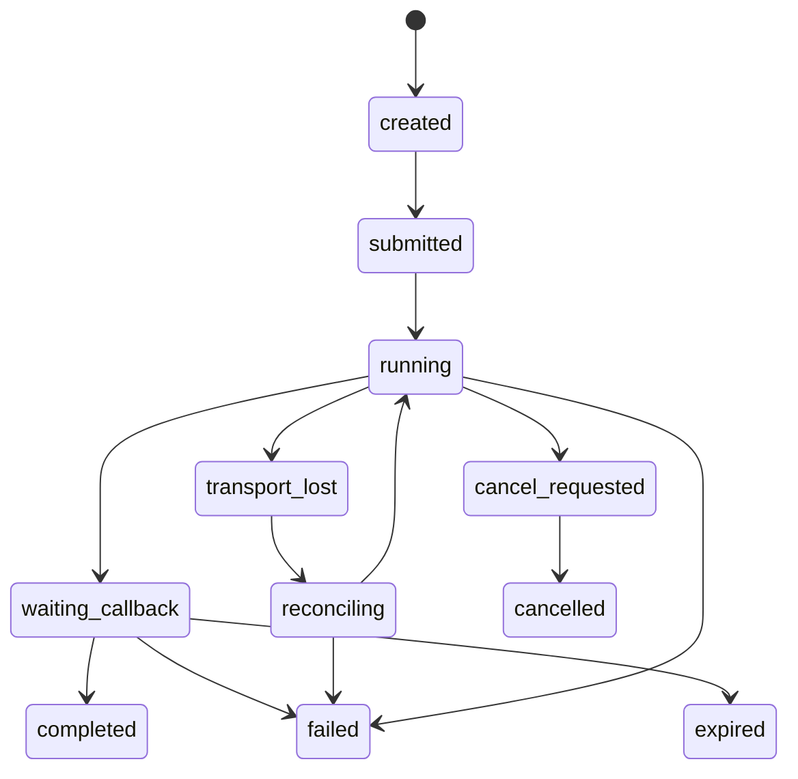
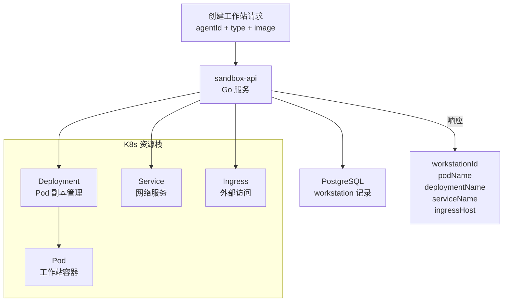

# 第 15 章 编码工作站

> "给 AI 一个安全的工作台，让它放手去写代码。"

编码工作站（Coding Workstation）让数字员工能够在隔离的沙箱环境中执行真实的编码任务——写代码、跑测试、做运维。这不是简单的命令执行，而是一套完整的 K8s Pod 生命周期管理系统。本章将深入工作站的类型配置、沙箱管理和任务执行。

## 15.1 CodingTask 模型与生命周期

编码任务的完整生命周期包含 11 个状态：

```typescript
// src/business/domain/codingTask/codingTaskTypes.ts（第 1-12 行）
export type CodingTaskLifecycleStatus =
  | 'created'           // 已创建
  | 'submitted'         // 已提交
  | 'running'           // 运行中
  | 'waiting_callback'  // 等待回调
  | 'transport_lost'    // 传输丢失
  | 'reconciling'       // 收敛中
  | 'cancel_requested'  // 取消请求
  | 'completed'         // 已完成
  | 'failed'            // 失败
  | 'cancelled'         // 已取消
  | 'expired';          // 已过期
```



### CodingTaskRecordService

```typescript
// src/business/domain/codingTask/CodingTaskRecordService.ts（第 33-56 行）
export function getCodingTaskRecordService(): CodingTaskRecordService {
  // 单例
}

export class CodingTaskRecordService {
  constructor(
    private readonly repository: ICodingTaskRecordRepository = codingTaskRecordRepository
  ) {}

  async createRecord(fields: CreateCodingTaskRecordFields): Promise<string> {
    const id = await this.repository.createRecord(fields);
    // 异步发布仪表盘事件
    void import('@/business/domain/dashboard/dashboardWorkstationPublish.js')
      .then(({ publishWorkstationTaskFromRecord }) =>
        publishWorkstationTaskFromRecord({
          recordId: id, agentId: fields.agentId, status: 'running',
          taskDescription: fields.taskDescription, projectInfo: fields.projectInfo,
        }),
      );
    return id;
  }

  // 幂等创建：如果已有 running 任务则复用
  async createOrReuseRunningRecord(
    fields: CreateCodingTaskRecordFields,
  ): Promise<{ id: string; reused: boolean }> {
    // ...
  }
}
```

`createOrReuseRunningRecord` 的幂等设计确保重复请求不会创建多个任务——如果已有 running 状态的任务，直接复用。

### 任务字段

```typescript
// src/business/domain/codingTask/codingTaskTypes.ts（第 14-55 行）
export interface CreateCodingTaskRecordFields {
  workstationId: string;
  projectPath: string;
  canonicalProjectId: string;
  triggerTool: 'coding_task' | 'sre_skill_task' | 'execute_task';
  idempotencyKey: string;        // 幂等键
  taskFingerprint: string;        // 任务指纹
  claudeSessionId?: string;
  resumeMode: 'new_session' | 'resume_existing';
  hostProjectPath: string;
  workstationProjectPath: string;
  hostWorkDir: string;
  workstationWorkDir: string;
  artifactRunRoot: string;
  // ...
}
```

`idempotencyKey` 和 `taskFingerprint` 是幂等性的双重保障——即使请求重试，相同指纹的任务不会重复执行。

## 15.2 工作站类型配置

WinMatrix 支持三种工作站类型：

```typescript
// src/infrastructure/sandbox/types.ts（第 49 行）
export type WorkstationType = 'coding' | 'sre' | 'openclaw';
```

| 类型 | 用途 | 引擎 |
|------|------|------|
| **coding** | 编码任务 | claude / codex / hermes |
| **sre** | 运维任务 | - |
| **openclaw** | OpenClaw Agent | openclaw |

### 默认配置

```typescript
// src/infrastructure/sandbox/config/workstationDefaults.ts（第 11-55 行）
const REGISTRY = 'registry.winning.com.cn/winex-wxp-copilot';

const DEFAULTS: Record<WorkstationType, WorkstationTypeDefaults> = {
  coding: {
    image: `${REGISTRY}/winmatrix-coding-workstation:latest`,
    memory: '4g', cpus: 2, pidsLimit: 256, networkEnabled: true,
    gitUserName: 'WinMatrix Coder',
    gitUserEmail: 'coder@winmatrix.local',
  },
  sre: {
    image: `${REGISTRY}/winmatrix-sre-workstation:latest`,
    // ...
  },
  openclaw: {
    image: `${REGISTRY}/winmatrix-openclaw-workstation:latest`,
    // ...
  },
};
```

每种工作站类型有独立的容器镜像、资源限制（内存/CPU/PID）和网络配置。

### 数据库配置

```typescript
// workstation_type_config Prisma 模型字段
model workstation_type_config {
  id: string;
  type: string;                    // coding / sre / openclaw
  name: string;
  defaultImage: string;            // 默认镜像
  defaultResources: Json;          // 默认资源（memory, cpus）
  isEnabled: boolean;
  agentEngines: workstation_agent_engine[];  // 引擎绑定（1对多）
}
```

## 15.3 沙箱管理

沙箱执行有两种模式：

```typescript
// src/infrastructure/sandbox/index.ts（第 43-53 行）
const SANDBOX_SERVICE_URL = process.env.SANDBOX_SERVICE_URL ?? '';

function createSandbox(): ISandbox {
  if (!SANDBOX_SERVICE_URL) {
    logger.warn('SANDBOX_SERVICE_URL 未配置，使用 No-op 沙箱（命令执行将返回失败）。');
    return new NoopSandbox();   // 无操作沙箱（本地开发）
  }
  return new RemoteSandbox();   // 远程沙箱（生产）
}

export const sandbox: ISandbox = createSandbox();
```

### ISandbox 接口

```typescript
// src/infrastructure/sandbox/types.ts（第 32-40 行）
export interface ISandbox {
  runCommand(
    command: string | string[],
    workDir: string,
    limits: ResourceLimits,
    allowNetwork: boolean,
    env: Record<string, string>,
  ): Promise<CommandResult>;
}
```

### RemoteSandbox

```typescript
// src/infrastructure/sandbox/command/remoteSandbox.ts（第 39-59 行）
// POST 到 ${SANDBOX_SERVICE_URL}/run
// Body: { command, workDir, memory, cpu, timeout, allowNetwork, env }
// 默认超时 320000ms（略高于常见的 300s 限制）
```

## 15.4 K8s Pod 管理：sandbox-api

`RemoteWorkstationService` 是 sandbox-api（Go 服务）的客户端，负责在 K8s 上管理工作站 Pod：

```typescript
// src/business/domain/workstation/runtime/RemoteWorkstationService.ts（第 1-6 行）
/**
 * 远程工作站服务
 * 通过 sandbox-api 在 K8s 上创建/复用长期 Pod，并在 DB 中记录。
 * 支持 coding / sre / openclaw 三种工作站类型。
 */
```

### 关键常量

```typescript
// src/business/domain/workstation/runtime/RemoteWorkstationService.ts（第 63-78 行）
const DEFAULT_EXEC_TIMEOUT_MS = 3_600_000;              // 1 小时执行超时
const DEFAULT_WORKSTATION_ERROR_RECREATE_GRACE_MS = 120_000;  // 错误重建宽限期
const DEFAULT_AGENT_HOME_MOUNT_PATH = '/winmatrix-agent-home';
const WORKSTATION_CREATE_RESTART_PROTECT_MS = 10 * 60 * 1000;  // 创建重启保护
```

### 创建工作站

```typescript
// src/business/domain/workstation/runtime/RemoteWorkstationService.ts（第 1053-1137 行）
async function fetchWorkstationCreate(/* params */) {
  const createBody: Record<string, unknown> = {
    agentId: digitalEmployeeId,        // 用 digitalEmployeeId 标识，便于复用
    agentLabelRoot: remoteParams.agentLabelRoot,
    workspacePath,
    type,                              // coding / sre / openclaw
    image: remoteParams.image?.trim() || getDefaults(type).image,
    env,
    agentConfig: remoteParams,
    projectId: projectId?.trim() || undefined,
    workspaceScope: remoteParams.workspaceScope,
    expectedWorkspaceMounts: remoteParams.expectedWorkspaceMounts,
  };

  const res = await fetch(createUrl, {
    method: 'POST',
    headers: { 'Content-Type': 'application/json' },
    body: JSON.stringify(createBody),
  });

  const data = (await res.json()) as WorkstationCreateApiResponse;
  // data 包含: workstationId, podName, deploymentName, serviceName, ingressHost
}
```

sandbox-api 为每个工作站创建完整的 K8s 资源栈：



### sandbox-api 端点

| 端点 | 方法 | 用途 |
|------|------|------|
| `/workstation/create` | POST | 创建/复用工作站 |
| `/workstation/exec` | POST | 在 Pod 内执行命令 |
| `/workstation/:id` | DELETE | 销毁工作站 |
| scale 接口 | - | 缩容/复用（scaled_down） |

### 命令执行与故障检测

```typescript
// RemoteWorkstationService.ts（第 563-611 行）
// /workstation/exec 先发 exec=true 探测，再执行实际命令
// sandbox-api 在 K8s exec 失败时返回 HTTP 200 + success:false
// （Pod 已被删除的情况）
```

## 15.5 工作站类层次

```typescript
// src/business/domain/workstation/runtime/BaseWorkstation.ts（第 1-9 行）
/**
 * 工作站抽象基类
 *
 * 统一 CodingWorkstation / SreWorkstation / OpenClawWorkstation 的通用逻辑：
 * ensureWorkstation、getStatus、stop/remove、execInWorkstation、cleanup 等。
 *
 * 所有工作站均通过远程 sandbox-api（K8s Pod）运行。
 */
```

### CodingWorkstation

```typescript
// src/business/domain/workstation/runtime/CodingWorkstation.ts（第 26-80 行）
export class CodingWorkstation extends BaseWorkstation implements ICodingWorkstation {
  getWorkstationType(): 'coding' { return 'coding'; }

  getDefaultConfig() { return getDefaults('coding'); }

  async executeTask(
    workstationId: string,
    task: CodingTask,
    onProgress?: (message: string) => void,
  ): Promise<CodingTaskResult> {
    // 在工作站内执行编码任务
    // workdir 通过 pathRegistry.toSandboxContainerPath() 解析
  }
}
```

### 工作站工厂

```typescript
// src/business/domain/workstation/runtime/WorkstationFactory.ts（第 47-60 行）
export function getWorkstationForDigitalEmployee(
  digitalEmployeeId: string,
  targetType?: WorkstationType,
) {
  // 通过 IWorkstationConfigResolver（DI）解析类型
  // 同一 Role 的不同员工可以使用不同工作站类型
  // 懒加载 SRE 和 OpenClaw 工作站
}
```

工厂模式支持**同一角色的不同员工使用不同工作站类型**——这是一个灵活的设计，允许细粒度的工作站配置。

## 15.6 超时清理与孤儿回收

编码任务可能因为各种原因中断（网络问题、Pod 崩溃）。系统通过定时任务清理：

```typescript
// 系统定时任务：system-coding-task-timeout-sweep（每 5 分钟）
// 标记超时的 running 状态编码任务为 failed
```

启动时也有孤儿回收（见第 2 章）：

```typescript
// src/index.ts（启动时）
const orphanCount = await svc.failTimedOutRunningTasks(0);
if (orphanCount > 0) {
  logger.warn(`[Startup] 孤儿回收: ${orphanCount} 个 running 状态编码任务被标记为 failed`);
}
```

此外还有工作站任务 Reconcile Scanner，定期收敛状态不一致的任务。

## 15.7 工作站状态聚合

`EmployeeService` 聚合工作站的实时状态（见第 9 章）：

```typescript
export type CodingWorkstationListStatus = 'running' | 'created' | 'scaled_down' | 'error' | null;
```

这个状态会展示在数字员工列表中，让管理员了解每个员工的工作站运行情况。

## 本章小结

本章深入分析了 WinMatrix 的编码工作站系统：

1. **11 态生命周期**：从 created 到 completed/failed/cancelled/expired
2. **幂等创建**：`createOrReuseRunningRecord` + idempotencyKey + taskFingerprint
3. **三种工作站类型**：coding（编码）/ sre（运维）/ openclaw（OpenClaw Agent）
4. **默认配置**：独立镜像 + 资源限制 + 网络配置
5. **沙箱抽象**：NoopSandbox（开发）+ RemoteSandbox（生产）
6. **K8s 资源栈**：sandbox-api 创建 Deployment + Pod + Service + Ingress
7. **sandbox-api 端点**：create / exec / delete / scale
8. **类层次**：BaseWorkstation → CodingWorkstation / SreWorkstation / OpenClawWorkstation
9. **工厂模式**：同一角色不同员工可使用不同工作站类型
10. **超时清理**：定时 sweep + 启动孤儿回收 + Reconcile Scanner

在下一章中，我们将进入知识与 RAG 系统。
