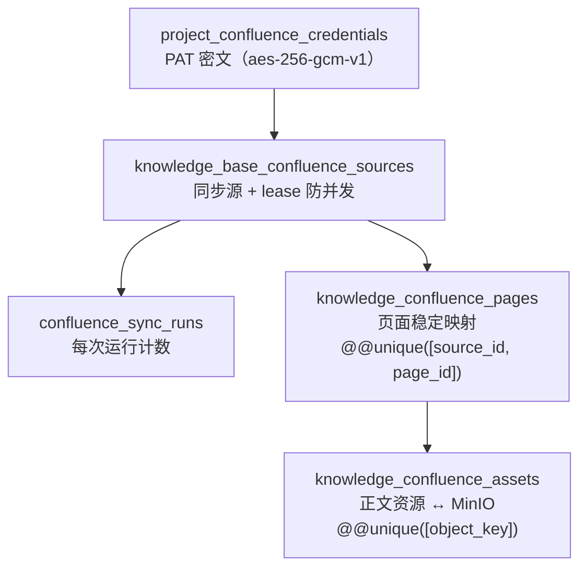
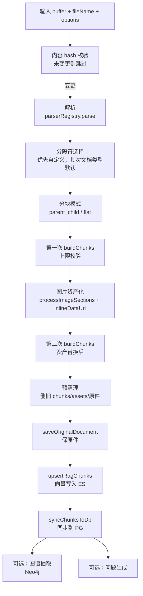

# 第 16 章 知识库系统

> "知识是 RAG 的燃料，分块是燃烧的效率。"

编码工作站让数字员工有了"动手"的能力，但动手之前得先"知道"。需求文档、设计规范、Confluence Wiki、历史决策记录——这些企业知识是数字员工回答问题、做出决策的依据。WinMatrix 的知识库系统负责把这些非结构化的文档，转化成可检索、可复用的向量知识。

本章从知识库的数据模型出发，逐步深入 Confluence 同步的完整审计链、分块双模式的同算法设计、独立 embedding 微服务、入库即资产化的 pipeline，最后看这个 pipeline 如何被 RagService 串成一条完整的摄入流水线。

## 16.1 三型一表：知识库的数据模型

WinMatrix 支持三种知识库，但它们共用同一张表。这是一个值得展开的设计决策。

```typescript
// prisma/schema.prisma（第 1456-1488 行）
model knowledge_bases {
  id                         String           @id @default(uuid())
  project_id                 String
  name                       String
  description                String?
  /// 知识库类型：document=文档型，faq=问答型，tfs_git=TFS Git仓库型
  type                       String           @default("document")
  /// 分块配置 JSON（chunk_size, chunk_overlap, split_markers 等）
  chunking_config            Json             @default("{}")
  /// 嵌入模型标识（可选，留空用系统默认）
  embedding_model            String?
  /// 图谱抽取配置 JSON（enabled, tags/关系类型列表, examples 等），对标 WeKnora extract_config
  extract_config             Json?
  is_pinned                  Boolean          @default(false)
  // ...
  /// FAQ 索引配置 JSON（indexMode, questionIndexMode）
  faq_config                 Json?
  /// 问题生成配置 JSON（enabled, questionCount）
  question_generation_config Json?
  /// TFS Git 配置 JSON（仅 type=tfs_git 时有效）：{ organization, project, repositoryId, branch, path, credentialSource, credentials, lastSyncCommitId }
  tfs_git_config             Json?
  // ...
}
```

三种知识库类型由单字段 `type` 承载：

- **document**：文档型，最常见。PDF / Word / Excel / Markdown 都走这条。
- **faq**：问答型，Q&A 对，用 `faq_config` 配置索引模式。
- **tfs_git**：TFS/Git 仓库型，用 `tfs_git_config` 存仓库地址、分支、路径、凭证。

为什么不建三张表？因为三种类型共享的字段远多于差异字段——`project_id`、`name`、`chunking_config`、`embedding_model`、`extract_config` 这些都一样。如果建三张表，这些公共字段要重复三遍，查询时要 UNION，维护成本高。差异部分（`faq_config` / `tfs_git_config`）用 Json 字段承载，按需存在。

这种"公共字段平铺 + 差异字段 Json"的设计哲学贯穿整个 schema：

| 设计点 | 实现 | 收益 |
|--------|------|------|
| 类型区分 | 单字段 `type` | 一张表，查询简单 |
| 公共配置 | 平铺列（chunking_config 等） | 强类型，可索引 |
| 类型专属配置 | Json 字段（faq_config / tfs_git_config） | 灵活，避免模型爆炸 |

注释里提到"对标 WeKnora extract_config"——WinMatrix 的知识库系统在很多地方都明确标注了移植自 WeKnora（一个开源 RAG 框架）的来源。不重新发明轮子，好的实现直接借鉴，是工程成熟度的体现。

### 知识条目与分块

知识库下面是知识条目（`knowledges`），再下面是分块（`knowledge_chunks`）：

```typescript
// prisma/schema.prisma（第 1490-1527 行）
/// 知识条目（知识库内的单个文档/URL/手工条目）
model knowledges {
  id                String             @id @default(uuid())
  knowledge_base_id String
  /// 条目类型：file=上传文件，url=URL导入，manual=手动创建，tfs_git_file=TFS Git仓库文件，confluence_page=Confluence 页面
  type              String
  title             String
  // ...
  /// 解析状态：pending / processing / completed / failed
  parse_status      String             @default("pending")
  /// 启用状态：enabled / disabled
  enable_status     String             @default("enabled")
  /// 文件内容哈希（去重用）
  file_hash         String?
```

```typescript
// prisma/schema.prisma（第 1660-1682 行）
model knowledge_chunks {
  id              String     @id @default(uuid())
  knowledge_id    String
  /// 分块文本内容
  content         String
  /// 在知识条目中的序号（从 0 开始）
  chunk_index     Int
  is_enabled      Boolean    @default(true)
  /// 分块类型：text / image / table
  chunk_type      String     @default("text")
  /// 父块 ID（parent-child 分块时，child 指向 parent）
  parent_chunk_id String?
  /// 额外元数据 JSON
  metadata        Json?
```

`knowledge_chunks` 有两个细节值得注意。第一，`chunk_type` 区分 `text`/`image`/`table`——不同类型的分块有不同的检索和展示策略，图片块可能走单独的多模态 embedding，表格块可能保留原始表格结构。第二，`parent_chunk_id` 支持 parent-child 分块模式：一个大块（parent）切成若干小块（children），children 指向 parent。检索时匹配小块（更精确），但返回时可以带上 parent（更完整的上下文）。这个模式后面会详细讲。

`knowledges.file_hash` 用于去重——同一个文件上传两次，hash 相同就不重复摄入。

## 16.2 Confluence 同步：完整审计链

企业知识大量存在 Confluence Wiki 里。WinMatrix 提供了完整的 Confluence 同步能力，而且设计了多层审计链来保证同步的可追溯和并发安全。



### 第一环：PAT 密文

```typescript
// prisma/schema.prisma（第 1530-1537 行）
/// 项目级 Confluence PAT 密文。接口只暴露 configured 状态。
model project_confluence_credentials {
  project_id     String   @id
  pat_ciphertext String
  cipher_version String   @default("aes-256-gcm-v1")
  created_at     DateTime @default(now()) @db.Timestamptz(6)
  updated_at     DateTime @updatedAt @db.Timestamptz(6)
  project        projects @relation(...)
}
```

Confluence 的 Personal Access Token（PAT）以密文存储，加密算法是 `aes-256-gcm-v1`（AES-256-GCM 认证加密）。注释明确"接口只暴露 configured 状态"——API 永远不返回明文 PAT，只告诉你"这个项目配没配过凭证"。`cipher_version` 字段为未来的加密算法升级留了口子（比如以后换到更快的算法，可以按版本区分解密逻辑）。

### 第二环：sources + lease 防并发

```typescript
// prisma/schema.prisma（第 1540-1574 行）
model knowledge_base_confluence_sources {
  id                 String   @id @default(uuid())
  knowledge_base_id  String
  base_url           String
  root_page_id       String
  root_page_url      String
  recursive          Boolean  @default(true)
  enabled            Boolean  @default(true)
  interval_minutes   Int      @default(60)
  next_sync_at       DateTime @default(now()) @db.Timestamptz(6)
  last_sync_at       DateTime? @db.Timestamptz(6)
  status             String   @default("idle")
  last_error         String?
  lease_token        String?
  lease_until        DateTime? @db.Timestamptz(6)
```

`lease_token` + `lease_until` 是防并发的关键。一个同步源同一时间只能有一个同步任务在跑。代码里的实现：

```typescript
// src/business-tools/knowledgeBase/ConfluenceKnowledgeSyncService.ts（第 80-95 行）
  async execute(sourceId: string, runId: string): Promise<void> {
    const leaseToken = randomUUID();
    const counts = emptyCounts();
    const errors: string[] = [];
    const acquired = await confluenceSyncRepository.acquireLease(
      sourceId,
      leaseToken,
      LEASE_MILLISECONDS,
    );
    if (!acquired) {
      logger.info(
        { sourceId, runId },
        "[ConfluenceSync] 同步源已有有效租约，跳过重复任务",
      );
      return;
    }
```

`acquireLease` 是个原子操作：尝试把自己的 leaseToken 写进去，如果已经有别人的 lease 还没过期（`lease_until > now`），就获取失败。失败的任务直接跳过，不等待——因为定时任务下一轮还会再触发，没必要排队。这种"获取不到就跳过、下轮再来"的策略，比排队等待更适合定时同步场景。

### 第三环：sync_runs 计数

```typescript
// prisma/schema.prisma（第 1600-1626 行）
/// 每次手动或计划同步的可审计运行记录。
model knowledge_base_confluence_sync_runs {
  id             String   @id @default(uuid())
  source_id      String
  trigger_type   String
  status         String   @default("queued")
  discovered     Int      @default(0)
  created_count  Int      @default(0)
  updated_count  Int      @default(0)
  skipped_count  Int      @default(0)
  deleted_count  Int      @default(0)
  failed_count   Int      @default(0)
  asset_discovered_count Int    @default(0)
  asset_uploaded_count   Int    @default(0)
  asset_skipped_count    Int    @default(0)
  asset_failed_count     Int    @default(0)
  asset_deleted_count    Int    @default(0)
  asset_original_bytes   BigInt @default(0)
  asset_stored_bytes     BigInt @default(0)
  error_summary  String?
```

每次同步都有一行运行记录，统计这次发现了多少页面、新建/更新/跳过/删除/失败各多少。资产（图片、附件）单独计数，甚至记录了原始字节数和存储字节数（存储可能压缩）。这让管理员能精确知道每次同步发生了什么——不是"同步完成了"这么笼统，而是"发现 120 个页面，新建 3 个，更新 5 个，跳过 110 个（未变更），删除 2 个（远端已删），失败 0 个"。

### 第四环：pages 稳定映射 + assets 正文↔MinIO

```typescript
// prisma/schema.prisma（第 1577-1597 行）
/// Confluence 页面与本地知识条目的稳定映射。
model knowledge_confluence_pages {
  id               String   @id @default(uuid())
  source_id        String
  page_id          String
  knowledge_id     String
  version_number   Int
  content_hash     String
  document_id      String
  asset_manifest_hash       String   @default("")
  asset_sync_schema_version Int      @default(0)
  connection_state String   @default("connected")
  last_seen_at     DateTime @default(now()) @db.Timestamptz(6)
  // ...
  @@unique([source_id, page_id], map: "knowledge_confluence_pages_source_page_key")
  @@unique([knowledge_id], map: "knowledge_confluence_pages_knowledge_key")
```

`@@unique([source_id, page_id])` 是稳定映射的保证——同一个同步源下的同一个 Confluence page，永远映射到同一行记录。即使页面标题改了、内容更新了，这条映射关系不变。`version_number` + `content_hash` 用来判断页面有没有变更：拉下来的页面 version 比本地高且 content_hash 不同，才需要更新。

```typescript
// prisma/schema.prisma（第 1628-1645 行）
/// Confluence 正文引用资源与 MinIO 对象的稳定映射。
model knowledge_confluence_assets {
  // ...
  remote_resource_key  String
  remote_attachment_id String?
  original_file_name   String
  stored_file_name     String
  media_type           String
  resource_kind        String
  original_hash        String
  stored_hash          String
  original_size        BigInt
  stored_size          BigInt
  object_key           String
  public_url           String
```

资源（图片、附件）存到 MinIO，本地表记录 `object_key` 和 `public_url` 的映射。`@@unique([object_key])` 保证同一个 MinIO 对象不会被重复登记。正文里的图片引用会从 Confluence 的 attachment URL 替换成 MinIO 的 public_url——这样即使 Confluence 那边的附件删了，本地知识库里的图片还在。

整条审计链的设计思想是**每一层都可独立检查、可重放**。从 PAT（凭证）→ sources（同步源+租约）→ sync_runs（运行记录）→ pages（页面映射）→ assets（资源映射），任何一层出了问题，都能从上下层定位。**企业知识同步不是"能跑就行"，而是"每一跳都可审计、可追溯、可重放"。**

## 16.3 分块双模式：同算法的两副面孔

分块（chunking）是 RAG 的核心环节——文档切得太碎丢失上下文，切得太粗检索不精确。WinMatrix 的分块器移植自 WeKnora 的 `splitter.go`，并做了文档类型感知的增强。

```typescript
// src/infrastructure/rag/DocumentChunker.ts（第 1-10 行）
/**
 * 文档感知分块器（增强版）
 *
 * 核心算法移植自 WeKnora splitter.go，增加：
 * - 保护区间：LaTeX / 代码块 / 表格 / Markdown 图片与链接不会被截断
 * - 可配置分隔符：按优先级拆分，保留分隔符
 * - 绝对最大块上限（7500 字符）：防止 embedding API 超限
 * - 改进的 overlap 计算：按 unit 粒度回溯，跳过纯分隔符
 * - Parent-child 分块复用同一核心算法
 */
```

### 文档类型感知的分隔符

```typescript
// src/infrastructure/rag/DocumentChunker.ts（第 20-66 行）
const ABSOLUTE_MAX_CHUNK_SIZE = 7500;

const DEFAULT_SEPARATORS = ['\n\n', '\n', '。', '！', '？', ';', '；', '.'];

const MARKDOWN_SEPARATORS = [
  '\n\n\n',   // 章节分隔（优先级最高）
  '\n\n',     // 段落分隔
  '## ',      // 二级标题（保留标题在块中）
  '### ',     // 三级标题
  '#### ',    // 四级标题
  '\n',       // 行分隔
  '。', '！', '？', ';', '；', '.',  // 句子分隔
];

const WORD_SEPARATORS = ['\n\n', '\n', '。', '！', '？', ';', '；', '.'];

const PDF_SEPARATORS = ['\n\n', '\n', '。', '!', '?', '.'];

const EXCEL_SEPARATORS = ['\n', '|', '\t', ','];

const SEPARATORS_BY_TYPE: Record<string, string[]> = {
  markdown: MARKDOWN_SEPARATORS,
  word: WORD_SEPARATORS,
  pdf: PDF_SEPARATORS,
  excel: EXCEL_SEPARATORS,
  default: DEFAULT_SEPARATORS,
};
```

不同文档类型用不同的分隔符优先级，这是经验性的优化：

- **MARKDOWN**：增加标题分隔符（`## ` / `### ` / `#### `），避免跨标题截断。章节分隔 `\n\n\n` 优先级最高。
- **WORD**：和默认类似，但去掉了标题分隔符（Word 转 Markdown 后标题标记不可靠）。
- **PDF**：文本通常较破碎（PDF 提取经常丢换行），分隔符宜小不宜大。
- **EXCEL**：表格为主，用 `|`、`\t`、`,` 这些表格天然分隔符。

分隔符是**按优先级**使用的：先用最高优先级的分隔符切，如果切出来的块还是太大，再用次优先级的切，依此类推。这保证了"尽量在语义边界处切分"——优先在段落边界切，段落太大就在句子边界切，再不行才硬切。

### 保护区间：什么不能被截断

```typescript
// src/infrastructure/rag/DocumentChunker.ts（第 4-5 行）
// - 保护区间：LaTeX / 代码块 / 表格 / Markdown 图片与链接不会被截断
```

分块算法识别出"保护区间"——LaTeX 公式、代码块（三反引号包裹）、Markdown 表格、图片和链接——这些是不可分割的原子单位。即使一个代码块超过了 `maxChunkSize`，也不会从中间截断，而是整个保留为一个块（受 `ABSOLUTE_MAX_CHUNK_SIZE` 兜底）。

这个设计的意义在于：截断一个代码块或 LaTeX 公式，会让它在向量空间里变成无意义的碎片。一个被从中间截断的函数定义，embedding 出来的向量既不代表前半段也不代表后半段，检索时根本匹配不到。**保护语义完整性比分块大小均匀更重要。**

### 绝对上限：防 embedding API 超限

```typescript
const ABSOLUTE_MAX_CHUNK_SIZE = 7500;
```

无论配置的 `maxChunkSize` 是多少，单个 chunk 的字符数不会超过 7500。这是 embedding API 输入限制的硬防线。注释说"防止 embedding API 超限"——比如 OpenAI 的 embedding 接口对单次输入有 token 上限，一个超大 chunk 发过去会直接报错。7500 字符是个保守的估计，留了余量给中英文混排和 token 化的膨胀。

注意 `maxChunkSize`（用户可配）和 `ABSOLUTE_MAX_CHUNK_SIZE`（硬上限）是两个东西。用户可能把 `maxChunkSize` 配成 10000 想要更大的块，但硬上限会把超出的部分强制再切。**用户可配的参数永远要有一个系统级硬上限兜底，防止误配导致 API 失败。**

### flat 与 parent_child：同算法复用

分块有两种模式，但它们共享同一套核心算法：

```typescript
// src/infrastructure/rag/DocumentChunker.ts（第 457 行）
export async function chunkDocumentAsync(/* ... */): Promise<RagChunk[]>
// src/infrastructure/rag/DocumentChunker.ts（第 591 行）
export async function chunkDocumentParentChildAsync(/* ... */): Promise<ParentChildChunkPair[]>
```

- **flat 模式**：把文档切成扁平的块列表，每块独立。
- **parent_child 模式**：先切出较大的 parent 块，再把每个 parent 切成较小的 children，输出 `[{ parent, children }]` 对。

两种模式的关键洞察是：**parent 的切分和 children 的切分，用的是同一套分隔符优先级算法，只是参数（maxChunkSize / overlapSize）不同**。parent 用大参数（比如 2000 字符），children 用小参数（比如 400 字符）。这让算法实现只维护一份——flat 模式相当于 parent_child 模式只取 children（或只取 parent）的退化情形。

parent_child 模式的检索优势在于：检索时用 children（小而精确，embedding 更聚焦）匹配，但返回给 LLM 时可以带上 parent（大而完整，上下文更全）。这比 flat 模式在"检索精度"和"上下文完整性"之间做了更好的平衡。

## 16.4 独立 embedding 微服务

embedding 计算（把文本变成向量）是一个独立的 HTTP 微服务，不是嵌在业务进程里的库调用。这个架构选择有充分的理由。

```typescript
// src/embedding-server.ts（第 1-14 行）
#!/usr/bin/env node
/**
 * winmatrix-embedding standalone HTTP service.
 * Loads Xenova/OpenAI locally; business processes use EmbeddingClient only.
 */

import Fastify from 'fastify';
import { applyEmbeddingRuntimeToProcessEnv, embeddingRuntimeConfig } from '@/infrastructure/config/embedding-runtime.js';
import { EmbeddingServiceImpl } from '@/infrastructure/vectorstore/embeddingService.js';
```

注释一句话说清定位：**业务进程只通过 EmbeddingClient 调用，不直接加载 embedding 模型**。embedding 模型（Xenova 本地模型或 OpenAI API）是重依赖——本地模型要加载几百 MB 的权重文件，占用大量内存和 GPU。如果每个业务进程都加载一份，资源浪费严重。所以把它抽成独立微服务，所有业务进程共享同一个 embedding 实例。

### 容量保护与鉴权

```typescript
// src/embedding-server.ts（第 22-41 行）
async function withInflight<T>(fn: () => Promise<T>): Promise<T> {
  if (inflight >= embeddingRuntimeConfig.maxInflight) {
    const err = new Error('embedding service at capacity');
    (err as Error & { statusCode: number }).statusCode = 429;
    throw err;
  }
  inflight += 1;
  try {
    return await fn();
  } finally {
    inflight -= 1;
  }
}

function verifyToken(authHeader?: string): boolean {
  const token = embeddingRuntimeConfig.serviceToken;
  if (!token) return true;
  const value = authHeader?.startsWith('Bearer ') ? authHeader.slice(7) : authHeader;
  return value === token;
}
```

两个保护机制：

- **`withInflight` 容量保护**：用计数器跟踪当前并发请求数，超过 `maxInflight` 直接返回 429（Too Many Requests）。embedding 是计算密集型操作，无限并发会把微服务拖垮，429 是告诉调用方"我现在满了，稍后再来"。
- **`verifyToken` 鉴权**：可选的 serviceToken 校验。配置了 token 就强制鉴权，没配置就放行（本地开发场景）。这是内网微服务的常见做法——默认信任内网，但保留加锁能力。

### 三个端点

```typescript
// src/embedding-server.ts（第 61-99 行）
app.post<{ Body: { text?: string } }>('/v1/embed', async (request, reply) => {
  // 单条文本 embedding
  const vector = await withInflight(() => embeddingImpl.embed(text));
  return reply.send({ vector, modelId: embeddingRuntimeConfig.model });
});

app.post<{ Body: { texts?: string[] } }>('/v1/embed/batch', async (request, reply) => {
  // 批量 embedding（受 batchMaxTexts 上限）
  const vectors = await withInflight(() => embeddingImpl.embedBatch(texts));
  return reply.send({ vectors, modelId: embeddingRuntimeConfig.model });
});

app.post<{ Body: { text1?: string; text2?: string } }>('/v1/similarity', async (request, reply) => {
  // 两段文本相似度
  const score = await withInflight(() => embeddingImpl.similarity(text1, text2));
  return reply.send({ score });
});
```

三个端点都套了 `withInflight` 保护。`/v1/embed/batch` 有批量上限（`batchMaxTexts`），防止单次请求塞进上万个文本把内存撑爆。`/healthz` 端点还返回当前 `inflight` 数，方便监控。

### embedding_cache：复合主键去重

```typescript
// prisma/schema.prisma（第 494-507 行）
/// @deprecated 未再被代码层读取/写入，后续 change 删除。
model embedding_cache {
  provider       String
  model          String
  hash           String
  embedding_dims Int?
  /// @deprecated 历史 ChromaDB 命名，后续随表删除。
  chroma_id      String?
  created_at     DateTime? @default(now()) @db.Timestamptz(6)
  updated_at     DateTime? @default(now()) @db.Timestamptz(6)

  @@id([provider, model, hash])
```

`embedding_cache` 表用复合主键 `@@id([provider, model, hash])` 去重——同一个 provider + model 下，同一段文本（同 hash）只 embedding 一次，结果缓存复用。这避免了重复文本（比如多个文档都包含同一段免责声明）的重复 embedding 开销。

这里有两个容易误读的点需要澄清。第一，**`embedding_cache` 整张表的注释是 `@deprecated`**——代码层已不再读写它，后续会随 change 删除。说明 embedding 缓存逻辑已经移到了别处（很可能在 ES 或 embedding 微服务内部）。第二，**`chroma_id` 字段是 `@deprecated` 的历史遗留**——注释写"历史 ChromaDB 命名"。WinMatrix 早期曾用 ChromaDB 做向量存储，后来迁移到了 Elasticsearch，`chroma_id` 这个字段名是那次迁移的化石。注意区分：表整体废弃是一回事，`chroma_id` 字段名废弃是另一回事（字段名废弃但表还活着过一段时间，现在表也废弃了）。

## 16.5 RagService：入库即资产化的 pipeline

前面讲了分块和 embedding 两个组件，把它们串起来的是 `RagService`。它的核心方法 `ingestBufferDetailed` 是一条完整的摄入流水线。

```typescript
// src/infrastructure/rag/RagService.ts（第 161-165 行）
  async ingestBufferDetailed(
    buffer: Buffer,
    fileName: string,
    options: RagIngestOptions,
  ): Promise<RagIngestResult> {
    await this.ensureInit();
    this.ensureEsAvailable();
```

### 整体管线



### 关键步骤详解

**内容 hash 校验**——先算 buffer 的 MD5，和上次摄入的 hash 比，没变就跳过：

```typescript
// src/infrastructure/rag/RagService.ts（第 184-189 行）
    const contentHash = crypto.createHash('md5').update(buffer).digest('hex');
    const cachedHash = this.documentHashes.get(documentPath);
    if (cachedHash === contentHash) {
      logger.debug(`[RagService] 文档未变更，跳过: ${documentPath}`);
      return { status: 'skipped', chunkCount: 0 };
    }
```

这个跳过逻辑省去了大量重复工作。定时同步场景下，大多数文档没变，hash 校验让它们瞬间跳过。

**两次 buildChunks**——这是最容易被忽视但最关键的设计。分块执行了两次：

```typescript
// src/infrastructure/rag/RagService.ts（第 231-257 行）
    const buildChunks = async () =>
      chunkingMode === 'parent_child'
        ? (await chunkDocumentParentChildAsync(
            parseResult.sections,
            documentPath,
            parseResult.documentType,
            options.projectId,
            metadata,
            {
              parentChunkSize: options.parentChunkSize ?? kbChunkingCfg?.parentChunkSize,
              childChunkSize: options.childChunkSize ?? kbChunkingCfg?.childChunkSize,
              childOverlap: options.childOverlap ?? kbChunkingCfg?.childOverlap,
              separators,
            },
          )).flatMap((pair) => [pair.parent, ...pair.children])
        : await chunkDocumentAsync(
            parseResult.sections,
            documentPath,
            parseResult.documentType,
            options.projectId,
            metadata,
            {
              maxChunkSize: chunkSize,
              overlapSize: chunkOverlap,
              separators,
            },
          );

    const gateChunks = await buildChunks();   // 第一次：上限校验
    // ...
    const chunks = await buildChunks();       // 第二次：资产替换后
```

第一次 buildChunks（`gateChunks`）是为了**上限校验**——确认分块后有没有有效内容，如果是 0 就提前保存原件退出。第二次 buildChunks（`chunks`）是在图片资产化（`processImageSections` + `processInlineDataUriImages`）之后重新分块——因为图片此时已经被替换成了 URL 引用，正文内容变了，必须重新分块才能让分块边界正确反映资产替换后的文本。

注意 `parent_child` 模式的 `flatMap((pair) => [pair.parent, ...pair.children])`——它把 `[{parent, children}]` 拍平成 `[parent1, child1, child2, parent2, child3, ...]`。因为后续的向量写入（upsertRagChunks）需要的是扁平的 chunk 列表，parent 和 children 都是独立的 chunk，parent_chunk_id 的关联关系存在各自的 metadata 里。

**入库即资产化**——图片不会留在正文里，而是转成 URL 落盘：

```typescript
// src/infrastructure/rag/RagService.ts（第 271-290 行）
    const savedAssets = await processImageSections(
      parseResult.sections,
      options.projectId,
      documentPath,
    );
    const inlineUriAssets = await processInlineDataUriImages(
      parseResult.sections,
      options.projectId,
      documentPath,
    );
    // ...
    if (totalImageAssets > 0) {
      logger.info(
        `[RagService] 图片已转为链接并落盘：独立图块 ${savedAssets.length}，正文内联 data URI ${inlineUriAssets.length}（合计 ${totalImageAssets}）`,
      );
    }
```

两类图片分别处理：独立图块（`<image>` section）和正文内联的 data URI（``）。两类都转成文件落盘，正文里的引用换成 URL。这步在分块之前做，保证分块时正文里的图片已经是 URL 引用而非臃肿的 base64。

**saveOriginalDocument 的兜底**——原件一定要存，即使分块结果为 0：

```typescript
// src/infrastructure/rag/RagService.ts（第 264-269 行）
    // 先保存原件，确保即使后续 chunks=0 也能从 S3 重新读取（re-ingest 兜底）
    if (gateChunks.length === 0) {
      logger.warn(`[RagService] 文档分块后无有效块: ${fileName}`);
      await saveOriginalDocument(buffer, fileName, options.projectId, documentPath);
      return { status: 'no_chunks', chunkCount: 0 };
    }
```

有些文档（纯图片 PDF、空文档）分块后 chunks=0，但原件仍有价值——未来可能升级解析器后能提取出内容。`saveOriginalDocument` 保证原件始终落盘，即使这次分块失败，以后还能 re-ingest。**摄入失败的文档不是丢掉，而是保留原件等未来重试。**

**向量写入 + DB 同步**——最后两步分别写 ES 和 PG：

```typescript
// src/infrastructure/rag/RagService.ts（第 313-322 行）
    const synced = await upsertRagChunks(chunks);
    logger.info(`[RagService] 向量写入完成: ${fileName} (synced=${synced}/${chunks.length})`);

    if (synced === 0) {
      throw new Error('ES 写入失败：无块成功写入，中止知识化');
    }

    await this.syncChunksToDb(options.knowledgeId, chunks);

    this.documentHashes.set(documentPath, contentHash);
```

向量写入 ES（供 kNN 检索），chunk 元数据同步到 PG 的 `knowledge_chunks` 表（供管理界面展示）。`synced === 0` 表示全部写入失败，直接抛错中止——宁可标记为失败重试，也不要假装成功留下半成品。

**可选的图谱抽取和问题生成**——最后两个 fire-and-forget 操作：

```typescript
// src/infrastructure/rag/RagService.ts（第 324-334 行）
    if (isNeo4jAvailable() && options.knowledgeBaseId) {
      void this.extractGraphForChunks(chunks, options.knowledgeBaseId).catch((err) =>
        logger.warn(`[RagService] 图谱抽取失败（不影响摄入）: ${getErrorMsg(err)}`),
      );
    }

    if (options.knowledgeBaseId) {
      void this.maybeGenerateQuestions(chunks, options.knowledgeBaseId, options.knowledgeId).catch((err) =>
        logger.warn(`[RagService] 问题生成失败（不影响摄入）: ${getErrorMsg(err)}`),
      );
    }
```

两步都是 `void` + `.catch()`——异步触发、不等待、失败只 warn。图谱抽取把实体关系写到 Neo4j（需要时可做图谱检索），问题生成为每个 chunk 生成可能的提问（增强 FAQ 检索）。这两步是"锦上添花"而非必需，它们失败不应该让整个摄入失败。**核心流程（解析→分块→写入）和增强流程（图谱/问题生成）的故障隔离，是 pipeline 健壮性的关键。**

## 16.6 异步摄入 Worker

整个摄入 pipeline 是异步执行的，通过 BullMQ Worker 驱动：

```typescript
// src/infrastructure/rag/ingest/ragIngestWorker.ts（第 159-180 行）
export function startRagIngestWorker(): Worker<RagIngestJobPayload, RagIngestJobResult> {
  if (workerInstance) return workerInstance;
  workerInstance = new Worker<RagIngestJobPayload, RagIngestJobResult>(
    RAG_INGEST_QUEUE_NAME,
    async (job, token) => processRagIngestJob(job, token),
    {
      connection: bullmqWorkerConnection,
      concurrency: ragIngestConfig.workerConcurrency,
    },
  );
  workerInstance.on('failed', (job, err) => {
    if (err instanceof DelayedError) return;
    logger.error(`[RagIngest] job ${job?.id} failed: ${getErrorMsg(err)}`);
  });
  workerInstance.on('stalled', (jobId) => {
    void getRagIngestSemFromEnv().release(String(jobId));
  });
```

`concurrency` 来自配置（`ragIngestConfig.workerConcurrency`），让并发度可按部署环境调整。`failed` 事件里有个细节：`DelayedError` 被忽略——这是 BullMQ 的延迟重试机制（内容 hash 不匹配但文件可能正在写入时，用 `DelayedError` 让任务延迟重试），不算真正的失败。`stalled` 事件释放信号量，防止卡死的任务永久占着并发槽。

摄入 Worker 还做了内容 hash 验证和 mtime 宽限期处理：计算文件 buffer 的 MD5，与预期 hash 比，不匹配时检查文件 mtime——如果 mtime 很近（文件可能正在被写入），用 `DelayedError` 延迟重试。这避免了"读到半个文件"的问题——大文件上传过程中被摄入 Worker 读到不完整内容，hash 对不上，延迟重试等它写完。

## 16.7 文档解析：多格式 + OCR Fallback

解析是 pipeline 的第一步。WinMatrix 支持多种文档格式，通过 ParserRegistry 按 MIME 类型/扩展名路由：

| 格式 | 解析器 | 依赖 | 特殊处理 |
|------|--------|------|----------|
| PDF | PdfParser | pdf-parse v2 | 扫描件 OCR fallback |
| Word | DocxParser | mammoth | - |
| Excel | ExcelParser | exceljs | 表格感知分隔符 |
| CSV | CsvParser | csv-parse | - |
| Markdown | MarkdownDocParser | 内置 | 标题分隔符 |
| HTML | HtmlDocParser | cheerio | - |
| Image | ImageDocParser | VLM OCR | 全文 OCR |

PDF 解析器有个真实的迁移踩坑值得记录：**pdf-parse v2 移除了默认导出函数**。v1 用 `pdfParse(buffer)`，v2 必须用 `new PDFParse({ data }).getText()`。这种大版本 API 破坏性变更是 Node.js 生态的常态，锁版本 + 迁移时核对 changelog 是必修课。

对于扫描件和图片型 PDF（文本提取为空），系统调用 VLM（视觉语言模型）OCR 后端。VLM OCR 比传统 OCR（如 Tesseract）对复杂排版、表格、手写内容更准确——它本质上是让一个多模态大模型"看图说话"，理解的是页面布局而非逐像素识别。代价是成本更高、速度更慢，所以只在文本提取为空时才 fallback。

## 本章小结

本章深入分析了 WinMatrix 的知识库系统：

1. **三型一表**：document / faq / tfs_git 共用 `knowledge_bases` 表，单字段 `type` 区分 + Json 字段承载差异配置，避免模型爆炸。
2. **Confluence 同步完整审计链**：PAT 密文（aes-256-gcm-v1）→ sources（lease_token 防并发，获取不到就跳过）→ sync_runs（新建/更新/跳过/删除/失败计数）→ pages（`@@unique([source_id, page_id])` 稳定映射）→ assets（正文资源 ↔ MinIO，`@@unique([object_key])`），每一层可独立审计、可重放。
3. **分块双模式同算法**：移植自 WeKnora splitter.go，flat 与 parent_child 复用同一核心算法（分隔符优先级 + 保护区间），parent_child 输出 `[{parent, children}]` 经 `flatMap` 拍平；保护 LaTeX/代码块/表格/图片不被截断。
4. **文档类型感知分隔符**：DEFAULT / MARKDOWN / PDF / EXCEL 各有配置；ABSOLUTE_MAX_CHUNK_SIZE=7500 硬上限防 embedding API 超限，与用户可配的 maxChunkSize 是两层。
5. **独立 embedding 微服务**：standalone Fastify（`/v1/embed` / `/v1/embed/batch` / `/v1/similarity`），`withInflight` 容量保护（429）+ serviceToken 鉴权；业务进程只通过 EmbeddingClient 调用。
6. **embedding_cache 真相**：复合主键 `@@id([provider, model, hash])` 去重；**整张表已 `@deprecated`**（代码层不再读写），`chroma_id` 字段是 ChromaDB 迁移化石——表废弃与字段废弃是两回事。
7. **入库即资产化**：分块前后两次 buildChunks（第一次上限校验，第二次资产替换后重切）；图片转 URL 落盘；`saveOriginalDocument` 保证 chunks=0 也能 re-ingest。
8. **RagService pipeline**：hash 校验跳过 → parse → 分隔符选择 → 分块 → 图片资产化 → 重分块 → 预清理 → 保原件 → upsertRagChunks（ES）→ syncChunksToDb（PG）→ 可选图谱抽取（Neo4j，fire-and-forget）→ 可选问题生成。
9. **异步摄入 Worker**：BullMQ + 可配 concurrency；内容 hash 验证 + mtime 宽限期 + DelayedError 延迟重试，避免读到半个文件；stalled 释放信号量。
10. **多格式解析 + OCR Fallback**：ParserRegistry 按 MIME 路由；pdf-parse v2 迁移踩坑（默认导出移除）；扫描件文本为空时 VLM OCR fallback。

知识库系统把企业的非结构化文档变成了可检索的向量知识。但"入库"只是第一步，真正让这些知识发挥作用的是检索。在下一章中，我们将深入 RAG 检索系统，看混合检索、查询改写、动态权重、重排和 MMR 如何把"找到相关分块"这件事做到极致。
