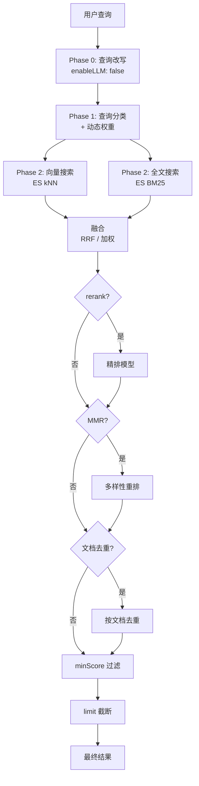

# 第 17 章 RAG Worker 与检索增强

> "检索的质量决定生成的质量。"

RAG（Retrieval-Augmented Generation）让 Agent 的回答扎根在真实文档里，而不是模型的记忆。但"检索"二字背后藏着大量工程：查询该不该改写、向量和全文的权重怎么定、召回的结果要不要精排、要不要去重、要不要保证多样性。每一步的选择都直接影响最终回答的质量。

本章从 RAG 的进程架构出发，深入 WinMatrix 的混合检索管线——一条可编排、可降级、由查询分类驱动动态权重的检索流水线。

## 17.1 独立进程：为什么 RAG 要和 API 分开

RAG 运行在独立进程中，和 API server 隔离。这个决策的入口是一个只有 20 行的文件：

```typescript
// src/rag-worker.ts（完整 20 行）
#!/usr/bin/env node
/**
 * WinMatrix rag-worker 生产入口 — WIN_PROCESS_ROLE=rag
 * Role guard runs before dynamic import so Prisma/worker modules
 * are not loaded on mismatch.
 */
import './infrastructure/sandbox/config/undiciConfig.js';
import { assertProcessRole } from '@/startup/processRole.js';

try {
  assertProcessRole('rag');   // 角色守卫
} catch (err) {
  const message = err instanceof Error ? err.message : String(err);
  process.stderr.write(`[ProcessRole] rag-worker entry startup aborted: ${message}\n`);
  process.exit(1);
}

await import('@/startup/ragEntry.js');
```

注意这个入口的设计：**角色守卫（`assertProcessRole`）先于动态 import 执行**。如果环境变量 `WIN_PROCESS_ROLE` 不是 `rag`，进程立即退出，根本不会去加载 Prisma、Worker 这些重模块。这是进程级 fail-fast——避免一个本不该启动 RAG 的进程白白占用内存和连接。

RAG 独立成进程，而不是 API 进程里的一个线程或子模块，好处是实质性的：

- **CPU 隔离**：向量化（embedding）是 CPU/GPU 密集型操作，重排（rerank）也吃算力。放在独立进程，不会阻塞 API 对用户消息的响应。
- **内存隔离**：embedding 模型常驻内存占用大，独立进程避免影响 API 的稳定性。
- **独立扩缩容**：文档摄入量大的场景可以单独扩 RAG 副本，而不必连带扩 API。
- **独立降级**：RAG 进程挂了，API 还能正常提供非检索类服务。

`ragEntry.ts` 自己注册 fatal/shutdown handler（SIGINT/SIGTERM 调 `shutdownRagWorker()`），shutdown 时先把 RAG 的资源清理干净再退出。**独立进程的代价是部署复杂度，换来的是故障隔离和资源隔离——在重负载场景下这笔交易是划算的。**

## 17.2 全 Elasticsearch 混合检索：不再依赖独立向量库

很多 RAG 系统会引入一个独立的向量数据库（Chroma、Qdrant、Milvus）。WinMatrix 没有——它把向量检索和全文检索都放在 Elasticsearch 上完成：

```typescript
// src/infrastructure/rag/RagHybridSearch.ts（第 1-20 行）
/**
 * RAG 混合检索引擎
 * 全部在 Elasticsearch 上完成：
 * - ES kNN 向量搜索（winmatrix_rag 索引，cosine 相似度）
 * - ES BM25 全文搜索（winmatrix_rag 索引，document 字段）
 * - 加权合并：finalScore = vectorWeight * vectorScore + textWeight * textScore
 */
import { searchRag, fullTextSearchRag, fetchChunkTextsByIds } from './RagRepository.js';
import { mergeByWeightedScore, mergeByRRF } from '@/infrastructure/search/fusion.js';
import { applyMMR } from '@/infrastructure/search/mmr.js';
import { rerankResults } from '@/infrastructure/search/reranker.js';
import { classifyQuery, type QueryType } from '@/infrastructure/search/QueryTypeClassifier.js';
import { calculateWeights, isDynamicWeightsEnabled } from '@/infrastructure/search/DynamicWeightCalculator.js';
import { calculateDynamicThreshold } from '@/infrastructure/search/DynamicThresholdCalculator.js';
import { rewriteQuery, isQueryRewritingEnabled } from '@/infrastructure/search/QueryRewriter.js';
```

这个选择背后的历史痕迹在 schema 里能看到——`embedding_cache` 表的 `chroma_id` 字段被标记为 `@deprecated`，注释写着"历史 ChromaDB 命名，随表删除"。**说明 WinMatrix 曾经用过 ChromaDB，后来迁回了 ES。** 迁回的原因不难理解：少维护一个组件、少一份一致性成本、ES 本身的 kNN 能力已经够用。

实际上 `embedding_cache` 这张表**整体**也已经废弃——generated model 文件给它打了 `@deprecated 未再被代码层读取/写入，后续 change 删除`。它曾经用复合主键 `@@id([provider, model, hash])` 做 provider+model+内容哈希级别的去重缓存，避免同一段文本反复调 embedding API。但现在向量化直接由 ES 管理，或通过独立的 embedding 微服务（见第 16 章）处理，这张缓存表不再被读写，保留只是为了兼容存量数据。**一个废弃但仍留在 schema 里的表，是系统演进的化石——读懂它，能看出架构是怎么一步步走到今天的。**

### 检索选项：全开关可编排

整条检索管线是可编排的，每个阶段都可以开关：

```typescript
// src/infrastructure/rag/RagHybridSearch.ts（第 27-49 行）
export interface RagHybridSearchOptions extends RagSearchOptions {
  vectorWeight?: number;          // 向量权重
  textWeight?: number;            // 全文权重
  fusionStrategy?: FusionStrategy; // 融合策略，默认 'rrf'
  rrfK?: number;                  // RRF 常数，默认 60
  rerank?: boolean;               // 是否精排
  mmr?: boolean;                  // 是否做多样性重排
  mmrLambda?: number;             // MMR 相关性/多样性权衡，默认 0.7
  enableQueryRewriting?: boolean; // 是否查询改写
  enableDocumentDedup?: boolean;  // 是否文档级去重
}
```

这种"全开关"设计让检索管线可以从"最轻量的纯向量检索"到"全套改写+精排+多样性"按需调节。不同场景对延迟和召回质量的要求不同——一个实时聊天的即时引用，和一个深度调研的多轮检索，用不着同一条管线。

## 17.3 检索管线：六个阶段的流水线

RAG 检索不是一次 `search`，而是一条多阶段管线。理解这条管线的顺序，是理解 RAG 质量的关键：



来看这条管线的真实实现：

```typescript
// src/infrastructure/rag/RagHybridSearch.ts（第 147-229 行）
export async function ragHybridSearch(opts: RagHybridSearchOptions): Promise<RagHybridSearchResult[]> {
  const limit = opts.limit ?? 10;
  const minScore = opts.minScore ?? 0.3;
  const strategy = opts.fusionStrategy ?? 'rrf';
  const useRerank = opts.rerank === true;
  const useMMR = opts.mmr === true;

  // Phase 0: 查询改写（可选）
  let effectiveQuery = opts.query;
  const shouldRewrite = opts.enableQueryRewriting ?? isQueryRewritingEnabled();
  if (shouldRewrite) {
    rewriteResult = await rewriteQuery(opts.query, { enableLLM: false });
    // ...
  }

  // Phase 1: 动态权重
  if (isDynamicWeightsEnabled() && opts.vectorWeight === undefined && opts.textWeight === undefined) {
    const classification = classifyQuery(effectiveQuery);
    const weights = calculateWeights(classification.type);
    vectorWeight = weights.vectorWeight;
    textWeight = weights.textWeight;
  }

  // Phase 2: 并行搜索（向量 + BM25）
  const overRetrieval = useRerank || useMMR ? 5 : 2;
  const [vectorResults, ftsResults] = await Promise.all([
    searchVector(searchOpts, limit * overRetrieval),
    useHybrid ? searchFullText(searchOpts, limit * overRetrieval) : Promise.resolve([]),
  ]);
  // ...
}
```

这段代码里有几个值得深挖的设计决策。

### Phase 0：查询改写，但默认不走 LLM

很多人想当然以为"查询改写 = 调 LLM 重写查询"。WinMatrix 的默认行为恰恰相反——`enableLLM: false`。查询改写默认走的是规则/轻量逻辑，而不是 LLM。

为什么？因为 LLM 改写有两个代价：**延迟**（多一次 LLM 调用）和**不可控**（LLM 可能把查询改飞）。对于绝大多数查询，规则式的扩展（同义词、缩写展开）已经够用，且延迟可忽略。LLM 改写只在明确需要时才开，是一个可选的、更重的增强，而不是默认路径。

### Phase 1：查询分类驱动动态权重

不同类型的查询，适合不同的检索方式：

- **关键词型查询**（如 "K8s liveness probe"）：全文检索（BM25）更准，因为精确词项匹配更重要。
- **语义型查询**（如 "怎么让服务挂了自动重启"）：向量检索更准，因为它能匹配语义而非字面。
- **混合型查询**：两者权重均衡。

`classifyQuery()` 把查询分到不同的 `QueryType`，`calculateWeights(type)` 据此算出 `vectorWeight` 和 `textWeight`。**这就是为什么不应该硬编码权重**——一个 0.7/0.3 的固定权重，对关键词查询和语义查询都是次优的。让权重随查询类型动态变化，才是正解。

而且动态权重只在调用方没显式传权重时才生效（`opts.vectorWeight === undefined`）——这给了上层"强制固定权重"的逃生口，同时让默认行为更智能。

### Phase 2：过召回（over-retrieval）

```typescript
const overRetrieval = useRerank || useMMR ? 5 : 2;
const [vectorResults, ftsResults] = await Promise.all([
  searchVector(searchOpts, limit * overRetrieval),
  // ...
]);
```

这是一个容易被忽视但很关键的细节：**检索阶段召回的数量，远大于最终返回的数量。** 如果用户要 10 条结果，且开启了 rerank/MMR，管线会先召回 `10 * 5 = 50` 条，再由 rerank 和 MMR 从 50 条里精选。

为什么？因为 rerank 和 MMR 会"淘汰"一部分结果——rerank 可能判断某些高分向量其实不相关，MMR 会为了多样性去掉重复的。如果不过召回，精排之后剩下的可能不够 `limit` 条。过召回倍数 `overRetrieval = (rerank||mmr) ? 5 : 2` 是个经验值：精排重时多召回，轻量检索时少召回。

向量检索和全文检索用 `Promise.all` 并行执行——它们互不依赖，并行可以省掉一段串行等待。

## 17.4 融合策略：RRF 为默认

向量检索和全文检索各返回一列结果，需要融合成一列。WinMatrix 支持两种融合策略，默认 RRF。

### RRF（Reciprocal Rank Fusion）

```typescript
// src/infrastructure/search/fusion.ts
// mergeByRRF() — 默认策略
// RRF 分数 = Σ 1/(k + rank_i)，k 默认 60
```

RRF 的核心优势是**不需要分数归一化**。向量相似度分数（cosine，通常 0~1）和 BM25 分数（无上界的实数）量纲完全不同，加权融合前必须先归一化，而归一化本身是个棘手问题。RRF 巧妙地绕开了它——它只依赖结果的**排名**（rank），不依赖原始分数。

公式 `1/(k + rank)` 意味着：排名越靠前贡献越大，但贡献随排名衰减。两列结果各自按这个公式打分再相加，就得到融合排名。`k=60` 是经验常数，控制头部和尾部结果的差距。

RagSearchTool 默认就用 RRF：

```typescript
// src/business-tools/rag/RagSearchTool.ts（第 85-95 行）
const results = await ragService.hybridSearch({
  query: parsed.data.query,
  projectId,
  limit: parsed.data.limit ?? 5,
  minScore: parsed.data.minScore ?? 0.3,
  hybrid: true,
  fusionStrategy: 'rrf',   // 默认 RRF
});
```

### 加权线性融合

```typescript
// mergeByWeightedScore()
// finalScore = vectorWeight * vectorScore + textWeight * textScore
// 需要先归一化分数到 [0, 1]
```

加权融合更直观，但需要归一化。它适合"我明确知道要偏向哪种检索"的场景——比如纯语义查询时把 `vectorWeight` 调到 0.9。

## 17.5 精排与多样性

融合之后的结果，还可以进一步精排和多样化。

### Rerank：交叉编码器精排

```typescript
// src/infrastructure/search/reranker.ts
// rerankResults() 使用交叉编码器（cross-encoder）精排
```

向量检索用的是"双塔模型"——查询和文档各自编码成向量再算相似度，速度快但精度有限。Rerank 用的是"交叉编码器"——把查询和文档拼在一起送进模型，输出一个相关性分数。精度更高，但慢得多（每对查询-文档都要过一次模型）。

所以 rerank 只对过召回的 top-N 候选做，而不是对全库做。**双塔负责"从百万级召回几百"，交叉编码器负责"从几百精选几十"。** 这是两阶段检索的标准节奏。

### MMR：多样性重排

```typescript
// src/infrastructure/search/mmr.ts
// applyMMR() — Maximal Marginal Relevance
// 在相关性和多样性之间平衡，mmrLambda 默认 0.7（偏相关性）
```

MMR 解决的是"返回 10 条高度相似的结果"问题。如果不做 MMR，一个常见失败是：检索到同一文档的 10 个分块，内容几乎重复，浪费了返回窗口。MMR 在选择下一条结果时，不仅看它和查询的相关性，还看它和已选结果的差异度，确保最终结果既相关又多样。

`mmrLambda=0.7` 偏相关性——在大多数场景下，用户更想要"相关的"结果，多样性只是次要目标。

## 17.6 文档级去重：同一文档只出现一次

```typescript
// src/infrastructure/rag/RagHybridSearch.ts（第 67-108 行）
function deduplicateByDocument(results: MemorySearchResult[]): MemorySearchResult[] {
  // O(n) Map-based，按 documentPath 去重
  // 保留每个文档的最高分分块
  // 无 path 的结果回退到 chunk-id key，避免意外合并
}
```

这是 MMR 之外的另一层去重。即使做了 MMR，同一文档的多个分块仍可能都入选。文档级去重确保每个文档（`documentPath`）在最终结果里只出现一次——取它在检索里得分最高的那个分块。

注意它对"无 path 结果"的处理：**回退到 chunk-id 作为 key，而不是把所有无 path 的结果合并成一个。** 这是个细节但重要的防御性设计——无 path 的结果如果都用同一个空 key，会被错误地合并成一条，丢失信息。用 chunk-id 兜底，保证每条无 path 结果仍然独立。

## 17.7 多工具 Agentic RAG

WinMatrix 不只提供一个检索工具，而是提供一组，让 Agent 能像"研究员"一样迭代检索：

| 工具 | 作用 |
|------|------|
| `rag_search` | 语义混合检索（默认入口，RRF 融合） |
| `rag_list_documents` | 列出已索引的文档，确认检索范围 |
| `rag_read_chunks` | 读取完整的分块内容（搜索结果超 500 字会截断，提示用此工具读全文） |
| `rag_knowledge_search` | 知识图谱检索 |
| `rag_graph_search` | 图谱关系检索 |
| `UnifiedKnowledgeRetrieveTool` | 统一检索入口 |

注意 `rag_search` 的返回逻辑——当结果超长时会截断，并主动提示"用 `rag_read_chunks` 读完整块"：

```typescript
// src/business-tools/rag/RagSearchTool.ts（第 85-113 行）
if (results.length === 0) {
  return { success: true, data: '未找到相关文档内容。建议：1) 尝试更换关键词...；2) 使用 rag_list_documents 确认已索引的文档范围。' };
}
const formatted = results.map((r, i) => {
  const scorePct = (r.score * 100).toFixed(1);
  const header = `[${i + 1}] ${r.documentPath} (章节: ${r.sectionTitle || '正文'}, 相关度: ${scorePct}%, 类型: ${r.documentType})`;
  // ...
});
```

返回结果带了**相关度百分比**、**文档路径**、**章节标题**、**文档类型**——这些元信息让 Agent（和用户）能判断该不该深入读某条结果。工具描述还显式鼓励"可多次调用以迭代查询、改写关键词"。

这就是 **Agentic RAG** 的思路：不指望一次检索就命中，而是给 Agent 一组工具，让它根据返回结果决定下一步——先 `rag_list_documents` 看范围，再 `rag_search` 检索，发现截断了就 `rag_read_chunks` 读全文，发现需要关联关系就 `rag_graph_search`。检索从"一次性函数调用"变成了"多步探索"。

## 17.8 动态阈值：minScore 也不是写死的

最后提一个容易被忽略的细节——`minScore`（最低相关度阈值）也不是硬编码的。`DynamicThresholdCalculator` 会根据一组 `ThresholdFactors` 动态计算阈值：

```typescript
// src/infrastructure/search/DynamicThresholdCalculator.ts
// calculateDynamicThreshold() — 根据 ThresholdFactors 动态调 minScore
```

为什么阈值要动态？因为"相关"的绝对分数会随查询类型、文档库规模、模型版本漂移。一个写死 `minScore=0.3` 的系统，换了个 embedding 模型可能就全不过阈值，或者全过阈值。让阈值随上下文动态调整，是比"拍一个常数"稳健得多的做法。

## 本章小结

本章深入分析了 WinMatrix 的 RAG 系统：

1. **独立进程**：rag-worker 用 `WIN_PROCESS_ROLE=rag` 守卫 + 动态 import，CPU/内存/扩缩容/故障全部隔离。
2. **全 ES 混合检索**：kNN 向量 + BM25 全文都在 Elasticsearch，不再依赖独立向量库（chroma_id 已 deprecated，embedding_cache 复合主键仍在用）。
3. **六阶段管线**：查询改写（默认非 LLM）→ 查询分类 + 动态权重 → 并行向量/全文检索（过召回 2~5 倍）→ 融合（默认 RRF）→ 精排（rerank）→ 多样性（MMR）+ 文档去重 + 动态阈值。
4. **查询分类驱动动态权重**：关键词型偏全文、语义型偏向量，而非硬编码 0.7/0.3。
5. **过召回设计**：rerank/MMR 时召回 `limit * 5`，轻量检索时 `limit * 2`，保证精排后仍够数。
6. **RRF 默认融合**：只依赖排名不依赖原始分数，绕开向量分和 BM25 分的量纲不一致。
7. **多工具 Agentic RAG**：rag_search / rag_list_documents / rag_read_chunks / rag_graph_search 等一组工具，支持迭代式检索；返回带相关度百分比与元信息，鼓励多轮查询。
8. **动态阈值**：minScore 随上下文计算，不写死，适应模型和库的漂移。

检索的质量决定生成的质量——这句话在 WinMatrix 里被工程化成了一条精细的、可编排的、动态适配的流水线。在下一章中，我们将进入协作与编排系统，看多个数字员工如何在一个项目里协同工作。
