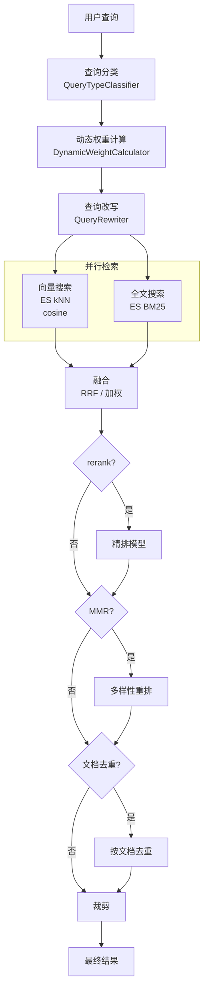

# 第 17 章 RAG Worker 与检索增强

> "检索的质量决定生成的质量。"

RAG（Retrieval Augmented Generation）让 Agent 的回答基于真实文档。WinMatrix 的 RAG 系统运行在独立进程中，使用混合检索（向量 + 全文）、动态权重、查询改写和精排重排，构建了一条高质量的检索管线。本章将深入这些实现。

## 17.1 RAG Worker 进程架构

RAG 运行在独立进程中，与 API 进程隔离：

```typescript
// src/rag-worker.ts（完整 20 行）
#!/usr/bin/env node
/**
 * WinMatrix rag-worker 生产入口 — WIN_PROCESS_ROLE=rag
 *
 * Role guard runs before dynamic import so Prisma/worker modules
 * are not loaded on mismatch.
 */
import './infrastructure/sandbox/config/undiciConfig.js';
import { assertProcessRole } from '@/startup/processRole.js';

try {
  assertProcessRole('rag');   // 角色守卫
} catch (err) {
  process.stderr.write(`[ProcessRole] rag-worker entry startup aborted: ${message}\n`);
  process.exit(1);
}

await import('@/startup/ragEntry.js');
```

RAG 进程独立的好处：

1. **CPU 隔离**：向量化是 CPU 密集型操作，不阻塞 API
2. **内存隔离**：embedding 模型占用大量内存，独立进程避免影响 API
3. **独立扩缩容**：可根据文档摄入量独立扩展 RAG 进程

## 17.2 混合检索引擎

`RagHybridSearch.ts` 实现了全 Elasticsearch 的混合检索：

```typescript
// src/infrastructure/rag/RagHybridSearch.ts（第 1-20 行）
/**
 * RAG 混合检索引擎
 * 全部在 Elasticsearch 上完成：
 * - ES kNN 向量搜索（winmatrix_rag 索引，cosine 相似度）
 * - ES BM25 全文搜索（winmatrix_rag 索引，document 字段）
 * - 加权合并：finalScore = vectorWeight * vectorScore + textWeight * textScore
 */
import { searchRag, fullTextSearchRag, fetchChunkTextsByIds } from './RagRepository.js';
import { mergeByWeightedScore, mergeByRRF } from '@/infrastructure/search/fusion.js';
import { applyMMR } from '@/infrastructure/search/mmr.js';
import { rerankResults } from '@/infrastructure/search/reranker.js';
import { classifyQuery, type QueryType } from '@/infrastructure/search/QueryTypeClassifier.js';
import { calculateWeights, isDynamicWeightsEnabled } from '@/infrastructure/search/DynamicWeightCalculator.js';
import { calculateDynamicThreshold } from '@/infrastructure/search/DynamicThresholdCalculator.js';
import { rewriteQuery, isQueryRewritingEnabled } from '@/infrastructure/search/QueryRewriter.js';
```

### 检索选项

```typescript
// src/infrastructure/rag/RagHybridSearch.ts（第 27-49 行）
export interface RagHybridSearchOptions extends RagSearchOptions {
  vectorWeight?: number;          // 默认 0.7
  textWeight?: number;            // 默认 0.3
  fusionStrategy?: FusionStrategy; // 默认 'rrf'
  rrfK?: number;                  // 默认 60
  rerank?: boolean;
  mmr?: boolean;
  mmrLambda?: number;             // 默认 0.7
  enableQueryRewriting?: boolean;
  enableDocumentDedup?: boolean;
}
```

## 17.3 检索管线

RAG 检索是一条多阶段管线：



### 查询分类

```typescript
// src/infrastructure/search/QueryTypeClassifier.ts
// classifyQuery() 将查询分为不同类型：
// - 关键词型（适合全文搜索）
// - 语义型（适合向量搜索）
// - 混合型
// 不同类型影响动态权重计算
```

### 动态权重

```typescript
// src/infrastructure/search/DynamicWeightCalculator.ts
// 根据查询类型动态调整 vectorWeight / textWeight
// 关键词型查询 → 提高全文权重
// 语义型查询 → 提高向量权重
```

### 查询改写

```typescript
// src/infrastructure/search/QueryRewriter.ts
// rewriteQuery() 使用 LLM 改写查询
// - 扩展缩写
// - 添加同义词
// - 修正拼写
```

## 17.4 融合策略

### RRF（Reciprocal Rank Fusion）

```typescript
// src/infrastructure/search/fusion.ts
// mergeByRRF() - 默认策略
// RRF 分数 = Σ 1/(k + rank_i)
// k 默认 60
```

RRF 的优势是不需要分数归一化——它只依赖排名，适合合并不同评分体系的结果（向量相似度 vs BM25）。

### 加权线性

```typescript
// mergeByWeightedScore()
// finalScore = vectorWeight * vectorScore + textWeight * textScore
// 需要先归一化分数到 [0, 1]
```

## 17.5 精排与多样性

### Rerank 精排

```typescript
// src/infrastructure/search/reranker.ts
// rerankResults() 使用交叉编码器（cross-encoder）精排
// 比双塔模型（向量搜索）更准确，但更慢
// 只对 top-N 候选精排
```

### MMR 多样性重排

```typescript
// src/infrastructure/search/mmr.js
// applyMMR() - Maximal Marginal Relevance
// 在相关性和多样性之间平衡
// mmrLambda 默认 0.7（偏相关性）
```

MMR 解决了"返回 10 条高度相似结果"的问题——它确保返回的结果既相关又多样。

## 17.6 文档级去重

```typescript
// src/infrastructure/rag/RagHybridSearch.ts（第 67-90 行）
function deduplicateByDocument(results: MemorySearchResult[]): MemorySearchResult[] {
  // O(n) Map-based，按 documentPath 去重
  // 无 path 的结果回退到 chunk-id key，避免意外合并
}
```

同一个文档的多个分块可能都被检索到，去重确保每个文档只出现一次（取最高分分块）。

## 17.7 RAG 上下文注入

检索结果注入到 Agent 的对话上下文：

```typescript
// 概念性
// 1. Agent 检测到需要知识增强
// 2. 调用 rag_search 工具
// 3. RagHybridSearch 执行混合检索
// 4. 结果格式化为上下文段落
// 5. 注入到 LLM 提示词
```

`rag_search` 是 `DEFAULT_FOUNDATION_TOOL_NAMES` 中的基础工具，始终对 Agent 可见。

## 17.8 Embedding 缓存（已弃用）

历史上有 `embedding_cache` 表用于缓存向量化结果，但现已弃用：

```typescript
// src/infrastructure/persistence/prisma/generated/models/embedding_cache.ts（第 15-19 行）
/**
 * Model embedding_cache
 * @deprecated 未再被代码层读取/写入，后续 change 删除。
 */
```

当前向量化直接由 ES 管理或通过 embedding-server（端口 8401）的本地模型处理。

## 17.9 TFS/Git 知识库同步

`tfs_git` 类型的知识库通过定时任务同步：

```typescript
// 系统定时任务：system-tfs-git-sync（每 3 小时）
// 同步 TFS/Git 仓库代码到知识库
// 解析代码文件，分块，向量化
```

## 本章小结

本章深入分析了 WinMatrix 的 RAG 系统：

1. **独立进程**：rag-worker 与 API 隔离，CPU/内存独立，独立扩缩容
2. **全 ES 混合检索**：kNN 向量 + BM25 全文，加权或 RRF 融合
3. **多阶段管线**：查询分类 → 动态权重 → 查询改写 → 并行检索 → 融合 → 精排 → MMR → 去重
4. **动态权重**：根据查询类型调整向量/全文权重
5. **查询改写**：LLM 扩展缩写、添加同义词、修正拼写
6. **RRF 融合**：默认策略，不需要分数归一化
7. **Rerank 精排**：交叉编码器，比向量搜索更准确
8. **MMR 多样性**：平衡相关性和多样性
9. **文档级去重**：同一文档只出现一次
10. **TFS/Git 同步**：每 3 小时同步代码仓库

在下一章中，我们将进入协作与编排系统。
