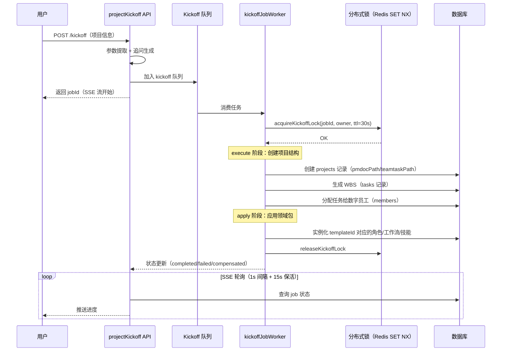

# 第 18 章 项目管理

> "项目是协作的容器，一切活动都在项目上下文中发生。"

在 WinMatrix 里，"项目"不是一个简单的 `name + description` 实体。它是所有数字员工协作的根容器——文档树根、任务数据根、团队成员归属、知识库挂载点、流程模板宿主，全部从项目这个节点向外延展。一个项目同时握着两条物理路径（文档路径 + 任务路径），还关联着 `documents / flowTemplates / flowRuns / flowSchedules / flowResources / flowInstructionBatches / flowInstructions / domainInstance / knowledge_bases / tasks / teams / personalAccessTokens` 十余张子表。

本章从项目的双路径容器模型出发，逐步深入 PMDOC 固定阶段目录约定（长期记忆专目录与 chokidar 局部监听）、teams 与 projects 的一对一关系、members 的软归属与全局数字员工、tasks 的"业务字段 + 外部同步字段"双面性，最后看项目上下文如何分层注入到 LLM 的 prompt。

## 18.1 项目 = 双路径容器

### projects 模型

```prisma
// prisma/schema.prisma（projects 模型，真实字段）
model projects {
  id                    String   @id
  name                  String   @unique
  code                  String
  description           String?
  pmdocPath             String   @map("pmdoc_path")      // PMDOC 文档树根，强制非空
  teamtaskPath          String   @map("teamtask_path")    // 任务/团队数据根，强制非空
  templateId            String?  @default("software_dev") @map("template_id")
  integrationsOverrides String?  @map("integrations_overrides")
  tags                  String[] @default([])
  email                 String?
  emailPassword         String?  @map("email_password")
  createdAt             String   @map("created_at")
  updatedAt             String   @map("updated_at")
  projectBackground     String?  @map("project_background")
  backgroundSource      String?  @map("background_source")

  // 关系：十余张子表挂载
  documents             document[]
  flowTemplates         flow_template[]
  flowRuns              flow_run[]
  flowSchedules         flow_schedule[]
  flowResources         flow_resource[]
  flowInstructionBatches flow_orchestration_instruction_batch[]
  flowInstructions      flow_orchestration_instruction[]
  domainInstance        domain_instance[]
  knowledge_bases       knowledge_bases[]
  tasks                 tasks[]
  teams                 teams[]
  personalAccessTokens  personal_access_tokens[]
}
```

> 模型定义见 `src/infrastructure/persistence/prisma/generated/models/projects.ts`；schema.prisma 是 SSOT，但每个表已按 generated/models/<model>.ts 拆为独立文件（详见第 4 章）。

理解这个模型，关键在抓住它最核心的设计决策：**项目是一个双路径容器**。

- `pmdocPath`：PMDOC 文档树的根目录。项目的全部文档——PRD、技术方案、会议纪要、验收报告——都以这个路径为根，按固定阶段目录组织（见 18.2）。
- `teamtaskPath`：任务/团队数据根。任务的 `taskPath`、`workDocPath` 等都挂在这个路径下。

这两个字段都是**强制非空**的 `String`（不是 `String?`）。这不是偶然——一个项目没有文档树根或任务根，就退化成了一个空壳。**强制非空是项目作为"容器"语义的数据库层守护**：你想建一个不挂任何路径的"概念项目"，数据库根本不让你插入。

### templateId：项目由模板实例化

`templateId` 默认 `software_dev`。项目不是从零搭起来的——它由一个项目模板实例化而来。模板决定了这个项目预置哪些角色、哪些工作流、哪些技能、哪些提示词。软件开发项目用 `software_dev` 模板，产品设计项目可能用另一个模板。`templateId` 是项目与"它该长什么样"之间的那条线。

### integrationsOverrides：项目级集成配置

`integrationsOverrides` 是一个 JSON 字符串字段，存储 TFS / Email / 企微等集成的**项目级配置覆盖**。Repository 层对它做了特殊处理（见第 4 章 `ProjectRepositoryImpl.ts`）——标准 Prisma ORM upsert 之后，再用 Raw SQL 单独更新这个 JSON 字段：

```typescript
// src/infrastructure/persistence/repositories/ProjectRepositoryImpl.ts（第 47-91 行节选）
// ① 标准 Prisma ORM upsert
await prisma.projects.upsert({
  where: { id: project.id },
  create: { id: project.id, name: project.name, code: project.code,
            templateId: project.templateId || 'software_dev', /* ... */ },
  update: { name: project.name, updatedAt: dateToLocalTimeString(project.updatedAt) },
});

// ② Raw SQL 处理 Prisma schema 未定义的 JSON 字段
// GOVERNANCE: Raw SQL for JSON field update
await prisma.$executeRaw`
  UPDATE projects SET integrations_overrides = ${integrationsOverridesJson}
  WHERE id = ${project.id}
`;
```

为什么用 Raw SQL？因为 `integrationsOverrides` 的结构是运行时动态构建的，Prisma 的强类型 ORM 对这种灵活 JSON 处理起来不够顺。**Prisma ORM + Raw SQL 混合使用**是 WinMatrix 在灵活性和类型安全之间的一致取舍（详见第 4 章）。

## 18.2 PMDOC 固定阶段目录约定

PMDOC 是项目的文档组织约定。它不是一个自由的文件系统，而是有一组**固定阶段目录**。其中最关键的是 `00_共享/`——长期记忆的专用目录。

### 阶段常量

```typescript
// src/business/domain/project/pmdocSharedStage.ts（第 1-22 行）
/**
 * PMDOC「共享」阶段目录名（磁盘路径段）。
 *
 * 长期记忆 chokidar 仅监听 pmdoc 下该目录；memory_write、项目准则、模板首阶段 path 与此对齐。
 */
export const PMDOC_SHARED_STAGE_DIR = '00_共享';

/** 相对 pmdoc 根：每日记忆目录 */
export const PMDOC_MEMORY_DIR_RELATIVE = `${PMDOC_SHARED_STAGE_DIR}/memory`;

/** 相对 pmdoc 根：项目准则文件 */
export const PMDOC_GUIDELINES_RELATIVE = `${PMDOC_SHARED_STAGE_DIR}/agentrule.md`;

/** TemplatePathResolver 等使用的兜底子路径 */
export const PMDOC_FALLBACK_OTHER_RELATIVE = `${PMDOC_SHARED_STAGE_DIR}/其他`;

/** 成员记忆文件名前缀（拼接成员名后加 .md） */
export const PMDOC_MEMBER_MEMORY_PREFIX = '成员记忆_';

/** 项目记忆文件名 */
export const PMDOC_PROJECT_MEMORY_FILENAME = '项目记忆.md';
```

这几行常量浓缩了 PMDOC 文档树的"固定阶段目录"约定：

```
<project>.pmdocPath/
└── 00_共享/                       ← PMDOC_SHARED_STAGE_DIR
    ├── memory/                    ← PMDOC_MEMORY_DIR_RELATIVE（每日记忆）
    ├── agentrule.md               ← PMDOC_GUIDELINES_RELATIVE（项目准则）
    ├── 项目记忆.md                 ← PMDOC_PROJECT_MEMORY_FILENAME
    ├── 成员记忆_阿码.md            ← PMDOC_MEMBER_MEMORY_PREFIX + 成员名
    ├── 成员记忆_小品.md
    └── 其他/                      ← PMDOC_FALLBACK_OTHER_RELATIVE（兜底）
```

### 为什么 chokidar 只监听 `00_共享/` 子目录

注释里有一句关键的话：**"长期记忆 chokidar 仅监听 pmdoc 下该目录"**。

这是一个非常重要的性能决策。一个项目的 PMDOC 文档树可能有成百上千个文件——各种 PRD、技术方案、评审记录、周报。如果用 chokidar 监听整棵树，每次任意文件变动（比如有人改了一个 PRD 的错别字）都会触发文件系统事件，RAG 索引器、记忆同步器都要被唤醒。这对系统是一个不必要的负担。

WinMatrix 的做法是：**chokidar 只监听 `00_共享/` 这个子目录**。因为只有这个目录下的文件（`memory/`、`agentrule.md`、`项目记忆.md`、`成员记忆_*.md`）才属于"长期记忆"的范畴，才需要被 RAG 索引、被记忆同步。其他阶段目录里的文档是项目交付物，它们的索引走另一条按需路径。

这是一个值得借鉴的设计模式：**文件系统监听要按"语义子树"收敛，而不是按物理根目录发散。** 监听粒度和语义边界对齐，能避免大量无谓的唤醒。

### PMDOC RAG 索引器

负责把 `00_共享/` 下的文件索引进 RAG 的是 `PmdocRagIndexer`（`src/infrastructure/rag/PmdocRagIndexer.ts`）。它消费 chokidar 的事件，把变更的 markdown 文件分块、向量化、写入 memory_chunks/memory_files + ES dense_vector（三层记忆架构见第 11 章）。路径工具 `business/domain/document/utils/pmdocPathUtils.ts` 则负责把这些常量拼成、拆成各种相对/绝对路径。

### 常量命名与"魔法字符串"治理

注意这些常量的命名风格——全部是 `PMDOC_` 前缀 + 大写 + 下划线。这不是偶然，而是一致的命名约定：**所有"会出现在多处引用的磁盘路径段"都提升为常量，禁止散落的字符串字面量。**

如果代码里到处写 `'00_共享'`、`'00_共享/memory'`，一旦目录约定要改（比如从中文改成英文，或调整结构），你得全局搜索替换，漏一个就是 bug。提升为常量后，改一个地方全处生效。`PMDOC_MEMBER_MEMORY_PREFIX = '成员记忆_'` 这种"前缀 + 动态部分"的命名，也让"成员记忆_{成员名}.md"这种文件名规则在代码里一目了然。

这是一个小但重要的工程纪律：**磁盘路径、文件名约定、协议字段名这类"跨模块共识"，必须用常量管理，不能靠字符串字面量复制粘贴。** 第 20 章的 `FLOW_ROOT_PREFIX = 'flow-resources'`、第 4 章的 `LOCK_PREFIX = 'kickoff:lock:'` 遵循同一套纪律。

## 18.3 teams 与 projects 的一对一

很多人会以为 teams 是一个独立的多对多表——一个项目可以有多个团队，一个团队可以属于多个项目。**在 WinMatrix 里不是这样。**

```prisma
// teams 模型（真实字段）
model teams {
  projectId   String   @id                // 主键就是 projectId！
  members     String                      // 成员列表（JSON 字符串）
  // ... 其他团队元数据
}
```

注意 `teams` 的主键是 `projectId`——这意味着 **teams 与 projects 是严格的一对一关系**。一个项目只有一个团队记录，团队的归属和项目完全绑定。

这种设计背后的语义是：在 WinMatrix 的协作模型里，**"团队"不是一个跨项目流动的组织实体，而是"项目里的成员集合"的一个视图**。团队的所有属性（成员、角色配置）都依附于项目存在，离开项目谈团队没有意义。把主键直接设成 `projectId`，在数据库层就锁死了"一对一"这个语义——你想给一个项目插两个团队记录，主键冲突直接拒绝。

members 字段（JSON 字符串）存储这个团队的成员快照，但它不是成员归属的唯一真源——成员归属看的是 `members` 表（见 18.4）。

## 18.4 members：软归属与全局数字员工

```prisma
// members 模型（真实字段）
model members {
  id                String   @id
  name              String
  roles             String
  status            String
  permissions       String
  projectId         String?                       // 可空！
  wechatUserId      String?  @map("wechat_user_id")
  nickname          String?
  mentionName       String?  @map("mention_name")
  isAgent           Boolean  @default(false)
  email             String?
  userId            String?
  digitalEmployeeId String?  @map("digital_employee_id")
  wechatOpenUserId  String?  @map("wechat_open_user_id")

  @@unique([name, projectId], map: "members_name_project_id_key")
}
```

members 表最值得注意的字段是 **`projectId` 是可空的（`String?`）**。这是"软归属"的核心。

### 全局数字员工

`projectId` 可空意味着什么？意味着一个成员可以**不属于任何项目**。这在 WinMatrix 里对应"全局数字员工"——通过 `digitalEmployeeId` 关联的数字员工，可以在多个项目之间流动，而不是被钉死在某一个项目里。

复合唯一键 `@@unique([name, projectId])` 也很有意思。同一个名字在不同项目里可以重复（`name=阿码, projectId=P1` 和 `name=阿码, projectId=P2` 是两条合法记录），但同一个项目里名字不能重复。当 `projectId` 为 null 时，全局唯一由应用层保证。

这种"软归属 + 全局员工"的设计，让数字员工的人力资源管理更灵活——一个资深架构师阿码可以同时被多个项目复用，而不需要为每个项目克隆一份员工记录。

### isAgent：区分人类成员与数字员工

`isAgent` 字段（默认 false）区分这条记录是真实人类成员还是数字员工代理。这个字段影响后续的权限校验、消息路由——数字员工发的消息和人类发的消息，在协作通道里走的是不同的处理路径。

## 18.5 tasks：业务字段 + 外部同步字段

`tasks` 表是 WinMatrix 与外部项目管理系统（如 Azure DevOps / TFS）集成的桥梁。它最有趣的地方是：**一行记录同时是"业务任务"和"外部 PM 系统的镜像"**。

```prisma
// tasks 模型（真实字段）
model tasks {
  id            String   @id
  projectId     String   @map("project_id")
  taskId        String                       // 业务任务 ID（项目内）
  taskName      String   @map("task_name")
  ownerId       String?  @map("owner_id")
  startDate     String?  @map("start_date")
  endDate       String?  @map("end_date")
  duration      String?
  status        String
  completion    String?
  deliverable   String?
  description   String?
  taskPath      String?  @map("task_path")
  workDocPath   String?  @map("work_doc_path")

  // —— 外部同步字段 ——
  source        String?                       // 来源（如 'tfs'）
  externalId    String?  @map("external_id")   // 外部系统 ID
  externalUrl   String?  @map("external_url")  // 外部链接
  lastSyncedAt  String?  @map("last_synced_at") // 最近同步时间

  @@unique([projectId, taskId], map: "tasks_project_id_task_id_key")
}
```

### 两套字段的分工

把字段分成两组看就清楚了：

**业务字段**（WinMatrix 内部使用）：`taskId / taskName / ownerId / startDate / endDate / duration / status / completion / deliverable / description / taskPath / workDocPath`。这些是 WinMatrix 自己管理、自己消费的字段。`taskPath` 和 `workDocPath` 指向 PMDOC 文档树下这个任务对应的产物路径。

**外部同步字段**（外部 PM 系统镜像）：`source / externalId / externalUrl / lastSyncedAt`。这些字段把这条任务和外部系统里的一个工作项绑定起来。`source='tfs'` 表示来源是 Azure DevOps，`externalId` 是 TFS work item ID，`externalUrl` 是可点击的外部链接，`lastSyncedAt` 是最近一次双向同步的时间戳。

### 为什么要做镜像

为什么不直接调用 TFS API，而要在本地维护一份镜像？几个原因：

1. **解耦**：WinMatrix 的数字员工操作任务（查状态、改进度、认领）不需要每次都穿透到 TFS。本地有镜像，大部分操作走本地，只有同步时刻才穿透。
2. **可用性**：TFS 不可达时，WinMatrix 仍能基于本地镜像工作；恢复后再双向同步。
3. **审计**：`lastSyncedAt` 让运维能一眼看出哪些任务 давно 没同步，可能存在漂移。

`source` 字段为 null 的任务是纯本地任务，没有外部镜像——WinMatrix 自己创建、自己管理。复合唯一键 `[projectId, taskId]` 保证同一项目内任务 ID 不重复。

这种"业务实体 + 外部镜像"的双面设计，在需要与企业既有系统集成时非常实用。流程编排里的 `demandId / workItemId`（见第 20 章）就是从这条任务的 externalId 衍生出来的，把外部需求源和内部流程实例关联起来。

## 18.6 项目上下文的分层注入

数字员工在为项目工作时，LLM 需要知道"我现在在哪个项目、这个项目是什么阶段、有哪些成员"。这就是项目上下文注入。WinMatrix 的做法是**分层注入**——结构化字段和预渲染正文分开走，各有各的消费方。

### ProjectContextSource

项目上下文由 `ProjectContextSource`（一个 ContextSource 实现）负责注入到 LLM 的 context：

```typescript
// src/agents/core/ai-kernel/context/adapters/sources/ProjectContextSource.ts（第 33-64 行）
export interface ProjectInfo {
  name?: string;
  phase?: string;
  members?: string[];
  /** 一行项目摘要（来自 AgentContext.projectInfo.description） */
  description?: string;
  /**
   * 预渲染的「项目上下文正文」，与 promptBuilder.buildProjectContextBody(roleContext)
   * 字节级一致。优先级高于上面的结构化字段。
   */
  body?: string;
  /**
   * D3 completeness metadata — mode/availableCategories/missingRequiredCategories 等。
   * 由 ProjectInfoProvider 在 gather 阶段计算，供 budget diagnostics 消费。
   * 不含原始凭据、agentrule 正文或完整 prompt 文本（D6）。
   */
  completeness?: ProjectContextCompleteness;
  /** 可选 failureReason 码（如 'project_info_fetch_failed'） */
  fetchFailureReason?: string;
}

export class ProjectContextSource implements ContextSource {
  readonly id = 'project_context';
  readonly priority = 4;

  constructor(
    private readonly getProjectInfo?: (projectId: string) => Promise<ProjectInfo | null>,
    private readonly estimator: ContextTokenEstimator = defaultContextTokenEstimator,
  ) {}
}
```

### 结构化字段 vs 预渲染 body 的分层

这段代码的注释把分层讲得非常清楚，值得逐字理解：

- **结构化字段**（`name / phase / members / description`）：来自 `AgentContext.projectInfo` 等"扁平字段"，供 source 内部做 **budget / 过滤 / 序列化决策**使用，**不直接进入最终 prompt 文本**。
- **`body`**：完整预渲染的 markdown 正文（含模板 / 创建时间 / 文档路径 / 集成 / 成员等）。调用方拿到 `projectContext.body` 时**应优先用它直接拼装**「## 项目上下文」段落，**忽略上面的结构化字段**（避免重复渲染）。
- 二者**并非冗余而是分层**：description 是项目元数据的一行摘要，body 是面向 LLM 的完整章节正文。description 也会出现在 body 内部，但 body 不存在时（unit test / 无 RoleContext provider）调用方仍可降级用结构化字段拼装最小可用版。

换句话说：

- **预算决策层**（budget diagnostics）只需要结构化字段——它要判断"这个项目的上下文有多完整、缺哪些必填类别"，不需要正文。
- **Prompt 拼装层**需要的是 `body`——一段已经渲染好的 markdown，直接拼进 prompt。

为什么要分开？因为预算决策和 prompt 拼装是两个不同的关注点。如果把所有信息都塞进一个巨大的字符串再让预算层去解析，既慢又脆弱。分层让每一层只拿自己需要的最小信息。**分层不是冗余，是关注点分离。**

### completeness：上下文完整性元数据

`completeness`（类型 `ProjectContextCompleteness`）记录了项目上下文的完整性——比如 `mode`（minimal/standard/rich）、`availableCategories`（有哪些类别可用）、`missingRequiredCategories`（缺了哪些必填类别）。这些信息不进入 prompt，而是供 budget diagnostics 和 trace 使用——运维能从 trace 里看到"这次决策用的项目上下文是 minimal 模式，缺了 members 和 integrations 类别"，从而判断决策质量是否受上下文不完整影响。

### body 超长时的截断

如果 `body` 超过了预算的 `suggestedMaxTokens`，`applyBodyHint` 会按 85% 比例逐步截断，直到塞得下：

```typescript
// src/agents/core/ai-kernel/context/adapters/sources/ProjectContextSource.ts（第 143-174 行）
function applyBodyHint(
  projectContext: ProjectInfo,
  suggestedMaxTokens: number,
  profile: ContextModelProfile,
  estimator: ContextTokenEstimator,
): { context: ProjectInfo; reduced: boolean; estimatedTokens: number } {
  if (!projectContext.body?.trim() || suggestedMaxTokens <= 0) {
    const text = projectContext.body ?? projectContext.description ?? projectContext.name ?? '';
    const estimatedTokens = text ? estimator.estimateText(text, profile).tokens : 0;
    return { context: projectContext, reduced: false, estimatedTokens };
  }

  let body = projectContext.body;
  let reduced = false;
  let estimatedTokens = estimator.estimateText(body, profile).tokens;

  while (estimatedTokens > suggestedMaxTokens && body.length > 80) {
    body = body.slice(0, Math.floor(body.length * 0.85)) + '\n\n…（已截断）';
    estimatedTokens = estimator.estimateText(body, profile).tokens;
    reduced = true;
  }
  // ...
}
```

每次截掉 15%，循环直到塞得下或 body 短于 80 字符。`reduced=true` 会被记录到 hint 里，上层能感知到"这次项目上下文被压缩过"。这种渐进截断比一刀切好——它在塞得下的前提下尽量保留更多内容。

## 18.7 项目启动（Kickoff）

项目启动（Kickoff）是 WinMatrix 最复杂的业务流程之一：从用户提供项目信息，到自动创建项目结构、生成 WBS、分配任务给数字员工、应用领域包，全程异步执行并通过 SSE 推送进度。



### 分布式锁保护

Kickoff 用 Redis 分布式锁（SET NX + Lua，见第 4 章）确保同一项目不会被并发启动：

```typescript
// src/infrastructure/persistence/distributedLock.ts
const LOCK_PREFIX = 'kickoff:lock:';

export async function acquireKickoffLock(
  jobId: string, owner: string, ttlSeconds = 30
): Promise<boolean> {
  const redis = await getRedisClient();
  const result = await redis.set(lockKey(jobId), owner, 'EX', ttlSeconds, 'NX');
  return result === 'OK';
}

// 续期：Lua 脚本保证 owner 一致性
export async function renewKickoffLock(
  jobId: string, owner: string, ttlSeconds = 30
): Promise<boolean> {
  const result = await redis.eval(`
    if redis.call("GET", KEYS[1]) == ARGV[1] then
      return redis.call("EXPIRE", KEYS[1], ARGV[2])
    else
      return 0
    end
  `, 1, key, owner, String(ttlSeconds));
  return Number(result) === 1;
}
```

Lua 脚本保证只有锁的持有者才能续期和释放——防止 Worker A 持有的锁过期后，Worker B 拿到锁，A 醒来误删 B 的锁。这是分布式锁的经典陷阱，Lua 原子性是标准解法。

### 补偿机制（Saga）

```typescript
// src/interface/api/projects/projectKickoff.ts
function isTerminalJobStatus(status): boolean {
  return status === 'completed' || status === 'failed' || status === 'compensated';
}
```

注意 `compensated` 这个终态——Kickoff 失败时会执行补偿操作（回滚已创建的资源）。这是一种 **Saga 模式**的实现：长流程的每一步都记录补偿动作，失败时反向执行补偿，而不是依赖数据库事务回滚（跨多个异构系统——DB、文档存储、对象存储——无法用一个 DB 事务覆盖）。

### SSE 轮询的工程细节

```typescript
// src/interface/api/projects/projectKickoff.ts
const JOB_SSE_POLL_INTERVAL_MS = 1000;     // SSE 轮询间隔
const JOB_SSE_KEEPALIVE_MS = 15000;        // SSE 保活间隔
```

Kickoff 的进度推送走 SSE（Server-Sent Events）。两个常量值得注意：

- **`JOB_SSE_POLL_INTERVAL_MS = 1000`**：每 1 秒查一次 job 状态推给前端。这个频率是权衡——太快（如 100ms）会给 DB 带来无谓的查询压力；太慢（如 5s）用户会觉得卡顿。1 秒是"用户感知实时、DB 可承受"的甜点。
- **`JOB_SSE_KEEPALIVE_MS = 15000`**：每 15 秒发一个 keepalive 帧。SSE 连接如果长时间没数据，会被中间的代理/CDN/防火墙断掉。keepalive 让连接"有心跳"，穿透各种中间层的超时。

**异步任务 + SSE 进度推送**是长流程 API 的标准范式。它比同步等待（HTTP 超时）、WebSocket（双向通信过重）都更适合"服务端长时间执行、客户端只需知道进度"的场景。

## 18.8 项目领域包与 LLM 配置

### 领域包实例化

项目基于领域包（Domain Pack）初始化，由 `ProjectDomainPackInitializer` 根据 `templateId` 加载。领域包定义了这个类型项目的：

- **角色（roles）**：软件开发项目预置大福/阿码/小品等八大角色（见事实清单）
- **工作流（workflows）**：预置项目启动、代码评审等流程模板（见第 20 章）
- **技能集（skills）**：预置 PRD 编写、代码评审等技能（见第 13 章）
- **提示词（prompts）**：预置各角色的系统提示词

不同类型的项目（软件开发、产品设计、运维）使用不同的领域包，从 `templateId` 出发就能拉起一整套配套的角色和工作流。

### 分层 LLM 配置

项目可以覆盖全局 LLM 配置：

```typescript
// ProjectLlmConfig（分层模型配置）
interface ProjectLlmConfig {
  model?: string;                    // 通用模型
  modelByLevel?: {
    mini?: string;                   // 轻量（简单任务，省成本）
    standard?: string;               // 标准（常规任务）
    deep?: string;                   // 深度（复杂任务，高质量）
  };
}

// src/business/domain/project/ProjectServiceImpl.ts
function resolveProjectLlmValidationModel(llm: ProjectLlmConfig): string {
  return (
    llm.modelByLevel?.standard?.trim() ||  // 标准模型优先
    llm.model?.trim() ||                    // 通用模型
    llm.modelByLevel?.mini?.trim() ||      // 轻量模型
    llm.modelByLevel?.deep?.trim() ||      // 深度模型
    ''
  );
}
```

分层配置让每个项目按预算和需求选模型组合——简单任务（如格式化、分类）走 mini 省成本，复杂任务（如架构设计、代码评审）走 deep 保质量。`resolveProjectLlmValidationModel` 的优先级是 `standard > model > mini > deep`，把 standard 放最前是因为项目级 LLM 校验这类操作适合用标准模型（既不过轻也不过重）。

## 18.9 ProjectService 的初始化职责边界

`ProjectServiceImpl` 的设计体现了一个清晰的职责边界——服务本身只管"项目实体"的核心生命周期，路径管理这种重 I/O 的职责委托给专门的 `ProjectPathService`。

```typescript
// src/business/domain/project/ProjectServiceImpl.ts（第 1-50 行）
/**
 * 项目领域服务实现
 * 负责项目初始化等核心业务逻辑。
 * 路径管理委托给 ProjectPathService。
 */
const SYNC_DOCUMENT_ERROR_SAMPLE_MAX = 25;
const PROJECT_LLM_VALIDATION_TIMEOUT_MS = 20_000;

export class ProjectServiceImpl implements IProjectService {
  constructor(
    private readonly projectRepository: IProjectRepository,
    private readonly projectDomainPackInitializer?: Pick<ProjectDomainPackInitializer, 'initialize'>,
  ) {}

  async initialize(params: InitializeProjectParams): Promise<DomainResult<Project>> {
    const { projectName, projectCode, domainPackId, domainPackVersion } = params;
    if (!this.validateProjectName(projectName)) {
      // 名称校验失败 → 明确的错误码
    }
    // ... 初始化逻辑
  }
}
```

几个值得注意的工程细节：

**常量的含义**。`SYNC_DOCUMENT_ERROR_SAMPLE_MAX = 25` 限制了文档同步错误采样的最大数量——同步 1000 个文档时如果有 500 个出错，不会把 500 条错误全记下来（会让日志爆炸），只保留前 25 条样本。`PROJECT_LLM_VALIDATION_TIMEOUT_MS = 20_000` 给项目级 LLM 校验设了 20 秒超时——LLM 校验是用来判断项目名/描述是否合理的，它不应该无限等下去，20 秒足够。

**Port 注入**。构造函数注入 `IProjectRepository`（Port）而非具体实现，领域服务不依赖 Infrastructure 层的具体仓储类。`ProjectDomainPackInitializer` 用 `Pick<..., 'initialize'>` 只注入需要的那个方法——最小依赖原则，不把整个 initializer 拖进来。这是第 4 章仓储层"Domain Port → Infrastructure Adapter"模式的延续。

**validateProjectName 前置**。名称校验在最前面，不通过直接返回错误码，不浪费后续 I/O。尽早失败（fail fast）是服务层的通用准则。

## 18.10 项目背景与可追溯性

`projects` 模型里有两个容易忽视但很有价值的字段：

```prisma
projectBackground   String?  @map("project_background")    // 项目背景
backgroundSource    String?  @map("background_source")      // 背景来源
```

`projectBackground` 存的是项目的背景说明（这个项目为什么存在、目标是什么），`backgroundSource` 记录这段背景的**来源**。把"内容"和"来源"分开存，是为了可追溯性——当数字员工基于项目背景做决策时，运维能追溯"这个背景是用户手填的、还是 LLM 生成的、还是从某个文档抽取的"。

不同来源的背景信息，可信度不同。用户手填的背景是权威的；LLM 从需求文档自动抽取的背景可能需要人工复核。`backgroundSource` 让这种差异在数据层可见，而不是混成一团。**在 AI 参与生成内容的系统里，"内容来自哪里"和"内容是什么"同等重要。**

## 18.11 项目与子表的关系全景

最后，用一张表把 projects 与十余张子表的关系梳理清楚，这能帮助理解"项目是容器"的全貌：

| 子表 | 关系 | 作用 | 详见章节 |
|------|------|------|---------|
| `documents` | 一对多 | 项目下的 PMDOC 文档 | 第 18 章 18.2 |
| `tasks` | 一对多 | 业务任务 + 外部 PM 镜像 | 第 18 章 18.5 |
| `teams` | 一对一 | 团队成员集合（主键=projectId） | 第 18 章 18.3 |
| `flow_templates` | 一对多 | 流程模板 | 第 20 章 |
| `flow_runs` | 一对多 | 流程运行实例 | 第 20 章 |
| `flow_resources` | 一对多 | 流程资源元数据 | 第 20 章 |
| `flow_instruction_batches` | 一对多 | 指令批次 | 第 20 章 |
| `domain_instance` | 一对一 | 领域实例（领域包物化） | 第 18 章 18.8 |
| `knowledge_bases` | 一对多 | 项目挂载的知识库 | 第 11 章 |
| `personal_access_tokens` | 一对多 | PAT token 绑定 | 第 6 章 / 第 22 章 |

这张表揭示了一个事实：**WinMatrix 里几乎所有业务实体的查询入口都是"按项目过滤"**。`projectId` 是整个系统最大的查询维度——大部分 Repository 的主查询都带 `where: { projectId }`。这也是为什么 `projects` 表的索引设计（虽然它自己行数不多）和 `projectId` 在各子表上的索引（见第 4 章 agent_run 的 `[projectId, startedAt]` 复合索引）如此重要——它们支撑了全系统的查询性能。

## 18.12 设计权衡：为什么项目是"双路径"而不是"单路径"

回头看 `pmdocPath` + `teamtaskPath` 的双路径设计，一个自然的问题是：为什么不合并成一个根路径？毕竟两者都是项目下的目录。

分开的原因在于**生命周期和访问模式不同**：

- **PMDOC 文档树**（pmdocPath）是**长期资产**。PRD、技术方案、验收报告这些文档，项目结束后还要存档、可检索。它们按固定阶段目录组织，有 RAG 索引需求（chokidar 监听），变更频率较低，主要是"读多写少"。
- **任务/团队数据**（teamtaskPath）是**过程数据**。任务的 taskPath、workDocPath 是执行过程中的工作产物，随任务推进不断变化，项目结束后价值急剧下降。它们不需要 RAG 索引，访问模式是"随任务执行高频读写"。

如果把两者塞进一个根目录，会带来两个问题：一是 chokidar 监听范围不好界定（任务数据的高频变动会淹没文档的低频变动信号），二是权限和备份策略难统一（长期资产要定期归档备份，过程数据可以定期清理）。**双路径本质上是按"数据生命周期"做的物理隔离。**

这背后是一个通用的设计原则：**当两类数据的访问模式、生命周期、治理策略显著不同时，物理隔离优于逻辑分区。** 不要为了"看起来整洁"就强行合并，物理隔离能让各自的策略独立演进。

## 18.13 任务与流程编排的衔接

第 18 章的 tasks 表和第 20 章的流程编排有一个重要的衔接点——`demandId` 和 `workItemId`。

回顾 tasks 模型的外部同步字段：`source='tfs'`、`externalId`（TFS work item ID）、`externalUrl`。当流程编排的指令需要关联到一个外部需求时，`flow_orchestration_instruction` 表里的 `demandId / workItemId` 就是从这些外部同步字段衍生出来的：

```typescript
// FlowInstructionDispatchCoordinator.ts（第 277-290 行）
function resolveInstructionProviderLabels(
  instruction: FlowInstruction,
  instructionJson: Record<string, unknown>,
): { demandId?: string; workItemId?: string } {
  const metadata = objectRecord(instruction.metadata);
  const metadataProvider = readProviderContext(metadata);
  const jsonProvider = readProviderContext(instructionJson);
  const triggerProvider = readProviderContext(objectRecord(instructionJson.triggerPayload));
  const tfs = metadataProvider?.tfs ?? jsonProvider?.tfs ?? triggerProvider?.tfs;
  return {
    demandId: scalarString(tfs?.demandId),
    workItemId: scalarString(tfs?.workItemId),
  };
}
```

`resolveInstructionProviderLabels` 从指令的三个位置（metadata、instructionJson、triggerPayload）层层回退地找 TFS 的 demandId 和 workItemId。这种"三处回退"的设计说明 demandId 的来源不是唯一的——它可能在指令创建时就带上了（metadata），也可能在指令 JSON 定义里（instructionJson），还可能在触发负载里（triggerPayload）。**回退查找是为了兼容不同的指令构造路径。**

这个衔接点揭示了一个完整的业务链路：**外部 PM 系统（TFS）的需求 → tasks 表镜像（externalId）→ flow_orchestration_instruction（demandId/workItemId）→ flow_run（流程执行）→ 数字员工产出**。tasks 表是这条链路的"翻译层"——把外部世界的 ID 翻译成 WinMatrix 内部能消费的 demandId/workItemId。

## 本章小结

本章深入分析了 WinMatrix 的项目管理系统：

1. **项目 = 双路径容器**：`pmdocPath`（文档树根）+ `teamtaskPath`（任务数据根）都强制非空，十余张子表从项目节点向外延展；`templateId` 关联项目模板，项目由模板实例化。
2. **PMDOC 固定阶段目录**：`00_共享/` 是长期记忆专目录，下设 `memory/`、`agentrule.md`、`项目记忆.md`、`成员记忆_*.md`；**chokidar 仅监听该子目录**避免全树扫描，是"按语义子树收敛"的典范。
3. **teams 与 projects 严格一对一**（teams 主键即 projectId）；members 软归属（projectId 可空）支持全局数字员工（digitalEmployeeId）跨项目流动。
4. **tasks 双面性**：业务字段（taskName/status/taskPath/workDocPath）+ 外部同步字段（source/externalId/externalUrl/lastSyncedAt），是外部 PM 系统镜像，`[projectId, taskId]` 复合唯一。
5. **项目上下文分层注入**：结构化字段（name/phase/members/description）供 budget 决策，预渲染 body 拼入 prompt，completeness 供 trace；二者非冗余而是关注点分离。body 超长按 85% 渐进截断。
6. **Kickoff 流程**：参数提取 → 异步执行 → SSE 进度推送；Redis SET NX 分布式锁防并发；`compensated` 终态实现 Saga 补偿。
7. **领域包 + 分层 LLM**：templateId 拉起角色/工作流/技能/提示词；mini/standard/deep 按任务复杂度选模型。

项目是协作的容器。在下一章中，我们将深入这个容器里发生的协作会话机制——多 Agent 如何通过持久收件箱、租约抢占、延时催促完成真正的团队协作。
