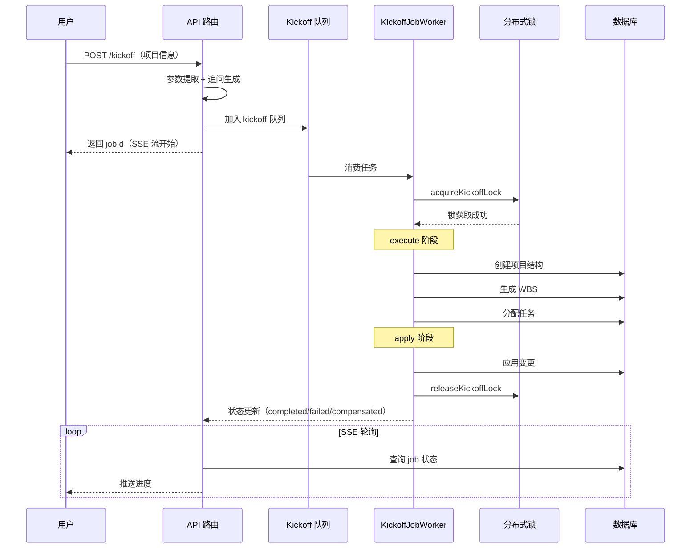

# 第 18 章 项目管理系统

> "项目是协作的容器，一切活动都在项目上下文中发生。"

项目是 WinMatrix 的核心组织单元——数字员工、任务、文档、知识库都归属于项目。本章将分析项目的领域模型、启动流程、工作项管理和项目级配置覆盖。

## 18.1 项目领域模型

项目的持久化定义：

```prisma
// prisma/schema.prisma（第 559-597 行）
model projects {
  id                    String            @id
  name                  String            @unique
  code                  String
  description           String?
  pmdocPath             String            @map("pmdoc_path")
  teamtaskPath          String            @map("teamtask_path")
  templateId            String?           @default("software_dev") @map("template_id")
  integrationsOverrides String?           @map("integrations_overrides")
  tags                  String[]          @default([])
  email                 String?
  emailPassword         String?           @map("email_password")
  // ... 关联：documents, flowTemplates, tasks, knowledge_bases 等
}
```

项目包含：

- **路径配置**：`pmdocPath`（PM 文档路径）、`teamtaskPath`（任务路径）
- **模板**：`templateId`（默认 software_dev），决定项目的领域包
- **集成覆盖**：`integrationsOverrides`（JSON），存储 TFS/Email 等集成的项目级配置
- **标签**：`tags`，用于分类和筛选
- **凭证**：`email` / `emailPassword`，项目级邮件凭证

## 18.2 ProjectService

```typescript
// src/business/domain/project/ProjectServiceImpl.ts（第 1-100 行）
/**
 * 项目领域服务实现
 * 负责项目初始化等核心业务逻辑。
 * 路径管理委托给 ProjectPathService。
 */
const SYNC_DOCUMENT_ERROR_SAMPLE_MAX = 25;
const PROJECT_LLM_VALIDATION_TIMEOUT_MS = 20_000;

function resolveProjectLlmValidationModel(llm: ProjectLlmConfig): string {
  return (
    llm.modelByLevel?.standard?.trim() ||
    llm.model?.trim() ||
    llm.modelByLevel?.mini?.trim() ||
    llm.modelByLevel?.deep?.trim() || ''
  );
}

export class ProjectServiceImpl implements IProjectService {
  constructor(
    private readonly projectRepository: IProjectRepository,
    private readonly projectDomainPackInitializer?: Pick<ProjectDomainPackInitializer, 'initialize'>,
  ) {}

  async initialize(params: InitializeProjectParams): Promise<DomainResult<Project>> {
    const { projectName, projectCode, domainPackId, domainPackVersion } = params;
    if (!this.validateProjectName(projectName)) {
      // ... 名称校验
    }
    // ... 初始化逻辑
  }
}
```

### 分层 LLM 模型配置

```typescript
function resolveProjectLlmValidationModel(llm: ProjectLlmConfig): string {
  return (
    llm.modelByLevel?.standard?.trim() ||  // 标准模型优先
    llm.model?.trim() ||                    // 通用模型
    llm.modelByLevel?.mini?.trim() ||      // 轻量模型
    llm.modelByLevel?.deep?.trim() ||      // 深度模型
    ''
  );
}
```

项目可以配置分层模型（standard / mini / deep），不同任务使用不同模型——简单任务用 mini（省成本），复杂任务用 deep（高质量）。

## 18.3 项目启动（Kickoff）流程

项目启动是 WinMatrix 最复杂的业务流程之一：

```typescript
// src/interface/api/projects/projectKickoff.ts（第 1-68 行）
/**
 * 项目启动（Kickoff）流程路由
 * 处理参数提取、追问生成、异步执行、状态查询、SSE 进度推送等。
 */
import { Architector } from '@/agents/core/agent/decision/architector/Architector.js';
import { executeKickoffApply } from '@/business/application/services/KickoffApplyExecutor.js';
import { processExecute } from '@/interface/workers/kickoffJobWorker.js';
import { getKickoffQueue } from '@/interface/channel/channels/scheduled/kickoffQueue.js';
import { acquireKickoffLock, releaseKickoffLock, renewKickoffLock } from '@/infrastructure/persistence/distributedLock.js';

const JOB_SSE_POLL_INTERVAL_MS = 1000;     // SSE 轮询间隔
const JOB_SSE_KEEPALIVE_MS = 15000;        // SSE 保活间隔

function isTerminalJobStatus(status): boolean {
  return status === 'completed' || status === 'failed' || status === 'compensated';
}
```

### Kickoff 的三阶段



### 分布式锁保护

Kickoff 使用分布式锁确保同一项目不会被并发启动：

```typescript
import { acquireKickoffLock, releaseKickoffLock, renewKickoffLock } from '@/infrastructure/persistence/distributedLock.js';
```

（分布式锁的实现见第 4 章——Redis SET NX + Lua 脚本）

### 补偿机制

```typescript
function isTerminalJobStatus(status): boolean {
  return status === 'completed' || status === 'failed' || status === 'compensated';
}
```

注意 `compensated` 状态——Kickoff 失败时会执行补偿操作（回滚已创建的资源），这是一种**Saga 模式**的实现。

## 18.4 工作项管理

工作项（Work Item）是任务在项目中的组织形式：

```typescript
// 工作项与 agent_run 关联
// 每个 agent_run 可能处理多个工作项
// 工作项状态反映 Agent 执行进度
```

工作项关联到 `agent_run`，可以通过项目 + 工作项 ID 查询 Agent 执行的详细记录。

## 18.5 项目级 LLM 配置覆盖

项目可以覆盖全局 LLM 配置：

```typescript
// ProjectLlmConfig
interface ProjectLlmConfig {
  model?: string;                    // 通用模型
  modelByLevel?: {
    mini?: string;                   // 轻量（简单任务）
    standard?: string;               // 标准（常规任务）
    deep?: string;                   // 深度（复杂任务）
  };
}
```

这种分层配置让每个项目可以根据预算和需求选择不同的模型组合。

## 18.6 项目凭证管理

项目级凭证存储在 `integrationsOverrides` JSON 字段中：

```typescript
// 项目凭证包括：
// - TFS 账号/Token（Azure DevOps 访问）
// - Git 用户名/密码（代码仓库）
// - Email 地址/密码（邮件发送）
// - 企微配置
```

凭证使用加密存储（见第 4 章 Repository 的 `encrypt` 调用），解密后注入到 `ToolExecutionContext`。

## 18.7 项目领域包

项目基于领域包（Domain Pack）初始化：

```typescript
// ProjectDomainPackInitializer
// 根据项目的 domainPackId 加载对应的领域配置
// 领域包定义了：
// - 角色（roles）
// - 工作流（workflows）
// - 技能集（skills）
// - 提示词（prompts）
```

不同类型的项目（软件开发、产品设计、运维）使用不同的领域包，预置了对应的角色和工作流。

## 本章小结

本章深入分析了 WinMatrix 的项目管理系统：

1. **项目模型**：路径配置 + 模板 + 集成覆盖 + 标签 + 凭证
2. **ProjectService**：初始化 + 路径管理委托 + LLM 验证
3. **分层 LLM 配置**：mini / standard / deep，按任务复杂度选择
4. **Kickoff 流程**：参数提取 → 异步执行 → SSE 进度推送，三阶段（execute/apply）
5. **分布式锁**：防止并发启动同一项目
6. **补偿机制**：失败时回滚（compensated 状态，Saga 模式）
7. **工作项管理**：关联 agent_run
8. **项目凭证**：加密存储，注入到工具上下文
9. **领域包**：按项目类型预置角色、工作流、技能

在下一章中，我们将深入协作会话机制。
