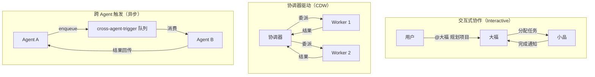

# 第 19 章 协作会话

> "真正的智能不是单打独斗，而是团队协作。"

数字员工之间的协作是 WinMatrix 的核心价值——大福分配任务给小品，小品完成后通知阿码审查。本章将分析多 Agent 协作机制、跨 Agent 触发、会话生成和后续动作。

## 19.1 多 Agent 协作

WinMatrix 支持多种协作模式：



## 19.2 跨 Agent 触发 Worker

`crossAgentTriggerWorker` 是异步协作的核心：

```typescript
// src/interface/workers/crossAgentTriggerWorker.ts（第 10-19 行）
/**
 * 跨 Agent 触发 Worker（BullMQ）
 *
 * 消费 cross-agent-trigger 队列中的任务：
 * 1. 准备 Role（TurnRunner.run）
 * 2. 保存用户消息
 * 3. 执行 Role.run()
 * 4. 保存助手消息
 * 5. 推送结果给原始用户
 */
import { Worker, DelayedError } from 'bullmq';
import { TurnRunner } from '@/agents/core/agent/turn/index.js';
import { resumeCoordinatorPipeline, assertResumableCoordinatorCheckpoint } from '@/agents/core/agent/turn/resumePendingExecution.js';
import { parseCoordinationCheckpoint } from '@/agents/core/agent/modes/cdw/coordinator/coordinationCheckpointContract.js';
import { enqueueCrossAgentInboxEvent, shouldRouteConversationToInteractiveInbox } from '@/agents/core/agent/modes/interactive/interactiveRoleInboxEntry.js';
import { crossAgentCallRegistry, type CrossAgentCallContext } from '@/agents/core/runtime/session/CrossAgentCallRegistry.js';
```

### 协调器检查点

```typescript
import { resumeCoordinatorPipeline } from '@/agents/core/agent/turn/resumePendingExecution.js';
import { parseCoordinationCheckpoint } from '@/agents/core/agent/modes/cdw/coordinator/coordinationCheckpointContract.js';
```

CDW 模式的协调器在等待子任务结果时，会将状态保存为**检查点（Checkpoint）**。当跨 Agent 触发的结果返回时，协调器从检查点恢复，继续执行后续步骤。

### BullMQ DelayedError

```typescript
import { Worker, DelayedError } from 'bullmq';
```

`DelayedError` 允许 Worker 将任务标记为"延迟"——当依赖的条件未满足时（如等待前置任务完成），任务会被重新入队延迟执行。

## 19.3 会话生成（Sub-session Spawning）

数字员工可以为其他员工创建子会话：

```typescript
// src/agents/core/runtime/session/
// CrossAgentCallRegistry.ts    - 跨 Agent 调用注册
// AgentContextCacheService.ts  - Agent 上下文缓存
// SessionPort.ts               - 会话端口抽象
// SessionKey.ts                - 会话键
// runtimeStateAuthority.ts     - 运行时状态权威
// TranscriptStore.ts           - 转录存储
```

### CrossAgentCallRegistry

```typescript
// src/agents/core/runtime/session/CrossAgentCallRegistry.ts
export interface CrossAgentCallContext {
  sourceConversationId: string;    // 源会话
  sourceAgentId: string;           // 源 Agent
  targetConversationId: string;    // 目标会话
}

// register() - 注册一次跨 Agent 调用
// 跟踪调用的生命周期
```

当大福需要小品写 PRD 时：

1. 大福在自己的会话中创建一个跨 Agent 调用
2. 系统为小品生成子会话（targetConversationId）
3. 任务通过 cross-agent-trigger 队列发送给小品
4. 小品完成后，结果回传给大福的会话

### 会话父子关系

```typescript
// ConversationMessage.parentConversationId
// 子会话记录父会话 ID，便于追溯调用链
```

## 19.4 后续动作（Follow-up Actions）

协作可能产生延迟的后续动作：

```prisma
// prisma/schema.prisma
model CollaborationFollowup {
  // 协作催促任务记录
  conversationId: string;
  blockedByRoleId: string;        // 被谁阻塞
  blockedByEmployeeId: string;
  followUpMessage: string;        // 跟进消息
  reason: string;                 // 原因
  delayMinutes: number;           // 延迟分钟数
  bullJobId: string;              // BullMQ 任务 ID
  status: string;                 // 状态
  // 时间线：scheduledAt → triggeredAt → completedAt
}
```

### 协作阻塞检测

当检测到一个协作被阻塞（如等待某员工响应超时），系统会创建一个延迟跟进任务：

```typescript
// src/infrastructure/persistence/collaborationFollowupPersistence.ts
import { markFollowupTriggered, markFollowupCompleted, markFollowupFailed } from '...';

// 1. 检测阻塞 → 创建 Followup（scheduledAt）
// 2. 延迟到时 → 触发跟进（triggeredAt）
// 3. 跟进完成 → 标记完成（completedAt）
```

这种机制确保协作不会"无限等待"——如果一方响应超时，系统会自动发送催促。

## 19.5 对话持久化

协作对话完整持久化：

```prisma
// prisma/schema.prisma
model conversation_histories {
  id: string;
  conversationId: string;
  parentConversationId?: string;    // 父会话（跨 Agent 委派）
  userId?: string;
  projectId?: string;
  role: string;                     // user / assistant / system
  roleId?: string;                  // 角色 ID
  digitalEmployeeId?: string;       // 数字员工 ID
  content: string;
  attachments?: unknown;
  metadata?: string;
  llmPurpose?: string;              // LLM 调用目的
  llmPhase?: string;                // LLM 调用阶段
  createdAt: Date;
}

model session_transcript {
  // 会话转录（更详细的执行记录）
}
```

## 19.6 收件箱模式（Role Inbox）

Interactive 模式使用收件箱机制：

```typescript
// src/agents/core/agent/modes/interactive/
// interactiveRoleInboxEntry.ts - 收件箱入口
// enqueueCrossAgentInboxEvent() - 入队收件箱事件
// shouldRouteConversationToInteractiveInbox() - 判断是否路由到收件箱
```

每个角色有一个收件箱，接收需要处理的任务。`roleInboxWorker`（并发 4）消费收件箱事件：

```typescript
// src/interface/workers/roleInboxWorker.ts（第 56-68 行）
const ROLE_INBOX_WORKER_CONCURRENCY = 4;
const CLAIM_OWNER_PREFIX = 'role-inbox-worker';

// Interactive 生命周期遥测转发白名单
const INTERACTIVE_FORWARD_WHITELIST: ReadonlySet<string> = new Set([
  'span_started', 'span_event', 'span_ended',
  'status', 'run:error',
  'thinking:start', 'thinking:end',
]);
```

### Claim 模式

```typescript
const CLAIM_OWNER_PREFIX = 'role-inbox-worker';
```

收件箱任务使用 Claim（认领）模式——多个 Worker 实例可以竞争认领任务，确保每个任务只被一个 Worker 处理。

## 19.7 协作可观测性

协作过程通过事件流实现可观测：

```typescript
// crossAgentTriggerWorker 中的遥测转发白名单
// 只转发关键事件，避免噪声
const INTERACTIVE_FORWARD_WHITELIST = new Set([
  'span_started', 'span_event', 'span_ended',
  'status', 'run:error',
  'thinking:start', 'thinking:end',
]);
```

## 本章小结

本章深入分析了 WinMatrix 的协作会话系统：

1. **三种协作模式**：Interactive（轮流）、CDW（协调器驱动）、跨 Agent 触发（异步）
2. **跨 Agent 触发 Worker**：5 步流程，BullMQ + DelayedError
3. **协调器检查点**：CDW 等待子任务时保存状态，结果返回后恢复
4. **会话生成**：CrossAgentCallRegistry 跟踪调用，子会话记录父会话
5. **后续动作**：协作阻塞检测 → 延迟跟进任务 → 自动催促
6. **对话持久化**：conversation_histories + session_transcript
7. **收件箱模式**：每个角色独立收件箱，Claim 竞争认领，并发 4
8. **协作可观测**：事件流白名单转发

在下一章中，我们将深入流程编排系统。
