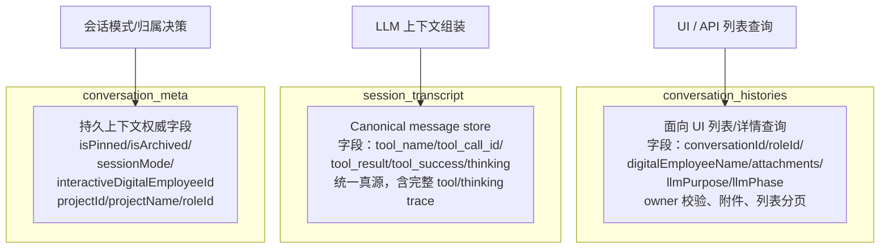
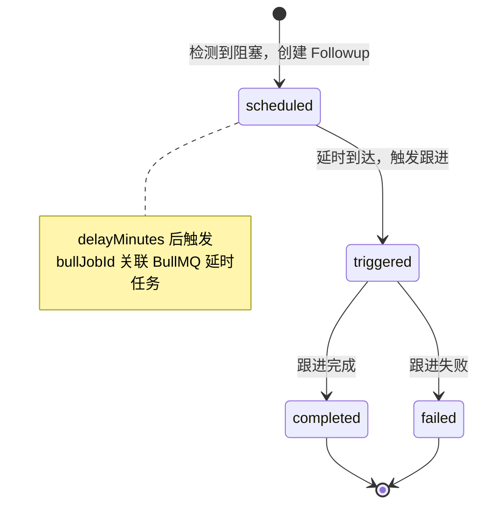
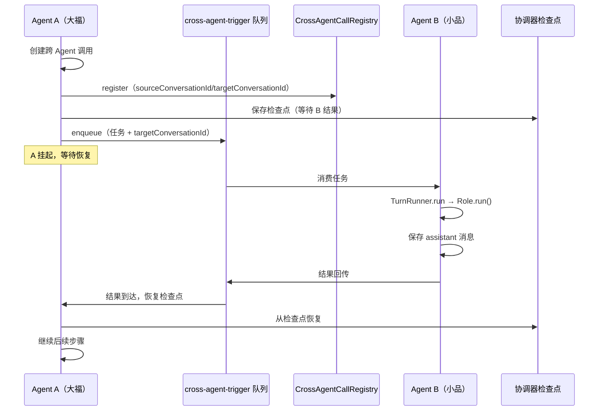

# 第 19 章 协作会话

> "真正的智能不是单打独斗，而是团队协作。"

数字员工之间的协作是 WinMatrix 的核心价值——大福（orchestrator）分配任务给小品（product_design_manager），小品完成后通知阿码（tech_manager）做技术评审。这种"多 Agent 轮流协作"看起来简单，但在工程上要解决一系列难题：协作消息怎么持久化才不丢？多个 Agent 抢同一个任务怎么协调？一个 Agent 迟迟不响应怎么催？协作过程中的工具调用、思维链怎么完整记录？

本章会先厘清一个容易混淆但至关重要的事实——**会话数据的三层分工**，然后深入 role_inbox 持久收件箱的租约抢占与幂等机制、入队前置三重校验、协作催促的延时任务模型，最后看 agent_collaboration 如何用 scenarios 描述协作场景。

## 19.1 会话数据的三层分工

很多人看 WinMatrix 的会话表会困惑：为什么对话数据要拆成三张表？这不是冗余吗？**不是冗余，是职责分工。** 这三张表各有各的消费者，谁都不能替代谁。



### conversation_histories：读模型

```prisma
// conversation_histories（读模型，真实字段）
// 注释明示：LLM 上下文真源为 session_transcript，本表用于列表/详情/owner 校验
model conversation_histories {
  id                    String   @id
  conversationId        String
  userId                String?
  projectId             String?
  role                  String                       // user / assistant / system
  content               String
  metadata              String?
  roleId                String?
  digitalEmployeeName   String?
  parentConversationId  String?                      // 父会话（跨 Agent 委派）
  digitalEmployeeId     String?
  agent_id              String?
  agent_name            String?
  attachments           Json?
  llmPurpose            String?                      // LLM 调用目的
  llmPhase              String?                      // LLM 调用阶段
}
```

`conversation_histories` 是为 **UI / API 列表查询**优化的读模型。它存了每条消息的"展示用"字段：`digitalEmployeeName`（显示谁说的）、`attachments`（附件）、`parentConversationId`（跨 Agent 委派时的父会话）、`llmPurpose / llmPhase`（这次 LLM 调用是干什么的、在哪个阶段）。

关键认知：**它的注释明确写着"LLM 上下文真源为 session_transcript"**。也就是说，这张表不是 LLM 喂数据的来源，它是给人看的、给列表查询用的。把"给人看的"和"给 LLM 喂的"分开存，避免了列表查询要扫过一堆 tool_result / thinking trace 才能找到一句话的尴尬。

### session_transcript：LLM 上下文真源

```prisma
// session_transcript（Canonical message store，统一真源，真实字段）
model session_transcript {
  id              String   @id
  session_key     String                        // 会话键
  entry_type      String                        // 条目类型（message/tool_call/thinking...）
  timestamp       DateTime
  role            String
  content         String
  tool_name       String?                        // 工具名
  tool_call_id    String?                        // 工具调用 ID
  tool_result     Json?                          // 工具返回
  tool_success    Boolean?                       // 工具是否成功
  thinking        String?                        // 思维链
  conversation_id String?
  message_id      String?
  llm_purpose     String?
  llm_phase       String?
}
```

`session_transcript` 才是 **LLM 上下文的真源（Canonical message store）**。它记录了会话里的每一个条目——不只是消息，还包括 `tool_name / tool_call_id / tool_result / tool_success`（工具调用的完整 trace）和 `thinking`（思维链）。

为什么要单独一张表？因为 LLM 需要的上下文远比"人说的话"丰富——它要看到"我上一步调了什么工具、工具返回了什么、成功没有、我当时是怎么思考的"。这些信息塞进 conversation_histories 会把列表查询污染得一塌糊涂，单独建表让各自的查询路径都干净。

这也是第 13 章技能轨迹提取的基础——`SkillTraceExtractor` 就是从 session_transcript 里按 `entry_type='tool_call'` + tool_result，以 runId 切边界，重建技能执行的完整轨迹。

### conversation_meta：权威元数据

```prisma
// conversation_meta（会话元数据/持久上下文权威字段，真实字段）
model conversation_meta {
  conversationId                String   @id
  userId                        String?
  title                         String?
  isPinned                      Boolean  @default(false)
  isArchived                    Boolean  @default(false)
  projectId                     String?
  projectName                   String?
  roleId                        String?
  sessionMode                   String?                  // 会话模式
  interactiveDigitalEmployeeId  String?                  // 交互式目标员工
}
```

`conversation_meta` 存的是会话的**权威元数据**——`isPinned`（置顶）、`isArchived`（归档）、`sessionMode`（会话模式：interactive / coordinator / react...）、`interactiveDigitalEmployeeId`（交互式模式下当前对接的数字员工）。

这些字段是"会话级状态"，不属于任何单条消息。`isPinned` 和 `isArchived` 控制 UI 里会话的展示位置；`sessionMode` 决定这个会话走哪种执行模式（见事实清单的五种执行模式）；`interactiveDigitalEmployeeId` 在交互式协作里标识"当前轮到谁说话"。把这些状态收敛到一张元数据表，避免散落在各条消息里难以维护。

## 19.2 role_inbox：持久收件箱

交互式协作（Interactive 模式）的核心机制是 **role_inbox**——一个持久的角色收件箱。每个角色都有一个收件箱，接收需要处理的事件。这不是一个内存队列，而是一个 PostgreSQL 表 + BullMQ 投递的两级结构。

### role_inbox 模型

```prisma
// role_inbox（Interactive role durable inbox，真实字段）
// 注释：OpenSpec introduce-interactive-role-runtime
model role_inbox {
  id                  String   @id @default(uuid())
  event_id            String                          // 事件 ID
  role_id             String                          // 目标角色
  digital_employee_id String                          // 目标数字员工
  conversation_id     String?                         // 会话关联
  source              String                          // 事件来源
  event_type          String                          // 事件类型
  payload             Json                            // 事件负载
  idempotency_key     String?                         // 幂等键
  status              String                          // 状态（queued/claimed/running/completed...）
  claim_owner         String?                         // 租约持有者
  claim_expires_at    DateTime?                       // 租约过期时间
  retry_count         Int      @default(0)            // 已重试次数
  max_retries         Int      @default(N)            // 最大重试次数
  turn_id             String?                         // 轮次关联
  message_id          String?                         // 消息关联
  created_at          DateTime  @default(now())
  updated_at          DateTime  @updatedAt
}
```

这张表的字段组合揭示了它的四大机制：

| 字段组 | 机制 | 作用 |
|--------|------|------|
| `claim_owner / claim_expires_at` | 租约抢占 | 多个 Worker 竞争认领，租约过期后可被其他 Worker 抢回 |
| `retry_count / max_retries` | 重试 | 失败后重试，超过上限进入死信 |
| `idempotency_key` | 幂等 | 相同事件不重复入队，命中则 deduplicated |
| `turn_id / message_id` | 轮次/消息关联 | 事件归属到具体的协作轮次和消息 |

### 入队策略：PG 先写，再 BullMQ 投递

入队的 SSOT 是 `RoleInboxEnqueueService`，它的策略在文件头注释里写得明明白白：

```typescript
// src/business/domain/agentExecution/RoleInboxEnqueueService.ts（第 1-3 行）
/**
 * Enqueue durable role inbox events: PG first, then BullMQ (OpenSpec §3.1).
 */
```

**PG 先写，BullMQ 后投递**——这个顺序至关重要。如果反过来（先入 BullMQ 队列再写 PG），BullMQ 投递成功但 PG 写入失败，事件就丢了——因为 Worker 消费时找不到对应的 PG 记录。反过来，PG 写入成功但 BullMQ 投递失败，事件还在 PG 里，后续的 recovery scan 能重新把它投递出去。**持久层是真相来源，消息队列只是加速器。**

### 入队前置三重校验

入队不是无脑 insert，而是经过三重前置校验：

```typescript
// src/business/domain/agentExecution/RoleInboxEnqueueService.ts（第 59-90 行）
export class RoleInboxEnqueueService {
  async enqueue(input: EnqueueRoleEventInput): Promise<EnqueueRoleEventResult> {
    const turnId = input.turnId?.trim() || `turn_${randomUUID()}`;
    const inputWithTurnId = { ...input, turnId };

    // ① 路由合法性校验
    const routing = validateInteractiveRoleEventRouting(toRoutingProbeEvent(inputWithTurnId));
    if (!routing.ok) {
      throw new Error(
        `interactive_runtime_routing_error:${routing.reason ?? 'pipeline_assignment'}`,
      );
    }

    // ② Agent 空闲探测
    let record: RoleInboxRecord;
    let deduplicated = false;
    const wasAgentIdle = input.conversationId
      ? await probeAgentIdle(input.roleId, input.conversationId)
      : false;

    // ③ 负载规范化 + 写入（命中幂等键返回 deduplicated）
    try {
      const payload = normalizeRoleInboxEventPayloadForInteractiveEnvironment({...});
      record = await roleInboxRepository.insertQueuedEvent({ ...input, payload, turnId });
    } catch (error) {
      if (error instanceof RoleInboxDuplicateEventError) {
        // 命中幂等键：不抛错，返回 deduplicated=true
        record = error.existing;
        deduplicated = true;
        void recordRoleEventEnqueued({
          eventId: record.eventId, roleId: record.roleId,
          digitalEmployeeId: record.digitalEmployeeId,
          ...(record.conversationId && { conversationId: record.conversationId }),
          deduplicated: true,
        });
        return { record, deduplicated, bullmqEnqueued: false };
      }
      throw error;
    }
    // ... BullMQ 投递 ...
  }
}
```

三重校验分别是：

1. **路由合法性**（`validateInteractiveRoleEventRouting`）：这个事件该不该路由到这个角色？路由规则在 interactiveRoleRoutingGuard 里定义。不合法直接抛 `interactive_runtime_routing_error`，不写入。
2. **Agent 空闲探测**（`probeAgentIdle`）：目标 Agent 当前是否空闲？这个探测结果会记到遥测里（`wasAgentIdle` → 后续的 `recordAgentAwake`），用于判断"事件到达时 Agent 是否在睡觉"。
3. **负载规范化**（`normalizeRoleInboxEventPayloadForInteractiveEnvironment`）：把事件 payload 规范化成交互式环境需要的格式，确保下游消费方拿到的结构一致。

### 幂等键：命中不抛错，返回 deduplicated

第三重校验里有一个值得单独强调的设计：**命中幂等键时不是抛错，而是返回 `deduplicated=true`**。

```typescript
if (error instanceof RoleInboxDuplicateEventError) {
  record = error.existing;
  deduplicated = true;
  // ... 记录遥测 ...
  return { record, deduplicated, bullmqEnqueued: false };
}
```

这是一个对调用方友好的设计。在分布式系统里，事件重复投递是常态——网络抖动、Producer 重试、recovery scan 都可能导致同一个事件被入队多次。如果命中幂等键就抛错，调用方不得不写一堆 try-catch 来容忍重复，代码会很丑。返回 `deduplicated=true` 让调用方能明确区分"这次是真正新入队了"和"这次是重复被幂等了"，各自走自己的逻辑，**把重复从异常降级为正常的分支**。

### BullMQ 投递失败的优雅降级

```typescript
// src/business/domain/agentExecution/RoleInboxEnqueueService.ts（第 103-116 行）
let bullmqEnqueued = false;
try {
  await enqueueRoleInboxBullmqJob(record);
  bullmqEnqueued = true;
} catch (queueError) {
  logger.warn(
    { event: 'role_inbox_bullmq_enqueue_failed', eventId: record.eventId,
      error: getErrorMsg(queueError) },
    'role_inbox PG write succeeded but BullMQ enqueue failed; recovery scan will re-enqueue',
  );
}
```

BullMQ 投递失败时只记 warn 日志，不抛错——因为 PG 里已经有记录了，后续的 recovery scan 会把它重新投递出去。返回的 `bullmqEnqueued: false` 让调用方知道"BullMQ 这次没投递成功，但别慌，PG 里有，scan 会兜底"。**优雅降级，而不是让上层崩溃。**

### roleInboxWorker：消费端

`roleInboxWorker`（BullMQ Worker，并发 4）消费收件箱事件：

```typescript
// src/interface/workers/roleInboxWorker.ts（第 56-68 行）
const ROLE_INBOX_WORKER_CONCURRENCY = 4;
const CLAIM_OWNER_PREFIX = 'role-inbox-worker';

// Interactive 生命周期遥测转发白名单
const INTERACTIVE_FORWARD_WHITELIST: ReadonlySet<string> = new Set([
  'span_started', 'span_event', 'span_ended',
  'status', 'run:error',
  'thinking:start', 'thinking:end',
]);
```

并发 4 意味着同时最多有 4 个事件在被处理。`CLAIM_OWNER_PREFIX` 用于在租约抢占时标识认领者——多个 Worker 实例可以竞争认领同一个事件，但只有 `claim_owner` 匹配的那个才能真正处理。

`INTERACTIVE_FORWARD_WHITELIST` 是遥测转发白名单——Worker 处理事件时会产生大量内部事件（span、status、thinking...），只转发白名单内的关键事件到协作通道，避免噪声淹没。

## 19.3 协作催促：延时任务

协作不是"发出去就完事"的。大福给小品派了任务，小品如果迟迟不响应，协作就卡住了。WinMatrix 用 **CollaborationFollowup**（延时催促任务）来解决这个问题。

### CollaborationFollowup 模型

```prisma
// CollaborationFollowup（协作阻塞检测后创建的延时跟进任务，真实字段）
model CollaborationFollowup {
  conversationId         String                          // 会话
  blockedByRoleId        String                          // 被谁阻塞（角色）
  blockedByEmployeeId    String                          // 被谁阻塞（员工）
  followUpMessage        String                          // 跟进消息内容
  reason                 String                          // 阻塞原因
  delayMinutes           Int                             // 延迟分钟数
  bullJobId              String?                         // BullMQ 任务 ID
  status                 String                          // 状态
  projectId              String?

  // —— 全生命周期时间戳 ——
  scheduledAt            DateTime                        // 计划触发时间
  triggeredAt            DateTime?                       // 实际触发时间
  completedAt            DateTime?                       // 完成时间
}
```

三个时间戳 `scheduledAt / triggeredAt / completedAt` 构成了催促任务的全生命周期：**计划什么时候催 → 实际什么时候催了 → 催完什么时候收尾**。运维能从这三个时间点的差值里看出系统健康状况——`triggeredAt - scheduledAt` 偏大说明 BullMQ 调度延迟，`completedAt - triggeredAt` 偏大说明催促后处理慢。

### 催促的生命周期



催促的触发逻辑：

1. **检测阻塞**：系统检测到一个协作被阻塞（等待某员工响应超时），创建一条 Followup 记录，`status=scheduled`，`scheduledAt = now + delayMinutes`。
2. **延时到达**：BullMQ 的延时任务（`bullJobId` 关联）到时触发，`status=triggered`，`triggeredAt=now`，发送 `followUpMessage`。
3. **完成/失败**：跟进消息处理完成 `status=completed`，或失败 `status=failed`。

```typescript
// src/infrastructure/persistence/collaborationFollowupPersistence.ts
import { markFollowupTriggered, markFollowupCompleted, markFollowupFailed } from '...';

// 1. 检测阻塞 → 创建 Followup（scheduledAt）
// 2. 延时到时 → markFollowupTriggered（triggeredAt）
// 3. 跟进完成 → markFollowupCompleted（completedAt）
//    跟进失败 → markFollowupFailed
```

这种机制确保协作不会"无限等待"——如果一方响应超时，系统会按预设的 `delayMinutes` 自动发送催促，把停滞的协作重新推动起来。催促不是一次性的——可以根据业务需要创建多级催促（30 分钟一次、2 小时一次、一天一次），形成催促梯度。

## 19.4 agent_collaboration：协作场景描述

```prisma
// agent_collaboration（真实字段）
model agent_collaboration {
  id                    String   @id
  agent_id              String                          // 主体 Agent
  collaborator_agent_id String                          // 协作方 Agent
  scenarios             String[]                        // 协作场景列表
}
```

`agent_collaboration` 用 `scenarios: string[]` 描述两个 Agent 之间的协作场景。这不是一个固定的枚举，而是一个字符串数组——因为两个 Agent 之间的协作可能是多面的：大福和小品之间可能同时存在"需求评审""PRD 交付""方案确认"等多个协作场景。

`scenarios` 数组让协作关系是**多场景叠加**的，而不是"一个关系一个场景"。这种设计在查询时很灵活——可以按场景过滤"找出所有需要 PRD 交付的协作对"，也可以按 Agent 查询"大福和谁有哪些协作"。

## 19.5 跨 Agent 触发

除了交互式协作（轮流说话），WinMatrix 还支持异步的跨 Agent 触发——Agent A 在自己的执行过程中，把一个任务派给 Agent B，B 完成后把结果回传给 A。



### crossAgentTriggerWorker

`crossAgentTriggerWorker`（BullMQ Worker）是异步协作的核心，消费 `cross-agent-trigger` 队列：

```typescript
// src/interface/workers/crossAgentTriggerWorker.ts（第 10-19 行）
/**
 * 跨 Agent 触发 Worker（BullMQ）
 *
 * 消费 cross-agent-trigger 队列中的任务：
 * 1. 准备 Role（TurnRunner.run）
 * 2. 保存用户消息
 * 3. 执行 Role.run()
 * 4. 保存助手消息
 * 5. 推送结果给原始用户
 */
import { Worker, DelayedError } from 'bullmq';
import { TurnRunner } from '@/agents/core/agent/turn/index.js';
import { resumeCoordinatorPipeline, assertResumableCoordinatorCheckpoint } from '@/agents/core/agent/turn/resumePendingExecution.js';
import { parseCoordinationCheckpoint } from '@/agents/core/agent/modes/cdw/coordinator/coordinationCheckpointContract.js';
import { enqueueCrossAgentInboxEvent, shouldRouteConversationToInteractiveInbox } from '@/agents/core/agent/modes/interactive/interactiveRoleInboxEntry.js';
import { crossAgentCallRegistry, type CrossAgentCallContext } from '@/agents/core/runtime/session/CrossAgentCallRegistry.js';
```

5 步流程清晰：准备 Role → 保存用户消息（即 A 派来的任务）→ 执行 B 的 Role.run() → 保存 B 的回复 → 把结果推回给 A。

### 协调器检查点

```typescript
import { resumeCoordinatorPipeline } from '@/agents/core/agent/turn/resumePendingExecution.js';
import { parseCoordinationCheckpoint } from '@/agents/core/agent/modes/cdw/coordinator/coordinationCheckpointContract.js';
```

CDW（Coordinator 模式）的协调器在等待子任务结果时，会把自己的状态保存为一个**检查点（Checkpoint）**——记录"我已经执行到哪、在等什么、等到后要做什么"。协调器自身挂起，释放资源。当跨 Agent 触发的结果返回时，协调器从检查点恢复，继续执行后续步骤。

这是经典的 **Saga / continuation 模式**——长流程不占着资源死等，而是把状态持久化，等异步结果回来再恢复。比让协调器线程阻塞等待要高效得多。

### BullMQ DelayedError

```typescript
import { Worker, DelayedError } from 'bullmq';
```

`DelayedError` 是 BullMQ 的机制——当依赖的条件未满足时（如等待前置任务完成），Worker 把任务标记为"延迟"，重新入队延迟执行。这让跨 Agent 协作能处理"还需要再等等"的情况，而不是直接失败。

### CrossAgentCallRegistry

```typescript
// src/agents/core/runtime/session/CrossAgentCallRegistry.ts
export interface CrossAgentCallContext {
  sourceConversationId: string;    // 源会话（A 的）
  sourceAgentId: string;           // 源 Agent（A）
  targetConversationId: string;    // 目标会话（系统为 B 生成）
}
```

`CrossAgentCallRegistry` 跟踪每一次跨 Agent 调用的生命周期——源会话、源 Agent、目标会话。当大福需要小品写 PRD 时：大福在自己的会话里注册一次跨 Agent 调用 → 系统为小品生成子会话（targetConversationId）→ 任务通过队列发送给小品 → 小品完成后，结果按注册关系回传给大福的会话。

`conversation_histories.parentConversationId` 记录了这种父子会话关系，便于追溯整个调用链——从大福的会话能找到它派生出的所有子会话。

## 19.6 协作可观测性

协作过程的可观测性通过**事件流白名单转发**实现：

```typescript
// src/interface/workers/roleInboxWorker.ts
const INTERACTIVE_FORWARD_WHITELIST: ReadonlySet<string> = new Set([
  'span_started', 'span_event', 'span_ended',
  'status', 'run:error',
  'thinking:start', 'thinking:end',
]);
```

协作过程中会产生大量内部事件——span 的启停、状态变更、思维链的起止、错误。如果全部转发到协作通道（供 UI 实时展示或供 trace 收集），通道会被噪声淹没。白名单只转发**调用方真正关心的关键事件**：

- `span_started / span_event / span_ended`：执行跨度的生命周期
- `status`：状态变更
- `run:error`：错误
- `thinking:start / thinking:end`：思维链边界（UI 展示"Agent 正在思考"）

这种"白名单转发"是协作可观测性的经典权衡——**既要让协作过程透明可观测，又不能让观测本身成为性能负担。** 白名单让转发是有选择的，每个转发的事件都是有价值的。

此外，入队服务还会记录两类重要的协作遥测：

```typescript
// RoleInboxEnqueueService 里
// ① 事件入队记录（含 deduplicated 标志）
void recordRoleEventEnqueued({ eventId, roleId, digitalEmployeeId, deduplicated, ... });

// ② Agent 唤醒记录（仅当 wasAgentIdle && !deduplicated）
if (wasAgentIdle && !deduplicated) {
  void recordAgentAwake({ eventId, roleId, digitalEmployeeId, ... });
}
```

`recordAgentAwake` 只在"Agent 本来在睡觉、这次事件是真正新事件（非幂等重复）"时记录——它标识"这个事件唤醒了一个沉睡的 Agent"，是协作活跃度的重要信号。

## 19.7 会话运行时支撑设施

跨 Agent 协作依赖一组运行时支撑设施，它们位于 `src/agents/core/runtime/session/`：

```
src/agents/core/runtime/session/
├── CrossAgentCallRegistry.ts    # 跨 Agent 调用注册
├── AgentContextCacheService.ts  # Agent 上下文缓存
├── SessionPort.ts               # 会话端口抽象
├── SessionKey.ts                # 会话键
├── runtimeStateAuthority.ts     # 运行时状态权威
└── TranscriptStore.ts           # 转录存储
```

### CrossAgentCallRegistry：调用生命周期

```typescript
// src/agents/core/runtime/session/CrossAgentCallRegistry.ts
export interface CrossAgentCallContext {
  sourceConversationId: string;    // 源会话（调用方）
  sourceAgentId: string;           // 源 Agent
  targetConversationId: string;    // 目标会话（被调用方）
}

// register() - 注册一次跨 Agent 调用，跟踪调用的生命周期
```

当大福需要小品写 PRD 时：大福在自己的会话中创建一个跨 Agent 调用注册 → 系统为小品生成子会话（targetConversationId）→ 任务通过 cross-agent-trigger 队列发送给小品 → 小品完成后，结果按注册关系回传给大福的会话。

`CrossAgentCallRegistry` 是这个流程的"户籍管理处"——每一次跨 Agent 调用都在这里登记 source 和 target 的对应关系。结果回传时，Worker 查 registry 找到"这次任务是从哪个源会话派来的"，把结果准确地送回去。没有这个注册，回传就找不到门。

### 协调器检查点的恢复

跨 Agent 触发最精妙的部分是协调器（CDW 模式）的检查点恢复机制：

```typescript
import { resumeCoordinatorPipeline, assertResumableCoordinatorCheckpoint } from '@/agents/core/agent/turn/resumePendingExecution.js';
import { parseCoordinationCheckpoint } from '@/agents/core/agent/modes/cdw/coordinator/coordinationCheckpointContract.js';
```

当 CDW 协调器需要派发子任务给其他 Agent 时，它不是阻塞等待——而是把自己的执行状态（"我执行到第几步、下一步该做什么、我在等哪个子任务的结果"）序列化为一个**检查点**，持久化下来，然后释放执行资源。协调器从这个点"挂起"。

当跨 Agent 触发的子任务完成、结果通过队列回传时，`crossAgentTriggerWorker` 会：

1. `assertResumableCoordinatorCheckpoint`——确认检查点存在且可恢复（没被超时清理、没被并发占用）。
2. `parseCoordinationCheckpoint`——把持久化的检查点解析回协调器的内部状态。
3. `resumeCoordinatorPipeline`——从检查点恢复执行，把子任务结果注入，继续后续步骤。

这是 **continuation-passing style** 在分布式协作里的应用——长流程不占着资源死等，而是把"接下来要做什么"持久化，等异步结果回来再恢复。比让协调器线程阻塞等待高效得多，也比"轮询查子任务状态"优雅得多。

### 入队决策：shouldRouteConversationToInteractiveInbox

```typescript
import { enqueueCrossAgentInboxEvent, shouldRouteConversationToInteractiveInbox } from '@/agents/core/agent/modes/interactive/interactiveRoleInboxEntry.js';
```

`shouldRouteConversationToInteractiveInbox` 是一个路由判断——这个会话是否应该走 Interactive 收件箱路径。不是所有跨 Agent 调用都走收件箱——有些走 CDW 协调器检查点，有些走 react 直接执行。路由判断决定了一条消息进哪条处理通道，避免"所有消息都进同一个队列"导致的混乱。

### 会话父子关系

```typescript
// conversation_histories.parentConversationId
// 子会话记录父会话 ID，便于追溯调用链
```

`conversation_histories` 的 `parentConversationId` 字段记录了会话的父子关系——小品的子会话里，`parentConversationId` 指向大福的会话。这让调用链可追溯：从大福的会话能找到它派生出的所有子会话，从子会话也能回到父会话。在调试协作问题时，这条父子链是还原"到底发生了什么"的关键线索。

### runtimeStateAuthority：运行时状态权威

`runtimeStateAuthority` 是运行时状态的权威来源——会话的当前状态（轮到谁说话、是否在等待、是否已超时）以这里为准。这避免了多个组件各自维护一份"我认为会话状态是 X"导致的漂移。**运行时状态单一真源**（SSOT）是避免并发协作里状态混乱的根本手段。

### TranscriptStore 与 session_transcript 的分工

`TranscriptStore` 是 session_transcript 表的运行时访问层——它封装了"怎么往 transcript 里追加条目、怎么按 session_key 查、怎么按时间窗切"。上层组件（如 TurnRunner、ToolExecutor）通过 TranscriptStore 写入 trace，不直接操作 Prisma。这层封装让 transcript 的存储格式变更（比如未来从 PG 换到专用时序库）不影响上层。

## 19.8 设计权衡：为什么用持久收件箱而不是内存队列

读完 role_inbox 的设计，一个自然的问题是：为什么不直接用内存队列（或纯 BullMQ）？为什么要 PG + BullMQ 两级？

核心原因是**可靠性等级不同**：

- **内存队列**：进程崩溃就丢。不可接受——协作消息丢了，用户不知道，Agent 不响应，协作永久卡死。
- **纯 BullMQ**：BullMQ 的 backlog 在 Redis 里，Redis 挂了也会丢（除非开 AOF + 复制，但即使如此也不是 100%）。且 BullMQ 没有天然的"按 idempotency_key 去重"和"按 turn_id 查一个轮次的所有事件"这类业务查询能力。
- **PG + BullMQ 两级**：PG 是持久真相（idempotency_key 去重、turn_id 关联、status 状态机都在 PG），BullMQ 是加速器（异步分发、延时、重试）。PG 挂了有主从复制和 PITR（point-in-time recovery），可靠性远高于 Redis。

这个权衡的代价是**写入要两次**（PG insert + BullMQ enqueue），但这个代价换来了"哪怕 BullMQ/Redis 全挂，协作消息也不丢"的可靠性。对于协作这种"丢一条消息就卡死整个流程"的场景，这个代价值得。

这也是为什么入队策略是"PG 先写、BullMQ 后投递"——顺序不能反。反过来就是"消息可能被标记为投递成功但实际丢了"，这在需要可靠交付的系统里是不可接受的。**持久层是真相，消息队列是优化。**

## 19.9 recovery scan：兜底的重新投递

BullMQ 投递失败时，日志里有一句关键的话：**"recovery scan will re-enqueue"**。这背后有一个兜底机制——定期扫描 role_inbox 表，找出"PG 里 status=queued 但 BullMQ 里没有对应 job"的孤儿记录，重新投递。

```typescript
// src/business/domain/agentExecution/RoleInboxEnqueueService.ts（第 103-116 行）
} catch (queueError) {
  logger.warn(
    { event: 'role_inbox_bullmq_enqueue_failed', eventId: record.eventId,
      error: getErrorMsg(queueError) },
    'role_inbox PG write succeeded but BullMQ enqueue failed; recovery scan will re-enqueue',
  );
}
```

recovery scan 解决的是"BullMQ 投递失败"和"进程崩溃导致投递中断"这两种情况。它的存在让入队服务敢于在 BullMQ 投递失败时只记 warn 不抛错——因为知道 scan 会兜底。**有兜底的系统才敢于乐观。**

这是一种经典的 **reconcile（对账）模式**——不保证每一步都完美成功，但定期对账修复不一致。它的代价是 scan 的延迟（孤儿记录要等下一轮 scan 才被重新投递），但换来了入队路径的简洁和高吞吐。对于协作消息这种"秒级延迟可接受、但消息不能丢"的场景，reconcile 是正确的权衡。这种"乐观执行 + 定期对账"的思路，在全书的很多地方都能看到——第 4 章的 Prisma 连接池自动恢复、第 20 章的指令租约过期重认领，都是同一哲学的不同体现。

## 本章小结

本章深入分析了 WinMatrix 的协作会话系统：

1. **会话数据三层分工**（非冗余）：`conversation_histories`（读模型，列表/详情/owner 校验，注释明示非 LLM 真源）+ `session_transcript`（LLM 上下文 Canonical 真源，含 tool_name/tool_result/tool_success/thinking 完整 trace）+ `conversation_meta`（权威元数据 isPinned/isArchived/sessionMode/interactiveDigitalEmployeeId）。三张表各有消费者，分离让查询路径干净。
2. **role_inbox 持久收件箱**：租约抢占（claim_owner/claim_expires_at）+ 重试（retry_count/max_retries）+ 幂等（idempotency_key）+ 轮次关联（turn_id/message_id）。入队策略 **PG 先写 → BullMQ 后投递**（OpenSpec §3.1），持久层是真相来源，消息队列只是加速器。
3. **入队前置三重校验**：路由合法性（validateInteractiveRoleEventRouting）+ Agent 空闲探测（probeAgentIdle）+ 负载规范化。**命中幂等键返回 deduplicated=true 而非抛错**——把重复从异常降级为正常分支。
4. **BullMQ 投递失败优雅降级**：只记 warn 不抛错，recovery scan 会重新投递。
5. **协作催促是延时任务**：CollaborationFollowup 带 delayMinutes/bullJobId + 全生命周期时间戳（scheduledAt/triggeredAt/completedAt），确保协作不无限等待。
6. **agent_collaboration 用 scenarios[]** 描述多场景叠加的协作关系。
7. **跨 Agent 触发**：crossAgentTriggerWorker 5 步流程，协调器检查点（Saga/continuation 模式），CrossAgentCallRegistry 跟踪调用生命周期，parentConversationId 追溯调用链。
8. **协作可观测性**：白名单转发关键事件，避免噪声；recordRoleEventEnqueued/recordAgentAwake 记录协作活跃度。
9. **recovery scan 兜底**：BullMQ 投递失败只记 warn，定期对账扫描重新投递孤儿记录——乐观执行 + 定期对账。

协作是 WinMatrix 核心价值的体现。在下一章中，我们将进入流程编排系统——看如何把"重复的最佳实践"固化为可复用、可版本管理、可按需编排的工作流模板。
