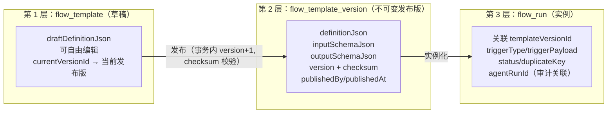
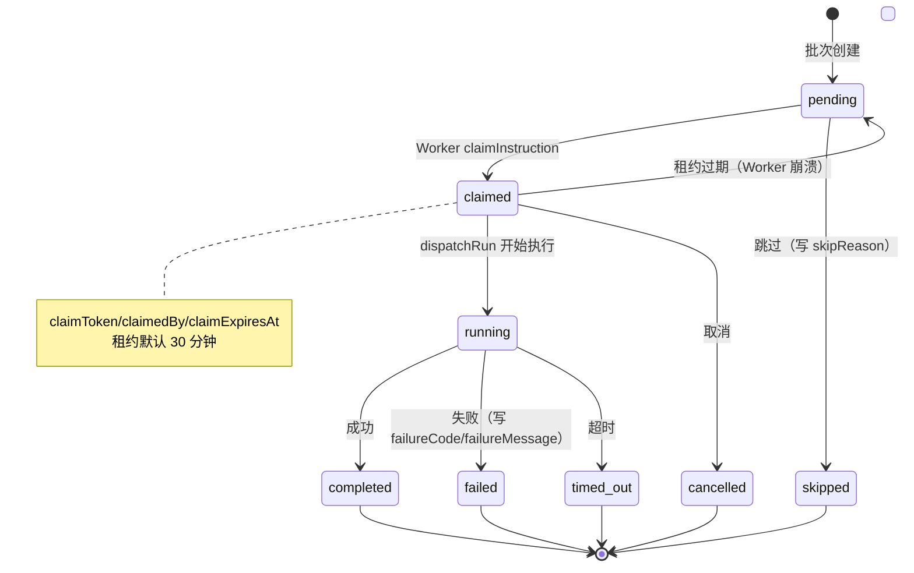
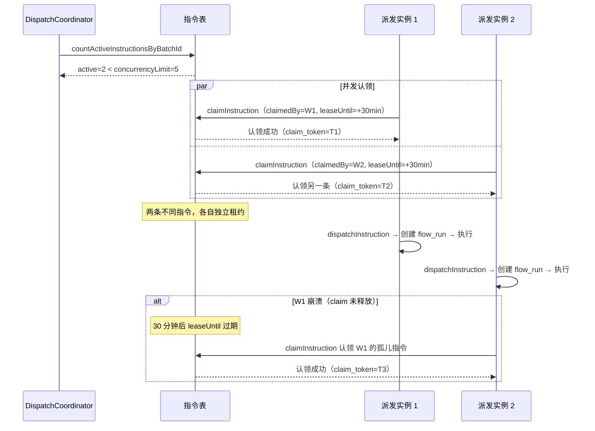
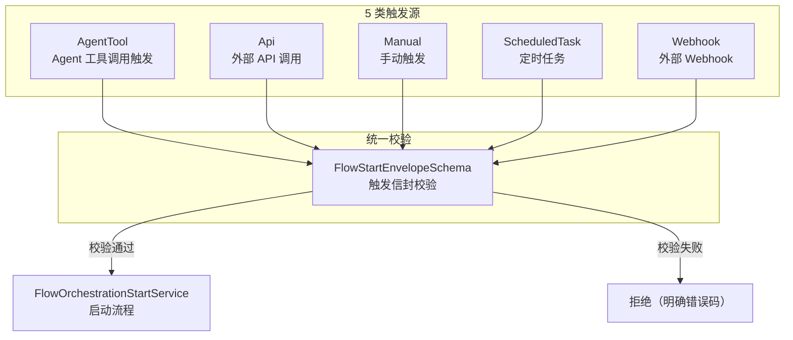

# 第 20 章 流程编排

> "把重复的最佳实践固化为可执行的流程。"

流程编排（Flow Orchestration）是 WinMatrix 把"多步骤最佳实践"自动化的机制。一个"项目启动流程"可能涉及：大福分解需求 → 小品写 PRD → 阿码做技术方案 → 小质做评审 → 大维部署。每一步都有输入输出依赖，每一步都可能失败重试，整个流程可能被批量触发（一次性给 10 个需求各跑一遍）。

这种复杂度靠 ad-hoc 的"写胶水代码串起来"是撑不住的。WinMatrix 的流程编排领域（`src/business/domain/flowOrchestration/`，40+ 个 .ts 文件）给出了一个系统化答案：**三层模型管理模板生命周期、指令驱动实现按需编排、租约并发控制多 Worker 协调、provides/consumes 显式契约保证数据流正确、资源与文档存储解耦**。

本章会逐层拆解这些设计。

## 20.1 三层模型：template → version → run

流程模板的生命周期管理采用经典的三层模型：草稿 → 不可变发布版 → 运行实例。这三层各自有独立的数据模型，职责清晰隔离。



### flow_template：草稿/root

```prisma
// flow_template（草稿/root，真实字段）
model flow_template {
  id                   String   @id @default(uuid())
  projectId            String   @map("project_id")
  name                 String
  description          String?
  category             String   @default("general")
  status               String   @default("draft")             // draft / published
  ownerId              String?  @map("owner_id")
  currentVersionId     String?  @map("current_version_id")    // 指向当前发布版
  draftDefinitionJson  Json?    @map("draft_definition_json") // 草稿定义
  // ... 时间戳
}
```

`flow_template` 是模板的"根"实体。它的 `draftDefinitionJson` 存的是**草稿状态**的定义——这个状态下定义可以随意改、随意试，不影响已经在跑的流程。`currentVersionId` 是一个指针，指向当前生效的发布版本（flow_template_version 的一条记录）。

为什么要分草稿和发布版？因为**编辑中的定义和已经生效的定义必须隔离**。如果直接改生效的定义，正在跑的流程会读到不一致的中间状态——比如改到一半时某个步骤的契约对不上，正在执行的流程就会崩。草稿和发布版分开，让"编辑"和"运行"在数据层就互不干扰。

### flow_template_version：不可变发布版

```prisma
// flow_template_version（不可变发布版，真实字段）
model flow_template_version {
  id               String   @id @default(uuid())
  templateId       String   @map("template_id")
  version          Int                                      // 版本号（递增）
  definitionJson   Json     @map("definition_json")          // 发布的定义（不可变）
  inputSchemaJson  Json     @map("input_schema_json")        // 输入 Schema
  outputSchemaJson Json     @map("output_schema_json")       // 输出 Schema
  publishedBy      String?  @map("published_by")
  publishedAt      DateTime @map("published_at")
  checksum         String                                   // 内容校验和
}
```

一旦发布，`flow_template_version` 就是**不可变的**。`definitionJson / inputSchemaJson / outputSchemaJson` 三个 JSON 字段共同定义了这个版本的完整内容——流程定义、输入约束、输出契约。`version` 递增，`checksum` 是内容的 SHA-256 校验和。

不可变性是这里的关键。一个发布版本一旦创建，**任何人、任何流程都不能修改它**。要改？发一个新版本（version+1）。这让正在运行中的流程能放心引用某个版本——它知道这个版本永远不会变，不会跑到一半发现定义被人改了。

### 版本发布事务

版本发布在一个数据库事务内完成（见第 4 章事务编排）：

```typescript
// src/infrastructure/persistence/repositories/FlowTemplateRepository.ts（第 191-219 行）
async publishVersion(params: PublishFlowTemplateVersionParams) {
  const checksum = createHash('sha256').update(JSON.stringify(parsed)).digest('hex');

  const version = await db.$transaction(async (tx) => {
    // ① 查最新版本号
    const latest = await tx.flow_template_version.findFirst({
      where: { templateId: params.templateId },
      orderBy: { version: 'desc' },
    });
    // ② 创建新版本（版本号 +1）
    const created = await tx.flow_template_version.create({
      data: {
        version: (latest?.version ?? 0) + 1,
        definitionJson: parsed,
        checksum,
        // ...
      },
    });
    // ③ 更新模板的 currentVersionId 指针
    await tx.flow_template.update({ /* currentVersionId = created.id */ });
    return created;
  });
}
```

三步在一个事务里：查最新版本号 → 创建新版本（version+1）→ 更新模板指针。**版本号在事务内基于查询递增**——这保证了并发发布时版本号不会冲突（两个并发发布会串行化，后到的基于先到的 version+1）。`checksum` 用于检测定义是否实际变化——如果内容哈希没变，就不需要创建新版本，避免无意义的版本膨胀。

## 20.2 指令驱动：每条 instruction 一个独立 flow_run

这是 WinMatrix 流程编排最有特色的设计。很多工作流引擎是"一个流程实例跑完所有步骤"，而 WinMatrix 是 **"每条 instruction 拥有独立的 flow_run"**。

### 为什么一条指令一个 run

考虑这个场景：TFS 里有 100 个需求，每个需求都要跑一遍"需求分析 → PRD → 技术方案"流程。如果用传统的"一个流程实例跑完所有步骤"模型，这 100 个需求要么串行跑（慢），要么你得手动管理 100 个流程实例的并发（复杂）。

WinMatrix 的做法是：**生成一个 instruction_batch（批次），批次里每条 instruction 对应一个需求，每条 instruction 拥有独立的 flow_run**。批次聚合、指令定序，但每个 flow_run 独立执行、独立失败、独立重试。

### flow_orchestration_instruction 模型

```prisma
// flow_orchestration_instruction（真实字段）
// 注释：Each instruction owns an independent flow_run
model flow_orchestration_instruction {
  id                       String   @id @default(uuid())
  batchId                  String   @map("batch_id")          // 批次聚合
  projectId                String
  flowRunId                String?  @map("flow_run_id")       // 独立 flow_run
  agentRunId               String?  @map("agent_run_id")
  conversationId           String?  @map("conversation_id")
  demandId                 String?                             // 需求源（如 TFS demand ID）
  workItemId               String?  @map("work_item_id")      // 工作项（如 TFS work item）
  sequenceNo               Int      @map("sequence_no")       // 批次内定序
  status                   String                              // 状态机
  instructionJson          Json                                // 指令内容
  instructionSchemaVersion Int      @map("instruction_schema_version")
  checksum                 String
  idempotencyKey           String?  @map("idempotency_key")
  // —— 租约/认领 ——
  claimToken               String?  @map("claim_token")
  claimedAt                DateTime? @map("claimed_at")
  claimExpiresAt           DateTime? @map("claim_expires_at")
  claimedBy                String?  @map("claimed_by")
  attempt                  Int                                  // 尝试次数
  // —— 失败处理 ——
  skipReason               String?  @map("skip_reason")
  failureCode              String?  @map("failure_code")
  failureMessage           String?  @map("failure_message")
}
```

这张表字段很多，但按功能分组就清晰了：

| 字段组 | 作用 |
|--------|------|
| `batchId / sequenceNo` | 批次聚合与定序 |
| `flowRunId / agentRunId / conversationId` | 独立运行实例关联 |
| `demandId / workItemId` | 关联需求源（外部 PM 系统） |
| `status / instructionJson / checksum` | 状态机 + 指令内容 + 完整性校验 |
| `idempotencyKey` | 幂等键 |
| `claimToken / claimedAt / claimExpiresAt / claimedBy` | 租约抢占 |
| `attempt / skipReason / failureCode / failureMessage` | 重试与失败处理 |

### 状态机

指令的状态机：



八态：`pending / claimed / running / completed / failed / skipped / cancelled / timed_out`。注意 `timed_out` 是独立状态——和 `failed` 不同，失败是执行出错，超时是没在规定时间内完成，它们的处理策略（重试？告警？）可能不同。

## 20.3 租约 + claim_token：并发控制

指令的并发受**租约（lease）+ claim_token** 控制。这是分布式 Worker 协调的核心机制。

### dispatchNext 循环

`FlowInstructionDispatchCoordinator.dispatchNext` 是派发的核心循环：

```typescript
// src/business/domain/flowOrchestration/FlowInstructionDispatchCoordinator.ts（第 71-107 行）
async dispatchNext(params: FlowInstructionDispatchParams): Promise<DomainResult<FlowInstructionDispatchResult>> {
  const batch = await this.instructionRepository.getBatch(params.batchId);
  if (batch.success === false) return { success: false, error: batch.error };

  const flowRunIds: string[] = [];
  let failedCount = 0;
  while (flowRunIds.length < Math.max(1, params.concurrencyLimit)) {
    // ① 检查当前批次活跃指令数
    const active = await this.instructionRepository.countActiveInstructionsByBatchId(params.batchId);
    if (active.success === false) return { success: false, error: active.error };
    if (active.data >= Math.max(1, params.concurrencyLimit)) break;  // 达到并发上限，停

    // ② 认领一条指令（租约）
    const instruction = await this.instructionRepository.claimInstruction({
      batchId: params.batchId,
      claimedBy: params.userId,
      leaseUntil: new Date(Date.now() + (this.options.leaseMs ?? 30 * 60 * 1000)),  // 默认 30 分钟
    });
    if (instruction.success === false) return { success: false, error: instruction.error };
    if (!instruction.data) break;  // 没有可认领的指令了，停

    // ③ 派发执行
    const dispatched = await this.dispatchInstruction(instruction.data, {...});
    if (dispatched.success === false) {
      failedCount++;
      // 失败立即写 failureCode/failureMessage，continue 下一条
      await this.instructionRepository.updateInstructionStatus(instruction.data.id, 'failed', {
        failureCode: dispatched.error.code,
        failureMessage: dispatched.error.message,
      });
      continue;
    }
    flowRunIds.push(dispatched.data);
  }

  const refreshed = await this.instructionRepository.refreshBatchSummary(params.batchId);
  // ... 返回结果
}
```

这个循环的逻辑非常精妙，值得逐句理解：

**双重终止条件**——`while (flowRunIds.length < concurrencyLimit)` 控制本次派发不超过并发上限，循环内还有两个 `break`：活跃指令数已达上限（`active.data >= concurrencyLimit`）或没有可认领的指令了（`!instruction.data`）。

**租约默认 30 分钟**——`leaseUntil = now + 30 * 60 * 1000`。认领一条指令时，给它 30 分钟的租约。30 分钟内这条指令归这个 Worker 独占；30 分钟后如果还没完成（Worker 崩溃了），租约过期，其他 Worker 可以重新认领。这是**至少一次执行**的保证。

**并发控制**——`countActiveInstructionsByBatchId` 卡并发。不是"这个 Worker 跑多少"，而是"整个批次当前有多少在跑"。这保证了即使有多个 dispatchNext 在不同节点并发执行，总并发也不会超过 `concurrencyLimit`。

**失败立即记录并 continue**——`dispatched.success === false` 时，立即把指令标记为 `failed` 并写上 `failureCode / failureMessage`，然后 `continue` 处理下一条。**一条失败不阻塞批次里的其他指令。** 这是"指令独立"的体现——每条指令的命运是独立的。

### claimInstruction 的租约抢占



关键点：`claimInstruction` 是一个原子操作——数据库层保证一条指令同一时间只有一个 claim_owner。如果 Worker 崩溃（claim 未释放），租约过期后其他 Worker 能重新认领。`claim_token` 是每次认领生成的唯一令牌，用于标识"这次认领的合法性"——防止过期后原 Worker 醒来误操作。

## 20.4 provides/consumes：显式契约

流程里多个步骤之间的数据依赖，不是靠"运行时隐式匹配"，而是靠**显式的 provides/consumes 契约**声明。这是第 13 章技能契约在流程编排层的延伸。

### FlowTemplateContractCompiler

`FlowTemplateContractCompiler` 把模板定义编译成一份契约快照：

```typescript
// src/business/domain/flowOrchestration/FlowTemplateContractCompiler.ts（第 26-51 行）
export interface FlowTemplateContractStepSnapshot {
  stepId: string;
  name: string;
  required: boolean;
  enabled: boolean;
  dependsOn: string[];
  executionMode: FlowStepDefinition['execution']['mode'];
  targetRef?: string;
  consumes: Array<{
    field: string;
    as: string;
    type: string;
    required: boolean;
    sourceScope: string;          // 数据来源范围
    sourceStepId?: string;        // 来自哪个步骤
    sourcePath: string;           // 来源路径
  }>;
  provides: Array<{
    key: string;
    type: string;
    artifact: boolean;            // 是否为制品型
    required: boolean;
  }>;
  requiredEvidence: string[];
  fallbackStrategy?: string;
}
```

每个步骤的快照里有 `consumes[]` 和 `provides[]`：

- **consumes[]**：这一步需要什么输入。每个 consume 声明了 `field`（字段）、`sourceStepId`（来自哪个步骤）、`sourcePath`（来源路径）、`sourceScope`（来源范围）、`required`（是否必需）。这让数据流是**显式且可追溯**的——不是"运行时去找匹配的 key"，而是"我知道我要的东西从哪个步骤的哪条路径来"。
- **provides[]**：这一步提供什么输出。`artifact: true` 表示这是制品型输出（如生成的文档），会走单独的存储和审计路径。

### FlowSkillContractValidationService：强校验

契约不是声明了就完事，`FlowSkillContractValidationService` 会对契约做强校验：

如果编排里某一步 consumes 了一个 key，但没有任何前置步骤 provides 它，会直接报 `missing_skill_provides` 错误。反过来，如果某步 provides 了一个 key 但没人 consumes（且非 artifact），也可能告警。**编译期就能发现的错误，绝不留到运行期。**

这种校验发生在模板发布（compileForPublish）和流程启动（compileForStart）两个时机——发布时校验保证模板自身契约自洽，启动时再校验一次（因为技能契约可能已变化），双重保险。

### 三种编译模式

```typescript
// FlowTemplateContractCompiler.ts
export type FlowTemplateContractCompileMode = 'draft' | 'publish' | 'start';
```

- **draft**：草稿模式，最宽松，允许有未绑定的契约（allowPendingBinding），方便编辑时试错。
- **publish**：发布模式，最严格，契约必须完全自洽才能发布。
- **start**：启动模式，启动已有版本时编译，额外做 target scope 校验（确保这个项目有权启动这个流程）。

三种模式的严格度递进——编辑时宽松、发布时严格、运行时再确认。**不同阶段有不同的容错策略。**

## 20.5 资源与文档存储解耦

流程会引用各种资源（模板文件、参考文档、生成的制品）。WinMatrix 的设计原则是：**flow_resource 只存元数据，字节留文档/对象存储。**

### flow_resource 模型

```prisma
// flow_resource（真实字段）
// 注释：File bytes stay in project document/object storage
model flow_resource {
  id                String   @id @default(uuid())
  projectId         String   @map("project_id")
  templateId        String?  @map("template_id")
  templateVersionId String?  @map("template_version_id")
  flowSlug          String   @map("flow_slug")          // 流程标识
  kind              String                                // 资源类型
  displayName       String   @map("display_name")
  flowRelativePath  String   @map("flow_relative_path")  // 流程内相对路径
  storageRef        String?  @map("storage_ref")         // 存储引用
  sourceDocumentRef String?  @map("source_document_ref")
  versionRef        String?  @map("version_ref")
  checksum          String?
  size              Int?
  deletedAt         DateTime? @map("deleted_at")         // 软删除
}
```

注意 `storageRef` 是一个引用（指针），不是文件内容本身。文件字节存在项目的文档存储或对象存储里，flow_resource 只记录"这个资源叫什么、在哪、多大、校验和是多少"。这种解耦让流程元数据查询（`findMany`）不用拖上大文件字节。

### flow_artifact：制品元数据

```prisma
// flow_artifact（真实字段）
// 注释：Secret-bearing content must stay outside metadata
model flow_artifact {
  flowRunId   String   @map("flow_run_id")
  stepRunId   String?  @map("step_run_id")
  type        String
  name        String
  storageRef  String?  @map("storage_ref")    // 存储引用
  url         String?                           // 可访问 URL
  metadata    Json?
}
```

`flow_artifact` 记录流程运行产生的制品（如生成的 PRD 文档、架构图）。注释明确警告：**"Secret-bearing content must stay outside metadata"**——metadata 是 JSON 字段，不要把敏感内容（密钥、凭据）塞进去。敏感内容走 `storageRef` 指向的加密存储。这是一个安全红线。

### FlowResourcePathService：路径越狱防护

资源路径由 `FlowResourcePathService` 统一管理，它把流程名归一化为 slug，并把所有资源收敛到 `flow-resources/<flowSlug>/` 下：

```typescript
// src/business/domain/flowOrchestration/FlowResourcePathService.ts（第 1-66 行）
const FLOW_ROOT_PREFIX = 'flow-resources';
const WINDOWS_ABSOLUTE_PATH = /^[a-zA-Z]:[\\/]/;

export class FlowResourcePathService {
  normalizeResourcePath(flowName: string, inputPath: string): NormalizedFlowResourcePath {
    const flowSlug = this.sanitizeFlowName(flowName);
    const relativePath = this.normalizeRelativePath(inputPath);
    const flowRoot = `${FLOW_ROOT_PREFIX}/${flowSlug}`;
    return {
      flowSlug,
      flowRoot,
      relativePath,
      docPath: `pmdoc:${flowRoot}/${relativePath}`,
    };
  }

  validateRelativePath(inputPath: string): DomainResult<void> {
    const normalized = inputPath.replace(/\\/g, '/').trim();
    if (
      normalized.length === 0 ||
      normalized.startsWith('/') ||                           // 禁止绝对路径
      WINDOWS_ABSOLUTE_PATH.test(inputPath) ||                // 禁止 Windows 绝对路径
      normalized.split('/').some((part) => part === '..' || part.length === 0)  // 禁止 .. 越狱
    ) {
      return {
        success: false,
        error: {
          code: 'FLOW_RESOURCE_INVALID_PATH',
          message: 'Flow resource path must stay under the flow directory',
        },
      };
    }
    return { success: true, data: undefined };
  }
}
```

**路径越狱防护**是这里的关键。`validateRelativePath` 拒绝三类危险路径：

1. **绝对路径**（`/` 开头）：绝对路径会跳出 flow-resources 目录，写到任意位置。
2. **Windows 绝对路径**（`C:\` 开头）：跨平台场景下的对应物。
3. **`..` 目录遍历**：`../../etc/passwd` 这种经典攻击。

只要路径里有 `..` 段、以 `/` 开头、或匹配 Windows 绝对路径模式，直接拒绝（返回 `FLOW_RESOURCE_INVALID_PATH`）。所有资源路径都被强制收敛到 `flow-resources/<flowSlug>/` 下，无法越界。**这是文件系统安全的基本功——永远不信任外部传入的路径。**

`sanitizeFlowName` 还会把流程名里的特殊字符（`/ \ : * ? " < > |`）替换成 `-`，空格替换成 `_`，保证 slug 是一个安全的文件系统目录名。

## 20.6 触发源可插拔

流程的启动可以来自多种触发源，WinMatrix 把它们统一为 5 类：



5 类触发源（AgentTool / Api / Manual / ScheduledTask / Webhook）统一经过 `FlowStartEnvelopeSchema` 校验——无论来自哪里，触发信封的格式是统一的。这让流程编排的入口是**可插拔**的——加一个新的触发源（比如消息队列触发），只要构造一个符合 Schema 的信封即可，不需要改流程引擎的核心。

`flow_run` 的 `triggerType + triggerPayload` 记录了每次运行的触发原因和负载。这是**事件溯源**思想——每次运行都记录"为什么被触发、带了什么参数"，支持审计和回放。`duplicateKey` 确保同一触发不会产生多个运行——已存在则复用，实现幂等。

## 20.7 编排服务全景

`src/business/domain/flowOrchestration/` 有 40+ 个 .ts 文件，按功能分组：

### 模板管理
- `FlowTemplateValidationService.ts`——模板结构验证
- `FlowTemplateContractCompiler.ts`——契约编译（provides/consumes 快照）
- `FlowSkillContractValidationService.ts`——技能契约强校验
- `FlowTemplateContractIntegrityService.ts`——契约完整性校验
- `FlowTemplateVersionDiffService.ts`——版本差异
- `FlowTemplateTargetScopeValidationService.ts`——目标范围验证

### 运行生命周期
- `FlowOrchestrationStartService.ts`——启动服务
- `FlowRunInstantiationService.ts`——实例化
- `FlowInstructionDispatchCoordinator.ts`——指令派发协调
- `FlowRunManualStartService.ts`——手动启动
- `FlowRunDiagnosticService.ts`——诊断
- `FlowRuntimeMetricsService.ts`——运行时指标

### 步骤执行
- `FlowDirectStepAdapter.ts`——直接步骤适配器
- `FlowStepOutputCaptureService.ts`——输出捕获
- `FlowStepSemanticJudgeLedgerService.ts`——语义判定
- `FlowStepStateSynchronizationService.ts`——状态同步
- `FlowTransitionRerunService.ts`——重跑转换

### 协调
- `FlowCheckpointGatePublisher.ts`——检查点门控
- `CoordinatorGateTimeoutScanner.ts`——门控超时扫描
- `FlowConnectorRegistry.ts`——连接器注册表

### 资源
- `FlowResourcePathService.ts`——资源路径服务（越狱防护）

这套服务的核心设计原则是 **SSOT + 单一职责**——每个服务管一件事，契约校验集中在 ContractCompiler/ValidationService，派发集中在 DispatchCoordinator，路径集中在 ResourcePathService。没有"上帝服务"包揽一切。

## 20.8 开放工作流检查点

流程支持**开放检查点（Open Workflow Checkpoint）**——允许在特定步骤暂停，等待外部输入（如人工审批）：

```typescript
// FlowOpenWorkflowCheckpointStepRun
// 开放检查点步骤运行：流程执行到某节点时暂停，等待人类审批后继续
```

这支持人机协作场景——流程跑到"方案评审"节点时暂停，等评审专家确认后才继续往下走。检查点状态持久化在 DB 里，流程引擎不会因为等待而占着资源——和第 19 章的协调器检查点（Saga/continuation 模式）是同一种思路。

DAG（有向无环图）定义步骤依赖，编译器版本固定（`FLOW_TEMPLATE_COORDINATOR_DAG_COMPILER_VERSION = 2`），前端用 Vue Flow 可视化展示。

## 20.9 dispatchInstruction：从指令到 flow_run

`dispatchNext` 循环里认领到一条指令后，调用 `dispatchInstruction` 把它真正变成一次流程执行。这个过程值得单独看：

```typescript
// src/business/domain/flowOrchestration/FlowInstructionDispatchCoordinator.ts（第 122-174 行）
private async dispatchInstruction(
  instruction: FlowInstruction,
  params: { sourceLabel?: string; userId: string; /* ... */ },
): Promise<DomainResult<string>> {
  const instructionJson = instruction.instructionJson;
  const templateVersionId = stringValue(instructionJson.templateVersionId);
  if (!templateVersionId) {
    return failure('FLOW_INSTRUCTION_TEMPLATE_VERSION_MISSING',
      'instruction missing templateVersionId');
  }

  // ① 复用已有 flow_run 或创建新的
  const existingRunId = instruction.flowRunId;
  const runResolution = existingRunId
    ? { success: true as const, data: { runId: existingRunId, reusedActiveRun: false } }
    : await this.createFlowRun(instruction, templateVersionId, {
        sourceConversationId: params.sourceConversationId,
      });

  // ② 链接 instruction → flowRunId
  if (!existingRunId) {
    const linked = await this.instructionRepository.linkFlowRun(instruction.id, runId);
    // ...
  }

  // ③ 派发执行（调用注入的 dispatchRun 回调）
  const dispatchResult = await this.options.dispatchRun({
    runId,
    projectId: instruction.projectId,
    templateId: stringValue(instructionJson.templateId) ?? '',
    templateVersionId,
    userId: params.userId,
    // ...
    demandId: instruction.demandId ?? providerLabels.demandId,
    workItemId: instruction.workItemId ?? providerLabels.workItemId,
  });
}
```

几个值得注意的设计：

**templateVersionId 缺失立即失败**。指令里如果没有 templateVersionId，直接返回 `FLOW_INSTRUCTION_TEMPLATE_VERSION_MISSING` 错误。这是一个不可恢复的错误——没有版本 ID 根本不知道要跑哪个流程定义。尽早失败，不浪费后续 I/O。

**复用已有 flow_run**。如果 `instruction.flowRunId` 已存在（之前创建过但可能中途恢复），直接复用，不重复创建。这支持"指令重试时复用之前的 run"——重试不等于从头来，可以接着上次跑。

**`reusedActiveRun` 标志**。`createFlowRun` 内部还有一个 `reusedActiveRun` 判断——如果按 duplicateKey 发现已有活跃的 run 在跑，直接复用那个。这避免了"同一个需求因为重试被跑了两次"。

**demandId/workItemId 的 provider labels 回退**。`instruction.demandId ?? providerLabels.demandId`——优先用指令自带的 demandId，没有则从 instruction 的 metadata/triggerPayload 里提取（`resolveInstructionProviderLabels`）。这种"显式字段优先、隐式提取兜底"的回退策略，让 demandId 既有显式的可信来源，又能在缺失时自动补全。

### createFlowRun 的契约再校验

```typescript
// FlowInstructionDispatchCoordinator.ts（第 188-200 行）
const compiled = await this.contractCompiler.compileForStart({
  projectId: instruction.projectId,
  definition,
  skillContracts,
});
if (compiled.success === false) {
  return failure('FLOW_RUN_RESOURCE_BINDING_DRIFT',
    publishedBindingDriftMessage(compiled.error.code, compiled.error.message));
}
```

创建 flow_run 时，**会再编译一次契约**（`compileForStart`）。为什么要再编译？因为从版本发布到现在，技能的契约可能已经变化——某个技能可能修改了 provides/consumes。启动时再校验一次，能发现"发布时有效、但启动时已漂移"的情况，报 `FLOW_RUN_RESOURCE_BINDING_DRIFT`（绑定漂移）错误。**发布时校验 + 启动时再校验，双重保险。**

## 20.10 设计权衡：为什么用"指令驱动"而不是"流程实例驱动"

传统的工作流引擎（如 Airflow、Temporal）大多是"一个流程实例跑完所有步骤"——创建实例、按 DAG 顺序执行步骤、实例记录整体状态。WinMatrix 为什么另起炉灶用"指令驱动"？

核心差异在于**批处理的粒度和独立性**：

- **流程实例驱动**：一个流程实例 = 一组步骤的执行。批处理时要创建 N 个实例，N 个实例各自管自己的步骤。实例之间是独立的，但管理 N 个实例的生命周期（谁在跑、谁挂了、谁要重试）是额外开销。
- **指令驱动**：每条指令 = 一次完整的流程执行（独立 flow_run）。指令天然按 batch 聚合、按 sequenceNo 定序，批处理的"聚合 + 定序"是内建能力。一条指令失败不影响批次其他指令——独立性在指令层就保证了。

指令驱动的优势在**批量、按需、外部源驱动**的场景特别明显——TFS 来了 100 个需求，生成 100 条指令一个批次，按 concurrencyLimit 控制并发，各自独立成败。如果用流程实例驱动，得手动管 100 个实例的创建、并发、聚合，复杂得多。

代价是指令驱动多了一层"指令 → flow_run"的间接——但这层间接换来了批处理的天然聚合、独立成败、租约并发控制，对 WinMatrix 的"外部 PM 系统集成 + 批量流程执行"场景是值得的。**架构选择要对齐核心场景——WinMatrix 的场景是批量、按需、外部驱动，指令驱动恰好匹配。**

## 本章小结

本章深入分析了 WinMatrix 的流程编排系统：

1. **三层模型**：`flow_template`（草稿，draftDefinitionJson 可自由编辑，currentVersionId 指向当前发布版）→ `flow_template_version`（不可变发布版，definitionJson/inputSchemaJson/outputSchemaJson 三 JSON 定义内容，version 递增 + checksum 校验）→ `flow_run`（实例，关联 agentRunId 审计）。版本发布在事务内 version+1 递增。
2. **指令驱动按需编排**：每条 `flow_orchestration_instruction` 拥有独立 flow_run，batchId 聚合、sequenceNo 定序，demandId/workItemId 关联需求源（外部 PM 系统）。八态状态机 pending/claimed/running/completed/failed/skipped/cancelled/timed_out。
3. **并发受租约 + claim_token 控制**：claimInstruction 设 leaseUntil（默认 30 分钟），countActiveInstructionsByBatchId 卡并发。**失败立即写 failureCode/failureMessage 并 continue**，一条失败不阻塞批次其他指令。租约过期后其他 Worker 可重新认领（至少一次执行）。
4. **provides/consumes 显式契约**：FlowTemplateContractCompiler 编译每步 consumes[]（含 sourceStepId/sourcePath/sourceScope）+ provides[]（含 key/type/artifact/required），FlowSkillContractValidationService 强校验缺失报 missing_skill_provides/missing_skill_consumes。三模式 draft/publish/start 严格度递进。
5. **资源与文档存储解耦**：flow_resource 只存元数据（storageRef 指针），字节留文档/对象存储；flow_artifact 的 metadata 禁止塞敏感内容。FlowResourcePathService 强制收敛到 flow-resources/<flowSlug>/，**禁止 .. 越狱/绝对路径/Windows 绝对路径**。
6. **触发源可插拔**：5 类（AgentTool/Api/Manual/ScheduledTask/Webhook）统一经 FlowStartEnvelopeSchema 校验。triggerType+triggerPayload 事件溯源，duplicateKey 幂等。
7. **40+ 编排服务**：SSOT + 单一职责，开放检查点支持人机协作暂停。

流程编排是把"最佳实践"自动化的基础设施。在下一章中，我们将进入集成层，看 WinMatrix 如何通过双轨接入（长连接 AiBot + Webhook）打通企业微信，让数字员工走进员工日常使用的沟通工具。
