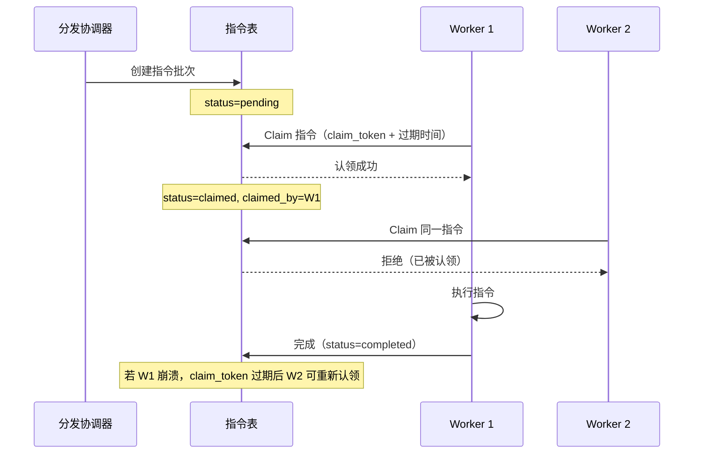

# 第 20 章 流程编排

> "把重复的最佳实践固化为可执行的流程。"

流程编排（Flow Orchestration）让 WinMatrix 能够将多步骤工作流定义为可复用的模板。大福的"项目启动流程"、小质的"代码评审流程"，都可以编排为 Flow，支持版本管理、DAG 执行和断点续跑。本章将深入流程模板、运行引擎和指令分发。

## 20.1 Flow 模板系统

流程编排领域位于 `src/business/domain/flowOrchestration/`（47 个文件），是 WinMatrix 最复杂的业务域之一。

### 数据模型

```prisma
// prisma/schema.prisma（第 647-727 行）
model flow_template {
  id               String   @id @default(uuid())
  projectId        String   @map("project_id")
  name             String
  description      String?
  category         String   @default("general")
  status           String   @default("draft")            // draft / published
  ownerId          String?  @map("owner_id")
  currentVersionId String?  @map("current_version_id")
  draftDefinitionJson Json? @map("draft_definition_json") // 草稿定义
  @@map("flow_template")
}

model flow_template_version {
  id               String   @id @default(uuid())
  templateId       String   @map("template_id")
  version          Int                                     // 版本号（递增）
  definitionJson   Json     @map("definition_json")        // 发布的定义
  inputSchemaJson  Json     @map("input_schema_json")      // 输入 Schema
  outputSchemaJson Json     @map("output_schema_json")     // 输出 Schema
  publishedBy      String?  @map("published_by")
  checksum         String                                   // 内容校验和
  @@map("flow_template_version")
}
```

### 草稿 vs 发布版本

Flow 模板采用**草稿-发布**双轨制：

- **draftDefinitionJson**：草稿状态，可自由编辑
- **flow_template_version**：发布版本，不可变，带版本号和 checksum

### 版本发布事务

版本发布在一个事务中完成（见第 4 章）：

```typescript
// src/infrastructure/persistence/repositories/FlowTemplateRepository.ts（第 191-219 行）
async publishVersion(params: PublishFlowTemplateVersionParams) {
  const checksum = createHash('sha256').update(JSON.stringify(parsed)).digest('hex');

  const version = await db.$transaction(async (tx) => {
    // 查最新版本号
    const latest = await tx.flow_template_version.findFirst({
      where: { templateId: params.templateId },
      orderBy: { version: 'desc' },
    });
    // 创建新版本（版本号 +1）
    const created = await tx.flow_template_version.create({
      data: {
        version: (latest?.version ?? 0) + 1,
        definitionJson: parsed,
        checksum,
        // ...
      },
    });
    // 更新模板的 currentVersionId 指针
    await tx.flow_template.update({ /* ... */ });
    return created;
  });
}
```

版本号在事务内基于查询递增——保证并发发布时版本号不冲突。`checksum` 用于检测定义是否实际变化（未变化则不需要新版本）。

## 20.2 Flow 运行引擎

### flow_run 模型

```prisma
// prisma/schema.prisma（第 689-727 行）
model flow_run {
  id                String   @id @default(uuid())
  projectId         String   @map("project_id")
  templateId        String   @map("template_id")
  templateVersionId String   @map("template_version_id")
  agentRunId        String?  @map("agent_run_id")       // 关联 Agent 运行
  triggerType       String   @map("trigger_type")        // 触发类型
  triggerPayload    Json     @default("{}") @map("trigger_payload")  // 触发负载
  status            String   @default("pending")
  duplicateKey      String?  @map("duplicate_key")       // 幂等键
  metadata          Json?
  @@map("flow_run")
}
```

### 事件溯源设计

`triggerType` + `triggerPayload` 体现了**事件溯源**思想——每次运行都记录触发原因和负载，支持审计和回放。

### 幂等性

`duplicateKey` 确保同一触发不会产生多个运行：

```typescript
// src/infrastructure/persistence/repositories/FlowRunRepository.ts
// 创建 run 前检查 duplicateKey
// 已存在则复用
```

### flow_step_run

```prisma
model flow_step_run {
  id               String   @id @default(uuid())
  flowRunId        String   @map("flow_run_id")
  stepId           String   @map("step_id")
  attempt          Int                                     // 尝试次数
  status           String                                   // 步骤状态
  @@unique([flowRunId, stepId, attempt])                   // 复合唯一键
}
```

每个步骤的每次尝试都有独立记录——支持重试追踪。

## 20.3 编排指令分发

Flow 的执行通过**指令（Instruction）**分发：

### 指令批次

```typescript
// src/infrastructure/persistence/repositories/FlowInstructionRepository.ts（第 19-62 行）
type BatchRow = {
  project_id: string;
  template_id: string;
  template_version_id: string;
  trigger_type: string;
  status: string;
  total_count: number;
  pending_count: number;
  running_count: number;
  completed_count: number;
  failed_count: number;
  skipped_count: number;
};

type InstructionRow = {
  batch_id: string;
  flow_run_id: string | null;
  agent_run_id: string | null;
  conversation_id: string | null;
  sequence_no: number;                 // 序列号
  instruction_json: unknown;            // 指令内容
  instruction_schema_version: number;   // Schema 版本
  checksum: string;
  idempotency_key: string;              // 幂等键
  claim_token: string | null;           // 认领令牌
  claim_expires_at: Date | null;        // 认领过期
  claimed_by: string | null;            // 认领者
  attempt: number;                      // 尝试次数
};
```

### Lease/Claim 模式

指令分发使用 **Lease/Claim** 模式实现分布式 Worker 协调：



关键设计：

1. **claim_token**：每个认领生成唯一令牌
2. **claim_expires_at**：认领有过期时间（Lease）
3. **claimed_by**：记录认领者
4. **attempt**：尝试次数，支持重试

如果 Worker 崩溃（claim 未释放），过期后其他 Worker 可以重新认领——这是一种**至少一次执行**的保证。

## 20.4 Flow 编排服务

`src/business/domain/flowOrchestration/` 包含 47 个文件，按功能分组：

### 模板管理

- `FlowTemplateValidationService.ts` - 模板验证
- `FlowTemplateContractCompiler.ts` - 契约编译
- `FlowTemplateVersionDiffService.ts` - 版本差异
- `FlowTemplateTargetScopeValidationService.ts` - 目标范围验证

### 运行生命周期

- `FlowOrchestrationStartService.ts` - 启动服务
- `FlowRunInstantiationService.ts` - 实例化
- `FlowRunManualStartService.ts` - 手动启动
- `FlowRunDiagnosticService.ts` - 诊断
- `FlowRuntimeMetricsService.ts` - 运行时指标

### 步骤执行

- `FlowDirectStepAdapter.ts` - 直接步骤适配器
- `FlowStepOutputCaptureService.ts` - 输出捕获
- `FlowStepSemanticJudgeLedgerService.ts` - 语义判定
- `FlowStepStateSynchronizationService.ts` - 状态同步
- `FlowTransitionRerunService.ts` - 重跑转换

### 协调

- `FlowCheckpointGatePublisher.ts` - 检查点门控
- `CoordinatorGateTimeoutScanner.ts` - 门控超时扫描
- `FlowConnectorRegistry.ts` - 连接器注册表

## 20.5 开放工作流检查点

Flow 支持开放检查点（Open Workflow Checkpoint）——允许在特定步骤暂停，等待外部输入：

```typescript
// src/infrastructure/persistence/repositories/FlowRunRepository.ts
// FlowOpenWorkflowCheckpointStepRun - 开放检查点步骤运行
```

这支持人机协作场景——流程执行到某个节点时暂停，等待人类审批后继续。

## 20.6 DAG 可视化

Flow 模板使用 Coordinator DAG（有向无环图）定义步骤依赖：

```typescript
// src/infrastructure/persistence/repositories/FlowTemplateRepository.ts（第 74 行）
const FLOW_TEMPLATE_COORDINATOR_DAG_COMPILER_VERSION = 2;
```

DAG 编译器版本固定为 2，确保模板定义的兼容性。前端使用 Vue Flow 可视化展示 DAG 结构。

## 20.7 连接器系统

Flow 通过连接器与外部系统集成：

```typescript
// src/business/domain/flowOrchestration/connectors/
// FlowConnectorRegistry.ts - 连接器注册表
// FlowConnectorTypes.ts   - 连接器类型
```

连接器允许 Flow 步骤调用外部服务（如 TFS、企微、邮件），扩展 Flow 的能力边界。

## 本章小结

本章深入分析了 WinMatrix 的流程编排系统：

1. **草稿-发布双轨**：draftDefinitionJson（草稿）+ flow_template_version（发布，不可变）
2. **版本发布事务**：事务内版本号递增 + checksum 检测变化
3. **事件溯源**：triggerType + triggerPayload 记录触发原因
4. **幂等性**：duplicateKey 防止重复运行
5. **步骤追踪**：flow_step_run + 复合唯一键（flowRunId + stepId + attempt）
6. **Lease/Claim 分发**：claim_token + 过期时间 + claimed_by，至少一次执行
7. **47 个编排服务**：模板管理、运行生命周期、步骤执行、协调
8. **开放检查点**：支持人机协作暂停
9. **DAG 可视化**：Coordinator DAG + Vue Flow 前端展示
10. **连接器系统**：扩展 Flow 与外部系统集成

在下一章中，我们将进入集成层，分析企业微信集成。
