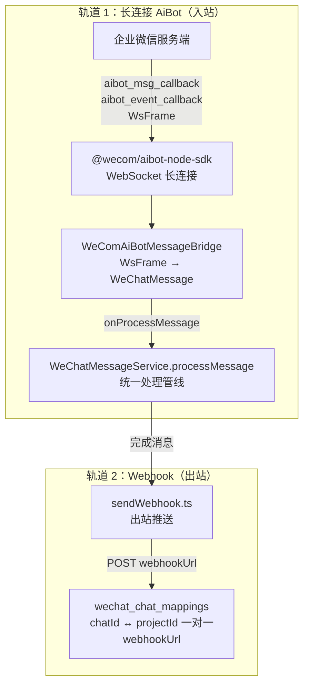
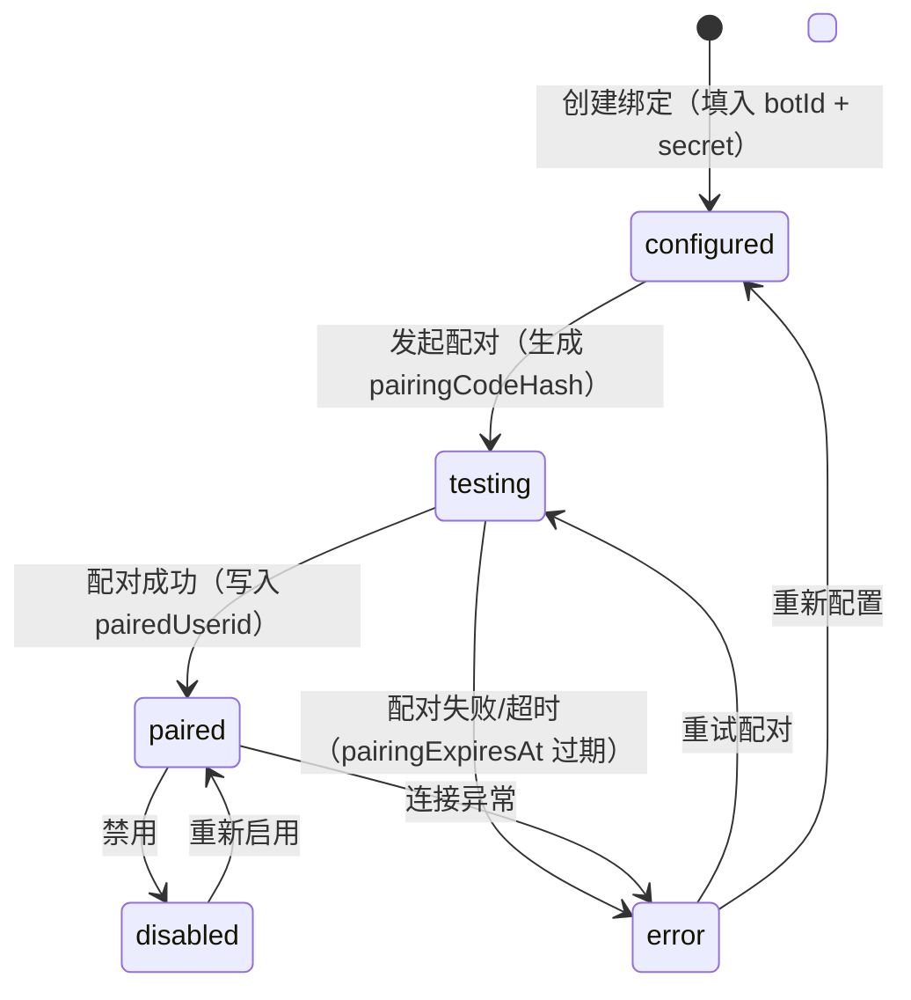

# 第 21 章 企业微信集成

> "让 AI 走进员工日常使用的沟通工具。"

企业微信（WeCom）集成是 WinMatrix 连接企业协作场景的关键桥梁。它不只是 OAuth 登录那么简单——WinMatrix 通过**双轨接入**（长连接 AiBot + Webhook）把企微群聊变成数字员工的工作现场：员工在群里 @数字员工，数字员工响应；数字员工完成后主动推消息到群。这背后涉及长连接消息桥接、群聊自动发现、微文档登记、绑定状态机、分服务封装的企微 API。

本章从双轨接入的架构出发，逐层拆解这些机制。

## 21.1 双轨接入：长连接 AiBot + Webhook

WinMatrix 接入企业微信有两条并行的轨道，各有各的场景和能力：



### 轨道 1：长连接 AiBot（入站消息）

长连接 AiBot 负责接收企微群里的消息。`@wecom/aibot-node-sdk` 维护一条到企微服务端的 WebSocket 长连接，企微把群消息（`aibot_msg_callback`）和事件（`aibot_event_callback`）作为 `WsFrame` 推过来。

### 轨道 2：Webhook（出站推送）

Webhook 负责把数字员工的消息推回企微群。`wechat_chat_mappings` 表记录了 chatId 对应的 `webhookUrl`，`sendWebhook.ts` 通过这个 URL 把消息 POST 回去。

两条轨道分工明确：**长连接收消息，Webhook 发消息**。为什么不都用长连接？因为企微的 AiBot 长连接主要用于接收（被动响应），主动往群里推消息用 Webhook 更直接。双轨设计让收发各走最适合的通道。

## 21.2 AiBot 长连接消息桥接

`WeComAiBotMessageBridge` 是长连接这条轨的核心——它把 SDK 的 `WsFrame` 转成统一的 `WeChatMessage` 格式，复用已有的 `WeChatMessageService.processMessage` 管线。

```typescript
// src/interface/channel/channels/wecom-aibot/aibot/WeComAiBotMessageBridge.ts（第 1-74 行）
/**
 * 企微智能机器人长连接消息桥接
 *
 * 将 SDK 的 WsFrame（aibot_msg_callback / aibot_event_callback）转为已有的 WeChatMessage 格式，
 * 复用 WeChatMessageService.processMessage() 管线。
 */
import type { WsFrame, BaseMessage, EventMessage, EventMessageWith, EnterChatEvent } from '@wecom/aibot-node-sdk';
import { EventType } from '@wecom/aibot-node-sdk';

/** 处理转换后消息的回调类型 */
export type AiBotProcessedMessageHandler = (params: {
  digitalEmployeeId: string;
  botId: string;
  msgid: string;
  content: string;
  fromUserid: string;
  chatid?: string;
  chattype: 'single' | 'group';
  reqId: string;
}) => Promise<void>;

export class WeComAiBotMessageBridge {
  /**
   * 处理消息回调（aibot_msg_callback）
   */
  async handleMessage(frame: WsFrame<BaseMessage>): Promise<void> {
    const body = frame.body;
    if (!body) return;

    try {
      logger.info({
        botId: body.aibotid,
        msgid: body.msgid,
        reqId: frame.headers.req_id,
        chattype: body.chattype,
        chatid: body.chatid ?? null,
        fromUserid: body.from.userid,
        msgtype: body.msgtype,
      }, '[AiBotBridge] 收到消息回调');
      const content = this.extractTextContent(body);

      await this.options.onProcessMessage({
        digitalEmployeeId: this.client.digitalEmployeeId,
        botId: body.aibotid,
        msgid: body.msgid,
        content,
        fromUserid: body.from.userid,
        chatid: body.chatid,
        chattype: body.chattype,
        reqId: frame.headers.req_id,
      });
    } catch (error) {
      logger.error(`[AiBotBridge] 处理消息失败: msgid=${body.msgid}, error=${getErrorMsg(error)}`);
    }
  }
}
```

### 设计要点：转格式复用管线

这段桥接代码的核心价值不在"解析 WsFrame"本身，而在于 **"转格式 → 复用 processMessage 管线"** 这个设计。

`WeChatMessageService.processMessage` 是一条成熟的、经过验证的消息处理管线——它处理消息路由、会话归属、Agent 触发、回复生成等一整套逻辑。如果 AiBot 不复用这条管线，就得自己重写一遍，迟早会和 Webhook 轨的处理逻辑漂移。

`WeComAiBotMessageBridge` 做的就是把 SDK 特有的 `WsFrame<BaseMessage>` 结构（带 `aibotid / msgid / chatid / chattype / from.userid` 等企微专有字段）翻译成一个中性的 `(digitalEmployeeId, botId, msgid, content, fromUserid, chatid, chattype, reqId)` 回调参数。一旦翻译完成，后续全走统一管线。**适配器模式：把外部协议的差异收敛在桥接层，核心管线只认统一格式。**

### 事件处理

`handleEvent` 处理企微事件回调（进入会话、模板卡片、用户反馈、断连）：

```typescript
// WeComAiBotMessageBridge.ts（第 79-109 行）
async handleEvent(frame: WsFrame<EventMessage>): Promise<void> {
  const body = frame.body;
  if (!body?.event) return;
  const eventType = body.event.eventtype;

  switch (eventType) {
    case EventType.EnterChat:
      await this.handleEnterChat(frame as WsFrame<EventMessageWith<EnterChatEvent>>);
      break;
    case EventType.TemplateCardEvent:
      logger.info(`[AiBotBridge] 模板卡片事件: reqId=${frame.headers.req_id}`);
      break;
    case EventType.FeedbackEvent:
      logger.info(`[AiBotBridge] 用户反馈事件: reqId=${frame.headers.req_id}`);
      break;
    case EventType.Disconnected:
      logger.warn(`[AiBotBridge] 收到 disconnected_event，连接将被服务端断开`);
      break;
    default:
      logger.info(`[AiBotBridge] 未知事件类型: ${eventType}`);
  }
}
```

其中 `EnterChat`（进入会话）会触发欢迎语回复，`Disconnected` 是断连警告（连接将被服务端断开，需要重连）。不同事件类型有不同处理，未知事件类型记日志不崩——**对未知事件保持宽容，是集成层健壮性的要求**（企微可能随时新增事件类型）。

### 多消息类型提取

`extractTextContent` 从不同消息类型（text/voice/image/file/video/mixed）里提取文本内容：

```typescript
// WeComAiBotMessageBridge.ts（第 134-167 行）
private extractTextContent(body: BaseMessage): string {
  const msgType = body.msgtype;
  switch (msgType) {
    case 'text': {
      const content = this.extractTextFromRecord(data);
      // ... 缺少文本字段时告警
      return content;
    }
    case 'voice': return voice?.content ?? '[语音消息]';
    case 'image': return '[图片消息]';
    case 'file': return '[文件消息]';
    case 'video': return '[视频消息]';
    case 'mixed': return '[图文混排消息]';
    default: return `[${msgType}消息]`;
  }
}
```

非文本消息统一转成 `[xx消息]` 占位符——这让下游管线能统一处理"内容"而不用区分类型。语音消息会尝试提取识别文本（`voice.content`），提取不到才用占位符。

## 21.3 群聊自动发现

一个新群拉数字员工进来时，系统不知道这个群对应哪个项目。WinMatrix 的做法是**自动发现 + 人工补全**。

### discovered_wechat_chats：待配置群

```prisma
// discovered_wechat_chats（已发现但未配置的群聊，真实字段）
model discovered_wechat_chats {
  chatId       String   @id
  projectId    String?                          // 尚未映射时为空
  lastSeenAt   DateTime @map("last_seen_at")
  firstMessage String?  @map("first_message")   // 群里收到的第一条消息
}
```

当一个未知群的第一条消息到达时，系统不会拒绝它，而是把它登记到 `discovered_wechat_chats`——记录 `chatId`、`firstMessage`（第一条消息内容，帮助管理员判断这个群是干什么的）、`lastSeenAt`（最近活跃时间）。

### wechat_chat_mappings：正式映射

```prisma
// wechat_chat_mappings（正式映射表，真实字段）
model wechat_chat_mappings {
  chatId            String   @id                 // 主键即 chatId
  projectId         String                        // 与 projects 一对一
  webhookUrl        String?  @map("webhook_url")
  projectWebhookUrl String?  @map("project_webhook_url")
}
```

管理员在 UI 上看到 `discovered_wechat_chats` 里的待配置群，根据 `firstMessage` 判断它属于哪个项目，补全 `chatId → projectId` 的映射，写入 `wechat_chat_mappings`。**主键 chatId，与 projects 一对一**——一个群只对应一个项目。

这是一个很实用的"渐进式配置"模式：**先把未知的东西暂存起来，等人工确认后再升级为正式配置**。比"未知群直接拒绝"友好得多——群里的人不需要知道"哦要先去配置"，他们只管发消息，管理员会在后台看到并完成映射。

## 21.4 微文档登记：API docid vs 浏览器 pad_id

数字员工经常需要创建和操作企微文档（Wedoc）。这里有一个隐蔽但致命的坑：**企微文档有两个 ID**。

### WecomConversationWedocDoc 模型

```prisma
// WecomConversationWedocDoc（真实字段）
// 注释：create_doc 返回的 API docid；非浏览器 pad_id
model WecomConversationWedocDoc {
  conversationId      String
  docid               String                  // 只存 API docid
  url                 String
  docName             String
  docType             String
  projectId           String?
  digitalEmployeeId   String?
  agentId             String?
}
```

注释里那句 **"create_doc 返回的 API docid；非浏览器 pad_id"** 是关键。企微文档在浏览器里打开时，URL 里的 ID 是 `pad_id`（形如 `e3_xxx` 或 `w3_xxx`），但通过 API 创建文档时返回的是 `docid`——这两个 ID 不一样！

如果你把浏览器的 `pad_id` 存进 DB，后续想通过 API 操作这个文档时会失败——因为 API 只认 `docid`。`WecomConversationWedocDoc` 只存 `create_doc` API 返回的 `docid`，**保证文档记录是可程序化访问的**。

这是一个真实踩过的坑才有的设计——注释里特意标注"非浏览器 pad_id"，说明有人踩过这个雷。**集成第三方系统时，永远要搞清楚"用户可见的 ID"和"API 可用的 ID"是不是同一个**，经常不是。

## 21.5 绑定状态机：五态 + 配对码

企微 AiBot 需要绑定到具体的 WinMatrix 用户才能工作。绑定过程是一个有状态的流程，由 `UserWecomAibotBinding` 记录。

### UserWecomAibotBinding（interface，非独立模型）

需要特别说明（核实报告的重要更正）：**`UserWecomAibotBinding` 不是 Prisma 的独立模型，而是一个 interface**，定义在 `UserChannelRegistrationRepository.ts` 里：

```typescript
// src/infrastructure/persistence/repositories/UserChannelRegistrationRepository.ts（第 34-49 行）
export type WecomBindingStatus = 'configured' | 'testing' | 'paired' | 'error' | 'disabled';

export interface UserWecomAibotBindingRecord {
  id: string;
  ownerUserId: string;
  botId: string;
  secretCiphertext: string;                  // 加密的 bot secret
  pairedUserid: string | null;               // 配对成功的企微 userid
  status: WecomBindingStatus;
  pairingCodeHash: string | null;            // 配对码哈希
  pairingExpiresAt: Date | null;             // 配对码过期时间
  lastError: string | null;
  lastConnectedAt: Date | null;
  createdAt: Date;
  updatedAt: Date;
}
```

这个 interface 描述的数据可能物化在一张通道注册表里（和 `UserChannelRegistrationRecord` 在同一个仓储文件），而不是独立的 Prisma model。不要被名字误导——**在 WinMatrix 里，名为 `XxxBinding` / `XxxRecord` 的不一定都是独立的 Prisma model**，要先查 schema.prisma 或 generated/models 确认。

### 五态状态机



五态 `configured / testing / paired / error / disabled`：

- **configured**：已配置 botId 和 secret（加密），但还没验证。
- **testing**：发起配对，生成了配对码（`pairingCodeHash`），等企微那边确认。
- **paired**：配对成功，`pairedUserid` 已写入，AiBot 可正常工作。
- **error**：配对失败或连接异常，`lastError` 记录原因。
- **disabled**：手动禁用。

### 配对码 + secret 加密

两个安全相关的字段：

- **`secretCiphertext`**：bot 的 secret 是加密存储的（Ciphertext 后缀表明是密文）。明文 secret 不会落库——解密在运行时按需进行，注入到工具上下文。这是凭据管理的基本原则（见第 4 章 Repository 的 encrypt 调用）。
- **`pairingCodeHash` + `pairingExpiresAt`**：配对码只存哈希（不存明文，防止库泄露后配对码被复用），且有过期时间（`pairingExpiresAt`，过期后配对码失效，需重新生成）。**配对码是一次性、短生命周期、哈希存储**——这是配对流程的安全三件套。

## 21.6 企微 API 分服务封装

企微的 API 覆盖了通讯录、消息、文件、媒体、日程、文档等多个域，WinMatrix 把它们拆成 7 个独立服务，各自封装：

```
src/integration/connectors/wechat/
├── WeComAccessTokenProvider.ts    # Token 服务（access_token 获取与缓存）
├── WeComAppMessageService.ts      # 应用消息服务（主动推送）
├── WeComContactService.ts         # 通讯录服务（用户/部门查询）
├── WeComFileService.ts            # 文件服务
├── WeComMediaService.ts           # 媒体服务（图片/视频/语音上传）
├── WeComScheduleService.ts        # 日程服务
├── WeComWedocService.ts           # 微文档服务（create_doc/list/get...）
├── constants.ts                   # 常量
└── index.ts                       # 统一导出
```

### 为什么分服务封装

为什么不写一个巨大的 `WeComService` 包揽一切？因为企微不同域的 API 差异很大——通讯录是查询为主、微文档是 CRUD、媒体是上传下载、日程有日历概念。把它们揉在一起会产生一个臃肿的"上帝服务"，每次改一处都要加载整个模块。

分服务封装的好处：

1. **按需加载**：只用到通讯录的模块不依赖微文档服务。
2. **独立演进**：微文档 API 变了，只改 WeComWedocService，不影响其他。
3. **测试隔离**：mock 通讯录不需要 mock 媒体上传。
4. **职责清晰**：每个服务只对一类企微 API 负责。

### WeComAccessTokenProvider：access_token 缓存

所有企微 API 调用都需要 `access_token`，这个 token 有有效期。`WeComAccessTokenProvider` 负责获取和缓存 access_token：

```typescript
// src/infrastructure/auth/WeChatOAuthService.ts（access_token 缓存模式）
private accessTokenCache: { token: string; expiresAt: number } | null = null;
```

缓存 token 并记录过期时间，避免每次 API 调用都重新获取。这是集成第三方 API 的标配优化——token 类凭据要缓存，但要注意缓存的失效策略（token 可能被服务端提前失效）。

## 21.7 OAuth 认证与编码陷阱

企微的扫码登录（OAuth）有几个真实的编码陷阱，值得记录：

### redirect_uri 的二次编码陷阱

```typescript
// src/infrastructure/auth/WeChatOAuthService.ts
/**
 * 生成企业微信扫码登录 URL (PC端)
 */
generateQrConnectUrl(state?: string): string {
  // 注意：不要对 redirect_uri 预先 encodeURIComponent
  // URLSearchParams.toString() 会统一编码，否则会二次编码导致企业微信返回「参数错误」
  const params = new URLSearchParams({
    appid: this.config.corpId,
    agentid: this.config.agentId,
    redirect_uri: this.config.redirectUri,    // 不预先编码！
    state: state || '',
    login_type: 'CorpApp',
  });
  // ...
}
```

注释里的警告是真实踩坑的结晶：**`redirect_uri` 不能预先 `encodeURIComponent`**，因为 `URLSearchParams.toString()` 会再次编码，导致二次编码。企微收到二次编码的 URL 会返回"参数错误"。

这种"编码套娃"陷阱在集成第三方系统时很常见——每一层都可能做一次编码，多层叠加就会过度编码。注释把踩坑原因和规避方法写清楚，对后续维护者极有价值。

### iframe 跨域处理

企微工作台通常在 iframe 中嵌入应用，OAuth 回调需要特殊处理：

```typescript
// src/interface/api/auth.ts
function renderWechatRedirectHtml(relativePath: string, targetBasePath = basePath): string {
  // 使用 window.top.location.href 逃逸 iframe
  // 避免 iframe 跨域 302 跳转问题
}
```

iframe 里的 302 跳转会受跨域限制——iframe 想跳到企微的 OAuth 页，但企微域名和 iframe 父页面不同源，浏览器会拦截。解法是用 `window.top.location.href` 让最外层页面跳转，逃逸 iframe 的跨域限制。

## 21.8 命令系统与消息去重

### 斜杠命令

企微 AiBot 支持斜杠命令：

| 命令 | 功能 | 实现文件 |
|------|------|---------|
| `/bind` | 绑定企微账号 | `BindWecomCommand.ts` |
| `/bindproject` | 绑定项目聊天 | `BindProjectChatCommand.ts` |
| `/agents` | 列出可用 Agent | `ListAgentsCommand.ts` |
| `/run` | 运行指定 Agent | `RunAgentCommand.ts` |
| `/whoami` | 查看当前身份 | `WhoamiCommand.ts` |

命令系统让用户能在企微里直接操作——不用打开 Web 界面，发个 `/run 大福 分析需求` 就能触发。

### 消息去重与 Markdown 截断

企微消息投递是**至少一次（at-least-once）**语义——同一条消息可能被推送多次。`WecomMessageDedupStore` 通过消息 ID 去重，避免重复处理。

企微消息还有长度限制，长 Markdown 内容需要截断（`wecomMarkdownTruncate.ts`）。这些边界处理看似琐碎，但少了任何一个都会在生产环境翻车——要么重复响应让用户困惑，要么消息被截断后语义破碎。

## 21.9 AiBot 通道架构全景

`src/interface/channel/channels/wecom-aibot/` 是企微 AiBot 的完整通道实现，内部按职责进一步拆分：

```
src/interface/channel/channels/wecom-aibot/
├── aibot/                    # 核心通道层
│   ├── WeComAiBotChannel.ts        # 通道主类（生命周期管理）
│   ├── WeComAiBotClient.ts         # SDK 客户端封装
│   ├── WeComAiBotManager.ts        # 多 Bot 管理器
│   ├── WeComAiBotMessageBridge.ts  # 消息桥接（WsFrame → WeChatMessage）
│   ├── WeComAiBotPushQueue.ts      # 推送队列（出站消息排队）
│   └── WeComAiBotConfigBus.ts      # 配置总线（动态加载 Bot 配置）
├── commands/                 # 斜杠命令处理
│   ├── BindProjectChatCommand.ts
│   ├── BindWecomCommand.ts
│   ├── ListAgentsCommand.ts
│   ├── RunAgentCommand.ts
│   └── WhoamiCommand.ts
├── context/                  # 上下文管理
│   ├── WeComContextStore.ts
│   └── WeComPrivateProjectContextStore.ts
└── (其他): WeChatMessageService.ts, WeChatUserMappingService.ts,
          WeComBindingService.ts, messageTypes.ts, sendWebhook.ts,
          WecomMessageDedupStore.ts, wecomMarkdownTruncate.ts
```

这个目录结构体现了通道层的几个关注点分离：

- **aibot/**：与 SDK 的直接交互——长连接管理、帧解析、消息桥接。这是最贴近企微协议的一层。
- **commands/**：斜杠命令的独立处理器——每个命令一个文件，互不干扰。新增命令只需加一个文件。
- **context/**：企微上下文管理——会话上下文、私有项目上下文。不同群/单聊的上下文隔离在这里保证。

### WeComAiBotManager：多 Bot 管理

一个企业可能配置了多个 AiBot（比如不同部门各一个）。`WeComAiBotManager` 管理这些 Bot 的生命周期——每个 Bot 有自己的 `digitalEmployeeId`，独立的长连接，独立的消息处理。`WeComAiBotMessageBridge` 在处理消息时通过 `this.client.digitalEmployeeId` 标识"这条消息是给哪个 Bot 的"，避免跨 Bot 串消息。

### WeComAiBotConfigBus：动态配置

`WeComAiBotConfigBus` 负责动态加载 Bot 的配置——Bot 的 secret、绑定的数字员工等信息可能随时变更（管理员在 UI 上改了配置），ConfigBus 让这些变更能热生效，不需要重启通道。这和第 22 章的 MCP 服务热加载、全书事实清单里提到的"配置热更新走 PG LISTEN/NOTIFY"是同一套机制的不同应用。

## 21.10 用户映射与上下文隔离

### WeChatUserMappingService

```typescript
// WeChatUserMappingService.ts
// 企业微信用户 ID ↔ WinMatrix 用户的映射
// OAuth 登录时自动建立
// 支持手动绑定（createUserSchema 的 wechatUserId 字段）
```

企微用户和 WinMatrix 用户是两套身份体系——企微有企微的 userid，WinMatrix 有自己的用户体系。`WeChatUserMappingService` 维护这两者的映射。映射在 OAuth 登录时自动建立（用户扫码登录，系统拿到企微 userid，和 WinMatrix 账号关联），也支持管理员手动绑定（在创建用户时填 wechatUserId）。

这个映射是权限的基础——企微群里 @数字员工时，系统要通过映射知道"这个企微用户在 WinMatrix 里是谁"，才能判断他有权触发哪些 Agent、访问哪些项目。

### WeComPrivateProjectContextStore

`WeComPrivateProjectContextStore` 处理一种特殊场景——单聊（非群聊）里的上下文。单聊没有 chatId→projectId 的群映射，但用户可能在单聊里同时讨论多个项目。这个 Store 维护"这个企微用户在单聊里的当前项目上下文"，让 Agent 知道"用户现在说的这句话是关于哪个项目的"。这种"无显式标识时的隐式上下文推断"，是聊天式交互区别于表单式交互的关键挑战。

## 21.11 企微业务工具的注册

WinMatrix 提供的企微业务工具最终都注册进统一的 ToolRegistry，供数字员工按权限调用。注册入口在各工具域的 index.ts 里：

### 企微联系人工具（3 个）

```typescript
// src/business-tools/wecom-contact/index.ts（第 14-18 行）
export function registerTools(registry: IToolRegistry): void {
  registry.register(new WeComContactGetUserTool());
  registry.register(new WeComContactListDepartmentUsersSimpleTool());
  registry.register(new WeComContactListDepartmentUsersDetailTool());
}
```

### 企微文档工具（13 个）

```typescript
// src/business-tools/wecom-document/index.ts（第 45-59 行）
export function registerTools(registry: IToolRegistry): void {
  // Wedoc 文档操作
  registry.register(new WeComCreateWedocTool());
  registry.register(new WeComListConversationWedocDocsTool());
  registry.register(new WeComRenameWedocTool());
  registry.register(new WeComGetWedocBaseInfoTool());
  registry.register(new WeComGetWedocAuthTool());
  registry.register(new WeComGetWedocDocumentTool());
  registry.register(new WeComBatchUpdateWedocDocumentTool());
  // SmartSheet 智能表格
  registry.register(new WeComSmartSheetGetSheetTool());
  registry.register(new WeComSmartSheetGetFieldsTool());
  registry.register(new WeComSmartSheetGetRecordsTool());
  registry.register(new WeComSmartSheetAddRecordsTool());
  // Spreadsheet 传统表格
  registry.register(new WeComSpreadsheetGetSheetPropertiesTool());
  registry.register(new WeComSpreadsheetGetSheetRangeDataTool());
}
```

注意企微文档工具分三类：Wedoc 文档（7 个）、SmartSheet 智能表格（4 个）、Spreadsheet 传统表格（2 个）。三类对应企微文档的三种形态，各有独立的 API 集。`WeComListConversationWedocDocsTool` 就是查询 21.4 节那个 `WecomConversationWedocDoc` 表的工具——它只会列出通过 API 创建的文档（docid），不会列出浏览器的 pad_id 文档。

### 企微日程工具（6 个）

```typescript
// src/business-tools/wecom-schedule/index.ts（第 20-27 行）
export function registerTools(registry: IToolRegistry): void {
  registry.register(new WeComScheduleAddTool());
  registry.register(new WeComScheduleUpdateTool());
  registry.register(new WeComScheduleGetTool());
  registry.register(new WeComScheduleDeleteTool());
  registry.register(new WeComScheduleListByCalendarTool());
  registry.register(new WeComCalendarGetTool());
}
```

这些工具让数字员工能帮用户管理日程——"帮我约一个明天下午 3 点的评审会"这样的指令，Agent 通过日程工具在企微里创建日程事件。工具背后调用的就是 21.6 节的 `WeComScheduleService`。

## 21.12 设计权衡：为什么用双轨而不是单长连接

回头看双轨设计（长连接 AiBot + Webhook），一个自然的问题是：为什么不都用长连接？长连接不是更"实时"吗？

分开的原因在于**企微的能力边界**：

- **AiBot 长连接**主要用于**入站**（接收消息回调）。它的出站能力（主动推消息）受企微限制——不是所有场景都支持，且格式受限。
- **Webhook** 是企微群原生支持的**出站**通道——往群的 webhookUrl POST 消息，群成员立即收到。它简单、可靠、不受 Bot 状态影响。

如果全用长连接，主动推消息的能力受限于 SDK 的出站 API，且 Bot 掉线时推消息会失败。双轨让出站走 Webhook（不依赖 Bot 在线），入站走长连接（实时接收）——**各走最强的通道**。

代价是要维护两条轨的消息格式一致性——WeComAiBotMessageBridge 的存在就是为了让入站消息收敛到统一格式，和出站走同一条 processMessage 管线。**双轨的复杂性主要在格式桥接层，而桥接层是可控的。**

## 21.13 消息格式与 Markdown 处理

### messageTypes：统一消息类型

`messageTypes.ts` 定义了通道内部统一的 WeChatMessage 格式——无论消息来自 AiBot 长连接（WsFrame）还是 Webhook，最终都归一化到这个格式。它是 WeComAiBotMessageBridge 和 sendWebhook 之间的"通用语"——入站翻译成它，出站也基于它构造。统一格式让上下游处理逻辑可以复用，不需要为每条轨写一套。

### wecomMarkdownTruncate：长内容截断

企微消息有严格的长度限制——单条文本消息不能超过 2048 字节，Markdown 消息也有上限。但数字员工生成的内容（如完整的 PRD、详细的代码评审）动辄上万字。`wecomMarkdownTruncate.ts` 负责在这种情况下的优雅截断：

- 不是简单地在字节上限处一刀切（会截断 UTF-8 多字节字符，产生乱码）。
- 而是按 Markdown 结构（段落、代码块）在安全边界截断。
- 截断后追加提示（如"内容过长，已截断，完整内容请见xxx"），让用户知道这是不完整的。

**消息截断看似是个小工具，但在生产环境里它是"能用"和"好用"的分水岭。** 没有它，用户会收到乱码或残缺的消息；有了它，用户至少知道"内容被截了，去哪看完整的"。

### WeComAiBotPushQueue：出站消息排队

`WeComAiBotPushQueue` 是出站消息的排队缓冲。数字员工可能在短时间内生成多条消息（如先发一条"分析完成"，再发详细结果），如果不排队直接发，可能触发企微的速率限制。PushQueue 让出站消息有序、限速地发送，避免被企微限流。

这和第 22 章 external-agent 的 `ExternalAgentWsRateLimiter` 是同一个原则的不同应用——**对外部系统的调用永远要考虑速率限制，无论方向是进还是出。**

## 21.14 集成层的安全考量

企微集成涉及大量敏感操作——读取企业通讯录、发送应用消息、操作微文档。WinMatrix 在这层的安全设计值得总结：

1. **secret 加密存储**：Bot secret 以 `secretCiphertext`（密文）形式落库，明文只在运行时按需解密。这是凭据管理的基本原则。
2. **配对码哈希 + 短生命周期**：`pairingCodeHash` 只存哈希，`pairingExpiresAt` 限定有效期。即使 DB 泄露，攻击者拿到的也只是过期的哈希。
3. **access_token 缓存隔离**：企微 access_token 缓存在服务端进程内，不下发到客户端，避免被截获。
4. **用户映射的权限校验**：企微 userid 通过映射找到 WinMatrix 用户后，仍要校验该用户对目标项目/Agent 的权限——映射不等于授权。
5. **iframe 跨域的安全边界**：OAuth 回调用 `window.top.location.href` 逃逸 iframe，既解决了跨域跳转问题，也避免了 iframe 内被嵌套钓鱼的可能。

**集成层是系统安全边界最脆弱的地方——它直接面向外部系统，协议复杂、凭据多、权限交叉。** 每一个安全考量都不是可有可无的装饰，而是防止真实攻击的必需品。

## 21.15 WeChatMessageService：统一处理管线

前面多次提到 `WeChatMessageService.processMessage` 是统一处理管线，值得把它到底是什么说清楚。

无论消息来自 AiBot 长连接（经 WeComAiBotMessageBridge 翻译）还是 Webhook，最终都进入 `WeChatMessageService.processMessage`。这条管线负责：

1. **消息归属**：确定这条消息属于哪个会话（新建或复用 conversationId）、哪个项目（通过 chatId→projectId 映射）、哪个用户（通过 userid 映射）。
2. **去重**：通过 msgid 去重（WecomMessageDedupStore），防止企微的至少一次投递导致重复处理。
3. **触发 Agent**：根据消息内容（是否 @了某数字员工、是否是斜杠命令）决定触发哪个 Agent、走哪种执行模式。
4. **回复生成与推送**：Agent 的回复通过 WeComAiBotPushQueue（长连接出站）或 sendWebhook（Webhook 出站）推回企微。

这条管线是双轨接入的"合流点"——两条轨的消息在这里合二为一，走同一套处理逻辑。**双轨的复杂性在"入站收集"和"出站推送"两端，中间的处理是统一的。** 这种"两端复杂、中间统一"的结构，让核心的业务逻辑（触发谁、怎么回复）只需要写一套，维护成本可控。

### 上下文存储

```typescript
// WeComContextStore.ts
// 企微会话上下文存储：维护企微群/单聊里的会话状态
// WeComPrivateProjectContextStore.ts
// 私有项目上下文：单聊场景下用户当前关注的项目
```

两个 ContextStore 维护企微场景下的会话状态——群聊的上下文（这个群对应哪个项目、当前在做什么任务）和单聊的私有项目上下文（用户没明说时，默认这个单聊是关于哪个项目的）。这些上下文让 Agent 在企微场景下的回复能"知道用户在说什么"，而不是每次都要用户重新解释。

## 本章小结

本章深入分析了 WinMatrix 的企业微信集成：

1. **双轨接入**：长连接 AiBot（入站，`@wecom/aibot-node-sdk` 的 `aibot_msg_callback`/`aibot_event_callback` WsFrame）+ Webhook（出站，`wechat_chat_mappings.webhookUrl` + `sendWebhook.ts`）。**WeComAiBotMessageBridge 把 WsFrame 转统一 WeChatMessage 复用 processMessage 管线**——适配器模式把协议差异收敛在桥接层。
2. **群聊自动发现**：`discovered_wechat_chats` 暂存待配置群（firstMessage/lastSeenAt），UI 补全 chatId→projectId 映射后写入 `wechat_chat_mappings`（主键 chatId，与 projects 一对一）。渐进式配置，比直接拒绝友好。
3. **微文档登记区分 API docid 与浏览器 pad_id**：`WecomConversationWedocDoc` 只存 create_doc 返回的 API docid，**非 e3_/w3_ pad_id**，保证可程序化访问——注释标注是踩坑教训。
4. **绑定状态机五态**：configured/testing/paired/error/disabled + `pairingCodeHash`/`pairingExpiresAt` 配对码（哈希存储、短生命周期）+ `secretCiphertext` 加密。**UserWecomAibotBinding 是 interface 不是独立 Prisma model**，定义在 UserChannelRegistrationRepository.ts。
5. **企微 API 分服务封装**：integration/connectors/wechat/ 下 7 个独立服务（Token/AppMessage/Contact/File/Media/Schedule/Wedoc），按需加载、独立演进、测试隔离。
6. **OAuth 与编码陷阱**：redirect_uri 不能预先 encodeURIComponent（URLSearchParams 会二次编码）；iframe 跨域用 window.top.location.href 逃逸。
7. **斜杠命令 + 消息去重 + Markdown 截断**：至少一次投递语义下的工程边界处理。

在下一章中，我们将进入 MCP 协议与外部 Agent——看 WinMatrix 如何通过外部 Agent = 虚拟数字员工的抽象、MCP 服务热加载、分布式 Owner 路由，把能力无限延伸到企业边界之外。
