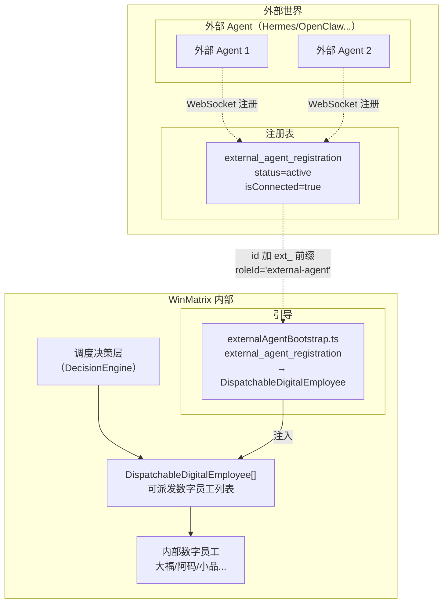

# 第 22 章 MCP 与外部 Agent

> "开放协议让 AI 平台的能力无限延伸。"

如果说前面 21 章讲的都是 WinMatrix"内部"的能力——数字员工、技能、工具、流程，那么本章讲的是 WinMatrix 如何把能力**延伸到边界之外**。这通过两个机制实现：MCP（Model Context Protocol）让 WinMatrix 同时是工具的提供者（内部工具暴露给外部）和消费者（接入外部 MCP 服务）；外部 Agent 注册让 Hermes/OpenClaw 等第三方 Agent 以"虚拟数字员工"的身份参与任务分配。

本章的核心是一个看似简单实则精妙的抽象——**外部 Agent = 虚拟数字员工**。围绕这个抽象，会展开物理计算机抽象、项目级熔断、MCP 多租户、分布式 Owner 路由、生命周期全观测等一整套工程机制。

## 22.1 核心抽象：外部 Agent = 虚拟数字员工

这是整个外部 Agent 集成的奠基性设计。先把架构图看清楚：



### externalAgentBootstrap：把注册记录转成可派发员工

`externalAgentBootstrap.ts` 是这个抽象的实现核心。**注意：`src/agents/core/agent/external-agent/` 目录只有这一个文件**——外部 Agent 的连接器、RPC、网关逻辑全部在 `src/integration/connectors/external-agent/`（13 个文件，含 connection/distributed/health/security 子目录）。bootstrap 只负责"注册记录 → 可派发员工"的转换。

```typescript
// src/agents/core/agent/external-agent/externalAgentBootstrap.ts（第 1-113 行）
/**
 * 外部 Agent 引导服务
 *
 * 查询指定用户的活跃外部 Agent 注册记录，转换为 DispatchableDigitalEmployee[]
 * 供调度决策层使用。外部 Agent 作为虚拟数字员工参与任务分配。
 */
const EXTERNAL_AGENT_ROLE_ID = 'external-agent';

/**
 * 获取指定用户的活跃外部 Agent 列表，转换为 DispatchableDigitalEmployee[]
 *
 * 仅返回 status='active' 且 isConnected=true 的注册记录。
 * 生成的 id 格式为 `ext_{registration.id}`，确保与内部数字员工 id 不冲突。
 */
export async function getExternalAgentsForUser(userId: string): Promise<DispatchableDigitalEmployee[]> {
  try {
    const registrations = await prisma.external_agent_registration.findMany({
      where: {
        userId,
        status: 'active',        // 只查活跃的
        isConnected: true,        // 只查在线的
      },
      orderBy: { createdAt: 'desc' },
    });

    if (registrations.length === 0) return [];

    const result: DispatchableDigitalEmployee[] = [];
    for (const reg of registrations) {
      // 候选员工列表以 DB 归属和连接状态为准；运行前可达性由执行前 preflight 再校验。
      const reachable = connectionPool.isAgentReachable(reg.id) || reg.isConnected;

      // ... 提取能力画像 ...

      result.push({
        id: `ext_${reg.id}`,                           // ext_ 前缀防冲突
        roleId: EXTERNAL_AGENT_ROLE_ID,                 // 统一 roleId
        name: reg.name?.trim() || reg.agentType,
        isExternal: true,
        externalAgentId: reg.id,
        externalAgentType: reg.agentType,
        externalAgentStatus: reachable ? 'connected' : 'disconnected',
        externalAgentLastHeartbeatAt: reg.lastHeartbeatAt ?? undefined,
        capabilities: capabilities ? {
          streaming: capabilities.streaming,
          toolCall: capabilities.toolCall,
          cancellation: capabilities.cancellation,
          maxConcurrentTasks: capabilities.maxConcurrentTasks,
        } : undefined,
        // ... capabilityProfile ...
      });
    }
    return result;
  } catch (error) {
    logger.warn(`[ExternalAgentBootstrap] 查询外部 Agent 失败: ${getErrorMsg(error)}`);
    return [];     // 失败返回空数组，不影响内部员工调度
  }
}
```

### 三个关键设计决策

这段代码里有三个决策值得深究：

**1. `id: ext_{reg.id}` —— ext_ 前缀防冲突**

内部数字员工的 id 和外部 Agent 注册记录的 id 可能撞——两者都是 UUID。加 `ext_` 前缀后，外部 Agent 的派发 id 永远以 `ext_` 开头，和内部员工 id 物理上不可能冲突。这是一个简单但极其有效的命名空间隔离——比维护一张"id 类型映射表"可靠得多。

**2. `roleId: 'external-agent'` —— 统一角色**

所有外部 Agent 共用一个 roleId（事实清单里的第八大角色 `external-agent`，运行时动态创建）。这意味着外部 Agent 不走内部那七个业务 Role（大福/阿码/小品...）的能力定义——它们的"能力"由外部 Agent 自己决定，WinMatrix 只负责把任务派过去。**统一 roleId 让调度层能识别"这是一类外部员工"，统一路由到外部 Agent 连接器处理。**

**3. 双层可达性判断**

```typescript
const reachable = connectionPool.isAgentReachable(reg.id) || reg.isConnected;
```

可达性有两层判断：`connectionPool.isAgentReachable`（运行时连接池的实时状态）**||** `reg.isConnected`（DB 里上次心跳时的状态）。注释说"候选员工列表以 DB 归属和连接状态为准；**运行前可达性由执行前 preflight 再校验**"。这是分层的可达性——列候选时用乐观判断（任一为真就算可达），真正执行前再严格 preflight。**乐观展示，严格执行。**

### 失败优雅降级

```typescript
} catch (error) {
  logger.warn(`[ExternalAgentBootstrap] 查询外部 Agent 失败: ${getErrorMsg(error)}`);
  return [];
}
```

查询外部 Agent 失败时返回空数组，不抛错——**外部 Agent 系统的故障不应影响内部数字员工的调度**。如果 bootstrap 抛错，整个决策层可能因为一个外部 Agent 的 DB 查询超时而瘫痪。返回空数组意味着"这次没有外部员工可选"，决策层照常工作。这是集成层应有的隔离性——外部依赖的故障要被隔离在外部。

## 22.2 多 Agent 类型接入

WinMatrix 不只支持一种外部 Agent。Hermes、OpenClaw 等不同类型的 Agent 都能接入，由 `external_agent_registration` 统一管理。

### external_agent_registration 模型

```prisma
// external_agent_registration（真实字段）
// 注释：外部智能体注册（Hermes/OpenClaw 等接入）
model external_agent_registration {
  id              String   @id @default(uuid())
  userId          String
  agentType       String                          // Agent 类型（区分 Hermes/OpenClaw...）
  name            String
  capabilities    Json                            // 能力（streaming/toolCall/cancellation...）
  apiKeyHash      String?  @map("api_key_hash")
  apiKeyEncrypted String?  @map("api_key_encrypted")
  isConnected     Boolean  @default(false)
  lastHeartbeatAt DateTime? @map("last_heartbeat_at")
  status          String   @default("inactive")   // active / inactive
  computerId      String?  @map("computer_id")     // 关联物理计算机
  lastSessionId   String?  @map("last_session_id")
  capabilityProfile Json?  @map("capability_profile")  // 三段能力画像
  tools           String[]                        // 工具列表
  endpoint        String?                          // 通用端点
  endpointToken   String?  @map("endpoint_token")  // 端点令牌
  hermesEndpoint  String?  @map("hermes_endpoint") // Hermes 专用端点
}
```

### 多协议支持

注意端点字段有三个：`endpoint`（通用）、`hermesEndpoint`（Hermes 专用）、`endpointToken`（令牌）。这说明 WinMatrix 同时支持多种协议——Hermes 走 `hermesEndpoint`，其他类型走通用 `endpoint`，令牌统一用 `endpointToken`。`agentType` 字段区分 Agent 类型，调度时按类型路由到对应的连接逻辑。

### capabilityProfile：三段能力画像

`capabilityProfile` 是一个 JSON，记录外部 Agent 的能力画像，分三段：

```typescript
// externalAgentBootstrap.ts 提取逻辑（第 53-100 行）
const profile = (reg.capabilityProfile ?? {}) as Record<string, unknown>;

// ① 用户声明（userDeclared）：用户自己描述这个 Agent 能干什么
const userDeclared = (profile.userDeclared ?? {}) as { description?: string; tags?: string[] };

// ② 守护进程探测（daemonDetected）：daemon 自动发现的环境能力
const daemonDetected = (profile.daemonDetected ?? {}) as {
  workdir?: { pathSummary?: string; gitRemote?: string; gitBranch?: string;
              techStack?: Record<string, string>; installedCli?: string[] };
  runtimes?: Record<string, { version?: string; available: boolean }>;
  tools?: string[];
  skills?: Array<{ name: string; description?: string; category?: string }>;
  toolCategories?: Record<string, string[]>;
};

// ③ 统计（stats）：历史执行统计
const stats = (profile.stats ?? {}) as {
  totalTasks?: number; successfulTasks?: number; successRate?: number;
  avgDurationMs?: number; strengths?: string[]
};
```

三段画像各有来源：

- **userDeclared**：用户注册时手动填的——"这个 Agent 擅长做 X、带 Y 标签"。主观声明。
- **daemonDetected**：Agent 背后的守护进程自动探测的客观环境——工作目录、git 信息、技术栈、安装的 CLI、运行时、可用工具、技能。客观探测。
- **stats**：历史执行统计——总任务数、成功数、成功率、平均耗时、强项。数据驱动。

**为什么分三段？** 因为单一来源都不可靠：用户声明可能夸大，daemon 探测是静态快照（可能过期），stats 需要积累才有意义。三段交叉验证，调度决策时能综合判断"这个 Agent 声称能做 X、环境确实支持 X、历史成功率 80%"，而不是只凭一面之词。这是一个成熟的系统能力评估模型。

## 22.3 物理计算机抽象 + 项目级熔断

外部 Agent 运行在真实的物理计算机上（开发者的笔记本、公司的服务器）。WinMatrix 把这层抽象出来了。

### external_agent_computer 模型

```prisma
// external_agent_computer（真实字段）
// 注释：外部 Agent 运行所在的物理计算机
model external_agent_computer {
  id                  String   @id @default(uuid())
  userId              String
  installationId      String   @map("installation_id")    // 安装实例 ID
  hostname            String                                 // 主机名
  os                  String                                 // 操作系统
  arch                String                                 // 架构
  daemonVersion       String   @map("daemon_version")      // 守护进程版本
  detectedRuntimes    Json?    @map("detected_runtimes")   // 探测到的运行时
  supportedAgentTypes String[] @map("supported_agent_types") // 支持的 Agent 类型
  isConnected         Boolean  @default(false)
}
```

一台计算机可以跑多个外部 Agent（通过 `external_agent_registration.computerId` 关联）。计算机记录了 hostname / os / arch / daemonVersion——这些信息让调度层知道"这个 Agent 跑在什么环境上"，从而判断任务是否适合派过去（比如需要 Linux 环境的任务不派给 Windows 计算机上的 Agent）。

`supportedAgentTypes` 记录这台机器支持哪些 Agent 类型（Hermes、OpenClaw...），`detectedRuntimes` 记录探测到的运行时（Node.js / Python / Go 的版本）。这些是调度时的参考信号。

### external_agent_pause：项目级熔断

```prisma
// external_agent_pause（真实字段）
// 注释：项目级外部 Agent 熔断开关
model external_agent_pause {
  projectId        String?
  conversationId   String?
  externalAgentId  String?
  paused           Boolean   @default(false)
  reason           String?
  pausedBy         String?
}
```

**熔断**是这里的关键词。当某个外部 Agent 在某个项目/会话里频繁出错，系统或管理员可以把它"暂停"——`paused=true`，后续任务不再派给它，直到问题排查完毕恢复。

熔断的粒度很细：可以按 `projectId`（某项目熔断某 Agent）、`conversationId`（某会话熔断）、或 `externalAgentId`（全局熔断某 Agent）。**不是一刀切地"Agent 挂了就全局禁用"，而是按影响范围精确熔断**——一个 Agent 在项目 A 出问题，不影响它在项目 B 继续工作。

## 22.4 MCP 服务热加载与多租户

MCP（Model Context Protocol）让 WinMatrix 能消费外部的 MCP 服务（接入外部工具）。`McpManager` 管理这些连接。

### mcp_services 模型

```prisma
// mcp_services（真实字段）
// 注释：MCP 服务注册/外部工具扩展
model mcp_services {
  project_id          String?
  name                String
  description         String?
  transport_type      String   @map("transport_type")     // sse / http
  url                 String
  api_key             String?  @map("api_key")
  headers             Json?
  is_enabled          Boolean  @default(false)
  is_builtin          Boolean  @default(false)  @map("is_builtin")
  tool_whitelist      String[] @map("tool_whitelist")     // 工具白名单
  assigned_agents     String[] @map("assigned_agents")    // 指派可见的 Agent
  credential_binding  Json?    @map("credential_binding") // 凭据绑定
}
```

这个模型体现了 MCP 服务的**多租户**设计：

- **`project_id`**：服务归属到项目（或全局）。
- **`tool_whitelist`**：只暴露白名单里的工具——外部 MCP 服务可能有 50 个工具，项目只想用其中 3 个。
- **`assigned_agents`**：只对指派的 Agent 可见——不是所有数字员工都能看到这个服务的工具。
- **`credential_binding`**：凭据绑定——不同项目调同一个 MCP 服务可能用不同凭据。

### McpManager 初始化：并行连接

```typescript
// src/infrastructure/mcp/McpManager.ts（第 81-96 行）
async initialize(): Promise<void> {
  if (this.initialized) return;

  try {
    const services = await prisma.mcp_services.findMany({
      where: { is_enabled: true },        // 只连启用的
    });

    await Promise.allSettled(services.map(svc => this.connectService(svc)));

    this.initialized = true;
    logger.info(`[${LOG_TAG}] 已初始化 ${this.clients.size}/${services.length} 个 MCP 服务`);
  } catch (err) {
    logger.error(`[${LOG_TAG}] 初始化失败: ${getErrorMsg(err)}`);
  }
}
```

**`Promise.allSettled` 是这里的关键**。它并行连接所有 MCP 服务，且**任意一个连接失败不会影响其他**——allSettled 会等所有 Promise 都 settle（无论成功失败），失败的在结果里标记为 rejected 但不抛错。

为什么不用 `Promise.all`？因为 `Promise.all` 遇到第一个 reject 就短路——如果 10 个 MCP 服务里第 1 个连接失败，剩下 9 个即使能连成功也不会被连接。`Promise.allSettled` 保证每个服务都被尝试连接，失败的记日志跳过，成功的进 `clients` Map。**容错并行——集成层的标配。**

日志 `已初始化 ${clients.size}/${services.length}` 让运维一眼看出"配了 10 个服务，连上了 8 个"——分子分母比单看"初始化完成"信息量大得多。

### 热加载

```typescript
// src/infrastructure/mcp/McpManager.ts（第 167-192 行）
/** 热加载：重新连接指定服务（如配置变更后调用） */
async reloadService(serviceId: string): Promise<void> {
  const svc = await prisma.mcp_services.findUnique({ where: { id: serviceId } });
  if (!svc || !svc.is_enabled) {
    await this.disconnectService(serviceId);   // 禁用了就断开
    return;
  }
  await this.disconnectService(serviceId);     // 先断旧连接
  await this.connectService(svc);              // 再建新连接
  if (this.toolRegistry) {
    const client = this.clients.get(serviceId);
    if (client) this.registerServiceTools(serviceId, client);  // 重新注册工具
  }
  logger.info(`[${LOG_TAG}] 服务 "${svc.name}" 已热重载`);
}

/** 热加载所有 MCP 服务（admin 批量刷新 / NOTIFY id=* 广播） */
async reloadAllServices(): Promise<void> {
  const services = await prisma.mcp_services.findMany({ select: { id: true } });
  const results = await Promise.allSettled(services.map(svc => this.reloadService(svc.id)));
  const failed = results.filter(r => r.status === 'rejected').length;
  logger.info(`[${LOG_TAG}] 已批量热重载 MCP 服务: total=${services.length}, failed=${failed}`);
}
```

热加载支持单服务重载（`reloadService`）和批量重载（`reloadAllServices`）。配置变更（通过 PG LISTEN/NOTIFY 广播，见事实清单）触发重载，**不需要重启进程**。重载流程是"先断旧、再建新、再注册工具"——保证重载过程中不会出现"旧工具还在、新工具没注册"的不一致窗口。

### 白名单过滤与 Agent 可见性

```typescript
// src/infrastructure/mcp/McpManager.ts（第 371-400 行）
private registerServiceTools(serviceId: string, client: McpClient): void {
  if (!this.toolRegistry) return;
  this.removeServiceFromIndexes(serviceId);
  const whitelist = this.getToolWhitelist(serviceId);   // 白名单
  const toolNames: string[] = [];

  for (const toolDescriptor of client.getTools()) {
    if (whitelist && !whitelist.includes(toolDescriptor.name)) continue;  // 白名单过滤

    const toolInfo: McpToolInfo = { ...toolDescriptor, serviceId, serviceName: client.serviceName, ... };
    const adapter = new McpToolAdapter(toolInfo, this);
    this.toolRegistry.register(adapter);
    toolNames.push(adapter.name);
    this.toolServiceIndex.set(adapter.name, { serviceId, serviceName: client.serviceName });
  }
  this.registeredToolNames.set(serviceId, toolNames);
}

isToolVisibleForAgent(toolName: string, agentId: string): boolean {
  return this.isToolAssignedToAgent(toolName, agentId);
}

isServiceAssignedToAgent(serviceId: string, agentId: string): boolean {
  const assigned = this.assignedAgentsIndex.get(serviceId);
  if (!assigned || assigned.size === 0) return true;     // null/空 = 对所有 Agent 可见
  return assigned.has(agentId);                           // 非空 = 仅列表内可见
}
```

两层过滤：

1. **白名单过滤**（`tool_whitelist`）：服务级别的工具过滤——外部服务暴露 50 个工具，白名单只注册其中 3 个。
2. **Agent 可见性**（`assigned_agents`）：工具级别的 Agent 过滤——即使工具注册进了 ToolRegistry，也只对 `assigned_agents` 列表里的 Agent 可见。空列表 = 对所有 Agent 可见。

这让 MCP 服务的工具暴露是**二维可控**的——按工具维度（白名单）和按 Agent 维度（指派）都能精确限制。

## 22.5 分布式 Owner 路由

外部 Agent 通过 WebSocket 连接到某个 WinMatrix 实例。但在多实例部署时，Agent A 连在实例 1，决策请求可能打到实例 2。实例 2 怎么和 Agent A 通信？这就是分布式 Owner 路由要解决的问题。

### ExternalAgentGateway

`ExternalAgentGateway` 通过 `ownerRegistry` 查 Agent 归属哪个实例，对调用方完全透明地处理本地直连和跨实例 RPC：

```typescript
// src/integration/connectors/external-agent/distributed/ExternalAgentGateway.ts（第 32-63 行）
export class ExternalAgentGateway {
  constructor(
    private readonly instanceId: string,           // 当前实例 ID
    private readonly ownerRegistry: ExternalAgentOwnerRegistry,
    private readonly rpcBus: ExternalAgentRpcBus,
    private readonly sessionQuery: SessionQuery,
    // ...
  ) {}

  async listSessions(
    agentId: string,
    opts: { dir?: string; limit?: number } = {},
  ): Promise<{ sessions: Array<Record<string, unknown>>; total?: number }> {
    // ① 查 Agent 归属哪个实例
    const owner = await this.ownerRegistry.getAgentOwner(agentId);
    if (!owner) {
      // 没有注册 owner，但本地有活跃连接 → 直连查
      if (this.connectionPool.getConnection(agentId)?.isConnected) {
        return this.sessionQuery.listSessionsLocal(agentId, opts);
      }
      // 既没 owner 又没本地连接 → 抛 503
      throw unavailable(`owner_not_found: agentId=${agentId}`);
    }
    // ② owner 是本实例 → 本地直查
    if (owner.instanceId === this.instanceId) {
      return this.sessionQuery.listSessionsLocal(agentId, opts);
    }
    // ③ owner 是其他实例 → 跨实例 RPC
    const response = await this.rpcBus.call(owner.instanceId, {
      op: 'agent.session.list',
      agentId,
      payload: opts,
    });
    return responseToResult<{ sessions; total? }>(response);
  }
}
```

### 三分支路由

```mermaid
graph TB
    CALL["调用 listSessions / getSession / sendAgentCreate..."]
    REG["ownerRegistry.getAgentOwner"]

    CALL --> REG
    REG -->|"owner 不存在"| CHECK{"本地有活跃连接？"}
    REG -->|"owner = 本实例"| LOCAL["listSessionsLocal<br/>本地直连"]
    REG -->|"owner = 其他实例"| RPC["rpcBus.call<br/>跨实例 RPC"]

    CHECK -->|"有"| LOCAL
    CHECK -->|"无"| ERR["throw unavailable<br/>503 owner_not_found"]

    RPC -->|"响应 ok"| OK["返回结果"]
    RPC -->|"响应 fail"| ERR2["throw unavailable<br/>503 + statusCode"]
</sequenceDiagram>
```

路由分三个分支：

1. **无 owner + 本地有连接**：Agent 可能刚连上还没注册 owner，但本地连接池里有它的活跃连接——直接本地查。这是宽容处理。
2. **owner = 本实例**：Agent 归属当前实例——本地直查 `listSessionsLocal`。
3. **owner = 其他实例**：Agent 连在别的实例上——通过 `rpcBus.call` 发 RPC 到那个实例，把结果带回来。

**对调用方完全透明**——无论 Agent 在哪个实例，调用方就一个 `gateway.listSessions(agentId)`，网关内部自己判断本地直连还是跨实例 RPC。

### 不可达抛 503 unavailable

```typescript
function unavailable(message: string): Error & { statusCode: number } {
  const err = new Error(message) as Error & { statusCode: number };
  err.statusCode = 503;
  return err;
}
```

Agent 既没 owner 又没本地连接时，抛 **503 unavailable**（`owner_not_found`）。503 是"服务暂时不可用"——语义上比 404（Agent 不存在）或 500（内部错误）更准确：Agent 可能存在，只是当前不可达（连在别的实例上但那个实例挂了，或者 owner 注册信息过期）。

### RPC 操作全景

网关的 `dispatchLocal` 处理所有 RPC 操作：

```typescript
// ExternalAgentGateway.ts（第 169-267 行）
private async dispatchLocal(request: ExternalAgentRpcRequest): Promise<unknown> {
  switch (request.op) {
    case 'agent.session.list':     // 列会话
    case 'agent.session.get':      // 获取会话
    case 'agent.task.assign':      // 派发任务（含 onDelta/onComplete 回调）
    case 'agent.task.event':       // 任务事件（delta/complete/error）
    case 'agent.task.cancel':      // 取消任务
    case 'computer.agent.create':  // 在计算机上创建 Agent
    case 'computer.agent.stop':    // 停止 Agent
    case 'computer.sync-agents':   // 同步 Agent 列表
    // ...
  }
}
```

其中 `agent.task.assign` 最复杂——它把一个任务派给远程 Agent，并注册 `onDelta`（流式输出）和 `onComplete`（完成回调）回调，回调通过反向 RPC（`agent.task.event`）通知源实例。这让跨实例的任务派发也能支持流式输出——不是"等任务跑完才返回"，而是 Agent 每产生一段输出就实时回传。

## 22.6 生命周期全观测

外部 Agent 是运行在外部环境里的进程，WinMatrix 对它的生命周期有完整的观测能力。

### 三张观测表

```prisma
// external_agent_activity_event（活动事件时间线）
model external_agent_activity_event {
  // Agent 的每一个重要动作都记录：启动、连接、执行任务、错误...
  // 形成完整的时间线
}

// external_agent_reminder（Agent 上报的未来提醒）
model external_agent_reminder {
  externalAgentId   String
  userId            String
  remindAt          DateTime                    // 提醒时间
  title             String
  body              String
  delivered         Boolean   @default(false)
  deliveredAt       DateTime?
}

// health + audit（健康监控 + 审计日志）
// ExternalAgentHealthMonitor / ExternalAgentAuditLog
```

三个观测维度：

- **activity_event**：时间线——Agent 启动、连接、执行任务、出错，每个关键动作都是时间线上的一点。运维能按时间回溯"这个 Agent 今天干了什么"。
- **reminder**：Agent 自己上报的未来提醒——Agent 可能在执行过程中发现"这事 3 天后要跟进"，上报一个 reminder，系统到时触发。这让 Agent 有了"记住未来要做的事"的能力。
- **health + audit**：`ExternalAgentHealthMonitor`（health 子目录）监控 Agent 健康状态（心跳、响应延迟），`ExternalAgentAuditLog`（security 子目录）记录审计日志（谁在什么时候对 Agent 做了什么操作）。

**全观测不是"记个日志就行"，而是按用途分表**——时间线（activity）用于回溯、提醒（reminder）用于前瞻、健康（health）用于监控、审计（audit）用于合规。各自的查询模式和保留策略不同，混在一起会让每一类查询都低效。

### 安全子目录

```
src/integration/connectors/external-agent/security/
├── ExternalAgentAuditLog.ts       # 审计日志
└── ExternalAgentWsRateLimiter.ts  # WebSocket 限流
```

`ExternalAgentWsRateLimiter` 对外部 Agent 的 WebSocket 连接做限流——防止一个失控的 Agent（或恶意 Agent）用海量请求打垮 WinMatrix。这是集成层的安全基本功：**对外部接入方永远要有速率限制**。

## 22.7 连接器全景

`src/integration/connectors/external-agent/`（13 个文件）是外部 Agent 集成的完整连接器栈：

```
src/integration/connectors/external-agent/
├── ExternalAgentPromptBuilder.ts          # Prompt 构建器（给外部 Agent 的指令）
├── externalAgentDelegateRunner.ts         # 委派运行器
├── connection/
│   ├── ConnectionPool.ts                  # 连接池（isAgentReachable）
│   └── ExternalAgentConnection.ts         # 单连接抽象
├── distributed/
│   ├── ExternalAgentGateway.ts            # 网关（三分支路由）
│   ├── ExternalAgentInstanceIdentity.ts   # 实例身份（instanceId）
│   ├── ExternalAgentOwnerRegistry.ts      # Owner 注册表
│   └── ExternalAgentRpcBus.ts             # RPC 总线（跨实例调用）
├── health/
│   └── ExternalAgentHealthMonitor.ts      # 健康监控
└── security/
    ├── ExternalAgentAuditLog.ts           # 审计日志
    └── ExternalAgentWsRateLimiter.ts      # WebSocket 限流
```

这个目录结构本身就是一份架构文档——connection 管连接、distributed 管分布式路由、health 管健康、security 管安全。每个子目录职责单一，**目录即边界**。

## 22.8 MCP 多 token 体系（外部 Agent 视角）

MCP 调用和外部 Agent 接入涉及三套 token 体系（详见第 6 章的完整阐述，这里从 MCP/外部 Agent 视角简述）：

| Token | 前缀 | 用途 | 绑定 |
|-------|------|------|------|
| **PAT**（Personal Access Token） | `wm_pat_` | 人-项目身份 | 强制绑定默认项目 + membership 校验 |
| **WMA**（WinMatrix Agent Token） | `wma_` | 外部 Agent 注册 | 按 `registration.tools` 限定工具范围 |
| **WMEC**（WinMatrix External Caller） | `wmec_` | 外部接入方应用身份 | 应用级身份 |

三套 token 的边界：

- **PAT** 是"人"的代表——一个真实用户通过 PAT 访问 WinMatrix，强制绑定到一个默认项目，且要校验该用户对这个项目的 membership。
- **WMA** 是"外部 Agent"的代表——外部 Agent 注册时拿到 WMA token，它的能力范围受 `registration.tools` 限制（只能动这些工具）。
- **WMEC** 是"外部应用"的代表——一个外部接入方应用（不是单个 Agent，而是一个系统）的身份。

McpBridge 暴露工具时，支持 Bearer Token 认证，接受 `ws.v1. / wm_pat_ / wma_` 三种前缀的 token。Token Broker 统一路由鉴权后，写入 `toolProxySessionStore`（Redis）建立会话。**统一鉴权 + 会话托管**，无论来自哪种 token，最终都收敛到同一个工具代理管线。

## 本章小结

本章深入分析了 WinMatrix 的 MCP 与外部 Agent 集成：

1. **核心抽象：外部 Agent = 虚拟数字员工**。`externalAgentBootstrap.ts`（`agents/core/agent/external-agent/` 唯一文件）把 `external_agent_registration`（status=active 且 isConnected）转 `DispatchableDigitalEmployee`，**id 加 `ext_` 前缀防冲突**，**roleId='external-agent'** 统一第八大角色，进入调度决策层。双层可达性（connectionPool.isAgentReachable || reg.isConnected）——乐观展示、严格 preflight。失败返回空数组，外部故障不波及内部。
2. **多 Agent 类型接入**：Hermes/OpenClaw 等通过 `agentType` 区分，`endpoint`/`hermesEndpoint`/`endpointToken` 支持不同协议。`capabilityProfile` 三段画像：userDeclared（用户声明）+ daemonDetected（守护进程探测：workdir/runtimes/tools/skills）+ stats（历史统计）——三段交叉验证。
3. **物理计算机抽象 + 项目级熔断**：`external_agent_computer`（hostname/os/arch/daemonVersion/detectedRuntimes/supportedAgentTypes）记录运行环境；`external_agent_pause` 按 projectId/conversationId/externalAgentId **精确熔断**（非全局一刀切）。
4. **MCP 服务热加载与多租户**：`mcp_services` 的 project_id/tool_whitelist/assigned_agents/credential_binding 实现二维可控。McpManager 启动 `findMany is_enabled:true` + **`Promise.allSettled` 并行连接**（容错并行），缓存白名单。热加载（reloadService/reloadAllServices）支持配置变更后不重启重连。
5. **分布式 Owner 路由**：ExternalAgentGateway 通过 ownerRegistry 查 Agent 归属实例，**三分支路由**：无 owner+本地连接→本地直查 / owner=本实例→listSessionsLocal / owner=其他实例→rpcBus.call。**对调用方透明**。不可达抛 **503 unavailable**（owner_not_found）。RPC 支持 `agent.task.assign` 含 onDelta/onComplete 流式回调。
6. **外部 Agent 生命周期全观测**：activity_event（时间线）+ reminder（未来提醒）+ health/audit（健康+审计），按用途分表。security 子目录含 WsRateLimiter（限流）——对外部接入方永远要有速率限制。
7. **MCP 多 token 体系**：PAT（wm_pat_，人-项目，强制默认项目+membership）/ WMA（wma_，外部 Agent 注册，按 registration.tools 限定）/ WMEC（wmec_，外部接入方应用），Token Broker 统一路由鉴权后写 toolProxySessionStore Redis。

至此，第 7 章"协作"与第 8 章"集成"两部分全部完成。WinMatrix 通过项目容器、协作会话、流程编排打通了内部的多 Agent 协作；通过企业微信双轨接入、MCP 协议、外部 Agent 虚拟化把能力延伸到企业边界之外。在下一章中，我们将进入后台系统，看 BullMQ 队列、定时任务、配置热更新如何支撑这些机制的后台运转。
