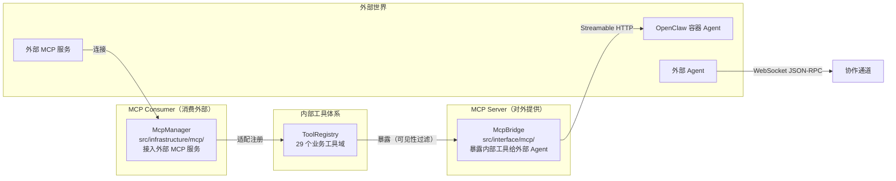

# 第 22 章 MCP 与外部 Agent

> "开放协议让 AI 平台的能力无限延伸。"

MCP（Model Context Protocol）是连接 AI 与外部工具的开放标准。WinMatrix 同时是 MCP 的**提供者**（将内部工具暴露给外部 Agent）和**消费者**（接入外部 MCP 服务）。此外，它还支持外部 Agent 注册和协作。本章将分析这些集成机制。

## 22.1 MCP 双向架构

WinMatrix 的 MCP 实现是双向的：



## 22.2 MCP Bridge：对外提供工具

`McpBridge` 将 WinMatrix 的内部工具暴露为 MCP 工具：

```typescript
// src/interface/mcp/mcpBridge.ts（第 1-13 行）
/**
 * WinMatrix MCP Bridge Server
 *
 * 将 WinMatrix business-tools 暴露为 MCP 工具，供 OpenClaw 容器内的 Agent 通过
 * Streamable HTTP 调用。基于 fastify-mcp 插件 + @modelcontextprotocol/sdk。
 *
 * - `/mcp`：ToolRegistry 工具（经 mcp_bridge_visible 过滤）+ Bridge 内置工具
 *
 * 工具名与 WinMatrix ToolRegistry 中的名称一致。
 * 所有工具调用须携带有效 Bearer Token（ws.v1. / wm_pat_ / wma_），
 * 经 mcpHttpTransport.handleToolCall() → UnifiedToolProxy 统一管线执行。
 */
import { McpServer } from '@modelcontextprotocol/sdk/server/mcp.js';
import { z } from 'zod';
import { filterToolsForMcpBridge } from '@/interface/mcp/mcpBridgeExposure.js';
import { recordMcpAuthRejection } from '@/interface/mcp/mcpAuthRejection.js';
```

### 可见性过滤

并非所有内部工具都对外暴露：

```typescript
// src/interface/mcp/mcpBridgeExposure.ts
// filterToolsForMcpBridge() - 基于 mcp_bridge_visible 标志过滤
// 只有标记为可见的工具才会暴露给外部
```

### JSON Schema → Zod 转换

MCP 协议使用 JSON Schema 描述工具参数，而 MCP SDK 使用 Zod：

```typescript
// src/interface/mcp/mcpBridge.ts（第 54-68 行）
function jsonSchemaPropertyToZod(prop: { type?: string; description?: string }): z.ZodTypeAny {
  const desc = prop.description ?? '';
  switch (prop.type) {
    case 'number':
    case 'integer':
      return z.number().describe(desc).optional();
    case 'boolean':
      return z.boolean().describe(desc).optional();
    case 'array':
      return z.array(z.unknown()).describe(desc).optional();
    case 'object':
      return z.record(z.unknown()).describe(desc).optional();
    default:
      return z.string().describe(desc).optional();
  }
}
```

### 工具注册

```typescript
// src/interface/mcp/mcpBridge.ts（第 84-100 行）
function registerToolsOnMcpServer(mcpServer: McpServer, tools: ITool[], logLabel: string): void {
  for (const tool of tools) {
    const toolDef = tool.toToolDefinition();
    const params = toolDef.parameters as Record<string, unknown> | undefined;

    // 构建 Zod Schema
    const inputSchema: Record<string, z.ZodTypeAny> = {};
    const properties = (params?.properties ?? {}) as Record<string, { type?: string; description?: string }>;
    for (const [key, prop] of Object.entries(properties)) {
      inputSchema[key] = jsonSchemaPropertyToZod(prop);
    }

    // 注册处理器
    const handler = async (args: Record<string, unknown>, extra: McpRequestExtra) => {
      return await executeMcpBridgeToolCall(toolDef.name, args, extra);
    };
    // mcpServer.tool(name, description, inputSchema, handler)
  }
}
```

### Bearer Token 认证

```typescript
// src/interface/mcp/mcpBridgeAuth.ts
// 支持 3 种 Token 前缀：
// - ws.v1.   - WinMatrix v1 Token
// - wm_pat_  - Personal Access Token
// - wma_     - WinMatrix Agent Token
```

## 22.3 McpManager：消费外部 MCP 服务

`McpManager` 管理多个外部 MCP 服务连接：

```typescript
// src/infrastructure/mcp/McpManager.ts（第 50-95 行）
export class McpManager {
  private clients = new Map<string, McpClient>();
  private initialized = false;
  private toolRegistry: IToolRegistry | null = null;
  private registeredToolNames = new Map<string, string[]>();    // 热加载清理用
  private toolServiceIndex = new Map<string, { serviceId: string; serviceName: string }>();
  private whitelistCache: WhitelistCache = new Map();            // 工具白名单缓存
  private assignedAgentsCache: AssignedAgentsCache = new Map();  // Agent 可见性缓存
  private credentialBindingCache: CredentialBindingCache = new Map();  // 凭据绑定缓存

  async initialize(): Promise<void> {
    if (this.initialized) return;
    const services = await prisma.mcp_services.findMany({
      where: { is_enabled: true },
    });
    await Promise.allSettled(services.map(svc => this.connectService(svc)));
    this.initialized = true;
    logger.info(`[McpManager] 已初始化 ${this.clients.size}/${services.length} 个 MCP 服务`);
  }

  registerToToolRegistry(toolRegistry: IToolRegistry): void {
    this.toolRegistry = toolRegistry;
    // 将外部工具注册到内部 ToolRegistry
  }
}
```

### 热加载

```typescript
private registeredToolNames = new Map<string, string[]>();
```

`registeredToolNames` 记录每个服务注册到 ToolRegistry 的工具名——当服务被移除或重连时，用于清理旧工具。

### Agent 可见性

```typescript
private assignedAgentsCache: AssignedAgentsCache = new Map();
```

每个 MCP 服务可以配置 `assigned_agents`——只有指定的 Agent 才能看到该服务的工具。

## 22.4 外部 Agent 注册

WinMatrix 支持外部 Agent（如 Claude Code、Codex、Hermes）注册并协作：

### 注册相关文件

```
src/business/domain/externalAgent/computer/
├── ComputerManager.ts              # 计算机管理
├── ComputerProvisioner.ts          # 配置器
├── ComputerStore.ts                # 存储
└── AgentComputerOwnershipGuard.ts  # 所有权守卫

src/agents/core/agent/external-agent/
└── externalAgentBootstrap.ts       # 引导

src/agents/core/worker/externalAgent/
├── TaskDispatcher.ts               # 任务分发
└── ExternalAgentChatAdapter.ts     # 聊天适配
```

### 外部 Agent 连接器

```
src/integration/connectors/external-agent/
├── ExternalAgentPromptBuilder.ts
├── externalAgentDelegateRunner.ts
├── connection/
│   ├── ConnectionPool.ts              # 连接池
│   └── ExternalAgentConnection.ts     # 连接
├── distributed/
│   ├── ExternalAgentGateway.ts        # 网关
│   ├── ExternalAgentInstanceIdentity.ts
│   ├── ExternalAgentOwnerRegistry.ts
│   └── ExternalAgentRpcBus.ts         # RPC 总线
├── health/
│   └── ExternalAgentHealthMonitor.ts  # 健康监控
└── security/
    ├── ExternalAgentAuditLog.ts       # 审计日志
    └── ExternalAgentWsRateLimiter.ts  # 限流
```

## 22.5 外部 Agent WebSocket

外部 Agent 通过 WebSocket 连接（见第 8 章）：

```typescript
// src/interface/api/externalAgentWebSocket.ts
// /api/v1/external-agents/connect
// JSON-RPC 风格帧协议
// 30 秒注册超时
// WS close code 1013（模块未就绪）
```

## 22.6 OpenClaw 集成

OpenClaw 是一种特殊的外部 Agent，运行在专用工作站中：

```typescript
// src/business/domain/workstation/runtime/OpenClawWorkstation.ts
// OpenClaw Agent 运行在 openclaw 类型的工作站
// 通过 MCP Bridge 访问 WinMatrix 内部工具
```

OpenClaw 容器内的 Agent 通过 Streamable HTTP 调用 MCP Bridge，访问 WinMatrix 的业务工具。

## 本章小结

本章深入分析了 WinMatrix 的 MCP 与外部 Agent 集成：

1. **双向 MCP 架构**：Bridge（对外提供）+ Manager（消费外部）
2. **McpBridge**：JSON Schema → Zod 转换 + 可见性过滤 + Bearer Token 认证
3. **3 种 Token**：ws.v1. / wm_pat_ / wma_
4. **McpManager**：多服务管理 + 热加载 + 工具白名单 + Agent 可见性
5. **外部 Agent 注册**：Computer 管理 + 连接池 + RPC 总线
6. **安全体系**：健康监控 + 审计日志 + 限流
7. **WebSocket JSON-RPC**：30 秒注册超时 + close code 1013
8. **OpenClaw 集成**：专用工作站 + MCP Bridge 访问内部工具

在下一章中，我们将深入 Worker 系统。
