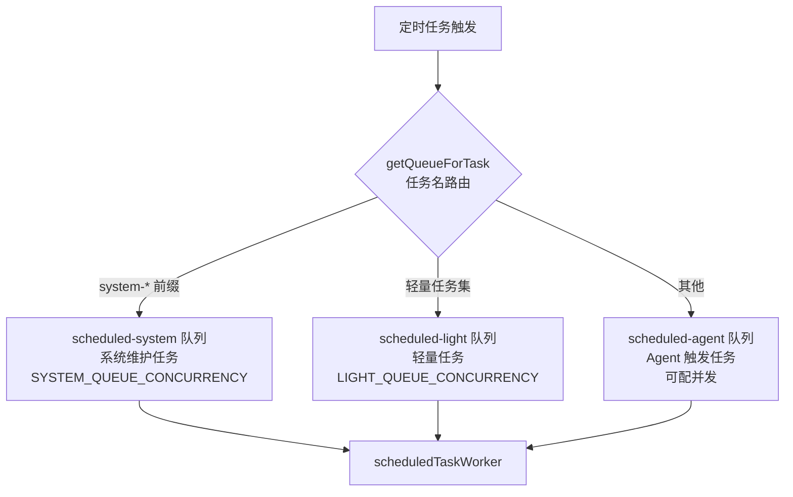

# 第 24 章 定时任务系统

> "定时任务是系统的生物钟，让它在合适的时间做合适的事。"

WinMatrix 的定时任务系统管理着 15+ 个系统级定时任务——从记忆整理到日志清理，从超时扫描到路由规则发现。本章将分析这些任务的配置、调度机制和队列分发。

## 24.1 系统定时任务清单

所有系统定时任务定义在 `src/infrastructure/scheduled/types.ts`：

```typescript
// src/infrastructure/scheduled/types.ts（第 54-70 行）
export const SYSTEM_MAINTENANCE_TASK_NAMES = new Set([
  'system-memory-tidy',                    // 记忆整理
  'system-log-cleanup',                    // 日志清理
  'system-coding-task-timeout-sweep',      // 编码任务超时扫描
  'system-detached-worker-sweep',          // 分离 Worker 扫描
  'system-pending-events-cleanup',         // 待处理事件清理
  'system-route-rule-discovery',           // 路由规则发现
  'system-reminder-delivery',              // 提醒投递
  'system-execution-log-cleanup',          // 执行日志清理
  'system-transcript-compact',             // 转录压缩
  'system-llm-call-watchdog-sweeper',      // LLM 调用看门狗
  'system-tfs-git-sync',                   // TFS/Git 同步
  'system-scheduled-run-reconcile',        // 定时运行收敛
  'system-observability-cleanup',          // 可观测性数据清理
  'system-acceptance-event-reap',          // 验收事件收割
  'system-side-effect-terminal-cleanup',   // 副作用终端清理
]);
```

## 24.2 任务配置

每个任务有独立的 cron 表达式和触发类型：

```typescript
// src/infrastructure/scheduled/types.ts（第 78-100 行）
export const SYSTEM_SCHEDULED_TASKS: ScheduledTaskConfig[] = [
  {
    name: 'system-memory-tidy',
    pattern: '0 3 * * *',              // 每天 03:00
    tz: DEFAULT_TZ,
    message: '会话转录 → 长期记忆全量同步',
    taskName: '记忆整理',
    failureNotificationTitle: '记忆整理失败',
    triggerType: 'direct',             // 直接调用（非消息触发）
  },
  {
    name: 'system-log-cleanup',
    pattern: '0 4 * * *',              // 每天 04:00
    message: '清理应用日志文件（默认保留 30 天）',
    taskName: '应用日志清理',
    triggerType: 'direct',
  },
  {
    name: 'system-coding-task-timeout-sweep',
    pattern: '*/5 * * * *',            // 每 5 分钟
    message: '标记超时的编码任务为 failed',
    taskName: '编码任务超时扫描',
    triggerType: 'direct',
  },
];
```

### 任务分类

| 频率 | 任务 | 用途 |
|------|------|------|
| **每分钟** | `system-reminder-delivery` | 提醒投递 |
| **每 5 分钟** | `system-coding-task-timeout-sweep` | 编码任务超时 |
| **每 10 分钟** | `system-llm-call-watchdog-sweeper`（interval 类型，非 cron） | LLM 调用看门狗 |
| **每 3 小时** | `system-tfs-git-sync` | TFS/Git 同步 |
| **每天 02:00** | `system-transcript-compact` | 转录压缩 |
| **每天 02:50** | `system-route-rule-discovery` | 路由规则发现 |
| **每天 03:00** | `system-memory-tidy` | 记忆整理 |
| **每天 04:00** | `system-log-cleanup` | 日志清理 |
| **每天 05:05** | `system-pending-events-cleanup` | 待处理事件清理 |

### 触发类型

```typescript
export type ScheduledTaskTriggerType = 'message' | 'direct' | 'workflow';
```

- **message**：发送消息触发智能体（如每日早会）
- **direct**：直接调用方法（系统维护任务）
- **workflow**：触发工作流

系统维护任务使用 `direct`，不经过 Agent 决策，直接执行维护逻辑。

## 24.3 三队列分发

定时任务根据类型分发到三个队列：

```typescript
// src/infrastructure/queue/queue.ts（第 29-52 行）
const scheduledAgentQueue = new Queue<ScheduledJobData>('scheduled-agent', {
  connection: bullmqQueueConnection,
  defaultJobOptions,
});

const scheduledSystemQueue = new Queue<ScheduledJobData>('scheduled-system', {
  connection: bullmqQueueConnection,
  defaultJobOptions,
});

const scheduledLightQueue = new Queue<ScheduledJobData>('scheduled-light', {
  connection: bullmqQueueConnection,
  defaultJobOptions,
});

export function getQueueForTask(taskName: string): Queue<ScheduledJobData> {
  if (SYSTEM_TASKS.has(taskName)) return scheduledSystemQueue;   // 系统维护
  if (LIGHT_TASKS.has(taskName)) return scheduledLightQueue;     // 轻量任务
  return scheduledAgentQueue;                                     // 默认（Agent 触发）
}
```



三队列分离的好处：

1. **资源隔离**：系统维护任务不与 Agent 任务竞争资源
2. **独立并发控制**：每类任务有独立的并发限制
3. **优先级**：轻量任务可以更高并发，系统任务更保守

### 默认 Job 选项

```typescript
const defaultJobOptions = {
  attempts: 2,                                    // 重试 2 次
  backoff: { type: 'exponential', delay: 5000 }, // 指数退避
  removeOnComplete: {
    count: Number(process.env.BULLMQ_SCHEDULED_COMPLETE_COUNT) || 200,
    age: Number(process.env.BULLMQ_SCHEDULED_COMPLETE_AGE) || 7 * 24 * 3600,
  },
  removeOnFail: {
    count: Number(process.env.BULLMQ_SCHEDULED_FAIL_COUNT) || 100,
    age: Number(process.env.BULLMQ_SCHEDULED_FAIL_AGE) || 7 * 24 * 3600,
  },
};
```

## 24.4 registerDefaultScheduledTasks

启动时注册所有默认定时任务：

```typescript
// src/business/application/services/ScheduledTaskService.ts（第 1817-2091 行）
export async function registerDefaultScheduledTasks(): Promise<void> {
  const tSyncStart = Date.now();
  logger.info('[ScheduledTask] 开始读取 DB 覆盖配置...');

  if (config.startup.skipScheduledSync) {
    // skipSync 模式：仅注册系统任务，跳过 DB 同步
    for (const task of SYSTEM_SCHEDULED_TASKS) {
      try {
        await registerSystemRepeatableTask(task);
      } catch (err) {
        logger.warn({ err, taskName: task.name }, '单个系统默认任务注册失败，已跳过');
      }
    }
    return;
  }

  // 正常模式：读取 DB 覆盖配置
  // 1. 读取 scheduled_task_override 表
  // 2. 合并默认配置与覆盖配置
  // 3. 注册 Repeatable Job
  // 4. 清理过期的 Repeatable Job
}
```

### DB 覆盖配置

用户可以通过 API 修改定时任务的配置（如调整 cron 表达式、绑定项目）：

```typescript
// scheduled_task_override 表
// 用户自定义的覆盖配置
// PATCH /api/.../scheduled-tasks/:key
```

### 单节点同步

多个节点同时启动时，需要确保只有一个节点执行注册：

```typescript
// src/index.ts
const { runWithScheduledSyncLeader } = await import('@/infrastructure/scheduled/scheduledSyncLeader.js');
const ranSync = await runWithScheduledSyncLeader(() => registerDefaultScheduledTasks());
if (!ranSync) {
  logger.info('[ScheduledTask] 非 sync leader，跳过 registerDefaultScheduledTasks');
}
```

`runWithScheduledSyncLeader` 使用分布式锁确保只有一个节点执行注册（避免重复注册）。

## 24.5 reconcileStaleRunsOnBootstrap

启动时还需要处理上次崩溃遗留的"运行中"任务：

```typescript
// src/business/application/services/ScheduledTaskService.ts（第 2093 行）
export async function reconcileStaleRunsOnBootstrap(): Promise<{
  // 多节点 advisory lock 单实例执行
  // 清理 scheduled_task_run + agent_run 中的 stale running 状态
}> {
  // 使用 PG Advisory Lock（见第 4 章）
  // 确保多节点环境下只执行一次
}
```

## 24.6 用户自定义定时任务

除了系统任务，用户可以创建自定义定时任务：

```prisma
// prisma/schema.prisma
model ScheduledTaskOverride {
  // 用户自定义定时任务覆盖
  // 包括 cron 表达式、消息内容、绑定项目等
}

model ScheduledTaskRun {
  // 定时任务执行记录
  // 记录每次执行的状态、结果、耗时
}
```

### ScheduledJobData

```typescript
// src/infrastructure/scheduled/types.ts（第 14-31 行）
export interface ScheduledJobData {
  message: string;
  taskName: string;
  projectId?: string;
  projectName?: string;
  projectCode?: string;
  agentId?: string;
  endDate?: string;          // 截止日期，过期后不再执行
  scheduleType?: 'cron' | 'interval';
  intervalMs?: number;        // 间隔毫秒（仅 interval 类型）
  overrideStatus?: string;
  semRejectCount?: number;    // 信号量拒绝计数（指数退避用）
}
```

## 24.7 Cron 抖动

为了避免所有定时任务在同一时刻触发，系统使用 cron 抖动：

```typescript
// src/interface/channel/channels/scheduled/spreadCron.ts
import { spreadCronPattern, cronHourMinuteKey } from '...';
// 将 cron 表达式分散到不同的分钟
// 避免 "0 * * * *" 这样的整点任务同时触发
```

## 24.8 失败通知

定时任务失败时可以发送通知：

```typescript
// ScheduledTaskConfig
failureNotificationTitle?: string;
// 失败时通过企微或邮件通知管理员
```

## 本章小结

本章深入分析了 WinMatrix 的定时任务系统：

1. **15+ 系统任务**：记忆整理、日志清理、超时扫描、路由发现等
2. **三队列分发**：scheduled-system（维护）/ scheduled-light（轻量）/ scheduled-agent（Agent 触发）
3. **频率分布**：从每分钟（提醒）到每天（整理），覆盖不同时间尺度
4. **三种触发类型**：message（消息）/ direct（直接调用）/ workflow（工作流）
5. **DB 覆盖配置**：用户可通过 API 修改任务配置
6. **单节点同步**：分布式锁确保注册只执行一次
7. **Stale Run 清理**：启动时用 Advisory Lock 清理遗留的运行中任务
8. **Cron 抖动**：避免整点任务同时触发
9. **失败通知**：通过企微/邮件通知管理员
10. **默认重试**：attempts=2 + 指数退避

在下一章中，我们将深入可观测性系统。
