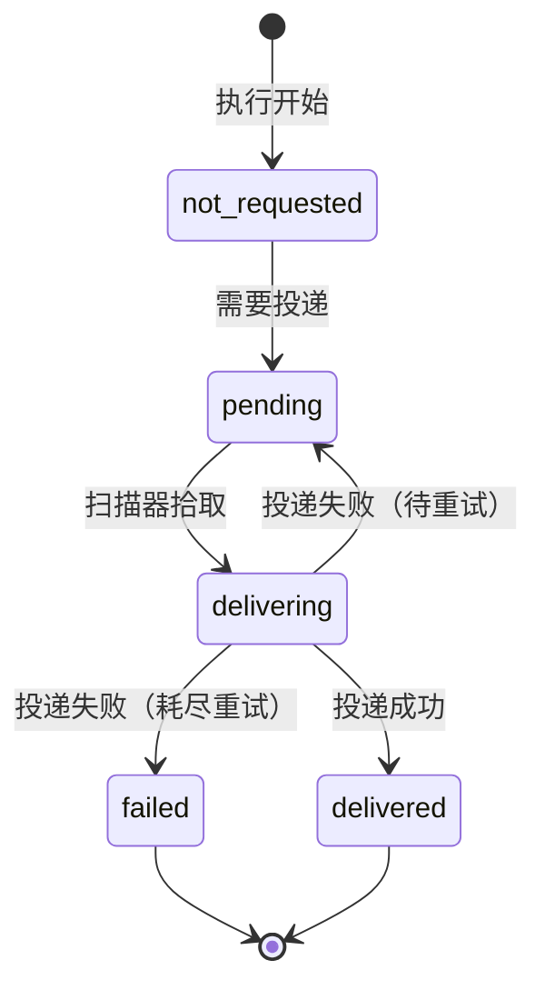
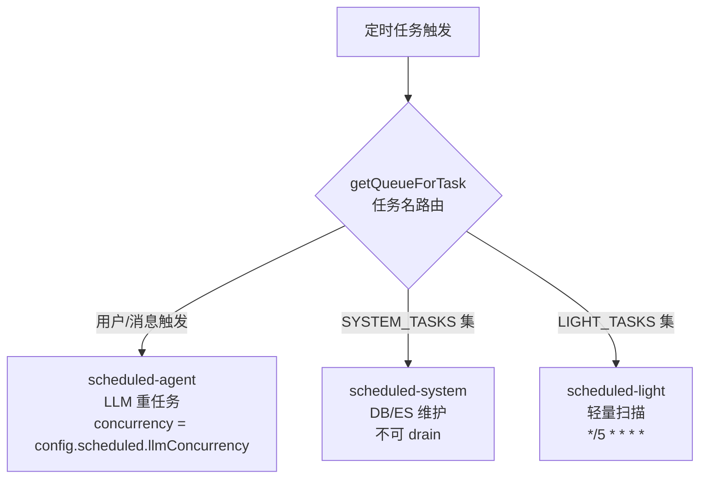
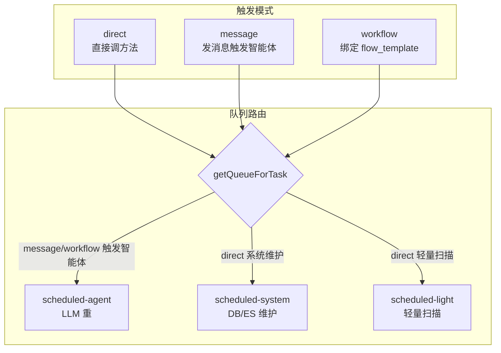
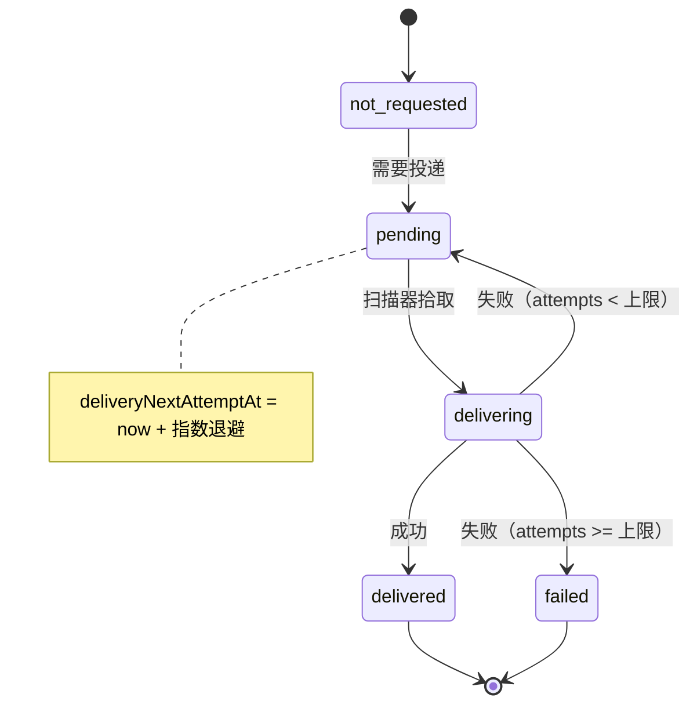

# 第 24 章 定时任务系统

> "定时任务是系统的生物钟，让它在合适的时间做合适的事。"

如果说 Worker 系统（第 23 章）是异步引擎，那么定时任务系统就是这套引擎的"生物钟"——它决定系统在每天 03:00 整理记忆、每 5 分钟扫描超时任务、每 10 分钟看护悬挂的 LLM 调用。但定时任务远不只是"一个 cron 表达式 + 一个回调函数"那么简单。在一个多节点、有崩溃、有补偿、有投递回执的生产环境里，定时任务要解决的问题是：**如何保证每个任务在该触发时触发一次、只触发一次、执行结果可靠送达？**

本章从四个数据模型讲起，依次展开三队列分流、16 个系统预定义任务、三种触发模式、幂等与补偿的核心机制（leader 锁、repeatable job 自愈、stale run 收敛），最后看 Result Delivery 与执行终态如何解耦。

## 24.1 四个数据模型：配置、绑定、迁移、执行

定时任务系统的数据全部落在 `schema.prisma` 的四个模型里。理解这四个模型的字段设计，就理解了整个系统的能力边界。

### ScheduledTaskOverride：配置覆盖真源

```prisma
// schema.prisma（第 33-56 行）
model ScheduledTaskOverride {
  taskName              String  @id                      // 任务名（主键）
  pattern               String  @default("0 0 * * *")    // cron 表达式，默认每天 00:00
  scheduleType          String  @default("cron")          // cron | interval
  intervalMs            Int?                               // interval 类型的毫秒间隔
  status                String  @default("active")        // active | stopped
  resultDeliveryTarget  String  @default("none")          // none | wechat | wecom
  message               String?                            // message 触发时的消息内容
  endDate               String?                            // 过期日期
  // ... projectId / roleName / taskName 显示名等
  @@map("scheduled_task_override")
}
```

`taskName` 是主键——每个任务名只有一条覆盖记录。注意几个关键默认值：

- **`pattern` 默认 `0 0 * * *`**：这是一个安全的"每天午夜"默认值。如果一个新任务没显式配 cron，至少不会变成"每分钟触发一次"这种危险默认。
- **`status` 默认 `active`，但可设 `stopped`**：用户可以通过 API 临时停一个任务（比如发现某个任务在捣乱），不必删除记录。
- **`resultDeliveryTarget` 默认 `none`**：执行结果默认不投递到任何外部渠道。需要投递时显式设为 `wechat` 或 `wecom`。**默认安全（fail-safe）**：宁可少投递，不可乱发消息。

### ScheduledTaskWorkflowBinding：任务绑定 workflow

```prisma
// schema.prisma（第 59-76 行）
model ScheduledTaskWorkflowBinding {
  // 任务绑定 workflow（templateId + 可选 templateVersionId）
  // 级联删除：任务删了，绑定也删
}
```

这个模型支撑了"workflow 触发模式"——一个定时任务可以不直接调方法、不发消息，而是触发一个完整的 workflow（见第 20 章）。`templateVersionId` 可选，如果不指定就用模板的最新发布版（见第 4 章的"模板 → 版本 → 运行"三层）。

### ScheduledCronMigrationLog：09:00 尖峰迁移审计

```prisma
// schema.prisma（第 79-89 行）
model ScheduledCronMigrationLog {
  taskName          String
  migrationVersion  Int
  originalPattern   String    // 迁移前的 cron（如 0 9 * * *）
  spreadPattern     String    // 迁移后的 cron（如 0 9 * * * 分散到不同分钟）
  @@id([taskName, migrationVersion])    // 复合主键，保证幂等
  @@map("scheduled_cron_migration_log")
}
```

这个模型记录的是一个**真实运维事件**：早期很多定时任务都配成了 `0 9 * * *`（每天 09:00 触发），导致每天 09:00 出现一个巨大的执行尖峰，压垮 LLM 并发额度。系统做了一次"尖峰分散"迁移，把所有 09:00 的任务分散到 09:00-09:59 的不同分钟。`@@id([taskName, migrationVersion])` 复合主键保证这个迁移是幂等的——迁移脚本重跑不会产生重复记录。

这是一个值得记住的教训：**cron 表达式看起来是个"配置"，但它本质上是分布式的并发声明。多个任务撞在同一时刻，就是分布式并发灾难。**

### ScheduledTaskRun：执行记录 + 投递状态机

```prisma
// schema.prisma（第 92-128 行）
model ScheduledTaskRun {
  id                      String   @id @default(uuid())
  taskName                String
  status                  String   // running | succeeded | failed
  agentRunId              String?  // 关联的 agent_run
  traceId                 String?  // 关联的可观测 trace
  // 投递状态机
  deliveryStatus          String   @default("not_requested")
  // not_requested | pending | delivering | delivered | failed
  deliveryAttempts        Int      @default(0)
  deliveryNextAttemptAt   DateTime?
  @@index([deliveryStatus, deliveryNextAttemptAt])   // 投递扫描索引
  @@map("scheduled_task_run")
}
```

`ScheduledTaskRun` 是每次执行一条记录。它的核心是**投递状态机**：



`deliveryAttempts` + `deliveryNextAttemptAt` 实现**指数退避**：第一次投递失败，下一次等更久再试。`@@index([deliveryStatus, deliveryNextAttemptAt])` 让扫描器能高效查出"现在该投递的"任务（`WHERE deliveryStatus='pending' AND deliveryNextAttemptAt <= now()`）。

## 24.1.1 配置覆盖的合并语义

`ScheduledTaskOverride` 的配置不是"覆盖系统默认"，而是"和系统默认合并"。理解这个合并语义很重要。

系统默认任务定义在代码里（`SYSTEM_SCHEDULED_TASKS`），是硬编码的。用户不能改代码，但可以通过 DB 覆盖某些字段。覆盖是**字段级**的——你只想改 `pattern`（cron 表达式），就只设 `pattern`，其他字段保留系统默认。

这种设计让"默认 + 定制"共存：

- 系统默认是"安全值"——即使没有任何 DB 覆盖，任务也能正常运行。
- DB 覆盖是"定制值"——满足特定部署的需求（比如某个环境要把日志清理频率调高）。
- 删除 DB 覆盖 = 回到系统默认。

合并发生在 `registerDefaultScheduledTasks`（见 24.6 节）：读取所有系统默认 + 所有 DB 覆盖，按 taskName 合并，DB 覆盖优先。

### 投递目标的语义

`resultDeliveryTarget` 三个值的语义值得展开：

- **`none`（默认）**：执行结果不投递。系统维护任务（日志清理、超时扫描）通常用这个——它们的结果没人需要看。
- **`wechat`**：投递到企业微信。适合需要人及时知道结果的任务（如每日早会提醒）。
- **`wecom`**：投递到企微。和 wechat 类似但走不同通道（见第 21 章企微双轨）。

**默认 `none` 是 fail-safe 设计**：宁可少投递，不可乱发消息。一个配错的定时任务每分钟发一条企微消息，是运维噩梦。默认 none 让"投递"成为一个需要显式开启的行为。

## 24.2 三队列按重量分流

定时任务根据"重量"分发到三个队列。重量是指任务的资源消耗特征——LLM 调用重、DB 维护中、轻量扫描轻。

```ts
// src/infrastructure/queue/queue.ts（第 30-53 行）
const scheduledAgentQueue = new Queue<ScheduledJobData>(
  resolveBullmqQueueName('scheduled-agent'), { ... });
const scheduledSystemQueue = new Queue<ScheduledJobData>(
  resolveBullmqQueueName('scheduled-system'), { ... });
const scheduledLightQueue = new Queue<ScheduledJobData>(
  resolveBullmqQueueName('scheduled-light'), { ... });

export function getQueueForTask(taskName: string): Queue<ScheduledJobData> {
  if (SYSTEM_TASKS.has(taskName)) return scheduledSystemQueue;   // 系统维护
  if (LIGHT_TASKS.has(taskName)) return scheduledLightQueue;     // 轻量任务
  return scheduledAgentQueue;                                     // 默认：Agent 触发
}
```



三个队列的分流逻辑：

| 队列 | 特征 | 典型任务 | 并发控制 |
|------|------|---------|---------|
| **scheduled-agent** | LLM 重任务，昂贵 | 消息触发的智能体执行 | 受 LLM 信号量约束（`llmConcurrency`） |
| **scheduled-system** | DB/ES 维护，不可中断 | 日志清理、记忆整理 | 独立并发，**不可 drain** |
| **scheduled-light** | 轻量扫描，高频 | 超时扫描（*/5） | 高并发，快速完成 |

**为什么 system 队列"不可 drain"？** drain 是指关闭 Worker 时把队列里剩余的 job 全部清空。系统维护任务（比如清理过期日志）如果被 drain，就可能留下没清理完的数据，导致下次启动时数据量更大。所以 system 队列的 Worker 关闭时只等当前 job 完成，不清空队列。**这是"任务重要性"对"关闭策略"的影响。**

三队列分离的本质是**资源隔离**：一个 LLM 重任务卡住，不会阻塞日志清理；日志清理在跑，不会挤占 LLM 并发额度。每种任务在自己的车道上跑，互不拖累。

## 24.2.1 队列名解析与运行时隔离

注意三队列创建时用的是 `resolveBullmqQueueName('scheduled-agent')`，而不是直接 `'scheduled-agent'`。`resolveBullmqQueueName` 会根据运行时隔离 ID 决定队列名：

```ts
// 概念示意
function resolveBullmqQueueName(base: string): string {
  const isolationId = process.env.WIN_RUNTIME_ISOLATION_ID;
  if (isolationId && isolationId !== 'prod') {
    return `${base}:${isolationId}`;   // 开发环境加主机名后缀
  }
  return base;                          // 生产环境用原名
}
```

这是第 23 章讲的"configure_runtime_isolation"的落点。开发环境里，开发者 A 的队列是 `scheduled-agent:hostA`，开发者 B 是 `scheduled-agent:hostB`——即使共用一个 Redis，队列互不干扰。生产环境强制 `prod`，所有节点共享 `scheduled-agent`。

**队列名隔离是多租户/多开发者的基础设施。** 没有它，两个开发者共用 Redis 时，一个开发者的定时任务会被另一个开发者的 Worker 消费，行为完全不可预测。

### scheduledJobData：任务投递的数据载体

```ts
// src/infrastructure/scheduled/types.ts（第 14-31 行）
export interface ScheduledJobData {
  message: string;              // message 触发时的消息内容
  taskName: string;             // 任务名
  projectId?: string;
  projectName?: string;
  projectCode?: string;
  agentId?: string;             // 目标 Agent
  endDate?: string;             // 截止日期，过期不再执行
  scheduleType?: 'cron' | 'interval';
  intervalMs?: number;          // interval 类型的间隔
  overrideStatus?: string;
  semRejectCount?: number;      // 信号量拒绝计数（指数退避用）
}
```

几个值得注意的字段：

- **`endDate`**：任务可以设截止日期。到期后 repeatable job 自动停止。这适合"项目期间每天开站会"这种临时任务——项目结束后任务自动失效，不必手动删。
- **`semRejectCount`**：记录这个 job 被信号量拒绝的次数。拒绝次数越多，下次重投的延迟越长——这是信号量背压的指数退避机制（和第 23 章的 DelayedError 配合）。

## 24.3 默认 Job 选项：重试与裁剪

所有三个队列共享同一份 `defaultJobOptions`：

```ts
// src/infrastructure/queue/queue.ts（第 17-28 行）
const defaultJobOptions = {
  attempts: 2,                                    // 含首次共 2 次
  backoff: { type: 'exponential' as const, delay: 5000 },  // 指数退避起步 5s
  removeOnComplete: {
    count: Number(process.env.BULLMQ_SCHEDULED_COMPLETE_COUNT) || 200,
    age: Number(process.env.BULLMQ_SCHEDULED_COMPLETE_AGE) || 7 * 24 * 3600,
  },
  removeOnFail: {
    count: Number(process.env.BULLMQ_SCHEDULED_FAIL_COUNT) || 100,
    age: Number(process.env.BULLMQ_SCHEDULED_FAIL_AGE) || 7 * 24 * 3600,
  },
};
```

- **`attempts: 2`**：含首次共 2 次。失败一次还有一次重试机会。
- **指数退避**：5s → 10s。对定时任务来说，这个间隔已经足够等过短暂的网络抖动。
- **`removeOnComplete`/`removeOnFail` 按 count + age 双约束裁剪**：保留最近 200 条完成 + 7 天，或最近 100 条失败 + 7 天。两个条件先到先触发，避免 Redis 无限膨胀。

## 24.4 16 个系统预定义任务

所有系统级定时任务定义在 `SYSTEM_SCHEDULED_TASKS` 数组里。这是一个**代码内硬编码**的清单——不像用户任务那样存在 DB 里，而是随代码发布。

```ts
// src/infrastructure/scheduled/types.ts（第 89-243 行，节选）
export const SYSTEM_SCHEDULED_TASKS: ScheduledTaskConfig[] = [
  { name: 'system-memory-tidy',
    pattern: '0 3 * * *', tz: DEFAULT_TZ,
    message: '会话转录 → 长期记忆全量同步', triggerType: 'direct' },
  { name: 'system-coding-task-timeout-sweep',
    pattern: '*/5 * * * *', triggerType: 'direct', ... },
  { name: 'system-execution-log-cleanup',
    pattern: '30 3 * * *',
    message: '...agent_execution_log 已退役（retire-agent-execution-log）',
    triggerType: 'direct' },
  { name: 'system-llm-call-watchdog-sweeper',
    scheduleType: 'interval', intervalMs: 600_000, ... },   // 10 分钟
  { name: 'system-observability-cleanup',
    pattern: '30 4 * * *',
    message: '清理 execution_span(级联 execution_span_event) / pipeline_run / session_transcript',
    triggerType: 'direct' },
  { name: 'system-scheduled-run-reconcile',
    pattern: '*/30 * * * *', ... },                          // 每 30 分钟
  // ... 共 16 个
];
```

完整清单（16 个）按职责分组：

| 类别 | 任务名 | 频率 | 用途 |
|------|--------|------|------|
| **记忆/转录** | `system-memory-tidy` | `0 3 * * *` | 会话转录 → 长期记忆全量同步 |
| **日志/可观测清理** | `system-log-cleanup` | `0 4 * * *` | 应用日志文件清理 |
| | `system-execution-log-cleanup` | `30 3 * * *` | 旧执行日志清理（注释明示 `agent_execution_log` 已退役） |
| | `system-observability-cleanup` | `30 4 * * *` | 清理 execution_span（级联 execution_span_event）/ pipeline_run / session_transcript |
| **超时/对账扫描** | `system-coding-task-timeout-sweep` | `*/5 * * * *` | 标记超时编码任务 failed |
| | `system-scheduled-run-reconcile` | `*/30 * * * *` | scheduled run 终态收敛 |
| | `system-llm-call-watchdog-sweeper` | interval 600_000 | 悬挂 LLM 调用看门狗（见第 25 章） |
| **投递** | `system-reminder-delivery` | `*/1 * * * *` | 提醒投递 |

注意 `system-execution-log-cleanup` 的 `message` 字段里有一句关键注释：**"agent_execution_log 已退役（retire-agent-execution-log）"**。这条信息对应第 25 章的核心事实——`agent_execution_log` 表已无 Prisma model 定义，ExecutionSpan 成为唯一 SSOT。保留这个清理任务是为了清理历史残留数据。

`system-llm-call-watchdog-sweeper` 用的是 `scheduleType: 'interval'` + `intervalMs: 600_000`（10 分钟），而不是 cron。**interval 类型适合"固定间隔"语义的任务**——watchdog 的语义是"每 10 分钟检查一次"，不是"在第 X 分第 Y 秒触发"，用 interval 更自然。

## 24.4.1 为什么系统任务硬编码在代码里

你可能会问：系统任务为什么硬编码在 `SYSTEM_SCHEDULED_TASKS` 数组里，而不是像用户任务一样存在 DB？这不是"不灵活"吗？

恰恰相反，这是**刻意的工程选择**。系统任务和用户任务有本质区别：

| 维度 | 系统任务（硬编码） | 用户任务（DB） |
|------|------------------|--------------|
| **生命周期** | 随代码版本发布 | 运行时创建/删除 |
| **变更频率** | 极低（改代码才变） | 高（用户随时改） |
| **审计需求** | 低（代码本身就是审计） | 高（谁改了什么） |
| **一致性要求** | 必须和代码逻辑同步 | 宽松 |

如果系统任务也存 DB，会出现一个尴尬问题：**代码升级了（比如 `system-observability-cleanup` 的清理逻辑变了），但 DB 里的任务配置还是旧的**。更糟的是，DB 里的任务可能被误删——有人不小心把 `system-memory-tidy` 的 override 删了，记忆整理就停了。

硬编码在代码里，保证了**系统任务和它调用的代码逻辑永远同步**。代码升级 = 任务升级，不会脱节。DB override 只用于"微调参数"（如改 cron 表达式），不能删除任务本身。

### interval vs cron 的选择

注意 `system-llm-call-watchdog-sweeper` 用的是 `scheduleType: 'interval'` + `intervalMs: 600_000`，而不是 cron。这不是随意选择：

- **cron** 表达的是"在特定时刻触发"（如 `0 3 * * *` = 每天 3:00）。适合和业务时间相关的任务（如"每天凌晨整理记忆"）。
- **interval** 表达的是"每隔固定时间触发"（如每 10 分钟）。适合"持续监控"类任务——watchdog 的语义是"定期检查有没有悬挂调用"，不是"必须在某个特定时刻检查"。

interval 还有一个隐含好处：**多个节点启动时间不同，interval 触发时刻天然错开**。如果用 cron `*/10 * * * *`，所有节点都会在每整十分钟的同一秒触发；用 interval，每个节点从启动时刻开始计 10 分钟，触发时刻自然分散。

## 24.5 三种触发模式

```ts
export type ScheduledTaskTriggerType = 'message' | 'direct' | 'workflow';
```

这三种模式决定了任务被触发后"做什么"：

| 模式 | 行为 | 典型场景 |
|------|------|---------|
| **direct** | 直接调用一个 service 方法 | 系统维护任务（清理、对账） |
| **message** | 向某个角色/会话发一条消息，触发智能体决策 | 每日早会、定时提醒 |
| **workflow** | 触发一个绑定的 flow_template | 定期执行固定工作流 |

### direct：不经过 Agent 决策

`direct` 模式的任务**不进入决策引擎**——它直接调对应的 service 方法（比如 `cleanOldLogs()`）。这很重要：系统维护任务不需要 LLM 参与，如果让它走 message 触发智能体，既慢又贵还可能被决策引擎路由到别处。

### message：触发智能体

`message` 模式把任务当成"有人在对话里说了一句话"。比如"每天 09:00 给产品经理发今天的待办列表"——这个任务触发时，会向产品经理的会话投递一条消息，由决策引擎（见第 10 章）决定怎么响应。

### workflow：触发编排

`workflow` 模式绑定一个 `flow_template`（见第 20 章），触发时创建一个新的 flow_run。这适合"固定流程"的任务——比如每周一生成项目周报，流程是固定的：收集数据 → 生成报告 → 发送通知。

## 24.5.1 触发模式与队列的交叉路由

三种触发模式和三队列不是正交的——它们有交叉关系：



理解这个交叉的关键是：**队列路由只看 taskName（SYSTEM_TASKS / LIGHT_TASKS / 其他），不看 triggerType**。一个 `direct` 触发的系统任务进 scheduled-system 队列；一个 `message` 触发的智能体任务进 scheduled-agent 队列。triggerType 决定"做什么"，队列决定"在哪跑"。

这种解耦让"做什么"和"在哪跑"可以独立演化——你可以把某个任务从 direct 改成 message（改变做什么），但不改变它的队列归属（还在原来的队列跑）。

## 24.6 幂等与补偿（一）：scheduledSyncLeader 抢锁

多节点环境下，每个节点都会启动并尝试注册定时任务。如果所有节点都注册一遍，同一个 repeatable job 会被注册 N 次，每个触发时刻就会有 N 个 job 实例——任务被执行 N 遍。

`scheduledSyncLeader` 用 Redis 分布式锁解决这个问题：

```ts
// src/infrastructure/scheduled/scheduledSyncLeader.ts（第 10-115 行）
const LOCK_KEY = 'scheduled:sync:leader';
const LOCK_TTL_SECONDS = 120;
const RENEW_INTERVAL_MS = 40_000;

export async function runWithScheduledSyncLeader(
  syncFn: () => Promise<void>,
): Promise<boolean> {
  const acquired = await tryAcquireScheduledSyncLeader();
  if (!acquired) return false;            // 没抢到锁，跳过
  startScheduledSyncLeaderRenewal();      // 抢到了，启动续租
  try {
    await syncFn();                        // 执行注册
    return true;
  } finally {
    stopScheduledSyncLeaderRenewal();
    await releaseScheduledSyncLeader();
  }
}
```

工作机制：

1. **抢锁**：`SET NX EX 120`（SET if Not eXists，TTL 120s）。只有一个节点能成功。
2. **续租**：抢到锁的节点每 40s（`RENEW_INTERVAL_MS`）用 Lua 脚本续租。Lua 脚本会比对 fence（`hostname:pid:timestamp`）——只有锁的持有者才能续租，防止节点 A 持有过期后节点 B 抢到新锁，节点 A 又错误地续租了节点 B 的锁。
3. **释放**：注册完成后主动释放（`releaseScheduledSyncLeader`）。
4. **TTL 兜底**：如果持有锁的节点崩溃，120s 后锁自动过期，其他节点能抢到。

为什么 fence 用 `hostname:pid:timestamp`？因为这三个组合在分布式环境下是唯一的——不同节点的 hostname 不同，同节点的不同进程 pid 不同，同进程的重启用 timestamp 区分。这是分布式锁 fencing 的标准做法。

注意这与第 23 章的 `reconcileAdvisoryLockKey` 形成对比：**reconcile 用 PG advisory lock（启动期一次性、单 DB），leader 注册用 Redis SET NX（运行期、需 TTL 续租）**。两种锁解决两种不同的问题。

## 24.7 幂等与补偿（二）：repeatable job 自愈

即使有了 leader 锁，repeatable job 的注册还有一个隐蔽问题：**BullMQ 的 repeatable job 是按 key 管理的，如果 key 漂移，同一个任务可能产生多个有效 key，导致重复触发。**

WinMatrix 在每次注册前做三步清理：

1. **清理无效 key**：扫掉那些"已经不存在于配置但 BullMQ 里还有"的 repeatable job key。
2. **清理重复 key**：如果同一个任务有多个 key，只保留一个。
3. **配置 diff 才重注册**：如果当前配置和已注册的 repeatable job 完全一致（pattern、tz、scheduleType 都没变），就不重注册。只有 diff 才触发重注册。

```ts
// 注册前清理（ScheduledTaskService.ts）
// 1. 清理无效/重复 repeatable job key，保留单一有效 key
// 2. 配置 diff 才重注册
```

**为什么要这么谨慎？** 因为 BullMQ 的 repeatable job 一旦注册，就会按 pattern 持续触发。如果同一任务被注册了两次，每个触发时刻就会产生两个 job——任务被执行两遍。对于"清理日志"这种任务，执行两遍可能只是浪费资源；但对于"发企微通知"这种任务，执行两遍就是给用户发两条重复消息，体验灾难。

**幂等不是"重试不会出错"，而是"重复注册也不会产生副作用"。** 这三步清理把 repeatable job 的注册做成了幂等操作。

## 24.8 幂等与补偿（三）：reconcileStaleRunsOnBootstrap

即使 repeatable job 注册完美，节点崩溃仍会留下"running 状态但实际已死"的 scheduled_task_run。`reconcileStaleRunsOnBootstrap` 在启动时做一次性收敛：

```ts
// src/business/application/services/ScheduledTaskService.ts（第 2244-2298 行）
export async function reconcileStaleRunsOnBootstrap(): Promise<void> {
  const thresholdSeconds = Math.max(
    Math.floor(config.scheduled.agentJobTimeoutMs / 1000),
    30 * 60,   // 至少 30 分钟
  );
  const locked = await withReconcileLock(config.reconcileAdvisoryLockKey, async () => {
    const workflowRows = await convergeRunningScheduledWorkflowRuns(500);
    const scheduledRows = await reconcileStaleRunning(thresholdSeconds);
    const pipelineRows = await getAgentRunRepository().reconcileStaleRunning(thresholdSeconds);
    const candidates = await getAgentRunRepository().listPartialScheduledRunCandidates(500);
    // ... 收敛终态
  });
}
```

三路 reconcile 各管一段（第 23 章已详述）。这里补充一个阈值细节：`thresholdSeconds = max(agentJobTimeoutMs / 1000, 30 * 60)`。这意味着：

- 如果配置的 agent job 超时是 1 小时，threshold 就是 1 小时。
- 如果配置的超时小于 30 分钟，threshold 强制为 30 分钟。

**强制下限 30 分钟**是一个保护：避免因为配置错误（比如把超时设成 30 秒）导致正常执行中的任务被误判为 stale。

`withReconcileLock` 用 PG advisory lock 串行化（第 23 章），保证多节点同时启动时只有一个执行 reconcile。

## 24.9 Result Delivery：与执行终态解耦

第 23 章已经从 Worker 角度讲了 Result Delivery Outbox。这里从定时任务的角度补充。

`ScheduledTaskRun` 自带 outbox 字段（`deliveryStatus` / `deliveryAttempts` / `deliveryNextAttemptAt`），一个独立的 `setInterval` 定时器每 15 秒扫一次：

```ts
// 独立 setInterval（每 15s）
sweepPendingScheduledResultDeliveries(20);   // 每次扫 20 条 pending
```

扫描逻辑：

1. 查 `deliveryStatus='pending' AND deliveryNextAttemptAt <= now()`，取 20 条。
2. 按 `resultDeliveryTarget`（wechat / wecom）投递。
3. 投递成功 → `deliveryStatus='delivered'`。
4. 投递失败 → `deliveryAttempts += 1`，`deliveryNextAttemptAt = now() + 指数退避`。
5. 投递失败次数超限 → `deliveryStatus='failed'`。

这个设计和执行本身完全解耦：

- **执行成功 ≠ 投递成功**：任务执行成功（`status='succeeded'`）只意味着业务逻辑完成，投递可能还要重试几次。
- **执行失败也可能要投递**：某些失败需要通知管理员，这时 `status='failed'` 但 `deliveryStatus='pending'`。

把执行和投递拆成两个独立状态机，让系统在面对"企微临时不可用"这种局部故障时更鲁棒——任务本身已经成功，只是通知还没送达，扫描器会处理。

## 24.9.1 投递退避与放弃策略

Result Delivery 的退避策略值得细看。每次投递失败，`deliveryAttempts` 加 1，`deliveryNextAttemptAt` 按**指数退避**计算。但退避不是无限的——当 attempts 超过某个阈值，状态切到 `failed`，停止重试。



为什么要有"放弃"机制？因为某些投递失败是永久的——比如企微 webhook URL 配错了、目标群解散了。这种情况下无限重试没有意义，只会刷日志。设置上限让系统"知止"——投递失败到一定程度就承认失败，把 `deliveryStatus` 标 `failed`，让人来处理。

**这是"尽力而为 + 明确止损"的平衡。** 系统尽力重试（指数退避），但到一定程度就止损（标 failed），不会无限消耗资源。

### 投递与执行的独立性

一个容易被忽视的点是：**投递状态和执行状态是完全独立的**。这意味着：

- 执行成功（`status='succeeded'`）但投递可能还在 `pending` 或重试中。
- 执行失败（`status='failed'`）但投递可能成功（`delivered`）——失败结果也通知到了。
- 投递失败（`deliveryStatus='failed'`）不意味着执行失败——执行可能成功了，只是通知没送达。

这种独立性让排障更清晰。如果用户说"我没收到通知"，你先查 `deliveryStatus`——如果是 `failed`，说明投递出了问题（和执行无关）；如果是 `delivered` 但用户说没收到，说明是渠道侧（企微/微信）的问题。

## 24.10 配置 DB 覆盖：运行时改 cron

`ScheduledTaskOverride` 不只是个配置表，它支持**运行时通过 API 修改**——用户可以调 `PATCH /api/.../scheduled-tasks/:taskName` 改 cron 表达式、停用任务、改投递目标，无需重新部署。

修改 DB 后，下一次 `registerDefaultScheduledTasks`（leader 节点执行）会读到新配置，做 diff 重注册（见 24.7）。这意味着配置变更的生效时间 ≈ 下一次 leader 注册周期。

这种"DB 驱动 + 定期同步"的模式，和第 29 章讲的"配置 DB 热更新"（ConfigDbListener 监听 `pg_notify('config_change')`）是两种不同的热更新策略：

| 策略 | 机制 | 延迟 | 适用 |
|------|------|------|------|
| **LISTEN/NOTIFY 推** | ConfigDbListener 监听 PG 推送 | 毫秒级 | 通用配置（提示词、模型参数） |
| **leader 周期同步** | scheduledSyncLeader 周期重注册 | 分钟级 | cron 配置（需要 repeatable job 重注册） |

cron 配置用周期同步而不是 LISTEN/NOTIFY，是因为它的副作用很重——改 cron 要重建 BullMQ repeatable job，这个操作不适合做"毫秒级热更"，更适合在 leader 周期里批量处理。

## 24.11 Cron 抖动与尖峰分散

前面讲的 `ScheduledCronMigrationLog`（09:00 尖峰迁移审计）解决的是**历史遗留**的尖峰问题。但对于新增的任务，系统从设计上就要避免尖峰——这就是 cron 抖动（cron spread）机制。

### 尖峰问题

如果所有用户都把定时任务设成 `0 9 * * *`（每天 09:00），那么每天 09:00 会有大量 job 同时触发：

- LLM 并发额度瞬间被占满，正常请求被挤队。
- 数据库连接池被大量 job 同时查询打满。
- Redis 命令队列拥堵，影响所有使用 Redis 的功能。

这是一个典型的" thundering herd"（惊群）问题——大量任务在同一时刻唤醒，争抢资源。

### spreadCronPattern

```ts
// src/interface/channel/channels/scheduled/spreadCron.ts
// 将 cron 表达式的分钟分散，避免整点任务同时触发
```

`spreadCronPattern` 的作用是：当一个 cron 表达式落在"危险时刻"（如整点 `0 * * * *`、整十分钟的同一秒），把它分散到不同的分钟。比如多个任务的 `0 9 * * *` 被分散成 `0 9 * * *`、`5 9 * * *`、`10 9 * * *`……每个任务的触发时刻错开。

`cronHourMinuteKey` 函数把 cron 表达式归类到"小时:分钟"键，用于检测哪些任务撞在同一时刻。

### 抖动 vs 09:00 迁移的区别

| 机制 | 作用阶段 | 目标 |
|------|---------|------|
| **spreadCronPattern** | 新任务注册时 | 预防新尖峰 |
| **ScheduledCronMigrationLog** | 一次性历史迁移 | 修复已存在的 09:00 尖峰 |

两者配合：spreadCronPattern 防止新任务制造尖峰，MigrationLog 记录历史尖峰的修复过程。**一个是预防，一个是治疗。**

## 24.12 失败通知

定时任务失败时可以配置通知：

```ts
// ScheduledTaskConfig
failureNotificationTitle?: string;
// 失败时通过企微或邮件通知管理员
```

这不是一个简单的"失败了发消息"——它和 Result Delivery Outbox 是不同的通道：

| 通知类型 | 触发时机 | 投递目标 | 通道 |
|---------|---------|---------|------|
| **Result Delivery** | 每次执行（成功或失败） | resultDeliveryTarget | Outbox 扫描器 |
| **失败通知** | 仅失败时 | 管理员/运维 | 独立通知通道 |

失败通知是给运维看的——"某个系统任务连续失败了，你需要处理"。它比 Result Delivery 更紧急、更聚焦。

### 失败通知 vs Worker failed 事件

注意区分：

- **Worker `failed` 事件**（第 23 章）：BullMQ 级别的 job 失败，记日志。
- **failureNotification**：业务级别的任务失败，发通知。

一个 job 失败（触发 Worker failed 事件）不一定会触发 failureNotification——因为 `attempts: 2`，第一次失败会重试。只有**重试耗尽后最终失败**才触发通知。这避免了"瞬时抖动导致的单次失败"刷爆通知通道。

## 本章小结

本章深入分析了 WinMatrix 的定时任务系统：

1. **四个数据模型**：ScheduledTaskOverride（配置，默认安全）、ScheduledTaskWorkflowBinding（workflow 绑定）、ScheduledCronMigrationLog（09:00 尖峰迁移审计，复合主键幂等）、ScheduledTaskRun（执行+投递状态机，指数退避）。
2. **三队列按重量分流**：scheduled-agent（LLM 重，受信号量约束）/ scheduled-system（DB·ES 维护，不可 drain）/ scheduled-light（轻量扫描，高频）。
3. **16 个系统预定义任务**：覆盖记忆整理、日志清理、超时扫描、LLM 看门狗、scheduled run 收敛等；`system-execution-log-cleanup` 注释明示 `agent_execution_log` 已退役。
4. **三种触发模式**：direct（直接调方法，不经决策）/ message（发消息触发智能体）/ workflow（绑定 flow_template）。
5. **幂等与补偿三件套**：scheduledSyncLeader（Redis SET NX EX 120 + Lua fence 续租，保证只一个节点注册）+ repeatable job 自愈（清理无效/重复 key + 配置 diff 才重注册）+ reconcileStaleRunsOnBootstrap（advisoryLock 串行化三路 reconcile，threshold 强制下限 30 分钟）。
6. **Result Delivery Outbox 解耦**：ScheduledTaskRun 自带投递字段，独立 setInterval 每 15s 扫 `sweepPendingScheduledResultDeliveries(20)`，执行终态与多渠道投递分离。
7. **配置 DB 覆盖**：运行时改 cron，leader 周期同步重注册，区别于 LISTEN/NOTIFY 的毫秒级热更。

在下一章中，我们将深入可观测性系统——看 ExecutionSpan 如何成为 `retire-agent-execution-log` 后的唯一 SSOT，以及三 Sink 路由如何让每个事件落到合适的存储。
